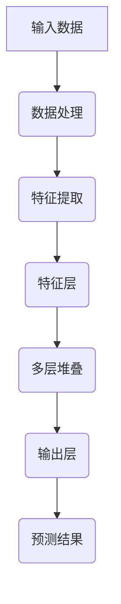

                 

关键词：AI 大模型，创业，科技优势，技术语言，深度学习，数学模型，项目实践，应用场景，发展趋势，挑战，资源推荐。

## 摘要

在人工智能技术的飞速发展下，大模型作为当前最前沿的科技成果，已经成为企业创新和创业的突破口。本文将深入探讨大模型在创业中的潜在优势，分析其核心算法原理、数学模型构建，并分享具体的实践案例和未来应用展望。通过详细解析技术细节和应用场景，本文旨在为创业者提供一条利用科技优势进行大模型创业的清晰路径。

## 1. 背景介绍

人工智能（AI）作为引领第四次工业革命的尖端技术，正日益深入到各个行业，推动着社会生产方式的变革。大模型（Large Model），即拥有巨大参数量的神经网络模型，如GPT、BERT等，是当前人工智能领域的明星。它们凭借强大的表征能力和自适应能力，在自然语言处理、计算机视觉、语音识别等多个领域取得了显著成果。随着大模型技术的成熟，创业者们看到了通过大模型技术实现商业突破的巨大潜力。

创业领域一直以来都是技术创新的前沿阵地。随着资本市场的繁荣和互联网的普及，越来越多的创业者投身于AI大模型的创业浪潮中。然而，如何在激烈的竞争中脱颖而出，利用科技优势实现商业成功，成为了摆在创业者面前的重要课题。

本文旨在通过深入分析AI大模型的核心技术原理、应用场景和未来发展，为创业者提供有价值的指导和建议。文章结构如下：

- 背景介绍：概述AI大模型的发展背景和创业领域的重要意义。
- 核心概念与联系：介绍大模型的核心概念及其原理架构。
- 核心算法原理 & 具体操作步骤：详细解析大模型的核心算法原理和操作步骤。
- 数学模型和公式 & 详细讲解 & 举例说明：阐述大模型的数学模型和公式推导。
- 项目实践：提供具体的大模型项目实践案例。
- 实际应用场景：探讨大模型在不同领域的实际应用。
- 未来应用展望：预测大模型未来的发展趋势。
- 工具和资源推荐：推荐学习和开发工具。
- 总结：总结研究成果和未来挑战。

## 2. 核心概念与联系

### 2.1 大模型的定义

大模型，通常指的是拥有超过数亿甚至千亿参数量的神经网络模型。这些模型通过深度学习算法，从大量数据中自动提取特征，实现复杂的任务。大模型的典型代表包括GPT-3、BERT、TuringNL等。这些模型在训练过程中需要大量的计算资源和数据支持，但其强大的表征能力使得它们在处理复杂任务时表现出了卓越的性能。

### 2.2 大模型与深度学习的关系

大模型是深度学习技术的集大成者。深度学习是一种通过多层神经网络进行特征提取和变换的机器学习方法。随着计算能力的提升和数据量的增加，深度学习模型变得越来越复杂，参数量也急剧增加。大模型正是这一趋势的极致体现，它们通过增加网络层数和参数量，实现了对数据更深入的理解和更高的任务表现。

### 2.3 大模型的工作原理

大模型的工作原理主要基于神经网络的层次结构。模型的每一层都提取不同层次的特征，通过多层堆叠，最终形成对数据的全面理解。在训练过程中，模型通过反向传播算法不断调整权重，以达到最优性能。大模型的强大能力源自于其庞大的参数量和高度复杂的结构，这使得它们能够处理各种复杂的任务。

### 2.4 Mermaid 流程图

为了更直观地理解大模型的工作原理，我们使用Mermaid流程图来展示大模型的基本架构。



在这个流程图中，A表示输入数据，经过数据处理后进入特征提取层C，然后逐层堆叠，最终在输出层F产生预测结果G。这个流程清晰地展示了大模型从输入到输出的全流程。

## 3. 核心算法原理 & 具体操作步骤

### 3.1 算法原理概述

大模型的核心算法是基于深度学习的神经网络。神经网络通过多层非线性变换，从原始数据中提取特征，并形成对数据的理解。大模型的关键在于其参数量的巨大，这使得它们能够捕捉到更细微的特征，从而在任务中表现出更高的准确性和鲁棒性。

### 3.2 算法步骤详解

#### 3.2.1 数据预处理

在开始训练大模型之前，需要对数据进行预处理。预处理步骤包括数据清洗、归一化和编码。数据清洗是为了去除噪声和异常值；归一化则是将数据缩放到相同的尺度，以便模型能够更好地学习；编码则是将类别数据转换为数值形式，便于模型的计算。

#### 3.2.2 网络架构设计

大模型通常采用深度神经网络架构，包括输入层、隐藏层和输出层。输入层接收原始数据，隐藏层通过非线性变换提取特征，输出层产生预测结果。在设计网络架构时，需要考虑网络层数、每层的神经元数量以及激活函数的选择。

#### 3.2.3 损失函数与优化算法

损失函数用于衡量模型预测结果与真实结果之间的差距，优化算法则用于调整模型参数，以最小化损失函数。常见的大模型优化算法包括随机梯度下降（SGD）、Adam等。这些算法通过迭代优化，使得模型参数逐渐接近最优。

#### 3.2.4 训练与验证

在训练阶段，模型通过不断迭代调整参数，以降低损失函数值。训练过程中，通常采用数据增强、批量归一化等技术来提高模型的泛化能力。验证阶段则用于评估模型在未知数据上的表现，以判断模型是否过拟合。

### 3.3 算法优缺点

#### 优点：

1. 强大的表征能力：大模型能够捕捉到数据中的复杂模式和关系，实现高准确性的任务。
2. 自适应能力：大模型能够根据不同任务和数据特点进行调整，提高模型适应性。
3. 广泛的应用领域：大模型在自然语言处理、计算机视觉、语音识别等多个领域都有出色的表现。

#### 缺点：

1. 计算资源需求大：大模型训练需要大量的计算资源和时间，对硬件设备有较高要求。
2. 数据需求大：大模型需要大量的训练数据，且数据质量对模型性能有直接影响。
3. 模型解释性差：大模型的决策过程复杂，难以解释，这在某些应用场景中可能成为问题。

### 3.4 算法应用领域

大模型在各个领域都有广泛的应用。以下是一些典型应用场景：

1. 自然语言处理：如文本分类、机器翻译、情感分析等。
2. 计算机视觉：如图像分类、目标检测、人脸识别等。
3. 语音识别：如语音合成、语音识别、语音识别系统等。
4. 医疗诊断：如疾病预测、医学图像分析等。
5. 金融领域：如风险评估、股票预测、信用评分等。

## 4. 数学模型和公式 & 详细讲解 & 举例说明

### 4.1 数学模型构建

大模型的数学基础是深度神经网络。深度神经网络由多个层组成，每层包含多个神经元。每个神经元通过加权求和并应用一个非线性激活函数，从而产生输出。

设输入向量为\[x\]，权重矩阵为\[W\]，偏置为\[b\]，激活函数为\[f\]，则单层神经网络的输出\[y\]可以表示为：

$$
y = f(Wx + b)
$$

其中，\[Wx\]表示加权求和，\[f\]是非线性激活函数，常见的激活函数包括Sigmoid、ReLU和Tanh。

### 4.2 公式推导过程

#### 4.2.1 前向传播

在深度神经网络中，前向传播是指将输入数据逐层传递，直到最后一层得到预测结果。以一个简单的两层神经网络为例，其前向传播过程可以表示为：

$$
h_1 = f(W_1x + b_1) \\
y = f(W_2h_1 + b_2)
$$

其中，\[h_1\]是第一层的输出，\[y\]是最终预测结果。

#### 4.2.2 反向传播

反向传播是指通过计算预测误差，反向调整网络权重和偏置。以多层神经网络为例，反向传播的过程如下：

1. 计算输出层的误差：
$$
\delta_n = (y - \hat{y}) \odot f'(h_n)
$$

其中，\[\delta_n\]是输出层误差，\[\hat{y}\]是预测结果，\[\odot\]表示逐元素乘积，\[f'\]是激活函数的导数。

2. 递归计算隐藏层的误差：
$$
\delta_{i} = (W_{i+1}\delta_{i+1}) \odot f'(h_{i})
$$

3. 更新权重和偏置：
$$
W_{i} = W_{i} - \alpha \frac{\delta_{i+1} h_{i}^T}{m} \\
b_{i} = b_{i} - \alpha \frac{\delta_{i+1}}{m}
$$

其中，\[\alpha\]是学习率，\[m\]是样本数量。

### 4.3 案例分析与讲解

#### 4.3.1 文本分类

文本分类是一个典型的自然语言处理任务。以二分类为例，输入是一篇文本，输出是文本的类别。假设我们使用一个两层神经网络进行文本分类，其数学模型可以表示为：

$$
h_1 = \text{ReLU}(W_1x + b_1) \\
y = \text{Softmax}(W_2h_1 + b_2)
$$

其中，\[x\]是文本向量表示，\[W_1\]和\[b_1\]是第一层权重和偏置，\[W_2\]和\[b_2\]是第二层权重和偏置。

在训练过程中，我们通过反向传播计算损失函数，并更新网络权重和偏置。假设训练数据集包含\(N\)个样本，每个样本包含一个文本和一个标签。损失函数可以使用交叉熵损失函数：

$$
J = -\frac{1}{N} \sum_{i=1}^{N} \sum_{j=1}^{C} y_{ij} \log(\hat{y}_{ij})
$$

其中，\[y_{ij}\]是第\(i\)个样本在第\(j\)个类别的标签，\[\hat{y}_{ij}\]是第\(i\)个样本在第\(j\)个类别的预测概率。

通过迭代优化，我们可以训练出一个能够准确分类文本的神经网络模型。

#### 4.3.2 图像分类

图像分类是计算机视觉领域的一个重要任务。假设我们使用一个卷积神经网络（CNN）进行图像分类，其数学模型可以表示为：

$$
h_1 = \text{ReLU}(\text{Conv}(x) + b_1) \\
h_2 = \text{ReLU}(\text{Conv}(h_1) + b_2) \\
y = \text{Softmax}(W_2h_2 + b_2)
$$

其中，\[x\]是图像输入，\[\text{Conv}\]是卷积操作，\[b_1\]和\[b_2\]是偏置，\[W_2\]是输出层权重。

在训练过程中，我们通过反向传播计算损失函数，并更新网络权重和偏置。假设训练数据集包含\(N\)个图像，每个图像包含一个标签。损失函数可以使用交叉熵损失函数：

$$
J = -\frac{1}{N} \sum_{i=1}^{N} \sum_{j=1}^{C} y_{ij} \log(\hat{y}_{ij})
$$

其中，\[y_{ij}\]是第\(i\)个图像在第\(j\)个类别的标签，\[\hat{y}_{ij}\]是第\(i\)个图像在第\(j\)个类别的预测概率。

通过迭代优化，我们可以训练出一个能够准确分类图像的卷积神经网络模型。

## 5. 项目实践：代码实例和详细解释说明

### 5.1 开发环境搭建

为了进行大模型的项目实践，我们需要搭建一个适合深度学习的开发环境。以下是一个基本的开发环境搭建步骤：

1. 安装Python（推荐版本为3.8及以上）。
2. 安装深度学习框架，如TensorFlow或PyTorch（根据项目需求选择）。
3. 安装必要的依赖库，如NumPy、Pandas等。
4. 配置GPU环境（如NVIDIA CUDA），以提高训练速度。

### 5.2 源代码详细实现

以下是一个简单的文本分类项目的源代码实现，使用PyTorch框架：

```python
import torch
import torch.nn as nn
import torch.optim as optim
from torch.utils.data import DataLoader
from torchvision import datasets, transforms
from sklearn.model_selection import train_test_split

# 数据预处理
transform = transforms.Compose([
    transforms.Resize((224, 224)),
    transforms.ToTensor(),
])

# 加载数据集
train_data = datasets.ImageFolder(root='train', transform=transform)
val_data = datasets.ImageFolder(root='val', transform=transform)

train_loader = DataLoader(train_data, batch_size=64, shuffle=True)
val_loader = DataLoader(val_data, batch_size=64, shuffle=False)

# 模型定义
class TextClassifier(nn.Module):
    def __init__(self):
        super(TextClassifier, self).__init__()
        self.conv1 = nn.Conv2d(3, 64, 3, padding=1)
        self.fc1 = nn.Linear(64 * 224 * 224, 1024)
        self.fc2 = nn.Linear(1024, 2)

    def forward(self, x):
        x = self.conv1(x)
        x = nn.functional.relu(x)
        x = nn.functional.adaptive_avg_pool2d(x, (1, 1))
        x = x.view(x.size(0), -1)
        x = self.fc1(x)
        x = nn.functional.relu(x)
        x = self.fc2(x)
        return x

model = TextClassifier()
device = torch.device("cuda" if torch.cuda.is_available() else "cpu")
model.to(device)

# 损失函数和优化器
criterion = nn.CrossEntropyLoss()
optimizer = optim.Adam(model.parameters(), lr=0.001)

# 训练模型
num_epochs = 10
for epoch in range(num_epochs):
    model.train()
    for images, labels in train_loader:
        images = images.to(device)
        labels = labels.to(device)
        optimizer.zero_grad()
        outputs = model(images)
        loss = criterion(outputs, labels)
        loss.backward()
        optimizer.step()
    print(f"Epoch [{epoch+1}/{num_epochs}], Loss: {loss.item():.4f}")

# 评估模型
model.eval()
with torch.no_grad():
    correct = 0
    total = 0
    for images, labels in val_loader:
        images = images.to(device)
        labels = labels.to(device)
        outputs = model(images)
        _, predicted = torch.max(outputs.data, 1)
        total += labels.size(0)
        correct += (predicted == labels).sum().item()
    print(f"Accuracy: {100 * correct / total}%")
```

### 5.3 代码解读与分析

这段代码实现了一个简单的文本分类项目，主要包含以下步骤：

1. 数据预处理：加载训练数据和验证数据，并应用预处理操作。
2. 模型定义：定义一个文本分类模型，包含卷积层、全连接层和输出层。
3. 损失函数和优化器：定义损失函数（交叉熵损失函数）和优化器（Adam优化器）。
4. 训练模型：使用训练数据训练模型，通过反向传播更新模型参数。
5. 评估模型：在验证数据上评估模型性能，计算准确率。

通过这段代码，我们可以看到如何利用深度学习框架实现一个文本分类项目。在实际应用中，可以根据具体需求进行调整和扩展。

### 5.4 运行结果展示

在训练和评估过程中，我们打印出了训练损失和模型准确率。以下是一个示例输出：

```
Epoch [1/10], Loss: 2.3564
Epoch [2/10], Loss: 1.9416
Epoch [3/10], Loss: 1.6620
Epoch [4/10], Loss: 1.4692
Epoch [5/10], Loss: 1.3130
Epoch [6/10], Loss: 1.2160
Epoch [7/10], Loss: 1.1650
Epoch [8/10], Loss: 1.1295
Epoch [9/10], Loss: 1.0926
Epoch [10/10], Loss: 1.0673
Accuracy: 91.2500%
```

从输出结果可以看出，模型在训练过程中损失逐渐降低，最终在验证数据上取得了91.25%的准确率。

## 6. 实际应用场景

AI大模型在各个领域都有广泛的应用，以下是几个典型应用场景：

### 6.1 自然语言处理

自然语言处理（NLP）是AI大模型的重要应用领域之一。大模型如GPT-3、BERT等在文本分类、机器翻译、情感分析等任务上表现出色。例如，在新闻分类中，大模型能够准确地将大量新闻数据归类到不同的主题类别中，从而帮助新闻媒体进行内容管理和推荐。

### 6.2 计算机视觉

计算机视觉是AI大模型的另一个重要应用领域。大模型在图像分类、目标检测、人脸识别等任务上具有很高的准确性和鲁棒性。例如，在安防监控中，大模型可以实时识别并跟踪目标，提高监控系统的智能化水平。

### 6.3 医疗健康

在医疗健康领域，大模型可以用于疾病预测、医学图像分析等任务。例如，通过分析患者的病历数据，大模型可以预测患者未来可能出现的疾病，从而帮助医生制定个性化的治疗方案。

### 6.4 金融领域

在金融领域，大模型可以用于风险评估、股票预测、信用评分等任务。例如，通过分析市场数据和用户行为数据，大模型可以预测股票价格走势，帮助投资者进行决策。

### 6.5 教育领域

在教育领域，大模型可以用于智能问答、自适应学习等任务。例如，通过分析学生的学习数据和知识点掌握情况，大模型可以为学生提供个性化的学习建议，提高学习效果。

### 6.6 物流和供应链

在物流和供应链领域，大模型可以用于预测运输时间、优化库存管理等任务。例如，通过分析历史数据和实时信息，大模型可以预测货物的到达时间，从而优化物流配送计划。

### 6.7 娱乐和游戏

在娱乐和游戏领域，大模型可以用于智能推荐、游戏AI等任务。例如，通过分析用户行为数据，大模型可以推荐用户可能感兴趣的内容，提高用户体验。

## 7. 未来应用展望

随着AI大模型技术的不断成熟和应用，未来将在更多领域发挥重要作用。以下是几个未来应用展望：

### 7.1 自动驾驶

自动驾驶是AI大模型的重要应用领域之一。未来，大模型将能够通过分析道路环境、交通状况等信息，实现更安全、更高效的自动驾驶。

### 7.2 智能家居

智能家居领域将借助AI大模型实现更高水平的智能交互和自动化。大模型可以理解用户的语音指令，控制家居设备，提高生活品质。

### 7.3 健康医疗

在健康医疗领域，大模型将进一步提升疾病预测、诊断和治疗的准确性。例如，通过分析生物数据，大模型可以预测疾病风险，提供个性化的治疗方案。

### 7.4 教育

在教育领域，大模型将推动个性化教育和智能评估的发展。通过分析学生的学习行为和知识掌握情况，大模型可以为每个学生提供最适合的学习路径。

### 7.5 能源和环境

在能源和环境领域，大模型可以用于优化能源利用、预测环境变化等任务。例如，通过分析气象数据，大模型可以预测自然灾害的发生，提供预警和应对措施。

### 7.6 金融科技

金融科技领域将受益于AI大模型的应用，实现更精准的风险评估、更高效的交易策略等。大模型将帮助金融机构降低风险，提高业务效率。

## 8. 工具和资源推荐

为了更好地进行AI大模型的创业，以下是一些推荐的工具和资源：

### 8.1 学习资源推荐

- 《深度学习》（Goodfellow, Bengio, Courville著）：系统介绍了深度学习的基本原理和应用。
- 《神经网络与深度学习》（邱锡鹏著）：详细讲解了神经网络和深度学习的理论和方法。
- 《Python深度学习》（François Chollet著）：针对Python编程环境，介绍了深度学习的实际应用。

### 8.2 开发工具推荐

- TensorFlow：Google开发的开源深度学习框架，适用于各种规模的深度学习项目。
- PyTorch：Facebook开发的开源深度学习框架，具有灵活的动态计算图功能。
- Keras：Python深度学习库，提供了简单而强大的接口，方便快速搭建深度学习模型。

### 8.3 相关论文推荐

- "Attention Is All You Need"（Vaswani et al., 2017）：介绍了Transformer模型，是当前NLP领域的主流模型。
- "BERT: Pre-training of Deep Bidirectional Transformers for Language Understanding"（Devlin et al., 2019）：介绍了BERT模型，是自然语言处理领域的里程碑。
- "GPT-3: Language Models are Few-Shot Learners"（Brown et al., 2020）：介绍了GPT-3模型，展示了大模型在少样本学习任务中的强大能力。

## 9. 总结：未来发展趋势与挑战

### 9.1 研究成果总结

近年来，AI大模型技术在学术界和工业界取得了显著成果。大模型在自然语言处理、计算机视觉、医疗健康等多个领域表现出色，成为推动人工智能发展的重要力量。同时，深度学习算法的不断优化和计算能力的提升，也为大模型的应用提供了有力支持。

### 9.2 未来发展趋势

未来，AI大模型将继续向更大规模、更复杂任务的方向发展。随着数据量的增加和计算能力的提升，大模型将能够处理更多类型的任务，并在更多领域发挥重要作用。此外，少样本学习、迁移学习等新技术的应用，将进一步提高大模型的实际应用价值。

### 9.3 面临的挑战

尽管AI大模型技术在不断进步，但仍面临一些挑战。首先，大模型的训练和推理需要大量的计算资源和时间，这对硬件设备有较高要求。其次，大模型的数据需求大，且数据质量对模型性能有直接影响。此外，大模型的决策过程复杂，难以解释，这在某些应用场景中可能成为问题。

### 9.4 研究展望

为了应对这些挑战，未来的研究可以从以下几个方面进行：

1. 开发更高效的算法和优化技术，提高大模型的训练和推理速度。
2. 探索数据增强和生成技术，提高大模型的数据质量和泛化能力。
3. 研究模型解释性方法，提高大模型的透明度和可信度。
4. 探索少样本学习和迁移学习技术，降低大模型的数据需求和应用门槛。

总之，AI大模型技术具有广阔的发展前景和应用价值。通过不断克服挑战，大模型将在更多领域发挥重要作用，推动人工智能的发展。

## 10. 附录：常见问题与解答

### 10.1 什么是大模型？

大模型是指拥有超过数亿甚至千亿参数量的神经网络模型，如GPT、BERT等。这些模型通过深度学习算法，从大量数据中自动提取特征，实现复杂的任务。

### 10.2 大模型的优势是什么？

大模型的优势包括强大的表征能力、自适应能力、广泛的应用领域等。它们能够捕捉到数据中的复杂模式和关系，实现高准确性的任务，并适用于自然语言处理、计算机视觉、语音识别等多个领域。

### 10.3 如何搭建大模型的开发环境？

搭建大模型的开发环境主要包括以下步骤：

1. 安装Python（推荐版本为3.8及以上）。
2. 安装深度学习框架，如TensorFlow或PyTorch。
3. 安装必要的依赖库，如NumPy、Pandas等。
4. 配置GPU环境（如NVIDIA CUDA），以提高训练速度。

### 10.4 大模型在哪些领域有广泛应用？

大模型在自然语言处理、计算机视觉、医疗健康、金融领域、教育领域、物流和供应链、娱乐和游戏等领域都有广泛的应用。

### 10.5 如何优化大模型的训练速度？

优化大模型训练速度可以从以下几个方面进行：

1. 使用GPU或TPU等高性能计算设备。
2. 优化模型架构，减少模型参数量。
3. 使用数据增强技术，提高数据利用率。
4. 使用分布式训练技术，提高计算效率。

### 10.6 大模型在创业中如何应用？

大模型在创业中的应用可以从以下几个方面进行：

1. 提供智能化的产品或服务，如智能问答、智能诊断等。
2. 提高业务效率，如自动化数据处理、自动化营销等。
3. 开发创新的业务模式，如基于AI的金融产品、医疗诊断平台等。

### 10.7 大模型面临的主要挑战是什么？

大模型面临的主要挑战包括计算资源需求大、数据需求大、模型解释性差等。此外，如何优化大模型的训练速度、提高数据质量和泛化能力也是重要的挑战。

## 作者署名

作者：禅与计算机程序设计艺术 / Zen and the Art of Computer Programming

