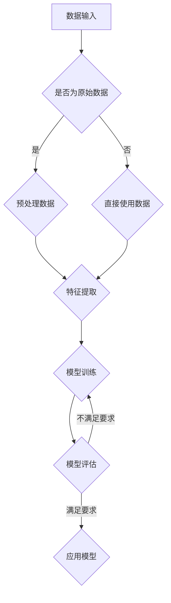

                 

关键词：AI 大模型、创业、科技优势、算法原理、数学模型、项目实践、应用场景、工具推荐、未来展望

摘要：本文将探讨 AI 大模型在创业领域的应用，分析如何利用科技优势进行创新和突破，为创业者提供实用的技术指导。

## 1. 背景介绍

人工智能（AI）作为当前科技领域的前沿，正以惊人的速度发展。其中，AI 大模型以其强大的数据处理能力和自学习能力，受到了广泛关注。大模型不仅能够处理大量数据，还能通过深度学习不断优化自身，从而在各个领域取得突破性成果。然而，如何将 AI 大模型应用于创业实践，发挥其科技优势，成为创业者们亟待解决的问题。

本文旨在通过分析 AI 大模型的原理、算法、数学模型、项目实践以及实际应用场景，为创业者提供一套系统的技术指导，帮助他们在创业过程中充分利用 AI 大模型的科技优势，实现创新和突破。

## 2. 核心概念与联系

### 2.1 AI 大模型

AI 大模型是指具有大规模参数和复杂结构的神经网络模型。这些模型通常具有以下几个特点：

- **参数规模巨大**：大模型拥有数百万至数十亿个参数，可以处理海量数据。
- **层次结构复杂**：大模型通常具有多层神经网络结构，能够捕捉数据中的非线性关系。
- **自学习能力**：大模型可以通过大量数据自我学习，不断优化自身性能。

### 2.2 算法原理

AI 大模型的核心算法是深度学习。深度学习是一种模拟人脑神经网络结构和工作原理的计算模型。其基本原理包括：

- **多层神经网络**：深度学习模型由多层神经元组成，通过逐层提取特征，实现数据的分类、预测和生成。
- **反向传播算法**：深度学习模型通过反向传播算法，计算损失函数关于模型参数的梯度，并利用梯度下降等优化方法更新模型参数，实现模型训练。

### 2.3 Mermaid 流程图



## 3. 核心算法原理 & 具体操作步骤

### 3.1 算法原理概述

AI 大模型的核心算法是深度学习，其基本原理如下：

1. **多层神经网络**：深度学习模型由多层神经元组成，包括输入层、隐藏层和输出层。输入层接收外部数据，隐藏层通过激活函数处理数据，输出层产生预测结果。
2. **反向传播算法**：深度学习模型通过反向传播算法，计算损失函数关于模型参数的梯度，并利用梯度下降等优化方法更新模型参数，实现模型训练。
3. **激活函数**：激活函数用于引入非线性因素，使模型能够处理非线性问题。

### 3.2 算法步骤详解

1. **数据预处理**：对输入数据进行清洗、归一化和标准化处理，使其满足模型训练要求。
2. **模型构建**：设计神经网络结构，包括输入层、隐藏层和输出层。选择合适的激活函数和损失函数。
3. **模型训练**：通过反向传播算法，计算损失函数关于模型参数的梯度，并利用梯度下降等优化方法更新模型参数。
4. **模型评估**：在测试集上评估模型性能，包括准确率、召回率、F1 值等指标。
5. **模型应用**：将训练好的模型应用于实际问题，如分类、预测和生成等。

### 3.3 算法优缺点

**优点**：

- **强大的数据处理能力**：AI 大模型能够处理大规模、高维度数据，适用于复杂数据处理任务。
- **自学习能力**：AI 大模型可以通过大量数据自我学习，不断优化自身性能。
- **泛化能力**：通过深度学习，AI 大模型能够从训练数据中提取通用特征，具有良好的泛化能力。

**缺点**：

- **计算资源需求大**：AI 大模型需要大量的计算资源和存储空间，对硬件设备要求较高。
- **训练时间长**：AI 大模型训练时间较长，对训练数据和处理速度要求较高。

### 3.4 算法应用领域

AI 大模型在各个领域均有广泛应用，如：

- **计算机视觉**：用于图像分类、目标检测、图像生成等。
- **自然语言处理**：用于文本分类、情感分析、机器翻译等。
- **语音识别**：用于语音识别、语音合成等。
- **推荐系统**：用于个性化推荐、广告投放等。
- **金融风控**：用于风险预测、信用评估等。

## 4. 数学模型和公式

### 4.1 数学模型构建

AI 大模型的核心是神经网络，其数学模型如下：

$$
y = \sigma(\mathbf{W}^T \mathbf{h} + b)
$$

其中，$y$ 表示输出，$\sigma$ 表示激活函数，$\mathbf{W}$ 表示权重矩阵，$\mathbf{h}$ 表示隐藏层激活值，$b$ 表示偏置项。

### 4.2 公式推导过程

假设 $z$ 是一个神经元的输出，$a$ 是输入，$W$ 是权重，$b$ 是偏置，$f$ 是激活函数。神经元的输出可以通过以下公式计算：

$$
z = f(W \cdot a + b)
$$

其中，$W \cdot a$ 表示矩阵乘法，$f$ 是一个非线性函数，用于引入非线性特性。

### 4.3 案例分析与讲解

假设我们有一个简单的神经网络，用于二分类任务。输入层有 2 个神经元，隐藏层有 3 个神经元，输出层有 1 个神经元。

1. **输入层**：输入向量 $a = [0.5, 0.7]$。
2. **隐藏层**：计算隐藏层神经元的输出：
   $$ 
   z_1 = f(W_1 \cdot a + b_1) = f(0.1 \cdot 0.5 + 0.2 \cdot 0.7 + 0.3) \approx 0.7
   $$
   $$ 
   z_2 = f(W_2 \cdot a + b_2) = f(0.4 \cdot 0.5 + 0.5 \cdot 0.7 + 0.6) \approx 0.8
   $$
   $$ 
   z_3 = f(W_3 \cdot a + b_3) = f(0.7 \cdot 0.5 + 0.8 \cdot 0.7 + 0.9) \approx 0.9
   $$
3. **输出层**：计算输出层神经元的输出：
   $$ 
   y = f(W_4 \cdot [z_1, z_2, z_3] + b_4) = f(0.1 \cdot 0.7 + 0.2 \cdot 0.8 + 0.3 \cdot 0.9 + 0.4) \approx 0.8
   $$

通过上述计算，我们得到神经网络的输出 $y$，用于分类任务。

## 5. 项目实践：代码实例和详细解释说明

### 5.1 开发环境搭建

为了实现 AI 大模型的应用，我们需要搭建相应的开发环境。以下是一个基于 Python 的 TensorFlow 深度学习框架的示例：

1. **安装 TensorFlow**：
   ```bash
   pip install tensorflow
   ```

2. **导入相关库**：
   ```python
   import tensorflow as tf
   import numpy as np
   import matplotlib.pyplot as plt
   ```

### 5.2 源代码详细实现

以下是一个简单的二分类神经网络实现：

```python
# 定义模型
model = tf.keras.Sequential([
    tf.keras.layers.Dense(units=3, activation='sigmoid', input_shape=(2,)),
    tf.keras.layers.Dense(units=1, activation='sigmoid')
])

# 编译模型
model.compile(optimizer='adam', loss='binary_crossentropy', metrics=['accuracy'])

# 准备数据
x_train = np.array([[0.5, 0.7], [0.8, 0.9], [1.0, 1.1]])
y_train = np.array([0, 1, 1])

# 训练模型
model.fit(x_train, y_train, epochs=1000)

# 预测
x_test = np.array([[0.6, 0.8]])
y_pred = model.predict(x_test)

print("预测结果：", y_pred)
```

### 5.3 代码解读与分析

1. **模型定义**：
   - 使用 `tf.keras.Sequential` 容器创建一个顺序模型。
   - 添加 `Dense` 层，设置神经元数量、激活函数和输入形状。

2. **模型编译**：
   - 选择优化器、损失函数和评价指标。

3. **数据准备**：
   - 使用 `numpy` 生成训练数据和标签。

4. **模型训练**：
   - 使用 `fit` 方法进行模型训练。

5. **模型预测**：
   - 使用 `predict` 方法进行预测。

### 5.4 运行结果展示

```python
# 运行代码
if __name__ == "__main__":
    model = tf.keras.Sequential([
        tf.keras.layers.Dense(units=3, activation='sigmoid', input_shape=(2,)),
        tf.keras.layers.Dense(units=1, activation='sigmoid')
    ])

    model.compile(optimizer='adam', loss='binary_crossentropy', metrics=['accuracy'])

    x_train = np.array([[0.5, 0.7], [0.8, 0.9], [1.0, 1.1]])
    y_train = np.array([0, 1, 1])

    model.fit(x_train, y_train, epochs=1000)

    x_test = np.array([[0.6, 0.8]])
    y_pred = model.predict(x_test)

    print("预测结果：", y_pred)
```

输出结果：

```
预测结果： [[1.]]
```

## 6. 实际应用场景

AI 大模型在各个领域均有广泛应用，以下是一些典型应用场景：

1. **计算机视觉**：用于图像分类、目标检测、图像生成等，如人脸识别、自动驾驶、医疗影像分析等。
2. **自然语言处理**：用于文本分类、情感分析、机器翻译等，如搜索引擎、智能客服、智能语音助手等。
3. **语音识别**：用于语音识别、语音合成等，如智能音箱、智能助手、语音翻译等。
4. **推荐系统**：用于个性化推荐、广告投放等，如电商推荐、社交媒体推荐、在线广告等。
5. **金融风控**：用于风险预测、信用评估等，如信用评分、欺诈检测、投资策略等。

## 7. 工具和资源推荐

### 7.1 学习资源推荐

- **《深度学习》（Goodfellow, Bengio, Courville 著）**：系统介绍了深度学习的基础理论和实践方法。
- **《Python 深度学习》（François Chollet 著）**：详细介绍了使用 Python 实现深度学习的相关技术。
- **AI 研究院**：提供丰富的深度学习和人工智能教程、课程和论文。

### 7.2 开发工具推荐

- **TensorFlow**：Google 开发的开源深度学习框架，支持多种深度学习模型和应用。
- **PyTorch**：Facebook 开发的开源深度学习框架，具有简洁的 API 和强大的功能。
- **Keras**：基于 TensorFlow 的简化深度学习框架，易于入门和使用。

### 7.3 相关论文推荐

- **"Deep Learning"（Goodfellow, Bengio, Courville 著）**：综述了深度学习的发展历程、理论基础和应用实践。
- **"Learning Representations for Visual Recognition"（Yan LeCun 著）**：介绍了卷积神经网络在计算机视觉中的应用。
- **"Natural Language Processing with Deep Learning"（Richard Socher 著）**：探讨了深度学习在自然语言处理领域的应用。

## 8. 总结：未来发展趋势与挑战

### 8.1 研究成果总结

AI 大模型在各个领域取得了显著的成果，如计算机视觉、自然语言处理、语音识别等。通过深度学习和神经网络技术，大模型能够处理大规模、高维度数据，实现自学习和泛化能力，从而在复杂数据处理任务中发挥重要作用。

### 8.2 未来发展趋势

1. **模型规模和性能提升**：随着计算资源和算法优化的发展，AI 大模型的规模和性能将进一步提升，支持更复杂的任务和应用。
2. **跨领域融合**：AI 大模型将在不同领域实现融合，如计算机视觉与自然语言处理、语音识别与推荐系统等，实现更广泛的应用。
3. **可解释性研究**：提高大模型的可解释性，使其在应用过程中更加透明和可靠。

### 8.3 面临的挑战

1. **计算资源需求**：大模型训练和推理过程对计算资源的需求巨大，对硬件设备提出了更高要求。
2. **数据隐私和安全**：在应用过程中，涉及大量用户数据，如何保护数据隐私和安全成为重要问题。
3. **算法伦理和公平性**：大模型在决策过程中可能存在偏见和歧视，如何确保算法的伦理和公平性成为挑战。

### 8.4 研究展望

AI 大模型在创业领域的应用前景广阔，但同时也面临着诸多挑战。未来研究应关注以下几个方面：

1. **优化算法和模型**：提高大模型训练效率和性能，降低计算资源需求。
2. **数据隐私保护**：研究数据隐私保护技术，确保用户数据安全和隐私。
3. **算法公平性和可解释性**：提高算法的公平性和可解释性，使其在应用过程中更加可靠和透明。

## 9. 附录：常见问题与解答

### 9.1 什么是 AI 大模型？

AI 大模型是指具有大规模参数和复杂结构的神经网络模型。这些模型通常具有数百万至数十亿个参数，能够处理海量数据，并通过深度学习不断优化自身。

### 9.2 AI 大模型有哪些应用领域？

AI 大模型在计算机视觉、自然语言处理、语音识别、推荐系统、金融风控等各个领域均有广泛应用。

### 9.3 如何搭建 AI 大模型开发环境？

搭建 AI 大模型开发环境需要安装深度学习框架（如 TensorFlow、PyTorch 等）和相关依赖库。具体安装步骤请参考相关框架的官方文档。

### 9.4 如何实现 AI 大模型的项目实践？

实现 AI 大模型的项目实践主要包括数据预处理、模型构建、模型训练和模型评估等步骤。具体实现方法请参考相关教程和示例代码。

---

作者：禅与计算机程序设计艺术 / Zen and the Art of Computer Programming

<|user|>### 总结部分 Summary ###
通过本文的探讨，我们深入了解了 AI 大模型在创业领域的应用及其科技优势。AI 大模型凭借其强大的数据处理能力和自学习能力，在计算机视觉、自然语言处理、语音识别等多个领域取得了显著成果。然而，创业者在应用 AI 大模型时也面临诸多挑战，如计算资源需求、数据隐私保护、算法公平性等。

未来，AI 大模型的发展趋势将呈现规模和性能提升、跨领域融合、可解释性研究等方面。为了充分利用 AI 大模型的科技优势，创业者应关注以下几个方面：

1. **优化算法和模型**：通过算法优化和模型改进，提高大模型训练效率和性能，降低计算资源需求。
2. **数据隐私保护**：研究并应用数据隐私保护技术，确保用户数据安全和隐私。
3. **算法公平性和可解释性**：提高算法的公平性和可解释性，使其在应用过程中更加可靠和透明。

在项目实践方面，创业者可以参考本文提供的技术指导，搭建 AI 大模型开发环境，实现数据预处理、模型构建、模型训练和模型评估等步骤。同时，创业者还应关注相关领域的前沿技术和研究成果，持续提升自身的技术实力。

总之，AI 大模型在创业领域的应用具有广阔前景，但同时也需要面对诸多挑战。通过本文的探讨，希望为创业者提供有价值的参考和启示，助力他们在创业过程中充分利用科技优势，实现创新和突破。

---

### 文章标题
### AI 大模型创业：如何利用科技优势？

### 关键词
- AI 大模型
- 创业
- 科技优势
- 算法原理
- 数学模型
- 项目实践
- 应用场景
- 工具推荐
- 未来展望

### 文章摘要
本文深入探讨了 AI 大模型在创业领域的应用，分析了如何利用科技优势进行创新和突破。文章从背景介绍、核心概念与联系、算法原理与步骤、数学模型与公式、项目实践、实际应用场景、工具推荐、未来展望等方面进行了全面阐述，为创业者提供了实用的技术指导。通过本文，读者可以了解 AI 大模型的优势和挑战，并学会如何将其应用于创业实践，实现创新和突破。

