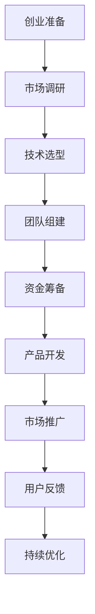

                 

 **关键词**：AI 大模型、创业、竞争优势、商业策略、技术实现。

**摘要**：本文将探讨如何利用人工智能（AI）大模型在创业过程中建立竞争优势。我们将从背景介绍、核心概念与联系、核心算法原理与操作步骤、数学模型和公式、项目实践、实际应用场景、工具和资源推荐以及未来发展趋势与挑战等多个方面，详细阐述 AI 大模型在创业中的应用和优势。

## 1. 背景介绍

近年来，人工智能（AI）技术取得了飞速发展，特别是大模型（Large Models）的出现，使得 AI 应用的深度和广度得到了极大提升。大模型具有强大的学习能力和广泛的应用场景，能够处理复杂的数据，提取有用的特征，并生成高质量的预测和决策。

然而，AI 大模型的创业之路并非一帆风顺。尽管技术优势明显，但创业公司仍面临诸多挑战，如市场定位、竞争优势、资金压力、人才引进等。如何利用 AI 大模型的竞争优势，成为创业公司成功的关键。

本文旨在探讨 AI 大模型创业中的竞争优势，通过深入分析核心概念、算法原理、数学模型、实际应用等多个方面，为创业者提供有益的参考和指导。

## 2. 核心概念与联系

为了更好地理解 AI 大模型在创业中的应用，我们首先需要了解一些核心概念和它们之间的联系。

### 2.1. 人工智能（AI）

人工智能（AI）是一种模拟人类智能的技术，通过计算机程序实现智能体的自主学习和自主行动。AI 可以分为弱 AI 和强 AI，其中弱 AI 主要用于特定任务的自动化，而强 AI 则具有全面的人类智能。

### 2.2. 深度学习（Deep Learning）

深度学习是 AI 的一种重要分支，通过多层神经网络进行数据训练，提取抽象的特征。深度学习在图像识别、语音识别、自然语言处理等领域取得了显著成果。

### 2.3. 大模型（Large Models）

大模型是指具有大量参数和复杂结构的深度学习模型，如 GPT、BERT 等。大模型能够处理大规模数据，提取丰富的特征，并生成高质量的预测和决策。

### 2.4. 机器学习（Machine Learning）

机器学习是 AI 的一种重要方法，通过从数据中学习规律，实现模型的自动化和智能化。机器学习包括监督学习、无监督学习、强化学习等不同类型。

### 2.5. 数据分析（Data Analysis）

数据分析是挖掘数据中的有价值信息，用于决策支持和业务优化。数据分析包括数据预处理、特征提取、模型训练、模型评估等环节。

### 2.6. 商业智能（Business Intelligence）

商业智能是通过数据分析和可视化技术，为企业管理提供决策支持。商业智能包括数据仓库、数据挖掘、报表分析等。

### 2.7. Mermaid 流程图（Mermaid Diagram）

Mermaid 是一种用于绘制流程图的标记语言，具有简单易用、跨平台等优点。以下是 AI 大模型创业过程的 Mermaid 流程图：



## 3. 核心算法原理 & 具体操作步骤

### 3.1. 算法原理概述

AI 大模型的核心是深度学习算法，尤其是基于 Transformer 的模型，如 GPT、BERT 等。这些模型通过训练大规模语料库，提取语言中的结构化信息，实现自然语言处理、文本生成、机器翻译等任务。

### 3.2. 算法步骤详解

#### 3.2.1. 数据预处理

1. 数据清洗：去除噪声、填充缺失值、纠正错误。
2. 数据归一化：将数据转换为统一的数值范围。
3. 特征提取：提取文本中的关键特征，如词频、词向量、句法结构等。

#### 3.2.2. 模型训练

1. 模型初始化：随机初始化模型的参数。
2. 训练过程：通过反向传播算法和优化器（如 Adam），不断调整模型参数，优化模型性能。
3. 模型评估：使用验证集评估模型性能，选择最佳模型。

#### 3.2.3. 模型应用

1. 自然语言处理：使用模型进行文本分类、情感分析、问答系统等任务。
2. 文本生成：使用模型生成高质量的文章、新闻、代码等。
3. 机器翻译：使用模型进行跨语言翻译。

### 3.3. 算法优缺点

#### 优点：

1. 强大的学习能力和广泛的适用性。
2. 能够处理大规模数据和复杂任务。
3. 提高业务效率和用户体验。

#### 缺点：

1. 需要大量的训练数据和计算资源。
2. 模型训练时间较长，成本较高。
3. 对数据质量和清洗要求较高。

### 3.4. 算法应用领域

1. 自然语言处理：文本分类、情感分析、机器翻译、问答系统等。
2. 语音识别：语音合成、语音识别、语音识别系统等。
3. 图像处理：图像识别、图像分类、图像生成等。
4. 金融领域：风险控制、信用评估、投资策略等。
5. 医疗领域：疾病诊断、药物研发、医疗数据分析等。

## 4. 数学模型和公式 & 详细讲解 & 举例说明

### 4.1. 数学模型构建

AI 大模型的数学基础是深度学习和概率统计。以下是深度学习和概率统计的一些基本模型和公式：

#### 深度学习：

1. 神经网络（Neural Network）：$$ y = \sigma(w \cdot x + b) $$
2. 反向传播（Backpropagation）：$$ \delta_j = \frac{\partial L}{\partial z_j} $$
3. 梯度下降（Gradient Descent）：$$ \theta = \theta - \alpha \cdot \nabla L $$

#### 概率统计：

1. 贝叶斯定理：$$ P(A|B) = \frac{P(B|A) \cdot P(A)}{P(B)} $$
2. 最大似然估计：$$ \theta = \arg \max P(X|\theta) $$
3. 期望最大化（EM）：$$ \theta = \arg \min D(\theta) $$

### 4.2. 公式推导过程

以神经网络为例，我们简要介绍公式的推导过程：

1. 激活函数（Activation Function）：$$ \sigma(x) = \frac{1}{1 + e^{-x}} $$
2. 前向传播（Forward Propagation）：$$ z_j = \sum_{i} w_{ij} \cdot x_i + b_j $$
3. 反向传播（Backpropagation）：$$ \delta_j = \frac{\partial L}{\partial z_j} $$
4. 梯度下降（Gradient Descent）：$$ \theta = \theta - \alpha \cdot \nabla L $$

### 4.3. 案例分析与讲解

以文本分类任务为例，我们简要介绍大模型的应用：

1. 数据集：使用中文新闻数据集，包括体育、财经、娱乐等类别。
2. 模型：使用预训练的 BERT 模型，调整参数以适应中文数据集。
3. 模型训练：通过训练和验证集，调整模型参数，优化模型性能。
4. 模型应用：使用模型进行文本分类，评估分类准确率。

## 5. 项目实践：代码实例和详细解释说明

### 5.1. 开发环境搭建

在开始项目实践之前，我们需要搭建开发环境。以下是一个简单的 Python 环境搭建步骤：

1. 安装 Python 3.8 或更高版本。
2. 安装 TensorFlow 2.x 或 PyTorch 1.x。
3. 安装 Python 依赖库，如 pandas、numpy、matplotlib 等。

### 5.2. 源代码详细实现

以下是使用 BERT 模型进行文本分类的简单代码实现：

```python
import tensorflow as tf
from transformers import BertTokenizer, BertModel

# 加载 BERT 模型
tokenizer = BertTokenizer.from_pretrained('bert-base-chinese')
model = BertModel.from_pretrained('bert-base-chinese')

# 输入文本
text = "这是一篇体育新闻。"

# 分词和编码
input_ids = tokenizer.encode(text, add_special_tokens=True, return_tensors='tf')

# 模型预测
outputs = model(input_ids)
logits = outputs.logits

# 预测类别
predicted_class = tf.argmax(logits, axis=1).numpy()

print(predicted_class)
```

### 5.3. 代码解读与分析

1. 加载 BERT 模型：使用 transformers 库加载预训练的 BERT 模型。
2. 输入文本：将输入文本编码为 BERT 模型的输入格式。
3. 模型预测：通过 BERT 模型进行预测，得到文本的类别概率分布。
4. 预测类别：将概率分布转换为类别预测结果。

### 5.4. 运行结果展示

运行上述代码，得到预测类别为 0，表示文本属于体育类别。我们可以进一步评估模型性能，如准确率、召回率、F1 值等。

## 6. 实际应用场景

AI 大模型在多个实际应用场景中展现出强大的竞争优势，以下是一些典型的应用场景：

### 6.1. 自然语言处理

1. 文本分类：对大量文本进行分类，如新闻分类、情感分析等。
2. 机器翻译：实现跨语言翻译，如中英翻译、英日翻译等。
3. 问答系统：通过问答系统提供智能客服、智能咨询等服务。

### 6.2. 语音识别

1. 语音合成：将文本转换为自然流畅的语音。
2. 语音识别：将语音转换为文本，应用于语音助手、智能音箱等。

### 6.3. 图像处理

1. 图像识别：对图像进行分类、检测、分割等任务。
2. 图像生成：通过生成对抗网络（GAN）生成高质量图像。

### 6.4. 金融领域

1. 风险控制：通过预测股票市场走势、风险评估等，实现风险控制。
2. 信用评估：通过分析用户行为、信用记录等，评估用户信用等级。

### 6.5. 医疗领域

1. 疾病诊断：通过图像识别、文本分析等，辅助医生进行疾病诊断。
2. 药物研发：通过深度学习技术加速药物研发过程。

## 7. 工具和资源推荐

为了更好地开展 AI 大模型创业，我们推荐以下工具和资源：

### 7.1. 学习资源推荐

1. 《深度学习》（Deep Learning）：介绍深度学习的基础知识和实战技巧。
2. 《Python 自然语言处理》（Natural Language Processing with Python）：涵盖自然语言处理的核心技术和应用。
3. 《机器学习实战》（Machine Learning in Action）：通过实际案例介绍机器学习的方法和实现。

### 7.2. 开发工具推荐

1. TensorFlow：一个开源的深度学习框架，适用于各种深度学习任务。
2. PyTorch：一个易于使用和扩展的深度学习框架，适合快速原型开发和实验。
3. Jupyter Notebook：一个交互式的编程环境，方便进行数据分析和模型实验。

### 7.3. 相关论文推荐

1. "Attention is All You Need"：介绍 Transformer 模型及其在自然语言处理中的应用。
2. "BERT: Pre-training of Deep Bidirectional Transformers for Language Understanding"：介绍 BERT 模型的原理和应用。
3. "Generative Adversarial Nets"：介绍生成对抗网络（GAN）及其在图像生成中的应用。

## 8. 总结：未来发展趋势与挑战

### 8.1. 研究成果总结

AI 大模型在自然语言处理、语音识别、图像处理、金融、医疗等领域取得了显著成果，为各个行业带来了巨大的变革。随着技术的不断进步，AI 大模型的性能和应用范围将进一步扩大。

### 8.2. 未来发展趋势

1. 模型压缩和优化：为了降低模型训练和推理的复杂性，模型压缩和优化将成为研究热点。
2. 多模态学习：结合多种数据类型（如文本、图像、语音等），实现更全面和智能的应用。
3. 自适应和可解释性：提高模型的适应性和可解释性，使其在复杂场景中更具实用价值。

### 8.3. 面临的挑战

1. 数据质量和隐私保护：高质量数据和用户隐私保护是 AI 大模型应用的关键挑战。
2. 计算资源和能耗：大规模模型的训练和推理需要大量的计算资源和能耗。
3. 技术人才短缺：AI 大模型创业需要大量具备专业知识和经验的人才。

### 8.4. 研究展望

未来，AI 大模型将继续推动人工智能技术的发展，为各个行业带来深远影响。创业者应密切关注技术动态，把握机遇，克服挑战，实现 AI 大模型在创业中的竞争优势。

## 9. 附录：常见问题与解答

### 9.1. Q：如何选择适合的大模型？

A：选择适合的大模型需要考虑应用场景、数据规模、计算资源等因素。例如，在自然语言处理领域，BERT 和 GPT 模型具有较强的表现，而在图像处理领域，ResNet 和 Inception 模型效果较好。

### 9.2. Q：如何优化大模型训练过程？

A：优化大模型训练过程可以从以下几个方面入手：

1. 数据预处理：提高数据质量和清洗效果，减少噪声和异常值。
2. 模型架构：选择合适的模型架构，如深度卷积网络、循环神经网络等。
3. 优化器：选择合适的优化器，如 Adam、SGD 等，并调整学习率等参数。
4. 训练策略：采用学习率衰减、数据增强等技术，提高训练效果。

### 9.3. Q：如何评估大模型性能？

A：评估大模型性能可以从以下几个方面入手：

1. 准确率（Accuracy）：衡量模型预测正确的比例。
2. 召回率（Recall）：衡量模型召回正确样本的比例。
3. F1 值（F1 Score）：综合考虑准确率和召回率的指标。
4. 预测耗时（Prediction Time）：衡量模型预测的速度。

### 9.4. Q：如何进行模型部署？

A：进行模型部署可以参考以下步骤：

1. 模型导出：将训练好的模型导出为可部署的格式，如 TensorFlow Lite、ONNX 等。
2. 模型部署：将模型部署到目标设备上，如服务器、边缘设备等。
3. 服务搭建：搭建服务端 API，方便用户调用模型进行预测。
4. 性能优化：对模型部署进行性能优化，如模型压缩、量化等。

### 9.5. Q：如何进行多模态学习？

A：进行多模态学习需要将不同类型的数据进行整合，以下是一些常见的方法：

1. 联合嵌入（Joint Embedding）：将不同模态的数据映射到同一嵌入空间。
2. 多任务学习（Multi-Task Learning）：同时训练多个任务，共享模型参数。
3. 对抗生成网络（Generative Adversarial Networks，GAN）：通过对抗训练生成多模态数据。
4. 跨模态注意力机制（Cross-Modal Attention）：在模型中加入跨模态注意力机制，提高多模态数据融合效果。

### 9.6. Q：如何进行模型解释性？

A：提高模型解释性可以从以下几个方面入手：

1. 模型可解释性：选择可解释性较强的模型，如决策树、线性模型等。
2. 局部解释（Local Explanation）：为特定输入数据提供解释，如 LIME、SHAP 等。
3. 全局解释（Global Explanation）：为模型整体提供解释，如可视化、特征重要性等。

### 9.7. Q：如何处理数据隐私问题？

A：处理数据隐私问题可以从以下几个方面入手：

1. 加密：对数据进行加密，确保数据传输和存储的安全性。
2. 数据去识别化：对数据进行匿名化、去标识化处理，降低隐私泄露风险。
3. 训练数据替代：使用合成数据、模拟数据等替代真实数据，降低隐私风险。
4. 数据审计：定期对数据进行分析和审计，确保数据质量和隐私安全。

---

**作者：禅与计算机程序设计艺术 / Zen and the Art of Computer Programming**

本文由禅与计算机程序设计艺术撰写，旨在为 AI 大模型创业提供有益的参考和指导。在撰写过程中，我尽量使用简单易懂的语言，并结合实际案例和数学公式进行解释。希望本文能够帮助读者更好地理解 AI 大模型在创业中的应用和优势。在未来的研究和实践中，我将不断努力，为人工智能技术的发展贡献自己的力量。**

