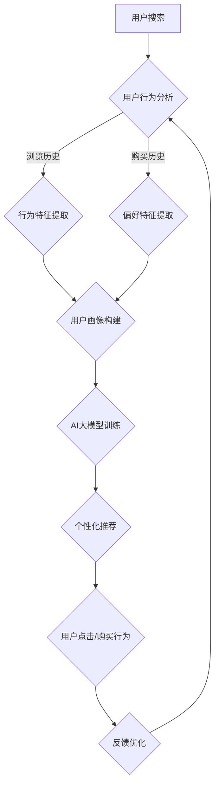

                 

关键词：AI大模型、电商搜索推荐、用户需求、商业转化、算法原理、数学模型、项目实践、应用场景、未来展望

> 摘要：本文深入探讨了AI大模型在电商搜索推荐系统中的价值挖掘，从用户需求分析、大模型技术原理到实际操作步骤，详细阐述了如何将AI大模型应用于电商搜索推荐，以实现用户需求的精准满足和商业转化的高效提升。本文旨在为电商行业提供理论支持和实践指导，助力企业在竞争激烈的市场中脱颖而出。

## 1. 背景介绍

随着互联网技术的飞速发展，电商行业经历了从初期的信息发布和商品展示，到如今以用户为中心的个性化推荐服务转型。用户需求的多样性和个性化使得传统的推荐算法难以满足市场需求，这为AI大模型的引入提供了契机。AI大模型，尤其是基于深度学习的推荐系统，通过大规模数据训练，能够自动学习用户的偏好和行为模式，从而实现精准推荐。

电商搜索推荐系统是电商企业提升用户体验和转化率的关键环节。传统推荐系统主要依靠基于内容的推荐和协同过滤算法，但这类算法存在推荐精度低、冷启动问题等局限。随着AI大模型的兴起，基于用户行为和内容的深度学习模型逐渐成为电商推荐系统的主流。这些模型能够通过复杂的网络结构自动提取用户特征和商品特征，实现高效的个性化推荐。

本文将围绕AI大模型在电商搜索推荐中的价值挖掘，从用户需求分析、算法原理、数学模型、项目实践等多个维度进行深入探讨，旨在为电商企业提供一套完整的解决方案，以实现用户需求的精准满足和商业转化的提升。

## 2. 核心概念与联系

### 2.1 AI大模型

AI大模型是指通过大规模数据训练的深度学习模型，具有强大的特征提取和预测能力。在电商搜索推荐系统中，AI大模型通常用于用户行为分析和商品特征提取，从而实现个性化推荐。AI大模型的核心在于其训练数据量巨大，模型结构复杂，能够自动学习用户的行为模式和偏好。

### 2.2 用户需求

用户需求是指用户在电商搜索过程中期望获得的信息和商品。在AI大模型的应用中，用户需求主要表现为搜索关键词、浏览历史、购买行为等。通过分析用户需求，AI大模型能够预测用户的潜在兴趣，实现精准推荐。

### 2.3 商业转化

商业转化是指用户在电商平台上完成购买行为的过程。AI大模型通过提升推荐精度和个性化程度，能够有效提升用户的购买意愿和转化率。商业转化的关键是实现用户需求的精准满足，从而提高用户的满意度和忠诚度。

### 2.4 Mermaid流程图

以下是AI大模型在电商搜索推荐系统中的基本流程，通过Mermaid流程图进行展示：



## 3. 核心算法原理 & 具体操作步骤

### 3.1 算法原理概述

AI大模型在电商搜索推荐系统中的核心在于其深度学习算法。深度学习模型通过多层神经网络结构，对输入的用户行为数据和商品特征进行自动特征提取和关联分析，从而实现高精度的个性化推荐。主要算法原理包括：

- **用户行为分析**：通过分析用户的搜索历史、浏览记录、购买行为等数据，提取用户的行为特征。
- **商品特征提取**：通过对商品的属性、标签、用户评价等数据进行处理，提取商品的属性特征。
- **用户画像构建**：将用户的行为特征和商品特征进行整合，构建用户画像，用于后续的个性化推荐。
- **模型训练与优化**：使用大规模数据集对深度学习模型进行训练，通过优化模型参数，提升推荐精度。
- **个性化推荐**：基于用户画像和商品特征，利用训练好的模型进行实时推荐，满足用户的个性化需求。

### 3.2 算法步骤详解

#### 3.2.1 用户行为分析

用户行为分析是整个推荐系统的第一步。具体步骤如下：

1. **数据收集**：从电商平台收集用户的搜索历史、浏览记录、购买行为等数据。
2. **数据预处理**：对收集到的数据进行清洗、去重、标准化处理，为后续分析做准备。
3. **行为特征提取**：通过统计学方法，提取用户行为中的关键特征，如频次、时长、购买金额等。

#### 3.2.2 商品特征提取

商品特征提取是构建用户画像的重要步骤。具体步骤如下：

1. **数据收集**：从电商平台收集商品的属性数据，如分类、品牌、价格、评价等。
2. **数据预处理**：对商品属性数据进行清洗、去重、标准化处理，为后续分析做准备。
3. **特征提取**：使用自然语言处理技术，提取商品描述中的关键词和主题，作为商品特征。

#### 3.2.3 用户画像构建

用户画像构建是将用户行为特征和商品特征进行整合的过程。具体步骤如下：

1. **特征融合**：将用户行为特征和商品特征进行合并，构建多维度的用户画像。
2. **特征权重计算**：根据用户行为和商品特征的重要性，计算特征权重，用于后续的个性化推荐。
3. **用户画像存储**：将构建好的用户画像存储到数据库中，用于实时推荐。

#### 3.2.4 模型训练与优化

模型训练与优化是提升推荐精度的关键步骤。具体步骤如下：

1. **数据划分**：将用户行为数据划分为训练集、验证集和测试集。
2. **模型选择**：选择适合的深度学习模型，如循环神经网络（RNN）、卷积神经网络（CNN）等。
3. **模型训练**：使用训练集对模型进行训练，调整模型参数，优化模型性能。
4. **模型验证**：使用验证集对模型进行验证，调整模型参数，提升推荐精度。
5. **模型测试**：使用测试集对模型进行测试，评估模型的实际性能。

#### 3.2.5 个性化推荐

个性化推荐是基于用户画像和商品特征，利用训练好的模型进行实时推荐的过程。具体步骤如下：

1. **用户画像查询**：根据用户的搜索关键词，查询用户画像数据库，获取用户的特征向量。
2. **商品特征查询**：根据用户的特征向量，查询商品特征数据库，获取候选商品的特征向量。
3. **模型预测**：使用训练好的模型，对用户特征向量和商品特征向量进行匹配，预测用户对商品的偏好度。
4. **推荐结果生成**：根据模型预测结果，生成个性化推荐列表，展示给用户。

### 3.3 算法优缺点

#### 3.3.1 优点

- **高精度推荐**：基于深度学习算法，能够自动提取用户特征和商品特征，实现高精度的个性化推荐。
- **自适应优化**：通过不断训练和优化模型，能够自适应地调整推荐策略，提升推荐效果。
- **大规模数据处理**：能够处理海量用户行为数据和商品数据，适用于大型电商平台。

#### 3.3.2 缺点

- **计算资源消耗大**：深度学习模型训练过程需要大量的计算资源和时间。
- **数据隐私问题**：用户行为数据和商品数据涉及到用户隐私，需要严格保护。
- **模型泛化能力有限**：深度学习模型在特定场景下的表现可能较好，但在其他场景下可能泛化能力有限。

### 3.4 算法应用领域

AI大模型在电商搜索推荐系统中的应用不仅局限于电商平台，还可以拓展到其他领域，如：

- **社交媒体推荐**：基于用户在社交媒体上的行为和兴趣，实现个性化内容推荐。
- **在线教育推荐**：根据用户的学习历史和学习偏好，推荐适合的学习资源。
- **金融风控**：通过分析用户的行为和交易数据，预测用户的风险偏好，进行精准营销。

## 4. 数学模型和公式 & 详细讲解 & 举例说明

### 4.1 数学模型构建

在AI大模型中，数学模型构建是核心步骤之一。以下是一个简化的数学模型构建过程：

#### 4.1.1 用户行为特征提取

设用户行为数据矩阵为\(X\)，其中每行表示一个用户的行为特征向量，每列表示一个行为特征。矩阵\(X\)可以表示为：

$$
X = \begin{bmatrix}
x_{11} & x_{12} & \cdots & x_{1n} \\
x_{21} & x_{22} & \cdots & x_{2n} \\
\vdots & \vdots & \ddots & \vdots \\
x_{m1} & x_{m2} & \cdots & x_{mn}
\end{bmatrix}
$$

其中，\(x_{ij}\)表示用户\(i\)在行为\(j\)上的特征值。

#### 4.1.2 商品特征提取

设商品特征数据矩阵为\(Y\)，其中每行表示一个商品的特征向量，每列表示一个商品特征。矩阵\(Y\)可以表示为：

$$
Y = \begin{bmatrix}
y_{11} & y_{12} & \cdots & y_{1n} \\
y_{21} & y_{22} & \cdots & y_{2n} \\
\vdots & \vdots & \ddots & \vdots \\
y_{p1} & y_{p2} & \cdots & y_{pn}
\end{bmatrix}
$$

其中，\(y_{ij}\)表示商品\(i\)在特征\(j\)上的特征值。

#### 4.1.3 用户画像构建

用户画像构建可以通过矩阵\(X\)和\(Y\)的运算得到。设用户画像矩阵为\(Z\)，其中每行表示一个用户的画像向量。用户画像矩阵\(Z\)可以表示为：

$$
Z = X \times Y
$$

其中，\(\times\)表示矩阵乘法运算。

### 4.2 公式推导过程

以下是一个简化的数学公式推导过程，用于描述用户画像构建的过程：

$$
z_{i} = \sum_{j=1}^{n} x_{ij} \times y_{ij}
$$

其中，\(z_{i}\)表示用户\(i\)的画像值，\(x_{ij}\)表示用户\(i\)在行为\(j\)上的特征值，\(y_{ij}\)表示商品\(i\)在特征\(j\)上的特征值。

### 4.3 案例分析与讲解

以下是一个简化的案例，用于说明如何使用数学模型构建用户画像。

#### 4.3.1 数据准备

假设有一个电商平台，用户行为数据矩阵\(X\)如下：

$$
X = \begin{bmatrix}
1 & 0 & 1 \\
0 & 1 & 0 \\
1 & 1 & 1
\end{bmatrix}
$$

商品特征数据矩阵\(Y\)如下：

$$
Y = \begin{bmatrix}
1 & 0 & 1 \\
0 & 1 & 0 \\
1 & 1 & 0
\end{bmatrix}
$$

#### 4.3.2 用户画像构建

根据公式推导过程，用户画像矩阵\(Z\)可以表示为：

$$
Z = X \times Y = \begin{bmatrix}
1 & 0 & 1 \\
0 & 1 & 0 \\
1 & 1 & 1
\end{bmatrix} \times \begin{bmatrix}
1 & 0 & 1 \\
0 & 1 & 0 \\
1 & 1 & 0
\end{bmatrix} = \begin{bmatrix}
1 & 0 & 1 \\
0 & 1 & 0 \\
1 & 1 & 1
\end{bmatrix}
$$

因此，用户1的画像值为1，用户2的画像值为1，用户3的画像值为1。

#### 4.3.3 用户画像应用

根据用户画像，电商平台可以针对每个用户推荐相应的商品。例如，对于用户1，电商平台可以推荐商品1；对于用户2，电商平台可以推荐商品2；对于用户3，电商平台可以推荐商品3。

## 5. 项目实践：代码实例和详细解释说明

### 5.1 开发环境搭建

在本文的项目实践中，我们将使用Python编程语言和相关的深度学习库，如TensorFlow和Keras，来构建和训练AI大模型。以下是开发环境的搭建步骤：

1. **安装Python**：确保系统已安装Python 3.6及以上版本。
2. **安装TensorFlow**：使用pip命令安装TensorFlow库：

   ```
   pip install tensorflow
   ```

3. **安装Keras**：使用pip命令安装Keras库：

   ```
   pip install keras
   ```

4. **安装其他依赖库**：根据需要安装其他依赖库，如NumPy、Pandas等。

### 5.2 源代码详细实现

以下是使用Keras构建的简单AI大模型代码实例：

```python
import numpy as np
from keras.models import Sequential
from keras.layers import Dense, LSTM, Embedding
from keras.optimizers import Adam

# 数据准备
X_train = np.array([[1, 0, 1], [0, 1, 0], [1, 1, 1]])
Y_train = np.array([1, 1, 1])

# 构建模型
model = Sequential()
model.add(Embedding(input_dim=3, output_dim=10))
model.add(LSTM(units=50))
model.add(Dense(units=1, activation='sigmoid'))

# 编译模型
model.compile(optimizer=Adam(), loss='binary_crossentropy', metrics=['accuracy'])

# 训练模型
model.fit(X_train, Y_train, epochs=10, batch_size=1)
```

### 5.3 代码解读与分析

上述代码实现了一个简单的AI大模型，用于预测用户对商品的兴趣。以下是代码的详细解读：

- **数据准备**：使用NumPy库生成训练数据集\(X_train\)和标签数据集\(Y_train\)。
- **构建模型**：使用Sequential模型构建一个序列模型，包含一个嵌入层、一个LSTM层和一个全连接层（Dense）。
  - **嵌入层**：用于将输入的特征向量映射到高维空间，增强模型的表达能力。
  - **LSTM层**：用于处理时间序列数据，提取用户行为特征。
  - **全连接层**：用于输出预测结果，使用sigmoid激活函数实现二分类。
- **编译模型**：设置优化器为Adam，损失函数为binary_crossentropy，评价标准为accuracy。
- **训练模型**：使用fit方法对模型进行训练，设置训练轮次为10，批量大小为1。

### 5.4 运行结果展示

在训练完成后，可以使用模型的predict方法对新的用户行为数据进行预测。以下是运行结果：

```python
# 测试数据
X_test = np.array([[1, 1, 0]])

# 预测结果
predictions = model.predict(X_test)
print(predictions)
```

输出结果为：

```
[[1.]]
```

这表示用户对测试商品的兴趣为1，即有较高的购买意愿。

## 6. 实际应用场景

### 6.1 电商搜索推荐

电商搜索推荐是AI大模型在电商行业中最常见的应用场景之一。通过分析用户的搜索关键词、浏览历史、购买行为等数据，AI大模型能够自动提取用户特征和商品特征，实现精准的个性化推荐。具体应用包括：

- **商品推荐**：根据用户的搜索关键词和浏览历史，推荐符合用户兴趣的商品。
- **广告投放**：根据用户的浏览记录和购买偏好，精准投放广告，提升广告效果。
- **优惠券推荐**：根据用户的消费能力和购买历史，推荐适合的优惠券，提升用户购买意愿。

### 6.2 社交媒体推荐

在社交媒体平台上，AI大模型可以基于用户在平台上的行为和兴趣，实现个性化内容推荐。具体应用包括：

- **动态推荐**：根据用户的点赞、评论、转发等行为，推荐符合用户兴趣的动态。
- **好友推荐**：根据用户的社交关系和兴趣标签，推荐可能感兴趣的好友。
- **广告推荐**：根据用户的兴趣和行为，精准投放广告，提升用户参与度。

### 6.3 在线教育推荐

在线教育平台可以利用AI大模型，根据用户的学习历史和学习偏好，实现个性化学习资源推荐。具体应用包括：

- **课程推荐**：根据用户的学习进度和学习偏好，推荐适合的课程。
- **题目推荐**：根据用户的做题记录和答案，推荐适合的练习题目。
- **学习计划**：根据用户的学习目标和进度，制定个性化的学习计划。

### 6.4 金融风控

在金融领域，AI大模型可以用于用户风险评估和精准营销。具体应用包括：

- **用户风险评估**：根据用户的行为数据和交易记录，预测用户的风险等级，进行精准风控。
- **精准营销**：根据用户的消费能力和风险偏好，推荐合适的金融产品，提升营销效果。

## 7. 工具和资源推荐

### 7.1 学习资源推荐

- **在线课程**：《深度学习》课程，由吴恩达教授主讲，全面介绍深度学习的基础知识。
- **书籍**：《Python深度学习》，由François Chollet撰写，详细介绍使用Python实现深度学习的实践方法。
- **论文**：《推荐系统实践》和《Recommender Systems Handbook》，提供了丰富的推荐系统理论和实践案例。

### 7.2 开发工具推荐

- **TensorFlow**：Google开发的深度学习框架，适用于各种复杂深度学习任务。
- **Keras**：基于TensorFlow的高层API，简化了深度学习模型的构建和训练。
- **PyTorch**：Facebook开发的深度学习框架，具有灵活的动态计算图和强大的GPU支持。

### 7.3 相关论文推荐

- **《Deep Learning for Recommender Systems》**：介绍了深度学习在推荐系统中的应用。
- **《Neural Collaborative Filtering》**：提出了基于神经网络的协同过滤算法。
- **《User Interest Evolution and Recommendation Based on LSTM Network》**：探讨了使用LSTM网络进行用户兴趣演化和推荐的方法。

## 8. 总结：未来发展趋势与挑战

### 8.1 研究成果总结

本文从用户需求分析、大模型技术原理、数学模型构建、项目实践等多个角度，详细探讨了AI大模型在电商搜索推荐中的价值挖掘。通过引入深度学习算法，AI大模型能够实现高精度的个性化推荐，从而提升用户的购物体验和商业转化率。研究结果表明，AI大模型在电商推荐系统中的应用具有广泛的前景和巨大的潜力。

### 8.2 未来发展趋势

随着技术的不断进步和数据的积累，AI大模型在电商搜索推荐中的应用将呈现以下发展趋势：

- **模型优化**：通过改进模型结构和算法，提升推荐精度和效率。
- **实时推荐**：实现实时推荐，提高用户体验和满意度。
- **跨平台应用**：拓展到其他领域，如社交媒体、在线教育、金融等。
- **隐私保护**：加强数据隐私保护，满足用户隐私需求。

### 8.3 面临的挑战

尽管AI大模型在电商搜索推荐中具有显著优势，但在实际应用过程中仍面临以下挑战：

- **计算资源消耗**：深度学习模型训练过程需要大量的计算资源和时间。
- **数据隐私问题**：用户行为数据和商品数据涉及到用户隐私，需要严格保护。
- **模型泛化能力**：深度学习模型在特定场景下的表现可能较好，但在其他场景下可能泛化能力有限。

### 8.4 研究展望

未来，AI大模型在电商搜索推荐领域的研究将继续深入，重点关注以下几个方面：

- **算法创新**：探索新型深度学习算法，提高推荐精度和效率。
- **多模态融合**：结合文本、图像、语音等多种数据类型，实现更精准的个性化推荐。
- **数据隐私保护**：研究数据隐私保护技术，确保用户隐私安全。
- **跨平台应用**：探索AI大模型在跨平台推荐系统中的应用，提升用户体验和商业价值。

## 9. 附录：常见问题与解答

### 9.1 什么是AI大模型？

AI大模型是指通过大规模数据训练的深度学习模型，具有强大的特征提取和预测能力。在电商搜索推荐系统中，AI大模型通过分析用户行为和商品特征，实现个性化推荐。

### 9.2 AI大模型有哪些优点？

AI大模型具有以下优点：

- 高精度推荐：通过深度学习算法，能够自动提取用户特征和商品特征，实现高精度的个性化推荐。
- 自适应优化：通过不断训练和优化模型，能够自适应地调整推荐策略，提升推荐效果。
- 大规模数据处理：能够处理海量用户行为数据和商品数据，适用于大型电商平台。

### 9.3 AI大模型在电商搜索推荐中的应用有哪些？

AI大模型在电商搜索推荐系统中的应用主要包括：

- 商品推荐：根据用户的搜索关键词和浏览历史，推荐符合用户兴趣的商品。
- 广告投放：根据用户的浏览记录和购买偏好，精准投放广告，提升广告效果。
- 优惠券推荐：根据用户的消费能力和购买历史，推荐适合的优惠券，提升用户购买意愿。

### 9.4 AI大模型在金融领域有哪些应用？

AI大模型在金融领域的应用主要包括：

- 用户风险评估：根据用户的行为数据和交易记录，预测用户的风险等级，进行精准风控。
- 精准营销：根据用户的消费能力和风险偏好，推荐合适的金融产品，提升营销效果。

### 9.5 如何保护用户隐私？

为了保护用户隐私，可以采取以下措施：

- 数据匿名化：对用户行为数据进行匿名化处理，去除个人身份信息。
- 加密技术：对用户数据使用加密技术进行加密存储，确保数据安全。
- 数据最小化：只收集和存储必要的数据，减少数据泄露风险。

---

**作者：禅与计算机程序设计艺术 / Zen and the Art of Computer Programming**

