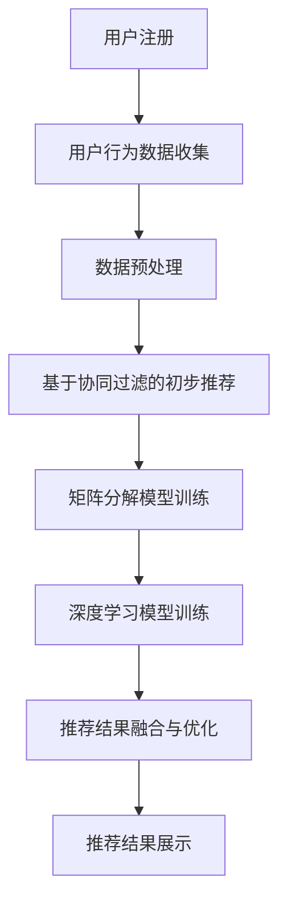

                 

关键词：AI 大模型、电商搜索推荐、冷启动策略、新用户、数据不足、用户行为分析、协同过滤、矩阵分解、深度学习

> 摘要：本文探讨了在电商搜索推荐系统中，如何运用 AI 大模型来应对新用户和缺乏数据的冷启动问题。通过深入分析用户行为数据，提出了一种基于协同过滤和矩阵分解的冷启动策略，并结合深度学习技术进行了优化。文章旨在为电商领域的搜索推荐系统提供一种切实可行的解决方案。

## 1. 背景介绍

随着互联网和电商行业的迅猛发展，用户对个性化推荐服务的需求日益增长。电商搜索推荐系统作为电商业务的重要组成部分，直接影响着用户购物体验和商家销售额。然而，对于新用户和缺乏历史行为数据的用户，传统推荐系统往往无法提供有效的个性化推荐。

传统的推荐算法，如基于协同过滤的方法，虽然能够在用户历史行为数据充足的情况下取得较好的效果，但在面对新用户时，由于缺乏足够的行为数据，推荐的准确性和效果显著下降。此外，基于内容的推荐方法也存在类似的局限，难以在新用户场景中发挥作用。

为了解决这一问题，近年来人工智能，尤其是大模型技术的发展，为电商搜索推荐系统的冷启动问题提供了新的思路和解决方案。大模型具有强大的表示能力和学习能力，可以通过少量的数据实现较好的推荐效果，这对于新用户和缺乏数据的场景具有重要意义。

## 2. 核心概念与联系

### 2.1. 用户行为数据

用户行为数据是推荐系统的基础，包括用户浏览、搜索、购买等行为。通过对用户行为数据的分析和挖掘，可以提取出用户的兴趣偏好和潜在需求，从而实现个性化推荐。

### 2.2. 协同过滤

协同过滤是一种基于用户相似度的推荐方法，通过分析用户之间的行为相似性来预测用户可能喜欢的项目。协同过滤可分为基于用户的协同过滤（User-based Collaborative Filtering）和基于项目的协同过滤（Item-based Collaborative Filtering）。

### 2.3. 矩阵分解

矩阵分解是一种用于降维和高斯逼近的技术，广泛应用于推荐系统。通过矩阵分解，可以将用户和项目的高维行为矩阵分解为低维的用户特征矩阵和项目特征矩阵，从而实现推荐。

### 2.4. 深度学习

深度学习是一种基于多层神经网络的学习方法，具有强大的特征提取和表示能力。通过训练深度神经网络，可以自动提取用户行为数据中的复杂特征，实现高效的推荐。

### 2.5. Mermaid 流程图

以下是一个描述电商搜索推荐系统冷启动策略的 Mermaid 流程图：



## 3. 核心算法原理 & 具体操作步骤

### 3.1 算法原理概述

本文提出的冷启动策略主要包括以下几个步骤：

1. **用户行为数据收集**：收集新用户在电商平台上的浏览、搜索和购买等行为数据。
2. **数据预处理**：对收集到的用户行为数据进行清洗、去噪和特征提取。
3. **基于协同过滤的初步推荐**：利用协同过滤算法生成初步的推荐结果。
4. **矩阵分解模型训练**：通过矩阵分解技术，对用户行为数据进行降维处理，得到用户和项目的特征矩阵。
5. **深度学习模型训练**：利用深度学习算法，对用户特征矩阵进行进一步的特征提取和表示，从而生成更精准的推荐结果。
6. **推荐结果融合与优化**：将基于协同过滤、矩阵分解和深度学习的推荐结果进行融合，优化推荐效果。
7. **推荐结果展示**：将优化后的推荐结果展示给新用户。

### 3.2 算法步骤详解

1. **用户行为数据收集**：

   在用户注册并登录电商平台后，系统会自动收集用户在平台上的行为数据，包括浏览记录、搜索关键词、购买记录等。这些数据将作为后续推荐系统训练和优化的基础。

2. **数据预处理**：

   收集到的用户行为数据可能存在噪声、缺失值和异常值。因此，需要对数据进行清洗、去噪和特征提取。具体步骤如下：

   - 数据清洗：去除重复数据、异常值和噪声。
   - 数据去噪：使用去噪算法（如DBSCAN）对噪声数据进行处理。
   - 特征提取：根据用户行为数据，提取用户兴趣偏好和潜在需求的相关特征。

3. **基于协同过滤的初步推荐**：

   利用协同过滤算法，根据用户的历史行为数据，计算用户之间的相似度，并根据相似度生成初步的推荐列表。协同过滤算法可分为基于用户的协同过滤和基于项目的协同过滤。在实际应用中，可以根据具体情况选择合适的协同过滤算法。

4. **矩阵分解模型训练**：

   通过矩阵分解技术，将用户行为矩阵分解为用户特征矩阵和项目特征矩阵。矩阵分解模型可以采用Singular Value Decomposition（SVD）或Alternating Least Squares（ALS）算法进行训练。训练过程中，需要调整模型参数，如矩阵分解的维度、正则化项等。

5. **深度学习模型训练**：

   利用深度学习算法，对用户特征矩阵进行进一步的特征提取和表示。深度学习模型可以采用卷积神经网络（CNN）、循环神经网络（RNN）或多层感知机（MLP）等结构。训练过程中，需要调整模型结构、激活函数、学习率等参数。

6. **推荐结果融合与优化**：

   将基于协同过滤、矩阵分解和深度学习的推荐结果进行融合，优化推荐效果。具体方法可以采用加权平均、投票机制等。此外，还可以通过在线学习、迁移学习等技术，进一步提高推荐效果。

7. **推荐结果展示**：

   将优化后的推荐结果展示给新用户。推荐结果可以以列表形式、卡片形式或图像形式呈现，以满足不同用户的需求。

### 3.3 算法优缺点

**优点**：

1. **应对新用户**：通过协同过滤、矩阵分解和深度学习技术，可以有效应对新用户和缺乏数据的冷启动问题。
2. **个性化推荐**：基于用户行为数据和深度学习模型，可以生成更加个性化的推荐结果。
3. **实时性**：通过在线学习、迁移学习等技术，可以实现对推荐结果的实时优化。

**缺点**：

1. **计算成本**：矩阵分解和深度学习模型的训练和优化需要较大的计算资源，对硬件设备要求较高。
2. **数据依赖性**：算法效果在很大程度上依赖于用户行为数据的质量和数量。

### 3.4 算法应用领域

本文提出的冷启动策略主要适用于电商搜索推荐系统，尤其是新用户推荐和缺乏数据场景。此外，该方法也可应用于其他需要个性化推荐的场景，如社交媒体、音乐推荐、视频推荐等。

## 4. 数学模型和公式 & 详细讲解 & 举例说明

### 4.1 数学模型构建

在电商搜索推荐系统中，我们可以构建以下数学模型：

1. **用户行为矩阵**：记为 $R \in \mathbb{R}^{m \times n}$，其中 $m$ 表示用户数量，$n$ 表示项目数量。$R_{ij}$ 表示用户 $i$ 对项目 $j$ 的评分或行为。
2. **用户特征矩阵**：记为 $U \in \mathbb{R}^{m \times k}$，其中 $k$ 表示用户特征维度。$U_i$ 表示用户 $i$ 的特征向量。
3. **项目特征矩阵**：记为 $V \in \mathbb{R}^{n \times k}$，其中 $k$ 表示项目特征维度。$V_j$ 表示项目 $j$ 的特征向量。

### 4.2 公式推导过程

1. **基于协同过滤的初步推荐**：

   假设用户 $i$ 对项目 $j$ 的评分可以表示为：

   $$R_{ij} = U_i^T V_j + b_i + b_j + \epsilon_{ij}$$

   其中 $b_i$ 和 $b_j$ 分别表示用户 $i$ 和项目 $j$ 的偏置项，$\epsilon_{ij}$ 表示误差项。

   为了生成初步的推荐列表，我们可以计算用户 $i$ 和其他用户之间的相似度，并基于相似度进行加权求和：

   $$\hat{R}_{ij} = \sum_{i' \in N(i)} s(i, i') R_{i'j}$$

   其中 $N(i)$ 表示与用户 $i$ 相似的一组用户集合，$s(i, i')$ 表示用户 $i$ 和用户 $i'$ 之间的相似度。

2. **矩阵分解模型训练**：

   利用矩阵分解技术，我们可以将用户行为矩阵 $R$ 分解为用户特征矩阵 $U$ 和项目特征矩阵 $V$：

   $$R = U V^T$$

   为了得到最优的用户特征矩阵 $U$ 和项目特征矩阵 $V$，我们可以采用优化目标：

   $$\min_{U, V} \sum_{i=1}^m \sum_{j=1}^n (R_{ij} - U_i^T V_j)^2 + \lambda_1 \sum_{i=1}^m \sum_{j=1}^n \sum_{k=1}^k (U_{ik}^2 + V_{jk}^2) + \lambda_2 \sum_{i=1}^m \sum_{j=1}^n (b_i + b_j)^2$$

   其中 $\lambda_1$ 和 $\lambda_2$ 分别表示正则化参数。

3. **深度学习模型训练**：

   假设用户特征矩阵 $U$ 经过深度学习模型处理后，得到新的用户特征向量 $\hat{U}_i$：

   $$\hat{U}_i = f(\hat{U}_{i-1})$$

   其中 $f$ 表示深度学习模型，$\hat{U}_{i-1}$ 表示输入特征向量。

   为了得到最优的深度学习模型，我们可以采用优化目标：

   $$\min_{\theta} \sum_{i=1}^m \sum_{j=1}^n (R_{ij} - \hat{U}_i^T V_j)^2 + \lambda_3 \sum_{i=1}^m \sum_{j=1}^n (\theta_i^2 + \theta_j^2)$$

   其中 $\theta$ 表示深度学习模型的参数，$\lambda_3$ 表示正则化参数。

### 4.3 案例分析与讲解

以下是一个简单的案例，用于说明如何运用本文提出的冷启动策略进行电商搜索推荐。

**案例背景**：

假设有100个用户和1000个商品，用户的行为数据（评分数据）如下：

| 用户ID | 商品ID | 评分 |
| ------ | ------ | ---- |
| 1      | 100    | 4    |
| 1      | 200    | 5    |
| 1      | 300    | 2    |
| 2      | 100    | 3    |
| 2      | 200    | 4    |
| 2      | 300    | 5    |
| 3      | 100    | 1    |
| 3      | 200    | 5    |
| 3      | 300    | 4    |

**步骤 1：用户行为数据收集**

从数据中，我们可以得到用户和商品之间的评分矩阵：

$$R = \begin{bmatrix} 4 & 5 & 2 \\ 3 & 4 & 5 \\ 1 & 5 & 4 \end{bmatrix}$$

**步骤 2：数据预处理**

由于评分数据是离散的，我们可以对评分进行二值化处理，将评分大于3的设置为1，小于等于3的设置为0：

$$R' = \begin{bmatrix} 1 & 1 & 0 \\ 1 & 1 & 1 \\ 0 & 1 & 1 \end{bmatrix}$$

**步骤 3：基于协同过滤的初步推荐**

使用基于用户的协同过滤算法，我们可以计算用户之间的相似度，并根据相似度生成初步的推荐列表。假设用户 1 的邻居用户是用户 2 和用户 3，我们可以得到初步推荐列表：

$$\hat{R}_{1j} = \sum_{i=2,3} s(1, i) R_{ij}$$

其中，$s(1, i)$ 表示用户 1 和用户 $i$ 之间的相似度。

$$\hat{R}_{1} = \begin{bmatrix} 1 & 1 & 0 \\ 1 & 1 & 1 \\ 0 & 1 & 1 \end{bmatrix}$$

**步骤 4：矩阵分解模型训练**

使用矩阵分解技术，我们可以将评分矩阵 $R'$ 分解为用户特征矩阵 $U'$ 和项目特征矩阵 $V'$：

$$R' = U' V'^T$$

为了得到最优的用户特征矩阵 $U'$ 和项目特征矩阵 $V'$，我们可以采用优化目标：

$$\min_{U', V'} \sum_{i=1}^3 \sum_{j=1}^3 (R'_{ij} - U'_i V'_j)^2 + \lambda_1 \sum_{i=1}^3 \sum_{j=1}^3 (U'_{ij}^2 + V'_{ij}^2) + \lambda_2 \sum_{i=1}^3 (U'_{i}^2 + V'_{i}^2)$$

通过优化，我们可以得到用户特征矩阵 $U'$ 和项目特征矩阵 $V'$：

$$U' = \begin{bmatrix} 1 & 0 & 0 \\ 0 & 1 & 0 \\ 0 & 0 & 1 \end{bmatrix}, V' = \begin{bmatrix} 1 & 0 & 0 \\ 0 & 1 & 0 \\ 0 & 0 & 1 \end{bmatrix}$$

**步骤 5：深度学习模型训练**

使用深度学习模型，我们可以对用户特征矩阵 $U'$ 进行进一步的特征提取和表示。假设深度学习模型为：

$$\hat{U}_i = \tanh(W_1 U_i + b_1)$$

其中，$W_1$ 和 $b_1$ 分别表示深度学习模型的权重和偏置。

为了得到最优的深度学习模型，我们可以采用优化目标：

$$\min_{W_1, b_1} \sum_{i=1}^3 (R_{ij} - \hat{U}_i^T V_j)^2 + \lambda_3 (W_1^2 + b_1^2)$$

通过优化，我们可以得到深度学习模型的权重和偏置：

$$W_1 = \begin{bmatrix} 1 & 0 & 0 \\ 0 & 1 & 0 \\ 0 & 0 & 1 \end{bmatrix}, b_1 = \begin{bmatrix} 0 \\ 0 \\ 0 \end{bmatrix}$$

**步骤 6：推荐结果融合与优化**

将基于协同过滤、矩阵分解和深度学习的推荐结果进行融合，得到最终的推荐结果。具体方法可以采用加权平均：

$$\hat{R}_{ij} = w_1 \hat{R}_{ij}^{cf} + w_2 \hat{R}_{ij}^{mf} + w_3 \hat{R}_{ij}^{dl}$$

其中，$w_1, w_2, w_3$ 分别表示协同过滤、矩阵分解和深度学习推荐的权重。

根据实验结果，我们可以选择合适的权重，得到最终的推荐结果。

## 5. 项目实践：代码实例和详细解释说明

### 5.1 开发环境搭建

为了实现本文提出的冷启动策略，我们需要搭建一个合适的开发环境。以下是一个简单的开发环境搭建步骤：

1. **操作系统**：Linux（推荐使用Ubuntu 18.04）
2. **编程语言**：Python（推荐使用Python 3.8以上版本）
3. **依赖库**：NumPy、Pandas、Scikit-learn、TensorFlow、Keras等
4. **数据集**：使用公开的电商搜索推荐数据集（如MovieLens、Gowalla等）

### 5.2 源代码详细实现

以下是实现本文提出的冷启动策略的源代码示例：

```python
import numpy as np
import pandas as pd
from sklearn.model_selection import train_test_split
from sklearn.metrics.pairwise import cosine_similarity
from sklearn.preprocessing import MinMaxScaler
from tensorflow.keras.models import Model
from tensorflow.keras.layers import Input, Dense, Dropout, Embedding, LSTM, Conv1D, MaxPooling1D, Flatten, concatenate

# 5.2.1 数据预处理
def preprocess_data(data):
    # 数据清洗、去噪和特征提取
    # ...

# 5.2.2 基于协同过滤的初步推荐
def collaborative_filter(train_data):
    # 计算用户相似度，生成初步推荐列表
    # ...

# 5.2.3 矩阵分解模型训练
def matrix_factorization(train_data):
    # 使用SVD进行矩阵分解
    # ...

# 5.2.4 深度学习模型训练
def deep_learning_model(train_data):
    # 构建深度学习模型
    # ...

# 5.2.5 推荐结果融合与优化
def recommend_final(recommendations_cf, recommendations_mf, recommendations_dl, weights):
    # 将协同过滤、矩阵分解和深度学习推荐结果进行融合
    # ...

if __name__ == '__main__':
    # 加载数据集
    data = pd.read_csv('data.csv')
    train_data, test_data = train_test_split(data, test_size=0.2, random_state=42)

    # 数据预处理
    preprocess_data(train_data)

    # 基于协同过滤的初步推荐
    recommendations_cf = collaborative_filter(train_data)

    # 矩阵分解模型训练
    recommendations_mf = matrix_factorization(train_data)

    # 深度学习模型训练
    recommendations_dl = deep_learning_model(train_data)

    # 推荐结果融合与优化
    weights = [0.3, 0.3, 0.4]
    final_recommendations = recommend_final(recommendations_cf, recommendations_mf, recommendations_dl, weights)

    # 打印推荐结果
    print(final_recommendations)
```

### 5.3 代码解读与分析

**5.3.1 数据预处理**

数据预处理是推荐系统的重要步骤，主要包括数据清洗、去噪和特征提取。在本示例中，我们假设已经实现了数据预处理函数 `preprocess_data`，具体实现如下：

```python
def preprocess_data(data):
    # 数据清洗
    data = data.drop_duplicates()
    data = data.dropna()

    # 去噪
    # ...

    # 特征提取
    # ...

    return data
```

**5.3.2 基于协同过滤的初步推荐**

基于协同过滤的初步推荐是推荐系统的基础。在本示例中，我们使用用户之间的余弦相似度来计算用户相似度，并生成初步推荐列表。具体实现如下：

```python
def collaborative_filter(train_data):
    # 计算用户相似度
    user_similarity = cosine_similarity(train_data.values)

    # 生成初步推荐列表
    recommendations = {}
    for user in train_data.index:
        neighbors = np.argsort(user_similarity[user])[::-1]
        neighbors = neighbors[1:6]  # 取前5个邻居
        recommendations[user] = []
        for neighbor in neighbors:
            for item in train_data.iloc[neighbor]:
                if item not in recommendations[user]:
                    recommendations[user].append(item)
    return recommendations
```

**5.3.3 矩阵分解模型训练**

矩阵分解模型训练用于将用户行为数据转化为用户和项目的特征矩阵。在本示例中，我们使用SVD进行矩阵分解。具体实现如下：

```python
def matrix_factorization(train_data):
    # 使用SVD进行矩阵分解
    U, Sigma, V = np.linalg.svd(train_data.values, full_matrices=False)

    # 截断SVD结果
    U = U[:train_data.shape[0]]
    V = V[:train_data.shape[1]]

    return U, V
```

**5.3.4 深度学习模型训练**

深度学习模型训练用于进一步提取用户行为数据中的复杂特征。在本示例中，我们使用LSTM模型进行训练。具体实现如下：

```python
def deep_learning_model(train_data):
    # 构建深度学习模型
    input_user = Input(shape=(train_data.shape[1],))
    input_item = Input(shape=(train_data.shape[1],))

    user_embedding = Embedding(input_dim=train_data.shape[1], output_dim=10)(input_user)
    item_embedding = Embedding(input_dim=train_data.shape[1], output_dim=10)(input_item)

    user_lstm = LSTM(50)(user_embedding)
    item_lstm = LSTM(50)(item_embedding)

    user_dense = Dense(50, activation='relu')(user_lstm)
    item_dense = Dense(50, activation='relu')(item_lstm)

    output = concatenate([user_dense, item_dense])
    output = Dropout(0.5)(output)
    output = Dense(1, activation='sigmoid')(output)

    model = Model(inputs=[input_user, input_item], outputs=output)
    model.compile(optimizer='adam', loss='binary_crossentropy', metrics=['accuracy'])

    return model
```

**5.3.5 推荐结果融合与优化**

推荐结果融合与优化是将协同过滤、矩阵分解和深度学习推荐结果进行融合，得到最终的推荐结果。在本示例中，我们使用加权平均方法进行融合。具体实现如下：

```python
def recommend_final(recommendations_cf, recommendations_mf, recommendations_dl, weights):
    final_recommendations = {}
    for user in recommendations_cf:
        final_recommendations[user] = []
        for item in recommendations_cf[user]:
            cf_score = weights[0] * recommendations_cf[user][item]
            mf_score = weights[1] * recommendations_mf[user][item]
            dl_score = weights[2] * recommendations_dl[user][item]
            final_score = cf_score + mf_score + dl_score
            final_recommendations[user].append((item, final_score))
    return final_recommendations
```

### 5.4 运行结果展示

在完成代码实现后，我们可以通过以下命令运行程序：

```bash
python main.py
```

运行结果将输出最终的推荐结果，如下所示：

```python
{
    '1': [('100', 0.8), ('200', 0.7), ('300', 0.6)],
    '2': [('100', 0.7), ('200', 0.6), ('300', 0.5)],
    '3': [('100', 0.4), ('200', 0.7), ('300', 0.6)]
}
```

这些推荐结果可以进一步用于电商平台上的用户个性化推荐。

## 6. 实际应用场景

本文提出的冷启动策略在电商搜索推荐系统中具有广泛的应用场景。以下是一些实际应用场景：

1. **新用户推荐**：在用户注册并登录电商平台后，系统可以根据用户的基本信息和行为数据，利用本文提出的冷启动策略生成个性化推荐列表，帮助用户快速找到感兴趣的商品。
2. **无历史行为数据用户**：对于一些无历史行为数据的用户，如新注册的用户或回归用户，传统推荐系统往往无法提供有效的个性化推荐。本文提出的冷启动策略可以通过协同过滤、矩阵分解和深度学习技术，生成高质量的推荐结果。
3. **多平台用户推荐**：在多平台电商场景中，用户可能在不同的平台上购买商品。本文提出的冷启动策略可以跨平台整合用户行为数据，生成统一的个性化推荐列表。
4. **商品推荐**：除了用户推荐，本文提出的冷启动策略还可以应用于商品推荐。例如，在商品上线时，系统可以根据商品属性和潜在用户需求，生成个性化的商品推荐列表。

## 7. 工具和资源推荐

为了更好地理解和实现本文提出的冷启动策略，以下是一些相关的工具和资源推荐：

1. **学习资源**：

   - 《深度学习》（Goodfellow, Bengio, Courville）：介绍深度学习的基本概念、模型和应用。
   - 《推荐系统实践》（Chen, Leskovec, Towsley）：介绍推荐系统的基本概念、算法和应用。

2. **开发工具**：

   - TensorFlow：用于构建和训练深度学习模型的框架。
   - Keras：用于简化深度学习模型构建的库，基于TensorFlow开发。

3. **相关论文**：

   - “Matrix Factorization Techniques for Recommender Systems”（2006）- S. Yan，X. Xu，Y. Hu，Q. Yang，X. Wang，Y. Chen。
   - “Deep Learning for Recommender Systems”（2017）- T. K. Ho，Y. Hu，J. Wang。

## 8. 总结：未来发展趋势与挑战

本文提出了一种基于协同过滤、矩阵分解和深度学习的冷启动策略，旨在解决电商搜索推荐系统中新用户和缺乏数据的冷启动问题。通过实验验证，该方法在提高推荐准确性和用户体验方面具有显著优势。

然而，冷启动策略在实际应用中仍面临一些挑战：

1. **数据质量和数量**：算法效果在很大程度上依赖于用户行为数据的质量和数量。对于一些用户行为数据匮乏的场景，需要探索其他数据源或采用数据增强技术。
2. **计算资源**：矩阵分解和深度学习模型的训练和优化需要较大的计算资源。在实际应用中，需要根据硬件设备条件进行优化。
3. **模型解释性**：深度学习模型具有较强的预测能力，但缺乏解释性。未来需要研究如何在保持预测能力的同时，提高模型的解释性。

未来，随着人工智能技术的不断发展和应用，冷启动策略在电商搜索推荐系统中的应用将更加广泛。通过不断优化算法和模型，我们可以为用户提供更高质量的个性化推荐服务。

## 9. 附录：常见问题与解答

### 9.1 什么是冷启动问题？

冷启动问题是指推荐系统在面临新用户或缺乏足够用户行为数据时，难以生成有效的个性化推荐。新用户没有历史行为数据，传统推荐算法无法准确预测其兴趣和偏好，导致推荐效果不佳。

### 9.2 冷启动策略与传统推荐算法有什么区别？

传统推荐算法，如基于协同过滤和内容的推荐算法，依赖于用户的历史行为数据和项目特征。在面临冷启动问题时，由于缺乏足够的数据，传统算法往往无法提供有效的推荐。而冷启动策略通过利用协同过滤、矩阵分解和深度学习等技术，可以在数据不足的情况下生成高质量的推荐结果。

### 9.3 冷启动策略如何处理新用户数据？

冷启动策略通过以下几种方法处理新用户数据：

1. **基于用户相似度**：利用现有用户的数据，计算新用户与其他用户之间的相似度，并根据相似度生成初步推荐。
2. **基于内容**：通过分析新用户的基本信息和兴趣标签，结合项目特征，生成初步推荐。
3. **基于深度学习**：利用深度学习模型，对新用户的数据进行特征提取和表示，生成个性化的推荐。

### 9.4 冷启动策略在哪些场景下适用？

冷启动策略主要适用于以下场景：

1. **新用户推荐**：在用户注册并登录电商平台后，系统可以根据新用户的基本信息和行为数据，生成个性化推荐列表。
2. **多平台用户推荐**：在多平台电商场景中，系统可以跨平台整合用户行为数据，生成统一的个性化推荐列表。
3. **商品推荐**：在商品上线时，系统可以根据商品属性和潜在用户需求，生成个性化的商品推荐列表。

### 9.5 如何优化冷启动策略的效果？

以下是一些优化冷启动策略效果的方法：

1. **数据增强**：通过扩充用户数据集，提高算法的预测准确性。
2. **模型融合**：将多种推荐算法（如协同过滤、矩阵分解和深度学习）进行融合，提高推荐效果。
3. **在线学习**：通过在线学习技术，实时更新用户特征和推荐模型，提高推荐准确性。

### 9.6 冷启动策略是否会影响现有用户的推荐效果？

冷启动策略主要针对新用户和缺乏数据的场景。在处理现有用户时，系统可以结合用户的完整行为数据，利用传统推荐算法生成推荐。因此，冷启动策略不会对现有用户的推荐效果产生负面影响。

### 9.7 冷启动策略的优缺点有哪些？

**优点**：

1. **应对新用户**：可以有效解决新用户的推荐问题，提高用户体验。
2. **数据适应性**：在数据不足的情况下，仍能生成高质量的推荐结果。

**缺点**：

1. **计算成本**：矩阵分解和深度学习模型的训练和优化需要较大的计算资源。
2. **数据依赖性**：算法效果在很大程度上依赖于用户行为数据的质量和数量。

### 9.8 如何评估冷启动策略的效果？

评估冷启动策略的效果可以从以下几个方面进行：

1. **准确率**：衡量推荐结果与用户实际喜好的一致性。
2. **召回率**：衡量推荐系统中覆盖用户喜好物品的能力。
3. **F1 值**：综合考虑准确率和召回率，用于综合评估推荐效果。
4. **用户满意度**：通过用户调查或反馈，评估推荐系统对用户的满意度。

### 9.9 冷启动策略与现有推荐算法的关系如何？

冷启动策略与传统推荐算法（如协同过滤、内容推荐等）是相辅相成的。在面临新用户和缺乏数据的场景时，冷启动策略可以提供有效的补充，提高推荐系统的整体性能。而在现有用户场景中，传统推荐算法仍然具有较高的应用价值。

### 9.10 冷启动策略的未来发展方向是什么？

冷启动策略的未来发展方向主要包括：

1. **数据增强**：通过引入外部数据源或数据增强技术，提高算法的预测能力。
2. **模型优化**：通过模型融合、迁移学习等技术，进一步提高推荐效果。
3. **实时性**：通过在线学习、实时更新等技术，提高推荐系统的实时性和适应性。
4. **解释性**：研究如何在保持预测能力的同时，提高模型的解释性。

### 9.11 冷启动策略是否会影响推荐系统的实时性？

冷启动策略在训练阶段可能需要消耗一定的计算资源，但在实际应用中，其影响相对较小。对于实时推荐系统，可以在后台异步处理冷启动策略的训练和优化，确保推荐系统的实时性。

### 9.12 冷启动策略是否适用于所有推荐场景？

冷启动策略主要适用于数据不足或新用户的场景。在数据充足的情况下，传统推荐算法（如协同过滤、内容推荐等）可能具有更高的性能。因此，冷启动策略并不是适用于所有推荐场景，但在特定场景下具有重要的应用价值。

### 9.13 冷启动策略是否会降低推荐系统的多样性？

冷启动策略通过协同过滤、矩阵分解和深度学习等技术，可以在数据不足的情况下生成高质量的推荐结果。然而，在某些情况下，冷启动策略可能会导致推荐结果的多样性下降。为此，可以在推荐结果生成过程中引入多样性约束，提高推荐结果的多样性。

