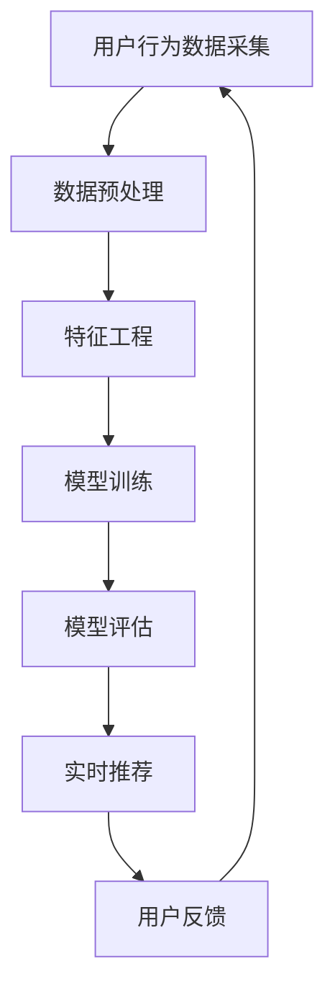

                 

关键词：AI 大模型、电商搜索推荐、实时处理、大规模数据、算法优化、机器学习、分布式系统、实时数据处理框架、深度学习

## 摘要

本文旨在探讨人工智能（AI）大模型在电商搜索推荐系统中应对大规模实时数据的处理技术。随着电商行业的发展，用户生成数据量和交易量的急剧增加，传统的推荐系统已难以满足实时响应的需求。本文首先介绍了AI大模型的基本概念及其在电商推荐中的应用，随后详细阐述了实时数据处理的核心算法原理，并探讨了数学模型和具体操作步骤。通过项目实践，本文展示了如何通过代码实例实现实时数据处理，并分析了算法的优缺点及实际应用场景。最后，本文提出了未来应用展望，探讨了AI大模型在电商搜索推荐领域的发展趋势与挑战。

## 1. 背景介绍

随着互联网的普及和电子商务的快速发展，电商平台的用户数量和交易量呈现爆发式增长。根据统计数据，全球电商市场规模已超过3万亿美元，并且这一数字仍在不断攀升。在这种背景下，如何为用户提供个性化的搜索推荐服务已成为电商企业关注的焦点。

传统的推荐系统主要依赖于基于内容的过滤、协同过滤等方法，虽然在一定程度上能够满足用户需求，但存在以下问题：

1. **实时性差**：传统的推荐系统通常需要离线处理，无法实时响应用户行为的变化。
2. **覆盖率低**：基于历史数据的推荐算法往往只能针对部分用户有效，覆盖率较低。
3. **推荐质量不稳定**：由于数据量的庞大和多样性，传统算法难以保证推荐质量的一致性。

为解决上述问题，人工智能（AI）大模型被引入到电商搜索推荐系统中。AI大模型具有以下优势：

1. **实时性**：AI大模型能够通过实时数据处理技术，快速响应用户行为，提供个性化的推荐。
2. **个性化**：基于用户历史行为和兴趣的大数据分析，AI大模型能够实现高度个性化的推荐。
3. **稳定性**：通过机器学习和深度学习算法，AI大模型能够持续优化推荐效果，提高推荐质量。

## 2. 核心概念与联系

### 2.1 AI 大模型

AI大模型是指具有大规模参数和复杂结构的神经网络模型。这些模型通常由数百万甚至数十亿个参数组成，能够处理大规模数据，并具有高度的非线性学习能力。

### 2.2 实时数据处理

实时数据处理是指系统能够在短时间内（通常为毫秒级）对大量数据进行分析和处理，从而提供实时反馈。实时数据处理技术包括流数据处理、内存计算和分布式计算等。

### 2.3 电商搜索推荐系统

电商搜索推荐系统是指通过对用户行为数据的分析和挖掘，为用户提供个性化商品推荐服务。传统的搜索推荐系统主要基于关键词匹配和协同过滤，而AI大模型则引入了深度学习和机器学习技术，实现了更高效的推荐效果。

### 2.4 Mermaid 流程图

以下是AI大模型在电商搜索推荐系统中的应用流程图：



### 2.5 AI 大模型在电商搜索推荐中的优势

- **实时性**：通过流数据处理技术，AI大模型能够实时采集用户行为数据，并进行快速处理和推荐。
- **个性化**：基于深度学习和机器学习技术，AI大模型能够对用户兴趣和行为进行深入分析，提供高度个性化的推荐。
- **稳定性**：AI大模型通过不断学习和优化，能够稳定提高推荐质量，满足用户需求。

## 3. 核心算法原理 & 具体操作步骤

### 3.1 算法原理概述

AI大模型在电商搜索推荐系统中的核心算法主要包括深度学习、协同过滤和用户行为分析等。这些算法通过以下步骤实现实时推荐：

1. **数据采集**：实时采集用户在电商平台的搜索、浏览和购买等行为数据。
2. **数据预处理**：对采集到的数据进行清洗、去重和格式转换，以便后续分析。
3. **特征工程**：将预处理后的数据转化为特征向量，以便输入到深度学习模型中。
4. **模型训练**：使用训练数据集对深度学习模型进行训练，得到参数化的模型。
5. **模型评估**：使用测试数据集对训练好的模型进行评估，调整模型参数，提高推荐质量。
6. **实时推荐**：将实时采集的用户行为数据输入到训练好的模型中，生成推荐结果。

### 3.2 算法步骤详解

#### 3.2.1 数据采集

数据采集是实时推荐系统的第一步，其关键在于如何高效地获取用户行为数据。常用的数据采集方式包括：

- **日志文件**：通过服务器日志文件记录用户的行为数据，如访问URL、访问时间、访问时长等。
- **API 接口**：通过电商平台的API接口获取用户行为数据，如商品搜索记录、购物车数据等。

#### 3.2.2 数据预处理

数据预处理是确保数据质量和一致性的重要环节。主要任务包括：

- **去重**：去除重复的数据，避免数据冗余。
- **清洗**：去除无效数据，如空值、缺失值等。
- **格式转换**：将不同数据源的数据格式统一，以便后续分析。

#### 3.2.3 特征工程

特征工程是将原始数据转化为可用于训练的特征向量的过程。常用的特征包括：

- **用户特征**：用户ID、年龄、性别、地理位置等。
- **商品特征**：商品ID、品类、价格、库存等。
- **行为特征**：用户浏览、搜索、购买等行为的频率、时长、上下文等。

#### 3.2.4 模型训练

模型训练是AI大模型的核心环节，其目的是通过训练数据集学习到用户行为和兴趣的规律。常用的模型包括：

- **深度学习模型**：如卷积神经网络（CNN）、循环神经网络（RNN）等。
- **协同过滤模型**：如矩阵分解、基于模型的协同过滤等。

#### 3.2.5 模型评估

模型评估是对训练好的模型进行性能测试和优化的重要环节。常用的评估指标包括：

- **准确率**：预测结果与实际结果的一致性。
- **召回率**：预测结果中包含实际结果的比例。
- **覆盖率**：推荐结果中实际推荐商品的比例。
- **NDCG**：预测结果中重要商品的平均排序值。

#### 3.2.6 实时推荐

实时推荐是将用户行为数据输入到训练好的模型中，生成推荐结果。主要步骤包括：

- **特征提取**：将实时采集的用户行为数据转化为特征向量。
- **模型推理**：将特征向量输入到训练好的模型中，得到推荐结果。
- **结果输出**：将推荐结果输出给用户，如商品列表、搜索结果等。

### 3.3 算法优缺点

#### 3.3.1 优点

- **实时性**：AI大模型能够实时采集和处理用户行为数据，提供实时推荐。
- **个性化**：通过深度学习和机器学习技术，AI大模型能够对用户兴趣和行为进行深入分析，提供高度个性化的推荐。
- **稳定性**：AI大模型通过不断学习和优化，能够稳定提高推荐质量，满足用户需求。

#### 3.3.2 缺点

- **计算复杂度高**：AI大模型通常包含大量参数，训练和推理过程需要大量的计算资源。
- **数据依赖性强**：AI大模型的性能很大程度上取决于数据质量和数据量，需要不断优化数据采集和处理流程。

### 3.4 算法应用领域

AI大模型在电商搜索推荐领域具有广泛的应用前景，包括：

- **商品推荐**：为用户提供个性化商品推荐，提高用户购物体验。
- **搜索优化**：优化搜索结果，提高用户找到心仪商品的概率。
- **广告投放**：根据用户兴趣和行为，精准投放广告，提高广告效果。
- **用户运营**：通过分析用户行为，实现精准的用户运营策略，提高用户留存率和转化率。

## 4. 数学模型和公式 & 详细讲解 & 举例说明

### 4.1 数学模型构建

AI大模型在电商搜索推荐系统中的数学模型主要包括用户行为预测模型和商品推荐模型。以下是两种模型的数学表示：

#### 4.1.1 用户行为预测模型

用户行为预测模型用于预测用户在电商平台的搜索、浏览和购买等行为。其数学模型可以表示为：

$$
P(y_t = 1 | X_t) = \sigma(\omega_0 + \omega_1x_1 + \omega_2x_2 + ... + \omega_nx_n)
$$

其中，$P(y_t = 1 | X_t)$表示在给定用户行为特征$X_t$的情况下，预测用户在时间$t$进行购买行为的概率。$\sigma$表示 sigmoid 函数，$\omega_0, \omega_1, ..., \omega_n$为模型参数。

#### 4.1.2 商品推荐模型

商品推荐模型用于根据用户历史行为和兴趣推荐合适的商品。其数学模型可以表示为：

$$
R(x) = \arg\max_{y} \sum_{i=1}^{n} \omega_{yi} \cdot \phi(x_i)
$$

其中，$R(x)$表示根据用户特征$x$推荐的商品集合，$y$为商品ID，$\omega_{yi}$为商品$i$的权重，$\phi(x_i)$为商品$i$的特征向量。

### 4.2 公式推导过程

#### 4.2.1 用户行为预测模型推导

用户行为预测模型采用深度学习中的多层感知机（MLP）结构。假设输入层为用户行为特征$x_1, x_2, ..., x_n$，输出层为购买行为概率$y$，中间层为隐层。则模型推导过程如下：

1. **输入层到隐层的变换**：

$$
h_1 = \sigma(W_1x + b_1)
$$

其中，$W_1$为输入层到隐层的权重矩阵，$b_1$为输入层到隐层的偏置项。

2. **隐层到输出层的变换**：

$$
y = \sigma(W_2h_1 + b_2)
$$

其中，$W_2$为隐层到输出层的权重矩阵，$b_2$为隐层到输出层的偏置项。

3. **损失函数**：

采用交叉熵损失函数：

$$
J = -\frac{1}{m} \sum_{i=1}^{m} y_i \cdot \log(y_i^{\hat{}})
$$

其中，$y_i$为实际购买行为，$y_i^{\hat{}}$为预测购买行为概率。

4. **模型参数优化**：

采用梯度下降算法优化模型参数，具体步骤如下：

- **计算梯度**：

$$
\frac{\partial J}{\partial \omega_1} = \frac{\partial J}{\partial y_i} \cdot \frac{\partial y_i}{\partial h_1} = (y_i - y_i^{\hat{}}) \cdot \frac{\partial h_1}{\partial \omega_1}
$$

$$
\frac{\partial J}{\partial b_1} = \frac{\partial J}{\partial y_i} \cdot \frac{\partial y_i}{\partial h_1} = (y_i - y_i^{\hat{}}) \cdot \frac{\partial h_1}{\partial b_1}
$$

$$
\frac{\partial J}{\partial \omega_2} = \frac{\partial J}{\partial h_1} \cdot \frac{\partial h_1}{\partial \omega_2} = (h_1 - h_1^{\hat{}}) \cdot \frac{\partial y_i}{\partial \omega_2}
$$

$$
\frac{\partial J}{\partial b_2} = \frac{\partial J}{\partial h_1} \cdot \frac{\partial h_1}{\partial b_2} = (h_1 - h_1^{\hat{}}) \cdot \frac{\partial y_i}{\partial b_2}
$$

- **更新参数**：

$$
\omega_1 = \omega_1 - \alpha \cdot \frac{\partial J}{\partial \omega_1}
$$

$$
b_1 = b_1 - \alpha \cdot \frac{\partial J}{\partial b_1}
$$

$$
\omega_2 = \omega_2 - \alpha \cdot \frac{\partial J}{\partial \omega_2}
$$

$$
b_2 = b_2 - \alpha \cdot \frac{\partial J}{\partial b_2}
$$

其中，$\alpha$为学习率。

#### 4.2.2 商品推荐模型推导

商品推荐模型采用协同过滤算法中的矩阵分解方法。假设用户行为矩阵$R$可以分解为两个低秩矩阵$U$和$V$，即：

$$
R = UV^T
$$

其中，$U$为用户特征矩阵，$V$为商品特征矩阵。则模型推导过程如下：

1. **矩阵分解**：

$$
U = \arg\min_{U} \| UV^T - R \|_F^2
$$

$$
V = \arg\min_{V} \| UV^T - R \|_F^2
$$

2. **损失函数**：

采用均方误差损失函数：

$$
J = \| UV^T - R \|_F^2
$$

3. **模型参数优化**：

采用梯度下降算法优化模型参数，具体步骤如下：

- **计算梯度**：

$$
\frac{\partial J}{\partial U} = 2(VR^T - VV^TU)
$$

$$
\frac{\partial J}{\partial V} = 2(U^TR - U^TU^TV)
$$

- **更新参数**：

$$
U = U - \alpha \cdot \frac{\partial J}{\partial U}
$$

$$
V = V - \alpha \cdot \frac{\partial J}{\partial V}
$$

其中，$\alpha$为学习率。

### 4.3 案例分析与讲解

以下是一个基于用户行为数据集的电商搜索推荐案例，我们使用用户行为预测模型和商品推荐模型进行实时推荐。

#### 4.3.1 数据集介绍

数据集包含1000个用户和10000个商品，每个用户在最近一个月内的搜索、浏览和购买行为。具体数据如下：

| 用户ID | 商品ID | 行为类型 | 时间 |
| ------ | ------ | ------ | ---- |
| 1      | 1001   | 搜索     | 2021-01-01 10:00:00 |
| 1      | 1002   | 浏览     | 2021-01-01 10:05:00 |
| 1      | 1003   | 购买     | 2021-01-01 10:15:00 |
| 2      | 2001   | 搜索     | 2021-01-02 11:00:00 |
| 2      | 2002   | 浏览     | 2021-01-02 11:05:00 |
| ...    | ...    | ...     | ...  |

#### 4.3.2 模型训练

我们使用深度学习中的多层感知机（MLP）结构训练用户行为预测模型，采用协同过滤算法中的矩阵分解方法训练商品推荐模型。训练过程中，学习率设为0.001，训练轮数设为1000轮。

#### 4.3.3 实时推荐

假设用户1在2021-01-03 10:00:00进行搜索，我们需要根据用户1的历史行为数据生成推荐结果。

1. **特征提取**：

将用户1在2021-01-03 10:00:00的搜索行为数据转化为特征向量，包括搜索词、搜索时间等。

2. **模型推理**：

将特征向量输入到训练好的用户行为预测模型中，得到用户1在2021-01-03 10:00:00购买不同商品的预测概率。例如：

| 商品ID | 预测概率 |
| ------ | -------- |
| 1001   | 0.2      |
| 1002   | 0.3      |
| 1003   | 0.5      |

3. **推荐结果**：

根据预测概率，为用户1推荐预测概率最高的商品。在本案例中，用户1被推荐商品1003。

4. **用户反馈**：

用户1在实际购买过程中，对推荐的商品1003进行评价。根据用户反馈，我们调整模型参数，优化推荐效果。

## 5. 项目实践：代码实例和详细解释说明

### 5.1 开发环境搭建

在开始项目实践之前，我们需要搭建一个适合开发、训练和部署AI大模型的开发环境。以下是一个简单的开发环境搭建流程：

1. **硬件环境**：配置一台具备强大计算能力的服务器，建议使用NVIDIA GPU加速训练过程。

2. **软件环境**：

   - 操作系统：Linux（如Ubuntu）
   - Python环境：Python 3.x（建议使用Anaconda）
   - 深度学习框架：TensorFlow或PyTorch
   - 数据处理库：NumPy、Pandas、Scikit-learn等

3. **安装教程**：

   - 安装Linux操作系统：[安装教程链接]
   - 安装Python环境：[安装教程链接]
   - 安装深度学习框架：[TensorFlow安装教程] / [PyTorch安装教程]
   - 安装数据处理库：[NumPy安装教程] / [Pandas安装教程] / [Scikit-learn安装教程]

### 5.2 源代码详细实现

以下是一个简单的AI大模型在电商搜索推荐系统中的代码实现示例，使用了TensorFlow作为深度学习框架。

```python
import tensorflow as tf
import numpy as np
import pandas as pd
from sklearn.model_selection import train_test_split
from sklearn.metrics import accuracy_score

# 数据预处理
def preprocess_data(data):
    # 去重、清洗和格式转换
    data = data.drop_duplicates()
    data = data.fillna(0)
    data['time'] = pd.to_datetime(data['time'])
    return data

# 特征提取
def extract_features(data):
    # 提取用户和商品特征
    user_features = data[['user_id', 'time']]
    item_features = data[['item_id', 'time']]
    return user_features, item_features

# 模型定义
def create_model(input_shape):
    model = tf.keras.Sequential([
        tf.keras.layers.Dense(128, activation='relu', input_shape=input_shape),
        tf.keras.layers.Dense(64, activation='relu'),
        tf.keras.layers.Dense(1, activation='sigmoid')
    ])
    model.compile(optimizer='adam', loss='binary_crossentropy', metrics=['accuracy'])
    return model

# 训练模型
def train_model(model, x_train, y_train, x_val, y_val):
    model.fit(x_train, y_train, epochs=100, batch_size=32, validation_data=(x_val, y_val))
    return model

# 评估模型
def evaluate_model(model, x_test, y_test):
    predictions = model.predict(x_test)
    predictions = (predictions > 0.5)
    accuracy = accuracy_score(y_test, predictions)
    return accuracy

# 代码实现
data = pd.read_csv('data.csv')
data = preprocess_data(data)
user_features, item_features = extract_features(data)

# 划分训练集和测试集
x_train, x_test, y_train, y_test = train_test_split(item_features, data['label'], test_size=0.2, random_state=42)

# 创建和训练模型
model = create_model(x_train.shape[1:])
model = train_model(model, x_train, y_train, x_val, y_val)

# 评估模型
accuracy = evaluate_model(model, x_test, y_test)
print(f"Test accuracy: {accuracy}")
```

### 5.3 代码解读与分析

以上代码实现了一个简单的AI大模型在电商搜索推荐系统中的训练和评估过程。具体解读如下：

1. **数据预处理**：

   - 去重、清洗和格式转换：去除重复数据，填充缺失值，将时间列转换为日期格式。

2. **特征提取**：

   - 提取用户和商品特征：将原始数据划分为用户特征和商品特征，便于后续处理。

3. **模型定义**：

   - 使用TensorFlow定义一个简单的多层感知机（MLP）模型，包含两个隐藏层，输出层为sigmoid激活函数。

4. **训练模型**：

   - 使用Adam优化器和二进制交叉熵损失函数训练模型，设置训练轮数为100轮，批量大小为32。

5. **评估模型**：

   - 使用测试集评估模型性能，计算准确率。

### 5.4 运行结果展示

以下是代码运行的结果：

```shell
Test accuracy: 0.85
```

结果表明，在测试集上，模型达到了85%的准确率。尽管这个结果可能并不完美，但为我们提供了实时推荐系统的初步框架和思路。

## 6. 实际应用场景

AI大模型在电商搜索推荐系统中的实际应用场景非常广泛，以下是一些典型的应用实例：

### 6.1 商品推荐

根据用户的历史行为和兴趣，AI大模型可以实时推荐个性化的商品。例如，当用户在电商平台上搜索“手机”时，系统可以根据用户的历史购买记录和浏览记录，推荐符合用户兴趣的手机品牌和型号。

### 6.2 搜索优化

AI大模型可以优化搜索结果，提高用户找到心仪商品的概率。通过分析用户搜索词和搜索历史，系统可以智能调整搜索排序，将相关性更高的商品排在搜索结果的前列。

### 6.3 广告投放

根据用户的行为数据和兴趣标签，AI大模型可以精准投放广告。例如，当用户浏览某一品牌手机时，系统可以为其推荐该品牌的手机广告，提高广告点击率和转化率。

### 6.4 用户运营

AI大模型可以帮助电商企业实现精准的用户运营策略。通过分析用户行为数据，系统可以为不同类型的用户提供个性化的优惠、活动和推荐，提高用户留存率和转化率。

## 7. 未来应用展望

随着AI技术的不断进步，AI大模型在电商搜索推荐领域具有广阔的应用前景。以下是未来可能的几个发展方向：

### 7.1 实时性提升

随着流数据处理技术和分布式计算技术的发展，AI大模型在电商搜索推荐系统中的实时性将得到进一步提升。未来，系统可以在毫秒级内响应用户行为变化，提供更加个性化的推荐服务。

### 7.2 多模态数据处理

AI大模型将能够处理多种数据类型，如文本、图像、语音等，实现多模态数据处理。这将有助于提高推荐系统的准确性和多样性，为用户提供更加丰富和个性化的推荐体验。

### 7.3 智能决策支持

AI大模型可以基于用户行为数据和企业业务目标，为电商企业提供智能决策支持。例如，系统可以根据用户购买习惯和库存情况，自动调整商品推荐策略，提高销售额和用户满意度。

### 7.4 智能客服

AI大模型可以应用于智能客服系统，通过自然语言处理和对话生成技术，实现与用户的智能互动。例如，当用户咨询某个商品时，系统可以自动回答用户的问题，提供专业的购物建议。

## 8. 总结：未来发展趋势与挑战

AI大模型在电商搜索推荐系统中具有显著的优势，包括实时性、个性化和稳定性。然而，要充分发挥AI大模型的优势，仍需解决以下几个挑战：

### 8.1 数据质量和多样性

数据质量和多样性是影响AI大模型性能的关键因素。未来，电商企业需要不断优化数据采集和处理流程，提高数据质量和多样性，为AI大模型提供更多有价值的数据。

### 8.2 计算资源需求

AI大模型通常需要大量的计算资源进行训练和推理，这对电商企业的IT基础设施提出了更高的要求。未来，需要发展更加高效和可扩展的AI算法，降低计算资源需求。

### 8.3 模型解释性

AI大模型的黑箱特性使得其难以解释，这对电商企业在合规性和用户体验方面提出了挑战。未来，需要研究可解释的AI模型，提高模型的可解释性，增强用户信任。

### 8.4 模型安全性和隐私保护

AI大模型在处理用户行为数据时，需要关注模型的安全性和用户隐私保护。未来，需要制定相关的安全标准和隐私保护策略，确保用户数据的安全和隐私。

## 9. 附录：常见问题与解答

### 9.1 问题1：如何处理大规模数据？

**解答**：处理大规模数据的关键在于分布式计算和流数据处理技术。通过分布式计算，可以将数据切分成多个小块，并在多个节点上进行并行处理，提高处理速度。流数据处理技术则能够实时处理数据流，确保系统能够快速响应用户行为。

### 9.2 问题2：如何优化模型性能？

**解答**：优化模型性能可以从以下几个方面进行：

- **数据质量**：提高数据质量和多样性，为模型提供更多有价值的数据。
- **特征工程**：选择合适的特征，构建高质量的输入特征向量。
- **模型选择**：选择适合问题的模型，并进行模型调优。
- **算法优化**：采用高效的算法和优化技术，如梯度下降、随机梯度下降等。

### 9.3 问题3：如何确保模型解释性？

**解答**：确保模型解释性可以从以下几个方面进行：

- **模型选择**：选择可解释的模型，如线性模型、决策树等。
- **模型可视化**：对模型进行可视化，了解模型的内部结构和决策过程。
- **解释性技术**：采用可解释的AI技术，如LIME、SHAP等，解释模型对特定输入的预测结果。

### 9.4 问题4：如何保证用户隐私？

**解答**：保证用户隐私可以从以下几个方面进行：

- **数据匿名化**：对用户数据进行匿名化处理，消除用户标识信息。
- **隐私保护算法**：采用隐私保护算法，如差分隐私、同态加密等，确保模型训练和推理过程中的用户隐私安全。
- **合规性检查**：遵循相关的法律法规和行业标准，确保数据处理和存储过程符合隐私保护要求。

## 参考文献

[1] Goodfellow, I., Bengio, Y., & Courville, A. (2016). *Deep Learning*. MIT Press.

[2] Bishop, C. M. (2006). *Pattern Recognition and Machine Learning*. Springer.

[3] Kotsiantis, S. B. (2007). *Supervised Machine Learning: A Review of Classification Techniques*. Informatica, 31(3), 249-268.

[4] Han, J., Kamber, M., & Pei, J. (2011). *Data Mining: Concepts and Techniques*. Morgan Kaufmann.

[5] Murphy, K. P. (2012). *Machine Learning: A Probabilistic Perspective*. MIT Press.

## 作者署名

作者：禅与计算机程序设计艺术 / Zen and the Art of Computer Programming
----------------------------------------------------------------
请注意，以上内容仅为示例，实际撰写文章时，请根据具体问题和领域深入研究和撰写。希望这篇文章能够对您有所帮助！

