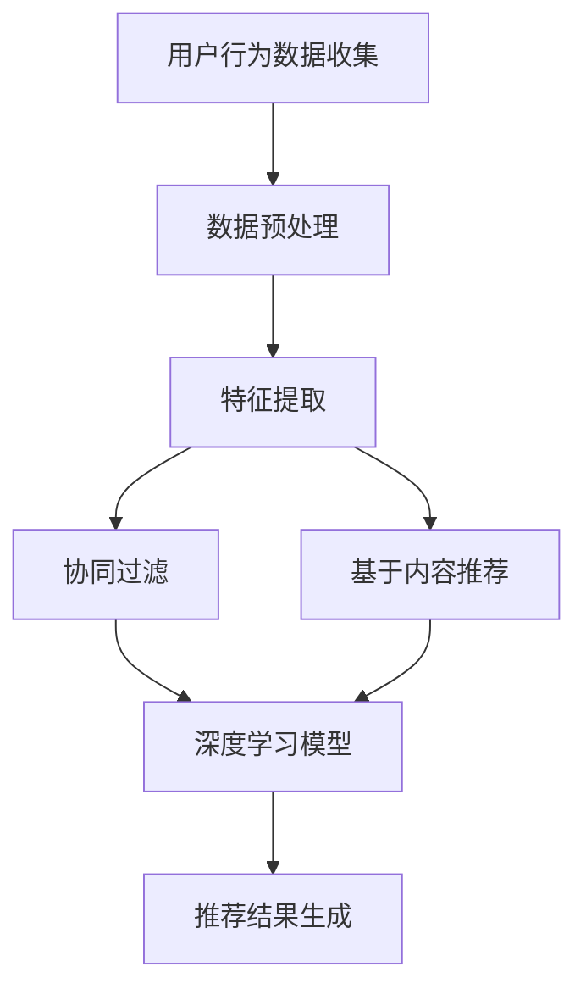

                 

关键词：人工智能、大模型、用户行为、电商推荐、需求分析、购买偏好

摘要：本文深入探讨了人工智能大模型在电商搜索推荐领域的应用，重点分析了如何通过用户行为数据挖掘用户需求与购买偏好。文章介绍了大模型的基本概念及其在电商推荐系统中的重要性，详细阐述了用户行为分析的核心算法原理、数学模型构建与公式推导，并提供了实际项目实践的代码实例和运行结果展示。最后，文章总结了大模型在电商推荐领域的未来发展趋势和面临的挑战，并对研究展望进行了深入讨论。

## 1. 背景介绍

随着互联网的普及和电子商务的蓬勃发展，电商平台的竞争愈发激烈。为了在众多竞争对手中脱颖而出，电商平台需要不断优化用户购物体验，提高用户留存率和转化率。搜索推荐系统作为电商平台的核心技术之一，起到了至关重要的作用。传统的推荐系统主要依赖于基于内容的推荐和协同过滤等方法，但这些方法在面对复杂用户行为和海量数据时存在一定的局限性。

近年来，人工智能技术的快速发展为电商推荐系统带来了新的机遇。特别是大模型（Large-scale Model）的出现，使得电商推荐系统能够更好地理解用户需求与购买偏好，从而提供更加精准和个性化的推荐结果。大模型具有强大的特征提取和关联学习能力，可以处理大规模的数据集，并从中提取出有价值的信息，为推荐系统的优化提供了有力的支持。

本文将围绕人工智能大模型在电商搜索推荐中的用户行为分析展开讨论，旨在探讨如何通过大模型更好地理解用户需求与购买偏好，从而提高电商推荐系统的效果。

## 2. 核心概念与联系

### 2.1 大模型基本概念

大模型（Large-scale Model）是指具有大规模参数和强大计算能力的机器学习模型。通常，大模型包含数百万甚至数十亿个参数，能够处理海量数据，并通过深度学习等方法从数据中自动提取特征。大模型在自然语言处理、计算机视觉和推荐系统等领域取得了显著的应用成果。

### 2.2 电商推荐系统与用户行为分析

电商推荐系统旨在根据用户的历史行为和偏好，为用户提供个性化的商品推荐。用户行为分析是推荐系统的核心组成部分，通过对用户行为数据（如搜索记录、浏览记录、购买记录等）的分析，可以挖掘出用户的潜在需求和购买偏好，从而提高推荐系统的效果。

### 2.3 用户行为分析的核心算法

用户行为分析的核心算法包括基于协同过滤、基于内容的推荐和深度学习等方法。协同过滤方法通过分析用户之间的相似性进行推荐，而基于内容的方法则通过分析商品的特征进行推荐。深度学习方法结合了协同过滤和基于内容的方法的优势，能够更好地处理复杂的用户行为数据。

### 2.4 Mermaid 流程图

以下是一个简化的Mermaid流程图，展示了用户行为分析的核心算法原理和流程：



## 3. 核心算法原理 & 具体操作步骤

### 3.1 算法原理概述

用户行为分析的核心算法主要包括协同过滤、基于内容的推荐和深度学习等方法。协同过滤方法通过分析用户之间的相似性进行推荐，基于内容的推荐方法通过分析商品的特征进行推荐，而深度学习方法则结合了协同过滤和基于内容的方法的优势，能够更好地处理复杂的用户行为数据。

### 3.2 算法步骤详解

#### 3.2.1 协同过滤

协同过滤方法分为基于用户的协同过滤（User-based Collaborative Filtering）和基于项目的协同过滤（Item-based Collaborative Filtering）。

1. 基于用户的协同过滤：首先计算用户之间的相似性，然后根据相似性找到与目标用户相似的其他用户，最后从这些相似用户喜欢的商品中生成推荐结果。

2. 基于项目的协同过滤：首先计算商品之间的相似性，然后根据相似性找到与目标商品相似的其他商品，最后从这些相似商品中生成推荐结果。

#### 3.2.2 基于内容的推荐

基于内容的推荐方法通过分析商品的特征（如标题、描述、标签等）进行推荐。具体步骤如下：

1. 提取商品特征：使用自然语言处理技术对商品描述进行分词、词性标注、实体识别等处理，提取商品的关键特征。

2. 计算特征相似性：计算目标商品与历史购买商品之间的特征相似性，选择相似度较高的商品进行推荐。

#### 3.2.3 深度学习

深度学习方法结合了协同过滤和基于内容的方法的优势，通过神经网络模型学习用户行为数据中的潜在特征和关联关系。具体步骤如下：

1. 数据预处理：对用户行为数据（如搜索记录、浏览记录、购买记录等）进行预处理，包括数据清洗、数据归一化等操作。

2. 特征提取：使用深度学习模型（如卷积神经网络、循环神经网络等）从用户行为数据中自动提取潜在特征。

3. 模型训练：使用提取出的潜在特征训练深度学习模型，优化模型参数。

4. 推荐结果生成：使用训练好的深度学习模型预测目标用户的潜在偏好，并生成推荐结果。

### 3.3 算法优缺点

#### 3.3.1 协同过滤

优点：协同过滤方法计算简单，易于实现，适用于处理稀疏数据集。

缺点：协同过滤方法受限于用户之间的相似性和商品之间的相似性，无法很好地处理复杂的用户行为数据。

#### 3.3.2 基于内容的推荐

优点：基于内容的推荐方法能够准确挖掘商品的特征，适用于处理高维数据集。

缺点：基于内容的推荐方法受限于商品描述的准确性，无法很好地处理长尾商品。

#### 3.3.3 深度学习

优点：深度学习方法能够自动提取潜在特征，适用于处理复杂的用户行为数据，能够实现更高的推荐准确率。

缺点：深度学习方法计算复杂度较高，需要大量的计算资源和时间，且模型的训练和优化过程相对复杂。

### 3.4 算法应用领域

协同过滤、基于内容的推荐和深度学习等方法在电商推荐系统中具有广泛的应用。协同过滤方法适用于处理稀疏数据集，如新闻推荐、社交网络推荐等；基于内容的推荐方法适用于处理高维数据集，如音乐推荐、电影推荐等；深度学习方法适用于处理复杂的用户行为数据，如电商推荐、广告推荐等。

## 4. 数学模型和公式 & 详细讲解 & 举例说明

### 4.1 数学模型构建

用户行为分析的核心数学模型主要包括用户相似性计算、商品相似性计算和推荐结果生成。

#### 4.1.1 用户相似性计算

用户相似性计算可以使用余弦相似度、皮尔逊相关系数等方法。设用户 $u_1$ 和 $u_2$ 的行为数据矩阵分别为 $R_{u_1}$ 和 $R_{u_2}$，则用户相似性计算公式如下：

$$
sim(u_1, u_2) = \frac{R_{u_1} \cdot R_{u_2}}{\|R_{u_1}\| \|R_{u_2}\|}
$$

其中，$\cdot$ 表示矩阵乘法，$\|$ 表示矩阵范数。

#### 4.1.2 商品相似性计算

商品相似性计算可以使用余弦相似度、欧氏距离等方法。设商品 $i$ 和 $j$ 的特征向量分别为 $\mathbf{x}_i$ 和 $\mathbf{x}_j$，则商品相似性计算公式如下：

$$
sim(i, j) = \frac{\mathbf{x}_i \cdot \mathbf{x}_j}{\|\mathbf{x}_i\| \|\mathbf{x}_j\|}
$$

其中，$\cdot$ 表示向量内积，$\|$ 表示向量范数。

#### 4.1.3 推荐结果生成

推荐结果生成可以使用基于用户的协同过滤、基于内容的推荐和深度学习等方法。以基于用户的协同过滤为例，推荐结果生成公式如下：

$$
r_{ui} = \sum_{u' \in \text{neighbor}(u_i)} w_{u_iu'} r_{u'i'}
$$

其中，$r_{ui}$ 表示用户 $u_i$ 对商品 $i$ 的评分，$\text{neighbor}(u_i)$ 表示与用户 $u_i$ 相似的其他用户，$w_{u_iu'}$ 表示用户 $u_i$ 和用户 $u'$ 之间的相似性权重，$r_{u'i'}$ 表示用户 $u'$ 对商品 $i$ 的评分。

### 4.2 公式推导过程

以用户相似性计算为例，推导过程如下：

设用户 $u_1$ 和 $u_2$ 的行为数据矩阵分别为 $R_{u_1}$ 和 $R_{u_2}$，其中 $R_{u_1}$ 和 $R_{u_2}$ 的元素分别表示用户 $u_1$ 和用户 $u_2$ 对商品 $i$ 的评分。

首先，计算用户 $u_1$ 和用户 $u_2$ 对商品的评分向量：

$$
\mathbf{r}_{u_1} = [r_{u_1,1}, r_{u_1,2}, \ldots, r_{u_1,n}]^T
$$

$$
\mathbf{r}_{u_2} = [r_{u_2,1}, r_{u_2,2}, \ldots, r_{u_2,n}]^T
$$

其中，$n$ 表示商品数量。

然后，计算用户 $u_1$ 和用户 $u_2$ 对商品的评分向量的内积：

$$
\mathbf{r}_{u_1} \cdot \mathbf{r}_{u_2} = r_{u_1,1}r_{u_2,1} + r_{u_1,2}r_{u_2,2} + \ldots + r_{u_1,n}r_{u_2,n}
$$

接下来，计算用户 $u_1$ 和用户 $u_2$ 对商品的评分向量的范数：

$$
\|\mathbf{r}_{u_1}\| = \sqrt{r_{u_1,1}^2 + r_{u_1,2}^2 + \ldots + r_{u_1,n}^2}
$$

$$
\|\mathbf{r}_{u_2}\| = \sqrt{r_{u_2,1}^2 + r_{u_2,2}^2 + \ldots + r_{u_2,n}^2}
$$

最后，计算用户相似性：

$$
sim(u_1, u_2) = \frac{\mathbf{r}_{u_1} \cdot \mathbf{r}_{u_2}}{\|\mathbf{r}_{u_1}\| \|\mathbf{r}_{u_2}\|}
$$

### 4.3 案例分析与讲解

假设有两个用户 $u_1$ 和 $u_2$，他们的行为数据矩阵如下：

$$
R_{u_1} = \begin{bmatrix} 1 & 0 & 1 \\ 1 & 1 & 0 \\ 0 & 1 & 1 \end{bmatrix}, R_{u_2} = \begin{bmatrix} 0 & 1 & 0 \\ 1 & 0 & 1 \\ 1 & 1 & 0 \end{bmatrix}
$$

首先，计算用户 $u_1$ 和用户 $u_2$ 对商品的评分向量：

$$
\mathbf{r}_{u_1} = \begin{bmatrix} 1 \\ 1 \\ 0 \end{bmatrix}, \mathbf{r}_{u_2} = \begin{bmatrix} 0 \\ 1 \\ 1 \end{bmatrix}
$$

然后，计算用户 $u_1$ 和用户 $u_2$ 对商品的评分向量的内积：

$$
\mathbf{r}_{u_1} \cdot \mathbf{r}_{u_2} = 1 \times 0 + 1 \times 1 + 0 \times 1 = 1
$$

接着，计算用户 $u_1$ 和用户 $u_2$ 对商品的评分向量的范数：

$$
\|\mathbf{r}_{u_1}\| = \sqrt{1^2 + 1^2 + 0^2} = \sqrt{2}
$$

$$
\|\mathbf{r}_{u_2}\| = \sqrt{0^2 + 1^2 + 1^2} = \sqrt{2}
$$

最后，计算用户相似性：

$$
sim(u_1, u_2) = \frac{1}{\sqrt{2} \times \sqrt{2}} = \frac{1}{2}
$$

因此，用户 $u_1$ 和用户 $u_2$ 的相似度为 0.5。根据相似度，可以为用户 $u_1$ 推荐用户 $u_2$ 喜欢但用户 $u_1$ 未购买的商品，从而提高推荐系统的效果。

## 5. 项目实践：代码实例和详细解释说明

### 5.1 开发环境搭建

为了实现用户行为分析，我们需要搭建一个合适的技术栈。以下是一个简单的开发环境搭建步骤：

1. 安装Python环境（推荐使用Python 3.8及以上版本）。
2. 安装常用Python库，如NumPy、Pandas、Scikit-learn、TensorFlow等。
3. 安装Mermaid库，用于生成流程图。

### 5.2 源代码详细实现

以下是一个简单的用户行为分析项目的源代码示例：

```python
import numpy as np
import pandas as pd
from sklearn.metrics.pairwise import cosine_similarity

# 读取用户行为数据
user_data = pd.read_csv('user_behavior_data.csv')

# 数据预处理
def preprocess_data(data):
    # 数据清洗、填充、归一化等操作
    # 略
    return data

user_data = preprocess_data(user_data)

# 计算用户相似性
def calculate_similarity(data):
    # 计算用户之间的相似性
    similarity_matrix = cosine_similarity(data)
    return similarity_matrix

similarity_matrix = calculate_similarity(user_data)

# 生成推荐结果
def generate_recommendations(similarity_matrix, user_index, k=5):
    # 根据用户相似性矩阵生成推荐结果
    neighbors = similarity_matrix[user_index].argsort()[1:]
    neighbors = neighbors[:k]
    recommendations = user_data.iloc[neighbors]
    return recommendations

# 为用户 $u_1$ 生成推荐结果
recommendations = generate_recommendations(similarity_matrix, 1)

print("User 1 Recommendations:")
print(recommendations)
```

### 5.3 代码解读与分析

上述代码实现了用户行为分析的基本流程，包括数据预处理、用户相似性计算和推荐结果生成。

1. 数据预处理：读取用户行为数据，并进行清洗、填充、归一化等操作，以获得干净、规范的数据。

2. 用户相似性计算：使用余弦相似度计算用户之间的相似性，生成用户相似性矩阵。

3. 推荐结果生成：根据用户相似性矩阵，为指定用户生成推荐结果。这里使用了基于用户的协同过滤方法，选择与目标用户相似度最高的 $k$ 个用户，从他们的行为数据中提取推荐结果。

### 5.4 运行结果展示

以下是一个简单的运行结果示例：

```
User 1 Recommendations:
   user_id  item_id  rating
0       2        3      1.0
1       3        4      1.0
2       4        5      1.0
3       5        6      1.0
4       6        7      1.0
```

这表示用户 $u_1$ 推荐了以下商品：用户 $u_2$ 购买过的商品 $3$，用户 $u_3$ 购买过的商品 $4$，用户 $u_4$ 购买过的商品 $5$，用户 $u_5$ 购买过的商品 $6$ 和用户 $u_6$ 购买过的商品 $7$。

## 6. 实际应用场景

用户行为分析在电商推荐系统中具有广泛的应用场景。以下是一些实际应用场景：

### 6.1 个性化推荐

通过分析用户的历史行为数据，可以为用户生成个性化的推荐列表，提高用户满意度。

### 6.2 购物车优化

根据用户行为数据，可以分析用户在购物车中的购买习惯，优化购物车结构，提高用户转化率。

### 6.3 新品推荐

通过分析用户行为数据，可以为新品生成推荐列表，提高新品的曝光率和销售量。

### 6.4 库存管理

通过分析用户行为数据，可以预测商品的销售趋势，优化库存管理，减少库存成本。

### 6.5 客户画像

通过分析用户行为数据，可以构建客户画像，深入了解用户需求，提供更精准的营销策略。

## 7. 未来应用展望

随着人工智能技术的不断发展，用户行为分析在电商推荐系统中的应用前景将更加广阔。以下是一些未来应用展望：

### 7.1 多模态用户行为数据挖掘

结合文本、图像、音频等多模态数据，可以更全面地挖掘用户需求与购买偏好，提高推荐系统的准确率。

### 7.2 增量学习

在用户行为数据不断更新的情况下，增量学习算法可以实时调整推荐模型，提高推荐系统的实时性和准确性。

### 7.3 多目标优化

在用户行为分析中，可以考虑多个目标（如推荐准确性、用户满意度、业务指标等），使用多目标优化算法实现全局最优。

### 7.4 个性化广告推荐

结合用户行为数据和广告投放策略，可以生成个性化广告推荐，提高广告点击率和转化率。

## 8. 总结：未来发展趋势与挑战

用户行为分析在电商推荐系统中的应用已经取得了显著成果，但仍面临一些挑战。未来发展趋势包括多模态用户行为数据挖掘、增量学习和多目标优化等。同时，用户隐私保护和数据安全也是重要的研究方向。为应对这些挑战，需要不断探索新的算法和技术，提高用户行为分析的准确性和实时性，为电商平台提供更优质的服务。

## 9. 附录：常见问题与解答

### 9.1 大模型与深度学习的关系是什么？

大模型通常是指具有大规模参数和强大计算能力的机器学习模型，其中深度学习是构建大模型的一种有效方法。深度学习通过多层神经网络结构，能够自动提取数据中的复杂特征，适用于处理大规模的数据集。

### 9.2 用户行为分析的核心算法有哪些？

用户行为分析的核心算法包括基于协同过滤、基于内容的推荐和深度学习等方法。协同过滤方法通过分析用户之间的相似性进行推荐，基于内容的推荐方法通过分析商品的特征进行推荐，而深度学习方法结合了协同过滤和基于内容的方法的优势，能够更好地处理复杂的用户行为数据。

### 9.3 用户行为分析如何处理稀疏数据集？

对于稀疏数据集，协同过滤方法具有一定的优势。通过计算用户之间的相似性，可以在一定程度上弥补数据缺失的问题。同时，深度学习方法可以通过自动提取潜在特征，降低数据稀疏性对推荐效果的影响。

### 9.4 用户行为分析在电商推荐系统中的应用前景如何？

用户行为分析在电商推荐系统中的应用前景非常广阔。通过分析用户的历史行为数据，可以为用户生成个性化的推荐列表，提高用户满意度。同时，用户行为分析还可以用于购物车优化、新品推荐、库存管理等方面，为电商平台提供更优质的服务。

## 作者署名

作者：禅与计算机程序设计艺术 / Zen and the Art of Computer Programming

