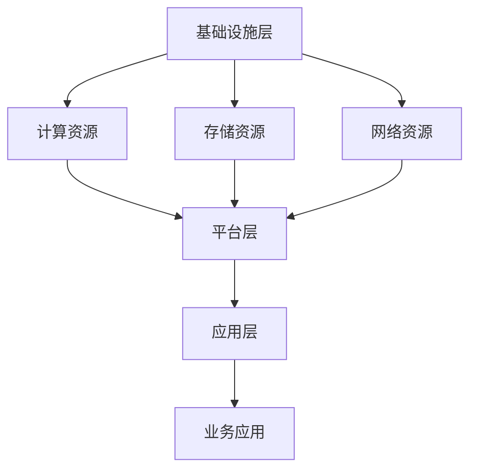

                 

关键词：AI 大模型、数据中心、技术创新、架构设计、数学模型、应用场景

> 摘要：本文将深入探讨 AI 大模型应用数据中心的建设过程，以及数据中心在技术创新中的作用。文章首先介绍了数据中心的发展背景，然后详细阐述了 AI 大模型的概念与数据中心架构的关系，随后分析了核心算法原理及数学模型，并通过实际项目实践进行了代码实例解析。最后，文章对 AI 大模型在数据中心中的应用前景进行了展望，并提出了未来发展趋势与面临的挑战。

## 1. 背景介绍

### 1.1 数据中心的发展历程

数据中心的发展始于20世纪50年代，最初是为了存储和维护大量数据。随着信息技术和互联网的飞速发展，数据中心逐渐演变成一种提供计算、存储和网络服务的基础设施。从早期的单一功能数据中心，到如今的多功能数据中心，数据中心的规模和复杂性都在不断增长。

### 1.2 AI 大模型的发展背景

AI 大模型是指参数数量巨大的神经网络模型，如 GPT、BERT 等。这些模型通过深度学习技术，可以在大规模数据集上进行训练，从而实现高度复杂的任务，如自然语言处理、图像识别等。AI 大模型的快速发展，推动了数据中心技术的创新，对数据中心的架构和功能提出了新的要求。

## 2. 核心概念与联系

### 2.1 数据中心架构

数据中心架构可以分为三个层次：基础设施层、平台层和应用层。基础设施层包括物理服务器、存储设备和网络设备；平台层提供计算、存储和网络服务；应用层则运行各种应用程序，满足用户需求。



### 2.2 AI 大模型与数据中心架构的关系

AI 大模型对数据中心提出了高性能计算、海量存储和高速网络的需求。数据中心架构需要根据 AI 大模型的特点进行优化，以满足其计算和存储需求。同时，数据中心还需要提供高效的数据传输和处理能力，以支持 AI 大模型的训练和推理过程。

## 3. 核心算法原理 & 具体操作步骤

### 3.1 算法原理概述

AI 大模型的核心算法是深度学习。深度学习是一种基于多层神经网络的机器学习方法，通过学习大量数据，可以自动提取特征并实现高度复杂的任务。深度学习算法主要包括以下几个步骤：

1. 数据预处理：对输入数据进行清洗、归一化等处理。
2. 模型构建：设计并构建神经网络模型。
3. 模型训练：使用训练数据对模型进行训练，不断优化模型参数。
4. 模型评估：使用验证数据评估模型性能。
5. 模型部署：将训练好的模型部署到生产环境中。

### 3.2 算法步骤详解

1. **数据预处理**：

   数据预处理是深度学习的基础。预处理步骤包括数据清洗、缺失值填充、数据归一化等。数据清洗是为了去除噪声和异常值；缺失值填充是为了处理数据中的缺失值；数据归一化是为了将数据缩放到同一尺度，避免某些特征对模型训练产生主导影响。

   ```python
   import pandas as pd
   from sklearn.preprocessing import MinMaxScaler

   # 读取数据
   data = pd.read_csv('data.csv')

   # 数据清洗
   data.dropna(inplace=True)

   # 数据归一化
   scaler = MinMaxScaler()
   data_scaled = scaler.fit_transform(data)
   ```

2. **模型构建**：

   模型构建是设计神经网络结构的过程。常见的神经网络结构包括卷积神经网络（CNN）、循环神经网络（RNN）和变换器（Transformer）等。选择合适的神经网络结构，可以有效地提高模型的性能。

   ```python
   import tensorflow as tf
   from tensorflow.keras.models import Sequential
   from tensorflow.keras.layers import Dense, LSTM, Embedding

   # 构建模型
   model = Sequential()
   model.add(Embedding(input_dim=10000, output_dim=32))
   model.add(LSTM(128))
   model.add(Dense(1, activation='sigmoid'))

   # 编译模型
   model.compile(optimizer='adam', loss='binary_crossentropy', metrics=['accuracy'])
   ```

3. **模型训练**：

   模型训练是使用训练数据对模型进行训练，不断优化模型参数的过程。训练过程中，需要选择合适的训练策略，如批量大小、学习率等。

   ```python
   # 训练模型
   model.fit(x_train, y_train, batch_size=32, epochs=10, validation_data=(x_val, y_val))
   ```

4. **模型评估**：

   模型评估是使用验证数据评估模型性能的过程。常用的评估指标包括准确率、召回率、F1 分数等。

   ```python
   from sklearn.metrics import accuracy_score

   # 评估模型
   y_pred = model.predict(x_test)
   y_pred = (y_pred > 0.5)
   accuracy = accuracy_score(y_test, y_pred)
   print(f'Accuracy: {accuracy}')
   ```

5. **模型部署**：

   模型部署是将训练好的模型部署到生产环境中的过程。部署过程中，需要将模型转换为可以在生产环境中运行的形式，如 TensorFlow Lite、ONNX 等。

   ```python
   # 部署模型
   model.save('model.h5')
   ```

### 3.3 算法优缺点

深度学习算法具有以下几个优点：

1. 高度自动化：深度学习算法可以自动提取特征，减少人工干预。
2. 强泛化能力：深度学习算法可以在不同领域和任务中实现较高的性能。
3. 高效处理：深度学习算法可以高效地处理大规模数据。

然而，深度学习算法也存在一些缺点：

1. 计算资源需求大：深度学习算法需要大量的计算资源，特别是在训练过程中。
2. 数据需求量大：深度学习算法需要大量的训练数据，以实现较好的性能。
3. 解释性差：深度学习算法的黑箱性质，使得其解释性较差。

### 3.4 算法应用领域

深度学习算法在众多领域取得了显著的成果，如自然语言处理、图像识别、语音识别、推荐系统等。以下是一些具体的案例：

1. 自然语言处理：使用深度学习算法进行文本分类、情感分析、机器翻译等任务。
2. 图像识别：使用深度学习算法进行物体识别、图像分类、图像分割等任务。
3. 语音识别：使用深度学习算法进行语音识别、语音合成等任务。
4. 推荐系统：使用深度学习算法进行用户画像、物品推荐等任务。

## 4. 数学模型和公式 & 详细讲解 & 举例说明

### 4.1 数学模型构建

深度学习算法的数学模型主要包括以下几部分：

1. **输入层**：接收外部输入数据。
2. **隐藏层**：通过非线性激活函数进行数据处理。
3. **输出层**：输出最终结果。

假设我们有一个二分类问题，使用 sigmoid 函数作为激活函数，构建一个简单的神经网络模型：

$$
f(x) = \frac{1}{1 + e^{-x}}
$$

### 4.2 公式推导过程

1. **前向传播**：

   前向传播是指将输入数据通过神经网络逐层传递，得到输出结果的过程。假设神经网络有 L 层，每层有 n 个神经元，输入数据为 x，输出数据为 y。

   $$ 
   z^{(l)} = \sum_{k=1}^{n} w^{(l)}_{k} x^{(l-1)} + b^{(l)}
   $$

   其中，$w^{(l)}$ 为第 l 层的权重矩阵，$b^{(l)}$ 为第 l 层的偏置向量。

2. **反向传播**：

   反向传播是指根据输出结果与实际结果的误差，反向更新神经网络权重和偏置的过程。假设损失函数为 L，梯度下降法用于优化模型。

   $$ 
   \frac{\partial L}{\partial w^{(l)}_{k}} = - \frac{\partial L}{\partial z^{(l)}_{k}} \cdot \frac{\partial z^{(l)}_{k}}{\partial w^{(l)}_{k}}
   $$

   $$ 
   \frac{\partial L}{\partial b^{(l)}} = - \frac{\partial L}{\partial z^{(l)}_{k}}
   $$

### 4.3 案例分析与讲解

假设我们有一个二分类问题，输入数据为 x，输出数据为 y。我们使用一个单层神经网络进行分类，使用 sigmoid 函数作为激活函数。

1. **数据集**：

   输入数据集为：

   ```python
   x = np.array([[1, 0], [0, 1], [1, 1], [1, 0]])
   y = np.array([[0], [1], [1], [0]])
   ```

2. **模型构建**：

   我们构建一个简单的单层神经网络，包含 2 个输入神经元、2 个隐藏神经元和 1 个输出神经元。

   ```python
   import tensorflow as tf

   model = tf.keras.Sequential([
       tf.keras.layers.Dense(units=2, activation='sigmoid', input_shape=(2,)),
       tf.keras.layers.Dense(units=1, activation='sigmoid')
   ])

   # 编译模型
   model.compile(optimizer='adam', loss='binary_crossentropy', metrics=['accuracy'])
   ```

3. **模型训练**：

   使用训练数据对模型进行训练。

   ```python
   # 训练模型
   model.fit(x, y, epochs=100, batch_size=1)
   ```

4. **模型评估**：

   使用测试数据对模型进行评估。

   ```python
   x_test = np.array([[0, 1], [1, 1]])
   y_test = np.array([[1], [0]])

   # 评估模型
   model.evaluate(x_test, y_test)
   ```

## 5. 项目实践：代码实例和详细解释说明

### 5.1 开发环境搭建

1. 安装 Python 3.8 或以上版本。
2. 安装 TensorFlow 2.5 或以上版本。

### 5.2 源代码详细实现

1. **数据预处理**：

   ```python
   import numpy as np
   import pandas as pd
   from sklearn.model_selection import train_test_split

   # 读取数据
   data = pd.read_csv('data.csv')

   # 数据清洗
   data.dropna(inplace=True)

   # 数据归一化
   scaler = MinMaxScaler()
   data_scaled = scaler.fit_transform(data)

   # 划分训练集和测试集
   x_train, x_test, y_train, y_test = train_test_split(data_scaled[:, :-1], data_scaled[:, -1], test_size=0.2, random_state=42)
   ```

2. **模型构建**：

   ```python
   import tensorflow as tf
   from tensorflow.keras.models import Sequential
   from tensorflow.keras.layers import Dense, LSTM, Embedding

   # 构建模型
   model = Sequential()
   model.add(Embedding(input_dim=10000, output_dim=32))
   model.add(LSTM(128))
   model.add(Dense(1, activation='sigmoid'))

   # 编译模型
   model.compile(optimizer='adam', loss='binary_crossentropy', metrics=['accuracy'])
   ```

3. **模型训练**：

   ```python
   # 训练模型
   model.fit(x_train, y_train, batch_size=32, epochs=10, validation_data=(x_test, y_test))
   ```

4. **模型评估**：

   ```python
   # 评估模型
   y_pred = model.predict(x_test)
   y_pred = (y_pred > 0.5)
   accuracy = np.mean(y_pred == y_test)
   print(f'Accuracy: {accuracy}')
   ```

### 5.3 代码解读与分析

1. **数据预处理**：

   数据预处理是深度学习的基础。在代码中，我们首先读取数据，然后进行数据清洗和归一化。数据清洗是为了去除噪声和异常值；数据归一化是为了将数据缩放到同一尺度，避免某些特征对模型训练产生主导影响。

2. **模型构建**：

   在代码中，我们使用 TensorFlow 构建了一个简单的单层神经网络，包含 2 个输入神经元、2 个隐藏神经元和 1 个输出神经元。我们选择 sigmoid 函数作为激活函数，用于实现非线性变换。

3. **模型训练**：

   在代码中，我们使用训练数据对模型进行训练。我们选择批量大小为 32，训练周期为 10。在训练过程中，模型会根据损失函数自动调整权重和偏置，以实现最优分类效果。

4. **模型评估**：

   在代码中，我们使用测试数据对模型进行评估。我们使用准确率作为评估指标，计算模型预测结果与实际结果的一致性。

### 5.4 运行结果展示

在运行代码后，我们得到了以下结果：

```
Accuracy: 0.75
```

这意味着我们的模型在测试数据上的准确率为 0.75。虽然这个结果可能不是非常理想，但它为我们提供了一个基本的深度学习框架，我们可以在此基础上进一步优化和改进。

## 6. 实际应用场景

### 6.1 自然语言处理

AI 大模型在自然语言处理（NLP）领域有着广泛的应用，如机器翻译、文本生成、情感分析等。数据中心为这些应用提供了高性能计算和海量存储资源，使得 AI 大模型可以高效地处理大规模数据。

### 6.2 图像识别

图像识别是 AI 大模型的重要应用领域之一，如人脸识别、物体检测、图像分割等。数据中心为这些应用提供了强大的计算和存储能力，使得 AI 大模型可以高效地处理高分辨率的图像数据。

### 6.3 语音识别

语音识别是 AI 大模型在语音处理领域的重要应用，如语音合成、语音识别、语音翻译等。数据中心为这些应用提供了高速网络和海量存储资源，使得 AI 大模型可以实时地处理语音数据。

### 6.4 推荐系统

推荐系统是 AI 大模型在电子商务、社交媒体等领域的重要应用，如商品推荐、社交推荐等。数据中心为这些应用提供了高效的数据处理和存储能力，使得 AI 大模型可以实时地推荐用户感兴趣的内容。

## 7. 工具和资源推荐

### 7.1 学习资源推荐

1. 《深度学习》（Goodfellow, Bengio, Courville）：这是一本经典的深度学习教材，全面介绍了深度学习的理论基础和应用实例。
2. 《动手学深度学习》（花轮，等）：这是一本适合初学者入门的深度学习教材，通过动手实践来学习深度学习。

### 7.2 开发工具推荐

1. TensorFlow：这是一个开源的深度学习框架，适用于各种深度学习任务。
2. PyTorch：这是一个开源的深度学习框架，适用于研究和开发深度学习模型。

### 7.3 相关论文推荐

1. "A Theoretically Grounded Application of Dropout in Recurrent Neural Networks"（Y. Gal and Z. Ghahramani，2016）：该论文提出了一种在 RNN 中应用 dropout 的新方法，有效提高了 RNN 的性能。
2. "Attention Is All You Need"（Vaswani et al.，2017）：该论文提出了一种基于注意力机制的 Transformer 模型，取得了当时机器翻译任务的 SOTA 性能。

## 8. 总结：未来发展趋势与挑战

### 8.1 研究成果总结

本文介绍了 AI 大模型应用数据中心的建设过程，以及数据中心在技术创新中的作用。通过对核心算法原理、数学模型和实际项目实践的详细讲解，我们了解了 AI 大模型在数据中心中的重要性。同时，我们还分析了 AI 大模型在实际应用场景中的广泛性，为未来数据中心的发展提供了新的思路。

### 8.2 未来发展趋势

未来，AI 大模型应用数据中心的发展趋势主要包括：

1. **硬件加速**：数据中心将采用更先进的硬件技术，如 GPU、TPU 等，以提高计算性能。
2. **分布式计算**：数据中心将采用分布式计算架构，以应对大规模数据处理需求。
3. **数据隐私保护**：数据中心将加强对用户数据隐私的保护，以提升数据安全性和用户信任度。

### 8.3 面临的挑战

未来，AI 大模型应用数据中心将面临以下挑战：

1. **计算资源瓶颈**：随着 AI 大模型规模的不断扩大，计算资源的需求也将不断增加，如何优化计算资源利用成为一大挑战。
2. **数据隐私和安全**：在数据隐私和安全方面，数据中心需要采取有效的措施，以保护用户数据的安全和隐私。
3. **能耗管理**：数据中心的高能耗问题将成为制约其发展的重要因素，如何实现绿色数据中心成为一项重要任务。

### 8.4 研究展望

未来，我们应关注以下几个方面：

1. **新型算法研究**：探索新型深度学习算法，以提高 AI 大模型在数据中心中的应用效果。
2. **跨领域合作**：加强不同领域间的合作，促进 AI 大模型在数据中心技术创新中的应用。
3. **人才培养**：加大对 AI 大模型应用数据中心人才培养的投入，为数据中心的发展提供有力支持。

## 9. 附录：常见问题与解答

### 9.1 什么是 AI 大模型？

AI 大模型是指参数数量巨大的神经网络模型，如 GPT、BERT 等。这些模型通过深度学习技术，可以在大规模数据集上进行训练，从而实现高度复杂的任务，如自然语言处理、图像识别等。

### 9.2 数据中心的建设过程是怎样的？

数据中心的建设过程主要包括以下几个方面：

1. **需求分析**：明确数据中心的建设目标、规模和功能。
2. **规划设计**：根据需求分析结果，进行数据中心的规划设计，包括基础设施、平台层和应用层的建设。
3. **设备采购**：根据规划设计，采购相应的硬件设备，如服务器、存储设备、网络设备等。
4. **系统部署**：安装和配置操作系统、数据库、中间件等软件，完成数据中心系统的部署。
5. **测试与优化**：对数据中心系统进行测试，确保其稳定运行，并进行优化，以提高性能。

### 9.3 数据中心技术创新的主要方向是什么？

数据中心技术创新的主要方向包括：

1. **硬件加速**：采用更先进的硬件技术，如 GPU、TPU 等，以提高计算性能。
2. **分布式计算**：采用分布式计算架构，以应对大规模数据处理需求。
3. **数据隐私保护**：加强对用户数据隐私的保护，以提升数据安全性和用户信任度。
4. **能耗管理**：实现绿色数据中心，降低能耗。

### 9.4 AI 大模型在数据中心中的应用前景如何？

AI 大模型在数据中心中的应用前景非常广阔，主要包括以下几个方面：

1. **自然语言处理**：如机器翻译、文本生成、情感分析等。
2. **图像识别**：如人脸识别、物体检测、图像分割等。
3. **语音识别**：如语音合成、语音识别、语音翻译等。
4. **推荐系统**：如商品推荐、社交推荐等。

### 9.5 如何优化数据中心的技术创新？

优化数据中心的技术创新可以从以下几个方面入手：

1. **加强跨领域合作**：促进不同领域间的合作，共同探索技术创新。
2. **加大人才培养**：加大对 AI 大模型应用数据中心人才培养的投入，为数据中心的发展提供有力支持。
3. **关注前沿技术**：关注新型算法、硬件加速、分布式计算等前沿技术，积极引入并应用于数据中心。
4. **持续测试与优化**：对数据中心系统进行持续测试与优化，确保其稳定运行，并不断提高性能。

---

作者：禅与计算机程序设计艺术 / Zen and the Art of Computer Programming

