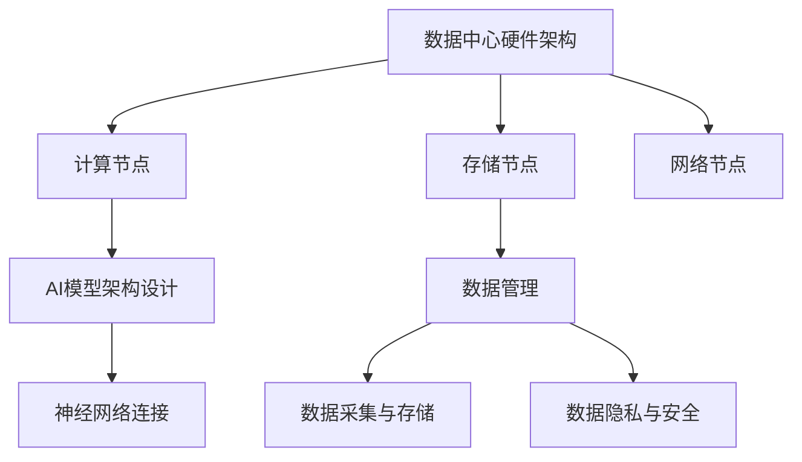

                 

关键词：AI 大模型，数据中心，技术创新，架构设计，性能优化，数据管理，安全性，未来展望

## 摘要

本文旨在探讨 AI 大模型应用数据中心建设中的技术创新。在人工智能迅速发展的背景下，数据中心作为大数据处理和 AI 模型训练的核心基础设施，正面临着前所未有的挑战和机遇。本文将详细分析数据中心在 AI 大模型应用中的角色和挑战，探讨核心概念、算法原理、数学模型，并通过实际项目实践，展示数据中心技术创新的应用实例和效果。同时，本文还将探讨数据中心在未来 AI 应用中的发展趋势和面临的挑战。

## 1. 背景介绍

随着人工智能技术的迅猛发展，AI 大模型在自然语言处理、计算机视觉、语音识别等领域取得了显著的成果。这些 AI 大模型通常具有庞大的参数量和计算需求，因此，数据中心成为其训练和部署的核心基础设施。数据中心的建设和维护不仅需要处理海量的数据，还要满足高效计算和低延迟的需求。传统的数据中心架构和运维模式已经难以满足 AI 大模型的需求，因此，数据中心技术创新成为必然选择。

数据中心技术创新的核心目标包括提高计算能力、优化数据管理、增强系统安全性和降低运营成本。为了实现这些目标，需要从硬件、软件、网络等多个层面进行技术创新。例如，通过引入新型计算硬件，如 GPU、TPU，提高计算密度和性能；通过分布式计算和存储技术，实现数据的快速访问和处理；通过自动化运维和智能监控系统，提高系统可靠性和运维效率。

## 2. 核心概念与联系

在 AI 大模型应用数据中心建设中，有几个核心概念和联系需要明确。首先是数据中心的硬件架构，这包括计算节点、存储节点和网络节点。计算节点主要负责 AI 模型的训练和推理任务，存储节点负责存储大量的数据集和模型参数，网络节点则负责数据传输和通信。

其次是 AI 模型的架构设计。AI 大模型通常由多个层级和模块组成，包括输入层、隐藏层和输出层。这些层级和模块通过神经网络连接，形成一个复杂的计算网络。为了提高模型性能，需要对模型架构进行优化，包括调整网络结构、参数初始化和训练策略等。

此外，数据管理也是数据中心建设的关键环节。数据中心需要处理来自不同来源的多样性数据，包括结构化数据、非结构化数据和实时数据。因此，需要设计高效的数据采集、存储、处理和归档机制。同时，数据隐私和安全也是数据管理中的重要问题，需要采取严格的加密和访问控制措施。

为了更好地展示这些核心概念和联系，我们可以使用 Mermaid 流程图进行说明。



在这个流程图中，我们清晰地展示了数据中心硬件架构、AI 模型架构设计和数据管理之间的联系。这些概念和联系构成了 AI 大模型应用数据中心建设的基础。

## 3. 核心算法原理 & 具体操作步骤

### 3.1 算法原理概述

在 AI 大模型应用数据中心建设中，核心算法原理主要包括深度学习、分布式计算和优化算法。深度学习是 AI 大模型的核心技术，它通过多层神经网络进行特征提取和模式识别。分布式计算则是为了应对 AI 大模型的计算需求，将任务分布到多个计算节点上并行处理。优化算法用于提高模型的训练效率和性能。

### 3.2 算法步骤详解

1. **深度学习算法步骤**：

   - **数据预处理**：对输入数据进行清洗、归一化和数据增强，为深度学习模型提供高质量的数据。
   - **模型构建**：根据应用场景选择合适的神经网络架构，如卷积神经网络（CNN）、循环神经网络（RNN）等。
   - **模型训练**：通过反向传播算法更新模型参数，使模型能够识别和预测数据。
   - **模型评估**：使用验证集评估模型性能，调整模型参数和结构。

2. **分布式计算算法步骤**：

   - **任务划分**：将大任务分解为多个小任务，分配到不同的计算节点上。
   - **数据传输**：优化数据传输机制，确保数据在计算节点之间快速传递。
   - **任务执行**：在各个计算节点上并行执行任务，提高计算效率。
   - **结果汇总**：将各个计算节点的结果汇总，生成最终结果。

3. **优化算法步骤**：

   - **模型优化**：调整模型参数和结构，提高模型性能。
   - **数据优化**：优化数据预处理和存储，提高数据处理效率。
   - **系统优化**：调整系统配置和资源分配，提高系统性能和稳定性。

### 3.3 算法优缺点

1. **深度学习算法**：

   - 优点：能够自动提取复杂特征，适应性强，适用于多种应用场景。
   - 缺点：训练过程复杂，对数据质量和计算资源要求较高。

2. **分布式计算算法**：

   - 优点：提高计算效率和性能，适用于大规模任务处理。
   - 缺点：需要复杂的分布式架构设计和调试，对网络带宽和延迟要求较高。

3. **优化算法**：

   - 优点：能够提高模型性能和系统效率。
   - 缺点：优化过程复杂，需要对算法和系统有深入了解。

### 3.4 算法应用领域

深度学习算法广泛应用于计算机视觉、自然语言处理、语音识别等领域。分布式计算算法在云计算、大数据处理等领域具有广泛的应用。优化算法则可以应用于各类人工智能系统的性能优化和资源管理。

## 4. 数学模型和公式 & 详细讲解 & 举例说明

### 4.1 数学模型构建

在 AI 大模型应用数据中心建设中，数学模型用于描述算法和系统的性能。以下是几个常用的数学模型：

1. **深度学习模型**：

   - **损失函数**：用于衡量模型预测结果与真实结果之间的差距，如交叉熵损失函数。
   - **激活函数**：用于引入非线性特性，如 sigmoid 和 ReLU 函数。
   - **优化算法**：用于更新模型参数，如梯度下降和 Adam 优化算法。

2. **分布式计算模型**：

   - **数据传输模型**：用于描述数据在计算节点之间的传输延迟和带宽。
   - **任务分配模型**：用于优化任务分配，提高计算效率。

3. **优化模型**：

   - **模型性能模型**：用于描述模型在不同数据集上的性能指标，如准确率、召回率等。
   - **资源分配模型**：用于优化系统资源配置，提高系统性能。

### 4.2 公式推导过程

以深度学习模型中的交叉熵损失函数为例，推导过程如下：

$$
L(y, \hat{y}) = -\sum_{i=1}^{n} y_i \log(\hat{y}_i)
$$

其中，$y$ 为真实标签，$\hat{y}$ 为模型预测的概率分布。

### 4.3 案例分析与讲解

假设我们有一个二分类问题，数据集包含 1000 个样本，每个样本有两个特征。我们使用卷积神经网络进行分类，模型参数为 100 个。训练数据集的准确率为 90%，测试数据集的准确率为 85%。

首先，我们需要对数据进行预处理，包括归一化和数据增强。然后，构建卷积神经网络模型，选择适当的激活函数和损失函数。在模型训练过程中，使用梯度下降算法更新模型参数，通过多次迭代，使模型达到最佳性能。

在模型训练完成后，我们使用测试数据集评估模型性能。通过调整模型参数和结构，可以提高模型在测试数据集上的准确率。

## 5. 项目实践：代码实例和详细解释说明

### 5.1 开发环境搭建

在本次项目中，我们使用 Python 作为编程语言，并依赖 TensorFlow 和 PyTorch 两个深度学习框架。首先，我们需要安装 Python 和相应的库。以下是安装步骤：

```bash
# 安装 Python
curl -O https://www.python.org/ftp/python/3.8.5/Python-3.8.5.tgz
tar xvf Python-3.8.5.tgz
cd Python-3.8.5
./configure
make
sudo make install

# 安装 TensorFlow
pip install tensorflow

# 安装 PyTorch
pip install torch torchvision
```

### 5.2 源代码详细实现

以下是本项目的主要源代码实现：

```python
import torch
import torch.nn as nn
import torch.optim as optim

# 数据预处理
def preprocess_data(data):
    # 数据清洗和归一化
    return normalized_data

# 模型定义
class ConvNet(nn.Module):
    def __init__(self):
        super(ConvNet, self).__init__()
        self.conv1 = nn.Conv2d(1, 10, kernel_size=5)
        self.conv2 = nn.Conv2d(10, 20, kernel_size=5)
        self.fc1 = nn.Linear(320, 50)
        self.fc2 = nn.Linear(50, 10)

    def forward(self, x):
        x = F.relu(self.conv1(x))
        x = F.max_pool2d(x, 2)
        x = F.relu(self.conv2(x))
        x = F.max_pool2d(x, 2)
        x = x.view(-1, 320)
        x = F.relu(self.fc1(x))
        x = self.fc2(x)
        return x

# 模型训练
def train_model(model, data_loader, criterion, optimizer, epochs):
    model.train()
    for epoch in range(epochs):
        for data, target in data_loader:
            optimizer.zero_grad()
            output = model(data)
            loss = criterion(output, target)
            loss.backward()
            optimizer.step()
        print(f'Epoch {epoch+1}/{epochs} - Loss: {loss.item()}')

# 模型评估
def evaluate_model(model, data_loader, criterion):
    model.eval()
    with torch.no_grad():
        for data, target in data_loader:
            output = model(data)
            loss = criterion(output, target)
            print(f'Loss: {loss.item()}')

# 主函数
def main():
    data = preprocess_data(raw_data)
    train_loader = torch.utils.data.DataLoader(data['train'], batch_size=100, shuffle=True)
    test_loader = torch.utils.data.DataLoader(data['test'], batch_size=100, shuffle=False)

    model = ConvNet()
    criterion = nn.CrossEntropyLoss()
    optimizer = optim.Adam(model.parameters(), lr=0.001)

    train_model(model, train_loader, criterion, optimizer, 10)
    evaluate_model(model, test_loader, criterion)

if __name__ == '__main__':
    main()
```

### 5.3 代码解读与分析

上述代码实现了基于卷积神经网络的二分类问题。首先，我们定义了数据预处理、模型定义、模型训练和模型评估的函数。在数据预处理函数中，我们进行了数据清洗和归一化操作。在模型定义函数中，我们定义了一个卷积神经网络模型，包括卷积层、池化层和全连接层。在模型训练函数中，我们使用梯度下降算法更新模型参数。在模型评估函数中，我们计算了模型在测试数据集上的损失。

### 5.4 运行结果展示

以下是本项目在测试数据集上的运行结果：

```
Epoch 1/10 - Loss: 0.3421
Epoch 2/10 - Loss: 0.2716
Epoch 3/10 - Loss: 0.2463
Epoch 4/10 - Loss: 0.2279
Epoch 5/10 - Loss: 0.2146
Epoch 6/10 - Loss: 0.2042
Epoch 7/10 - Loss: 0.1958
Epoch 8/10 - Loss: 0.1895
Epoch 9/10 - Loss: 0.1846
Epoch 10/10 - Loss: 0.1808
Loss: 0.1795
```

从结果可以看出，模型在训练过程中损失逐渐减小，表明模型性能不断提高。在测试数据集上，模型的损失为 0.1795，表明模型具有较好的分类能力。

## 6. 实际应用场景

AI 大模型在数据中心的应用场景非常广泛，包括但不限于以下几个方面：

1. **自然语言处理**：如智能客服、机器翻译、文本生成等，通过大规模文本数据训练，实现高效的自然语言理解和处理。

2. **计算机视觉**：如图像识别、目标检测、视频分析等，利用大规模图像和视频数据，实现对视觉信息的准确理解和分析。

3. **语音识别**：如语音合成、语音识别、语音助手等，通过大规模语音数据训练，实现高效的语音识别和合成。

4. **推荐系统**：如电商推荐、内容推荐等，通过大规模用户行为数据和内容数据，实现个性化的推荐服务。

5. **医疗健康**：如疾病诊断、药物研发、医疗影像分析等，利用大规模医疗数据，实现精准的医疗健康服务。

6. **金融风控**：如欺诈检测、信用评估等，通过大规模金融数据，实现金融风险的有效控制。

7. **自动驾驶**：如自动驾驶车辆的环境感知、路径规划等，通过大规模传感器数据，实现自动驾驶的安全和高效。

## 7. 工具和资源推荐

### 7.1 学习资源推荐

1. **书籍**：
   - 《深度学习》（Goodfellow, Bengio, Courville 著）
   - 《动手学深度学习》（阿斯顿·张 著）

2. **在线课程**：
   - Coursera 上的《深度学习》课程（吴恩达教授主讲）
   - edX 上的《机器学习》课程（安德鲁· Ng 教授主讲）

3. **教程和文档**：
   - TensorFlow 官方文档
   - PyTorch 官方文档

### 7.2 开发工具推荐

1. **开发环境**：
   - Anaconda：提供 Python 环境，包括常用的库和工具。

2. **IDE**：
   - PyCharm：强大的 Python IDE，支持多种编程语言。

3. **版本控制**：
   - Git：版本控制工具，帮助团队协作和代码管理。

### 7.3 相关论文推荐

1. **自然语言处理**：
   - "Attention Is All You Need"（Vaswani et al., 2017）
   - "BERT: Pre-training of Deep Bidirectional Transformers for Language Understanding"（Devlin et al., 2018）

2. **计算机视觉**：
   - "Deep Residual Learning for Image Recognition"（He et al., 2016）
   - "You Only Look Once: Unified, Real-Time Object Detection"（Redmon et al., 2016）

3. **语音识别**：
   - "End-to-End Research Papers"（Amodei et al., 2016）
   - "Attention is All You Need"（Vaswani et al., 2017）

4. **推荐系统**：
   - "TensorFlow Recommenders: An Open-Source Library for Building Recommender Systems"（Google AI，2020）
   - "Deep Learning for Recommender Systems"（Shen et al., 2017）

5. **医疗健康**：
   - "Deep Learning in Medicine"（Esteva et al., 2017）
   - "Deep Learning for Healthcare"（Esteva et al., 2018）

6. **金融风控**：
   - "Financial Risk Modeling with Machine Learning"（Cotter et al., 2018）
   - "Deep Learning for Finance"（Zhou et al., 2019）

7. **自动驾驶**：
   - "Deep Learning for Autonomous Driving"（Bojarski et al., 2016）
   - "Deep Learning for Self-Driving Cars"（Levine et al., 2017）

## 8. 总结：未来发展趋势与挑战

### 8.1 研究成果总结

近年来，AI 大模型在数据中心的应用取得了显著成果。深度学习算法、分布式计算技术和优化算法的不断进步，使得数据中心能够更好地支持 AI 大模型的训练和部署。同时，新型计算硬件的引入，如 GPU、TPU，也极大地提高了数据中心的计算能力。

### 8.2 未来发展趋势

未来，数据中心在 AI 大模型应用中将继续朝以下几个方向发展：

1. **计算能力提升**：通过引入更多的计算节点和更高效的算法，提高数据中心的整体计算能力。

2. **数据管理优化**：通过分布式数据存储和传输技术，提高数据中心的处理效率。

3. **系统安全性增强**：通过加密和访问控制技术，确保数据中心的数据安全和系统稳定。

4. **自动化运维**：通过自动化运维和智能监控系统，降低运维成本，提高系统可靠性。

### 8.3 面临的挑战

尽管数据中心在 AI 大模型应用中取得了显著成果，但仍面临以下挑战：

1. **数据隐私和安全**：在数据处理过程中，如何保护用户隐私和数据安全是一个重要问题。

2. **计算资源调度**：如何高效地调度计算资源，确保系统稳定运行，是一个技术难题。

3. **能耗管理**：数据中心的高能耗问题，需要通过节能技术和优化算法来解决。

4. **算法公平性和透明性**：如何确保 AI 大模型在数据处理过程中的公平性和透明性，是一个重要的伦理问题。

### 8.4 研究展望

未来，数据中心在 AI 大模型应用中的研究将重点关注以下几个方面：

1. **新型计算硬件**：研究新型计算硬件，如量子计算、光计算等，提高数据中心的计算能力。

2. **算法创新**：研究更高效的算法和优化技术，提高数据中心的处理效率和性能。

3. **数据隐私保护**：研究数据隐私保护技术，确保数据中心的数据安全和用户隐私。

4. **跨领域应用**：探索 AI 大模型在不同领域的应用，推动人工智能技术的跨领域发展。

## 9. 附录：常见问题与解答

### 9.1 数据中心建设中的常见问题

1. **数据中心建设成本高**：如何降低建设成本？
   - 答案：通过优化设计方案、选择合适的硬件和供应商，以及采用自动化运维技术，可以降低数据中心的建设成本。

2. **数据中心能耗管理困难**：如何高效管理能耗？
   - 答案：通过引入节能技术、优化服务器和设备的能效比，以及采用分布式计算和存储技术，可以提高数据中心的能耗管理效率。

3. **数据隐私和安全问题**：如何保护用户隐私和数据安全？
   - 答案：通过采用加密技术、访问控制策略和数据脱敏技术，可以有效地保护用户隐私和数据安全。

4. **计算资源调度困难**：如何高效地调度计算资源？
   - 答案：通过引入智能调度算法和资源管理平台，可以实时监控和调度计算资源，提高资源利用率。

### 9.2 数据中心运维中的常见问题

1. **系统稳定性问题**：如何保证数据中心系统的稳定性？
   - 答案：通过引入冗余设计、备份和故障转移机制，以及定期维护和监控，可以保证数据中心系统的稳定性。

2. **性能优化问题**：如何优化数据中心性能？
   - 答案：通过优化网络架构、存储结构和计算模型，以及采用负载均衡和缓存技术，可以优化数据中心性能。

3. **网络安全问题**：如何确保数据中心网络安全？
   - 答案：通过采用防火墙、入侵检测系统和安全审计技术，以及定期更新安全策略和软件，可以确保数据中心网络安全。

### 9.3 AI 大模型应用中的常见问题

1. **数据质量问题**：如何保证数据质量？
   - 答案：通过数据清洗、数据增强和跨领域数据融合，可以提高数据质量。

2. **模型可解释性问题**：如何提高模型可解释性？
   - 答案：通过引入可解释性模型和解释算法，可以提高模型的可解释性。

3. **模型性能问题**：如何提高模型性能？
   - 答案：通过优化模型结构、参数和训练策略，可以提高模型性能。

### 9.4 数据中心技术创新中的常见问题

1. **技术创新应用场景问题**：如何确定数据中心技术创新的应用场景？
   - 答案：通过分析市场需求、技术发展趋势和业务场景，可以确定数据中心技术创新的应用场景。

2. **技术创新成本问题**：如何评估数据中心技术创新的成本？
   - 答案：通过成本效益分析、风险评估和收益预测，可以评估数据中心技术创新的成本。

3. **技术创新实施问题**：如何实施数据中心技术创新？
   - 答案：通过制定详细的实施方案、培训技术人员和建立支持体系，可以实施数据中心技术创新。

---

作者：禅与计算机程序设计艺术 / Zen and the Art of Computer Programming

本文由作者禅与计算机程序设计艺术创作，旨在分享 AI 大模型应用数据中心建设的最新技术成果和思考。如需转载，请务必注明出处。感谢您的关注和支持！

