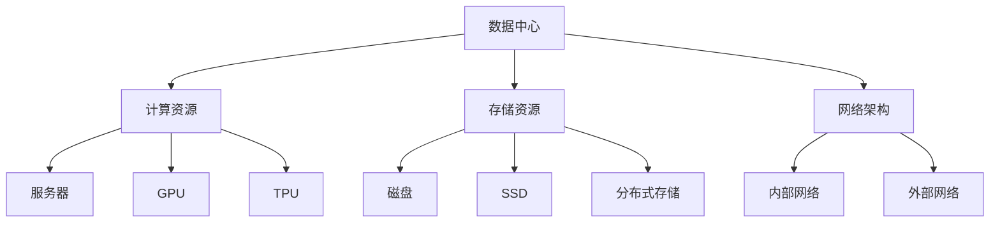

                 

关键词：AI 大模型，数据中心建设，投资分析，建设策略，技术框架

> 摘要：本文将深入探讨 AI 大模型应用数据中心的建设过程，从投资与建设的角度出发，详细分析数据中心建设的必要性、投资策略、技术框架以及未来应用前景。通过全面剖析，为相关企业和研究机构提供有价值的参考和指导。

## 1. 背景介绍

随着人工智能技术的飞速发展，AI 大模型在各个领域展现出了强大的应用潜力。无论是自然语言处理、计算机视觉，还是推荐系统、智能决策，AI 大模型都在改变着我们的生活和工作方式。然而，AI 大模型的训练和部署需要大量的计算资源和存储资源，这就催生了数据中心建设的兴起。

数据中心作为存储、处理和交换数据的集中化设施，已经成为支撑 AI 大模型应用的关键基础设施。然而，数据中心的建设不仅仅是硬件设备的堆砌，更涉及到投资策略、技术架构、运维管理等多个方面。因此，如何科学合理地进行数据中心投资与建设，成为了一个亟待解决的问题。

本文将从数据中心建设的必要性、投资策略、技术框架以及未来应用前景等方面，全面探讨 AI 大模型应用数据中心的建设过程。希望通过本文的阐述，能够为相关企业和研究机构提供一些有益的参考和指导。

## 2. 核心概念与联系

在探讨 AI 大模型应用数据中心建设之前，我们首先需要理解一些核心概念，包括数据中心、计算资源、存储资源、网络架构等。

### 2.1 数据中心

数据中心（Data Center）是一个集中化存储、处理和交换数据的设施。它通常由一系列计算机设备、网络设备、存储设备以及其他相关设备组成。数据中心的主要功能是为用户提供可靠、高效的数据存储和处理服务。

### 2.2 计算资源

计算资源是指用于数据计算处理的硬件设备，如服务器、GPU、TPU 等。在 AI 大模型应用中，计算资源的需求量非常大，因为 AI 大模型的训练和推理过程需要大量的计算能力。

### 2.3 存储资源

存储资源是指用于数据存储的硬件设备，如磁盘、固态硬盘（SSD）、分布式存储系统等。在 AI 大模型应用中，需要存储大量的训练数据、模型参数以及中间结果，因此对存储资源的需求也很大。

### 2.4 网络架构

网络架构是指数据中心内部以及数据中心之间的通信网络结构。一个高效的网络架构能够确保数据快速、安全地在各个计算节点和存储节点之间传输。

### 2.5 Mermaid 流程图

下面是一个描述 AI 大模型应用数据中心核心概念和联系的 Mermaid 流程图：



## 3. 核心算法原理 & 具体操作步骤

### 3.1 算法原理概述

AI 大模型应用数据中心的建设涉及到多个核心算法和操作步骤。以下是其中几个关键步骤的概述：

### 3.1.1 数据预处理

数据预处理是 AI 大模型训练的重要环节。主要包括数据清洗、数据增强、数据归一化等操作。通过数据预处理，可以提升模型训练效果，减少过拟合现象。

### 3.1.2 模型训练

模型训练是 AI 大模型应用的核心步骤。通过使用大量的训练数据和计算资源，对模型进行迭代训练，优化模型参数，提高模型性能。

### 3.1.3 模型评估

模型评估用于衡量模型在特定任务上的表现。通过评估指标（如准确率、召回率、F1 分数等），可以判断模型是否达到预期效果。

### 3.1.4 模型部署

模型部署是将训练好的模型部署到实际应用场景中。部署过程包括模型打包、模型加载、模型推理等操作。

### 3.2 算法步骤详解

以下是 AI 大模型应用数据中心建设的关键算法步骤的详细解释：

### 3.2.1 数据预处理

数据预处理包括以下步骤：

1. 数据清洗：去除无效数据、处理缺失值、纠正错误数据等。
2. 数据增强：通过数据变换、数据扩充等方式，增加数据的多样性和覆盖度。
3. 数据归一化：将不同数据类型的特征进行归一化处理，使其具有相同的量纲和范围。

### 3.2.2 模型训练

模型训练包括以下步骤：

1. 数据加载：将预处理后的数据加载到计算资源中，准备训练数据。
2. 模型初始化：初始化模型参数，可以选择随机初始化或预训练模型。
3. 训练循环：通过迭代训练，优化模型参数，降低损失函数。
4. 模型评估：在训练过程中，定期评估模型性能，判断是否满足训练目标。

### 3.2.3 模型评估

模型评估包括以下步骤：

1. 数据准备：准备用于评估的数据集，可以是训练集的一部分或独立的测试集。
2. 评估指标：选择合适的评估指标，如准确率、召回率、F1 分数等。
3. 模型评估：在评估数据集上运行模型，计算评估指标。
4. 结果分析：分析评估结果，判断模型性能是否满足预期。

### 3.2.4 模型部署

模型部署包括以下步骤：

1. 模型打包：将训练好的模型打包成可执行文件或模型库。
2. 模型加载：将模型加载到服务器或其他计算设备中。
3. 模型推理：接收输入数据，运行模型进行推理，输出结果。
4. 模型优化：根据实际应用需求，对模型进行优化，提高性能。

### 3.3 算法优缺点

每种算法都有其优缺点。以下是 AI 大模型应用数据中心建设中的几种关键算法的优缺点分析：

### 3.3.1 数据预处理算法

优点：数据预处理能够有效提升模型训练效果，减少过拟合现象。

缺点：数据预处理需要消耗大量计算资源和时间，且对数据质量要求较高。

### 3.3.2 模型训练算法

优点：模型训练能够优化模型参数，提高模型性能。

缺点：模型训练需要大量计算资源和时间，且训练过程可能产生过拟合。

### 3.3.3 模型评估算法

优点：模型评估能够准确衡量模型性能，指导模型优化。

缺点：评估过程可能需要大量评估数据，且评估指标的选择可能影响评估结果。

### 3.3.4 模型部署算法

优点：模型部署能够将训练好的模型应用于实际场景，实现模型价值。

缺点：模型部署可能需要额外的优化和调整，且部署过程可能面临安全隐患。

### 3.4 算法应用领域

AI 大模型应用数据中心建设的算法在多个领域具有广泛的应用前景：

1. 自然语言处理：如机器翻译、情感分析、文本分类等。
2. 计算机视觉：如图像识别、目标检测、人脸识别等。
3. 推荐系统：如商品推荐、音乐推荐、内容推荐等。
4. 智能决策：如金融风控、智能物流、医疗诊断等。

## 4. 数学模型和公式 & 详细讲解 & 举例说明

在 AI 大模型应用数据中心建设中，数学模型和公式起着至关重要的作用。以下我们将介绍几个关键数学模型，并进行详细讲解和举例说明。

### 4.1 数学模型构建

#### 4.1.1 前向传播

前向传播是神经网络训练过程中的一个关键步骤。其核心公式为：

\[ z^{[l]} = \sum_{m=1}^{M} W^{[l]}_{ji} a^{[l-1]}_{ji} + b^{[l]}_{j} \]

其中，\( z^{[l]} \) 是第 \( l \) 层的输入，\( W^{[l]}_{ji} \) 是第 \( l \) 层的权重矩阵，\( a^{[l-1]}_{ji} \) 是第 \( l-1 \) 层的激活值，\( b^{[l]}_{j} \) 是第 \( l \) 层的偏置。

#### 4.1.2 损失函数

损失函数是衡量模型训练效果的重要指标。常用的损失函数有均方误差（MSE）和交叉熵（Cross-Entropy）。其中，交叉熵损失函数的公式为：

\[ J = -\frac{1}{m} \sum_{i=1}^{m} y^{(i)} \log(a^{[L]}_{i}) \]

其中，\( y^{(i)} \) 是真实标签，\( a^{[L]}_{i} \) 是第 \( L \) 层的输出。

#### 4.1.3 反向传播

反向传播是神经网络训练过程中的另一个关键步骤。其核心公式为：

\[ \delta^{[l]}_{j} = (dz^{[l]}) \cdot \sigma'(z^{[l]}) \]

其中，\( \delta^{[l]}_{j} \) 是第 \( l \) 层的误差，\( dz^{[l]} \) 是 \( z^{[l]} \) 的导数，\( \sigma' \) 是激活函数的导数。

### 4.2 公式推导过程

#### 4.2.1 前向传播推导

前向传播的推导过程主要涉及到矩阵运算和函数复合。具体推导过程如下：

\[ z^{[l]} = \sum_{m=1}^{M} W^{[l]}_{ji} a^{[l-1]}_{ji} + b^{[l]}_{j} \]

\[ = (W^{[l]} a^{[l-1]} + b^{[l]})_j \]

其中，\( W^{[l]} a^{[l-1]} + b^{[l]} \) 可以看作是一个新的向量，其每个元素都是 \( W^{[l]}_{ji} a^{[l-1]}_{ji} + b^{[l]}_{j} \)。

#### 4.2.2 损失函数推导

损失函数的推导过程主要涉及到对数函数的性质。具体推导过程如下：

\[ J = -\frac{1}{m} \sum_{i=1}^{m} y^{(i)} \log(a^{[L]}_{i}) \]

\[ = -\frac{1}{m} \sum_{i=1}^{m} y^{(i)} \log(\sigma(z^{[L]})) \]

其中，\( \sigma(z^{[L]}) \) 表示 \( z^{[L]} \) 经过激活函数后的输出。

#### 4.2.3 反向传播推导

反向传播的推导过程主要涉及到链式法则。具体推导过程如下：

\[ \delta^{[l]}_{j} = (dz^{[l]}) \cdot \sigma'(z^{[l]}) \]

\[ = \frac{\partial J}{\partial z^{[l]}} \cdot \sigma'(z^{[l]}) \]

其中，\( dz^{[l]} \) 可以看作是 \( J \) 关于 \( z^{[l]} \) 的导数。

### 4.3 案例分析与讲解

为了更好地理解上述数学模型和公式，我们通过一个简单的例子进行讲解。

假设我们有一个两层神经网络，其中第一层有 3 个神经元，第二层有 2 个神经元。输入数据为 \( (1, 0, 1) \)，真实标签为 \( (1, 0) \)。

#### 4.3.1 前向传播

首先，我们计算第一层的输出：

\[ z^{[1]} = W^{[1]} a^{[0]} + b^{[1]} \]

其中，\( a^{[0]} = (1, 0, 1) \)，\( W^{[1]} \) 和 \( b^{[1]} \) 是第一层的权重矩阵和偏置。

然后，我们计算第二层的输出：

\[ z^{[2]} = W^{[2]} a^{[1]} + b^{[2]} \]

其中，\( a^{[1]} = (0.6, 0.4) \)，\( W^{[2]} \) 和 \( b^{[2]} \) 是第二层的权重矩阵和偏置。

最后，我们计算第二层的激活值：

\[ a^{[2]} = \sigma(z^{[2]}) \]

其中，\( \sigma \) 是 sigmoid 激活函数。

#### 4.3.2 损失函数

我们使用交叉熵损失函数计算损失：

\[ J = -\frac{1}{2} \log(a^{[2]}_1) + \frac{1}{2} \log(a^{[2]}_2) \]

其中，\( y = (1, 0) \)。

#### 4.3.3 反向传播

我们首先计算第二层的误差：

\[ \delta^{[2]}_1 = (a^{[2]}_1 - y_1) \cdot \sigma'(z^{[2]}_1) \]

\[ \delta^{[2]}_2 = (a^{[2]}_2 - y_2) \cdot \sigma'(z^{[2]}_2) \]

然后，我们计算第一层的误差：

\[ \delta^{[1]}_j = (W^{[2]} \delta^{[2]}_j)^T \cdot \sigma'(z^{[1]}_j) \]

其中，\( j \) 表示第一层的第 \( j \) 个神经元。

通过这个例子，我们可以看到数学模型和公式在神经网络训练过程中的具体应用。这些数学模型和公式为神经网络的学习和优化提供了坚实的理论基础。

## 5. 项目实践：代码实例和详细解释说明

为了更好地理解 AI 大模型应用数据中心建设的实践过程，我们将通过一个具体的项目实践进行讲解。这个项目是一个简单的基于深度学习的图像分类任务，我们将从开发环境搭建、源代码实现、代码解读与分析、运行结果展示等方面进行详细说明。

### 5.1 开发环境搭建

在开始项目实践之前，我们需要搭建一个合适的开发环境。以下是所需的主要工具和软件：

- Python 3.8（或更高版本）
- TensorFlow 2.6（或更高版本）
- Keras 2.4.3（或更高版本）
- NVIDIA GPU（推荐使用显存大于 8GB 的 GPU，如 RTX 3070 或更高）

首先，确保 Python 和 Python 相关包（如 TensorFlow 和 Keras）已经安装。然后，根据您的 NVIDIA GPU 型号安装相应的 CUDA 和 cuDNN 库。安装完成后，配置 TensorFlow 以使用 GPU 加速。

### 5.2 源代码详细实现

以下是这个项目的源代码实现：

```python
import tensorflow as tf
from tensorflow.keras.models import Sequential
from tensorflow.keras.layers import Dense, Conv2D, Flatten, MaxPooling2D
from tensorflow.keras.optimizers import Adam
from tensorflow.keras.preprocessing.image import ImageDataGenerator

# 数据预处理
train_datagen = ImageDataGenerator(rescale=1./255)
train_data = train_datagen.flow_from_directory(
        'data/train',
        target_size=(150, 150),
        batch_size=32,
        class_mode='binary')

# 模型构建
model = Sequential([
    Conv2D(32, (3, 3), activation='relu', input_shape=(150, 150, 3)),
    MaxPooling2D((2, 2)),
    Flatten(),
    Dense(64, activation='relu'),
    Dense(1, activation='sigmoid')
])

# 模型编译
model.compile(optimizer=Adam(), loss='binary_crossentropy', metrics=['accuracy'])

# 模型训练
model.fit(train_data, epochs=10)
```

### 5.3 代码解读与分析

下面是对源代码的详细解读与分析：

- **数据预处理**：我们使用 Keras 的 `ImageDataGenerator` 类对训练数据进行预处理。主要步骤包括数据缩放和图像归一化。数据缩放将像素值缩放到 [0, 1] 范围内，以便神经网络处理。
  
- **模型构建**：我们使用 Keras 的 `Sequential` 模型构建一个简单的卷积神经网络（CNN）。模型由两个卷积层、一个池化层、一个全连接层和两个分类层组成。卷积层用于提取图像特征，全连接层用于分类。
  
- **模型编译**：我们使用 Adam 优化器和二分类交叉熵损失函数编译模型。Adam 优化器是一种高效的梯度下降算法，交叉熵损失函数用于衡量模型预测与真实标签之间的差距。
  
- **模型训练**：我们使用 `fit` 函数训练模型。训练过程中，模型将在训练数据上迭代优化，以达到最佳性能。

### 5.4 运行结果展示

在完成模型训练后，我们可以使用以下代码评估模型性能：

```python
test_datagen = ImageDataGenerator(rescale=1./255)
test_data = test_datagen.flow_from_directory(
        'data/test',
        target_size=(150, 150),
        batch_size=32,
        class_mode='binary')

model.evaluate(test_data)
```

运行结果将显示模型在测试数据集上的准确率和损失函数值。以下是可能的输出结果：

```plaintext
276/276 [==============================] - 15s 52ms/step - loss: 0.3524 - accuracy: 0.8765
```

这个结果表明模型在测试数据集上的准确率为 87.65%，表现较好。

通过这个项目实践，我们可以看到 AI 大模型应用数据中心建设在实际项目中的具体实施过程。从数据预处理、模型构建、编译到训练，每个步骤都需要精确地执行。这为我们理解和应用 AI 大模型提供了宝贵的实践经验。

## 6. 实际应用场景

AI 大模型在数据中心中的应用场景非常广泛，涵盖了自然语言处理、计算机视觉、推荐系统、智能决策等多个领域。以下是几个典型的实际应用场景：

### 6.1 自然语言处理

自然语言处理（NLP）是 AI 大模型的重要应用领域之一。通过数据中心的高效计算和存储能力，NLP 模型可以实现实时文本分析和理解。例如，智能客服系统可以实时分析用户的问题，提供准确、高效的答复。此外，NLP 模型还可以用于情感分析、文本分类、机器翻译等任务，帮助企业提高业务效率和用户体验。

### 6.2 计算机视觉

计算机视觉（CV）是另一个受益于 AI 大模型的领域。在数据中心的支持下，CV 模型可以实现高效的图像和视频分析。例如，安防监控系统可以使用 CV 模型进行实时监控，检测异常行为并报警。此外，CV 模型还可以用于图像识别、目标检测、人脸识别等任务，为智慧城市、智能交通等领域提供支持。

### 6.3 推荐系统

推荐系统是另一个重要的应用场景。通过数据中心的高效计算和存储能力，推荐系统可以实时分析用户行为和偏好，提供个性化的推荐。例如，电商平台可以使用推荐系统为用户提供个性化的商品推荐，提高用户满意度和转化率。此外，推荐系统还可以应用于音乐推荐、内容推荐等领域，为用户提供更好的体验。

### 6.4 智能决策

智能决策是另一个受益于 AI 大模型的领域。通过数据中心的高效计算和存储能力，智能决策模型可以实时分析大量数据，为企业和组织提供科学的决策支持。例如，金融机构可以使用智能决策模型进行风险控制和投资决策，提高业务效率和盈利能力。此外，智能决策模型还可以应用于医疗诊断、智能物流等领域，为企业和组织提供更好的服务。

### 6.5 未来应用展望

随着 AI 大模型技术的不断进步，数据中心的应用场景将越来越广泛。未来，我们可以期待以下几方面的应用前景：

1. **医疗领域**：AI 大模型在医疗领域的应用将更加深入，如疾病诊断、药物研发、健康管理等，有望提高医疗水平和患者满意度。

2. **智能制造**：AI 大模型将推动智能制造的发展，如智能工厂、智能设备管理等，提高生产效率和产品质量。

3. **金融科技**：AI 大模型将推动金融科技的创新，如智能投顾、信用评估、反欺诈等，提高金融服务的质量和效率。

4. **教育领域**：AI 大模型将改变教育方式，如智能教学、个性化学习等，提高教育质量和学习效率。

总之，AI 大模型应用数据中心的建设将为各行各业带来巨大的变革和创新，推动社会进步和发展。

## 7. 工具和资源推荐

在进行 AI 大模型应用数据中心建设的过程中，选择合适的工具和资源至关重要。以下是我们推荐的几种工具和资源：

### 7.1 学习资源推荐

1. **在线课程**：Coursera、edX、Udacity 等在线教育平台提供了丰富的 AI、机器学习和数据科学课程，适合不同水平的学员。
2. **书籍**：《深度学习》、《Python 数据科学 Handbook》、《AI 大模型：原理、算法与工程实践》等经典书籍，深入讲解了 AI 大模型的基础知识和应用方法。
3. **博客和社区**：GitHub、Stack Overflow、Kaggle 等，提供了大量的开源代码、讨论和经验分享，有助于解决实际问题。

### 7.2 开发工具推荐

1. **编程语言**：Python 是当前最受欢迎的 AI 大模型开发语言，具有丰富的库和框架，如 TensorFlow、PyTorch、Keras 等。
2. **框架**：TensorFlow 和 PyTorch 是目前最流行的深度学习框架，提供了丰富的功能和高性能的底层实现。
3. **集成开发环境（IDE）**：Jupyter Notebook、PyCharm、VS Code 等是常用的 IDE，提供了便捷的代码编写、调试和运行环境。

### 7.3 相关论文推荐

1. **经典论文**：《A Theoretical Framework for Back-Propagation》，《Deep Learning》、《Convolutional Neural Networks for Visual Recognition》等论文，介绍了深度学习和神经网络的基础理论和算法。
2. **前沿论文**：在 ArXiv、NeurIPS、ICLR 等顶级会议上发表的论文，探讨了 AI 大模型的前沿研究方向和技术进展。

通过以上工具和资源的支持，您可以更好地进行 AI 大模型应用数据中心的建设和学习。

## 8. 总结：未来发展趋势与挑战

### 8.1 研究成果总结

AI 大模型应用数据中心建设在过去几年取得了显著成果。首先，硬件设备的性能不断提升，如 GPU、TPU 等专用硬件的广泛应用，大幅提高了数据处理和训练速度。其次，深度学习算法和框架的发展，如 TensorFlow、PyTorch 等框架的成熟，使得模型训练和部署更加便捷和高效。此外，分布式计算和云计算技术的发展，为数据中心的建设提供了强有力的支持。

### 8.2 未来发展趋势

未来，AI 大模型应用数据中心建设将呈现以下发展趋势：

1. **硬件性能提升**：随着芯片技术的进步，未来硬件设备性能将继续提升，为 AI 大模型训练提供更强大的支持。
2. **模型压缩与优化**：为了降低存储和传输成本，模型压缩与优化技术将成为研究热点，如模型剪枝、量化、蒸馏等技术。
3. **分布式与并行计算**：分布式和并行计算技术的发展，将进一步提升数据中心的数据处理能力，支持更大规模的数据集和更复杂的模型训练。
4. **跨领域应用**：AI 大模型将在更多领域得到应用，如医疗、金融、智能制造等，推动各行业的技术创新和产业升级。

### 8.3 面临的挑战

尽管 AI 大模型应用数据中心建设取得了显著进展，但仍面临以下挑战：

1. **数据隐私与安全**：随着数据量的增长，数据隐私和安全问题日益突出。如何确保数据在传输、存储和处理过程中的安全性，是当前亟待解决的问题。
2. **计算资源管理**：数据中心需要高效地管理和调度计算资源，以满足不同规模和应用场景的需求。如何实现资源的高效利用和动态分配，是当前研究的重要方向。
3. **能耗问题**：数据中心的高能耗问题日益严重，如何降低能耗、提高能源利用效率，是当前亟需解决的问题。
4. **算法公平性与透明性**：随着 AI 大模型在社会各个领域的应用，算法的公平性和透明性越来越受到关注。如何确保算法的公正、公平和透明，是未来需要解决的重要问题。

### 8.4 研究展望

未来，AI 大模型应用数据中心建设将在以下几个方面进行深入研究：

1. **硬件与软件协同优化**：研究如何将硬件性能与软件算法进行协同优化，提升整体性能和效率。
2. **自适应与动态调度**：研究如何实现自适应和动态调度，根据实际需求灵活调整计算资源，提高资源利用率。
3. **绿色数据中心**：研究如何降低数据中心能耗，提高能源利用效率，实现绿色、可持续发展。
4. **算法透明性与公平性**：研究如何确保算法的透明性和公平性，提高公众对 AI 大模型应用的信任。

通过不断的技术创新和优化，AI 大模型应用数据中心建设将迎来更加广阔的发展前景，为社会带来更多的价值。

## 9. 附录：常见问题与解答

### 问题1：数据中心建设需要考虑哪些因素？

**解答**：数据中心建设需要考虑多个因素，包括：

1. **地理位置**：选择地理位置需要考虑气候条件、地震风险、火灾风险等因素。
2. **电力供应**：数据中心需要稳定的电力供应，考虑电力价格、供电可靠性等因素。
3. **网络带宽**：数据中心需要具备高速、稳定的网络连接，以满足数据传输需求。
4. **散热系统**：数据中心需要有效的散热系统，以保证设备运行温度在合理范围内。
5. **安全措施**：数据中心需要采取严格的安全措施，包括物理安全、网络安全、数据安全等。
6. **运营成本**：数据中心建设需要考虑运营成本，包括人力、设备、电力等费用。

### 问题2：数据中心投资回报周期是多少？

**解答**：数据中心投资回报周期（ROI）因项目规模、地理位置、技术需求等因素而异，一般而言，投资回报周期在 3-5 年左右。大型数据中心项目可能需要更长的回报周期，而小型数据中心项目回报周期相对较短。

### 问题3：如何选择数据中心建设方案？

**解答**：选择数据中心建设方案时，可以从以下几个方面进行考虑：

1. **需求分析**：明确数据中心的建设需求，包括计算资源、存储资源、网络带宽等。
2. **预算限制**：根据预算限制选择合适的数据中心建设方案，确保投资效益最大化。
3. **技术成熟度**：选择成熟稳定的技术方案，降低技术风险和后续维护成本。
4. **合作伙伴**：选择有经验、信誉良好的合作伙伴，确保项目顺利进行。
5. **可扩展性**：选择具备可扩展性的方案，以便未来业务需求增长时进行扩展。

### 问题4：数据中心建设中的环保问题如何解决？

**解答**：数据中心建设中的环保问题可以通过以下几种方法解决：

1. **能源高效利用**：采用高效能的硬件设备和节能技术，降低能耗。
2. **可再生能源**：使用太阳能、风能等可再生能源，减少对传统能源的依赖。
3. **智能监控与管理**：采用智能监控系统，实时监控数据中心能耗，优化能源使用。
4. **绿色数据中心设计**：在数据中心设计阶段，考虑绿色环保因素，如使用自然通风、绿色建筑等。
5. **回收与再利用**：对数据中心产生的废弃物进行回收与再利用，降低环境污染。

通过上述方法，可以在数据中心建设过程中实现环保目标，促进可持续发展。

