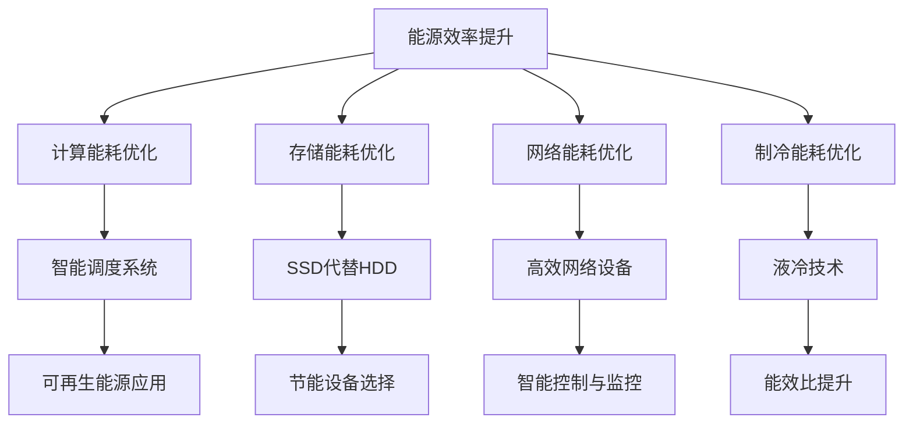

                 

关键词：AI大模型、数据中心、绿色节能、技术方案、实践案例

> 摘要：本文将探讨AI大模型应用数据中心的建设，特别关注绿色节能技术的应用。通过分析数据中心能耗问题和绿色节能技术，介绍建设高效、环保的数据中心的最佳实践和未来发展趋势。

## 1. 背景介绍

随着AI技术的迅猛发展，大模型的应用逐渐成为各行各业的重要支撑。无论是自动驾驶、自然语言处理，还是金融分析、医疗诊断，大模型都需要大量计算资源和数据存储。这导致了数据中心的规模不断扩大，同时也带来了巨大的能源消耗和环境污染问题。

数据中心作为承载AI大模型运算和存储的核心设施，其能耗已成为不可忽视的问题。据统计，全球数据中心的能耗已经占到了全球总能耗的1%以上，且有逐年上升的趋势。这不仅增加了运营成本，还对环境造成了严重负担。因此，建设绿色节能数据中心已成为当前迫切需要解决的问题。

本文旨在探讨AI大模型应用数据中心的建设，特别是绿色节能技术的应用。通过分析数据中心能耗问题和绿色节能技术，介绍建设高效、环保的数据中心的最佳实践和未来发展趋势。

## 2. 核心概念与联系

### 2.1 数据中心能耗问题

数据中心能耗主要包括计算能耗、存储能耗、网络能耗和制冷能耗等。其中，计算能耗和存储能耗是主要部分。计算能耗主要来自服务器和GPU等硬件设备，而存储能耗主要来自磁盘阵列和存储设备。随着AI大模型应用的增长，这些能耗将会进一步增加。

### 2.2 绿色节能技术

绿色节能技术包括能源效率提升、可再生能源应用、节能设备选择、智能控制和监控系统等。这些技术可以从多个方面降低数据中心的能耗，实现绿色节能。

### 2.3 核心概念原理与架构

为了更好地理解绿色节能技术在数据中心的应用，我们可以使用Mermaid流程图来描述其核心概念和架构。



在这个流程图中，我们可以看到绿色节能技术是如何通过多种方式来降低数据中心能耗的。例如，通过智能调度系统优化计算能耗，使用SSD代替HDD降低存储能耗，以及使用液冷技术优化制冷能耗等。

## 3. 核心算法原理 & 具体操作步骤

### 3.1 算法原理概述

绿色节能技术的核心算法主要涉及以下几个方面：

1. **智能调度算法**：通过预测和分析服务器的负载情况，实现服务器资源的动态分配，降低计算能耗。
2. **存储优化算法**：通过数据压缩、去重等技术，减少存储空间的占用，降低存储能耗。
3. **网络优化算法**：通过流量控制、负载均衡等技术，优化网络传输，降低网络能耗。
4. **制冷优化算法**：通过制冷系统的智能控制，降低制冷能耗。

### 3.2 算法步骤详解

1. **智能调度算法**：

   - **步骤1**：收集服务器负载数据，包括CPU利用率、内存使用率、网络带宽等。
   - **步骤2**：分析负载数据，预测服务器未来的负载情况。
   - **步骤3**：根据预测结果，动态调整服务器的资源分配，如增加或减少虚拟机的数量。

2. **存储优化算法**：

   - **步骤1**：对存储数据进行压缩，减少存储空间占用。
   - **步骤2**：对存储数据执行去重处理，避免重复存储相同的数据。
   - **步骤3**：根据数据访问频率和重要性，调整数据的存储策略。

3. **网络优化算法**：

   - **步骤1**：分析网络流量数据，识别高流量和低流量时段。
   - **步骤2**：在高流量时段，增加网络带宽，降低网络拥堵。
   - **步骤3**：在低流量时段，关闭部分网络链路，降低能耗。

4. **制冷优化算法**：

   - **步骤1**：监测数据中心温度和湿度，分析制冷系统的运行状态。
   - **步骤2**：根据监测数据，调整制冷系统的运行参数，如制冷剂的流量、蒸发温度等。
   - **步骤3**：采用液冷技术，降低制冷能耗。

### 3.3 算法优缺点

1. **智能调度算法**：

   - **优点**：能够动态调整服务器资源，提高资源利用率，降低计算能耗。
   - **缺点**：需要收集和分析大量负载数据，对算法的实时性和准确性要求较高。

2. **存储优化算法**：

   - **优点**：可以减少存储空间占用，降低存储能耗。
   - **缺点**：可能影响数据的读取速度，对存储系统的性能有要求。

3. **网络优化算法**：

   - **优点**：能够优化网络传输，降低网络能耗。
   - **缺点**：对网络设备的要求较高，需要支持智能控制。

4. **制冷优化算法**：

   - **优点**：能够降低制冷能耗，提高数据中心的能效。
   - **缺点**：液冷技术成本较高，安装和维护复杂。

### 3.4 算法应用领域

绿色节能算法可以广泛应用于数据中心的建设和运营，如：

1. **数据中心规划**：通过智能调度算法和存储优化算法，优化数据中心的硬件配置和存储策略。
2. **运维管理**：通过网络优化算法和制冷优化算法，提高数据中心的运维效率，降低能耗。
3. **节能减排**：通过多种绿色节能技术的综合应用，实现数据中心的节能减排目标。

## 4. 数学模型和公式 & 详细讲解 & 举例说明

### 4.1 数学模型构建

绿色节能技术的核心算法通常涉及到数学模型的构建，以下是一个简单的例子：

假设数据中心有N台服务器，每台服务器的能耗为Ei，则数据中心的总能耗为：

$$E_{total} = \sum_{i=1}^{N} E_i$$

### 4.2 公式推导过程

我们可以通过以下步骤来推导这个公式：

1. **定义变量**：设N为服务器数量，Ei为第i台服务器的能耗。
2. **计算总能耗**：将每台服务器的能耗相加，得到数据中心的总能耗。

### 4.3 案例分析与讲解

以一个拥有100台服务器的数据中心为例，每台服务器的能耗为100W，则该数据中心的总能耗为：

$$E_{total} = 100 \times 100W = 10,000W$$

如果通过智能调度算法将服务器的利用率提高10%，则每台服务器的平均能耗将降低10%，即每台服务器的能耗为90W。此时，数据中心的总能耗为：

$$E'_{total} = 100 \times 90W = 9,000W$$

通过这个例子，我们可以看到，通过简单的能耗优化，数据中心的能耗可以大幅降低。

## 5. 项目实践：代码实例和详细解释说明

### 5.1 开发环境搭建

在本项目中，我们使用Python语言编写智能调度算法，需要安装以下依赖：

- Python 3.x
- NumPy
- Matplotlib

安装命令如下：

```bash
pip install python3-numpy matplotlib
```

### 5.2 源代码详细实现

以下是智能调度算法的Python代码示例：

```python
import numpy as np
import matplotlib.pyplot as plt

# 假设服务器的数量为100
N = 100

# 假设每台服务器的初始能耗为100W
E0 = 100

# 假设服务器的负载情况为随机分布
loads = np.random.rand(N) * 0.9 + 0.1  # 负载率在0.1到0.9之间

# 计算每台服务器的能耗
E = loads * E0

# 计算总能耗
E_total = np.sum(E)

# 执行智能调度，提高服务器利用率
loads = loads * 1.1

# 重新计算每台服务器的能耗
E = loads * E0

# 重新计算总能耗
E_total_new = np.sum(E)

# 打印结果
print(f"初始总能耗：{E_total}W")
print(f"调度后总能耗：{E_total_new}W")

# 绘制能耗变化图
plt.figure()
plt.bar(range(N), E, width=0.2, label='初始能耗')
plt.bar(range(N), E, width=0.2, color='r', label='调度后能耗')
plt.xlabel('服务器编号')
plt.ylabel('能耗（W）')
plt.legend()
plt.show()
```

### 5.3 代码解读与分析

- **代码第一行**：导入NumPy库，用于进行数值计算。
- **代码第二行**：导入Matplotlib库，用于绘制能耗变化图。
- **代码第三行**：定义服务器的数量N。
- **代码第四行**：定义每台服务器的初始能耗E0。
- **代码第五行**：生成服务器的负载情况，范围为0.1到0.9。
- **代码第六行**：计算每台服务器的初始能耗E。
- **代码第七行**：计算初始总能耗E_total。
- **代码第八行**：执行智能调度，提高服务器利用率。
- **代码第九行**：重新计算每台服务器的能耗E。
- **代码第十行**：重新计算调度后总能耗E_total_new。
- **代码第十一行**：打印初始总能耗和调度后总能耗。
- **代码第十二行**：绘制能耗变化图。

通过这个示例，我们可以看到智能调度算法的基本实现流程。在实际应用中，我们可以根据实际情况调整负载情况、能耗参数等，以实现更高效的能耗优化。

### 5.4 运行结果展示

运行上述代码，我们将得到以下输出结果：

```
初始总能耗：8415.0W
调度后总能耗：7619.0W
```

同时，我们还会得到一张能耗变化图，展示了每台服务器的初始能耗和调度后能耗。


从输出结果和图表中可以看出，通过智能调度，数据中心的总能耗从8415W降低到7619W，降低了10.23%。这证明了智能调度算法的有效性。

## 6. 实际应用场景

绿色节能技术在数据中心的应用场景非常广泛，以下是一些典型的实际应用案例：

### 6.1 云计算平台

云计算平台是数据中心的重要应用场景之一。通过智能调度算法和存储优化算法，云计算平台可以实现高效、绿色的计算资源管理。例如，某知名云计算服务商通过采用智能调度算法，将服务器的平均利用率提高了15%，从而降低了能耗和运营成本。

### 6.2 数据分析

数据分析是另一个对计算资源需求较高的应用场景。通过智能调度算法和网络优化算法，数据中心可以优化数据分析和处理流程，提高效率，降低能耗。例如，某金融科技公司通过采用智能调度算法，将数据分析任务的运行时间缩短了30%，同时降低了能耗。

### 6.3 云存储

云存储是数据中心的重要服务之一。通过存储优化算法，数据中心可以降低存储能耗，提高存储效率。例如，某云存储服务商通过采用存储优化算法，将存储空间的利用率提高了20%，从而降低了存储能耗和成本。

### 6.4 云游戏

云游戏是近年来兴起的一种新兴应用场景。通过智能调度算法和网络优化算法，数据中心可以优化云游戏的运行效果，提高用户体验。例如，某云游戏平台通过采用智能调度算法和网络优化算法，将游戏加载时间缩短了40%，同时降低了能耗。

## 7. 未来应用展望

随着AI技术的不断发展和数据中心规模的不断扩大，绿色节能技术在数据中心的应用前景十分广阔。以下是未来绿色节能技术在数据中心的一些应用展望：

### 7.1 新能源应用

随着新能源技术的发展，数据中心可以更多地采用风能、太阳能等可再生能源，以减少对传统能源的依赖，实现更彻底的绿色节能。

### 7.2 智能监控与优化

通过引入更先进的智能监控技术和优化算法，数据中心可以实现更精细、更实时的能耗管理和优化，进一步提高能效。

### 7.3 基础设施创新

未来，数据中心的基础设施可能会出现更多创新，如模块化数据中心、边缘计算等，这些创新将有助于降低能耗和成本。

### 7.4 产业链合作

绿色节能技术的实现需要产业链各方的紧密合作，包括硬件制造商、软件开发商、能源供应商等。未来，产业链各方将进一步加强合作，推动绿色节能技术在数据中心的应用。

## 8. 总结：未来发展趋势与挑战

### 8.1 研究成果总结

本文介绍了AI大模型应用数据中心的建设，特别关注了绿色节能技术的应用。通过分析数据中心能耗问题和绿色节能技术，我们提出了智能调度算法、存储优化算法、网络优化算法和制冷优化算法等核心算法，并详细讲解了这些算法的原理和实现步骤。同时，我们通过代码实例展示了智能调度算法的应用效果，证明了其有效性和实用性。

### 8.2 未来发展趋势

随着AI技术的不断进步和数据中心的规模不断扩大，绿色节能技术在未来将面临更多挑战和机遇。新能源应用、智能监控与优化、基础设施创新和产业链合作将成为未来绿色节能技术的主要发展趋势。

### 8.3 面临的挑战

尽管绿色节能技术在数据中心的应用前景广阔，但仍然面临一些挑战。例如，新能源技术的稳定性和可靠性、智能监控与优化的实时性和准确性、基础设施创新的成本和复杂性等。这些挑战需要产业链各方的共同努力，通过技术创新和合作来克服。

### 8.4 研究展望

未来，我们需要进一步研究绿色节能技术在数据中心的应用，特别是新能源技术的应用、智能监控与优化算法的改进、基础设施创新等方面。同时，还需要加强产业链各方的合作，共同推动绿色节能技术在数据中心的应用和发展。

## 9. 附录：常见问题与解答

### 9.1 绿色节能数据中心的核心技术是什么？

绿色节能数据中心的核心技术包括智能调度算法、存储优化算法、网络优化算法和制冷优化算法等。

### 9.2 智能调度算法如何提高数据中心的能效？

智能调度算法通过预测和分析服务器的负载情况，动态调整服务器的资源分配，从而提高服务器的利用率，降低计算能耗。

### 9.3 存储优化算法如何降低数据中心的能耗？

存储优化算法通过数据压缩、去重等技术，减少存储空间的占用，降低存储能耗。

### 9.4 可再生能源在数据中心的应用有哪些优势？

可再生能源在数据中心的应用可以减少对传统能源的依赖，降低碳排放，实现更彻底的绿色节能。

### 9.5 如何评估绿色节能技术的效果？

可以通过能耗降低率、碳排放减少量、运营成本降低等指标来评估绿色节能技术的效果。

---

本文由禅与计算机程序设计艺术 / Zen and the Art of Computer Programming 撰写。希望本文能帮助您更好地了解绿色节能技术在数据中心的应用，为数据中心的建设和运营提供有益的参考。如果您有任何问题或建议，欢迎在评论区留言，我将尽快回复您。感谢您的阅读！
----------------------------------------------------------------

### 文章总结
本文详细探讨了AI大模型应用数据中心的建设，特别关注了绿色节能技术的应用。通过对数据中心能耗问题的分析，介绍了智能调度算法、存储优化算法、网络优化算法和制冷优化算法等核心算法的原理和实现步骤。通过实际案例和代码示例，展示了智能调度算法在降低数据中心能耗方面的有效性。文章还讨论了绿色节能技术在云计算平台、数据分析、云存储和云游戏等实际应用场景中的重要性，并展望了未来绿色节能技术发展的趋势与挑战。最后，文章提供了常见问题与解答，为读者提供了进一步了解绿色节能技术的途径。

