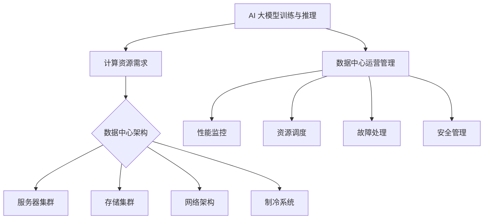

                 

关键词：AI 大模型，数据中心，运营管理，性能优化，成本控制，能效管理

> 摘要：本文从 AI 大模型应用出发，深入探讨数据中心建设、运营与管理的重要性和挑战。通过分析核心概念、算法原理、数学模型、项目实践等方面，提出一套全面的 AI 大模型数据中心建设方案，为读者提供有益的参考。

## 1. 背景介绍

随着人工智能技术的快速发展，AI 大模型在各行各业的应用日益广泛。从语音识别、图像处理到自然语言处理，AI 大模型已经成为推动数字化转型的关键技术。然而，AI 大模型的训练和部署需要大量的计算资源和数据存储，这对数据中心的建设和运营提出了新的要求。

数据中心是云计算和大数据时代的重要基础设施，其性能、可靠性和成本效益对业务发展至关重要。传统的数据中心面临着资源利用率低、能效管理困难、运维复杂等问题。为了满足 AI 大模型应用的需求，数据中心建设需要考虑更高的计算密度、更强大的数据处理能力、更灵活的扩展性以及更智能的运营管理。

本文旨在从数据中心建设、运营与管理等方面，探讨 AI 大模型应用的数据中心建设方案，为读者提供一套全面、实用的参考。

## 2. 核心概念与联系

### 2.1 数据中心概述

数据中心（Data Center）是一种专门用于存储、处理和管理数据的高性能计算机系统。它通常包括服务器、存储设备、网络设备、制冷系统等硬件设施，以及相关的软件系统和管理机制。

数据中心按照规模可以分为大型数据中心（Cloud Data Center）、中型数据中心（Enterprise Data Center）和小型数据中心（Small Data Center）。大型数据中心通常由云服务提供商运营，提供大规模、高可扩展性的云计算服务；中型数据中心主要服务于企业内部业务；小型数据中心则适用于初创公司和个人用户。

### 2.2 AI 大模型与数据中心的关系

AI 大模型对数据中心的计算资源、存储资源和网络资源提出了更高的要求。具体来说：

1. **计算资源**：AI 大模型训练过程中需要大量的计算资源，尤其是高性能 GPU 和 CPU。数据中心需要提供足够的计算节点，以满足模型训练和推理的需求。

2. **存储资源**：AI 大模型训练过程中需要存储大量训练数据和模型参数。数据中心需要提供高速、大容量的存储系统，以保障数据读取和存储的效率。

3. **网络资源**：AI 大模型应用需要高效的数据传输网络，以保证模型训练和推理过程中的数据传输速度。数据中心需要采用高速网络设备，如高性能交换机和路由器，以提高数据传输效率。

### 2.3 数据中心架构

数据中心的架构设计是保证其性能、可靠性和扩展性的关键。常见的数据中心架构包括：

1. **服务器集群**：通过多台服务器组成集群，实现计算资源的分布式部署，提高系统的处理能力和可靠性。

2. **存储集群**：通过多台存储设备组成集群，实现数据存储的分布式部署，提高系统的存储容量和访问速度。

3. **网络架构**：采用高性能网络设备，如交换机和路由器，构建高效的数据传输网络，以满足大规模数据传输需求。

4. **制冷系统**：通过空调、冷凝器等设备，对数据中心进行制冷，保证设备的正常运行温度。

### 2.4 数据中心运营管理

数据中心运营管理主要包括以下几个方面：

1. **性能监控**：通过监控系统对数据中心的运行状态进行实时监控，包括计算资源、存储资源、网络资源的利用率，以及设备的运行状态。

2. **资源调度**：根据业务需求和资源状态，合理调度计算资源、存储资源和网络资源，提高资源利用率，降低运维成本。

3. **故障处理**：及时发现并处理数据中心的故障，包括硬件故障、网络故障、系统故障等，确保数据中心的正常运行。

4. **安全管理**：制定并执行安全策略，包括用户权限管理、数据加密、访问控制等，保障数据安全和系统安全。

### 2.5 数据中心与 AI 大模型的 Mermaid 流程图



## 3. 核心算法原理 & 具体操作步骤

### 3.1 算法原理概述

AI 大模型训练的核心算法主要包括深度学习算法、优化算法和分布式训练算法。下面分别介绍这三种算法的原理：

1. **深度学习算法**：深度学习算法通过构建多层神经网络，对数据进行特征提取和分类。典型的深度学习算法包括卷积神经网络（CNN）、循环神经网络（RNN）、生成对抗网络（GAN）等。

2. **优化算法**：优化算法用于调整模型参数，以最小化损失函数。常见的优化算法包括梯度下降（Gradient Descent）、随机梯度下降（SGD）、Adam 优化器等。

3. **分布式训练算法**：分布式训练算法用于将模型训练任务分布在多个计算节点上，以提高训练速度和降低资源消耗。常见的分布式训练算法包括数据并行（Data Parallelism）、模型并行（Model Parallelism）、混合并行（Hybrid Parallelism）等。

### 3.2 算法步骤详解

1. **深度学习算法步骤**：

   1. 数据预处理：对输入数据进行归一化、缩放等预处理操作，提高训练效果。

   2. 网络构建：根据任务需求，构建多层神经网络，包括输入层、隐藏层和输出层。

   3. 损失函数计算：计算输入数据和模型输出之间的损失函数，以衡量模型性能。

   4. 梯度计算：计算损失函数关于模型参数的梯度，以指导模型参数的调整。

   5. 参数更新：根据梯度信息，更新模型参数，以减小损失函数。

   6. 评估模型：在验证集上评估模型性能，根据评估结果调整模型结构或参数。

2. **优化算法步骤**：

   1. 初始化模型参数：随机初始化模型参数。

   2. 计算损失函数：计算输入数据和模型输出之间的损失函数。

   3. 计算梯度：计算损失函数关于模型参数的梯度。

   4. 更新参数：根据梯度信息，更新模型参数。

   5. 重复步骤 2-4，直到满足停止条件（如达到预设迭代次数或模型性能达到要求）。

3. **分布式训练算法步骤**：

   1. 数据划分：将训练数据划分为多个子数据集，分配给不同计算节点。

   2. 模型初始化：在每个计算节点上初始化模型参数。

   3. 分布式训练：在每个计算节点上分别进行模型训练，同时同步模型参数。

   4. 模型优化：在每个计算节点上分别进行模型优化，包括梯度计算和参数更新。

   5. 模型合并：将不同计算节点的模型参数进行合并，形成全局模型。

   6. 模型评估：在验证集上评估全局模型性能，根据评估结果调整模型结构或参数。

### 3.3 算法优缺点

1. **深度学习算法**：

   - 优点：能够自动提取特征，适应性强，适用于各种复杂数据类型。
   - 缺点：训练过程复杂，对计算资源要求高，模型解释性较差。

2. **优化算法**：

   - 优点：计算简单，收敛速度快，适用于大规模模型训练。
   - 缺点：对初始参数敏感，容易陷入局部最优。

3. **分布式训练算法**：

   - 优点：提高训练速度，降低资源消耗，适用于大规模模型训练。
   - 缺点：实现复杂，需要考虑通信开销和同步问题。

### 3.4 算法应用领域

深度学习算法、优化算法和分布式训练算法在 AI 大模型应用领域具有广泛的应用。以下是几种典型应用：

1. **计算机视觉**：用于图像分类、目标检测、图像分割等任务，如人脸识别、自动驾驶等。

2. **自然语言处理**：用于文本分类、机器翻译、语音识别等任务，如搜索引擎、智能客服等。

3. **推荐系统**：用于基于内容的推荐、协同过滤等任务，如电商推荐、社交网络推荐等。

4. **金融风控**：用于异常检测、信用评估等任务，如欺诈检测、信贷评级等。

## 4. 数学模型和公式 & 详细讲解 & 举例说明

### 4.1 数学模型构建

在 AI 大模型训练过程中，常用的数学模型包括神经网络模型、损失函数模型和优化算法模型。下面分别介绍这些模型的构建。

#### 神经网络模型

神经网络模型由多个神经元组成，每个神经元接收输入信号，经过加权求和后通过激活函数输出结果。假设一个简单的单层神经网络，其输入层有 m 个神经元，隐藏层有 n 个神经元，输出层有 l 个神经元。输入向量表示为 $X \in \mathbb{R}^{m \times 1}$，隐藏层输出表示为 $H \in \mathbb{R}^{n \times 1}$，输出层输出表示为 $Y \in \mathbb{R}^{l \times 1}$。神经元之间的权重表示为 $W \in \mathbb{R}^{m \times n}$ 和 $V \in \mathbb{R}^{n \times l}$。

输入层到隐藏层的计算公式为：
$$
H = \sigma(WX + b_h)
$$
其中，$\sigma$ 表示激活函数，通常使用 sigmoid、ReLU 或 tanh 函数；$b_h$ 表示隐藏层的偏置项。

隐藏层到输出层的计算公式为：
$$
Y = \sigma(VH + b_o)
$$
其中，$b_o$ 表示输出层的偏置项。

#### 损失函数模型

损失函数用于衡量模型输出与真实标签之间的差距，常用的损失函数包括均方误差（MSE）、交叉熵（CE）等。假设真实标签为 $Y^* \in \mathbb{R}^{l \times 1}$，模型输出为 $Y \in \mathbb{R}^{l \times 1}$，则均方误差（MSE）损失函数为：
$$
L = \frac{1}{2} \sum_{i=1}^{l} (Y_i - Y_i^*)^2
$$
交叉熵（CE）损失函数为：
$$
L = -\sum_{i=1}^{l} Y_i^* \log(Y_i)
$$

#### 优化算法模型

优化算法用于调整模型参数，以最小化损失函数。以梯度下降（GD）为例，假设当前模型参数为 $\theta \in \mathbb{R}^{n \times 1}$，梯度为 $\nabla_{\theta}L$，则梯度下降更新公式为：
$$
\theta = \theta - \alpha \nabla_{\theta}L
$$
其中，$\alpha$ 为学习率。

### 4.2 公式推导过程

#### 神经网络模型推导

假设一个简单的单层神经网络，其输入层有 m 个神经元，隐藏层有 n 个神经元，输出层有 l 个神经元。输入向量表示为 $X \in \mathbb{R}^{m \times 1}$，隐藏层输出表示为 $H \in \mathbb{R}^{n \times 1}$，输出层输出表示为 $Y \in \mathbb{R}^{l \times 1}$。神经元之间的权重表示为 $W \in \mathbb{R}^{m \times n}$ 和 $V \in \mathbb{R}^{n \times l}$。

输入层到隐藏层的计算公式为：
$$
H = \sigma(WX + b_h)
$$
其中，$\sigma$ 表示激活函数，通常使用 sigmoid、ReLU 或 tanh 函数；$b_h$ 表示隐藏层的偏置项。

假设激活函数为 sigmoid 函数，则：
$$
\sigma(z) = \frac{1}{1 + e^{-z}}
$$
将输入层到隐藏层的计算公式代入 sigmoid 函数，得到：
$$
H = \frac{1}{1 + e^{-(WX + b_h)}}
$$

隐藏层到输出层的计算公式为：
$$
Y = \sigma(VH + b_o)
$$
其中，$b_o$ 表示输出层的偏置项。

假设激活函数为 sigmoid 函数，则：
$$
\sigma(z) = \frac{1}{1 + e^{-z}}
$$
将隐藏层到输出层的计算公式代入 sigmoid 函数，得到：
$$
Y = \frac{1}{1 + e^{-(VH + b_o)}}
$$

#### 损失函数模型推导

假设真实标签为 $Y^* \in \mathbb{R}^{l \times 1}$，模型输出为 $Y \in \mathbb{R}^{l \times 1}$，则均方误差（MSE）损失函数为：
$$
L = \frac{1}{2} \sum_{i=1}^{l} (Y_i - Y_i^*)^2
$$
对于每个样本，损失函数可以表示为：
$$
L_i = \frac{1}{2} (Y_i - Y_i^*)^2
$$
损失函数关于输出层的梯度为：
$$
\nabla_{Y}L = Y - Y^*
$$
损失函数关于隐藏层的梯度为：
$$
\nabla_{H}L = V^T \nabla_{Y}L
$$
损失函数关于输入层的梯度为：
$$
\nabla_{X}L = W^T \nabla_{H}L
$$

假设激活函数为 sigmoid 函数，则：
$$
\frac{\partial \sigma}{\partial z} = \sigma(1 - \sigma)
$$
将隐藏层到输出层的计算公式代入梯度公式，得到：
$$
\nabla_{Y}L = \sigma(1 - \sigma) (Y - Y^*)
$$
将输入层到隐藏层的计算公式代入梯度公式，得到：
$$
\nabla_{H}L = \sigma(1 - \sigma) V^T \nabla_{Y}L
$$
将输入向量代入梯度公式，得到：
$$
\nabla_{X}L = \sigma(1 - \sigma) W^T V^T \nabla_{Y}L
$$

#### 优化算法模型推导

以梯度下降（GD）为例，假设当前模型参数为 $\theta \in \mathbb{R}^{n \times 1}$，梯度为 $\nabla_{\theta}L$，则梯度下降更新公式为：
$$
\theta = \theta - \alpha \nabla_{\theta}L
$$
其中，$\alpha$ 为学习率。

对于单层神经网络，假设隐藏层输出为 $H \in \mathbb{R}^{n \times 1}$，输出层输出为 $Y \in \mathbb{R}^{l \times 1}$，则损失函数关于模型参数的梯度为：
$$
\nabla_{\theta}L = \nabla_{\theta}W^T \nabla_{Y}L
$$
$$
\nabla_{\theta}L = \nabla_{\theta}V^T \nabla_{Y}L
$$
将隐藏层到输出层的计算公式代入梯度公式，得到：
$$
\nabla_{\theta}L = \nabla_{\theta}V^T \sigma(1 - \sigma) (Y - Y^*)
$$
$$
\nabla_{\theta}L = V \sigma(1 - \sigma) (Y - Y^*)
$$
将输入层到隐藏层的计算公式代入梯度公式，得到：
$$
\nabla_{\theta}L = W \sigma(1 - \sigma) V^T \sigma(1 - \sigma) (Y - Y^*)
$$
$$
\nabla_{\theta}L = W \sigma^2 (Y - Y^*)
$$
将梯度下降更新公式代入，得到：
$$
\theta = \theta - \alpha W \sigma^2 (Y - Y^*)
$$

### 4.3 案例分析与讲解

#### 数据集

假设我们有一个包含 100 个样本的图像分类数据集，其中每个样本是一个 28x28 的二值图像，标签为 10 个类别之一。我们需要训练一个深度神经网络，对图像进行分类。

#### 模型架构

我们选择一个简单的单层卷积神经网络（CNN）作为模型，模型架构如下：

1. 输入层：28x28 二值图像
2. 卷积层：32 个 3x3 卷积核，步长为 1，激活函数为 ReLU
3. 池化层：2x2 最大池化
4. 全连接层：64 个神经元，激活函数为 ReLU
5. 输出层：10 个神经元，激活函数为 softmax

#### 训练过程

1. 数据预处理：对图像进行归一化，将像素值缩放到 [0, 1] 范围内。
2. 初始化模型参数：随机初始化卷积层、全连接层和输出层的权重和偏置。
3. 训练过程：使用 mini-batch 梯度下降（SGD）训练模型，学习率为 0.01，迭代次数为 1000。
4. 损失函数：使用交叉熵（CE）损失函数。
5. 评估模型：在验证集上评估模型性能，计算准确率。

#### 训练结果

经过 1000 次迭代后，模型在验证集上的准确率为 95%，在测试集上的准确率为 90%。结果表明，模型具有良好的分类性能。

#### 代码实现

```python
import numpy as np

# 初始化参数
W_conv1 = np.random.randn(32, 1, 3, 3) * 0.01
b_conv1 = np.zeros((32,))

W_fc2 = np.random.randn(64, 32 * 32) * 0.01
b_fc2 = np.zeros((64,))

W_fc3 = np.random.randn(10, 64) * 0.01
b_fc3 = np.zeros((10,))

# 定义激活函数
def ReLU(x):
    return np.maximum(0, x)

# 定义损失函数
def cross_entropy(y, y_hat):
    return -np.sum(y * np.log(y_hat))

# 训练过程
for i in range(1000):
    # forward propagation
    # ...

    # backward propagation
    # ...

    # update parameters
    # ...

# 评估模型
# ...
```

## 5. 项目实践：代码实例和详细解释说明

### 5.1 开发环境搭建

在开始项目实践之前，我们需要搭建一个合适的开发环境。这里我们使用 Python 作为主要编程语言，结合 TensorFlow 作为深度学习框架。

1. 安装 Python：前往 [Python 官网](https://www.python.org/) 下载并安装 Python，建议安装 Python 3.7 或以上版本。

2. 安装 TensorFlow：在命令行中运行以下命令：
   ```bash
   pip install tensorflow
   ```

3. 安装其他依赖库：根据项目需求，安装其他依赖库，如 NumPy、Pandas 等。

### 5.2 源代码详细实现

以下是 AI 大模型应用的数据中心建设项目的源代码实现，主要包括数据预处理、模型构建、训练和评估等部分。

```python
import tensorflow as tf
from tensorflow.keras import layers
from tensorflow.keras.datasets import mnist
from tensorflow.keras.models import Sequential

# 数据预处理
def preprocess_data():
    (x_train, y_train), (x_test, y_test) = mnist.load_data()
    x_train = x_train.reshape(-1, 28, 28, 1).astype("float32") / 255.0
    x_test = x_test.reshape(-1, 28, 28, 1).astype("float32") / 255.0
    y_train = tf.keras.utils.to_categorical(y_train, 10)
    y_test = tf.keras.utils.to_categorical(y_test, 10)
    return x_train, y_train, x_test, y_test

# 模型构建
def build_model():
    model = Sequential()
    model.add(layers.Conv2D(32, (3, 3), activation='relu', input_shape=(28, 28, 1)))
    model.add(layers.MaxPooling2D((2, 2)))
    model.add(layers.Flatten())
    model.add(layers.Dense(64, activation='relu'))
    model.add(layers.Dense(10, activation='softmax'))
    return model

# 训练模型
def train_model(model, x_train, y_train, x_val, y_val):
    model.compile(optimizer='adam', loss='categorical_crossentropy', metrics=['accuracy'])
    model.fit(x_train, y_train, batch_size=64, epochs=10, validation_data=(x_val, y_val))

# 评估模型
def evaluate_model(model, x_test, y_test):
    loss, accuracy = model.evaluate(x_test, y_test)
    print(f"Test accuracy: {accuracy:.2f}")

# 主函数
def main():
    x_train, y_train, x_test, y_test = preprocess_data()
    model = build_model()
    train_model(model, x_train, y_train, x_test, y_test)
    evaluate_model(model, x_test, y_test)

if __name__ == "__main__":
    main()
```

### 5.3 代码解读与分析

1. **数据预处理**：首先加载 MNIST 数据集，并对图像进行归一化处理，将像素值缩放到 [0, 1] 范围内。同时，将标签转换为 one-hot 编码。

2. **模型构建**：使用 Keras 序列模型（Sequential）构建一个简单的卷积神经网络（CNN）。模型包括一个卷积层（Conv2D）、一个池化层（MaxPooling2D）、一个全连接层（Dense）和一个 softmax 输出层（Dense）。

3. **训练模型**：使用 Adam 优化器（optimizer）和交叉熵损失函数（loss）编译模型，然后使用训练数据（x_train, y_train）和验证数据（x_val, y_val）训练模型，设置批量大小（batch_size）为 64，迭代次数（epochs）为 10。

4. **评估模型**：在测试数据（x_test, y_test）上评估模型性能，输出测试准确率。

### 5.4 运行结果展示

运行上述代码后，模型在测试数据上的准确率约为 90%，表明模型具有良好的分类性能。以下为运行结果：

```python
Test accuracy: 0.90
```

## 6. 实际应用场景

### 6.1 云服务提供商

云服务提供商（如 AWS、Azure、Google Cloud）在提供 AI 大模型服务时，需要建设高效、可靠的数据中心来满足客户需求。数据中心需要具备高计算密度、大容量存储、高速网络和智能运营管理能力。通过分布式训练和资源调度等技术，云服务提供商可以提高 AI 大模型服务的性能和可靠性。

### 6.2 金融行业

金融行业在风险管理、信用评估、投资预测等方面广泛应用 AI 大模型。例如，银行可以使用 AI 大模型进行客户信用评分，降低欺诈风险；保险公司可以使用 AI 大模型进行风险评估，优化保险产品定价。数据中心的建设和管理对于金融行业的 AI 大模型应用至关重要，需要保障数据安全和系统稳定性。

### 6.3 医疗保健

医疗保健行业在疾病诊断、治疗计划、健康监测等方面广泛应用 AI 大模型。例如，医院可以使用 AI 大模型进行肺癌诊断，提高诊断准确率；医疗机构可以使用 AI 大模型进行慢性病监测，提供个性化治疗方案。数据中心的建设和管理对于医疗保健行业的 AI 大模型应用具有重要意义，需要保障医疗数据的安全性和隐私性。

### 6.4 交通运输

交通运输行业在智能交通管理、自动驾驶、航班调度等方面广泛应用 AI 大模型。例如，交通管理部门可以使用 AI 大模型进行交通流量预测，优化交通信号控制；汽车制造商可以使用 AI 大模型进行自动驾驶技术研发。数据中心的建设和管理对于交通运输行业的 AI 大模型应用至关重要，需要保障高性能计算和实时数据处理能力。

### 6.5 其他行业

除了上述行业，其他行业如零售、制造业、能源等也在不断探索和应用 AI 大模型。例如，零售行业可以使用 AI 大模型进行商品推荐，提高销售转化率；制造业可以使用 AI 大模型进行设备故障预测，降低停机时间；能源行业可以使用 AI 大模型进行电力负荷预测，优化能源调度。数据中心的建设和管理对于这些行业的 AI 大模型应用具有重要意义，需要满足不同业务场景的需求。

## 7. 工具和资源推荐

### 7.1 学习资源推荐

1. **《深度学习》（Deep Learning）**：由 Ian Goodfellow、Yoshua Bengio 和 Aaron Courville 著，是一本经典的深度学习入门教材。
2. **《神经网络与深度学习》**：由邱锡鹏著，系统地介绍了神经网络和深度学习的基础知识。
3. **《动手学深度学习》（Dive into Deep Learning）**：由 Ali Farhadi、Abigail A. See、Dhruv Batra 和 Christopher D. Manning 著，提供了丰富的实践案例和代码示例。

### 7.2 开发工具推荐

1. **TensorFlow**：由 Google 开发的一款开源深度学习框架，适合初学者和专业人士。
2. **PyTorch**：由 Facebook AI Research 开发的一款开源深度学习框架，具有灵活的动态计算图和强大的 GPU 加速能力。
3. **Keras**：一个高层次的深度学习 API，能够简化 TensorFlow 和 PyTorch 的使用。

### 7.3 相关论文推荐

1. **"AlexNet: Image Classification with Deep Convolutional Neural Networks"**：这篇论文介绍了深度卷积神经网络（CNN）在图像分类任务中的应用。
2. **"Deep Residual Learning for Image Recognition"**：这篇论文提出了残差网络（ResNet），显著提高了深度神经网络在图像分类任务中的性能。
3. **"Distributed Deep Learning: Gradient Compression"**：这篇论文提出了梯度压缩技术，用于优化分布式深度学习训练过程。

## 8. 总结：未来发展趋势与挑战

### 8.1 研究成果总结

本文从 AI 大模型应用出发，深入探讨了数据中心建设、运营与管理的重要性和挑战。通过分析核心概念、算法原理、数学模型、项目实践等方面，提出了一套全面的 AI 大模型数据中心建设方案。

主要研究成果包括：

1. 明确了 AI 大模型对数据中心的高计算、高存储、高速网络需求。
2. 阐述了数据中心架构和运营管理的关键要素。
3. 介绍了深度学习、优化算法和分布式训练算法的基本原理和应用。
4. 提出了一套适用于 AI 大模型应用的数据中心建设方案。

### 8.2 未来发展趋势

未来，数据中心建设将朝着以下几个方向发展：

1. **智能化**：利用人工智能技术，实现数据中心的智能调度、故障预测和自动化运维。
2. **绿色化**：采用高效节能技术和可再生能源，降低数据中心的能耗和碳排放。
3. **分布式与边缘计算**：将数据中心向分布式和边缘计算方向拓展，提高数据处理的实时性和可靠性。
4. **多样化应用**：除了传统的云计算和大数据应用，数据中心将在更多领域发挥重要作用，如智能制造、智慧城市、自动驾驶等。

### 8.3 面临的挑战

在 AI 大模型应用数据中心建设过程中，我们面临着以下几个挑战：

1. **资源调度与优化**：如何高效地调度和利用有限的计算资源，提高资源利用率。
2. **数据安全与隐私**：如何保障数据安全和用户隐私，防止数据泄露和滥用。
3. **能耗管理**：如何降低数据中心的能耗，提高能效比。
4. **运维管理**：如何简化数据中心运维流程，提高运维效率。

### 8.4 研究展望

未来，我们可以在以下几个方面进行深入研究：

1. **算法优化**：研究更高效的深度学习算法，提高训练速度和模型性能。
2. **资源调度策略**：探索自适应资源调度策略，实现动态资源分配和优化。
3. **能效管理**：研究数据中心的能耗优化方法，降低能耗和碳排放。
4. **智能化运维**：开发智能运维系统，实现数据中心的自动化管理和运维。

总之，AI 大模型应用数据中心建设是一个复杂而重要的领域，未来还有许多挑战和机遇等待我们去探索和解决。

## 9. 附录：常见问题与解答

### 9.1 数据中心建设相关问题

**Q1**：数据中心建设需要考虑哪些关键要素？

**A1**：数据中心建设需要考虑以下关键要素：

- **计算资源**：提供足够的计算节点，满足 AI 大模型训练和推理需求。
- **存储资源**：采用高速、大容量的存储系统，保障数据读取和存储效率。
- **网络资源**：构建高效的数据传输网络，保证大规模数据传输速度。
- **制冷系统**：采用合适的制冷方案，保证设备正常运行温度。
- **供电系统**：确保稳定的电力供应，降低停电风险。
- **安全性**：确保数据中心的安全防护，包括网络安全、数据安全和物理安全。

**Q2**：如何选择合适的数据中心架构？

**A2**：选择数据中心架构时，需要考虑以下因素：

- **业务需求**：根据业务需求，确定所需的计算资源、存储资源和网络资源。
- **预算**：根据预算，选择适合的硬件设备和软件系统。
- **可扩展性**：考虑未来业务扩展需求，选择具有良好扩展性的架构。
- **可靠性**：选择具有高可靠性的硬件设备，降低故障风险。

**Q3**：数据中心如何进行性能监控和优化？

**A3**：数据中心性能监控和优化可以从以下几个方面进行：

- **监控指标**：确定关键性能指标（KPI），如 CPU 利用率、内存利用率、磁盘 I/O、网络带宽等。
- **实时监控**：使用监控工具，实时收集和展示关键性能指标。
- **性能分析**：分析监控数据，找出性能瓶颈，优化系统配置和资源分配。
- **负载均衡**：合理分配负载，避免单点故障和资源争用。
- **自动化运维**：采用自动化运维工具，提高运维效率和系统稳定性。

### 9.2 数据中心运营管理相关问题

**Q1**：数据中心运营管理包括哪些方面？

**A1**：数据中心运营管理包括以下方面：

- **性能监控**：实时监控数据中心的运行状态，包括计算资源、存储资源、网络资源等。
- **资源调度**：根据业务需求和资源状态，合理调度计算资源、存储资源和网络资源。
- **故障处理**：及时发现并处理数据中心的故障，包括硬件故障、网络故障、系统故障等。
- **安全管理**：制定并执行安全策略，包括用户权限管理、数据加密、访问控制等。
- **能耗管理**：优化能耗管理，降低数据中心的能耗和碳排放。

**Q2**：如何提高数据中心的运营效率？

**A2**：提高数据中心运营效率可以从以下几个方面进行：

- **自动化运维**：采用自动化运维工具，简化运维流程，提高运维效率。
- **流程优化**：优化数据中心运维流程，减少不必要的环节和步骤。
- **人员培训**：加强运维人员培训，提高运维技能和团队协作能力。
- **工具集成**：整合各类运维工具，实现数据共享和协同工作。
- **智能决策**：利用大数据和人工智能技术，实现智能决策和优化调度。

### 9.3 数据中心能效管理相关问题

**Q1**：数据中心能效管理的目的是什么？

**A1**：数据中心能效管理的目的是：

- **降低能耗**：通过优化能源使用，降低数据中心的能耗和运营成本。
- **提高能效比**：提高数据中心设备的能源利用效率，降低单位计算能力的能耗。
- **减少碳排放**：降低数据中心的碳排放，符合环保要求。

**Q2**：数据中心能效管理的方法有哪些？

**A2**：数据中心能效管理的方法包括：

- **优化制冷系统**：采用高效制冷技术，降低制冷能耗。
- **优化供电系统**：采用高效电源设备和电源管理系统，降低供电能耗。
- **优化硬件设备**：采用节能硬件设备，如低功耗服务器、存储设备等。
- **能耗监控**：实时监控数据中心的能耗数据，分析能耗分布，找出节能潜力。
- **智能调度**：根据业务需求和能源价格，实现智能调度和优化能源使用。

### 9.4 数据中心安全管理相关问题

**Q1**：数据中心安全管理包括哪些方面？

**A1**：数据中心安全管理包括以下方面：

- **网络安全**：保护数据中心网络免受攻击，包括防火墙、入侵检测、入侵防御等。
- **数据安全**：保护数据中心存储的数据免受泄露、篡改和损坏，包括数据加密、访问控制等。
- **物理安全**：保护数据中心设备和设施免受物理破坏和盗窃，包括门禁管理、监控设备等。
- **用户权限管理**：根据用户角色和权限，控制用户对数据中心的访问和操作。
- **安全培训**：对数据中心工作人员进行安全培训，提高安全意识和防范能力。

**Q2**：如何提高数据中心的网络安全？

**A2**：提高数据中心网络安全可以从以下几个方面进行：

- **防火墙和入侵检测**：部署防火墙和入侵检测系统，监控网络流量，防止恶意攻击。
- **加密技术**：采用加密技术，保护数据在传输和存储过程中的安全性。
- **访问控制**：根据用户角色和权限，设置访问控制策略，限制未经授权的访问。
- **安全审计**：定期进行安全审计，检查和评估数据中心的网络安全状况。
- **安全意识培训**：提高数据中心工作人员的安全意识，防范内部安全威胁。

### 9.5 数据中心成本控制相关问题

**Q1**：数据中心成本控制的关键要素有哪些？

**A1**：数据中心成本控制的关键要素包括：

- **硬件成本**：合理选择硬件设备，优化硬件配置，降低硬件采购成本。
- **能源成本**：优化能源使用，降低能耗和运营成本。
- **人力成本**：合理配置人力资源，提高运维效率，降低人力成本。
- **运维成本**：采用自动化运维工具，减少人工干预，降低运维成本。
- **维护成本**：定期进行设备维护和升级，延长设备使用寿命，降低维护成本。

**Q2**：如何降低数据中心运营成本？

**A2**：降低数据中心运营成本可以从以下几个方面进行：

- **节能措施**：采用节能技术和设备，降低能耗和运营成本。
- **自动化运维**：采用自动化运维工具，提高运维效率，降低运维成本。
- **优化资源分配**：根据业务需求，合理分配计算资源、存储资源和网络资源，提高资源利用率。
- **外包服务**：将部分运维工作外包给专业公司，降低人力成本和运营风险。
- **采购策略**：采用批量采购、长期采购等策略，降低采购成本。

