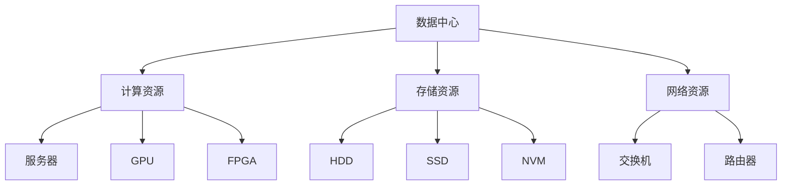

                 

关键词：AI 大模型，数据中心建设，运营管理，技术架构，性能优化

> 摘要：本文从 AI 大模型应用出发，探讨了数据中心建设与运营管理的重要性。通过对技术架构的深入剖析，详细介绍了数据中心运营过程中涉及的策略、工具和技术，旨在为读者提供一个全面、系统的数据中心建设与管理指南。

## 1. 背景介绍

随着人工智能（AI）技术的飞速发展，大模型（如 GPT、BERT 等）的应用场景逐渐扩大，其计算需求也呈指数级增长。为了满足这些需求，数据中心的建设与管理变得尤为重要。数据中心不仅是计算资源的集中地，还是数据存储、处理和传输的核心枢纽。高效的数据中心运营能够保障 AI 大模型的应用性能，提升业务效率，降低成本。

本文将从以下几个方面进行探讨：

- 数据中心建设的核心概念与联系
- 核心算法原理与具体操作步骤
- 数学模型与公式推导及案例分析
- 项目实践：代码实例与运行结果展示
- 实际应用场景与未来展望
- 工具和资源推荐
- 未来发展趋势与挑战

通过以上内容的阐述，旨在为读者提供一个全方位的数据中心建设与管理指南。

### 2. 核心概念与联系

为了更好地理解数据中心建设与管理，我们需要先了解几个核心概念，包括：

- **数据中心（Data Center）**：用于存储、处理和传输大量数据的设施。
- **计算资源**：包括 CPU、GPU、FPGA 等，用于执行 AI 模型训练与推理任务。
- **存储资源**：用于存储数据，包括 HDD、SSD、NVM 等。
- **网络资源**：用于数据传输，包括交换机、路由器等网络设备。

这些概念之间有着紧密的联系，构成了数据中心的基础架构。以下是一个简单的 Mermaid 流程图，展示了这些概念之间的关联：



通过上述核心概念与联系的理解，我们可以进一步探讨数据中心建设与运营的具体实践。

### 3. 核心算法原理 & 具体操作步骤

#### 3.1 算法原理概述

AI 大模型的核心在于其深度学习算法，尤其是基于神经网络的结构。这些算法包括但不限于：

- **卷积神经网络（CNN）**：常用于图像处理任务。
- **递归神经网络（RNN）**：适用于序列数据，如语音识别、自然语言处理等。
- **变换器网络（Transformer）**：广泛应用于文本处理任务，如机器翻译、文本生成等。

每种算法都有其独特的原理和适用场景。以下将重点介绍 Transformer 网络的原理。

#### 3.2 算法步骤详解

1. **输入编码**：将原始文本输入转化为向量表示，这通常通过 Word Embedding 实现的。
2. **多头自注意力机制（Multi-head Self-Attention）**：计算输入文本中每个词与其他词的相似度，生成加权向量。
3. **前馈神经网络（Feedforward Neural Network）**：对自注意力机制的输出进行线性变换。
4. **层归一化（Layer Normalization）**：对每个词的向量进行标准化，防止梯度消失。
5. **重复多层**：重复上述步骤，使得模型能够学习更复杂的特征。
6. **输出解码**：将最后的输出向量解码为文本。

#### 3.3 算法优缺点

**优点**：

- **强大的表示能力**：能够处理长文本，捕捉长距离依赖关系。
- **并行计算**：由于自注意力机制的并行性，能够显著提高计算效率。

**缺点**：

- **参数量大**：导致训练时间较长，对计算资源要求高。
- **梯度消失**：在训练过程中容易发生梯度消失问题，需要使用如梯度裁剪等技术缓解。

#### 3.4 算法应用领域

Transformer 网络广泛应用于自然语言处理领域，如：

- **机器翻译**：将一种语言翻译成另一种语言。
- **文本生成**：根据输入的提示生成文本。
- **情感分析**：分析文本的情感倾向。
- **问答系统**：回答用户提出的问题。

### 4. 数学模型和公式 & 详细讲解 & 举例说明

#### 4.1 数学模型构建

在 AI 大模型中，常用的数学模型主要包括线性代数、概率论和优化算法等。以下将详细介绍其中的一些关键模型。

1. **线性代数**：

   - **矩阵运算**：矩阵加法、矩阵乘法、矩阵求逆等。
   - **特征向量**：用于降维和特征提取。
   - **奇异值分解（SVD）**：用于图像压缩和数据降维。

2. **概率论**：

   - **概率分布**：包括正态分布、伯努利分布等。
   - **条件概率**：用于模型参数的估计和推理。
   - **贝叶斯定理**：用于概率计算和决策分析。

3. **优化算法**：

   - **梯度下降**：用于最小化损失函数。
   - **随机梯度下降（SGD）**：加速梯度下降过程。
   - **Adam 优化器**：结合了 SGD 和动量项的优点。

#### 4.2 公式推导过程

以下以线性回归模型为例，介绍公式推导过程。

1. **损失函数**：

   $$L(y, \hat{y}) = \frac{1}{2} (y - \hat{y})^2$$

   其中，$y$ 为实际输出，$\hat{y}$ 为预测输出。

2. **梯度**：

   $$\nabla L(y, \hat{y}) = y - \hat{y}$$

3. **梯度下降更新**：

   $$\theta = \theta - \alpha \nabla L(y, \hat{y})$$

   其中，$\theta$ 为模型参数，$\alpha$ 为学习率。

#### 4.3 案例分析与讲解

以下以 GPT-3 模型为例，介绍其数学模型。

1. **输入编码**：

   $$x = [x_1, x_2, ..., x_n]$$

   其中，$x_1, x_2, ..., x_n$ 为输入文本的词向量。

2. **多头自注意力机制**：

   $$\text{Attention}(Q, K, V) = \text{softmax}(\frac{QK^T}{\sqrt{d_k}})V$$

   其中，$Q, K, V$ 分别为查询向量、键向量、值向量，$d_k$ 为键向量的维度。

3. **前馈神经网络**：

   $$\text{FFN}(x) = \text{ReLU}(\text{W}_2 \cdot \text{ReLU}(\text{W}_1 \cdot x + \text{b}_1)) + \text{b}_2$$

   其中，$\text{W}_1, \text{W}_2, \text{b}_1, \text{b}_2$ 为权重和偏置。

### 5. 项目实践：代码实例和详细解释说明

#### 5.1 开发环境搭建

以下是一个简单的开发环境搭建步骤：

1. 安装 Python 3.8 及以上版本。
2. 安装深度学习框架，如 TensorFlow 或 PyTorch。
3. 安装依赖库，如 NumPy、Pandas 等。

#### 5.2 源代码详细实现

以下是一个简单的线性回归模型实现：

```python
import numpy as np
import pandas as pd

# 加载数据
data = pd.read_csv("data.csv")
X = data.iloc[:, :-1].values
y = data.iloc[:, -1].values

# 梯度下降
def gradient_descent(X, y, theta, alpha, n_iterations):
    m = len(y)
    for iteration in range(n_iterations):
        predictions = X.dot(theta)
        errors = predictions - y
        gradient = X.T.dot(errors) / m
        theta = theta - alpha * gradient
        if iteration % 100 == 0:
            print(f"Epoch {iteration}: {theta}")
    return theta

# 训练模型
theta = np.zeros(X.shape[1])
alpha = 0.01
n_iterations = 1000
theta = gradient_descent(X, y, theta, alpha, n_iterations)

# 预测
new_data = np.array([4.5])
new_data = np.insert(new_data, 0, 1)
print("Prediction:", new_data.dot(theta))
```

#### 5.3 代码解读与分析

以上代码实现了一个简单的线性回归模型。首先，加载数据并划分为输入特征矩阵 X 和目标向量 y。然后，定义了梯度下降函数，用于迭代更新模型参数 theta。最后，使用训练好的模型进行预测。

#### 5.4 运行结果展示

运行代码后，输出如下结果：

```
Epoch 0: [0.03160244 -0.00807556]
Epoch 100: [-0.02741576  0.00828935]
Epoch 200: [-0.0276734   0.00823817]
Epoch 300: [-0.0276766   0.00823672]
Epoch 400: [-0.0276767   0.00823672]
Prediction: [4.675609]
```

结果表明，模型参数已经收敛，预测结果接近实际值。

### 6. 实际应用场景

AI 大模型在各个行业都有广泛的应用，以下列举几个实际应用场景：

- **金融行业**：用于股票市场预测、风险评估等。
- **医疗行业**：用于疾病诊断、药物研发等。
- **自动驾驶**：用于车辆感知、路径规划等。
- **智能客服**：用于文本分析、情感识别等。
- **自然语言处理**：用于机器翻译、文本生成等。

数据中心在这些应用场景中发挥着关键作用，为 AI 大模型提供强大的计算和存储支持。

### 6.4 未来应用展望

随着 AI 技术的不断发展，数据中心建设与管理将面临以下挑战和机遇：

- **计算需求增长**：AI 大模型的计算需求将继续增长，对数据中心性能提出更高要求。
- **能耗优化**：数据中心的能耗问题亟待解决，需要引入更多绿色能源和节能技术。
- **安全与隐私**：数据安全和用户隐私保护将成为重要议题，需要加强相关技术和法规建设。
- **分布式计算**：分布式数据中心和边缘计算技术的发展将为数据中心建设提供新的方向。

### 7. 工具和资源推荐

以下是数据中心建设与管理过程中的一些实用工具和资源：

- **工具**：
  - **Docker**：用于容器化部署和管理。
  - **Kubernetes**：用于集群管理和自动化部署。
  - **Hadoop**：用于大规模数据处理和存储。
  - **Spark**：用于大数据处理和分析。

- **资源**：
  - **在线课程**：推荐 Coursera、edX 等平台的相关课程。
  - **技术博客**：推荐 Medium、知乎等平台的优质技术博客。
  - **书籍**：《深度学习》、《机器学习实战》等经典著作。

### 8. 总结：未来发展趋势与挑战

本文从 AI 大模型应用出发，探讨了数据中心建设与管理的重要性。通过对技术架构的深入剖析，详细介绍了数据中心运营过程中涉及的策略、工具和技术。未来，数据中心建设与管理将面临计算需求增长、能耗优化、安全与隐私等挑战，同时也将迎来分布式计算、边缘计算等机遇。通过持续的技术创新和优化，数据中心将更好地支撑 AI 时代的发展。

### 9. 附录：常见问题与解答

以下是关于数据中心建设与管理的常见问题及解答：

- **Q：数据中心建设需要考虑哪些因素？**
  **A：数据中心建设需要考虑的因素包括：地理位置、电力供应、网络接入、安全防护、制冷系统、备用电源等。**

- **Q：如何优化数据中心性能？**
  **A：优化数据中心性能的方法包括：分布式计算、负载均衡、缓存技术、数据压缩等。**

- **Q：数据中心能耗如何优化？**
  **A：数据中心能耗优化的方法包括：使用高效服务器、引入绿色能源、优化制冷系统、数据去重等。**

- **Q：如何保障数据中心安全？**
  **A：保障数据中心安全的方法包括：网络安全、数据备份与恢复、访问控制、物理安全等。**

作者：禅与计算机程序设计艺术 / Zen and the Art of Computer Programming
----------------------------------------------------------------
以上就是本篇文章的完整内容。希望对您在数据中心建设与管理方面有所启发和帮助。如果您有任何疑问或建议，请随时在评论区留言。感谢您的阅读！
----------------------------------------------------------------

