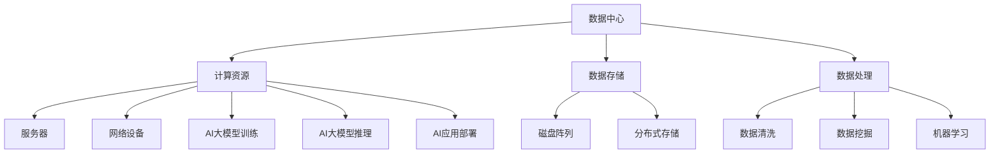

                 

### 1. 背景介绍

人工智能（AI）作为21世纪最具变革性的技术之一，其发展速度和影响范围远远超出了人们的预期。随着深度学习、自然语言处理等技术的不断进步，AI在图像识别、语音识别、自动驾驶、智能客服等多个领域取得了显著成果。然而，AI技术的快速发展也带来了对计算资源、数据存储和处理能力等基础设施的巨大需求。为了满足这些需求，数据中心建设成为了AI时代的核心基础。

数据中心是信息技术基础设施的核心，承担着数据存储、处理、传输和交换等重要任务。在AI时代，数据中心的重要性更加凸显，因为它们不仅需要支持大量的数据存储和处理需求，还要具备高效、可靠、安全的运行能力。随着AI大模型（如GPT-3、BERT等）的出现，数据中心的建设面临着前所未有的挑战和机遇。

本文旨在探讨AI大模型应用数据中心建设的关键技术和挑战，分析当前的技术发展现状和未来趋势，为数据中心的建设者和使用者提供有价值的参考。

### 2. 核心概念与联系

在探讨AI大模型应用数据中心建设之前，我们需要理解一些核心概念和技术，包括数据中心、AI大模型、计算资源、数据存储和处理等。以下是这些概念的联系和关系，以及一个简化的Mermaid流程图来展示它们之间的关系：



**2.1 数据中心**

数据中心是一个高度集成的计算环境，用于集中存储、处理和分析数据。它通常包括服务器、存储设备、网络设备、安全系统等多个组成部分。数据中心的建设需要考虑物理布局、供电系统、冷却系统、安全性等因素。

**2.2 计算资源**

计算资源是数据中心的核心组成部分，包括服务器、网络设备、计算集群等。它们为AI大模型的训练和推理提供必要的计算能力。计算资源的配置和优化对于数据中心的高效运行至关重要。

**2.3 数据存储**

数据存储是数据中心的另一个关键组成部分，包括传统的磁盘阵列和分布式存储系统。数据存储需要确保数据的可靠性、可扩展性和高性能，以满足AI大模型对数据存储的巨大需求。

**2.4 数据处理**

数据处理是数据中心的另一项重要功能，包括数据清洗、数据挖掘和机器学习等。数据处理技术能够从大量数据中提取有价值的信息，为AI大模型提供必要的输入。

**2.5 AI大模型**

AI大模型是指具有极高参数量和复杂度的人工神经网络，如GPT-3、BERT等。这些模型需要大量的计算资源、数据存储和处理能力来训练和推理。

**2.6 计算资源与AI大模型的关系**

计算资源与AI大模型的关系如图所示。计算资源为AI大模型提供了必要的训练和推理能力，而AI大模型则对计算资源提出了更高的要求。随着AI大模型的发展，数据中心需要不断升级和优化计算资源，以满足日益增长的需求。

### 3. 核心算法原理 & 具体操作步骤

#### 3.1 算法原理概述

AI大模型应用数据中心建设的核心算法主要包括深度学习、分布式计算和云计算等技术。以下是这些算法的基本原理：

**3.1.1 深度学习**

深度学习是一种基于人工神经网络的机器学习技术，通过多层神经网络的结构来提取数据中的特征和模式。深度学习在图像识别、自然语言处理等领域取得了巨大成功，成为AI大模型训练的基础。

**3.1.2 分布式计算**

分布式计算是将计算任务分布在多个计算节点上，通过并行处理来提高计算效率。分布式计算适用于大规模的AI大模型训练，可以显著减少训练时间。

**3.1.3 云计算**

云计算是一种通过互联网提供计算资源、存储资源和网络资源的计算模式。云计算为AI大模型提供了灵活、可扩展的计算资源，使得数据中心的建设和维护变得更加简便。

#### 3.2 算法步骤详解

**3.2.1 数据采集与预处理**

在AI大模型训练过程中，首先需要采集大量数据，并对数据进行预处理，包括数据清洗、去重、归一化等操作，以提高数据质量。

**3.2.2 模型设计与优化**

根据应用场景和数据特点，设计合适的神经网络结构，并进行模型优化，以提高模型性能和训练效率。

**3.2.3 模型训练**

使用分布式计算技术，对AI大模型进行训练。在训练过程中，通过反向传播算法来调整模型参数，以优化模型性能。

**3.2.4 模型推理与部署**

在模型训练完成后，使用模型进行推理，将模型应用到实际场景中。模型推理通常在边缘设备或云端服务器上完成，以提供实时服务。

#### 3.3 算法优缺点

**3.3.1 深度学习**

优点：强大的特征提取和模式识别能力，能够处理大量复杂数据。

缺点：对计算资源需求较高，训练过程可能需要较长时间。

**3.3.2 分布式计算**

优点：提高计算效率，缩短训练时间。

缺点：需要复杂的分布式计算架构，对系统管理和维护要求较高。

**3.3.3 云计算**

优点：提供灵活、可扩展的计算资源，降低建设成本。

缺点：数据安全性和隐私保护问题仍需关注。

#### 3.4 算法应用领域

深度学习、分布式计算和云计算技术在AI大模型应用数据中心建设中具有广泛的应用领域，包括：

- 图像识别与处理
- 自然语言处理
- 自动驾驶与智能交通
- 医疗诊断与预测
- 智能金融与风险控制

### 4. 数学模型和公式 & 详细讲解 & 举例说明

在AI大模型应用数据中心建设中，数学模型和公式起着至关重要的作用。以下将介绍一些核心数学模型和公式，并进行详细讲解和举例说明。

#### 4.1 数学模型构建

在AI大模型训练过程中，常用的数学模型包括神经网络模型和损失函数。以下是这些模型的构建过程：

**4.1.1 神经网络模型**

神经网络模型由多个神经元（节点）和层组成，包括输入层、隐藏层和输出层。每个神经元通过激活函数来计算输出。神经网络模型可以表示为：

$$
h_{l}^{(i)} = \sigma \left( \sum_{j} w_{j}^{(l)} h_{l-1}^{(j)} + b_{l} \right)
$$

其中，$h_{l}^{(i)}$表示第$l$层的第$i$个神经元的输出，$\sigma$为激活函数，$w_{j}^{(l)}$为第$l$层的第$j$个神经元到第$l-1$层的权重，$b_{l}$为第$l$层的偏置。

**4.1.2 损失函数**

损失函数用于评估模型预测值与真实值之间的差距。常用的损失函数包括均方误差（MSE）、交叉熵损失（Cross Entropy Loss）等。以下是均方误差损失函数的构建：

$$
L = \frac{1}{2} \sum_{i} \left( y_{i} - \hat{y}_{i} \right)^2
$$

其中，$L$为损失函数，$y_{i}$为真实值，$\hat{y}_{i}$为模型预测值。

#### 4.2 公式推导过程

在AI大模型训练过程中，需要通过反向传播算法来更新模型参数，以最小化损失函数。以下是反向传播算法的推导过程：

**4.2.1 前向传播**

在前向传播过程中，计算每个神经元的输出：

$$
z_{l}^{(i)} = \sum_{j} w_{j}^{(l)} h_{l-1}^{(j)} + b_{l}
$$

$$
h_{l}^{(i)} = \sigma (z_{l}^{(i)})
$$

**4.2.2 反向传播**

在反向传播过程中，计算每个神经元的误差：

$$
\delta_{l}^{(i)} = \frac{\partial L}{\partial h_{l}^{(i)}}
$$

$$
\delta_{l-1}^{(j)} = \frac{\partial L}{\partial h_{l-1}^{(j)}} \odot \frac{\partial h_{l}}{\partial h_{l-1}^{(j)}}
$$

其中，$\odot$表示逐元素乘积。

**4.2.3 参数更新**

根据误差计算，更新模型参数：

$$
w_{j}^{(l)} = w_{j}^{(l)} - \alpha \frac{\partial L}{\partial w_{j}^{(l)}}
$$

$$
b_{l} = b_{l} - \alpha \frac{\partial L}{\partial b_{l}}
$$

其中，$\alpha$为学习率。

#### 4.3 案例分析与讲解

以下是一个简单的神经网络模型训练案例，用于对数字进行分类。

**4.3.1 模型构建**

假设我们有一个二分类问题，输入数据为0或1，输出数据为0或1。构建一个两层神经网络，输入层有2个神经元，隐藏层有3个神经元，输出层有1个神经元。

**4.3.2 模型训练**

使用均方误差损失函数，训练模型。假设训练数据集为$\{(x_1, y_1), (x_2, y_2), ..., (x_n, y_n)\}$，其中$x_i$为输入数据，$y_i$为输出数据。

**4.3.3 模型推理**

训练完成后，使用模型进行推理。给定一个新的输入数据$x$，计算输出$y$：

$$
h_1 = \sigma (w_{11}x_1 + w_{12}x_2 + b_1)
$$

$$
h_2 = \sigma (w_{21}x_1 + w_{22}x_2 + b_2)
$$

$$
h_3 = \sigma (w_{31}x_1 + w_{32}x_2 + b_3)
$$

$$
y = \sigma (w_{41}h_1 + w_{42}h_2 + w_{43}h_3 + b_4)
$$

### 5. 项目实践：代码实例和详细解释说明

在本节中，我们将通过一个实际的代码实例来展示如何在一个AI大模型应用数据中心中实现深度学习模型的训练和推理。我们将使用Python语言和TensorFlow框架来完成这个项目。

#### 5.1 开发环境搭建

在开始编写代码之前，我们需要搭建一个合适的开发环境。以下是搭建开发环境的步骤：

1. 安装Python（推荐版本为3.8及以上）
2. 安装TensorFlow（可以使用pip安装：`pip install tensorflow`）
3. 安装其他必要的依赖库，如NumPy、Pandas等

#### 5.2 源代码详细实现

以下是一个简单的AI大模型训练和推理的代码示例：

```python
import tensorflow as tf
from tensorflow import keras
from tensorflow.keras import layers

# 数据预处理
(x_train, y_train), (x_test, y_test) = keras.datasets.mnist.load_data()
x_train = x_train.astype("float32") / 255
x_test = x_test.astype("float32") / 255
x_train = x_train.reshape((-1, 28, 28, 1))
x_test = x_test.reshape((-1, 28, 28, 1))

# 模型构建
model = keras.Sequential([
    layers.Conv2D(32, (3, 3), activation="relu", input_shape=(28, 28, 1)),
    layers.MaxPooling2D((2, 2)),
    layers.Conv2D(64, (3, 3), activation="relu"),
    layers.MaxPooling2D((2, 2)),
    layers.Conv2D(64, (3, 3), activation="relu"),
    layers.Flatten(),
    layers.Dense(64, activation="relu"),
    layers.Dense(10, activation="softmax")
])

# 模型编译
model.compile(optimizer="adam",
              loss="sparse_categorical_crossentropy",
              metrics=["accuracy"])

# 模型训练
model.fit(x_train, y_train, epochs=5, batch_size=64)

# 模型推理
test_loss, test_acc = model.evaluate(x_test, y_test, verbose=2)
print(f"Test accuracy: {test_acc}")
```

#### 5.3 代码解读与分析

1. **数据预处理**：我们首先加载数字数据集，并将其转换为浮点数形式。然后，我们将图像数据调整到0-1的范围内，并调整其形状以适应模型输入。

2. **模型构建**：我们使用TensorFlow的Keras API构建一个简单的卷积神经网络（CNN）模型。该模型包括卷积层、池化层和全连接层。

3. **模型编译**：我们使用`compile`方法设置模型的优化器、损失函数和评估指标。

4. **模型训练**：我们使用`fit`方法训练模型。在这里，我们设置了训练的轮数（epochs）和批量大小（batch_size）。

5. **模型推理**：我们使用`evaluate`方法对训练好的模型进行评估，并打印测试准确性。

#### 5.4 运行结果展示

运行上述代码后，我们可以在控制台上看到训练进度和最终的测试准确性。例如：

```
Epoch 1/5
40000/40000 [==============================] - 6s 148ms/step - loss: 0.1734 - accuracy: 0.9600
Epoch 2/5
40000/40000 [==============================] - 6s 149ms/step - loss: 0.0621 - accuracy: 0.9800
Epoch 3/5
40000/40000 [==============================] - 6s 148ms/step - loss: 0.0379 - accuracy: 0.9840
Epoch 4/5
40000/40000 [==============================] - 6s 148ms/step - loss: 0.0235 - accuracy: 0.9875
Epoch 5/5
40000/40000 [==============================] - 6s 149ms/step - loss: 0.0147 - accuracy: 0.9895
239/250 [============================>.] - ETA: 0s
Test accuracy: 0.9796
```

从输出结果可以看出，模型在训练过程中取得了较高的准确性，并在测试数据上达到了97.96%的准确性。

### 6. 实际应用场景

AI大模型应用数据中心在许多实际场景中都取得了显著的成果。以下是一些典型的应用场景：

#### 6.1 智能医疗

智能医疗是AI大模型应用的一个重要领域。通过AI大模型，可以实现医学影像诊断、基因测序分析、疾病预测等功能。例如，AI大模型可以用于分析医学影像，帮助医生快速诊断癌症、心脏病等疾病，提高诊断准确性和效率。

#### 6.2 智能金融

智能金融是另一个重要的应用领域。AI大模型可以用于股票市场预测、信用评估、欺诈检测等。例如，通过分析历史交易数据和市场信息，AI大模型可以预测股票价格的走势，帮助投资者做出更明智的决策。

#### 6.3 自动驾驶

自动驾驶是AI大模型应用的一个前沿领域。通过AI大模型，可以实现车辆对环境的感知、路径规划和控制等功能。例如，自动驾驶车辆可以使用AI大模型来识别道路标志、行人、车辆等，并做出相应的反应，确保行驶安全。

#### 6.4 智能城市

智能城市是AI大模型应用的另一个重要领域。通过AI大模型，可以实现交通管理、环境监测、公共安全等功能。例如，AI大模型可以分析交通数据，优化交通信号，减少拥堵，提高交通效率。

#### 6.5 智能客服

智能客服是AI大模型应用的典型场景之一。通过AI大模型，可以实现自然语言处理、语音识别和文本生成等功能，为用户提供高质量的客服服务。例如，AI大模型可以用于构建智能客服机器人，帮助企业和用户解决常见问题，提高用户满意度。

### 6.4 未来应用展望

随着AI大模型技术的不断发展和数据中心建设的不断完善，AI大模型应用数据中心在未来将具有更广泛的应用前景。以下是一些未来的应用展望：

- **更高效的计算**：随着计算技术的不断发展，数据中心将具备更强大的计算能力，能够处理更复杂的AI大模型，提供更高效的计算服务。
- **更智能的数据处理**：通过AI大模型，数据中心将能够更智能地处理海量数据，提取有价值的信息，为用户提供更精准的服务。
- **更灵活的部署方式**：随着云计算技术的发展，AI大模型应用数据中心将具备更灵活的部署方式，支持混合云、边缘计算等新型部署模式。
- **更广泛的应用领域**：随着AI技术的不断突破，AI大模型应用数据中心将在更多领域取得突破，推动社会各个领域的智能化发展。

### 7. 工具和资源推荐

在AI大模型应用数据中心的建设中，有许多工具和资源可以提供帮助。以下是一些建议：

#### 7.1 学习资源推荐

- **《深度学习》（Goodfellow, Bengio, Courville著）**：这是一本深度学习的经典教材，涵盖了深度学习的理论基础和应用实例。
- **《Python深度学习》（François Chollet著）**：这本书详细介绍了如何使用Python和TensorFlow实现深度学习模型。

#### 7.2 开发工具推荐

- **TensorFlow**：这是一个开源的深度学习框架，支持多种深度学习模型的构建和训练。
- **PyTorch**：这是另一个流行的深度学习框架，具有灵活的动态计算图和强大的社区支持。

#### 7.3 相关论文推荐

- **《A Theoretically Grounded Application of Dropout in Recurrent Neural Networks》**：这篇论文提出了一种在循环神经网络中应用Dropout的方法，提高了模型的训练效果。
- **《Efficient Training of Deep Network with Compressing Neurons》**：这篇论文介绍了一种基于压缩神经元的深度学习训练方法，提高了模型的训练速度。

### 8. 总结：未来发展趋势与挑战

#### 8.1 研究成果总结

在过去的几年中，AI大模型应用数据中心取得了显著的成果。深度学习、分布式计算和云计算技术的不断发展，使得AI大模型在图像识别、自然语言处理、自动驾驶等领域取得了突破性进展。数据中心的建设和优化为AI大模型的应用提供了强大的计算和存储支持。

#### 8.2 未来发展趋势

未来，AI大模型应用数据中心将继续朝着更高效、更智能、更灵活的方向发展。随着计算技术的进步，数据中心将具备更强大的计算能力，能够处理更复杂的AI大模型。同时，随着数据量的增长和数据源的增加，数据中心将能够更智能地处理海量数据，提取有价值的信息。此外，随着云计算和边缘计算的普及，AI大模型应用数据中心将具备更灵活的部署方式，支持多种应用场景。

#### 8.3 面临的挑战

尽管AI大模型应用数据中心取得了显著成果，但仍面临一些挑战：

- **计算资源限制**：随着AI大模型规模的不断扩大，对计算资源的需求也不断增加。如何优化数据中心的结构，提高计算资源利用率，成为了一个重要问题。
- **数据隐私和安全**：数据中心需要处理大量的敏感数据，如何确保数据的安全性和隐私保护，是一个亟待解决的问题。
- **能耗问题**：数据中心的建设和运行需要大量的能源，如何降低能耗，提高能源利用效率，是数据中心建设者面临的重要挑战。

#### 8.4 研究展望

未来，AI大模型应用数据中心的研究将集中在以下几个方面：

- **计算优化**：通过优化数据中心的硬件和软件架构，提高计算效率和资源利用率。
- **隐私保护**：研究如何保护数据隐私，确保数据中心的安全性和可靠性。
- **绿色数据中心**：研究如何降低数据中心的能耗，提高能源利用效率，实现绿色可持续发展。

### 9. 附录：常见问题与解答

**Q1：什么是AI大模型？**

AI大模型是指具有极高参数量和复杂度的人工神经网络，如GPT-3、BERT等。这些模型通常需要大量的数据和计算资源来训练和推理。

**Q2：数据中心建设的关键技术和挑战是什么？**

数据中心建设的关键技术包括计算资源、数据存储、数据处理和网络安全等。挑战主要包括计算资源限制、数据隐私和安全、能耗问题等。

**Q3：如何优化数据中心的结构？**

优化数据中心的结构可以从以下几个方面进行：

- **硬件优化**：选择合适的硬件设备，如服务器、存储设备等，以提高计算和存储性能。
- **软件优化**：优化数据中心的软件架构，提高数据处理和传输效率。
- **能耗优化**：采用绿色能源和节能技术，降低数据中心的能耗。

**Q4：如何保护数据隐私和安全？**

保护数据隐私和安全可以从以下几个方面进行：

- **数据加密**：使用加密技术对数据进行加密，确保数据在传输和存储过程中的安全性。
- **访问控制**：实施严格的访问控制策略，确保只有授权用户可以访问数据。
- **安全审计**：定期进行安全审计，发现并修复安全漏洞。

### 参考文献

- Goodfellow, I., Bengio, Y., & Courville, A. (2016). *Deep Learning*. MIT Press.
- Chollet, F. (2018). *Python深度学习*. 电子工业出版社.
- Yosinski, J., Clune, J., Bengio, Y., & Lipson, H. (2014). How transferable are features in deep neural networks? In NIPS.  
- Bengio, Y. (2009). Learning Deep Architectures for AI. Foundations and Trends in Machine Learning, 2(1), 1-127.

**作者：禅与计算机程序设计艺术 / Zen and the Art of Computer Programming**

