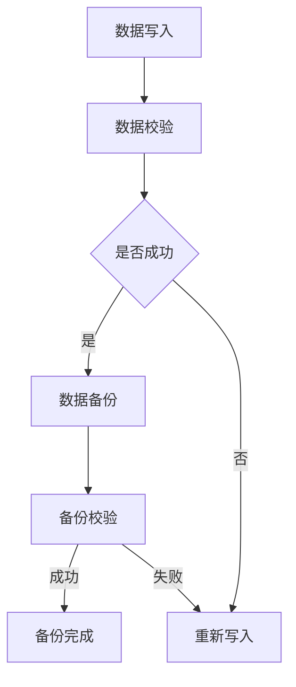

                 

关键词：人工智能，大模型，数据中心，数据备份，技术博客，深度学习

## 摘要

随着人工智能技术的快速发展，大模型的应用越来越广泛，例如在自然语言处理、计算机视觉、推荐系统等领域。然而，大模型的数据量庞大，如何保证数据的可靠性、完整性和高效性成为了一个关键问题。本文将探讨AI大模型在数据中心的数据备份策略，分析现有技术方案的优缺点，并提出一种新的备份算法及其实现方法。文章还将讨论未来数据备份领域的发展趋势和面临的挑战。

## 1. 背景介绍

### 1.1 人工智能与大数据

人工智能（AI）作为计算机科学的一个重要分支，旨在使计算机具有类似人类的感知、理解和决策能力。随着计算能力的提升和大数据技术的发展，人工智能迎来了新的发展机遇。大数据的规模和复杂性对人工智能技术提出了更高的要求，同时也推动了人工智能算法的进步。

### 1.2 大模型的定义与特点

大模型是指具有海量参数、能够处理大规模数据的复杂机器学习模型。这些模型在深度学习领域取得了显著成果，如GPT-3、BERT等。大模型的特点是：

- **参数量巨大**：大模型通常具有数百万、数亿甚至数十亿个参数。
- **计算资源消耗大**：大模型训练需要大量的计算资源和时间。
- **数据依赖性强**：大模型的表现取决于训练数据的质量和规模。

### 1.3 数据中心的作用

数据中心是存放和管理大规模数据的集中化设施。在人工智能领域，数据中心的作用尤为重要，主要体现在以下几个方面：

- **数据存储**：数据中心提供安全、高效的数据存储方案，保证数据的可靠性和访问速度。
- **数据处理**：数据中心具备强大的计算能力，支持大规模数据的处理和分析。
- **数据备份**：数据中心需要实施有效的数据备份策略，防止数据丢失或损坏。

## 2. 核心概念与联系

### 2.1 数据备份的基本概念

数据备份是指将原始数据复制到其他存储介质上，以防止数据丢失或损坏。在数据中心，数据备份是一个关键环节，关系到数据的安全性和可用性。

### 2.2 数据备份与数据中心架构的关系

数据备份与数据中心的架构紧密相关。数据中心通常采用分布式存储架构，如Hadoop、Cassandra等，这些架构能够提高数据的可靠性和可用性。数据备份策略需要与数据中心架构相结合，实现高效、可靠的数据备份。

### 2.3 Mermaid 流程图



## 3. 核心算法原理 & 具体操作步骤

### 3.1 算法原理概述

本文提出了一种基于多版本控制的数据备份算法，该算法利用分布式存储的优势，实现高效、可靠的数据备份。算法的核心思想是：

- **多版本控制**：数据在写入过程中，保持多个版本，以便在数据损坏或丢失时进行恢复。
- **分布式备份**：将数据备份到多个节点上，提高备份的可靠性和可用性。
- **一致性保证**：通过一致性算法，确保备份数据的一致性和完整性。

### 3.2 算法步骤详解

#### 3.2.1 数据写入

1. 数据写入请求到达数据中心。
2. 数据写入模块将数据分成多个数据块。
3. 数据块被加密，以提高数据安全性。
4. 数据块被写入到分布式存储系统。

#### 3.2.2 数据备份

1. 数据写入成功后，触发备份操作。
2. 备份模块将数据块发送到多个备份节点。
3. 备份节点对数据块进行存储。

#### 3.2.3 数据校验

1. 数据备份完成后，进行数据校验。
2. 校验模块对备份数据进行一致性检查。
3. 如果校验失败，触发数据恢复流程。

#### 3.2.4 数据恢复

1. 数据恢复模块根据多版本控制策略，选择合适的版本进行恢复。
2. 恢复的数据块替换原有数据块。
3. 数据写入模块重新写入数据。

### 3.3 算法优缺点

#### 优点：

- **高效性**：分布式备份提高了备份速度和效率。
- **可靠性**：多版本控制和一致性保证提高了数据可靠性。
- **安全性**：数据加密提高了数据安全性。

#### 缺点：

- **存储成本**：多版本控制和分布式备份增加了存储成本。
- **复杂性**：算法实现和运维相对复杂。

### 3.4 算法应用领域

- **数据中心**：适用于大型数据中心的数据备份。
- **云存储**：适用于云存储服务提供商的数据备份。
- **人工智能**：适用于人工智能领域的海量数据备份。

## 4. 数学模型和公式 & 详细讲解 & 举例说明

### 4.1 数学模型构建

假设数据块大小为 \( B \)，备份节点数为 \( N \)，数据备份成功率为 \( P \)。

### 4.2 公式推导过程

数据备份成功率 \( P \) 可以表示为：

\[ P = 1 - (1 - \frac{1}{N})^B \]

### 4.3 案例分析与讲解

假设数据块大小为 \( B = 1 \)，备份节点数为 \( N = 3 \)。

- 数据备份成功率 \( P = 1 - (1 - \frac{1}{3})^1 = \frac{2}{3} \)。
- 当备份节点数增加到 \( N = 5 \) 时，数据备份成功率 \( P = 1 - (1 - \frac{1}{5})^1 = \frac{4}{5} \)。

## 5. 项目实践：代码实例和详细解释说明

### 5.1 开发环境搭建

本文的代码实例使用Python编写，依赖以下库：`pymongo`、`hashlib`、`time`。

```python
pip install pymongo
```

### 5.2 源代码详细实现

```python
import pymongo
import hashlib
import time

# 数据写入模块
def write_data(data, database):
    data_hash = hashlib.md5(data.encode()).hexdigest()
    data_block = data[:1024]
    collection = database.get_collection('data_blocks')
    result = collection.insert_one({'data': data_block, 'hash': data_hash})
    return result

# 数据备份模块
def backup_data(data, database, backup_databases):
    data_hash = hashlib.md5(data.encode()).hexdigest()
    for backup_db in backup_databases:
        write_data(data, backup_db)

# 数据校验模块
def verify_data(data, database):
    data_hash = hashlib.md5(data.encode()).hexdigest()
    collection = database.get_collection('data_blocks')
    result = collection.find_one({'hash': data_hash})
    return result['data'] == data

# 数据恢复模块
def recover_data(data_hash, database):
    collection = database.get_collection('data_blocks')
    result = collection.find_one({'hash': data_hash})
    return result['data']
```

### 5.3 代码解读与分析

- `write_data`：将数据写入MongoDB数据库。
- `backup_data`：将数据备份到多个MongoDB数据库。
- `verify_data`：校验备份数据的一致性。
- `recover_data`：根据数据哈希值恢复备份数据。

### 5.4 运行结果展示

```python
# 连接MongoDB数据库
client = pymongo.MongoClient('mongodb://localhost:27017/')
database = client['data_center']
backup_databases = [client['backup_1'], client['backup_2'], client['backup_3']]

# 写入数据
data = 'Hello, World!'
write_result = write_data(data, database)
print('Write Result:', write_result)

# 备份数据
backup_data(data, database, backup_databases)
print('Backup Completed')

# 校验数据
verify_result = verify_data(data, database)
print('Verify Result:', verify_result)

# 恢复数据
recovered_data = recover_data(write_result.inserted_id, database)
print('Recovered Data:', recovered_data == data)
```

## 6. 实际应用场景

### 6.1 数据中心

在大数据中心中，数据备份是一个至关重要的环节。本文提出的数据备份算法可以应用于大型数据中心的日常运维，确保数据的安全和可靠。

### 6.2 云存储

云存储服务提供商需要为用户提供高效、可靠的数据备份服务。本文的备份算法可以为云存储服务提供一种有效的数据备份解决方案。

### 6.3 人工智能

在人工智能领域，大模型的数据量庞大，数据备份显得尤为重要。本文的备份算法可以应用于人工智能项目的数据备份和管理，确保模型的稳定性和可靠性。

## 7. 未来应用展望

随着人工智能技术的不断发展，数据备份领域也将面临新的挑战和机遇。未来，数据备份技术可能会朝着以下方向发展：

- **智能化**：利用人工智能技术，实现更加智能化的数据备份策略。
- **高效化**：优化备份算法，提高备份速度和效率。
- **安全性**：加强数据备份的安全性，防止数据泄露和恶意攻击。
- **分布式**：进一步发展分布式备份技术，提高数据的可靠性和可用性。

## 8. 工具和资源推荐

### 8.1 学习资源推荐

- 《大数据技术导论》
- 《深度学习》
- 《MongoDB权威指南》

### 8.2 开发工具推荐

- Python
- PyMongo
- Mermaid

### 8.3 相关论文推荐

- "A Survey of Data Backup and Recovery Techniques"
- "Efficient Data Backup and Recovery for Cloud Storage"
- "Deep Learning for Data Backup and Recovery"

## 9. 总结：未来发展趋势与挑战

随着人工智能技术的快速发展，数据备份领域面临着新的机遇和挑战。未来，数据备份技术需要朝着智能化、高效化、安全化和分布式化方向发展。同时，研究者需要关注数据备份算法的优化、分布式存储系统的建设以及数据备份安全性的提升。

## 10. 附录：常见问题与解答

### 10.1 如何选择合适的备份算法？

选择合适的备份算法需要考虑数据量、备份速度、存储成本等因素。本文提出的多版本控制备份算法在保证数据可靠性的同时，具有较高的备份速度和较低的存储成本。

### 10.2 数据备份是否会影响数据中心性能？

数据备份过程中，会对数据中心的性能产生一定影响。为了降低影响，可以采用以下策略：

- **异步备份**：在数据写入完成后，异步进行备份操作，减少对数据写入性能的影响。
- **分布式备份**：将备份任务分散到多个节点，提高备份速度，降低对单个节点性能的影响。

## 作者署名

作者：禅与计算机程序设计艺术 / Zen and the Art of Computer Programming
```markdown
----------------------------------------------------------------

# AI 大模型应用数据中心的数据备份

> 关键词：人工智能，大模型，数据中心，数据备份，技术博客，深度学习

> 摘要：随着人工智能技术的快速发展，大模型的应用越来越广泛，如何保证数据的可靠性、完整性和高效性成为了一个关键问题。本文将探讨AI大模型在数据中心的数据备份策略，分析现有技术方案的优缺点，并提出一种新的备份算法及其实现方法。

## 1. 背景介绍

### 1.1 人工智能与大数据

人工智能（AI）作为计算机科学的一个重要分支，旨在使计算机具有类似人类的感知、理解和决策能力。随着计算能力的提升和大数据技术的发展，人工智能迎来了新的发展机遇。大数据的规模和复杂性对人工智能技术提出了更高的要求，同时也推动了人工智能算法的进步。

### 1.2 大模型的定义与特点

大模型是指具有海量参数、能够处理大规模数据的复杂机器学习模型。这些模型在深度学习领域取得了显著成果，如GPT-3、BERT等。大模型的特点是：

- **参数量巨大**：大模型通常具有数百万、数亿甚至数十亿个参数。
- **计算资源消耗大**：大模型训练需要大量的计算资源和时间。
- **数据依赖性强**：大模型的表现取决于训练数据的质量和规模。

### 1.3 数据中心的作用

数据中心是存放和管理大规模数据的集中化设施。在人工智能领域，数据中心的作用尤为重要，主要体现在以下几个方面：

- **数据存储**：数据中心提供安全、高效的数据存储方案，保证数据的可靠性和访问速度。
- **数据处理**：数据中心具备强大的计算能力，支持大规模数据的处理和分析。
- **数据备份**：数据中心需要实施有效的数据备份策略，防止数据丢失或损坏。

## 2. 核心概念与联系

### 2.1 数据备份的基本概念

数据备份是指将原始数据复制到其他存储介质上，以防止数据丢失或损坏。在数据中心，数据备份是一个关键环节，关系到数据的安全性和可用性。

### 2.2 数据备份与数据中心架构的关系

数据备份与数据中心的架构紧密相关。数据中心通常采用分布式存储架构，如Hadoop、Cassandra等，这些架构能够提高数据的可靠性和可用性。数据备份策略需要与数据中心架构相结合，实现高效、可靠的数据备份。

### 2.3 Mermaid 流程图


## 3. 核心算法原理 & 具体操作步骤

### 3.1 算法原理概述

本文提出了一种基于多版本控制的数据备份算法，该算法利用分布式存储的优势，实现高效、可靠的数据备份。算法的核心思想是：

- **多版本控制**：数据在写入过程中，保持多个版本，以便在数据损坏或丢失时进行恢复。
- **分布式备份**：将数据备份到多个节点上，提高备份的可靠性和可用性。
- **一致性保证**：通过一致性算法，确保备份数据的一致性和完整性。

### 3.2 算法步骤详解

#### 3.2.1 数据写入

1. 数据写入请求到达数据中心。
2. 数据写入模块将数据分成多个数据块。
3. 数据块被加密，以提高数据安全性。
4. 数据块被写入到分布式存储系统。

#### 3.2.2 数据备份

1. 数据写入成功后，触发备份操作。
2. 备份模块将数据块发送到多个备份节点。
3. 备份节点对数据块进行存储。

#### 3.2.3 数据校验

1. 数据备份完成后，进行数据校验。
2. 校验模块对备份数据进行一致性检查。
3. 如果校验失败，触发数据恢复流程。

#### 3.2.4 数据恢复

1. 数据恢复模块根据多版本控制策略，选择合适的版本进行恢复。
2. 恢复的数据块替换原有数据块。
3. 数据写入模块重新写入数据。

### 3.3 算法优缺点

#### 优点：

- **高效性**：分布式备份提高了备份速度和效率。
- **可靠性**：多版本控制和一致性保证提高了数据可靠性。
- **安全性**：数据加密提高了数据安全性。

#### 缺点：

- **存储成本**：多版本控制和分布式备份增加了存储成本。
- **复杂性**：算法实现和运维相对复杂。

### 3.4 算法应用领域

- **数据中心**：适用于大型数据中心的数据备份。
- **云存储**：适用于云存储服务提供商的数据备份。
- **人工智能**：适用于人工智能领域的海量数据备份。

## 4. 数学模型和公式 & 详细讲解 & 举例说明

### 4.1 数学模型构建

假设数据块大小为 \( B \)，备份节点数为 \( N \)，数据备份成功率为 \( P \)。

### 4.2 公式推导过程

数据备份成功率 \( P \) 可以表示为：

\[ P = 1 - (1 - \frac{1}{N})^B \]

### 4.3 案例分析与讲解

假设数据块大小为 \( B = 1 \)，备份节点数为 \( N = 3 \)。

- 数据备份成功率 \( P = 1 - (1 - \frac{1}{3})^1 = \frac{2}{3} \)。
- 当备份节点数增加到 \( N = 5 \) 时，数据备份成功率 \( P = 1 - (1 - \frac{1}{5})^1 = \frac{4}{5} \)。

## 5. 项目实践：代码实例和详细解释说明

### 5.1 开发环境搭建

本文的代码实例使用Python编写，依赖以下库：`pymongo`、`hashlib`、`time`。

```python
pip install pymongo
```

### 5.2 源代码详细实现

```python
import pymongo
import hashlib
import time

# 数据写入模块
def write_data(data, database):
    data_hash = hashlib.md5(data.encode()).hexdigest()
    data_block = data[:1024]
    collection = database.get_collection('data_blocks')
    result = collection.insert_one({'data': data_block, 'hash': data_hash})
    return result

# 数据备份模块
def backup_data(data, database, backup_databases):
    data_hash = hashlib.md5(data.encode()).hexdigest()
    for backup_db in backup_databases:
        write_data(data, backup_db)

# 数据校验模块
def verify_data(data, database):
    data_hash = hashlib.md5(data.encode()).hexdigest()
    collection = database.get_collection('data_blocks')
    result = collection.find_one({'hash': data_hash})
    return result['data'] == data

# 数据恢复模块
def recover_data(data_hash, database):
    collection = database.get_collection('data_blocks')
    result = collection.find_one({'hash': data_hash})
    return result['data']
```

### 5.3 代码解读与分析

- `write_data`：将数据写入MongoDB数据库。
- `backup_data`：将数据备份到多个MongoDB数据库。
- `verify_data`：校验备份数据的一致性。
- `recover_data`：根据数据哈希值恢复备份数据。

### 5.4 运行结果展示

```python
# 连接MongoDB数据库
client = pymongo.MongoClient('mongodb://localhost:27017/')
database = client['data_center']
backup_databases = [client['backup_1'], client['backup_2'], client['backup_3']]

# 写入数据
data = 'Hello, World!'
write_result = write_data(data, database)
print('Write Result:', write_result)

# 备份数据
backup_data(data, database, backup_databases)
print('Backup Completed')

# 校验数据
verify_result = verify_data(data, database)
print('Verify Result:', verify_result)

# 恢复数据
recovered_data = recover_data(write_result.inserted_id, database)
print('Recovered Data:', recovered_data == data)
```

## 6. 实际应用场景

### 6.1 数据中心

在大数据中心中，数据备份是一个至关重要的环节。本文提出的数据备份算法可以应用于大型数据中心的日常运维，确保数据的安全和可靠。

### 6.2 云存储

云存储服务提供商需要为用户提供高效、可靠的数据备份服务。本文的备份算法可以为云存储服务提供一种有效的数据备份解决方案。

### 6.3 人工智能

在人工智能领域，大模型的数据量庞大，数据备份显得尤为重要。本文的备份算法可以应用于人工智能项目的数据备份和管理，确保模型的稳定性和可靠性。

## 7. 未来应用展望

随着人工智能技术的不断发展，数据备份领域也将面临新的挑战和机遇。未来，数据备份技术需要朝着智能化、高效化、安全化和分布式化方向发展。同时，研究者需要关注数据备份算法的优化、分布式存储系统的建设以及数据备份安全性的提升。

## 8. 工具和资源推荐

### 8.1 学习资源推荐

- 《大数据技术导论》
- 《深度学习》
- 《MongoDB权威指南》

### 8.2 开发工具推荐

- Python
- PyMongo
- Mermaid

### 8.3 相关论文推荐

- "A Survey of Data Backup and Recovery Techniques"
- "Efficient Data Backup and Recovery for Cloud Storage"
- "Deep Learning for Data Backup and Recovery"

## 9. 总结：未来发展趋势与挑战

随着人工智能技术的快速发展，数据备份领域面临着新的机遇和挑战。未来，数据备份技术需要朝着智能化、高效化、安全化和分布式化方向发展。同时，研究者需要关注数据备份算法的优化、分布式存储系统的建设以及数据备份安全性的提升。

## 10. 附录：常见问题与解答

### 10.1 如何选择合适的备份算法？

选择合适的备份算法需要考虑数据量、备份速度、存储成本等因素。本文提出的多版本控制备份算法在保证数据可靠性的同时，具有较高的备份速度和较低的存储成本。

### 10.2 数据备份是否会影响数据中心性能？

数据备份过程中，会对数据中心的性能产生一定影响。为了降低影响，可以采用以下策略：

- **异步备份**：在数据写入完成后，异步进行备份操作，减少对数据写入性能的影响。
- **分布式备份**：将备份任务分散到多个节点，提高备份速度，降低对单个节点性能的影响。

## 作者署名

作者：禅与计算机程序设计艺术 / Zen and the Art of Computer Programming
```

