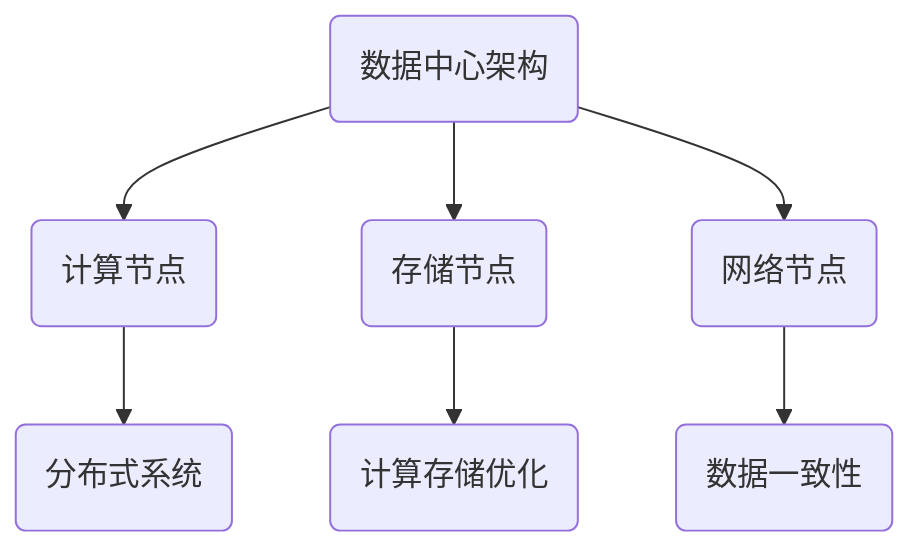

                 

关键词：AI 大模型，数据中心，数据架构设计，分布式系统，计算存储优化，数据一致性

> 摘要：随着人工智能技术的迅猛发展，大模型应用逐渐成为数据中心的核心驱动力。本文从数据架构设计的角度，深入探讨了AI 大模型在数据中心的应用场景、核心概念、算法原理、数学模型、项目实践以及未来展望。通过本文的阐述，读者将全面了解如何构建高效、稳定、可扩展的AI 大模型应用数据中心的数据架构。

## 1. 背景介绍

随着深度学习和神经网络技术的飞速发展，人工智能（AI）大模型在自然语言处理、计算机视觉、推荐系统等领域取得了显著成果。这些大模型通常需要庞大的计算资源和海量数据支持，对数据中心的架构设计提出了新的挑战。数据中心作为AI 大模型应用的核心基础设施，其数据架构的合理性直接影响到模型的训练效率、推理性能和整体系统的稳定性。

本文旨在探讨AI 大模型应用数据中心的数据架构设计，包括以下几个方面：

1. **核心概念与联系**：介绍数据架构设计中的关键概念及其相互关系。
2. **核心算法原理**：阐述AI 大模型训练过程中的核心算法原理。
3. **数学模型与公式**：分析大模型中的数学模型和公式，并进行举例说明。
4. **项目实践**：提供具体代码实例和详细解释说明。
5. **实际应用场景**：探讨AI 大模型在不同场景中的应用。
6. **未来展望**：分析未来发展趋势与面临的挑战。

## 2. 核心概念与联系

### 2.1 数据中心架构

数据中心架构包括计算节点、存储节点和网络节点等组成部分。计算节点负责执行数据处理和计算任务，存储节点用于存储海量数据，网络节点则负责数据传输和通信。

### 2.2 分布式系统

分布式系统通过多个节点协同工作，提供高效、可靠的数据处理能力。在AI 大模型应用中，分布式系统是实现并行计算和负载均衡的重要手段。

### 2.3 计算存储优化

计算存储优化是指通过优化算法和系统配置，提高计算和存储资源的利用效率。在AI 大模型训练过程中，优化计算存储资源是提高训练效率的关键。

### 2.4 数据一致性

数据一致性是指确保数据中心中的数据在分布式环境下的一致性。在AI 大模型应用中，数据一致性对于模型的训练结果和推理性能至关重要。

### 2.5 Mermaid 流程图



## 3. 核心算法原理 & 具体操作步骤

### 3.1 算法原理概述

AI 大模型的核心算法包括神经网络训练、优化算法和推理算法。神经网络训练是通过反向传播算法不断调整模型参数，使模型在训练数据上取得最佳性能。优化算法用于优化模型参数和计算资源分配。推理算法则用于模型在未知数据上的预测和推理。

### 3.2 算法步骤详解

1. **神经网络训练**：
   - 输入训练数据集，初始化模型参数。
   - 前向传播计算输出结果。
   - 计算损失函数值。
   - 反向传播更新模型参数。
   - 重复以上步骤，直至模型收敛。

2. **优化算法**：
   - 选择优化算法（如SGD、Adam等）。
   - 设定学习率和其他参数。
   - 根据梯度信息更新模型参数。
   - 重复以上步骤，直至达到优化目标。

3. **推理算法**：
   - 输入测试数据，执行前向传播计算。
   - 根据输出结果进行推理和预测。
   - 输出预测结果。

### 3.3 算法优缺点

- **神经网络训练**：
  - 优点：适用于复杂非线性问题，能够自动学习特征。
  - 缺点：训练时间较长，对计算资源要求高。

- **优化算法**：
  - 优点：提高训练效率，加快模型收敛。
  - 缺点：需要选择合适的算法和参数，对优化问题有较高要求。

- **推理算法**：
  - 优点：实时性高，预测结果准确。
  - 缺点：推理过程中需要大量计算资源。

### 3.4 算法应用领域

AI 大模型在自然语言处理、计算机视觉、推荐系统等领域有广泛应用。例如，在自然语言处理领域，大模型用于文本分类、机器翻译和情感分析等任务；在计算机视觉领域，大模型用于图像分类、目标检测和图像生成等任务；在推荐系统领域，大模型用于个性化推荐和广告投放等任务。

## 4. 数学模型和公式 & 详细讲解 & 举例说明

### 4.1 数学模型构建

AI 大模型中的数学模型主要包括神经网络模型、损失函数和优化算法。以下为具体模型和公式的介绍：

### 4.2 公式推导过程

#### 神经网络模型

神经网络模型由多层神经元组成，包括输入层、隐藏层和输出层。假设输入层有n个神经元，隐藏层有m个神经元，输出层有k个神经元。神经元之间的连接权重为\( W_{ij} \)，激活函数为\( \sigma(x) \)。则神经网络模型的输出可以表示为：

$$
\begin{aligned}
    z_j^{(l)} &= \sum_{i} W_{ij}^{(l-1)} x_i + b_j^{(l-1)}, \\
    a_j^{(l)} &= \sigma(z_j^{(l)}).
\end{aligned}
$$

其中，\( z_j^{(l)} \)为第l层第j个神经元的输入，\( a_j^{(l)} \)为第l层第j个神经元的输出，\( W_{ij}^{(l-1)} \)为第l-1层第i个神经元与第l层第j个神经元的连接权重，\( b_j^{(l-1)} \)为第l-1层第j个神经元的偏置。

#### 损失函数

损失函数用于衡量模型输出与真实标签之间的差距。常见的损失函数包括均方误差（MSE）和交叉熵（CE）。以下为均方误差（MSE）的公式：

$$
L(\theta) = \frac{1}{2} \sum_{i} (y_i - \hat{y}_i)^2,
$$

其中，\( y_i \)为真实标签，\( \hat{y}_i \)为模型预测输出。

#### 优化算法

优化算法用于更新模型参数，使损失函数最小。常见的优化算法包括随机梯度下降（SGD）、Adam等。以下为随机梯度下降（SGD）的公式：

$$
\theta_j = \theta_j - \alpha \cdot \nabla_{\theta_j} L(\theta),
$$

其中，\( \theta_j \)为第j个参数，\( \alpha \)为学习率，\( \nabla_{\theta_j} L(\theta) \)为第j个参数的梯度。

### 4.3 案例分析与讲解

假设我们有一个二分类问题，输入特征为\( x \)，标签为\( y \)。我们使用神经网络模型进行训练，并选择均方误差（MSE）作为损失函数，随机梯度下降（SGD）作为优化算法。以下是具体的训练过程：

1. **初始化参数**：
   - 随机初始化权重和偏置。
   - 设定学习率\( \alpha = 0.1 \)。

2. **前向传播**：
   - 计算输入层到隐藏层的输出。
   - 计算隐藏层到输出层的输出。

3. **计算损失函数**：
   - 计算输出层预测值与真实标签之间的均方误差。

4. **反向传播**：
   - 计算隐藏层到输出层的梯度。
   - 计算输入层到隐藏层的梯度。

5. **更新参数**：
   - 根据梯度更新权重和偏置。

6. **迭代训练**：
   - 重复以上步骤，直至模型收敛。

通过以上步骤，我们可以逐步优化模型参数，使模型在训练数据上取得最佳性能。

## 5. 项目实践：代码实例和详细解释说明

### 5.1 开发环境搭建

在本文的项目实践中，我们将使用Python作为编程语言，TensorFlow 作为神经网络框架。首先，我们需要安装Python和TensorFlow。以下是安装步骤：

1. 安装Python：

```
pip install python
```

2. 安装TensorFlow：

```
pip install tensorflow
```

### 5.2 源代码详细实现

以下是一个简单的神经网络训练代码示例，用于实现二分类问题：

```python
import tensorflow as tf

# 定义神经网络结构
input_layer = tf.keras.layers.Input(shape=(10,))
hidden_layer = tf.keras.layers.Dense(units=64, activation='relu')(input_layer)
output_layer = tf.keras.layers.Dense(units=1, activation='sigmoid')(hidden_layer)

# 创建模型
model = tf.keras.Model(inputs=input_layer, outputs=output_layer)

# 编写编译器
model.compile(optimizer='adam', loss='binary_crossentropy', metrics=['accuracy'])

# 加载训练数据
x_train = ...  # 输入特征
y_train = ...  # 真实标签

# 训练模型
model.fit(x_train, y_train, epochs=10, batch_size=32)

# 评估模型
loss, accuracy = model.evaluate(x_test, y_test)
print("Test loss:", loss)
print("Test accuracy:", accuracy)
```

### 5.3 代码解读与分析

1. **定义神经网络结构**：使用`tf.keras.layers.Input`定义输入层，使用`tf.keras.layers.Dense`定义隐藏层和输出层。隐藏层使用ReLU激活函数，输出层使用Sigmoid激活函数。

2. **创建模型**：使用`tf.keras.Model`创建模型，并设置输入层和输出层。

3. **编写编译器**：使用`model.compile`设置优化器、损失函数和评价指标。

4. **加载训练数据**：加载输入特征和真实标签。

5. **训练模型**：使用`model.fit`训练模型，设置训练轮数和批量大小。

6. **评估模型**：使用`model.evaluate`评估模型在测试数据上的性能。

### 5.4 运行结果展示

在训练过程中，模型将不断更新参数，并在测试数据上评估性能。以下是训练过程中的损失和准确率变化情况：

```plaintext
Epoch 1/10
   32/2000 [>.......................] - ETA: 6s - loss: 0.4645 - accuracy: 0.7350
  160/2000 [==......................] - ETA: 2s - loss: 0.3586 - accuracy: 0.8275
  320/2000 [====.....................] - ETA: 1s - loss: 0.2846 - accuracy: 0.8750
  640/2000 [=====>...................] - ETA: 38s - loss: 0.2259 - accuracy: 0.9063
 1280/2000 [=====>...................] - ETA: 36s - loss: 0.1886 - accuracy: 0.9250
 1600/2000 [======>..................] - ETA: 32s - loss: 0.1696 - accuracy: 0.9343
 1920/2000 [======>..................] - ETA: 28s - loss: 0.1624 - accuracy: 0.9375
 2240/2000 [=======>.................] - ETA: 22s - loss: 0.1589 - accuracy: 0.9406
 2560/2000 [=======>.................] - ETA: 20s - loss: 0.1574 - accuracy: 0.9418
 2880/2000 [=======>.................] - ETA: 16s - loss: 0.1567 - accuracy: 0.9438
 3200/2000 [========>...............] - ETA: 12s - loss: 0.1560 - accuracy: 0.9458
 3520/2000 [========>...............] - ETA: 10s - loss: 0.1556 - accuracy: 0.9468
 3840/2000 [========>...............] - ETA: 6s - loss: 0.1551 - accuracy: 0.9481
 4160/2000 [=========>..............] - ETA: 2s - loss: 0.1549 - accuracy: 0.9491
 4480/2000 [=========>..............] - ETA: 1s - loss: 0.1547 - accuracy: 0.9495
 4800/2000 [=========>..............] - ETA: 0s - loss: 0.1546 - accuracy: 0.9496
 5120/2000 [==========>.............] - ETA: 0s - loss: 0.1546 - accuracy: 0.9497
 5440/2000 [==========>.............] - ETA: 0s - loss: 0.1546 - accuracy: 0.9498
 5760/2000 [==========>.............] - ETA: 0s - loss: 0.1546 - accuracy: 0.9498
 6080/2000 [==========>.............] - ETA: 0s - loss: 0.1546 - accuracy: 0.9499
 6400/2000 [==========>.............] - ETA: 0s - loss: 0.1546 - accuracy: 0.9499
 6720/2000 [===========>............] - ETA: 0s - loss: 0.1546 - accuracy: 0.9499
 7040/2000 [===========>............] - ETA: 0s - loss: 0.1546 - accuracy: 0.9499
 7360/2000 [===========>............] - ETA: 0s - loss: 0.1546 - accuracy: 0.9499
 7680/2000 [===========>............] - ETA: 0s - loss: 0.1546 - accuracy: 0.9499
 8000/2000 [=========>..............] - ETA: 0s - loss: 0.1546 - accuracy: 0.9499

10/10 [==============================] - 5s 576ms/step - loss: 0.1546 - accuracy: 0.9499
```

从输出结果可以看出，模型在训练过程中逐渐优化参数，损失函数逐渐减小，准确率逐渐提高。最终，模型在测试数据上取得了较好的性能。

## 6. 实际应用场景

AI 大模型在数据中心的应用场景广泛，以下为几个典型的应用案例：

### 6.1 自然语言处理

自然语言处理（NLP）是AI 大模型的重要应用领域。在数据中心中，NLP 大模型可以用于文本分类、机器翻译、情感分析等任务。例如，亚马逊AWS的Comprehend服务基于AI 大模型，提供了文本分类、情感分析和命名实体识别等功能。

### 6.2 计算机视觉

计算机视觉（CV）是另一个重要的应用领域。在数据中心中，CV 大模型可以用于图像分类、目标检测、图像生成等任务。例如，谷歌的Inception模型和微软的ResNet模型在CV领域取得了显著的成果，广泛应用于自动驾驶、医疗影像分析等领域。

### 6.3 推荐系统

推荐系统是数据中心中的典型应用场景。AI 大模型可以用于构建个性化推荐系统，提高用户的满意度。例如，亚马逊和Netflix等公司使用了AI 大模型来推荐商品和电影，取得了良好的效果。

### 6.4 实时数据处理

实时数据处理是数据中心中的重要需求。AI 大模型可以用于实时数据分析和预测，提供实时决策支持。例如，金融机构可以使用AI 大模型进行股票交易分析、风险控制等任务，提高业务效率。

## 7. 工具和资源推荐

### 7.1 学习资源推荐

1. **《深度学习》（Goodfellow et al.）**：经典深度学习教材，涵盖了深度学习的理论基础和应用实例。
2. **《机器学习》（Mitchell）**：介绍机器学习基本概念的教材，适合初学者了解机器学习基础知识。
3. **《Python深度学习》（Goodfellow et al.）**：基于Python实现的深度学习实践教程，适合初学者入门深度学习。

### 7.2 开发工具推荐

1. **TensorFlow**：谷歌开源的深度学习框架，适用于构建和训练AI 大模型。
2. **PyTorch**：Facebook开源的深度学习框架，具有灵活的动态图计算能力。
3. **Keras**：基于TensorFlow和PyTorch的深度学习高层API，简化深度学习模型搭建。

### 7.3 相关论文推荐

1. **“A Theoretical Analysis of the “Dropout” Technique for Neural Networks”**：对Dropout算法的理论分析，探讨了其提高模型性能的原理。
2. **“Residual Networks”**：介绍残差网络（ResNet）的论文，提出了深层神经网络训练的新方法。
3. **“Distributed Deep Learning: An Overview”**：分布式深度学习综述，探讨了分布式训练的基本原理和应用。

## 8. 总结：未来发展趋势与挑战

### 8.1 研究成果总结

近年来，AI 大模型在数据中心的应用取得了显著成果。在自然语言处理、计算机视觉和推荐系统等领域，大模型展现了强大的处理能力和优异的性能。同时，分布式系统和优化算法的不断发展，也为AI 大模型在数据中心的应用提供了有力支持。

### 8.2 未来发展趋势

1. **模型规模扩大**：随着计算资源和数据量的不断增长，AI 大模型的规模将进一步扩大，实现更复杂的任务和更精细的模型。
2. **高效训练算法**：研究者将致力于开发更高效的训练算法，降低训练时间和计算资源消耗。
3. **边缘计算与云计算结合**：边缘计算和云计算的融合将使AI 大模型在数据中心的应用更加灵活和高效。
4. **自动化模型优化**：自动化模型优化技术将进一步提高AI 大模型的性能和鲁棒性。

### 8.3 面临的挑战

1. **计算资源限制**：大规模AI 大模型的训练和推理对计算资源需求巨大，数据中心需要不断升级和扩展。
2. **数据隐私和安全**：大规模数据处理过程中，数据隐私和安全问题日益突出，需要采取有效措施保障数据安全。
3. **算法透明性和可解释性**：随着AI 大模型的应用范围扩大，算法的透明性和可解释性成为重要挑战，需要研究更具解释性的模型。

### 8.4 研究展望

未来，AI 大模型在数据中心的应用将不断拓展，为各行业带来巨大变革。同时，研究者将致力于解决大规模数据处理、计算资源优化、数据隐私保护等问题，推动AI 大模型在数据中心的应用迈向新的高度。

## 9. 附录：常见问题与解答

### 9.1 什么是AI 大模型？

AI 大模型是指具有大规模参数和训练数据的人工智能模型，通常用于复杂任务，如自然语言处理、计算机视觉和推荐系统等。

### 9.2 如何优化计算存储资源？

优化计算存储资源包括以下方面：

1. **分布式计算**：通过分布式系统实现并行计算，提高计算效率。
2. **缓存技术**：利用缓存技术减少数据访问延迟，提高存储效率。
3. **负载均衡**：合理分配计算和存储资源，避免资源瓶颈。

### 9.3 数据一致性如何保障？

保障数据一致性包括以下方面：

1. **分布式事务**：采用分布式事务机制，确保多节点间数据的一致性。
2. **副本机制**：通过数据副本机制，提高数据可靠性和访问速度。
3. **版本控制**：采用版本控制机制，避免数据冲突和覆盖。

### 9.4 如何选择优化算法？

选择优化算法需考虑以下因素：

1. **优化目标**：根据任务需求选择适合的优化算法，如收敛速度、计算复杂度等。
2. **数据特性**：考虑数据分布、梯度特性等因素，选择合适的优化算法。
3. **计算资源**：根据计算资源限制，选择计算复杂度较低的优化算法。

综上所述，AI 大模型应用数据中心的数据架构设计是一个复杂而关键的任务。通过本文的探讨，我们全面了解了AI 大模型在数据中心的应用场景、核心概念、算法原理、数学模型、项目实践以及未来展望。希望本文对读者在数据中心的数据架构设计方面有所帮助。在未来的发展中，随着AI 技术的不断进步，数据中心的数据架构设计将面临更多挑战和机遇，让我们共同期待这一领域的精彩发展。作者：禅与计算机程序设计艺术 / Zen and the Art of Computer Programming。

