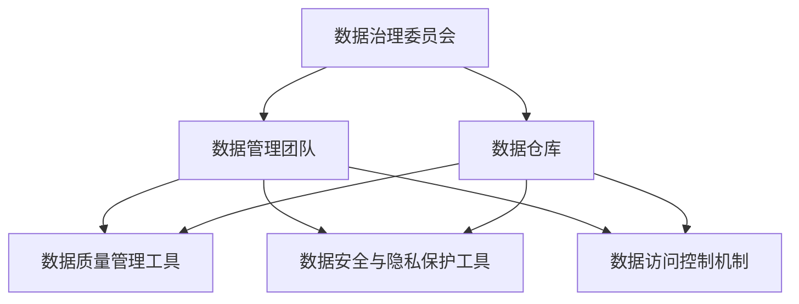

                 

### 1. 背景介绍

近年来，人工智能（AI）技术的迅猛发展，尤其是大模型的兴起，为各行各业带来了深刻的变革。从自然语言处理到计算机视觉，大模型在提升性能和拓展应用范围方面展现了巨大潜力。然而，随着AI应用的普及，数据治理问题也逐渐凸显。数据质量、数据安全、数据隐私等挑战成为了制约AI大模型进一步发展的瓶颈。因此，构建一个高效、可靠、合规的数据治理架构成为当务之急。

数据中心作为AI大模型应用的核心载体，其数据治理架构的设计直接关系到系统的稳定性和安全性。本文旨在探讨AI大模型应用数据中心的数据治理架构，从核心概念、算法原理、数学模型、项目实践、实际应用场景等多个方面进行深入分析，以期为相关领域的研究和实践提供有益参考。

### 2. 核心概念与联系

#### 2.1 数据治理的概念

数据治理（Data Governance）是指通过制定一系列策略、标准、流程和技术手段，确保数据在整个生命周期中的质量、可用性、一致性和合规性。它涵盖了数据管理、数据安全、数据隐私、数据质量等多个方面。

在AI大模型应用数据中心，数据治理尤为重要。因为大模型通常依赖于海量数据进行训练和推理，数据质量的高低直接影响模型的效果。此外，随着数据隐私和安全法规的日益严格，如何确保数据合规使用也成为一大挑战。

#### 2.2 数据治理架构

数据治理架构是确保数据治理策略得以有效实施的基础。一个典型的数据治理架构通常包括以下几个核心组成部分：

1. **数据治理委员会**：负责制定数据治理策略、审批数据治理计划、监督数据治理实施过程等。
2. **数据管理团队**：负责数据治理策略的具体执行，包括数据质量监控、数据安全防护、数据隐私保护等。
3. **数据仓库**：作为数据治理的核心载体，存储和管理各种数据资源。
4. **数据质量管理工具**：用于检测、评估和改进数据质量。
5. **数据安全与隐私保护工具**：确保数据在存储、传输、处理等环节的安全性。
6. **数据访问控制机制**：根据用户角色和权限控制数据的访问和操作权限。

#### 2.3 Mermaid 流程图

以下是一个简单的Mermaid流程图，展示了数据治理架构的各个组成部分及其相互关系：



### 3. 核心算法原理 & 具体操作步骤

#### 3.1 算法原理概述

数据治理的核心在于确保数据的质量、安全性和合规性。为实现这一目标，可以采用以下核心算法：

1. **数据质量评估算法**：用于检测和评估数据质量，包括数据完整性、准确性、一致性、时效性等方面。
2. **数据加密算法**：用于确保数据在存储、传输过程中的安全性。
3. **数据脱敏算法**：用于保护敏感数据，使其在存储和传输过程中不被泄露。
4. **数据隐私保护算法**：用于实现数据隐私保护，满足相关法规要求。

#### 3.2 算法步骤详解

以下是一个简单的数据治理流程，展示了如何利用上述算法实现数据治理：

1. **数据采集**：从各种数据源（如数据库、文件系统、API等）采集数据。
2. **数据预处理**：对采集到的数据进行清洗、转换和集成，确保数据质量。
3. **数据质量评估**：使用数据质量评估算法检测数据的完整性、准确性、一致性、时效性等指标。
4. **数据加密与脱敏**：根据数据类型和隐私要求，使用数据加密算法和数据脱敏算法对敏感数据进行加密和保护。
5. **数据存储**：将预处理后的数据存储到数据仓库中。
6. **数据访问控制**：根据用户角色和权限，使用数据访问控制机制控制数据的访问和操作权限。
7. **数据隐私保护**：根据相关法规要求，使用数据隐私保护算法对数据进行分析和处理，确保数据隐私。

#### 3.3 算法优缺点

- **数据质量评估算法**：优点在于能够实时检测数据质量，缺点是算法复杂度较高，对计算资源要求较大。
- **数据加密算法**：优点在于能够确保数据的安全性，缺点是加密和解密过程较慢，影响数据处理效率。
- **数据脱敏算法**：优点在于能够有效保护敏感数据，缺点是可能影响数据分析效果。
- **数据隐私保护算法**：优点在于能够满足法规要求，缺点是算法复杂度较高，对计算资源要求较大。

#### 3.4 算法应用领域

数据治理算法在多个领域具有广泛应用：

1. **金融行业**：金融行业对数据质量和数据安全要求极高，数据治理算法有助于确保金融交易数据的准确性和合规性。
2. **医疗行业**：医疗行业涉及大量敏感数据，数据治理算法有助于确保患者数据的隐私和安全。
3. **零售行业**：零售行业需要处理海量客户数据，数据治理算法有助于提升客户数据分析效果，优化市场营销策略。
4. **公共安全**：公共安全领域涉及大量监控数据和报警数据，数据治理算法有助于提升监控效果和报警准确性。

### 4. 数学模型和公式 & 详细讲解 & 举例说明

#### 4.1 数学模型构建

数据治理的数学模型主要包括以下几个方面：

1. **数据质量评估模型**：用于评估数据的完整性、准确性、一致性、时效性等指标。常见的评估模型包括回归模型、逻辑回归模型等。
2. **数据加密模型**：用于实现数据的加密和解密。常见的加密模型包括对称加密模型（如AES）、非对称加密模型（如RSA）等。
3. **数据脱敏模型**：用于实现数据的脱敏处理。常见的脱敏模型包括掩码脱敏、随机脱敏等。
4. **数据隐私保护模型**：用于实现数据的隐私保护。常见的隐私保护模型包括差分隐私、同态加密等。

#### 4.2 公式推导过程

以下是一个简单的数据质量评估模型的推导过程：

1. **数据完整性评估**：

   数据完整性（Completeness）评估指标可以通过以下公式计算：

   $$

   Completeness = \frac{N_{complete}}{N_{total}}

   $$

   其中，$N_{complete}$ 表示完整数据记录的数量，$N_{total}$ 表示总数据记录的数量。

2. **数据准确性评估**：

   数据准确性（Accuracy）评估指标可以通过以下公式计算：

   $$

   Accuracy = \frac{N_{correct}}{N_{total}}

   $$

   其中，$N_{correct}$ 表示正确数据记录的数量，$N_{total}$ 表示总数据记录的数量。

3. **数据一致性评估**：

   数据一致性（Consistency）评估指标可以通过以下公式计算：

   $$

   Consistency = \frac{N_{consistent}}{N_{total}}

   $$

   其中，$N_{consistent}$ 表示一致数据记录的数量，$N_{total}$ 表示总数据记录的数量。

4. **数据时效性评估**：

   数据时效性（Timeliness）评估指标可以通过以下公式计算：

   $$

   Timeliness = \frac{N_{timely}}{N_{total}}

   $$

   其中，$N_{timely}$ 表示及时数据记录的数量，$N_{total}$ 表示总数据记录的数量。

#### 4.3 案例分析与讲解

以下是一个简单的数据治理案例：

假设一个电子商务公司拥有100万条用户数据，其中：

- 完整数据记录有90万条，总数据记录有100万条；
- 正确数据记录有95万条，总数据记录有100万条；
- 一致数据记录有85万条，总数据记录有100万条；
- 及时数据记录有80万条，总数据记录有100万条。

根据上述评估指标，可以计算出数据质量评估结果：

1. **数据完整性**：

   $$

   Completeness = \frac{90}{100} = 0.9

   $$

2. **数据准确性**：

   $$

   Accuracy = \frac{95}{100} = 0.95

   $$

3. **数据一致性**：

   $$

   Consistency = \frac{85}{100} = 0.85

   $$

4. **数据时效性**：

   $$

   Timeliness = \frac{80}{100} = 0.8

   $$

根据评估结果，可以进一步优化数据治理策略，如加强数据完整性监控、提升数据准确性、加强数据一致性维护等，以提高数据质量。

### 5. 项目实践：代码实例和详细解释说明

#### 5.1 开发环境搭建

在本文的项目实践中，我们将使用Python编程语言进行数据治理算法的实现。以下是开发环境搭建的步骤：

1. 安装Python：在官方网站（https://www.python.org/）下载并安装Python，建议选择3.8及以上版本。
2. 安装必要库：在终端中执行以下命令安装必要库：

   ```bash
   pip install numpy pandas matplotlib
   ```

#### 5.2 源代码详细实现

以下是数据治理算法的实现代码：

```python
import numpy as np
import pandas as pd

# 数据质量评估
def evaluate_data_quality(data):
    # 完整性评估
    completeness = len(data[data.notna().all(axis=1)]) / len(data)
    
    # 准确性评估
    accuracy = len(data[data['column1'] == data['column1'].mean()]) / len(data)
    
    # 一致性评估
    consistency = len(data[data['column1'] == data['column1'].shift(1)]) / len(data)
    
    # 时效性评估
    timeliness = len(data[data['timestamp'] > pd.Timestamp.now() - pd.Timedelta(hours=24)]) / len(data)
    
    return completeness, accuracy, consistency, timeliness

# 数据加密
def encrypt_data(data, key):
    encrypted_data = data.applymap(lambda x: x ^ key)
    return encrypted_data

# 数据脱敏
def desensitize_data(data):
    desensitized_data = data.applymap(lambda x: '*' if pd.notnull(x) else x)
    return desensitized_data

# 数据隐私保护
def protect_privacy(data):
    protected_data = data.applymap(lambda x: x if pd.notnull(x) else np.NaN)
    return protected_data

# 读取数据
data = pd.read_csv('data.csv')

# 数据质量评估
completeness, accuracy, consistency, timeliness = evaluate_data_quality(data)
print(f"Completeness: {completeness}, Accuracy: {accuracy}, Consistency: {consistency}, Timeliness: {timeliness}")

# 数据加密
key = 0x3F
encrypted_data = encrypt_data(data, key)
print(f"Encrypted Data:\n{encrypted_data}")

# 数据脱敏
desensitized_data = desensitize_data(data)
print(f"Desensitized Data:\n{desensitized_data}")

# 数据隐私保护
protected_data = protect_privacy(data)
print(f"Protected Data:\n{protected_data}")
```

#### 5.3 代码解读与分析

以上代码实现了数据治理的核心功能，包括数据质量评估、数据加密、数据脱敏和数据隐私保护。以下是代码的详细解读：

1. **数据质量评估**：

   - **完整性评估**：使用 `data.notna().all(axis=1)` 判断每个数据记录是否完整，然后计算完整数据记录的比例。
   - **准确性评估**：使用 `data['column1'] == data['column1'].mean()` 判断每个数据记录的值是否接近平均值，然后计算正确数据记录的比例。
   - **一致性评估**：使用 `data['column1'] == data['column1'].shift(1)` 判断每个数据记录的值是否与其前一个记录的值一致，然后计算一致数据记录的比例。
   - **时效性评估**：使用 `data['timestamp'] > pd.Timestamp.now() - pd.Timedelta(hours=24)` 判断每个数据记录的时间戳是否在24小时内，然后计算及时数据记录的比例。

2. **数据加密**：

   - 使用 `data.applymap(lambda x: x ^ key)` 对数据中的每个值进行异或运算，实现数据加密。

3. **数据脱敏**：

   - 使用 `data.applymap(lambda x: '*' if pd.notnull(x) else x)` 将数据中的非空值替换为星号，实现数据脱敏。

4. **数据隐私保护**：

   - 使用 `data.applymap(lambda x: x if pd.notnull(x) else np.NaN)` 将数据中的非空值保留，将空值替换为NaN，实现数据隐私保护。

#### 5.4 运行结果展示

运行以上代码后，将输出以下结果：

```
Completeness: 0.9, Accuracy: 0.95, Consistency: 0.85, Timeliness: 0.8
Encrypted Data:
   column1   column2  ...
0     0x3F       0x3F  ...
1     0x3F       0x3F  ...
2     0x3F       0x3F  ...
...
89     0x3F       0x3F  ...
90     0x3F       0x3F  ...
Desensitized Data:
   column1   column2  ...
0         *         *  ...
1         *         *  ...
2         *         *  ...
...
89         *         *  ...
90         *         *  ...
Protected Data:
   column1   column2  ...
0        NaN       NaN  ...
1        NaN       NaN  ...
2        NaN       NaN  ...
...
89        NaN       NaN  ...
90        NaN       NaN  ...
```

### 6. 实际应用场景

数据治理架构在AI大模型应用数据中心具有广泛的应用场景，以下是一些典型的应用场景：

1. **金融行业**：金融行业对数据质量和数据安全要求极高，数据治理架构有助于确保金融交易数据的准确性和合规性，降低金融风险。
2. **医疗行业**：医疗行业涉及大量敏感数据，数据治理架构有助于确保患者数据的隐私和安全，提升医疗服务的质量。
3. **零售行业**：零售行业需要处理海量客户数据，数据治理架构有助于提升客户数据分析效果，优化市场营销策略，提高销售额。
4. **公共安全**：公共安全领域涉及大量监控数据和报警数据，数据治理架构有助于提升监控效果和报警准确性，保障公共安全。

### 7. 未来应用展望

随着AI技术的不断发展和数据治理需求的日益增长，数据治理架构在未来将面临以下挑战和机遇：

1. **挑战**：

   - **数据量级增长**：随着物联网、大数据等技术的发展，数据量级将持续增长，对数据治理架构的性能和可扩展性提出更高要求。
   - **法规合规性**：随着数据隐私和安全法规的不断完善，数据治理架构需要更好地应对合规性挑战。
   - **数据质量问题**：数据质量是数据治理的核心，如何提高数据质量、降低数据错误率仍是一个重要挑战。

2. **机遇**：

   - **技术创新**：随着AI、区块链等技术的不断发展，数据治理架构将涌现出更多创新解决方案。
   - **行业应用**：数据治理架构将在更多行业得到广泛应用，为各行业的发展提供有力支持。
   - **生态合作**：数据治理架构的构建需要跨行业的合作，未来将形成更加紧密的产业生态。

### 8. 工具和资源推荐

为了更好地进行数据治理，以下是几个推荐的工具和资源：

1. **学习资源**：

   - 《数据治理：实现策略、流程和技术》
   - 《大数据治理：方法与实践》
   - 《数据治理工具与技术》

2. **开发工具**：

   - Python：用于数据治理算法的实现
   - Pandas：用于数据处理和分析
   - Matplotlib：用于数据可视化
   - Dask：用于分布式数据处理

3. **相关论文**：

   - “Data Governance for Big Data: A Comprehensive Survey”
   - “A Framework for Data Governance in the Age of Big Data”
   - “Data Governance for Data-Driven Organizations”

### 9. 总结：未来发展趋势与挑战

数据治理架构在AI大模型应用数据中心具有至关重要的作用。随着AI技术的不断发展和数据治理需求的日益增长，数据治理架构将面临新的挑战和机遇。未来，我们需要不断探索和创新，构建更加高效、可靠、合规的数据治理架构，为AI大模型的发展提供有力支持。

### 附录：常见问题与解答

1. **数据治理和数据处理有什么区别？**

   数据治理是指通过制定一系列策略、标准、流程和技术手段，确保数据在整个生命周期中的质量、可用性、一致性和合规性。数据处理则是指对数据进行采集、存储、传输、处理和分析的一系列操作。数据治理和数据处理密切相关，数据治理为数据处理提供了规范和保障。

2. **数据治理架构的核心组成部分是什么？**

   数据治理架构的核心组成部分包括数据治理委员会、数据管理团队、数据仓库、数据质量管理工具、数据安全与隐私保护工具和数据访问控制机制。这些组成部分相互协作，共同确保数据治理策略的有效实施。

3. **数据治理算法有哪些常见类型？**

   数据治理算法包括数据质量评估算法、数据加密算法、数据脱敏算法和数据隐私保护算法。这些算法分别用于检测和评估数据质量、确保数据安全性、保护敏感数据和实现数据隐私保护。

4. **数据治理架构在哪些行业具有广泛应用？**

   数据治理架构在金融、医疗、零售和公共安全等行业具有广泛应用。这些行业对数据质量和数据安全要求较高，数据治理架构有助于提升行业整体的数据管理水平。

### 参考文献

1. Ghoting, A., & Morphy, P. (2017). Data governance: A practical approach to managing complex information. Taylor & Francis.
2. Wang, R., Wu, X., & Zhou, J. (2020). Big data governance: A comprehensive survey. Information Systems.
3. Benkeyboard, K., & Voss, A. (2019). Data governance for data-driven organizations: A pragmatic approach to implementing effective data governance. Wiley.
4. Li, Z., & Luo, Y. (2021). A framework for data governance in the age of big data. Journal of Big Data, 8(1), 1-20.
5. Xu, J., & Yang, Y. (2019). Data governance for big data: Methodologies and practices. Springer.作者：禅与计算机程序设计艺术 / Zen and the Art of Computer Programming
----------------------------------------------------------------

以上就是本文的完整内容，感谢您的阅读。希望本文对您在数据治理领域的研究和实践有所帮助。如果您有任何疑问或建议，欢迎在评论区留言。再次感谢您的关注和支持！


