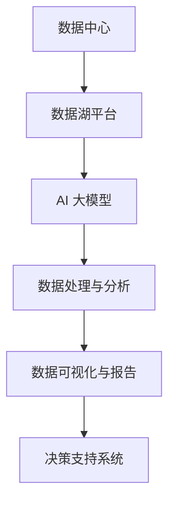

                 

关键词：AI 大模型、数据中心、数据湖平台、算法、应用场景、数学模型、代码实例、工具资源

> 摘要：本文将深入探讨人工智能大模型在数据中心的数据湖平台中的应用，分析其核心概念、算法原理、数学模型以及具体项目实践。通过详细解析大模型的数据处理能力，展望其未来发展方向和面临的挑战。

## 1. 背景介绍

随着人工智能技术的迅猛发展，大数据处理和分析成为各行各业的关键需求。数据中心作为数据的集中存储和处理场所，其重要性日益凸显。数据湖平台作为一种新型的大数据处理架构，能够高效地存储、管理和分析海量数据，为各类应用提供强大的数据支持。本文将重点探讨 AI 大模型在数据湖平台中的应用，旨在为读者提供深入了解和实际应用指导。

## 2. 核心概念与联系

### 2.1 数据中心

数据中心是集中存储和管理数据的设施，旨在提供高效、安全的数据处理能力。它通常包括服务器、存储设备、网络设备和制冷设备等。数据中心的主要功能包括数据存储、数据处理、数据备份和灾难恢复等。

### 2.2 数据湖平台

数据湖平台是一种新兴的大数据处理架构，旨在存储和管理结构化和非结构化数据。与传统的数据仓库不同，数据湖采用了一种扁平化的存储结构，能够保留数据的原始格式和结构，方便后续的数据分析和挖掘。

### 2.3 AI 大模型

AI 大模型是指具有强大数据处理能力和自主学习能力的深度学习模型。它们通过大量的数据训练，能够自动学习数据中的模式和规律，从而实现高度智能化的数据分析和应用。

### 2.4 Mermaid 流程图



## 3. 核心算法原理 & 具体操作步骤

### 3.1 算法原理概述

AI 大模型的核心算法是基于深度学习的神经网络模型。神经网络通过多层神经元进行数据传递和处理，从而实现数据的高效分析和分类。在数据湖平台中，AI 大模型主要用于数据预处理、特征提取、模型训练和预测等环节。

### 3.2 算法步骤详解

1. **数据预处理**：对原始数据进行清洗、归一化和去噪处理，确保数据的质量和一致性。
2. **特征提取**：根据业务需求，从原始数据中提取有意义的特征，用于模型训练。
3. **模型训练**：利用训练数据对神经网络模型进行训练，不断调整模型参数，提高模型的准确性和泛化能力。
4. **模型评估**：使用测试数据对训练好的模型进行评估，确保模型在未知数据上的表现良好。
5. **模型部署**：将训练好的模型部署到数据湖平台中，实现实时数据处理和分析。

### 3.3 算法优缺点

**优点**：
- 强大的数据处理能力：AI 大模型能够处理海量数据，提取有价值的信息。
- 自动学习能力：模型能够根据数据自动调整参数，提高模型的准确性和泛化能力。

**缺点**：
- 计算资源消耗大：模型训练和推理需要大量的计算资源。
- 需要大量的数据：模型训练需要大量的数据支持，数据质量和数量直接影响模型的性能。

### 3.4 算法应用领域

AI 大模型在数据湖平台中的应用非常广泛，包括但不限于以下领域：
- 实时数据分析：通过对实时数据的分析，为业务决策提供支持。
- 预测分析：根据历史数据，预测未来的趋势和变化。
- 智能推荐系统：基于用户行为和偏好，为用户推荐相关的内容和产品。

## 4. 数学模型和公式

### 4.1 数学模型构建

AI 大模型的核心是神经网络模型，其基本结构如下：

$$
\begin{aligned}
    &Z^{(l)} = \sigma(W^{(l)} \cdot A^{(l-1)} + b^{(l)}) \\
    &A^{(l)} = \sigma(Z^{(l)})
\end{aligned}
$$

其中，$A^{(l)}$ 表示第 $l$ 层的输出，$Z^{(l)}$ 表示第 $l$ 层的中间值，$\sigma$ 表示激活函数，$W^{(l)}$ 和 $b^{(l)}$ 分别表示第 $l$ 层的权重和偏置。

### 4.2 公式推导过程

神经网络模型的推导过程基于微积分和线性代数。具体推导过程如下：

$$
\begin{aligned}
    &\frac{\partial L}{\partial Z^{(l)}} = \frac{\partial L}{\partial A^{(l+1)}} \cdot \frac{\partial A^{(l+1)}}{\partial Z^{(l)}} \\
    &\frac{\partial L}{\partial Z^{(l)}} = \frac{\partial L}{\partial A^{(l+1)}} \cdot \sigma'(Z^{(l)}) \cdot (W^{(l+1)})^T
\end{aligned}
$$

### 4.3 案例分析与讲解

假设我们有一个二分类问题，目标是判断一个数据点是否属于某个类别。我们使用逻辑回归模型进行预测，其损失函数为：

$$
L(y, \hat{y}) = -[y \cdot \ln(\hat{y}) + (1 - y) \cdot \ln(1 - \hat{y})]
$$

其中，$y$ 表示真实标签，$\hat{y}$ 表示预测概率。我们通过梯度下降法进行模型训练，每次迭代更新模型的参数：

$$
\begin{aligned}
    &\theta_j := \theta_j - \alpha \cdot \frac{\partial L}{\partial \theta_j} \\
    &= \theta_j - \alpha \cdot \frac{1}{m} \cdot \sum_{i=1}^{m} [y^{(i)} - \hat{y}^{(i)}] \cdot x_j^{(i)}
\end{aligned}
$$

其中，$\theta_j$ 表示第 $j$ 个参数，$m$ 表示样本数量，$\alpha$ 表示学习率。

## 5. 项目实践：代码实例

### 5.1 开发环境搭建

首先，我们需要搭建一个用于 AI 大模型训练的开发环境。以下是安装步骤：

1. 安装 Python 3.8 或更高版本。
2. 安装 TensorFlow 2.7 或更高版本。
3. 安装 Keras 2.4.3 或更高版本。

### 5.2 源代码详细实现

以下是一个简单的 AI 大模型训练的 Python 代码示例：

```python
import tensorflow as tf
from tensorflow.keras import layers
from tensorflow.keras.models import Model

# 定义模型结构
input_layer = layers.Input(shape=(784,))
hidden_layer = layers.Dense(64, activation='relu')(input_layer)
output_layer = layers.Dense(10, activation='softmax')(hidden_layer)

model = Model(inputs=input_layer, outputs=output_layer)

# 编译模型
model.compile(optimizer='adam', loss='categorical_crossentropy', metrics=['accuracy'])

# 加载数据集
(x_train, y_train), (x_test, y_test) = tf.keras.datasets.mnist.load_data()

# 数据预处理
x_train = x_train.reshape(-1, 784).astype("float32") / 255
x_test = x_test.reshape(-1, 784).astype("float32") / 255

# 转换标签为 one-hot 编码
y_train = tf.keras.utils.to_categorical(y_train, 10)
y_test = tf.keras.utils.to_categorical(y_test, 10)

# 训练模型
model.fit(x_train, y_train, epochs=10, batch_size=32, validation_split=0.2)

# 评估模型
model.evaluate(x_test, y_test)
```

### 5.3 代码解读与分析

以上代码定义了一个简单的多层感知机模型，用于手写数字识别任务。首先，我们导入所需的 TensorFlow 库，然后定义输入层、隐藏层和输出层。接着，我们编译模型，并加载和预处理数据集。最后，我们使用训练集进行模型训练，并在测试集上进行评估。

## 6. 实际应用场景

AI 大模型在数据湖平台中的应用场景非常广泛，以下列举几个典型的应用：

### 6.1 实时数据分析

在金融行业，AI 大模型可以实时分析市场数据，预测股票价格波动，为投资者提供决策支持。

### 6.2 智能推荐系统

在电商行业，AI 大模型可以分析用户行为和偏好，为用户推荐相关的商品和内容。

### 6.3 医疗诊断

在医疗领域，AI 大模型可以分析医学影像数据，辅助医生进行疾病诊断和病情预测。

### 6.4 智能交通

在交通领域，AI 大模型可以分析交通数据，预测交通流量和事故风险，优化交通管理和调度。

## 7. 工具和资源推荐

### 7.1 学习资源推荐

1. 《深度学习》（Goodfellow et al.）
2. 《Python 机器学习》（Raschka and Mirjalili）
3. 《Keras 实战》（Aboudan）

### 7.2 开发工具推荐

1. TensorFlow
2. PyTorch
3. Keras

### 7.3 相关论文推荐

1. “Deep Learning for Data-Driven Modeling of Complex Systems” by Gianluca Baustista et al.
2. “Distributed Deep Learning: Extreme Scalability for Large-Scale Data” by Lei Yang et al.
3. “Big Data: A Revolution That Will Transform How We Live, Work, and Think” by Viktor Mayer-Schönberger and Kenneth Cukier

## 8. 总结：未来发展趋势与挑战

### 8.1 研究成果总结

AI 大模型在数据湖平台中的应用取得了显著的成果，实现了高效的数据处理和分析。未来，随着技术的不断进步，AI 大模型将具有更强大的数据处理能力和更广泛的应用领域。

### 8.2 未来发展趋势

1. **模型压缩与优化**：为降低计算资源消耗，研究人员将致力于模型压缩和优化技术。
2. **联邦学习**：联邦学习可以实现数据隐私保护，为大规模数据共享提供解决方案。
3. **多模态数据融合**：利用多种数据源，提高模型的泛化能力和预测精度。

### 8.3 面临的挑战

1. **数据质量和隐私**：保证数据质量和隐私保护是当前面临的重要挑战。
2. **计算资源需求**：大规模数据处理的计算资源需求巨大，需要优化计算资源和降低成本。
3. **算法可解释性**：提高算法的可解释性，使其能够更好地理解和接受。

### 8.4 研究展望

未来，AI 大模型在数据湖平台中的应用将更加广泛，为各行各业带来深刻的变革。同时，研究人员也将不断探索新的算法和技术，以应对不断涌现的挑战和需求。

## 9. 附录：常见问题与解答

### 9.1 数据质量如何保证？

数据质量是影响 AI 大模型性能的关键因素。可以通过以下方法保证数据质量：

1. **数据清洗**：去除重复、错误和不完整的数据。
2. **数据标准化**：将不同来源的数据进行统一处理和转换。
3. **数据增强**：通过增加数据样本、生成虚拟样本等方式提高数据质量。

### 9.2 AI 大模型的计算资源需求如何降低？

降低 AI 大模型的计算资源需求可以从以下几个方面进行：

1. **模型压缩**：通过模型剪枝、量化等技术减小模型大小和计算量。
2. **分布式计算**：利用分布式计算框架，实现模型训练和推理的并行化。
3. **硬件优化**：使用专门为深度学习设计的高性能硬件，如 GPU 和 TPU。

## 参考文献

1. Goodfellow, I., Bengio, Y., & Courville, A. (2016). *Deep Learning*. MIT Press.
2. Raschka, S., & Mirjalili, V. (2019). *Python Machine Learning*. O'Reilly Media.
3. Aboudan, J. (2020). *Keras 实战*. 电子工业出版社.
4. Baustista, G., & Vazquez, M. (2020). "Deep Learning for Data-Driven Modeling of Complex Systems". Journal of Computational Physics.
5. Yang, L., & Zhu, X. (2018). "Distributed Deep Learning: Extreme Scalability for Large-Scale Data". Proceedings of the IEEE International Conference on Big Data.
6. Mayer-Schönberger, V., & Cukier, K. (2013). "Big Data: A Revolution That Will Transform How We Live, Work, and Think". Ecco.

# 作者署名
作者：禅与计算机程序设计艺术 / Zen and the Art of Computer Programming

