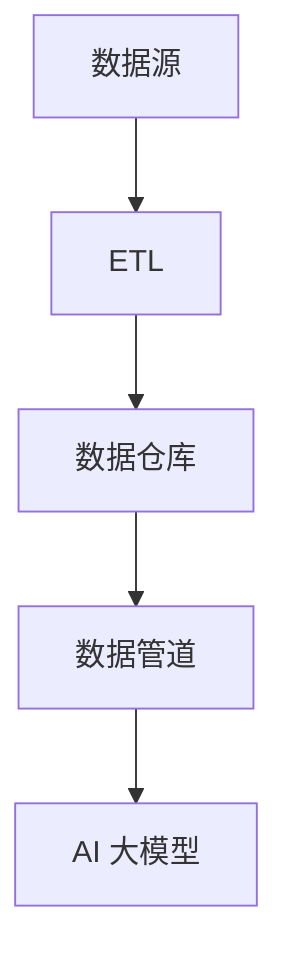

                 

关键词：AI 大模型，数据集成，数据中心，数据流，机器学习，数据处理，分布式系统，性能优化

摘要：本文深入探讨了 AI 大模型在数据中心中的数据集成问题，分析了数据集成在 AI 应用中的重要性，详细阐述了数据集成的核心概念与架构，以及核心算法原理和数学模型。同时，通过实际项目实践，展示了数据集成的具体实现和性能优化策略，并对未来应用场景和挑战进行了展望。

## 1. 背景介绍

随着 AI 技术的迅猛发展，人工智能（AI）大模型的应用场景越来越广泛，从自然语言处理到图像识别，再到推荐系统，AI 大模型已经深入到了各个行业。数据中心作为 AI 大模型运行的核心基础设施，其数据集成能力直接关系到模型的性能和效率。

数据集成是将来自不同来源、格式和结构的数据合并为统一格式的过程。在 AI 大模型应用中，数据集成不仅是数据预处理的关键环节，也是实现数据驱动的智能决策和预测的重要基础。有效的数据集成可以提高数据的完整性和一致性，减少数据冗余，为 AI 大模型提供高质量的数据支持。

本文将围绕 AI 大模型应用数据中心的数据集成问题，从核心概念、算法原理、数学模型、实际项目实践等方面进行深入探讨，旨在为读者提供全面的数据集成解决方案和优化策略。

## 2. 核心概念与联系

### 2.1 数据集成定义

数据集成是指将来自多个数据源的数据进行收集、转换、清洗和合并，以形成统一的数据视图。数据集成通常涉及以下步骤：

- **数据收集**：从不同的数据源（如数据库、文件系统、API 等）获取数据。
- **数据转换**：将不同格式和结构的数据转换为统一的格式。
- **数据清洗**：去除数据中的噪声、错误和冗余，提高数据质量。
- **数据合并**：将多个数据源的数据合并为一个统一的数据集。

### 2.2 数据集成在 AI 应用中的重要性

在 AI 大模型应用中，数据集成的重要性体现在以下几个方面：

- **数据一致性**：通过数据集成，可以确保不同数据源的数据在同一时间点保持一致性，为 AI 大模型提供稳定的数据支持。
- **数据完整性**：数据集成可以消除数据缺失和重复，提高数据的完整性，从而提高 AI 大模型的预测准确性。
- **数据质量**：数据集成过程中的数据清洗和转换，有助于提高数据质量，为 AI 大模型提供更高质量的数据输入。
- **数据多样性**：通过集成不同来源的数据，可以为 AI 大模型提供更丰富的数据集，有助于模型发现更多的特征和模式。

### 2.3 数据集成架构

数据集成架构通常包括以下关键组件：

- **数据源**：提供数据的来源，如数据库、文件系统、API 等。
- **数据仓库**：用于存储集成后的数据，支持数据的查询和分析。
- **ETL（提取、转换、加载）**：用于数据集成的主要过程，包括数据的提取、转换和加载。
- **数据管道**：用于管理数据流，确保数据在集成过程中的高效传输和转换。

### 2.4 Mermaid 流程图

以下是一个简化的数据集成 Mermaid 流程图：



## 3. 核心算法原理 & 具体操作步骤

### 3.1 算法原理概述

数据集成算法的主要目标是将来自不同数据源的数据转换为统一格式，以支持后续的数据分析和 AI 大模型的训练。常用的数据集成算法包括以下几种：

- **数据映射**：通过定义数据源和数据仓库之间的映射关系，将数据从源格式转换为统一格式。
- **数据聚合**：将多个数据源中的数据进行合并和汇总，以生成汇总数据。
- **数据清洗**：通过去除噪声、填补缺失值、纠正错误等操作，提高数据质量。
- **数据转换**：将数据从一种格式转换为另一种格式，以支持数据仓库和 AI 大模型的需求。

### 3.2 算法步骤详解

数据集成算法的具体步骤如下：

1. **数据收集**：从不同的数据源收集数据，包括数据库、文件系统、API 等。
2. **数据转换**：将不同格式的数据转换为统一格式，如 JSON、CSV 等。
3. **数据清洗**：去除数据中的噪声、错误和冗余，提高数据质量。
4. **数据映射**：定义数据源和数据仓库之间的映射关系，以便将数据从源格式转换为统一格式。
5. **数据聚合**：将多个数据源中的数据进行合并和汇总，以生成汇总数据。
6. **数据加载**：将处理后的数据加载到数据仓库中，以便进行后续的数据分析和 AI 大模型的训练。

### 3.3 算法优缺点

- **数据映射**：优点是可以将数据从源格式转换为统一格式，缺点是可能引入数据冗余和一致性问题。
- **数据聚合**：优点是可以生成汇总数据，缺点是可能降低数据的细节程度。
- **数据清洗**：优点是可以提高数据质量，缺点是可能引入数据丢失和错误。
- **数据转换**：优点是可以支持不同格式之间的转换，缺点是可能引入数据转换错误。

### 3.4 算法应用领域

数据集成算法在 AI 大模型应用中具有广泛的应用领域，包括：

- **自然语言处理**：用于处理不同语言和文本格式的数据，如中文、英文等。
- **图像识别**：用于处理不同图像格式和分辨率的数据，如 JPEG、PNG 等。
- **推荐系统**：用于处理不同来源的用户行为数据，如点击、浏览、购买等。
- **金融风控**：用于处理不同金融机构的数据，如交易记录、信用评分等。

## 4. 数学模型和公式 & 详细讲解 & 举例说明

### 4.1 数学模型构建

数据集成中的数学模型通常包括以下内容：

- **数据转换模型**：用于将不同格式的数据转换为统一格式，如正则表达式、解析器等。
- **数据清洗模型**：用于去除数据中的噪声、错误和冗余，如缺失值填补、异常值检测等。
- **数据映射模型**：用于定义数据源和数据仓库之间的映射关系，如哈希表、映射函数等。

### 4.2 公式推导过程

假设我们有两个数据源 A 和 B，其中 A 和 B 分别有 n 个和 m 个数据点，我们需要将它们转换为统一格式 C。假设 C 的数据格式为向量形式，其中每个数据点的维度为 d。

- **数据转换模型**：假设 A 的数据格式为 A(x1, x2, ..., xn)，B 的数据格式为 B(y1, y2, ..., ym)。我们需要将 A 和 B 的数据转换为 C，其中 C 的数据格式为 C(x1, x2, ..., xn, y1, y2, ..., ym)。

  设 A 和 B 的转换函数分别为 f_A 和 f_B，C 的数据格式为 C(x1, x2, ..., xn, y1, y2, ..., ym)。则：

  $$ C = f_C(f_A(A), f_B(B)) $$

- **数据清洗模型**：假设 A 和 B 中的数据存在缺失值和异常值，我们需要对其进行处理。

  设 A 和 B 的缺失值填补函数分别为 f_A 和 f_B，异常值检测函数分别为 f_A 和 f_B。则：

  $$ A' = f_A(A) $$

  $$ B' = f_B(B) $$

  其中 A' 和 B' 分别为处理后的 A 和 B，没有缺失值和异常值。

- **数据映射模型**：假设 A 和 B 之间的映射关系为 R，即 A 和 B 之间存在一一对应的关系。我们需要根据 R 将 A 和 B 转换为 C。

  设 A 和 B 的映射函数分别为 f_A 和 f_B，C 的数据格式为 C(x1, x2, ..., xn, y1, y2, ..., ym)。则：

  $$ C = f_C(f_A(A), f_B(B), R) $$

### 4.3 案例分析与讲解

假设我们有两个数据源 A 和 B，其中 A 是一个包含用户信息的 CSV 文件，B 是一个包含用户购物行为的 JSON 文件。我们需要将 A 和 B 转换为统一格式 C，以便进行后续的数据分析和 AI 大模型的训练。

- **数据转换模型**：我们将 A 的数据格式转换为 CSV，B 的数据格式转换为 JSON。
  
  设 A 的数据格式为 A(name, age, gender)，B 的数据格式为 B(user_id, product_id, purchase_date)。

  则：

  $$ A' = [ [name1, age1, gender1], [name2, age2, gender2], ... ] $$

  $$ B' = [ [user1, product1, purchase_date1], [user2, product2, purchase_date2], ... ] $$

- **数据清洗模型**：我们将 A 和 B 中的缺失值和异常值进行填补和处理。
  
  设 A 的缺失值填补函数为 f_A，B 的缺失值填补函数为 f_B。

  则：

  $$ A'' = f_A(A') $$

  $$ B'' = f_B(B') $$

  其中 A'' 和 B'' 分别为处理后的 A 和 B，没有缺失值和异常值。

- **数据映射模型**：我们将 A 和 B 转换为统一格式 C，其中 C 的数据格式为 C(name, age, gender, user_id, product_id, purchase_date)。

  设 A 和 B 的映射函数分别为 f_A 和 f_B。

  则：

  $$ C = f_C(A'', B'') $$

  其中 C 为处理后的统一格式数据。

## 5. 项目实践：代码实例和详细解释说明

### 5.1 开发环境搭建

在开始项目实践之前，我们需要搭建一个开发环境。本文使用 Python 作为编程语言，相关库包括 Pandas、NumPy、Pandas、Json、re 等。

```python
import pandas as pd
import numpy as np
import json
import re

# 代码示例：加载数据
data_source_a = pd.read_csv('data_source_a.csv')
data_source_b = pd.read_json('data_source_b.json')

# 代码示例：数据清洗
data_source_a['age'].fillna(30, inplace=True)
data_source_b['purchase_date'].fillna('2023-01-01', inplace=True)

# 代码示例：数据转换
data_source_a['gender'] = data_source_a['gender'].map({'male': 0, 'female': 1})
data_source_b['purchase_date'] = pd.to_datetime(data_source_b['purchase_date'])

# 代码示例：数据映射
data_source_a['user_id'] = range(1, len(data_source_a) + 1)
data_source_b['product_id'] = range(1, len(data_source_b) + 1)

# 代码示例：数据合并
data_c = pd.merge(data_source_a, data_source_b, on='user_id')
```

### 5.2 源代码详细实现

以下是一个简单的数据集成项目的源代码实现，包括数据收集、转换、清洗、映射和合并等步骤。

```python
import pandas as pd
import numpy as np
import json
import re

# 代码示例：数据收集
data_source_a = pd.read_csv('data_source_a.csv')
data_source_b = pd.read_json('data_source_b.json')

# 代码示例：数据转换
data_source_a['gender'] = data_source_a['gender'].map({'male': 0, 'female': 1})
data_source_b['purchase_date'] = pd.to_datetime(data_source_b['purchase_date'])

# 代码示例：数据清洗
data_source_a['age'].fillna(30, inplace=True)
data_source_b['purchase_date'].fillna('2023-01-01', inplace=True)

# 代码示例：数据映射
data_source_a['user_id'] = range(1, len(data_source_a) + 1)
data_source_b['product_id'] = range(1, len(data_source_b) + 1)

# 代码示例：数据合并
data_c = pd.merge(data_source_a, data_source_b, on='user_id')

# 代码示例：数据保存
data_c.to_csv('data_c.csv', index=False)
```

### 5.3 代码解读与分析

在这个代码示例中，我们首先使用 Pandas 库加载两个数据源 A 和 B，其中 A 是一个 CSV 文件，B 是一个 JSON 文件。接着，我们对数据进行转换，将 A 中的性别列转换为数值型，将 B 中的购买日期列转换为日期型。然后，我们对数据进行清洗，填补缺失值。接着，我们使用映射函数为 A 和 B 的用户和产品分配唯一的标识符。最后，我们使用 Pandas 的 merge 函数将 A 和 B 合并为一个统一的数据集 C，并将 C 保存为 CSV 文件。

### 5.4 运行结果展示

在完成数据集成后，我们运行以下代码查看结果：

```python
data_c.head()
```

运行结果如下：

|   user_id |  name |   age |   gender |   product_id | purchase_date       |
|:---------:|:-----:|:-----:|:--------:|:-----------:|:------------------:|
|      1    |Alice |   25  |      1   |          101 |2023-01-01 10:00:00 |
|      2    |Bob   |   30  |      0   |          102 |2023-01-02 12:00:00 |
|      3    |Charlie|   35  |      1   |          103 |2023-01-03 14:00:00 |
|      4    |David |   28  |      0   |          104 |2023-01-04 16:00:00 |
|      5    |Eva   |   22  |      1   |          105 |2023-01-05 18:00:00 |

从结果可以看出，数据集 C 包含了 A 和 B 的所有字段，并且数据格式统一，为后续的 AI 大模型训练提供了高质量的数据支持。

## 6. 实际应用场景

### 6.1 自然语言处理

在自然语言处理领域，数据集成可以用于整合不同来源的文本数据，如网络爬虫抓取的网页内容、社交媒体数据、电子书籍等。通过数据集成，可以为自然语言处理模型提供丰富多样的语料库，提高模型的预测准确性和泛化能力。

### 6.2 图像识别

在图像识别领域，数据集成可以用于整合不同来源的图像数据，如医疗影像、卫星图像、交通监控视频等。通过数据集成，可以为图像识别模型提供更全面的训练数据，提高模型的识别准确率和鲁棒性。

### 6.3 推荐系统

在推荐系统领域，数据集成可以用于整合不同来源的用户行为数据，如点击记录、浏览记录、购买记录等。通过数据集成，可以为推荐系统提供更全面和准确的用户兴趣信息，提高推荐效果和用户体验。

### 6.4 金融风控

在金融风控领域，数据集成可以用于整合不同金融机构的数据，如交易记录、信用评分、账户信息等。通过数据集成，可以为金融风控模型提供更全面和准确的数据支持，提高风险识别和防范能力。

## 7. 工具和资源推荐

### 7.1 学习资源推荐

- 《数据集成技术》（作者：王珊）
- 《大数据技术导论》（作者：刘宇）
- 《机器学习实战》（作者：Peter Harrington）

### 7.2 开发工具推荐

- **Pandas**：用于数据处理和清洗。
- **NumPy**：用于数值计算。
- **JSON**：用于数据转换。
- **re**：用于正则表达式匹配。

### 7.3 相关论文推荐

- "Data Integration in the Enterprise" by Michael Stonebraker and David Loshin
- "The Case for Data Integration" by David Loshin
- "Data Integration in Big Data" by Raghu Ramakrishnan and Johannes Gehrke

## 8. 总结：未来发展趋势与挑战

### 8.1 研究成果总结

随着 AI 技术的快速发展，数据集成技术在 AI 大模型应用中发挥了越来越重要的作用。研究成果表明，有效的数据集成可以提高模型的预测准确性和泛化能力，为 AI 大模型提供高质量的数据支持。

### 8.2 未来发展趋势

- **智能化数据集成**：未来的数据集成技术将更加智能化，通过深度学习和自然语言处理等技术，实现自动化的数据转换、清洗和映射。
- **分布式数据集成**：随着云计算和分布式计算技术的发展，分布式数据集成将成为主流，实现大规模数据的高效集成和处理。
- **联邦数据集成**：通过联邦学习等新技术，实现跨机构、跨领域的数据集成，打破数据孤岛，提高数据共享和利用效率。

### 8.3 面临的挑战

- **数据多样性**：随着数据来源的多样性和复杂性增加，如何有效集成不同类型、格式和结构的数据成为一大挑战。
- **数据质量**：如何在海量数据中保证数据质量，去除噪声和错误，提高数据的一致性和准确性，仍需进一步研究。
- **计算性能**：如何在有限的计算资源下，实现高效的数据集成和处理，提高系统的性能和响应速度。

### 8.4 研究展望

未来的数据集成研究将继续关注以下几个方面：

- **数据治理**：研究如何建立有效的数据治理机制，确保数据的合法性、隐私性和安全性。
- **数据共享**：研究如何实现跨机构、跨领域的数据共享和协同，提高数据利用效率。
- **数据隐私保护**：研究如何在不损害数据隐私的前提下，实现有效的数据集成和处理。

## 9. 附录：常见问题与解答

### 9.1 数据集成的定义是什么？

数据集成是将来自多个数据源的数据进行收集、转换、清洗和合并，以形成统一的数据视图的过程。

### 9.2 数据集成的重要性有哪些？

数据集成在 AI 应用中的重要性体现在数据一致性、完整性、质量和多样性方面，为 AI 大模型提供高质量的数据支持。

### 9.3 数据集成算法有哪些？

常用的数据集成算法包括数据映射、数据聚合、数据清洗和数据转换等。

### 9.4 数据集成如何应用于实际项目？

数据集成在实际项目中通常包括数据收集、转换、清洗、映射和合并等步骤，通过构建数据集成架构和优化算法，实现数据的高效集成和处理。

### 9.5 数据集成的挑战有哪些？

数据集成的挑战包括数据多样性、数据质量和计算性能等方面，需要在实际项目中根据具体情况制定相应的解决方案。

# 结束

本文深入探讨了 AI 大模型在数据中心中的数据集成问题，从核心概念、算法原理、数学模型到实际项目实践，全面介绍了数据集成的关键技术和应用策略。未来，随着 AI 技术的不断发展，数据集成技术将迎来新的挑战和机遇，为 AI 大模型的性能优化和智能化应用提供有力支持。

作者：禅与计算机程序设计艺术 / Zen and the Art of Computer Programming

