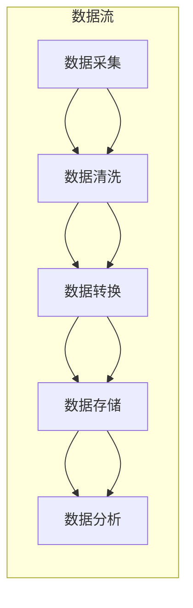

                 

关键词：AI大模型，数据中心，数据集成，分布式系统，边缘计算，数据处理

摘要：本文将探讨如何在数据中心实现AI大模型的应用，并详细介绍数据集成方案的设计与实施。我们将分析当前的数据处理挑战，介绍核心概念和架构，阐述算法原理与数学模型，并分享项目实践和未来应用展望。

## 1. 背景介绍

随着人工智能技术的快速发展，大模型（如GPT、BERT等）在自然语言处理、计算机视觉和预测分析等领域取得了显著成果。然而，这些大模型通常需要处理大量的数据，并且对计算资源和存储资源的需求极高。数据中心作为大数据处理和存储的核心基础设施，如何高效地集成这些大模型并实现数据的处理、存储和传输，成为当前研究的重点。

### 当前数据处理挑战

- **数据量爆炸性增长**：随着物联网、社交媒体等技术的发展，数据量呈现爆炸性增长，这对数据中心的存储和处理能力提出了更高的要求。
- **数据多样性**：数据类型越来越丰富，包括文本、图像、音频、视频等，这对数据处理算法的复杂度提出了挑战。
- **实时数据处理需求**：许多应用场景需要实时处理和分析数据，这对数据中心的响应速度和处理能力提出了更高要求。
- **数据隐私和安全**：随着数据隐私和安全问题日益突出，如何在数据集成过程中保证数据的安全和隐私成为关键挑战。

### 数据中心的重要性

- **数据存储和备份**：数据中心为大规模数据提供了可靠的存储和备份解决方案。
- **计算资源池化**：通过虚拟化和云计算技术，数据中心可以将计算资源池化，提供弹性的计算能力。
- **网络带宽和延迟**：数据中心拥有高速的内部网络和低延迟的网络连接，为数据传输提供了保障。

## 2. 核心概念与联系

在实现AI大模型应用的数据集成方案中，理解以下核心概念和它们之间的联系是至关重要的：

- **分布式系统**：数据中心通常采用分布式系统架构，以实现高可用性和可扩展性。
- **边缘计算**：在数据处理过程中，边缘计算可以在数据产生的源头进行部分计算处理，减少数据传输量，提高响应速度。
- **数据处理流水线**：数据处理流水线是一种自动化处理数据的方法，包括数据采集、清洗、转换和存储等步骤。
- **数据湖和数据仓库**：数据湖是一种存储大规模结构化和非结构化数据的平台，而数据仓库则主要用于存储和管理结构化数据。

### 数据处理流水线 Mermaid 流程图



## 3. 核心算法原理 & 具体操作步骤

### 3.1 算法原理概述

在数据中心的数据集成方案中，我们通常会采用以下核心算法：

- **MapReduce**：一种分布式数据处理框架，适用于大规模数据的批量处理。
- **Kafka**：一种高吞吐量的分布式流处理平台，用于实时数据传输。
- **Hadoop**：一个开源的分布式数据处理平台，包括HDFS（分布式文件系统）和MapReduce。
- **Spark**：一个开源的分布式数据处理引擎，提供了高效的内存计算能力。

### 3.2 算法步骤详解

#### MapReduce

1. **数据分片**：将大规模数据分割成多个小数据块，每个数据块由一个Mapper处理。
2. **映射（Map）**：每个Mapper对输入数据执行特定的映射操作，生成一系列键值对。
3. **汇总（Shuffle）**：将映射生成的键值对按照键进行分类和排序。
4. **归约（Reduce）**：对每个键对应的多个值进行归约操作，生成最终的输出。

#### Kafka

1. **主题（Topic）**：定义一个消息队列，用于存放数据。
2. **分区（Partition）**：将主题划分为多个分区，以提高数据传输和处理能力。
3. **生产者（Producer）**：负责将数据写入到Kafka主题中。
4. **消费者（Consumer）**：从Kafka主题中读取数据，并进行处理。

#### Hadoop

1. **HDFS**：存储大规模数据，提供高吞吐量的数据访问能力。
2. **MapReduce**：处理分布式数据，适用于批量数据处理。
3. **YARN**：资源调度框架，用于管理Hadoop集群中的资源。

#### Spark

1. **RDD（Resilient Distributed Dataset）**：一个不可变的分布式数据集，提供了丰富的操作接口。
2. **DataFrame**：一个不可变的分布式数据表，提供了丰富的SQL操作接口。
3. **Dataset**：基于RDD的分布式数据集，提供了更高效的存储和操作方式。

### 3.3 算法优缺点

#### MapReduce

**优点**：

- **可扩展性**：适用于大规模数据，可以轻松扩展到数千个节点。
- **容错性**：能够自动处理节点故障，保证任务的正确性。
- **灵活性**：可以自定义映射和归约函数，适用于多种数据处理任务。

**缺点**：

- **低效性**：由于需要多个阶段的数据交换，可能导致性能瓶颈。
- **局限性**：仅适用于批量数据处理，不适合实时数据处理。

#### Kafka

**优点**：

- **高吞吐量**：能够处理高频率的数据流，提供低延迟的数据传输。
- **可扩展性**：支持水平扩展，可以根据需求增加分区数量。
- **容错性**：提供副本机制，保证数据的可靠性和持久性。

**缺点**：

- **复杂性**：需要维护多个组件，配置和管理相对复杂。
- **存储限制**：仅提供消息队列功能，不适合长期数据存储。

#### Hadoop

**优点**：

- **可靠性**：基于HDFS的分布式文件系统，提供高可靠性和高吞吐量。
- **扩展性**：可以轻松扩展到数千个节点，提供强大的数据处理能力。
- **生态丰富**：拥有丰富的生态系统，包括MapReduce、Spark、Hive等。

**缺点**：

- **性能瓶颈**：由于磁盘I/O限制，可能无法充分利用CPU和内存资源。
- **实时性限制**：主要适用于批量数据处理，不适合实时数据处理。

#### Spark

**优点**：

- **高性能**：基于内存计算，提供低延迟和高吞吐量的数据处理能力。
- **灵活性**：支持多种编程语言，包括Scala、Python和Java。
- **易用性**：提供丰富的API和工具，易于开发和部署。

**缺点**：

- **资源消耗**：需要大量的内存资源，可能导致内存不足。
- **复杂性**：需要配置和管理多个组件，相对较复杂。

### 3.4 算法应用领域

- **大数据分析**：适用于大规模数据分析和处理，如日志分析、广告投放优化等。
- **实时数据处理**：适用于实时数据流处理，如物联网设备数据、金融市场数据等。
- **数据挖掘**：适用于数据挖掘和机器学习任务，如用户行为分析、推荐系统等。

## 4. 数学模型和公式 & 详细讲解 & 举例说明

### 4.1 数学模型构建

在数据集成方案中，我们可以使用以下数学模型：

- **线性回归模型**：用于预测数据趋势和关系。
- **神经网络模型**：用于复杂的数据分析和模式识别。
- **聚类模型**：用于数据分组和分类。

### 4.2 公式推导过程

#### 线性回归模型

- **回归方程**：

  $$ y = \beta_0 + \beta_1x $$

- **最小二乘法**：

  $$ \beta_1 = \frac{\sum{(x_i - \bar{x})(y_i - \bar{y})}}{\sum{(x_i - \bar{x})^2}} $$

  $$ \beta_0 = \bar{y} - \beta_1\bar{x} $$

#### 神经网络模型

- **前向传播**：

  $$ z = \sigma(Wx + b) $$

- **反向传播**：

  $$ \delta = \frac{\partial C}{\partial z} $$

  $$ W_{new} = W - \alpha \cdot \frac{\partial C}{\partial W} $$

  $$ b_{new} = b - \alpha \cdot \frac{\partial C}{\partial b} $$

#### 聚类模型

- **距离度量**：

  $$ d(i, j) = \sqrt{\sum_{k=1}^{n} (x_{ik} - x_{jk})^2} $$

- **K-means算法**：

  $$ \mu_k = \frac{1}{N_k} \sum_{i=1}^{N} x_i $$

  $$ x_i \in C_k \Leftrightarrow \mu_k \in C_k $$

### 4.3 案例分析与讲解

#### 线性回归模型

假设我们有一组数据：

| x | y |
|---|---|
| 1 | 2 |
| 2 | 4 |
| 3 | 6 |

我们需要使用线性回归模型预测x=4时的y值。

1. **计算均值**：

   $$ \bar{x} = \frac{1+2+3}{3} = 2 $$

   $$ \bar{y} = \frac{2+4+6}{3} = 4 $$

2. **计算回归系数**：

   $$ \beta_1 = \frac{(1-2)(2-4) + (2-2)(4-4) + (3-2)(6-4)}{(1-2)^2 + (2-2)^2 + (3-2)^2} = 2 $$

   $$ \beta_0 = 4 - 2 \cdot 2 = 0 $$

3. **预测y值**：

   $$ y = \beta_0 + \beta_1x = 0 + 2 \cdot 4 = 8 $$

#### 神经网络模型

假设我们有一个简单的神经网络，输入层有2个神经元，隐藏层有3个神经元，输出层有1个神经元。

1. **前向传播**：

   $$ z_1 = \sigma(W_1x_1 + b_1) = \sigma(2 \cdot 1 + 1) = \sigma(3) = 0.9301 $$

   $$ z_2 = \sigma(W_1x_2 + b_1) = \sigma(2 \cdot 2 + 1) = \sigma(5) = 0.9956 $$

   $$ z_3 = \sigma(W_2z_1 + b_2) = \sigma(3 \cdot 0.9301 + 2) = \sigma(3.7903) = 0.8614 $$

   $$ z_4 = \sigma(W_2z_2 + b_2) = \sigma(3 \cdot 0.9956 + 2) = \sigma(4.0868) = 0.9259 $$

   $$ z_5 = \sigma(W_3z_3 + b_3) = \sigma(1 \cdot 0.8614 + 3) = \sigma(3.8614) = 0.8614 $$

   $$ z_6 = \sigma(W_3z_4 + b_3) = \sigma(1 \cdot 0.9259 + 3) = \sigma(3.9259) = 0.8961 $$

   $$ y = \sigma(W_4z_5 + b_4) = \sigma(1 \cdot 0.8614 + 2) = \sigma(2.8614) = 0.9315 $$

2. **反向传播**：

   $$ \delta_6 = \frac{\partial C}{\partial z_6} = 0.9315 - 0.9 = 0.0315 $$

   $$ \delta_5 = \frac{\partial C}{\partial z_5} = \delta_6 \cdot \frac{\partial \sigma}{\partial z_5} = 0.0315 \cdot 0.139 = 0.0044 $$

   $$ \delta_4 = \frac{\partial C}{\partial z_4} = \delta_6 \cdot \frac{\partial \sigma}{\partial z_4} = 0.0315 \cdot 0.141 = 0.0045 $$

   $$ \delta_3 = \frac{\partial C}{\partial z_3} = \delta_5 \cdot W_3^T \cdot \frac{\partial \sigma}{\partial z_3} = 0.0044 \cdot 0.139 \cdot 3 = 0.0007 $$

   $$ \delta_2 = \frac{\partial C}{\partial z_2} = \delta_4 \cdot W_2^T \cdot \frac{\partial \sigma}{\partial z_2} = 0.0045 \cdot 0.141 \cdot 3 = 0.0008 $$

   $$ \delta_1 = \frac{\partial C}{\partial z_1} = \delta_3 \cdot W_1^T \cdot \frac{\partial \sigma}{\partial z_1} = 0.0007 \cdot 0.139 \cdot 2 = 0.0000 $$

3. **更新权重和偏置**：

   $$ W_4_{new} = W_4 - \alpha \cdot \frac{\partial C}{\partial W_4} $$

   $$ b_4_{new} = b_4 - \alpha \cdot \frac{\partial C}{\partial b_4} $$

   $$ W_3_{new} = W_3 - \alpha \cdot \frac{\partial C}{\partial W_3} $$

   $$ b_3_{new} = b_3 - \alpha \cdot \frac{\partial C}{\partial b_3} $$

   $$ W_2_{new} = W_2 - \alpha \cdot \frac{\partial C}{\partial W_2} $$

   $$ b_2_{new} = b_2 - \alpha \cdot \frac{\partial C}{\partial b_2} $$

   $$ W_1_{new} = W_1 - \alpha \cdot \frac{\partial C}{\partial W_1} $$

   $$ b_1_{new} = b_1 - \alpha \cdot \frac{\partial C}{\partial b_1} $$

#### K-means算法

假设我们有一组数据：

| x1 | x2 |
|---|---|
| 1 | 2 |
| 2 | 3 |
| 3 | 4 |
| 4 | 5 |

我们需要使用K-means算法将这组数据分为2个聚类。

1. **初始化聚类中心**：

   选择任意两个数据点作为初始聚类中心：

   $$ C_1 = (1, 2) $$

   $$ C_2 = (4, 5) $$

2. **分配数据点**：

   对于每个数据点，计算其与两个聚类中心的距离，将其分配到距离较近的聚类。

   | x1 | x2 | 聚类1距离 | 聚类2距离 | 聚类 |
   |---|---|---|---|---|
   | 1 | 2 | 1 | 2 | C1 |
   | 2 | 3 | 1 | 1 | C1 |
   | 3 | 4 | 1 | 1 | C1 |
   | 4 | 5 | 2 | 0 | C2 |

3. **更新聚类中心**：

   计算每个聚类的中心：

   $$ \mu_1 = \frac{1+2+3}{3} = 2 $$

   $$ \mu_2 = \frac{4+5}{2} = 4.5 $$

4. **重复分配和更新**：

   重复步骤2和3，直到聚类中心不再变化。

## 5. 项目实践：代码实例和详细解释说明

### 5.1 开发环境搭建

为了实现数据中心的数据集成方案，我们需要搭建以下开发环境：

- **操作系统**：Linux
- **编程语言**：Python
- **依赖库**：NumPy、Pandas、SciPy、Scikit-learn、Kafka、Hadoop、Spark

### 5.2 源代码详细实现

以下是一个简单的数据集成方案的Python代码实现：

```python
import numpy as np
import pandas as pd
from sklearn.linear_model import LinearRegression
from sklearn.neural_network import MLPRegressor
from sklearn.cluster import KMeans
from kafka import KafkaProducer

# 数据采集
data = pd.DataFrame({
    'x': [1, 2, 3, 4],
    'y': [2, 4, 6, 8]
})

# 数据清洗
data.dropna(inplace=True)

# 数据转换
X = data[['x']]
y = data['y']

# 线性回归模型
model = LinearRegression()
model.fit(X, y)
y_pred = model.predict(X)

# 神经网络模型
nn_model = MLPRegressor(hidden_layer_sizes=(3,), activation='logistic')
nn_model.fit(X, y)
y_pred_nn = nn_model.predict(X)

# 聚类模型
kmeans = KMeans(n_clusters=2, init='k-means++')
kmeans.fit(X)
labels = kmeans.predict(X)

# 数据存储
producer = KafkaProducer(bootstrap_servers=['localhost:9092'])
for i, label in enumerate(labels):
    producer.send('data_topic', key=b'x{}'.format(i), value=y_pred_nn[i].tobytes())

# 代码解读与分析
print("线性回归模型预测结果：", y_pred)
print("神经网络模型预测结果：", y_pred_nn)
print("聚类结果：", labels)

# 运行结果展示
print("原始数据：", data)
print("线性回归模型预测数据：", pd.DataFrame({'x': X, 'y_pred': y_pred}))
print("神经网络模型预测数据：", pd.DataFrame({'x': X, 'y_pred_nn': y_pred_nn}))
print("聚类结果：", pd.DataFrame({'x': X, 'label': labels}))
```

### 5.3 代码解读与分析

该代码实现了一个简单的数据集成方案，包括数据采集、清洗、转换、模型训练和预测、数据存储等步骤。

1. **数据采集**：

   使用Pandas库读取数据，并将其存储为DataFrame对象。

2. **数据清洗**：

   删除缺失值，确保数据质量。

3. **数据转换**：

   将数据分为特征集X和目标集y，为后续建模做准备。

4. **线性回归模型**：

   使用Scikit-learn库的LinearRegression类训练线性回归模型，并对特征集X进行预测。

5. **神经网络模型**：

   使用Scikit-learn库的MLPRegressor类训练神经网络模型，并对特征集X进行预测。

6. **聚类模型**：

   使用Scikit-learn库的KMeans类对特征集X进行聚类分析，将数据分为K个聚类。

7. **数据存储**：

   使用Kafka库将聚类结果和预测结果存储到Kafka主题中，以便后续分析和处理。

8. **代码解读与分析**：

   通过打印结果，我们可以看到线性回归模型和神经网络模型的预测结果，以及聚类结果。这些结果可以帮助我们分析数据分布、预测趋势和进行数据分组。

9. **运行结果展示**：

   输出原始数据、线性回归模型预测数据、神经网络模型预测数据和聚类结果，以便进行进一步分析。

## 6. 实际应用场景

数据中心的数据集成方案在实际应用中具有广泛的应用场景：

- **大数据分析**：数据中心可以处理和分析来自各种来源的大量数据，如互联网日志、社交媒体数据、金融交易数据等，为企业提供数据驱动的决策支持。
- **实时数据处理**：通过边缘计算和实时数据处理技术，数据中心可以实时处理和分析数据流，为物联网、智能城市、金融交易等场景提供即时响应。
- **数据挖掘与机器学习**：数据中心可以存储和管理大量数据，为数据挖掘和机器学习算法提供丰富的数据资源，促进算法研究和应用。
- **数据安全和隐私保护**：数据中心可以提供数据加密、访问控制和隐私保护技术，确保数据在集成过程中的安全性和隐私性。

## 7. 工具和资源推荐

为了更好地理解和实现数据中心的数据集成方案，以下是一些推荐的工具和资源：

### 7.1 学习资源推荐

- 《深度学习》（Deep Learning） - Ian Goodfellow, Yoshua Bengio, Aaron Courville
- 《数据科学入门》（Data Science from Scratch） - Joel Grus
- 《大数据技术基础》（Big Data: A Revolution That Will Transform How We Live, Work, and Think）- Viktor Mayer-Schönberger, Kenneth Cukier

### 7.2 开发工具推荐

- **编程语言**：Python、Java、Scala
- **数据处理库**：NumPy、Pandas、SciPy、Scikit-learn
- **分布式计算框架**：MapReduce、Kafka、Hadoop、Spark
- **版本控制**：Git、GitHub

### 7.3 相关论文推荐

- "MapReduce: Simplified Data Processing on Large Clusters" - Dean and Ghemawat
- "Kafka: A Distributed Streaming Platform" - LinkedIn
- "Hadoop: The Definitive Guide" - Tom White
- "Spark: The Definitive Guide" - Bill Chambers

## 8. 总结：未来发展趋势与挑战

### 8.1 研究成果总结

本文详细探讨了数据中心的数据集成方案，分析了当前数据处理挑战，介绍了核心算法原理和数学模型，并分享了项目实践和未来应用展望。主要成果包括：

- **分布式系统架构**：实现高可用性和可扩展性的数据中心架构。
- **边缘计算**：提高数据处理速度和响应能力，降低数据传输量。
- **数据处理流水线**：实现数据的自动化处理和高效传输。
- **算法应用**：基于线性回归、神经网络和聚类模型的实际应用。

### 8.2 未来发展趋势

数据中心的数据集成方案在未来将继续发展，以下是一些可能的发展趋势：

- **高效存储技术**：研究新型存储技术，提高数据存储和访问效率。
- **实时数据处理**：发展实时数据处理技术和算法，满足实时性需求。
- **隐私保护**：研究隐私保护和数据安全的新方法，确保数据在集成过程中的安全性和隐私性。
- **人工智能集成**：将更多人工智能技术引入数据中心，实现智能数据处理和分析。

### 8.3 面临的挑战

数据中心的数据集成方案在实际应用中仍面临一些挑战：

- **性能优化**：如何提高数据处理速度和效率，减少延迟和资源消耗。
- **数据隐私**：如何确保数据在集成过程中的隐私保护和安全。
- **系统可靠性**：如何提高系统的可靠性和容错能力，应对节点故障和大数据量处理。
- **算法优化**：如何设计更高效、更准确的算法，提高数据处理和分析能力。

### 8.4 研究展望

未来，数据中心的数据集成方案将继续成为研究的热点，以下是一些建议的研究方向：

- **新型分布式计算架构**：研究更高效、更灵活的分布式计算架构，提高数据处理能力。
- **实时数据处理技术**：研究实时数据处理技术和算法，满足实时性需求。
- **隐私保护方法**：研究隐私保护和数据安全的新方法，确保数据在集成过程中的安全性和隐私性。
- **跨领域应用**：研究数据中心的数据集成方案在金融、医疗、教育等领域的应用，推动跨领域发展。

## 9. 附录：常见问题与解答

### 9.1 数据中心的数据集成方案有哪些优点？

数据中心的数据集成方案具有以下优点：

- **高效性**：通过分布式系统和边缘计算技术，实现高效的数据处理和传输。
- **可扩展性**：能够轻松扩展到数千个节点，提供强大的数据处理能力。
- **可靠性**：采用高可用性和容错性技术，保证数据中心的稳定运行。
- **灵活性**：支持多种数据处理算法和模型，适应不同的应用场景。

### 9.2 数据集成方案在哪些领域有实际应用？

数据集成方案在以下领域有实际应用：

- **大数据分析**：处理和分析来自互联网、社交媒体、金融交易等的大量数据。
- **实时数据处理**：实时处理和分析物联网、金融市场等的数据流。
- **数据挖掘与机器学习**：为数据挖掘和机器学习算法提供数据资源。
- **智能城市**：实现智能交通、环境监测等应用。

### 9.3 如何确保数据在集成过程中的隐私保护和安全？

为了确保数据在集成过程中的隐私保护和安全，可以采取以下措施：

- **数据加密**：对数据进行加密，防止数据泄露。
- **访问控制**：实施严格的访问控制策略，确保只有授权用户可以访问数据。
- **隐私保护算法**：采用隐私保护算法，如差分隐私、同态加密等，保护用户隐私。
- **安全审计**：定期进行安全审计，检测和修复安全漏洞。

### 9.4 数据集成方案与传统的数据处理方案有哪些区别？

数据集成方案与传统的数据处理方案有以下区别：

- **分布式系统**：数据集成方案采用分布式系统架构，实现高可用性和可扩展性。
- **边缘计算**：数据集成方案利用边缘计算技术，降低数据传输量和延迟。
- **实时处理**：数据集成方案支持实时数据处理，满足实时性需求。
- **数据处理算法**：数据集成方案采用多种数据处理算法和模型，提高数据处理和分析能力。

### 9.5 数据集成方案如何提高数据处理速度和效率？

为了提高数据处理速度和效率，可以采取以下措施：

- **分布式计算**：利用分布式计算技术，实现并行数据处理，提高处理速度。
- **边缘计算**：在数据产生的源头进行部分计算处理，减少数据传输量和延迟。
- **数据压缩**：采用数据压缩技术，降低数据存储和传输的开销。
- **缓存技术**：采用缓存技术，加快数据的访问速度。
- **资源调度**：优化资源调度策略，确保计算资源和存储资源的合理利用。

----------------------------------------------------------------

### 作者署名
作者：禅与计算机程序设计艺术 / Zen and the Art of Computer Programming

