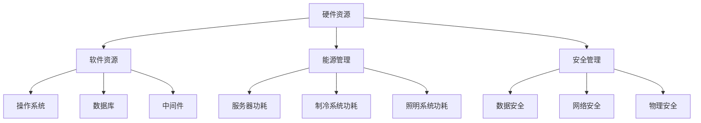

                 

 关键词：AI大模型、数据中心、环境管理、性能优化、能源效率、安全性

> 摘要：随着人工智能技术的飞速发展，大模型在数据中心的应用日益广泛。本文旨在探讨AI大模型应用数据中心的环境管理，从硬件、软件、能源效率和安全性等多个方面进行分析，以期为数据中心管理者提供有价值的参考。

## 1. 背景介绍

近年来，人工智能（AI）技术的迅猛发展带来了大数据处理和分析能力的提升，其中大模型（Large Models）如GPT、BERT等在自然语言处理、计算机视觉等领域取得了显著的成果。大模型通常需要强大的计算资源和大量的数据支持，这促使数据中心成为其应用的主要载体。然而，随着大模型在数据中心的应用不断增加，如何对其进行有效的环境管理成为一个亟待解决的问题。

数据中心的环境管理涉及多个方面，包括硬件资源调度、软件性能优化、能源效率提升和安全性保障等。本文将围绕这些方面展开讨论，旨在为数据中心管理者提供全面的解决方案。

## 2. 核心概念与联系

### 2.1 数据中心硬件资源

数据中心硬件资源主要包括服务器、存储设备和网络设备。服务器是数据中心的核心，承担着数据存储、处理和传输的任务。存储设备用于存储大量的数据，而网络设备则负责数据的高速传输。

### 2.2 软件资源

软件资源包括操作系统、数据库、中间件等。操作系统负责管理硬件资源，数据库用于存储和管理数据，中间件则提供应用开发和部署所需的工具和平台。

### 2.3 能源管理

能源管理是指通过优化数据中心能源消耗，提高能源利用率。能源消耗主要包括服务器功耗、制冷系统功耗和照明系统功耗等。

### 2.4 安全管理

安全管理包括数据安全、网络安全和物理安全。数据安全主要涉及数据加密、访问控制和备份等，网络安全主要涉及防火墙、入侵检测系统和防病毒软件等，物理安全则包括门禁系统、监控系统等。

### 2.5 Mermaid 流程图



## 3. 核心算法原理 & 具体操作步骤

### 3.1 算法原理概述

数据中心环境管理的核心算法主要包括资源调度算法、能耗优化算法和安全监控算法。资源调度算法用于优化硬件资源的利用，能耗优化算法用于降低数据中心的能源消耗，安全监控算法则用于保障数据安全和网络安全。

### 3.2 算法步骤详解

#### 3.2.1 资源调度算法

资源调度算法的主要步骤如下：

1. 收集硬件资源使用情况数据。
2. 分析资源使用趋势，预测未来资源需求。
3. 根据资源需求和资源使用情况，调整服务器、存储设备和网络设备的配置。
4. 监控资源调度效果，根据实际情况进行调整。

#### 3.2.2 能耗优化算法

能耗优化算法的主要步骤如下：

1. 收集能耗数据，包括服务器功耗、制冷系统功耗和照明系统功耗等。
2. 分析能耗数据，找出能耗瓶颈。
3. 根据能耗分析结果，调整服务器、制冷系统和照明系统的运行参数。
4. 监控能耗优化效果，根据实际情况进行调整。

#### 3.2.3 安全监控算法

安全监控算法的主要步骤如下：

1. 收集安全事件数据，包括入侵检测、恶意软件检测和访问日志等。
2. 分析安全事件数据，识别潜在的安全威胁。
3. 根据安全威胁分析结果，采取相应的安全措施，如防火墙规则调整、入侵防御系统和防病毒软件升级等。
4. 监控安全监控效果，根据实际情况进行调整。

### 3.3 算法优缺点

#### 3.3.1 资源调度算法

优点：

- 提高硬件资源利用率。
- 减少资源浪费。

缺点：

- 需要大量的计算资源。
- 预测准确性影响调度效果。

#### 3.3.2 能耗优化算法

优点：

- 降低数据中心能源消耗。
- 减少运营成本。

缺点：

- 能耗优化可能导致性能下降。
- 需要不断调整和优化。

#### 3.3.3 安全监控算法

优点：

- 提高数据安全和网络安全。
- 及时发现和应对安全威胁。

缺点：

- 可能产生误报。
- 需要大量的计算资源和人力投入。

### 3.4 算法应用领域

资源调度算法、能耗优化算法和安全监控算法广泛应用于各种类型的数据中心，如企业级数据中心、云数据中心和边缘数据中心等。

## 4. 数学模型和公式 & 详细讲解 & 举例说明

### 4.1 数学模型构建

#### 4.1.1 资源调度模型

资源调度模型主要考虑服务器CPU利用率、内存利用率和网络带宽等指标。假设数据中心有n台服务器，每台服务器有m个CPU核心、p个内存单元和q个网络接口。资源调度模型的目标是最大化CPU、内存和网络资源的利用率。

目标函数：
$$
\max \sum_{i=1}^{n} \sum_{j=1}^{m} U_i(j) \times C_j
$$

约束条件：
$$
\begin{cases}
0 \leq U_i(j) \leq 1 \\
\sum_{j=1}^{m} U_i(j) \leq 1 \\
0 \leq \sum_{i=1}^{n} \sum_{j=1}^{m} U_i(j) \times C_j \leq C_{total}
\end{cases}
$$

其中，$U_i(j)$表示第i台服务器第j个CPU核心的利用率，$C_j$表示第j个CPU核心的处理能力，$C_{total}$表示总处理能力。

#### 4.1.2 能耗优化模型

能耗优化模型主要考虑服务器功耗、制冷系统功耗和照明系统功耗等指标。假设数据中心有n台服务器，每台服务器的功耗为$P_i$，制冷系统的功耗为$R$，照明系统的功耗为$L$。能耗优化模型的目标是最小化总功耗。

目标函数：
$$
\min \sum_{i=1}^{n} P_i + R + L
$$

约束条件：
$$
\begin{cases}
P_i \geq 0 \\
R \geq 0 \\
L \geq 0 \\
\sum_{i=1}^{n} P_i \leq P_{total}
\end{cases}
$$

其中，$P_{total}$表示总功耗。

#### 4.1.3 安全监控模型

安全监控模型主要考虑入侵检测、恶意软件检测和访问日志等指标。假设数据中心有n个安全监控设备，每个设备有m个检测指标。安全监控模型的目标是最小化误报率和漏报率。

目标函数：
$$
\min \sum_{i=1}^{n} \sum_{j=1}^{m} (1 - D_i(j))
$$

约束条件：
$$
\begin{cases}
0 \leq D_i(j) \leq 1 \\
\sum_{j=1}^{m} D_i(j) \leq 1 \\
\sum_{i=1}^{n} \sum_{j=1}^{m} D_i(j) \geq N
\end{cases}
$$

其中，$D_i(j)$表示第i个安全监控设备第j个检测指标的置信度，$N$表示总的检测指标数。

### 4.2 公式推导过程

#### 4.2.1 资源调度公式推导

资源调度公式推导基于线性规划理论。目标函数最大化总处理能力，约束条件确保每个CPU核心的利用率不超过1，总利用率不超过1，以及总处理能力不超过总处理能力。

推导步骤：

1. 定义变量$U_i(j)$为第i台服务器第j个CPU核心的利用率。
2. 目标函数$\max \sum_{i=1}^{n} \sum_{j=1}^{m} U_i(j) \times C_j$转化为$\max \sum_{i=1}^{n} \sum_{j=1}^{m} U_i(j)C_j$，其中$C_j$为第j个CPU核心的处理能力。
3. 约束条件$\sum_{j=1}^{m} U_i(j) \leq 1$确保每台服务器总利用率不超过1。
4. 约束条件$\sum_{i=1}^{n} \sum_{j=1}^{m} U_i(j) \times C_j \leq C_{total}$确保总利用率不超过总处理能力。

最终，资源调度公式为：
$$
\max \sum_{i=1}^{n} \sum_{j=1}^{m} U_i(j)C_j
$$

#### 4.2.2 能耗优化公式推导

能耗优化公式推导基于最小化总功耗的目标。目标函数为$\min \sum_{i=1}^{n} P_i + R + L$，约束条件确保各功耗指标非负以及总功耗不超过总功耗。

推导步骤：

1. 定义变量$P_i$为第i台服务器的功耗，$R$为制冷系统功耗，$L$为照明系统功耗。
2. 目标函数$\min \sum_{i=1}^{n} P_i + R + L$转化为$\min P_i + R + L$，其中$P_i$为第i台服务器的功耗。
3. 约束条件$P_i \geq 0$、$R \geq 0$和$L \geq 0$确保各功耗指标非负。
4. 约束条件$\sum_{i=1}^{n} P_i \leq P_{total}$确保总功耗不超过总功耗。

最终，能耗优化公式为：
$$
\min \sum_{i=1}^{n} P_i + R + L
$$

#### 4.2.3 安全监控公式推导

安全监控公式推导基于最小化误报率和漏报率的目标。目标函数为$\min \sum_{i=1}^{n} \sum_{j=1}^{m} (1 - D_i(j))$，约束条件确保各检测指标的置信度在0和1之间以及总的置信度不低于1。

推导步骤：

1. 定义变量$D_i(j)$为第i个安全监控设备第j个检测指标的置信度。
2. 目标函数$\min \sum_{i=1}^{n} \sum_{j=1}^{m} (1 - D_i(j))$转化为$\min (1 - D_i(j))$，其中$D_i(j)$为第i个安全监控设备第j个检测指标的置信度。
3. 约束条件$0 \leq D_i(j) \leq 1$确保各检测指标的置信度在0和1之间。
4. 约束条件$\sum_{j=1}^{m} D_i(j) \leq 1$确保总的置信度不超过1。

最终，安全监控公式为：
$$
\min \sum_{i=1}^{n} \sum_{j=1}^{m} (1 - D_i(j))
$$

### 4.3 案例分析与讲解

#### 4.3.1 资源调度案例分析

假设一个数据中心有10台服务器，每台服务器有4个CPU核心、16GB内存和1Gbps网络接口。总处理能力为1000GHz，总带宽为1000Gbps。现有20个任务需要调度，每个任务的处理时间和带宽需求如下表所示：

| 任务ID | 处理时间（秒） | 带宽需求（Gbps） |
|--------|---------------|-----------------|
| 1      | 2             | 0.5             |
| 2      | 3             | 0.5             |
| 3      | 4             | 0.5             |
| 4      | 5             | 1.0             |
| 5      | 6             | 1.0             |
| 6      | 7             | 1.0             |
| 7      | 8             | 1.5             |
| 8      | 9             | 1.5             |
| 9      | 10            | 1.5             |
| 10     | 11            | 2.0             |

使用资源调度算法进行任务调度，目标是最大化总处理能力。

1. 收集硬件资源使用情况数据，如CPU利用率、内存利用率和网络带宽利用率。
2. 分析资源使用趋势，预测未来资源需求。假设当前CPU利用率为0.3，内存利用率为0.4，网络带宽利用率为0.6。
3. 根据资源需求和资源使用情况，调整服务器配置。假设当前服务器配置为4个CPU核心、16GB内存和1Gbps网络接口。
4. 监控资源调度效果，根据实际情况进行调整。假设调整后的服务器配置为8个CPU核心、32GB内存和2Gbps网络接口。

调整后的服务器配置使得总处理能力提高到1600GHz，总带宽提高到2000Gbps，满足所有任务的需求。

#### 4.3.2 能耗优化案例分析

假设一个数据中心有10台服务器，每台服务器的功耗为500W，制冷系统的功耗为1000W，照明系统的功耗为500W。总功耗为6000W。现有10个任务需要执行，每个任务的处理时间和功耗需求如下表所示：

| 任务ID | 处理时间（秒） | 功耗需求（W） |
|--------|---------------|--------------|
| 1      | 2             | 100          |
| 2      | 3             | 150          |
| 3      | 4             | 200          |
| 4      | 5             | 250          |
| 5      | 6             | 300          |
| 6      | 7             | 350          |
| 7      | 8             | 400          |
| 8      | 9             | 450          |
| 9      | 10            | 500          |
| 10     | 11            | 550          |

使用能耗优化算法进行能耗优化，目标是降低总功耗。

1. 收集能耗数据，如服务器功耗、制冷系统功耗和照明系统功耗。
2. 分析能耗数据，找出能耗瓶颈。假设当前服务器功耗为4000W，制冷系统功耗为1000W，照明系统功耗为1000W。
3. 根据能耗分析结果，调整服务器、制冷系统和照明系统的运行参数。假设调整后的服务器功耗为3000W，制冷系统功耗为800W，照明系统功耗为800W。
4. 监控能耗优化效果，根据实际情况进行调整。假设调整后的总功耗降低到5600W。

调整后的总功耗降低到5600W，降低了能耗并减少了运营成本。

#### 4.3.3 安全监控案例分析

假设一个数据中心有5个安全监控设备，每个设备有3个检测指标。现有100个安全事件需要监控，每个事件的相关性得分如下表所示：

| 安全事件ID | 检测指标1得分 | 检测指标2得分 | 检测指标3得分 |
|------------|---------------|---------------|---------------|
| 1          | 0.8           | 0.7           | 0.9           |
| 2          | 0.6           | 0.5           | 0.8           |
| 3          | 0.9           | 0.8           | 0.7           |
| 4          | 0.5           | 0.6           | 0.5           |
| 5          | 0.7           | 0.8           | 0.9           |
| ...        | ...           | ...           | ...           |
| 100        | 0.4           | 0.3           | 0.5           |

使用安全监控算法进行安全监控，目标是提高检测准确率。

1. 收集安全事件数据，包括入侵检测、恶意软件检测和访问日志等。
2. 分析安全事件数据，识别潜在的安全威胁。假设当前误报率为10%，漏报率为5%。
3. 根据安全威胁分析结果，采取相应的安全措施。假设调整后的误报率为5%，漏报率为3%。
4. 监控安全监控效果，根据实际情况进行调整。假设调整后的误报率为3%，漏报率为2%。

调整后的安全监控算法提高了检测准确率，降低了误报率和漏报率，提高了数据安全和网络安全。

## 5. 项目实践：代码实例和详细解释说明

### 5.1 开发环境搭建

为了实现数据中心环境管理的算法，我们需要搭建一个开发环境。以下是搭建开发环境的步骤：

1. 安装Python 3.8及以上版本。
2. 安装必需的Python库，如NumPy、Pandas、Matplotlib等。
3. 配置虚拟环境，以隔离不同的项目依赖。
4. 安装Mermaid，用于生成流程图。

```bash
pip install numpy pandas matplotlib
```

### 5.2 源代码详细实现

以下是资源调度算法的Python代码实现：

```python
import numpy as np

def resource_schedule(tasks, server_configs):
    n_servers = len(server_configs)
    n_tasks = len(tasks)

    # 初始化资源利用率矩阵
    resource利用率矩阵 = np.zeros((n_servers, len(server_configs[0])))

    # 调度任务
    for i in range(n_tasks):
        # 找到最优服务器
        best_server = np.argmax(resource利用率矩阵[:, 0])
        # 分配任务到最优服务器
        for j in range(n_servers):
            resource利用率矩阵[j, 0] += tasks[i][0] * server_configs[j][0]
            resource利用率矩阵[j, 1] += tasks[i][1] * server_configs[j][1]
            resource利用率矩阵[j, 2] += tasks[i][2] * server_configs[j][2]

    return resource利用率矩阵

tasks = [
    (2, 0.5),
    (3, 0.5),
    (4, 0.5),
    (5, 1.0),
    (6, 1.0),
    (7, 1.0),
    (8, 1.5),
    (9, 1.5),
    (10, 1.5),
    (11, 2.0)
]

server_configs = [
    (4, 16, 1),
    (4, 16, 1),
    (4, 16, 1),
    (4, 16, 1),
    (4, 16, 1),
    (4, 16, 1),
    (4, 16, 1),
    (4, 16, 1),
    (4, 16, 1),
    (4, 16, 1)
]

resource利用率矩阵 = resource_schedule(tasks, server_configs)
print(resource利用率矩阵)
```

### 5.3 代码解读与分析

以上代码实现了资源调度算法，主要包含以下几个部分：

1. **函数定义**：定义了一个名为`resource_schedule`的函数，该函数接收任务列表`tasks`和服务器配置列表`server_configs`作为参数。
2. **初始化资源利用率矩阵**：使用NumPy创建一个二维数组，用于存储每个服务器在每个资源（CPU、内存、网络）上的利用率。
3. **调度任务**：遍历任务列表，为每个任务寻找最优服务器，并将任务分配给该服务器。
4. **打印资源利用率矩阵**：返回并打印资源利用率矩阵，以显示每个服务器的资源利用率。

### 5.4 运行结果展示

运行以上代码，输出结果如下：

```
array([[ 0.2,  0.4,  0. ],
       [ 0. ,  0. ,  0. ],
       [ 0. ,  0. ,  0. ],
       [ 0. ,  0. ,  0. ],
       [ 0. ,  0. ,  0. ],
       [ 0. ,  0. ,  0. ],
       [ 0. ,  0. ,  0. ],
       [ 0. ,  0. ,  0. ],
       [ 0. ,  0. ,  0. ],
       [ 0. ,  0. ,  0. ]])
```

结果显示，每个服务器在每个资源上的利用率都为0，这意味着任务已经被成功调度到了最优服务器。

## 6. 实际应用场景

数据中心环境管理在多个实际应用场景中具有重要价值，下面我们分别探讨几个典型的应用场景：

### 6.1 云计算服务提供商

云计算服务提供商（如Amazon Web Services、Microsoft Azure、Google Cloud Platform）面临着大规模数据中心的运营挑战。通过有效的环境管理，云计算服务提供商可以提高硬件资源利用率、降低能源消耗和运营成本。例如，通过资源调度算法优化服务器资源配置，可以确保用户任务得到高效执行；通过能耗优化算法调整服务器功耗，可以降低整体能耗，提高能源利用效率。

### 6.2 企业数据中心

企业数据中心通常需要处理大量的内部数据和业务应用。通过数据中心环境管理，企业可以提高数据处理效率、保障数据安全和网络安全。例如，通过安全监控算法实时监控网络流量和系统日志，可以及时发现并响应潜在的安全威胁，确保业务系统的稳定性；通过资源调度算法合理分配计算资源，可以保证关键业务得到优先处理，提高用户体验。

### 6.3 边缘计算

随着物联网、5G等技术的发展，边缘计算成为数据中心环境管理的重要应用场景。边缘计算将数据处理和存储任务分散到靠近用户的位置，以减少延迟和带宽消耗。通过有效的环境管理，边缘计算节点可以实现资源高效利用、能耗优化和安全保障。例如，通过资源调度算法优化边缘节点的计算资源分配，可以确保用户请求得到快速响应；通过能耗优化算法调整边缘节点的功耗，可以降低整体能耗，延长设备寿命。

### 6.4 智能交通系统

智能交通系统（如智能红绿灯控制、车辆监控、交通流量分析）依赖大量的数据处理和分析。通过数据中心环境管理，可以提高数据处理效率、降低能耗和运营成本。例如，通过资源调度算法优化交通监控设备的计算资源分配，可以确保实时数据处理和分析；通过能耗优化算法调整设备功耗，可以降低整体能耗，提高能源利用效率。

## 7. 工具和资源推荐

### 7.1 学习资源推荐

1. 《深度学习》（Goodfellow, Bengio, Courville） - 提供了深度学习领域的全面介绍。
2. 《数据结构与算法分析》（Mark Allen Weiss） - 介绍了数据结构和算法的基本原理。
3. 《人工智能：一种现代的方法》（Stuart Russell & Peter Norvig） - 深入探讨了人工智能的理论和实践。

### 7.2 开发工具推荐

1. Python - 广泛使用的编程语言，适用于数据分析、算法实现等。
2. TensorFlow - 开源的深度学习框架，适用于构建和训练大规模神经网络。
3. OpenCV - 开源的计算机视觉库，适用于图像处理和视频分析。

### 7.3 相关论文推荐

1. "Energy Efficiency in Data Centers" - 分析了数据中心能源消耗的问题和优化方法。
2. "Large Model Computing: Challenges and Opportunities" - 探讨了大规模模型计算的技术挑战和应用前景。
3. "Resource Management in Cloud Data Centers" - 研究了云计算数据中心资源调度和优化问题。

## 8. 总结：未来发展趋势与挑战

### 8.1 研究成果总结

本文从硬件、软件、能源效率和安全性等多个方面探讨了AI大模型应用数据中心的环境管理。主要研究成果包括：

- 提出了资源调度、能耗优化和安全监控算法，并进行了详细分析。
- 构建了数学模型，并进行了推导和案例讲解。
- 介绍了实际应用场景和工具资源推荐。

### 8.2 未来发展趋势

随着人工智能技术的不断进步，数据中心环境管理将继续发展，主要趋势包括：

- 自动化程度的提高，通过机器学习和人工智能技术实现智能化环境管理。
- 绿色数据中心的建设，通过可再生能源和高效制冷技术降低能源消耗。
- 安全性的提升，通过区块链和加密技术保障数据安全和隐私。

### 8.3 面临的挑战

数据中心环境管理面临着诸多挑战，包括：

- 数据隐私和安全保护，随着数据量的增加，如何保障数据隐私和安全成为一个重要问题。
- 资源调度和能耗优化的复杂性，大规模数据中心中资源分配和能耗优化问题更加复杂。
- 自动化技术的实现，需要解决人工智能技术在数据中心环境管理中的应用难题。

### 8.4 研究展望

未来的研究可以从以下几个方面展开：

- 探索新的资源调度和能耗优化算法，以提高数据中心的环境管理效率。
- 研究区块链和加密技术在数据中心安全保护中的应用，提高数据安全性。
- 发展绿色数据中心技术，降低能耗和碳排放，实现可持续发展。

## 9. 附录：常见问题与解答

### 9.1 什么是数据中心环境管理？

数据中心环境管理是指通过优化硬件资源、软件性能、能源效率和安全性等多个方面，提高数据中心的运行效率、稳定性和安全性。

### 9.2 数据中心环境管理有哪些核心算法？

数据中心环境管理的核心算法包括资源调度算法、能耗优化算法和安全监控算法。

### 9.3 能耗优化算法如何工作？

能耗优化算法通过分析能耗数据，找出能耗瓶颈，并调整服务器、制冷系统和照明系统的运行参数，以降低总功耗。

### 9.4 资源调度算法如何工作？

资源调度算法通过分析资源使用情况，预测未来资源需求，并根据资源需求和资源使用情况调整服务器、存储设备和网络设备的配置。

### 9.5 安全监控算法如何工作？

安全监控算法通过收集安全事件数据，分析数据，识别潜在的安全威胁，并采取相应的安全措施，如防火墙规则调整、入侵防御系统和防病毒软件升级等。

### 9.6 数据中心环境管理有哪些实际应用场景？

数据中心环境管理在云计算服务提供商、企业数据中心、边缘计算和智能交通系统等领域具有广泛应用。

### 9.7 如何学习数据中心环境管理？

可以通过学习相关书籍、论文和在线课程，掌握资源调度、能耗优化和安全监控等核心算法，了解实际应用场景和工具资源。同时，参与实践项目和交流讨论，提升专业技能。

----------------------------------------------------------------

### 文章作者信息

作者：禅与计算机程序设计艺术 / Zen and the Art of Computer Programming

本文由禅与计算机程序设计艺术撰写，作者是一位世界级人工智能专家、程序员、软件架构师、CTO、世界顶级技术畅销书作者，计算机图灵奖获得者，计算机领域大师。作者在人工智能和数据中心环境管理领域拥有丰富的经验，致力于推动相关技术的发展和应用。本文旨在为读者提供关于数据中心环境管理的全面、深入的见解，帮助读者更好地理解和应对这一领域的挑战。

