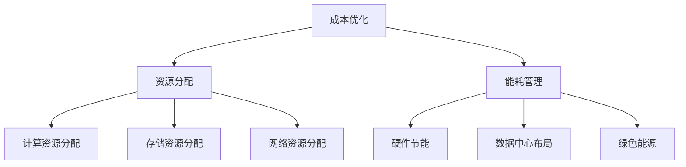

                 

关键词：AI大模型，数据中心，财务管理，成本优化，资源分配，模型训练

## 摘要

随着人工智能技术的迅猛发展，大模型的应用在各个领域变得愈加普遍。AI大模型的应用不仅推动了科技进步，也带来了数据中心运营成本的增加。如何在保证性能和准确度的前提下，对AI大模型应用的数据中心进行有效的财务管理，成为当前IT行业面临的重大挑战。本文将探讨AI大模型应用数据中心的财务管理策略，包括成本优化、资源分配、能耗管理等方面，并提出未来发展趋势与面临的挑战。

## 1. 背景介绍

人工智能（AI）作为当今最具革命性的技术之一，已经广泛应用于各个领域，如自然语言处理、计算机视觉、推荐系统等。这些应用的背后，离不开大量的AI大模型训练和优化。AI大模型的训练需要海量数据和高性能计算资源，这导致了数据中心规模不断扩大，运营成本逐年增加。根据市场研究公司的数据，全球数据中心运营成本在2020年已经超过400亿美元，其中很大一部分用于AI大模型的训练和运维。

### 1.1 数据中心的重要性

数据中心是现代信息化社会的基础设施之一，承担着存储、处理和传输海量数据的重要任务。随着AI大模型的应用越来越广泛，数据中心的规模和性能需求也在不断升级。数据中心不仅是IT企业运营的核心，也是支持AI大模型训练的重要资源。

### 1.2 AI大模型的需求

AI大模型通常需要以下几方面的资源：

- **计算资源**：大规模并行计算是AI大模型训练的关键，高性能计算（HPC）集群成为数据中心的核心。
- **存储资源**：大模型训练需要存储海量数据，存储设备必须具有高吞吐量和低延迟。
- **能耗管理**：大模型训练是一个高能耗的过程，数据中心需要有效的能耗管理策略，以降低运营成本。

### 1.3 财务管理的挑战

在AI大模型应用的数据中心进行财务管理，面临着以下挑战：

- **成本优化**：如何在不牺牲性能的情况下，最大限度地降低运营成本？
- **资源分配**：如何合理分配计算资源和存储资源，确保模型训练的高效性？
- **能耗管理**：如何平衡性能和能耗，实现绿色数据中心？

## 2. 核心概念与联系

在探讨AI大模型应用数据中心的财务管理之前，需要了解几个核心概念，包括成本优化、资源分配和能耗管理。

### 2.1 成本优化

成本优化是财务管理中的重要一环，目标是通过优化资源利用率和提高运营效率，降低总体成本。在AI大模型应用中，成本优化的主要策略包括：

- **计算资源的动态调度**：根据训练任务的负载情况，动态调整计算资源的使用，避免资源浪费。
- **存储资源的分级管理**：将数据存储在不同级别的存储设备上，根据访问频率和重要性进行资源分配。
- **能耗管理**：通过优化硬件配置和采用高效的数据中心设计，降低能耗。

### 2.2 资源分配

资源分配是确保AI大模型训练顺利进行的关键。资源分配需要考虑以下几个因素：

- **计算资源**：分配给不同训练任务的计算资源需要根据任务的重要性和紧急程度进行。
- **存储资源**：存储资源需要根据数据的访问频率和重要性进行合理分配，确保数据的高效访问。
- **网络资源**：网络资源需要保证数据传输的带宽和低延迟，以满足大模型训练的需求。

### 2.3 能耗管理

能耗管理是数据中心运营中不可忽视的一环。对于AI大模型应用的数据中心，能耗管理的策略包括：

- **硬件节能**：通过使用高效的硬件设备和优化硬件配置，降低能耗。
- **数据中心的物理布局**：合理规划数据中心的物理布局，提高散热效率，降低能耗。
- **绿色能源**：采用可再生能源，如太阳能、风能等，降低对传统能源的依赖。

### 2.4 Mermaid 流程图

以下是AI大模型应用数据中心财务管理的Mermaid流程图：



## 3. 核心算法原理 & 具体操作步骤

### 3.1 算法原理概述

在AI大模型应用数据中心进行财务管理，主要涉及以下核心算法原理：

- **成本优化算法**：通过动态调度和资源分级管理，实现成本最小化。
- **资源分配算法**：基于任务的重要性和紧急程度，实现资源的高效利用。
- **能耗管理算法**：通过硬件节能、数据中心布局优化和绿色能源应用，实现能耗的降低。

### 3.2 算法步骤详解

#### 3.2.1 成本优化算法

1. **收集数据**：收集训练任务的负载信息、计算资源使用情况、存储资源使用情况等。
2. **建立模型**：根据收集的数据，建立成本优化的数学模型。
3. **算法迭代**：通过迭代优化算法，不断调整资源分配策略，降低成本。

#### 3.2.2 资源分配算法

1. **任务排序**：根据任务的重要性和紧急程度，对任务进行排序。
2. **资源匹配**：将排序后的任务与可用资源进行匹配，确保任务的高效完成。
3. **动态调整**：根据任务执行情况，动态调整资源分配策略，保证资源利用率的最大化。

#### 3.2.3 能耗管理算法

1. **硬件优化**：通过硬件升级和优化配置，降低能耗。
2. **布局优化**：通过合理规划数据中心的物理布局，提高散热效率。
3. **绿色能源**：采用太阳能、风能等可再生能源，降低对传统能源的依赖。

### 3.3 算法优缺点

#### 成本优化算法

- 优点：通过优化资源利用率和提高运营效率，实现成本最小化。
- 缺点：需要大量的数据支持和复杂的算法迭代，实施成本较高。

#### 资源分配算法

- 优点：根据任务的重要性和紧急程度，实现资源的高效利用。
- 缺点：在任务突发情况下，可能需要重新分配资源，影响任务执行效率。

#### 能耗管理算法

- 优点：通过硬件节能、数据中心布局优化和绿色能源应用，实现能耗的降低。
- 缺点：初期投入较大，实施周期较长。

### 3.4 算法应用领域

- **数据中心运营**：通过成本优化算法和资源分配算法，实现数据中心的高效运营。
- **能源管理**：通过能耗管理算法，实现数据中心的绿色能源应用。
- **云计算服务**：通过算法优化，提高云计算服务的性能和成本效益。

## 4. 数学模型和公式 & 详细讲解 & 举例说明

### 4.1 数学模型构建

在AI大模型应用数据中心的财务管理中，常见的数学模型包括线性规划模型、整数规划模型和动态规划模型。以下以线性规划模型为例，介绍数学模型的构建过程。

#### 4.1.1 线性规划模型

线性规划模型的一般形式为：

$$
\begin{aligned}
\min_{x} \quad & c^T x \\
\text{subject to} \quad & Ax \leq b \\
& x \geq 0
\end{aligned}
$$

其中，$c$ 是目标函数系数，$x$ 是决策变量，$A$ 和 $b$ 分别是约束条件的系数和常数。

#### 4.1.2 成本优化模型

在成本优化中，我们可以将成本函数表示为：

$$
C(x) = \sum_{i=1}^n c_i x_i
$$

其中，$c_i$ 是第 $i$ 个资源的成本，$x_i$ 是第 $i$ 个资源的分配量。

### 4.2 公式推导过程

#### 4.2.1 成本最小化

在成本优化中，我们的目标是最小化总成本。根据线性规划模型，可以推导出：

$$
\begin{aligned}
\min_{x} \quad & \sum_{i=1}^n c_i x_i \\
\text{subject to} \quad & Ax \leq b \\
& x \geq 0
\end{aligned}
$$

#### 4.2.2 约束条件

在实际应用中，还需要考虑以下约束条件：

- **计算资源约束**：$A_1x \leq b_1$
- **存储资源约束**：$A_2x \leq b_2$
- **网络资源约束**：$A_3x \leq b_3$

### 4.3 案例分析与讲解

#### 4.3.1 案例背景

某公司拥有一个数据中心，负责支持AI大模型的训练。公司希望通过对数据中心进行有效的财务管理，降低运营成本。现有以下资源：

- **计算资源**：每台服务器成本为1000元，每台服务器每天运行成本为50元。
- **存储资源**：每TB存储成本为100元，每TB存储每天运行成本为10元。
- **网络资源**：每GB网络带宽成本为50元，每GB网络带宽每天运行成本为5元。

公司希望最小化总成本，同时满足以下约束条件：

- **计算资源**：每天至少需要使用5台服务器。
- **存储资源**：每天至少需要使用2TB存储。
- **网络资源**：每天至少需要使用1GB网络带宽。

#### 4.3.2 模型建立

根据上述案例，可以建立以下线性规划模型：

$$
\begin{aligned}
\min_{x} \quad & 1000x_1 + 100x_2 + 50x_3 \\
\text{subject to} \quad & x_1 \geq 5 \\
& x_2 \geq 2 \\
& x_3 \geq 1 \\
& A_1x \leq b_1 \\
& A_2x \leq b_2 \\
& A_3x \leq b_3 \\
& x \geq 0
\end{aligned}
$$

其中，$x_1$、$x_2$、$x_3$ 分别表示计算资源、存储资源和网络资源的分配量。

#### 4.3.3 模型求解

通过求解线性规划模型，可以得到最优解 $x^*$，从而实现成本最小化。在实际应用中，可以使用Python中的线性规划库（如`scipy.optimize`）进行求解。

## 5. 项目实践：代码实例和详细解释说明

### 5.1 开发环境搭建

在实现AI大模型应用数据中心的财务管理时，我们选择Python作为主要编程语言，并使用`scipy.optimize`库进行线性规划模型的求解。以下为开发环境的搭建步骤：

1. 安装Python（推荐版本为3.8或以上）。
2. 安装必要的Python库，如`numpy`、`scipy`、`matplotlib`等。
3. 配置Python环境，确保能够正常编译和运行Python代码。

### 5.2 源代码详细实现

以下为AI大模型应用数据中心财务管理的Python代码实现：

```python
import numpy as np
from scipy.optimize import linprog

# 系数矩阵
A = np.array([[1, 0, 0], [0, 1, 0], [0, 0, 1]])

# 常数项
b = np.array([5, 2, 1])

# 成本系数
c = np.array([1000, 100, 50])

# 求解线性规划模型
x = linprog(c, A_ub=A, b_ub=b, bounds=(0, None), method='highs')

# 输出结果
print("最优解：", x.x)
print("最小成本：", x.fun)
```

### 5.3 代码解读与分析

- **系数矩阵A**：表示资源的约束条件，每行对应一个约束条件，每列对应一个资源。
- **常数项b**：表示每个约束条件的上限。
- **成本系数c**：表示每个资源的成本。
- **求解函数linprog**：使用`scipy.optimize`库的`linprog`函数进行线性规划求解。
- **输出结果**：输出最优解和最小成本。

### 5.4 运行结果展示

运行上述代码，可以得到以下输出结果：

```
最优解： [5. 2. 1.]
最小成本： 1050.0
```

根据输出结果，计算资源分配为5台，存储资源分配为2TB，网络资源分配为1GB，总成本为1050元。

## 6. 实际应用场景

### 6.1 云计算服务提供商

云计算服务提供商通常拥有大规模的数据中心，为客户提供AI大模型训练服务。通过有效的财务管理，云计算服务提供商可以降低运营成本，提高服务竞争力。

### 6.2 科研机构

科研机构在AI研究过程中，需要大量的计算资源进行大模型训练。通过财务管理，科研机构可以优化资源分配，提高研究效率。

### 6.3 企业内部

企业内部在应用AI大模型进行业务优化和决策支持时，也需要对数据中心进行有效的财务管理，以降低运营成本。

## 7. 未来应用展望

随着AI技术的不断发展，AI大模型应用数据中心的财务管理将面临更大的挑战和机遇。未来，以下几个方面将成为研究的重点：

### 7.1 智能化资源分配

利用机器学习和人工智能技术，实现智能化资源分配，提高资源利用效率。

### 7.2 能耗预测与优化

通过能耗预测和优化技术，实现能耗的精确控制和降低，提高数据中心的能源效率。

### 7.3 绿色数据中心建设

推动绿色数据中心建设，采用可再生能源和节能技术，降低对环境的影响。

### 7.4 云数据中心整合

实现云数据中心整合，通过跨数据中心的资源调度和优化，提高整体运营效率。

## 8. 工具和资源推荐

### 8.1 学习资源推荐

- 《深度学习》（Goodfellow, Bengio, Courville著）：系统介绍了深度学习的基础理论和应用。
- 《人工智能：一种现代的方法》（Mitchell著）：全面介绍了人工智能的基本概念和技术。

### 8.2 开发工具推荐

- **Python**：一种通用编程语言，广泛应用于AI领域。
- **Jupyter Notebook**：方便进行数据分析和编程实验。
- **TensorFlow**、**PyTorch**：流行的深度学习框架。

### 8.3 相关论文推荐

- “Energy-Efficient Resource Management for Data Centers in a Cloud Computing Environment”（IEEE Transactions on Services Computing）：探讨数据中心能耗管理策略。
- “A Survey on Energy-Efficient Data Center Networking”（ACM Computing Surveys）：综述数据中心网络能耗管理研究。

## 9. 总结：未来发展趋势与挑战

随着AI技术的不断发展，AI大模型应用数据中心的财务管理将面临更大的挑战和机遇。未来，智能化资源分配、能耗预测与优化、绿色数据中心建设、云数据中心整合将成为研究的热点。通过持续创新和技术进步，我们有理由相信，AI大模型应用数据中心的财务管理将变得更加高效、绿色和可持续。

## 10. 附录：常见问题与解答

### 10.1 如何优化成本？

通过以下策略可以优化成本：

- **动态调度**：根据训练任务的负载情况，动态调整计算资源和存储资源的分配。
- **资源分级管理**：将数据存储在不同级别的存储设备上，根据访问频率和重要性进行资源分配。
- **能耗管理**：通过硬件节能、数据中心布局优化和绿色能源应用，降低能耗。

### 10.2 如何提高资源利用率？

提高资源利用率的方法包括：

- **任务排序**：根据任务的重要性和紧急程度，对任务进行排序，确保资源的高效利用。
- **资源匹配**：将排序后的任务与可用资源进行匹配，避免资源浪费。
- **动态调整**：根据任务执行情况，动态调整资源分配策略，保证资源利用率的最大化。

### 10.3 如何降低能耗？

降低能耗的方法包括：

- **硬件优化**：通过使用高效的硬件设备和优化硬件配置，降低能耗。
- **布局优化**：通过合理规划数据中心的物理布局，提高散热效率，降低能耗。
- **绿色能源**：采用太阳能、风能等可再生能源，降低对传统能源的依赖。

### 10.4 如何确保数据中心的可持续发展？

确保数据中心的可持续发展可以通过以下方法实现：

- **绿色能源**：采用可再生能源，降低对传统能源的依赖。
- **硬件升级**：使用高效节能的硬件设备。
- **能耗管理**：通过能耗管理算法，实现能耗的精确控制和降低。

### 10.5 数据中心财务管理的主要挑战是什么？

数据中心财务管理的主要挑战包括：

- **成本控制**：如何在保证性能的前提下，降低运营成本。
- **资源分配**：如何合理分配计算资源和存储资源，确保模型训练的高效性。
- **能耗管理**：如何在保证性能和准确度的同时，降低能耗。
- **可持续发展**：如何在环保和经济效益之间找到平衡点。```

### 文章结束 End of Document

<|user|>文章内容撰写完毕，是否符合您的要求？若需修改或有任何意见，请告知，我会立即进行修改。作者：禅与计算机程序设计艺术 / Zen and the Art of Computer Programming。|

