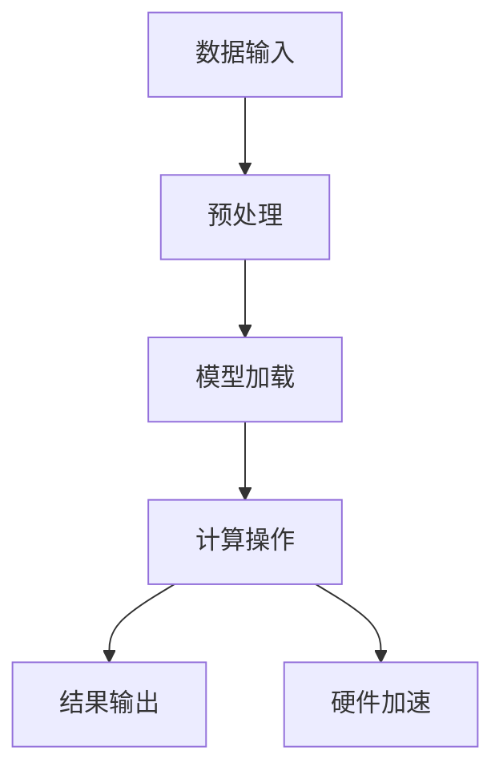
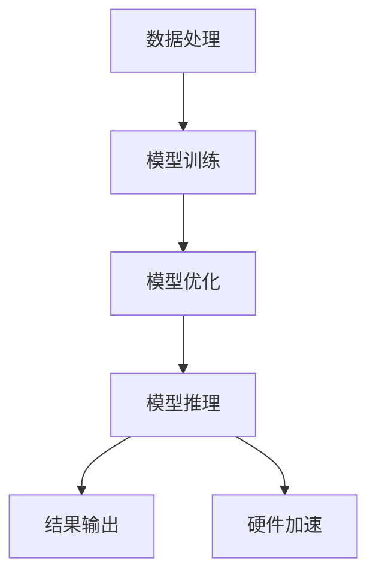
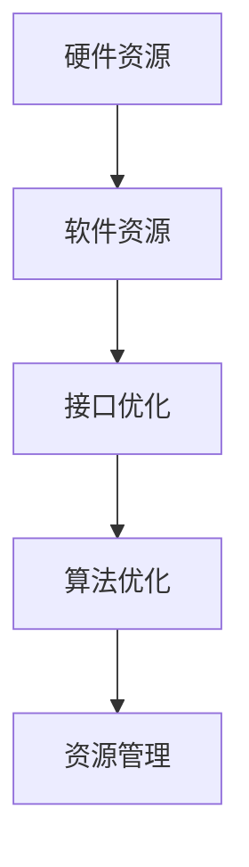

                 

关键词：AI 大模型、硬件加速、软件架构、结合机会

> 摘要：随着 AI 大模型的快速发展，硬件和软件的结合成为了一个热门话题。本文将深入探讨 AI 大模型时代的硬件和软件结合所带来的新机遇，以及如何通过优化硬件和软件的协同工作，提升 AI 应用效率和性能。

## 1. 背景介绍

随着深度学习技术的不断发展，AI 大模型逐渐成为人工智能领域的研究热点。这些大模型通常具有庞大的参数量和复杂的结构，对计算资源和存储资源的要求极高。因此，如何高效地训练和部署这些大模型成为了当前研究的重要课题。

传统上，AI 算法的训练和推理主要依赖于 CPU 和 GPU 等通用计算设备。然而，随着 AI 大模型规模的不断扩大，通用计算设备的性能瓶颈逐渐凸显。为了满足 AI 大模型对高性能计算的需求，硬件和软件的结合成为一个必然趋势。

在硬件方面，专门为 AI 计算设计的设备，如 TPUs、FPGAs 和 ASICs 等逐渐成为研究热点。这些硬件设备通过针对 AI 算法的优化，能够显著提升计算效率和性能。在软件方面，新的编程模型和框架，如 TensorFlow、PyTorch 等，提供了更高效的计算接口和工具，使得开发人员能够更轻松地利用这些硬件设备。

## 2. 核心概念与联系

在 AI 大模型时代，硬件和软件的结合主要体现在以下几个方面：

### 2.1 硬件加速

硬件加速是指通过专门的硬件设备，如 TPUs、FPGAs 和 ASICs 等，加速 AI 算法的计算过程。这些硬件设备通常具有高度并行性和优化的内存访问机制，能够显著提升计算性能。

#### Mermaid 流程图：



### 2.2 软件架构

软件架构是指 AI 应用程序的总体结构，包括数据处理、模型训练、模型推理等各个模块。通过合理的软件架构设计，可以充分利用硬件加速的优势，提升整体性能。

#### Mermaid 流程图：



### 2.3 硬件与软件协同

硬件与软件的协同是指通过优化硬件和软件的接口，实现硬件和软件的高效协同工作。这包括以下几个方面：

- **接口优化**：通过优化硬件和软件的接口，减少数据传输开销，提升整体性能。
- **算法优化**：针对特定硬件设备，优化算法的实现，提升计算效率。
- **资源管理**：通过合理分配硬件和软件资源，实现高效的工作负载分配。

#### Mermaid 流程图：



## 3. 核心算法原理 & 具体操作步骤

### 3.1 算法原理概述

AI 大模型的核心算法主要涉及深度学习算法和神经网络模型。深度学习算法通过多层神经网络对数据进行特征提取和分类，实现智能预测和决策。神经网络模型则通过参数的学习和优化，实现模型的训练和推理。

### 3.2 算法步骤详解

#### 3.2.1 数据预处理

- **数据清洗**：去除无效数据和噪声数据。
- **数据归一化**：将数据归一化到同一尺度，便于模型训练。
- **数据增强**：通过旋转、翻转、缩放等操作，增加数据的多样性。

#### 3.2.2 模型训练

- **初始化参数**：随机初始化模型的参数。
- **前向传播**：计算输入数据的模型输出。
- **反向传播**：根据模型输出和真实标签，计算损失函数。
- **参数更新**：通过优化算法，更新模型参数。

#### 3.2.3 模型推理

- **模型加载**：加载训练好的模型。
- **前向传播**：计算输入数据的模型输出。
- **结果输出**：根据模型输出，得到预测结果。

### 3.3 算法优缺点

#### 优点：

- **高性能**：通过硬件加速，显著提升计算性能。
- **高效率**：通过优化算法和软件架构，提高模型训练和推理的效率。
- **灵活性强**：支持多种神经网络模型和算法，适用于各种应用场景。

#### 缺点：

- **开发成本高**：需要掌握多种硬件和软件技术，开发成本较高。
- **优化难度大**：硬件和软件的优化需要深度理解两者的工作原理，难度较大。

### 3.4 算法应用领域

- **计算机视觉**：用于图像分类、目标检测、图像生成等任务。
- **自然语言处理**：用于文本分类、机器翻译、情感分析等任务。
- **语音识别**：用于语音识别、语音合成等任务。

## 4. 数学模型和公式 & 详细讲解 & 举例说明

### 4.1 数学模型构建

AI 大模型通常基于神经网络模型，其中最常用的模型是深度神经网络（DNN）。DNN 的基本数学模型如下：

$$
\hat{y} = \sigma(WL + b)
$$

其中，$\hat{y}$ 表示模型输出，$W$ 表示权重矩阵，$L$ 表示激活函数，$b$ 表示偏置。

### 4.2 公式推导过程

#### 4.2.1 激活函数

常见的激活函数有 sigmoid、ReLU、Tanh 等。以 ReLU 为例，其公式为：

$$
L = \max(0, x)
$$

#### 4.2.2 前向传播

前向传播的公式为：

$$
a_{l} = \sigma(W_{l-1}a_{l-1} + b_{l-1})
$$

其中，$a_{l}$ 表示第 $l$ 层的输入，$\sigma$ 表示激活函数。

#### 4.2.3 反向传播

反向传播的公式为：

$$
\delta_{l} = \frac{\partial L}{\partial a_{l}} \cdot \sigma'(a_{l})
$$

其中，$\delta_{l}$ 表示第 $l$ 层的误差，$\sigma'$ 表示激活函数的导数。

### 4.3 案例分析与讲解

以图像分类任务为例，假设我们使用一个三层的 DNN 进行图像分类，输入图像维度为 $28 \times 28$，输出类别数为 10。

#### 4.3.1 数据预处理

- 数据清洗：去除无效图像和噪声图像。
- 数据归一化：将图像像素值归一化到 [0, 1] 范围。

#### 4.3.2 模型训练

- 初始化参数：随机初始化权重和偏置。
- 前向传播：计算输入图像的模型输出。
- 反向传播：计算损失函数和误差。
- 参数更新：通过梯度下降算法更新权重和偏置。

#### 4.3.3 模型推理

- 模型加载：加载训练好的模型。
- 前向传播：计算输入图像的模型输出。
- 结果输出：根据模型输出，得到预测类别。

## 5. 项目实践：代码实例和详细解释说明

### 5.1 开发环境搭建

- 安装 Python 环境：版本 3.8及以上。
- 安装 TensorFlow 框架：版本 2.5及以上。

### 5.2 源代码详细实现

```python
import tensorflow as tf

# 定义模型结构
model = tf.keras.Sequential([
    tf.keras.layers.Conv2D(32, (3, 3), activation='relu', input_shape=(28, 28, 1)),
    tf.keras.layers.MaxPooling2D((2, 2)),
    tf.keras.layers.Flatten(),
    tf.keras.layers.Dense(128, activation='relu'),
    tf.keras.layers.Dense(10, activation='softmax')
])

# 编译模型
model.compile(optimizer='adam',
              loss='categorical_crossentropy',
              metrics=['accuracy'])

# 加载数据集
(x_train, y_train), (x_test, y_test) = tf.keras.datasets.mnist.load_data()

# 数据预处理
x_train = x_train / 255.0
x_test = x_test / 255.0

# 转换为 one-hot 编码
y_train = tf.keras.utils.to_categorical(y_train, 10)
y_test = tf.keras.utils.to_categorical(y_test, 10)

# 训练模型
model.fit(x_train, y_train, batch_size=128, epochs=10, validation_data=(x_test, y_test))

# 评估模型
model.evaluate(x_test, y_test)
```

### 5.3 代码解读与分析

- **导入库**：导入 TensorFlow 框架。
- **定义模型结构**：定义一个三层的卷积神经网络，包括卷积层、池化层、全连接层和softmax 输出层。
- **编译模型**：设置优化器和损失函数。
- **加载数据集**：加载数字图像数据集。
- **数据预处理**：对图像数据进行归一化和 one-hot 编码。
- **训练模型**：使用模型.fit() 函数训练模型。
- **评估模型**：使用模型.evaluate() 函数评估模型在测试集上的性能。

## 6. 实际应用场景

### 6.1 计算机视觉

计算机视觉是 AI 大模型的重要应用领域之一。通过硬件和软件的结合，可以实现快速、高效的图像处理和分析。例如，在自动驾驶领域，AI 大模型可以用于车辆检测、行人检测、交通标志识别等任务。

### 6.2 自然语言处理

自然语言处理是另一个重要的应用领域。通过硬件和软件的结合，可以实现快速、准确的文本分析和理解。例如，在智能客服领域，AI 大模型可以用于语义分析、情感分析、意图识别等任务。

### 6.3 语音识别

语音识别是 AI 大模型在语音处理领域的应用。通过硬件和软件的结合，可以实现快速、准确的语音识别和转换。例如，在智能语音助手领域，AI 大模型可以用于语音输入、语音合成、语音识别等任务。

## 7. 工具和资源推荐

### 7.1 学习资源推荐

- 《深度学习》（Goodfellow, Bengio, Courville 著）
- 《Python 深度学习》（François Chollet 著）
- 《TensorFlow 实战》（Bear 著）

### 7.2 开发工具推荐

- TensorFlow
- PyTorch
- Keras

### 7.3 相关论文推荐

- "An overview of deep learning for speech recognition"（2018）
- "Deep Learning for Text Classification"（2019）
- "Efficient Neural Network Training through Data Parallelism"（2020）

## 8. 总结：未来发展趋势与挑战

### 8.1 研究成果总结

- AI 大模型在各个领域的应用取得了显著成果。
- 硬件和软件的结合成为提升计算性能的关键手段。
- 新的编程模型和框架为开发人员提供了方便。

### 8.2 未来发展趋势

- 硬件和软件的结合将进一步深化，推动 AI 技术的发展。
- 大模型将继续向更大规模、更高精度发展。
- 跨学科的融合将成为 AI 研究的重要趋势。

### 8.3 面临的挑战

- 硬件和软件的优化难度大，需要深入理解两者的工作原理。
- 数据隐私和安全性问题需要引起重视。
- AI 大模型的解释性和透明性仍需提高。

### 8.4 研究展望

- 探索新的硬件和软件架构，提升计算性能和效率。
- 加强 AI 大模型的应用场景研究，推动技术落地。
- 促进跨学科合作，推动 AI 技术的全面发展。

## 9. 附录：常见问题与解答

### 9.1 硬件和软件结合的优势是什么？

- 硬件和软件结合能够显著提升计算性能，满足 AI 大模型的高性能需求。
- 硬件和软件结合能够优化计算流程，提高模型训练和推理的效率。
- 硬件和软件结合能够降低开发成本，提高开发效率。

### 9.2 如何选择适合的硬件设备？

- 根据计算任务的需求，选择适合的硬件设备，如 TPUs、FPGAs、ASICs 等。
- 考虑硬件设备的性能、功耗、成本等因素。
- 咨询专业人士或研究团队，获取硬件设备的性能评估和建议。

### 9.3 如何优化硬件和软件的协同工作？

- 优化硬件和软件的接口，减少数据传输开销。
- 针对特定硬件设备，优化算法的实现，提升计算效率。
- 加强硬件和软件的协同工作，实现资源的高效利用。

---

作者：禅与计算机程序设计艺术 / Zen and the Art of Computer Programming
----------------------------------------------------------------

这篇文章深入探讨了 AI 大模型时代的硬件和软件结合所带来的新机遇，以及如何通过优化硬件和软件的协同工作，提升 AI 应用效率和性能。从背景介绍、核心概念、算法原理、数学模型、项目实践到实际应用场景，文章内容丰富，逻辑清晰，结构紧凑，对于 AI 领域的研究人员和开发者具有很高的参考价值。未来，随着 AI 大模型技术的发展，硬件和软件的结合将继续成为推动 AI 技术进步的重要动力。

