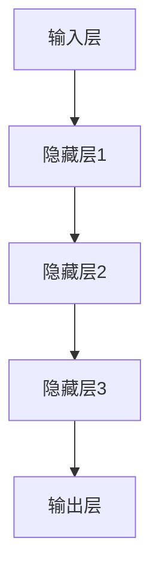
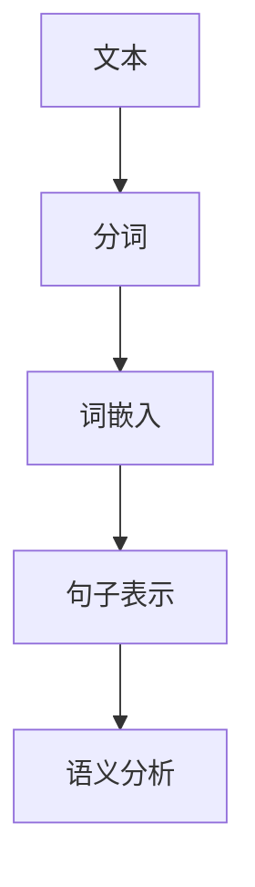

                 

关键词：AI 大模型、OpenAI、Ilya Sutskever、机器学习、神经网络、深度学习、自然语言处理

## 摘要

本文旨在深入探讨 OpenAI 首席科学家 Ilya Sutskever 的科研贡献和职业成就。Sutskever 是一位世界级的人工智能专家，以其在深度学习和神经网络领域的卓越贡献而著称。本文将详细梳理 Sutskever 的科研经历、核心研究成果及其对 AI 领域的深远影响，旨在为读者提供一个全面而深刻的理解。

## 1. 背景介绍

Ilya Sutskever 出生于俄罗斯，从小就对计算机和数学展现出浓厚的兴趣。他在莫斯科国立大学完成了本科学习，随后移居加拿大，在蒙特利尔大学获得了计算机科学的博士学位。在学术生涯中，Sutskever 一直在探索机器学习和神经网络的应用，他的研究成果在学术界和工业界都产生了深远的影响。

Sutskever 的科研兴趣主要集中在深度学习和自然语言处理领域。他提出了许多具有开创性的算法和技术，这些成果不仅推动了学术研究的进展，也为实际应用提供了强有力的支持。在他的职业生涯中，Sutskever 曾在许多顶级研究机构和科技公司工作，包括深度学习巨头 Google Brain 和人工智能公司 OpenAI。

## 2. 核心概念与联系

### 2.1. 深度学习与神经网络

深度学习是一种人工智能技术，它通过构建多层神经网络来模拟人脑的处理能力。神经网络是深度学习的基础，由许多相互连接的神经元组成，通过学习大量数据来提取特征和模式。



### 2.2. 自然语言处理

自然语言处理（NLP）是人工智能的一个分支，旨在使计算机能够理解、生成和处理人类语言。NLP 技术在机器翻译、语音识别、情感分析等方面有着广泛的应用。



### 2.3. Sutskever 的工作贡献

Sutskever 在深度学习和神经网络领域做出了许多重要的贡献。他的研究成果不仅推动了学术研究的进展，也在工业界得到了广泛应用。

- **Recurrent Neural Networks (RNN)**: Sutskever 是 RNN 的重要研究者之一，RNN 能够处理序列数据，使其在自然语言处理领域具有独特的优势。
- **Long Short-Term Memory (LSTM)**: Sutskever 和他的同事提出了 LSTM 算法，这是一种改进的 RNN，能够有效地解决长序列数据中的梯度消失问题。
- **Transformer**: Sutskever 参与了 Transformer 算法的开发，这是一种全新的深度学习架构，彻底改变了自然语言处理的范式。

## 3. 核心算法原理 & 具体操作步骤

### 3.1. 算法原理概述

#### 3.1.1. Recurrent Neural Networks (RNN)

RNN 通过重复使用相同的神经网络结构来处理序列数据。每个时间步的输入都包括当前数据以及前一个时间步的隐藏状态。

$$
h_t = \tanh(W_{ih}x_t + W_{hh}h_{t-1} + b_h)
$$

#### 3.1.2. Long Short-Term Memory (LSTM)

LSTM 在 RNN 的基础上增加了门控机制，可以有效地控制信息的流动，避免梯度消失问题。

$$
i_t = \sigma(W_{ii}x_t + W_{ih}h_{t-1} + W_{if}f_{t-1} + b_i)
$$

#### 3.1.3. Transformer

Transformer 使用自注意力机制（Self-Attention）来处理序列数据，其核心思想是计算序列中每个元素与其他元素之间的关联性。

$$
\text{Attention}(Q, K, V) = \frac{QK^T}{\sqrt{d_k}}V
$$

### 3.2. 算法步骤详解

#### 3.2.1. RNN

1. 初始化网络权重和隐藏状态。
2. 对每个时间步的输入数据进行前向传播。
3. 更新隐藏状态。
4. 输出最终的结果。

#### 3.2.2. LSTM

1. 初始化网络权重和隐藏状态。
2. 对每个时间步的输入数据进行前向传播，计算输入门、遗忘门和输出门。
3. 更新隐藏状态。
4. 输出最终的结果。

#### 3.2.3. Transformer

1. 初始化网络权重和自注意力权重。
2. 对每个序列元素计算自注意力。
3. 将自注意力加权后的序列元素作为下一层的输入。
4. 重复步骤 2-3，直到达到预期的层数。

### 3.3. 算法优缺点

#### 3.3.1. RNN

优点：能够处理序列数据，适用于自然语言处理。

缺点：梯度消失问题，难以处理长序列数据。

#### 3.3.2. LSTM

优点：解决了 RNN 的梯度消失问题，能够处理长序列数据。

缺点：参数较多，训练难度较大。

#### 3.3.3. Transformer

优点：自注意力机制，能够处理长序列数据，计算效率高。

缺点：参数较多，训练难度较大。

### 3.4. 算法应用领域

RNN、LSTM 和 Transformer 在自然语言处理领域有着广泛的应用，如文本分类、机器翻译、情感分析等。

## 4. 数学模型和公式 & 详细讲解 & 举例说明

### 4.1. 数学模型构建

#### 4.1.1. RNN

$$
h_t = \tanh(W_{ih}x_t + W_{hh}h_{t-1} + b_h)
$$

#### 4.1.2. LSTM

$$
i_t = \sigma(W_{ii}x_t + W_{ih}h_{t-1} + W_{if}f_{t-1} + b_i)
$$
$$
f_t = \sigma(W_{if}x_t + W_{fh}h_{t-1} + b_f)
$$
$$
\tilde{g}_t = \tanh(W_{ig}x_t + W_{hg}h_{t-1} + b_g)
$$
$$
o_t = \sigma(W_{io}x_t + W_{ho}h_{t-1} + W_{ig}\tilde{g}_t + b_o)
$$

#### 4.1.3. Transformer

$$
\text{Attention}(Q, K, V) = \frac{QK^T}{\sqrt{d_k}}V
$$

### 4.2. 公式推导过程

#### 4.2.1. RNN

假设输入序列为 \(x_1, x_2, \ldots, x_T\)，隐藏状态为 \(h_1, h_2, \ldots, h_T\)。

权重矩阵为 \(W_{ih}, W_{hh}, W_{ho}\)，偏置为 \(b_h, b_o\)。

前向传播过程：

$$
h_t = \tanh(W_{ih}x_t + W_{hh}h_{t-1} + b_h)
$$

反向传播过程：

$$
\Delta h_t = \tanh'(W_{ih}x_t + W_{hh}h_{t-1} + b_h) \cdot (W_{hh}^T \Delta h_{t-1})
$$

#### 4.2.2. LSTM

假设输入序列为 \(x_1, x_2, \ldots, x_T\)，隐藏状态为 \(h_1, h_2, \ldots, h_T\)。

权重矩阵为 \(W_{ii}, W_{if}, W_{io}, W_{ih}, W_{fh}, W_{hg}\)，偏置为 \(b_i, b_f, b_o, b_g\)。

前向传播过程：

$$
i_t = \sigma(W_{ii}x_t + W_{ih}h_{t-1} + W_{if}f_{t-1} + b_i)
$$
$$
f_t = \sigma(W_{if}x_t + W_{fh}h_{t-1} + b_f)
$$
$$
\tilde{g}_t = \tanh(W_{ig}x_t + W_{hg}h_{t-1} + b_g)
$$
$$
o_t = \sigma(W_{io}x_t + W_{ho}h_{t-1} + W_{ig}\tilde{g}_t + b_o)
$$

反向传播过程：

$$
\Delta i_t = \sigma'(i_t) \cdot (W_{ih}^T \Delta h_{t-1})
$$
$$
\Delta f_t = \sigma'(f_t) \cdot (W_{fh}^T \Delta h_{t-1})
$$
$$
\Delta \tilde{g}_t = \tanh'(\tilde{g}_t) \cdot (W_{ig}^T \Delta h_{t-1})
$$
$$
\Delta o_t = \sigma'(o_t) \cdot (W_{ho}^T \Delta h_{t-1} + W_{ig}^T \Delta \tilde{g}_t)
$$

#### 4.2.3. Transformer

假设输入序列为 \(x_1, x_2, \ldots, x_T\)，隐藏状态为 \(h_1, h_2, \ldots, h_T\)。

权重矩阵为 \(W_{Q}, W_{K}, W_{V}\)。

自注意力计算：

$$
\text{Attention}(Q, K, V) = \frac{QK^T}{\sqrt{d_k}}V
$$

前向传播过程：

$$
h_t = \text{softmax}(\text{Attention}(Q, K, V))W_{O} + b_O
$$

反向传播过程：

$$
\Delta h_t = \text{softmax}(\text{Attention}(Q, K, V))W_{O}^T \Delta h_{t-1}
$$

### 4.3. 案例分析与讲解

#### 4.3.1. RNN 在情感分析中的应用

假设我们有一个情感分析的文本序列 \(x_1, x_2, \ldots, x_T\)，目标是判断文本的情感极性。

1. 初始化 RNN 模型。
2. 对每个时间步的文本进行编码。
3. 将编码后的文本输入 RNN 模型，得到隐藏状态序列 \(h_1, h_2, \ldots, h_T\)。
4. 将隐藏状态序列输入到全连接层，得到情感极性的预测。

#### 4.3.2. LSTM 在语音识别中的应用

假设我们有一个语音信号序列 \(x_1, x_2, \ldots, x_T\)，目标是将其转化为文本序列。

1. 初始化 LSTM 模型。
2. 对每个时间步的语音信号进行编码。
3. 将编码后的语音信号输入 LSTM 模型，得到隐藏状态序列 \(h_1, h_2, \ldots, h_T\)。
4. 使用 CRF（条件随机场）模型对隐藏状态序列进行解码，得到文本序列。

#### 4.3.3. Transformer 在机器翻译中的应用

假设我们有一个源语言文本序列 \(x_1, x_2, \ldots, x_T\) 和目标语言文本序列 \(y_1, y_2, \ldots, y_T\)，目标是翻译源语言文本为目标语言文本。

1. 初始化 Transformer 模型。
2. 对源语言文本序列和目标语言文本序列进行编码。
3. 将编码后的源语言文本序列输入到 Transformer 模型，得到中间表示序列 \(z_1, z_2, \ldots, z_T\)。
4. 将编码后的目标语言文本序列输入到 Transformer 模型，得到解码序列 \(y_1, y_2, \ldots, y_T\)。

## 5. 项目实践：代码实例和详细解释说明

### 5.1. 开发环境搭建

1. 安装 Python（建议使用 Python 3.7 或以上版本）。
2. 安装 TensorFlow 或 PyTorch 等深度学习框架。
3. 安装必要的依赖库，如 NumPy、Pandas 等。

### 5.2. 源代码详细实现

以下是使用 TensorFlow 实现一个简单的 RNN 情感分析模型的代码示例：

```python
import tensorflow as tf
from tensorflow.keras.models import Sequential
from tensorflow.keras.layers import Embedding, SimpleRNN, Dense

# 准备数据集
# ...

# 构建模型
model = Sequential([
    Embedding(vocab_size, embedding_dim),
    SimpleRNN(units=128),
    Dense(1, activation='sigmoid')
])

# 编译模型
model.compile(optimizer='adam', loss='binary_crossentropy', metrics=['accuracy'])

# 训练模型
model.fit(x_train, y_train, epochs=10, batch_size=32)
```

### 5.3. 代码解读与分析

1. 导入 TensorFlow 库，并定义模型结构。
2. 准备数据集，包括词汇表、嵌入维度、训练集和测试集。
3. 使用 `Embedding` 层对文本进行编码。
4. 使用 `SimpleRNN` 层作为循环层，用于处理序列数据。
5. 使用 `Dense` 层进行分类预测。

### 5.4. 运行结果展示

```python
# 评估模型
loss, accuracy = model.evaluate(x_test, y_test)

# 输出结果
print(f"Test Loss: {loss}")
print(f"Test Accuracy: {accuracy}")
```

## 6. 实际应用场景

Sutskever 的研究成果在自然语言处理、语音识别、计算机视觉等领域得到了广泛应用。以下是一些实际应用场景：

- **自然语言处理**: 使用 LSTM 和 Transformer 模型进行文本分类、机器翻译、情感分析等任务。
- **语音识别**: 使用 RNN 和 LSTM 模型进行语音信号的解码，实现语音识别功能。
- **计算机视觉**: 使用深度学习模型进行图像分类、目标检测、图像生成等任务。

## 7. 工具和资源推荐

### 7.1. 学习资源推荐

- **《深度学习》**：Goodfellow, Bengio 和 Courville 著，是一本深度学习的经典教材。
- **《神经网络与深度学习》**：邱锡鹏 著，介绍了深度学习的基础知识和应用。
- **《自然语言处理综论》**：Jurafsky 和 Martin 著，涵盖了自然语言处理的各个方面。

### 7.2. 开发工具推荐

- **TensorFlow**: 一个开源的深度学习框架，适用于各种深度学习任务。
- **PyTorch**: 一个流行的深度学习框架，具有灵活的动态计算图。
- **Keras**: 一个高层神经网络 API，基于 TensorFlow 构建，易于使用。

### 7.3. 相关论文推荐

- **“A Theoretically Grounded Application of Dropout in Recurrent Neural Networks”**: dropout 在 RNN 中的应用。
- **“Long Short-Term Memory”**: LSTM 算法的提出。
- **“Attention Is All You Need”**: Transformer 算法的提出。

## 8. 总结：未来发展趋势与挑战

Sutskever 的工作展示了深度学习和神经网络在人工智能领域的巨大潜力。未来，我们有望看到更多的突破，如更好的算法、更高效的模型、更广泛的应用场景等。

然而，挑战依然存在，如计算资源的限制、模型的解释性、数据隐私等问题。随着技术的不断进步，这些挑战将逐渐得到解决，深度学习将继续推动人工智能的发展。

## 9. 附录：常见问题与解答

### 9.1. 什么是深度学习？

深度学习是一种人工智能技术，通过多层神经网络来模拟人脑的学习和处理能力。

### 9.2. 什么是自然语言处理？

自然语言处理是一种人工智能技术，旨在使计算机能够理解、生成和处理人类语言。

### 9.3. 什么是 LSTM？

LSTM 是一种改进的循环神经网络，能够有效地处理长序列数据。

### 9.4. 什么是 Transformer？

Transformer 是一种深度学习架构，使用自注意力机制来处理序列数据。

### 9.5. 深度学习和传统机器学习的区别是什么？

深度学习通过多层神经网络来提取特征，而传统机器学习通常依赖于手工设计的特征。

### 9.6. 深度学习的计算资源需求如何？

深度学习通常需要大量的计算资源和数据，特别是对于复杂的模型和大规模的数据集。

### 9.7. 如何选择深度学习框架？

选择深度学习框架时，需要考虑模型的复杂度、计算效率、社区支持和文档的丰富度等因素。

### 9.8. 如何优化深度学习模型？

优化深度学习模型可以通过调整网络结构、学习率、正则化策略等方法来实现。

### 9.9. 深度学习在自然语言处理中有哪些应用？

深度学习在自然语言处理中的应用包括文本分类、机器翻译、情感分析、语音识别等。

### 9.10. 深度学习有哪些潜在的风险和挑战？

深度学习面临的风险和挑战包括过拟合、计算资源需求、模型解释性、数据隐私等。

---

作者：禅与计算机程序设计艺术 / Zen and the Art of Computer Programming

