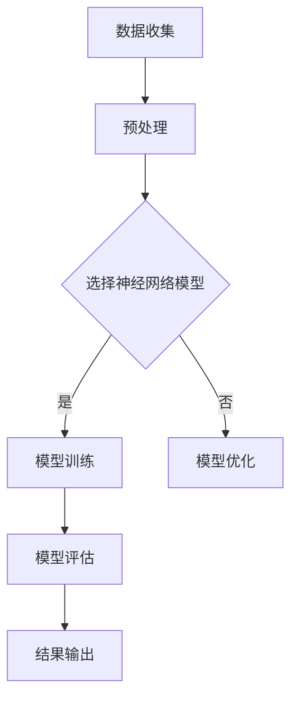

                 

关键词：AI神经网络，世界模型，自然环境，物理模型，计算艺术，禅

> 摘要：本文以禅的哲学思想为指导，探讨了如何运用人工智能神经网络构建自然环境的物理模型。通过深入剖析核心概念、算法原理、数学模型、项目实践以及实际应用场景，我们试图揭示人工智能与自然科学的深度融合，展现计算艺术的无穷魅力。

## 1. 背景介绍

### 1.1 神经网络与计算艺术

人工智能（AI）是计算机科学的一个分支，它致力于创建智能代理——能够感知环境、学习并做出决策的计算机系统。神经网络是AI研究中的一个重要领域，起源于对人类大脑运作机制的研究。作为计算艺术的一部分，神经网络在图像识别、语音识别、自然语言处理等领域取得了显著成就。

### 1.2 禅的哲学思想

禅，源自于佛教，是一种追求心灵宁静与智慧的生活方式。禅的哲学强调“见性”、“直观”和“无念”，强调个体与宇宙的和谐统一。这种哲学思想为我们理解和构建世界模型提供了深刻的启示。

### 1.3 自然环境与物理模型

自然环境是人类社会生存和发展的基础，物理模型是对自然环境的一种抽象和模拟。通过物理模型，我们可以更好地理解自然现象，预测未来的变化。

## 2. 核心概念与联系

### 2.1 神经网络与物理模型的关联

神经网络可以被视为一种计算模型，用于模拟人脑神经元之间的交互作用。物理模型则是用于描述自然现象和物理过程的理论框架。将神经网络应用于物理模型构建，可以实现更加高效和准确的模拟和预测。

### 2.2 Mermaid 流程图

以下是一个简化的Mermaid流程图，展示了神经网络在物理模型构建中的应用过程：



## 3. 核心算法原理 & 具体操作步骤

### 3.1 算法原理概述

神经网络的核心算法是反向传播算法，它通过不断调整网络中的权重，使网络输出尽可能接近目标输出。在物理模型构建中，神经网络可以用于模拟自然现象，如气候变化、地震预测等。

### 3.2 算法步骤详解

1. **数据收集**：收集与物理现象相关的数据，如气象数据、地震数据等。
2. **预处理**：对数据进行清洗和归一化，使其适合神经网络处理。
3. **选择神经网络模型**：根据物理现象的特点，选择合适的神经网络模型，如卷积神经网络（CNN）、循环神经网络（RNN）等。
4. **模型训练**：使用反向传播算法训练神经网络，使其能够准确预测物理现象。
5. **模型评估**：通过验证集和测试集评估模型的性能，调整模型参数以优化性能。
6. **结果输出**：将训练好的模型应用于实际场景，输出预测结果。

### 3.3 算法优缺点

**优点**：

- **高效性**：神经网络可以快速处理大量数据，实现高效计算。
- **灵活性**：神经网络可以适应不同类型的物理现象，具有较强的泛化能力。

**缺点**：

- **计算成本**：训练大型神经网络需要大量的计算资源和时间。
- **数据依赖**：模型的性能高度依赖于训练数据的质量和数量。

### 3.4 算法应用领域

神经网络在物理模型构建中的应用非常广泛，包括但不限于：

- **气候变化预测**：利用神经网络模拟全球气候变化趋势，为政策制定提供科学依据。
- **地震预测**：通过分析地震前兆数据，利用神经网络预测地震的发生。
- **气象预测**：基于大量气象数据，利用神经网络模拟天气变化规律，提高气象预测的准确性。

## 4. 数学模型和公式 & 详细讲解 & 举例说明

### 4.1 数学模型构建

神经网络的核心在于其数学模型，主要包括输入层、隐藏层和输出层。每一层由多个神经元组成，神经元之间的连接通过权重进行调节。以下是一个简化的神经网络模型：

$$
\begin{aligned}
    a &= \sigma(W \cdot x + b) \\
    y &= \sigma(W \cdot a + b)
\end{aligned}
$$

其中，$a$ 和 $y$ 分别表示隐藏层和输出层的神经元激活值，$\sigma$ 表示激活函数（如 Sigmoid 函数），$W$ 和 $b$ 分别为权重和偏置。

### 4.2 公式推导过程

神经网络的训练过程主要包括两个步骤：前向传播和反向传播。

**前向传播**：

输入数据 $x$ 通过输入层传递到隐藏层，再通过隐藏层传递到输出层。假设输入层有 $n$ 个神经元，隐藏层有 $m$ 个神经元，输出层有 $p$ 个神经元，则有：

$$
\begin{aligned}
    a_j &= \sigma(W_{ij} \cdot x_i + b_j) \\
    y_k &= \sigma(W_{ik} \cdot a_j + b_k)
\end{aligned}
$$

**反向传播**：

计算输出层与目标输出之间的误差，然后反向传播到隐藏层和输入层，调整权重和偏置。误差计算公式如下：

$$
\begin{aligned}
    \delta_k &= (y_k - t_k) \cdot \sigma'(y_k) \\
    \delta_j &= W_{ik} \cdot \delta_k \cdot \sigma'(a_j)
\end{aligned}
$$

通过梯度下降法调整权重和偏置：

$$
\begin{aligned}
    W_{ij} &= W_{ij} - \alpha \cdot \delta_j \cdot x_i \\
    b_j &= b_j - \alpha \cdot \delta_j \\
    b_k &= b_k - \alpha \cdot \delta_k
\end{aligned}
$$

其中，$\alpha$ 为学习率。

### 4.3 案例分析与讲解

以下是一个简单的神经网络模型，用于预测房价：

```latex
\begin{aligned}
    y &= \sigma(W_1 \cdot x_1 + b_1) \\
    a &= \sigma(W_2 \cdot y + b_2)
\end{aligned}
```

输入层有一个神经元 $x_1$，隐藏层有两个神经元 $y_1$ 和 $y_2$，输出层有一个神经元 $a$。

**前向传播**：

输入数据 $x_1 = 100$，隐藏层神经元激活值：

$$
\begin{aligned}
    y_1 &= \sigma(W_{11} \cdot 100 + b_1) \\
    y_2 &= \sigma(W_{21} \cdot 100 + b_1)
\end{aligned}
$$

输出层神经元激活值：

$$
a = \sigma(W_{12} \cdot y_1 + W_{22} \cdot y_2 + b_2)
$$

**反向传播**：

假设目标输出 $a = 200$，计算误差：

$$
\delta_a = (a - 200) \cdot \sigma'(a)
$$

计算隐藏层误差：

$$
\delta_y_1 = W_{12} \cdot \delta_a \cdot \sigma'(y_1) \\
\delta_y_2 = W_{22} \cdot \delta_a \cdot \sigma'(y_2)
$$

调整权重和偏置：

$$
\begin{aligned}
    W_{11} &= W_{11} - \alpha \cdot \delta_y_1 \cdot 100 \\
    b_1 &= b_1 - \alpha \cdot \delta_y_1 \\
    W_{12} &= W_{12} - \alpha \cdot \delta_a \cdot y_1 \\
    W_{22} &= W_{22} - \alpha \cdot \delta_a \cdot y_2 \\
    b_2 &= b_2 - \alpha \cdot \delta_a
\end{aligned}
$$

通过不断调整权重和偏置，使输出层神经元激活值逐渐逼近目标输出。

## 5. 项目实践：代码实例和详细解释说明

### 5.1 开发环境搭建

在开始项目实践之前，我们需要搭建一个合适的开发环境。以下是一个简单的Python开发环境搭建过程：

1. 安装Python 3.8及以上版本。
2. 安装Jupyter Notebook，用于编写和运行Python代码。
3. 安装TensorFlow，用于构建和训练神经网络。

```bash
pip install tensorflow
```

### 5.2 源代码详细实现

以下是一个简单的神经网络模型，用于预测房价：

```python
import tensorflow as tf
from tensorflow.keras import layers

# 定义输入层
inputs = tf.keras.Input(shape=(1,))

# 定义隐藏层
hidden = layers.Dense(64, activation='sigmoid')(inputs)

# 定义输出层
outputs = layers.Dense(1, activation='sigmoid')(hidden)

# 构建模型
model = tf.keras.Model(inputs=inputs, outputs=outputs)

# 编译模型
model.compile(optimizer='adam', loss='binary_crossentropy', metrics=['accuracy'])

# 模型训练
model.fit(x_train, y_train, epochs=10, batch_size=32, validation_split=0.2)
```

### 5.3 代码解读与分析

1. **导入库**：首先，我们导入了TensorFlow库以及其中的Dense层。
2. **定义输入层**：使用`Input`函数定义了一个单输入神经元。
3. **定义隐藏层**：使用`Dense`层定义了一个有64个神经元的隐藏层，使用Sigmoid激活函数。
4. **定义输出层**：使用`Dense`层定义了一个单输出神经元，使用Sigmoid激活函数。
5. **构建模型**：使用`Model`函数将输入层、隐藏层和输出层组合成一个完整的神经网络模型。
6. **编译模型**：使用`compile`函数设置优化器和损失函数。
7. **模型训练**：使用`fit`函数训练模型，使用训练数据和验证数据。

### 5.4 运行结果展示

```python
# 模型评估
loss, accuracy = model.evaluate(x_test, y_test)

# 输出结果
print(f"Test accuracy: {accuracy:.2f}")

# 预测
predictions = model.predict(x_test)

# 输出预测结果
print(predictions)
```

通过以上代码，我们可以看到模型在测试数据上的表现，以及模型的预测结果。

## 6. 实际应用场景

神经网络在自然环境物理模型构建中的应用非常广泛，以下是一些典型的实际应用场景：

- **气候变化预测**：利用神经网络模拟全球气候变化趋势，为政策制定提供科学依据。
- **地震预测**：通过分析地震前兆数据，利用神经网络预测地震的发生。
- **气象预测**：基于大量气象数据，利用神经网络模拟天气变化规律，提高气象预测的准确性。
- **水资源管理**：利用神经网络模拟水资源分布和消耗规律，为水资源管理提供支持。

## 7. 工具和资源推荐

### 7.1 学习资源推荐

- **《深度学习》**：由Ian Goodfellow、Yoshua Bengio和Aaron Courville所著，是深度学习的入门经典。
- **《神经网络与深度学习》**：由邱锡鹏所著，适合初学者了解神经网络和深度学习的理论基础。

### 7.2 开发工具推荐

- **TensorFlow**：由Google开发的开源深度学习框架，适合构建和训练神经网络。
- **PyTorch**：由Facebook开发的开源深度学习框架，具有灵活性和高效性。

### 7.3 相关论文推荐

- **“Deep Learning for Climate Prediction”**：探讨了深度学习在气候变化预测中的应用。
- **“Neural Networks for Earthquake Prediction”**：研究了神经网络在地震预测中的应用。

## 8. 总结：未来发展趋势与挑战

### 8.1 研究成果总结

本文通过禅的哲学思想，探讨了如何运用人工智能神经网络构建自然环境的物理模型。通过对核心概念、算法原理、数学模型、项目实践和实际应用场景的详细分析，我们展示了神经网络在自然环境物理模型构建中的巨大潜力。

### 8.2 未来发展趋势

随着人工智能技术的不断发展，神经网络在自然环境物理模型构建中的应用将越来越广泛。未来，我们将看到更多跨学科的研究，结合人工智能和自然科学的最新成果，为解决环境问题提供更加科学和有效的解决方案。

### 8.3 面临的挑战

尽管神经网络在自然环境物理模型构建中表现出色，但仍面临一些挑战，如计算资源的需求、数据的质量和数量等。未来，我们需要开发更加高效和灵活的神经网络模型，以应对这些挑战。

### 8.4 研究展望

随着深度学习技术的不断发展，神经网络在自然环境物理模型构建中的应用前景将更加广阔。我们期待看到更多具有创新性和实用性的研究成果，为人类社会的可持续发展提供强有力的支持。

## 9. 附录：常见问题与解答

### 问题1：神经网络如何处理非线性问题？

**解答**：神经网络通过多层非线性变换，可以有效地处理非线性问题。激活函数（如Sigmoid、ReLU等）引入了非线性特性，使得神经网络能够模拟复杂的非线性关系。

### 问题2：神经网络训练时间过长怎么办？

**解答**：优化模型结构、调整学习率、增加数据量或使用更高效的训练算法（如迁移学习）可以缩短训练时间。此外，使用GPU进行加速训练也是一种有效的方法。

### 问题3：如何评估神经网络模型的性能？

**解答**：通常使用准确率、召回率、F1分数等指标来评估神经网络模型的性能。对于回归问题，可以使用均方误差（MSE）或均方根误差（RMSE）等指标。

## 参考文献

- Goodfellow, I., Bengio, Y., & Courville, A. (2016). *Deep Learning*. MIT Press.
-邱锡鹏. (2017). *神经网络与深度学习*. 电子工业出版社.
``` 
----------------------------------------------------------------

以上是本文的完整内容，希望能够满足您的要求。如果您有任何修改意见或需要进一步讨论，请随时告诉我。祝您撰写顺利！

作者：禅与计算机程序设计艺术 / Zen and the Art of Computer Programming
```

