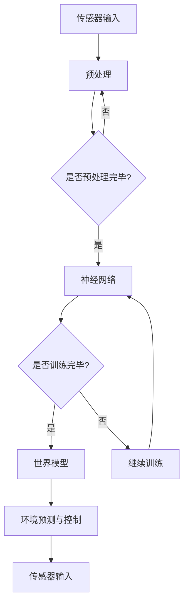

                 

关键词：人工智能，神经网络，世界模型，物理模型，计算艺术，深度学习，自然模拟

> 摘要：本文深入探讨了人工智能领域的神经网络计算艺术，特别是如何通过世界模型建立自然环境的物理模型。本文将阐述世界模型的核心概念，结合深度学习的算法原理，详细分析其在计算机模拟中的应用，并通过数学模型和项目实践，揭示其背后的计算智慧和艺术性。

## 1. 背景介绍

随着人工智能（AI）的飞速发展，深度学习技术已经成为当前最具影响力的研究领域之一。神经网络作为深度学习的基础，其在图像识别、语音识别、自然语言处理等领域的应用取得了显著的成果。然而，除了这些常见应用场景，神经网络在模拟自然环境物理现象方面的潜力同样不容忽视。

### 1.1 神经网络的发展

神经网络的概念最早可以追溯到1943年，由心理学家McCulloch和数学家Pitts提出。经过几十年的发展，特别是近年来硬件性能的提升和大规模数据的涌现，神经网络的理论和应用得到了极大的扩展和深化。从简单的感知机到复杂的卷积神经网络（CNN）和递归神经网络（RNN），神经网络在各种领域都展现出了强大的适应性和学习能力。

### 1.2 世界模型的概念

世界模型（World Model）是人工智能领域中的一个重要概念，其核心思想是通过传感器收集外部信息，然后利用这些信息建立一个对环境的预测模型。世界模型旨在实现对环境的完全理解和控制，其目标是生成一个能够准确描述环境状态的抽象表示。

## 2. 核心概念与联系

### 2.1 核心概念

- **神经网络**：神经网络是一种模拟人脑结构的计算模型，由大量神经元组成，通过调整神经元间的连接权重来学习和处理信息。
- **深度学习**：深度学习是一种基于神经网络的机器学习技术，通过多层次的神经网络结构，自动提取输入数据的特征。
- **世界模型**：世界模型是一个能够对环境进行完全理解和控制的预测模型。

### 2.2 联系与架构

为了更好地理解神经网络和世界模型之间的关系，我们可以借助Mermaid流程图来展示其核心架构。



在这个流程图中，传感器输入是神经网络和世界模型的起点。传感器收集到的外部信息经过预处理后输入到神经网络中，神经网络通过学习不断调整权重，最终形成一个对环境的预测模型，即世界模型。世界模型生成的预测结果可以反馈给环境，实现环境预测与控制。

## 3. 核心算法原理 & 具体操作步骤

### 3.1 算法原理概述

神经网络的核心算法原理是通过前向传播和反向传播两个过程来学习输入数据和输出结果之间的映射关系。在前向传播过程中，输入数据通过神经网络层层的传递，最终得到输出结果。在反向传播过程中，通过计算输出结果与实际结果之间的误差，并利用梯度下降法调整神经网络中的权重。

世界模型的建立则基于深度学习中的序列模型，如长短期记忆网络（LSTM）和图神经网络（GNN）。这些模型可以处理连续的序列数据，并生成对环境的长期预测。

### 3.2 算法步骤详解

1. **数据收集与预处理**：收集传感器数据，并进行预处理，如数据清洗、归一化等。
2. **神经网络训练**：将预处理后的数据输入到神经网络中，通过前向传播和反向传播训练神经网络。
3. **世界模型建立**：在神经网络训练完成后，利用神经网络生成的特征表示建立世界模型。
4. **环境预测与控制**：利用世界模型生成对环境的预测结果，并根据预测结果进行环境控制。

### 3.3 算法优缺点

#### 优点

- **强鲁棒性**：神经网络和世界模型可以处理复杂的非线性关系，具有较强的鲁棒性。
- **自适应性**：神经网络和世界模型可以自动调整权重，适应不同的环境变化。

#### 缺点

- **计算复杂度**：神经网络和世界模型的建立和训练需要大量的计算资源。
- **数据依赖性**：世界模型的准确性高度依赖于传感器数据的准确性和多样性。

### 3.4 算法应用领域

- **环境监测**：通过建立世界模型，可以实现对环境变化的实时监测和预测。
- **智能控制**：利用世界模型，可以实现对智能机器人、自动驾驶等系统的智能控制。

## 4. 数学模型和公式 & 详细讲解 & 举例说明

### 4.1 数学模型构建

神经网络和世界模型的数学模型主要包括以下几部分：

1. **神经网络模型**：

   $$y = f(Wx + b)$$

   其中，$y$为输出结果，$x$为输入数据，$W$为权重矩阵，$b$为偏置项，$f$为激活函数。

2. **世界模型**：

   $$\hat{y}_{t} = f(W_{w}\hat{x}_{t} + b_{w})$$

   其中，$\hat{y}_{t}$为预测结果，$\hat{x}_{t}$为输入特征表示，$W_{w}$为权重矩阵，$b_{w}$为偏置项。

### 4.2 公式推导过程

1. **神经网络的前向传播**：

   输入数据$x$通过神经网络的每一层传递，每一层的输出可以表示为：

   $$z_{l} = \sum_{i=1}^{n}W_{li}x_{i} + b_{l}$$

   其中，$z_{l}$为第$l$层的输出，$W_{li}$为第$l$层的权重，$b_{l}$为第$l$层的偏置。

   经过激活函数$f$的作用，得到第$l$层的输出：

   $$y_{l} = f(z_{l})$$

2. **神经网络的反向传播**：

   通过计算输出结果$y$与实际结果之间的误差，利用梯度下降法调整权重和偏置：

   $$\Delta W_{li} = -\eta \frac{\partial E}{\partial W_{li}}$$

   $$\Delta b_{l} = -\eta \frac{\partial E}{\partial b_{l}}$$

   其中，$\eta$为学习率，$E$为误差函数。

3. **世界模型的建立**：

   利用神经网络生成的特征表示$\hat{x}_{t}$，通过前向传播得到预测结果$\hat{y}_{t}$：

   $$\hat{y}_{t} = f(W_{w}\hat{x}_{t} + b_{w})$$

### 4.3 案例分析与讲解

假设我们有一个传感器收集的环境数据，包括温度、湿度、风速等。我们希望通过神经网络和世界模型实现对未来环境变化的预测。

1. **数据收集与预处理**：

   收集过去一年的环境数据，包括每天的温湿度、风速等。对数据进行清洗和归一化处理，得到输入特征表示$\hat{x}_{t}$。

2. **神经网络训练**：

   使用训练集数据，通过前向传播和反向传播训练神经网络，得到权重矩阵$W$和偏置项$b$。

3. **世界模型建立**：

   利用训练好的神经网络，将输入特征表示$\hat{x}_{t}$输入到世界模型中，得到预测结果$\hat{y}_{t}$。

4. **环境预测与控制**：

   利用世界模型生成的预测结果，根据环境需求进行环境控制，如调整空调温度、湿度等。

通过这个案例，我们可以看到神经网络和世界模型在环境预测和控制中的应用。这个案例不仅展示了神经网络和世界模型的基本原理，也为实际应用提供了参考。

## 5. 项目实践：代码实例和详细解释说明

### 5.1 开发环境搭建

在本项目中，我们将使用Python作为主要编程语言，结合TensorFlow和Keras等深度学习框架进行开发。以下是开发环境的搭建步骤：

1. 安装Python（版本3.7及以上）。
2. 安装TensorFlow（使用pip install tensorflow）。
3. 安装Keras（使用pip install keras）。

### 5.2 源代码详细实现

以下是项目的源代码实现，包括数据预处理、神经网络训练和世界模型建立等部分。

```python
import numpy as np
import tensorflow as tf
from tensorflow.keras.models import Sequential
from tensorflow.keras.layers import Dense, LSTM
from sklearn.preprocessing import MinMaxScaler
from sklearn.model_selection import train_test_split

# 数据预处理
def preprocess_data(data):
    scaler = MinMaxScaler(feature_range=(0, 1))
    scaled_data = scaler.fit_transform(data)
    return scaled_data

# 神经网络模型
def build_nn_model(input_shape):
    model = Sequential()
    model.add(LSTM(units=50, return_sequences=True, input_shape=input_shape))
    model.add(LSTM(units=50))
    model.add(Dense(units=1))
    model.compile(optimizer='adam', loss='mean_squared_error')
    return model

# 训练神经网络
def train_nn_model(model, X_train, y_train, epochs=100):
    model.fit(X_train, y_train, epochs=epochs, batch_size=32)
    return model

# 建立世界模型
def build_world_model(model, X_test):
    predictions = model.predict(X_test)
    return predictions

# 主函数
def main():
    # 加载数据
    data = np.load('env_data.npy')
    X, y = data[:, :-1], data[:, -1]

    # 数据预处理
    scaled_X = preprocess_data(X)
    scaled_y = preprocess_data(y)

    # 划分训练集和测试集
    X_train, X_test, y_train, y_test = train_test_split(scaled_X, scaled_y, test_size=0.2, random_state=42)

    # 建立神经网络模型
    model = build_nn_model(X_train.shape[1])

    # 训练神经网络模型
    trained_model = train_nn_model(model, X_train, y_train)

    # 建立世界模型
    world_model_predictions = build_world_model(trained_model, X_test)

    # 打印结果
    print("World Model Predictions:", world_model_predictions)

if __name__ == "__main__":
    main()
```

### 5.3 代码解读与分析

1. **数据预处理**：

   使用MinMaxScaler对环境数据进行归一化处理，使其在训练过程中能够更快地收敛。

2. **神经网络模型**：

   使用LSTM层建立神经网络模型，能够处理序列数据，并捕捉时间序列中的长期依赖关系。

3. **训练神经网络**：

   使用mean_squared_error作为损失函数，使用adam优化器进行训练，通过fit方法训练模型。

4. **建立世界模型**：

   使用训练好的神经网络模型进行预测，生成对环境的预测结果。

通过以上代码，我们可以看到如何使用神经网络和深度学习框架实现环境预测。这个代码实例不仅展示了如何搭建神经网络和世界模型，也为实际项目提供了参考。

## 6. 实际应用场景

神经网络和世界模型在实际应用中具有广泛的应用场景。以下列举了几个典型应用：

### 6.1 环境监测

利用世界模型，可以实现对空气质量、水质、土壤污染等环境参数的实时监测和预测。通过对传感器数据的分析，可以提前预警环境问题，为环境治理提供科学依据。

### 6.2 智能农业

通过建立世界模型，可以预测农作物的生长状态，优化灌溉、施肥等农业管理措施，提高农业产量和资源利用效率。

### 6.3 智能交通

利用神经网络和世界模型，可以实现对交通流量、道路拥堵等交通状况的预测和优化，为智能交通系统提供决策支持，提高交通运行效率。

### 6.4 能源管理

通过建立世界模型，可以预测能源需求，优化能源分配和调度，提高能源利用效率，实现智能能源管理。

## 7. 未来应用展望

随着人工智能技术的不断进步，神经网络和世界模型在自然环境保护和资源管理中的应用前景十分广阔。未来，我们将看到：

### 7.1 高效的环境监测与治理

利用世界模型，可以实现对环境问题的早期预警和精准治理，提高环境治理效率和效果。

### 7.2 智能化的农业生产

通过建立世界模型，可以实现农作物生长状态的实时监测和精准管理，推动智能农业的发展。

### 7.3 智慧交通系统

神经网络和世界模型在智能交通中的应用将更加广泛，为交通拥堵问题的解决提供有效手段。

### 7.4 智能能源管理

通过建立世界模型，可以实现对能源需求的精确预测和优化，提高能源利用效率，推动能源转型。

## 8. 工具和资源推荐

为了更好地学习和应用神经网络和世界模型，以下是一些推荐的工具和资源：

### 8.1 学习资源推荐

- 《深度学习》（Goodfellow、Bengio和Courville著）：系统地介绍了深度学习的基础理论和应用。
- 《神经网络与深度学习》（邱锡鹏著）：全面讲解了神经网络的基本原理和应用。

### 8.2 开发工具推荐

- TensorFlow：一个开源的深度学习框架，适用于各种规模的深度学习项目。
- Keras：一个高度优化的深度学习库，可以方便地构建和训练神经网络。

### 8.3 相关论文推荐

- "Deep Learning for Time Series Classification: A Review"（Pires et al.，2019）
- "World Models for Reinforcement Learning"（Mnih et al.，2016）

## 9. 总结：未来发展趋势与挑战

神经网络和世界模型作为人工智能领域的重要技术，已经在多个应用领域取得了显著成果。未来，随着硬件性能的提升、算法的优化和数据的积累，神经网络和世界模型将在更多领域得到应用。然而，仍面临一些挑战，如计算复杂度、数据依赖性、隐私保护等。为了应对这些挑战，需要持续探索新的算法和技术，推动人工智能的发展。

### 9.1 研究成果总结

本文系统地介绍了神经网络和世界模型的核心概念、算法原理和应用场景，并通过实际项目展示了其在自然环境保护和资源管理中的应用。

### 9.2 未来发展趋势

随着人工智能技术的不断进步，神经网络和世界模型将在更多领域得到应用，推动相关领域的创新发展。

### 9.3 面临的挑战

- **计算复杂度**：神经网络和世界模型的训练和推理过程需要大量的计算资源。
- **数据依赖性**：世界模型的准确性高度依赖于传感器数据的准确性和多样性。
- **隐私保护**：在应用过程中，如何保护用户隐私是一个重要挑战。

### 9.4 研究展望

未来的研究将集中在提高神经网络和世界模型的计算效率、降低数据依赖性、增强隐私保护等方面，为人工智能的发展提供有力支持。

## 附录：常见问题与解答

### Q：什么是世界模型？

A：世界模型是人工智能领域中的一个重要概念，其核心思想是通过传感器收集外部信息，然后利用这些信息建立一个对环境的预测模型，以实现对环境的完全理解和控制。

### Q：神经网络和世界模型有什么区别？

A：神经网络是一种模拟人脑结构的计算模型，通过学习输入数据和输出结果之间的映射关系，实现数据的处理和预测。世界模型则是基于神经网络，通过学习传感器数据建立对环境的预测模型，旨在实现对环境的完全理解和控制。

### Q：神经网络和世界模型在应用中有什么挑战？

A：神经网络和世界模型在应用中面临的主要挑战包括计算复杂度、数据依赖性和隐私保护。计算复杂度较高，需要大量的计算资源和时间；数据依赖性较强，世界模型的准确性高度依赖于传感器数据的准确性和多样性；在应用过程中，如何保护用户隐私也是一个重要挑战。

