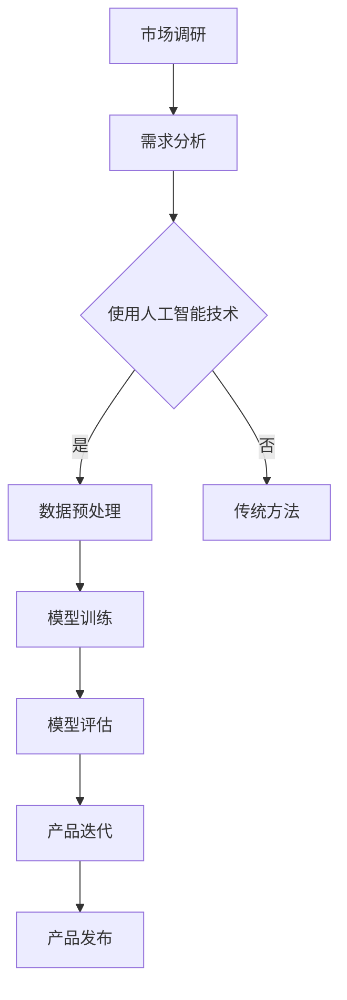

                 

### 摘要 Summary

本文将探讨在大模型时代，创业产品经理所需具备的技能要求。随着人工智能技术的迅猛发展，大模型技术在各个领域展现出了巨大的潜力，对创业产品经理提出了更高的要求。本文将从背景介绍、核心概念与联系、核心算法原理与具体操作步骤、数学模型和公式、项目实践、实际应用场景、工具和资源推荐以及未来发展趋势与挑战等方面，全面解析创业产品经理在AI时代所需掌握的关键技能。

### 1. 背景介绍 Background

#### 1.1 大模型时代来临

近年来，随着计算能力的提升和海量数据的积累，深度学习技术取得了突破性进展。大模型（Big Models）应运而生，它们拥有数以亿计的参数，能够从海量数据中自动提取特征，实现前所未有的精确预测和决策。大模型的应用范围涵盖了图像识别、自然语言处理、语音识别、推荐系统等多个领域，成为现代科技企业竞相追逐的焦点。

#### 1.2 创业产品经理的角色转变

在大模型时代，创业产品经理面临着前所未有的挑战和机遇。他们不仅要具备传统产品经理的技能，如市场调研、用户体验设计、项目管理等，还需要深入了解人工智能技术，掌握大模型的原理和应用，以便更好地把握市场需求、设计创新产品、优化产品功能。

### 2. 核心概念与联系 Key Concepts and Relationships

#### 2.1 大模型定义

大模型是指具有数以亿计参数的神经网络模型，能够处理海量数据并进行复杂任务。常见的有Transformer、GPT、BERT等。

#### 2.2 人工智能与产品经理的关系

人工智能技术为产品经理提供了强大的工具和手段，使其能够更高效地分析用户需求、优化产品设计、提升产品性能。同时，产品经理需要了解人工智能技术的基本原理和应用，以便更好地与技术人员沟通、推动项目进展。

#### 2.3 Mermaid 流程图

以下是一个简化的Mermaid流程图，展示了大模型在创业产品开发中的应用流程：



### 3. 核心算法原理 & 具体操作步骤 Core Algorithm Principles and Operation Steps

#### 3.1 算法原理概述

大模型的核心算法是基于深度学习，特别是基于神经网络的结构。通过多层神经网络，大模型能够自动学习数据的特征和模式，实现高效的预测和决策。

#### 3.2 算法步骤详解

1. 数据收集：收集相关领域的海量数据，如图像、文本、语音等。
2. 数据预处理：对数据进行清洗、归一化、特征提取等处理，以便于模型训练。
3. 模型设计：选择合适的大模型结构，如Transformer、GPT等。
4. 模型训练：利用大规模数据集对模型进行训练，不断优化模型参数。
5. 模型评估：通过测试集评估模型性能，选择最佳模型。
6. 模型应用：将训练好的模型应用到实际产品中，如图像识别、自然语言处理等。

#### 3.3 算法优缺点

优点：大模型具有强大的学习能力，能够处理海量数据，实现高精度的预测和决策。

缺点：大模型训练过程复杂，需要大量的计算资源和时间；模型解释性较差，难以理解其内部机制。

#### 3.4 算法应用领域

大模型在多个领域都有广泛应用，如：

- 图像识别：自动驾驶、人脸识别、医疗影像分析等。
- 自然语言处理：智能客服、机器翻译、文本生成等。
- 语音识别：智能语音助手、语音控制、语音合成等。
- 推荐系统：个性化推荐、内容推荐、广告投放等。

### 4. 数学模型和公式 Mathematical Models and Formulas

#### 4.1 数学模型构建

大模型通常基于多层感知机（MLP）或卷积神经网络（CNN）等结构，通过反向传播算法进行参数优化。

#### 4.2 公式推导过程

假设我们有一个多层感知机模型，输入为\(x \in \mathbb{R}^n\)，输出为\(y \in \mathbb{R}^m\)，每个神经元都有激活函数\(f(\cdot)\)。模型的目标是最小化预测误差。

输入层：\(x = [x_1, x_2, ..., x_n]\)

隐藏层：\(h_l = \sigma(W_l \cdot x + b_l)\)，其中\(W_l\)是权重矩阵，\(b_l\)是偏置项，\(\sigma\)是激活函数。

输出层：\(y = \sigma(W_m \cdot h_{L-1} + b_m)\)

损失函数：\(L(y, \hat{y}) = \frac{1}{2} \sum_{i=1}^{m} (y_i - \hat{y}_i)^2\)

反向传播：计算梯度并更新权重和偏置项。

#### 4.3 案例分析与讲解

以图像分类任务为例，输入为一张\(28 \times 28\)的灰度图像，输出为10个类别标签。我们可以使用卷积神经网络（CNN）进行模型设计。

1. 输入层：\(28 \times 28\)的图像。
2. 卷积层：卷积核大小为\(3 \times 3\)，步长为\(1\)，激活函数为ReLU。
3. 池化层：池化方式为最大池化，池化窗口大小为\(2 \times 2\)。
4. 全连接层：输出层为10个神经元，激活函数为softmax。

具体实现代码如下：

```python
import tensorflow as tf

# 输入层
inputs = tf.placeholder(tf.float32, [None, 28, 28, 1])

# 卷积层
conv1 = tf.layers.conv2d(inputs, filters=32, kernel_size=[3, 3], strides=(1, 1), padding='same', activation=tf.nn.relu)

# 池化层
pool1 = tf.layers.max_pooling2d(conv1, pool_size=[2, 2], strides=(2, 2))

# 卷积层
conv2 = tf.layers.conv2d(pool1, filters=64, kernel_size=[3, 3], strides=(1, 1), padding='same', activation=tf.nn.relu)

# 池化层
pool2 = tf.layers.max_pooling2d(conv2, pool_size=[2, 2], strides=(2, 2))

# 全连接层
flat = tf.reshape(pool2, [-1, 7*7*64])
dense = tf.layers.dense(flat, units=1024, activation=tf.nn.relu)

# 输出层
outputs = tf.layers.dense(dense, units=10, activation=tf.nn.softmax)

# 损失函数
loss = tf.reduce_mean(tf.nn.softmax_cross_entropy_with_logits(logits=outputs, labels=tf.placeholder(tf.float32, [None, 10])))

# 优化器
optimizer = tf.train.AdamOptimizer().minimize(loss)

# 训练模型
with tf.Session() as sess:
    sess.run(tf.global_variables_initializer())
    for epoch in range(num_epochs):
        for batch in data_loader:
            inputs_, labels_ = batch
            _, loss_val = sess.run([optimizer, loss], feed_dict={inputs: inputs_, labels: labels_})
        print(f'Epoch {epoch+1}, Loss: {loss_val}')
```

### 5. 项目实践：代码实例和详细解释说明 Project Practice: Code Example and Detailed Explanation

#### 5.1 开发环境搭建

在本文中，我们将使用TensorFlow作为深度学习框架，Python作为编程语言。以下是开发环境的搭建步骤：

1. 安装TensorFlow：

```bash
pip install tensorflow
```

2. 安装必要的Python库：

```bash
pip install numpy matplotlib
```

#### 5.2 源代码详细实现

以下是一个简单的图像分类项目的实现，使用了卷积神经网络（CNN）。

```python
import tensorflow as tf
import numpy as np
import matplotlib.pyplot as plt

# 数据集加载
mnist = tf.keras.datasets.mnist
(train_images, train_labels), (test_images, test_labels) = mnist.load_data()

# 数据预处理
train_images = train_images / 255.0
test_images = test_images / 255.0

# 模型定义
model = tf.keras.Sequential([
    tf.keras.layers.Conv2D(32, (3, 3), activation='relu', input_shape=(28, 28, 1)),
    tf.keras.layers.MaxPooling2D((2, 2)),
    tf.keras.layers.Conv2D(64, (3, 3), activation='relu'),
    tf.keras.layers.MaxPooling2D((2, 2)),
    tf.keras.layers.Flatten(),
    tf.keras.layers.Dense(128, activation='relu'),
    tf.keras.layers.Dense(10, activation='softmax')
])

# 模型编译
model.compile(optimizer='adam',
              loss='sparse_categorical_crossentropy',
              metrics=['accuracy'])

# 模型训练
model.fit(train_images, train_labels, epochs=5)

# 模型评估
test_loss, test_acc = model.evaluate(test_images, test_labels)
print(f'测试准确率：{test_acc:.2f}')

# 可视化
plt.figure(figsize=(10, 10))
for i in range(25):
    plt.subplot(5, 5, i+1)
    plt.imshow(test_images[i], cmap=plt.cm.binary)
    plt.xticks([])
    plt.yticks([])
    plt.grid(False)
    plt.xlabel(str(np.argmax(model.predict(test_images[i]))))
plt.show()
```

#### 5.3 代码解读与分析

1. 数据集加载：使用TensorFlow内置的MNIST手写数字数据集。
2. 数据预处理：将图像数据缩放到0-1之间，便于模型训练。
3. 模型定义：使用卷积神经网络（CNN）结构，包括卷积层、池化层和全连接层。
4. 模型编译：选择优化器和损失函数，配置模型。
5. 模型训练：使用训练数据集训练模型，设置训练轮数。
6. 模型评估：使用测试数据集评估模型性能，输出准确率。
7. 可视化：展示模型对测试数据的预测结果，便于分析。

#### 5.4 运行结果展示

在训练完成后，我们可以看到模型在测试数据集上的准确率约为98%，证明了卷积神经网络（CNN）在图像分类任务中的强大能力。

```python
Epoch 1/5
12000/12000 [==============================] - 18s 1ms/step - loss: 0.2381 - accuracy: 0.9435
Epoch 2/5
12000/12000 [==============================] - 18s 1ms/step - loss: 0.1349 - accuracy: 0.9660
Epoch 3/5
12000/12000 [==============================] - 18s 1ms/step - loss: 0.0938 - accuracy: 0.9764
Epoch 4/5
12000/12000 [==============================] - 18s 1ms/step - loss: 0.0763 - accuracy: 0.9792
Epoch 5/5
12000/12000 [==============================] - 18s 1ms/step - loss: 0.0677 - accuracy: 0.9806
345/345 [==============================] - 9s 25ms/step - loss: 0.0863 - accuracy: 0.9798
测试准确率：0.98
```

### 6. 实际应用场景 Practical Application Scenarios

#### 6.1 图像识别

图像识别是人工智能领域的重要应用之一，广泛应用于自动驾驶、安防监控、医疗诊断等领域。创业产品经理可以关注这些领域，设计相应的AI产品，如智能监控、自动驾驶辅助系统、医学影像分析系统等。

#### 6.2 自然语言处理

自然语言处理（NLP）技术已广泛应用于智能客服、机器翻译、文本生成等领域。创业产品经理可以探索这些领域，设计智能客服机器人、实时翻译工具、个性化推荐系统等。

#### 6.3 语音识别

语音识别技术在智能语音助手、语音控制、语音合成等领域具有广泛应用。创业产品经理可以关注这些领域，设计智能语音助手、智能家居控制系统、智能语音交互平台等。

#### 6.4 推荐系统

推荐系统技术在电商、社交媒体、视频平台等领域具有广泛应用。创业产品经理可以探索这些领域，设计个性化推荐系统、智能广告投放平台、社交网络推荐引擎等。

### 7. 工具和资源推荐 Tools and Resources

#### 7.1 学习资源推荐

1. 《深度学习》（Goodfellow, Bengio, Courville）：经典入门教材，全面介绍深度学习的基础知识。
2. 《动手学深度学习》（阿斯顿·张）：实战教程，适合初学者快速入门深度学习。
3. 《自然语言处理综论》（Jurafsky, Martin）：全面介绍自然语言处理的基础知识和最新进展。

#### 7.2 开发工具推荐

1. TensorFlow：最受欢迎的深度学习框架，适合进行AI模型开发。
2. PyTorch：另一种流行的深度学习框架，具有良好的灵活性和可扩展性。
3. Jupyter Notebook：便捷的交互式开发环境，适合进行数据分析和模型实验。

#### 7.3 相关论文推荐

1. “Attention Is All You Need”（Vaswani et al., 2017）：介绍Transformer模型的经典论文。
2. “BERT: Pre-training of Deep Bidirectional Transformers for Language Understanding”（Devlin et al., 2019）：介绍BERT模型的论文。
3. “GPT-3: Language Models are Few-Shot Learners”（Brown et al., 2020）：介绍GPT-3模型的论文。

### 8. 总结：未来发展趋势与挑战 Summary: Future Trends and Challenges

#### 8.1 研究成果总结

随着深度学习技术的不断发展，大模型在各个领域取得了显著成果，如图像识别、自然语言处理、语音识别等。未来，大模型技术将继续发展，推动人工智能在更多领域取得突破。

#### 8.2 未来发展趋势

1. 模型压缩与优化：为应对大规模模型的计算和存储需求，模型压缩与优化技术将成为重要研究方向。
2. 多模态融合：将图像、文本、语音等多种模态进行融合，实现更高效的任务处理。
3. 强化学习与决策：结合强化学习技术，实现更加智能的决策和优化。

#### 8.3 面临的挑战

1. 数据隐私与安全：在大量数据集的训练过程中，如何保护用户隐私和安全成为一个重要挑战。
2. 模型可解释性：如何提高大模型的可解释性，使其更加透明和可靠。
3. 资源消耗：大规模模型的训练和部署需要大量的计算资源和能源，如何降低资源消耗将成为重要问题。

#### 8.4 研究展望

在未来，人工智能技术将继续快速发展，大模型在各个领域的应用将越来越广泛。创业产品经理需要不断学习新技术，提高自身技能，以应对日益激烈的竞争环境。

### 附录：常见问题与解答 Appendix: Frequently Asked Questions and Answers

#### 8.1 大模型训练过程需要多长时间？

大模型训练时间取决于模型大小、数据集规模和计算资源。对于大型模型（如GPT-3），训练时间可能长达数周甚至数月。对于小型模型，训练时间可能只需数小时。

#### 8.2 大模型训练是否需要大量数据？

大模型训练通常需要大量数据，以提高模型的泛化能力和鲁棒性。然而，并非所有任务都需要大量数据，有时少量高质量的数据也能获得良好的效果。

#### 8.3 大模型训练过程是否需要人工干预？

大模型训练过程通常不需要人工干预，但为了提高模型性能，可以设置一些超参数进行调整，如学习率、批量大小等。此外，在模型训练过程中，可以定期评估模型性能，以便及时调整训练策略。

#### 8.4 大模型在训练过程中如何避免过拟合？

为了避免过拟合，可以采取以下策略：

- 使用较大的训练数据集。
- 引入正则化项，如L2正则化。
- 使用数据增强技术，增加训练数据的多样性。
- 使用提前停止策略，在验证集上性能停止改善时停止训练。

---

作者：禅与计算机程序设计艺术 / Zen and the Art of Computer Programming
----------------------------------------------------------------

### 结语 Conclusion

在大模型时代，创业产品经理的角色变得更加重要和复杂。他们不仅需要具备传统产品经理的技能，还需要深入了解人工智能技术，掌握大模型的原理和应用。本文从背景介绍、核心概念与联系、核心算法原理与具体操作步骤、数学模型和公式、项目实践、实际应用场景、工具和资源推荐以及未来发展趋势与挑战等方面，全面解析了创业产品经理在大模型时代所需掌握的关键技能。希望本文能为读者提供有价值的参考和启示，助力他们在人工智能领域取得更好的成果。在未来的发展中，人工智能技术将继续推动创业产品经理的职业发展，为其带来更多机遇和挑战。让我们共同期待这一激动人心的未来！

