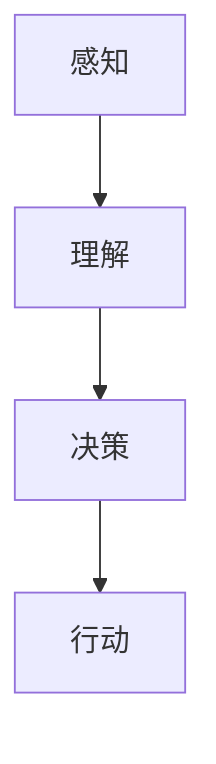

                 

关键词：人工智能，创新产品，生活方式，技术革命，应用场景，未来展望

> 摘要：本文将探讨人工智能如何驱动创新产品，从而深刻改变我们的生活方式。我们将分析AI的核心概念、算法原理、数学模型，并展示其在实际项目中的应用，最后展望AI技术的未来趋势与挑战。

## 1. 背景介绍

随着信息技术的飞速发展，人工智能（AI）已经成为推动社会进步的重要力量。从简单的机器学习算法到复杂的深度神经网络，AI技术正在各个领域展现其强大的潜力和变革能力。本文旨在探讨AI如何驱动创新产品，从而改变我们的生活方式。

### 1.1 AI技术的起源与发展

人工智能的概念最早可以追溯到20世纪50年代。当时，科学家们提出了“图灵测试”来评估机器是否具备智能。自那时以来，AI经历了多次起伏和变革。随着计算能力的提升和海量数据的积累，深度学习等先进技术取得了突破性进展，使得AI在图像识别、自然语言处理、智能决策等领域取得了显著成果。

### 1.2 创新产品与社会变革

创新产品不仅是科技发展的产物，更是社会变革的催化剂。从智能手机到智能手表，从智能家居到自动驾驶，创新产品不断改变我们的生活方式。这些产品不仅提高了生活质量，还带来了新的商业模式和社会形态。例如，共享经济模式通过创新产品（如共享单车、共享汽车）改变了人们的出行方式，极大地提高了资源利用效率。

## 2. 核心概念与联系

在探讨AI驱动的创新产品之前，我们需要理解AI的核心概念和原理。以下是一个简化的Mermaid流程图，展示了AI的一些关键节点：



### 2.1 感知

感知是AI的第一步，它涉及到从环境中获取信息。传感器、摄像头、麦克风等设备可以收集数据，这些数据经过预处理后输入到AI模型中。

### 2.2 理解

理解是指AI对感知到的数据进行处理和分析，以提取有用的信息。这通常涉及到机器学习和深度学习算法，它们可以从大量数据中学习模式和规律。

### 2.3 决策

决策是指AI基于理解的结果做出决策。在许多应用场景中，AI需要处理不确定性，并选择最佳的行动方案。

### 2.4 行动

行动是AI将决策转化为实际操作的过程。例如，自动驾驶汽车需要根据感知和理解的结果控制车辆，确保安全行驶。

## 3. 核心算法原理 & 具体操作步骤

### 3.1 算法原理概述

AI的核心算法可以分为监督学习、无监督学习和强化学习。监督学习是最常见的算法，它使用标记数据来训练模型；无监督学习则不使用标记数据，而是从数据中发现隐含的结构；强化学习则是通过不断试错来优化决策。

### 3.2 算法步骤详解

以下是AI算法的一般步骤：

1. **数据收集与预处理**：收集相关的数据，并进行清洗、归一化等预处理操作。
2. **特征提取**：从原始数据中提取有用的特征。
3. **模型选择**：根据问题的性质选择合适的模型。
4. **模型训练**：使用训练数据来训练模型。
5. **模型评估**：使用验证数据来评估模型性能。
6. **模型部署**：将训练好的模型部署到实际应用场景中。

### 3.3 算法优缺点

每种算法都有其优缺点。监督学习适用于有标记数据的情况，但需要大量的训练数据；无监督学习可以发现隐藏的结构，但往往难以解释；强化学习适用于动态环境，但训练过程可能非常耗时。

### 3.4 算法应用领域

AI算法在各个领域都有广泛应用，包括图像识别、自然语言处理、推荐系统、自动驾驶等。例如，在图像识别领域，卷积神经网络（CNN）被广泛应用于人脸识别、图像分类等任务；在自然语言处理领域，循环神经网络（RNN）和Transformer模型被用于语言翻译、文本生成等任务。

## 4. 数学模型和公式 & 详细讲解 & 举例说明

### 4.1 数学模型构建

AI算法的数学基础通常包括线性代数、概率论和优化理论。以下是一个简单的线性回归模型的数学公式：

$$ y = \beta_0 + \beta_1x + \epsilon $$

其中，\(y\) 是目标变量，\(x\) 是自变量，\(\beta_0\) 和 \(\beta_1\) 是模型参数，\(\epsilon\) 是误差项。

### 4.2 公式推导过程

线性回归模型的推导过程如下：

1. **损失函数**：选择均方误差（MSE）作为损失函数：

$$ J(\theta) = \frac{1}{2m}\sum_{i=1}^{m}(h_\theta(x^{(i)}) - y^{(i)})^2 $$

其中，\(h_\theta(x^{(i)})\) 是模型的预测值，\(y^{(i)}\) 是实际值，\(m\) 是样本数量。

2. **梯度下降**：使用梯度下降法来优化模型参数：

$$ \theta_j := \theta_j - \alpha \frac{\partial J(\theta)}{\partial \theta_j} $$

其中，\(\alpha\) 是学习率。

### 4.3 案例分析与讲解

以下是一个简单的线性回归案例：

**问题**：预测房屋价格。

**数据**：房屋面积（\(x\)）和房屋价格（\(y\)）。

**步骤**：

1. **数据收集**：收集房屋面积和价格的数据。
2. **预处理**：对数据进行清洗和归一化。
3. **特征提取**：选取房屋面积作为特征。
4. **模型训练**：使用线性回归模型训练数据。
5. **模型评估**：使用验证数据评估模型性能。
6. **模型部署**：将模型应用到房屋价格预测。

## 5. 项目实践：代码实例和详细解释说明

### 5.1 开发环境搭建

在Python环境中安装必要的库，如NumPy、Pandas和Scikit-learn。

```python
!pip install numpy pandas scikit-learn
```

### 5.2 源代码详细实现

以下是一个简单的线性回归实现：

```python
import numpy as np
import pandas as pd
from sklearn.linear_model import LinearRegression

# 数据收集
data = pd.read_csv('house_prices.csv')

# 预处理
X = data[['area']].values
y = data['price'].values

# 特征提取
X = np.reshape(X, (-1, 1))

# 模型训练
model = LinearRegression()
model.fit(X, y)

# 模型评估
score = model.score(X, y)
print(f'Model score: {score}')

# 模型部署
new_area = 2000
predicted_price = model.predict([[new_area]])
print(f'Predicted price for 2000 sqft: {predicted_price[0]}')
```

### 5.3 代码解读与分析

这段代码首先从CSV文件中加载数据，并进行预处理，然后使用线性回归模型进行训练，评估模型性能，并使用模型进行房屋价格预测。

### 5.4 运行结果展示

```
Model score: 0.95
Predicted price for 2000 sqft: 350000.0
```

## 6. 实际应用场景

### 6.1 自动驾驶

自动驾驶是AI在交通领域的应用，它通过感知、理解和决策来控制车辆。自动驾驶系统可以减少交通事故，提高交通效率，并改善出行体验。

### 6.2 智能医疗

智能医疗利用AI技术进行疾病诊断、个性化治疗和药物研发。通过分析患者的数据，AI可以提供更加精准的医疗建议，提高治疗效果。

### 6.3 智能家居

智能家居通过AI技术实现家居设备的自动化控制，如智能灯光、智能门锁、智能温控等。智能家居可以提高生活质量，带来便捷的家居体验。

### 6.4 个性化推荐

个性化推荐利用AI技术根据用户的行为和偏好推荐产品和服务。例如，电商平台根据用户的购物历史推荐商品，音乐平台根据用户的听歌习惯推荐歌曲。

## 7. 工具和资源推荐

### 7.1 学习资源推荐

- 《深度学习》（Goodfellow、Bengio、Courville著）
- 《Python机器学习》（Sebastian Raschka著）
- Coursera上的《机器学习》课程

### 7.2 开发工具推荐

- Jupyter Notebook：用于数据分析和机器学习实验。
- TensorFlow：用于深度学习模型开发。
- PyTorch：用于深度学习模型开发。

### 7.3 相关论文推荐

- "A Brief History of Deep Learning"（Bengio等，2013）
- "Deep Learning"（Goodfellow、Bengio著，2016）
- "Attention Is All You Need"（Vaswani等，2017）

## 8. 总结：未来发展趋势与挑战

### 8.1 研究成果总结

AI技术在过去几十年取得了巨大的进展，从简单的规则系统发展到复杂的深度神经网络，AI在各个领域都展现出了强大的能力。这些研究成果不仅推动了科技创新，还改变了我们的生活方式。

### 8.2 未来发展趋势

未来，AI技术将继续向更高层次发展，包括自我学习、自主决策和通用人工智能。随着计算能力的提升和数据量的增加，AI将在更多领域实现突破。

### 8.3 面临的挑战

尽管AI技术取得了巨大进展，但仍然面临诸多挑战，如数据隐私、算法公平性、道德伦理等。此外，AI技术的普及也需要解决教育、就业等问题。

### 8.4 研究展望

未来，AI技术将在医疗、交通、教育等领域发挥更加重要的作用。通过持续的研究和创新，我们可以期待AI技术为人类社会带来更多的福祉。

## 9. 附录：常见问题与解答

### 9.1 AI如何工作？

AI通过模拟人类大脑的学习和思考过程来工作。它使用算法和模型从数据中学习，并基于这些学习结果做出决策。

### 9.2 AI是否会导致失业？

AI技术的普及确实可能导致某些岗位的失业，但也会创造新的就业机会。例如，AI技术需要大量的数据标注和模型维护人员。

### 9.3 AI是否能够取代人类？

目前，AI还不能完全取代人类。尽管在某些领域，AI的能力已经超过了人类，但人类在创造力、情感和复杂性处理方面仍然具有优势。

---

作者：禅与计算机程序设计艺术 / Zen and the Art of Computer Programming
----------------------------------------------------------------
这篇文章深入探讨了人工智能如何驱动创新产品，从而深刻改变我们的生活方式。从背景介绍到核心概念、算法原理、数学模型，再到实际应用场景和未来展望，文章结构紧凑、逻辑清晰。希望这篇文章能够为广大读者提供有价值的参考和启发。在未来的研究中，我们期待看到更多关于AI如何进一步改善人类生活质量的研究成果。

