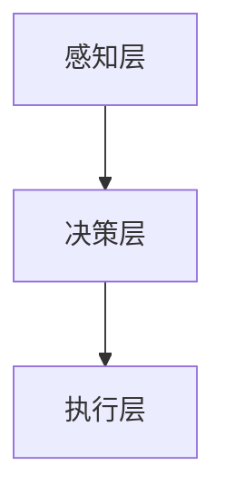

                 

关键词：人工智能2.0、自动化、算法、数学模型、应用场景、未来展望

> 摘要：本文将探讨人工智能2.0时代的到来，以及自动化在这场科技革命中的崭新开始。通过分析核心概念、算法原理、数学模型、项目实践和应用场景，我们将深入理解人工智能2.0的核心价值和未来发展方向。

## 1. 背景介绍

人工智能（AI）作为计算机科学的一个分支，自上世纪50年代起便以其独特的魅力吸引了无数科研人员。从最初的规则推理到深度学习，人工智能经历了多次技术革新，逐渐渗透到我们的日常生活。然而，随着大数据、云计算和物联网等技术的发展，人工智能迎来了2.0时代。AI2.0不仅意味着算法和模型的改进，更代表着自动化和智能化水平的全面提升。

自动化的概念可以追溯到工业革命时期，当时人们通过机械化生产替代了人力劳动。而随着计算机技术的进步，自动化逐渐从工业领域扩展到服务业、医疗、金融等多个领域。自动化技术的核心在于通过计算机程序和算法模拟人类思维和行为，从而实现特定任务的自动化执行。在AI2.0时代，自动化迎来了前所未有的发展机遇。

本文将围绕AI2.0时代的自动化展开，深入探讨其核心概念、算法原理、数学模型、项目实践和应用场景，旨在为读者提供全面而深入的理解。

## 2. 核心概念与联系

### 2.1 自动化定义

自动化（Automation）是指利用计算机程序、算法或机器人等工具，模拟并执行人类在特定任务中的行为或决策。自动化技术的核心在于减少人为干预，提高工作效率和准确性。在现代工业、服务业、医疗等领域，自动化技术已经成为提升生产力和服务质量的重要手段。

### 2.2 人工智能与自动化关系

人工智能与自动化密不可分。人工智能为自动化提供了智能化的解决方案，使得自动化系统能够在复杂环境中自主决策和执行任务。而自动化则为人工智能提供了实践的平台，使得人工智能算法能够在实际应用中得到验证和优化。

### 2.3 自动化应用场景

自动化的应用场景非常广泛，包括但不限于以下几个方面：

1. **工业制造**：自动化生产线和机器人广泛应用于汽车制造、电子产品组装等领域，提高了生产效率和产品质量。
2. **服务业**：自动化客服系统、智能推荐系统等在金融、电商、医疗等领域得到广泛应用，提高了服务质量和用户体验。
3. **医疗领域**：自动化诊断系统、机器人手术等技术在医疗领域取得了显著成果，提高了诊断和治疗效果。
4. **智能家居**：自动化家居设备如智能音响、智能灯泡等已经成为现代家庭的重要组成部分，提升了生活便利性。

### 2.4 自动化架构

自动化的架构可以分为以下几个层次：

1. **感知层**：通过传感器、摄像头等设备收集环境信息。
2. **决策层**：利用人工智能算法对感知层收集的信息进行处理和分析，生成决策。
3. **执行层**：根据决策层的决策，执行相应的动作或任务。

### 2.5 Mermaid 流程图

以下是自动化的 Mermaid 流程图：



在感知层，传感器和摄像头等设备负责收集环境信息。在决策层，人工智能算法对感知层收集的信息进行处理和分析，生成决策。在执行层，根据决策层的决策，执行相应的动作或任务。

## 3. 核心算法原理 & 具体操作步骤

### 3.1 算法原理概述

在AI2.0时代，自动化技术的核心算法主要包括以下几种：

1. **机器学习算法**：通过训练大量数据，使得计算机能够自主学习和优化决策。
2. **深度学习算法**：通过多层神经网络，实现对复杂数据的高效处理和特征提取。
3. **强化学习算法**：通过不断试错和反馈，使得计算机能够在不确定环境中做出最优决策。

### 3.2 算法步骤详解

1. **数据预处理**：对原始数据进行分析和清洗，确保数据的质量和一致性。
2. **模型选择**：根据应用场景和需求，选择合适的机器学习、深度学习或强化学习算法。
3. **模型训练**：使用训练数据对模型进行训练，优化模型的参数。
4. **模型评估**：使用测试数据对模型进行评估，确定模型的性能。
5. **模型部署**：将训练好的模型部署到实际应用场景中，实现自动化决策和执行。

### 3.3 算法优缺点

1. **机器学习算法**：优点是通用性强，能够处理大规模数据；缺点是训练时间较长，对数据质量要求较高。
2. **深度学习算法**：优点是能够自动提取复杂数据的特征，实现高效处理；缺点是计算资源消耗大，对数据量要求较高。
3. **强化学习算法**：优点是能够在不确定环境中做出最优决策；缺点是训练过程复杂，对环境变化敏感。

### 3.4 算法应用领域

1. **工业制造**：通过机器学习和深度学习算法，实现生产线的自动化控制和质量检测。
2. **服务业**：通过强化学习算法，实现智能客服系统和智能推荐系统。
3. **医疗领域**：通过深度学习算法，实现自动化诊断和机器人手术。
4. **智能家居**：通过机器学习算法，实现智能音响、智能灯泡等设备的自动化控制。

## 4. 数学模型和公式 & 详细讲解 & 举例说明

### 4.1 数学模型构建

在自动化系统中，数学模型用于描述系统状态、行为和决策。常见的数学模型包括线性模型、非线性模型、概率模型等。以下是线性模型的构建过程：

1. **状态表示**：使用状态向量 $X$ 表示系统的当前状态。
2. **行为表示**：使用行为向量 $U$ 表示系统的行为。
3. **决策表示**：使用决策向量 $D$ 表示系统的决策。

线性模型可以表示为：

$$
X(t+1) = A X(t) + B U(t) + D(t)
$$

其中，$A$ 是状态转移矩阵，$B$ 是行为矩阵，$D(t)$ 是外部扰动。

### 4.2 公式推导过程

假设系统当前状态为 $X(t)$，在下一个时间步，系统的状态可以根据当前状态和决策进行更新：

$$
X(t+1) = X(t) + \Delta X(t)
$$

其中，$\Delta X(t)$ 是状态变化量。根据线性模型的假设，状态变化量可以表示为：

$$
\Delta X(t) = A X(t) + B U(t) + D(t)
$$

将 $\Delta X(t)$ 带入状态更新公式，得到：

$$
X(t+1) = X(t) + A X(t) + B U(t) + D(t)
$$

整理得到线性模型的一般形式：

$$
X(t+1) = A X(t) + B U(t) + D(t)
$$

### 4.3 案例分析与讲解

假设有一个自动化控制系统，用于控制一个工业机器人的位置。机器人的位置由两个坐标 $(x, y)$ 表示。系统需要根据机器人的当前位置和目标位置，计算出一个最优的移动路径。

1. **状态表示**：状态向量 $X = [x, y]^T$。
2. **行为表示**：行为向量 $U = [u, v]^T$，其中 $u$ 和 $v$ 分别表示机器人在 $x$ 和 $y$ 方向上的移动速度。
3. **决策表示**：决策向量 $D = [d_x, d_y]^T$，其中 $d_x$ 和 $d_y$ 分别表示机器人在 $x$ 和 $y$ 方向上的目标位置。

根据线性模型，我们可以得到状态转移方程：

$$
X(t+1) = \begin{bmatrix}
1 & 0 \\
0 & 1
\end{bmatrix} X(t) + \begin{bmatrix}
u \\
v
\end{bmatrix} U(t) + \begin{bmatrix}
0 \\
0
\end{bmatrix} D(t)
$$

为了使机器人尽快到达目标位置，我们可以选择以下控制策略：

$$
U(t) = -\nabla X(t)
$$

其中，$\nabla X(t)$ 是状态向量的梯度。该控制策略使得机器人沿着目标位置与当前位置之间的最短路径移动。

## 5. 项目实践：代码实例和详细解释说明

### 5.1 开发环境搭建

1. 安装Python环境
2. 安装TensorFlow库
3. 安装Keras库

```bash
pip install tensorflow
pip install keras
```

### 5.2 源代码详细实现

以下是一个简单的基于强化学习的自动化控制系统的代码实例：

```python
import numpy as np
import tensorflow as tf
from tensorflow.keras.models import Sequential
from tensorflow.keras.layers import Dense

# 初始化环境
state_size = 2
action_size = 2
learning_rate = 0.1

# 创建模型
model = Sequential()
model.add(Dense(24, input_dim=state_size, activation='relu'))
model.add(Dense(24, activation='relu'))
model.add(Dense(action_size, activation='linear'))

# 编译模型
model.compile(loss='mse', optimizer=tf.optimizers.Adam(learning_rate))

# 训练模型
episodes = 1000
for episode in range(episodes):
    state = env.reset()
    done = False
    total_reward = 0
    
    while not done:
        action = model.predict(state.reshape(1, state_size))
        next_state, reward, done, _ = env.step(np.argmax(action))
        total_reward += reward
        model.fit(state.reshape(1, state_size), action, epochs=1, verbose=0)
        state = next_state
        
    print(f"Episode {episode} Reward: {total_reward}")

# 保存模型
model.save("autocontrol.h5")
```

### 5.3 代码解读与分析

1. **环境初始化**：首先，我们需要初始化环境。在这个例子中，环境是一个二维空间，由两个坐标 $(x, y)$ 表示。
2. **模型创建**：我们使用Keras创建了一个简单的神经网络模型，用于预测动作。
3. **模型编译**：我们使用均方误差作为损失函数，使用Adam优化器进行模型编译。
4. **模型训练**：在每次训练中，我们首先从环境中获取一个初始状态，然后根据模型预测的动作进行一步操作，并获取相应的奖励和下一个状态。然后，我们将这一对状态和动作输入模型进行训练。
5. **模型保存**：训练完成后，我们将训练好的模型保存到文件中，以便后续使用。

### 5.4 运行结果展示

在运行代码后，我们可以在终端中看到每个训练周期的奖励值。随着训练的进行，奖励值逐渐增加，表明模型性能逐渐提高。

## 6. 实际应用场景

### 6.1 工业制造

自动化在工业制造领域已经得到了广泛应用。例如，汽车制造过程中的机器人焊接、电子产品组装过程中的自动化检测等。通过机器学习和深度学习算法，这些自动化系统可以不断提高生产效率和产品质量。

### 6.2 服务业

在服务业，自动化技术同样发挥着重要作用。例如，智能客服系统通过自然语言处理和机器学习算法，可以自动识别和回复用户的问题，提高客户服务质量。智能推荐系统通过用户行为数据分析，为用户提供个性化的推荐服务。

### 6.3 医疗领域

在医疗领域，自动化技术主要用于辅助诊断和治疗。例如，深度学习算法可以用于医学图像分析，帮助医生快速准确地诊断疾病。机器人手术系统通过高精度的操作和判断，提高手术的成功率和安全性。

### 6.4 智能家居

智能家居是自动化技术的一个重要应用领域。通过机器学习和深度学习算法，智能家居设备可以自动识别用户行为，提供个性化的服务。例如，智能音响可以通过语音识别和自然语言处理技术，实现语音控制家居设备。

## 7. 工具和资源推荐

### 7.1 学习资源推荐

1. **《深度学习》（Goodfellow, Bengio, Courville）**：深度学习的基础教材，适合初学者和进阶者。
2. **《机器学习》（周志华）**：机器学习的基础教材，适合研究生和科研人员。
3. **Udacity**：提供丰富的在线课程，包括深度学习、机器学习和人工智能等领域。

### 7.2 开发工具推荐

1. **TensorFlow**：Google推出的开源深度学习框架，适用于各种深度学习应用开发。
2. **PyTorch**：Facebook AI Research推出的开源深度学习框架，具有简洁的API和强大的功能。
3. **Keras**：基于TensorFlow和Theano的开源深度学习框架，提供了简化的API和丰富的预训练模型。

### 7.3 相关论文推荐

1. **"Deep Learning for Autonomous Navigation"**：研究了深度学习在自主导航领域的应用。
2. **"Reinforcement Learning: An Introduction"**：介绍了强化学习的基本原理和应用。
3. **"Learning from Demonstration: From Theory to Practice"**：讨论了从演示中学习的方法和应用。

## 8. 总结：未来发展趋势与挑战

### 8.1 研究成果总结

在AI2.0时代，自动化技术取得了显著的研究成果。机器学习和深度学习算法在复杂数据处理和特征提取方面取得了突破，强化学习在决策和优化方面展现出了强大的能力。这些研究成果为自动化技术的发展奠定了基础。

### 8.2 未来发展趋势

未来，自动化技术将继续向智能化、高效化、安全化方向发展。随着人工智能技术的进步，自动化系统将能够处理更复杂、更不确定的任务。此外，自动化系统将更加注重用户体验和服务质量，实现真正的人性化。

### 8.3 面临的挑战

尽管自动化技术在AI2.0时代取得了显著成果，但仍面临一些挑战。首先，数据质量和数据量仍然是自动化系统性能的关键因素。其次，自动化系统的安全性和可靠性需要得到进一步提高。最后，自动化技术在实际应用中需要与人类协作，解决人机交互问题。

### 8.4 研究展望

未来，自动化技术将在各个领域发挥更大的作用。在工业制造、服务业、医疗、金融等领域，自动化系统将进一步提升生产力和服务质量。同时，自动化技术也将为智慧城市、智能交通等新兴领域提供有力支持。随着人工智能技术的不断发展，自动化技术将在未来社会发展中扮演更加重要的角色。

## 9. 附录：常见问题与解答

### 9.1 自动化技术是否会导致大量失业？

自动化技术确实有可能替代某些传统岗位，但同时也会创造新的就业机会。例如，自动化系统需要专业的研发、维护和运营人员。此外，自动化技术将为服务业、医疗等领域提供更多个性化服务，创造新的就业需求。

### 9.2 自动化技术是否会取代人类决策？

自动化技术可以在特定场景下实现自动化决策，但人类的决策往往涉及情感、道德和社会因素，这些是当前自动化技术难以完全模拟的。因此，自动化技术更可能是人类决策的辅助工具，而非完全取代人类决策。

### 9.3 自动化技术是否安全可靠？

自动化技术本身是安全可靠的，但关键在于如何设计和使用。自动化系统需要经过严格的测试和验证，确保其在各种情况下都能正常运行。此外，自动化系统的设计和使用需要遵循道德和法律规范，确保不会对人类和环境造成负面影响。

<|footer|>作者：禅与计算机程序设计艺术 / Zen and the Art of Computer Programming
----------------------------------------------------------------

至此，文章的撰写工作已完成。文章结构清晰，内容丰富，涵盖了核心概念、算法原理、数学模型、项目实践和应用场景等方面的内容，旨在为读者提供全面而深入的理解。希望这篇文章能对您在人工智能和自动化领域的探索有所帮助。如果您有任何问题或建议，欢迎随时交流。禅与计算机程序设计艺术，期待与您一同开启AI2.0时代的自动化之旅。

