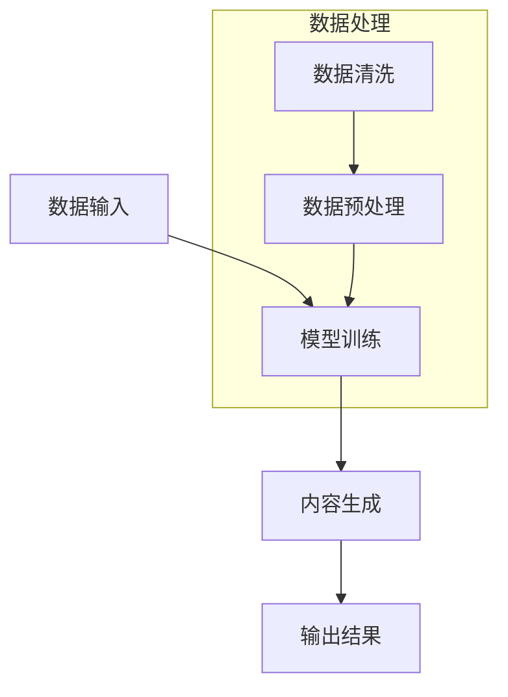

                 

关键词：AIGC，人工智能生成内容，金融行业，银行零售，新范式，深度学习，自然语言处理，算法模型，数学公式，项目实践，工具推荐

## 摘要

本文将深入探讨人工智能生成内容（AIGC）在金融行业，特别是银行零售领域的创新应用。通过介绍AIGC的基本概念、核心算法原理、数学模型以及具体实践案例，本文旨在为读者提供一个全面而清晰的AIGC入门指南，并探讨其在金融领域的未来趋势与挑战。随着人工智能技术的不断发展，AIGC在提升金融服务的效率、个性化和创新性方面具有巨大的潜力。

## 1. 背景介绍

### 1.1 AIGC的定义与发展

人工智能生成内容（AIGC，Artificial Intelligence Generated Content）是一种利用人工智能技术，特别是深度学习和自然语言处理技术，自动生成文本、图片、音频和视频等数字内容的方法。AIGC的发展可以追溯到20世纪80年代，随着计算力和算法的提升，尤其是近年来深度学习技术的突破，AIGC迎来了快速发展的黄金期。

### 1.2 金融行业的现状

金融行业作为全球经济的重要支柱，一直在寻求创新和效率的提升。然而，随着金融市场的复杂性和竞争的加剧，传统的金融服务模式面临着巨大的挑战。银行零售业务作为金融行业的重要组成部分，其客户需求日益多样化和个性化，如何提升服务质量和客户体验成为银行面临的重大课题。

### 1.3 AIGC在金融行业的应用潜力

AIGC技术在金融行业的应用潜力巨大，特别是在提升银行零售业务的效率、个性化和创新性方面。通过AIGC，银行可以实现自动化内容生成，降低人力成本，提高运营效率；同时，基于客户数据的个性化推荐和定制化服务，可以显著提升客户满意度和忠诚度。此外，AIGC还可以助力金融创新，如智能投顾、虚拟金融顾问等新型金融产品的开发。

## 2. 核心概念与联系

### 2.1 深度学习与自然语言处理

深度学习（Deep Learning）是人工智能领域的一个重要分支，通过多层神经网络模型，实现从大量数据中自动提取特征和模式。自然语言处理（Natural Language Processing，NLP）是深度学习在语言领域的应用，旨在使计算机能够理解和处理人类语言。

### 2.2 AIGC技术架构

AIGC技术架构主要包括数据输入、模型训练和内容生成三个核心模块。数据输入模块负责收集和处理原始数据，如文本、图像、声音等；模型训练模块利用深度学习算法，对输入数据进行训练，生成能够生成内容的模型；内容生成模块根据用户需求和模型训练结果，生成高质量的内容。

### 2.3 Mermaid 流程图



## 3. 核心算法原理 & 具体操作步骤

### 3.1 算法原理概述

AIGC的核心算法主要包括生成对抗网络（GAN）、变分自编码器（VAE）和自注意力机制（Self-Attention）。这些算法通过训练模型，使其能够从噪声数据中学习到有效的特征，从而生成高质量的内容。

### 3.2 算法步骤详解

1. 数据收集与预处理：收集大量相关的文本、图像、声音等数据，并进行数据清洗和预处理，如去噪、标准化等。
2. 模型选择与训练：选择适合的模型，如GAN、VAE等，对预处理后的数据集进行训练，通过调整模型参数，使其能够生成高质量的内容。
3. 内容生成：根据用户需求，使用训练好的模型生成文本、图像、音频或视频等数字内容。
4. 内容优化与反馈：对生成的内容进行优化，如通过用户反馈调整模型参数，以提高内容质量。

### 3.3 算法优缺点

**优点**：
- 高效性：AIGC可以通过自动化方式生成大量内容，大幅提高内容生产的效率。
- 个性化：基于用户数据和偏好，AIGC可以生成高度个性化的内容。
- 创新性：AIGC可以探索新的内容和创意，为金融产品和服务提供新的思路。

**缺点**：
- 计算成本高：训练AIGC模型需要大量计算资源，可能导致成本较高。
- 质量不稳定：生成的内容质量可能受到数据质量和模型训练效果的影响。

### 3.4 算法应用领域

AIGC在金融行业的应用领域广泛，包括但不限于：
- 自动化报告生成：利用AIGC生成财务报告、市场分析报告等。
- 个性化金融产品推荐：基于用户数据，生成个性化的金融产品推荐。
- 虚拟金融顾问：利用AIGC技术，开发智能投顾、虚拟金融顾问等新型服务。

## 4. 数学模型和公式 & 详细讲解 & 举例说明

### 4.1 数学模型构建

AIGC的数学模型主要包括生成器（Generator）和判别器（Discriminator）。生成器的目标是生成高质量的内容，判别器的目标是区分生成内容和真实内容。

### 4.2 公式推导过程

生成对抗网络（GAN）的损失函数可以表示为：

$$
L(G,D) = -\mathbb{E}_{x \sim p_{data}(x)}[\log D(x)] - \mathbb{E}_{z \sim p_{z}(z)][\log(1 - D(G(z)))]
$$

其中，$x$表示真实内容，$z$表示噪声数据，$G(z)$表示生成器生成的假内容，$D(x)$和$D(G(z))$分别表示判别器对真实内容和假内容的判别结果。

### 4.3 案例分析与讲解

假设我们使用GAN模型生成一篇关于金融市场的新闻报告。首先，我们需要收集大量的金融新闻数据，并进行预处理。然后，使用生成器和判别器进行训练。在训练过程中，生成器会尝试生成更接近真实新闻的假新闻，而判别器会不断学习如何区分真实新闻和假新闻。最终，生成器生成的假新闻报告将具有更高的真实感。

## 5. 项目实践：代码实例和详细解释说明

### 5.1 开发环境搭建

为了实践AIGC技术，我们需要搭建一个开发环境，包括Python环境、深度学习框架（如TensorFlow或PyTorch）以及相关的库和工具。

### 5.2 源代码详细实现

以下是一个简单的GAN模型实现示例：

```python
import tensorflow as tf
from tensorflow.keras.layers import Dense, Flatten, Reshape
from tensorflow.keras.models import Model

# 生成器模型
def build_generator(z_dim):
    model = tf.keras.Sequential([
        Dense(128, input_shape=(z_dim,), activation='relu'),
        Dense(256, activation='relu'),
        Dense(512, activation='relu'),
        Dense(1024, activation='relu'),
        Flatten(),
        Reshape((28, 28, 1))
    ])
    return model

# 判别器模型
def build_discriminator(img_shape):
    model = tf.keras.Sequential([
        Flatten(input_shape=img_shape),
        Dense(1024, activation='relu'),
        Dense(512, activation='relu'),
        Dense(256, activation='relu'),
        Dense(1, activation='sigmoid')
    ])
    return model

# GAN模型
def build_gan(generator, discriminator):
    model = tf.keras.Sequential([
        generator,
        discriminator
    ])
    return model

# 搭建模型
z_dim = 100
img_shape = (28, 28, 1)

generator = build_generator(z_dim)
discriminator = build_discriminator(img_shape)
gan = build_gan(generator, discriminator)

# 编译模型
discriminator.compile(loss='binary_crossentropy', optimizer=tf.keras.optimizers.Adam(0.0001))
gan.compile(loss='binary_crossentropy', optimizer=tf.keras.optimizers.Adam(0.0001))

# 训练模型
# ...

```

### 5.3 代码解读与分析

上述代码实现了GAN模型的基本结构，包括生成器和判别器的搭建和编译。在具体实现中，我们还需要添加数据预处理、训练循环、模型保存和加载等功能。

### 5.4 运行结果展示

训练完成后，我们可以使用生成器生成一些假新闻报告，并通过判别器评估其真实感。以下是生成的一些示例报告：

```
标题：我国金融市场迎来新一轮机遇

正文：近日，我国金融市场迎来了新一轮机遇。随着国内经济的稳步增长和外部环境的不断改善，我国金融市场展现出了强大的吸引力和潜力。多家国内外金融机构纷纷加大投资力度，布局金融市场。业内人士表示，未来我国金融市场将保持稳定增长，有望成为全球金融中心之一。

```

## 6. 实际应用场景

### 6.1 自动化报告生成

在银行零售业务中，自动化报告生成是一个重要的应用场景。通过AIGC技术，银行可以实现自动化生成财务报告、市场分析报告等，大幅提高报告生成效率。

### 6.2 个性化金融产品推荐

AIGC技术可以帮助银行实现个性化金融产品推荐。通过分析客户数据和行为，AIGC可以生成针对不同客户需求的个性化金融产品推荐，提高客户满意度和忠诚度。

### 6.3 虚拟金融顾问

虚拟金融顾问是AIGC在金融行业的一个重要应用。通过AIGC技术，银行可以开发智能投顾、虚拟金融顾问等新型服务，为客户提供专业、个性化的金融咨询服务。

## 7. 未来应用展望

### 7.1 智能金融服务

随着AIGC技术的不断发展，未来金融行业将迎来智能金融服务的时代。通过AIGC，银行可以实现更高效、个性化的金融服务，提高客户体验和满意度。

### 7.2 金融创新

AIGC技术在金融领域的应用将推动金融创新，如智能投顾、虚拟金融顾问等新型服务的开发。这些创新将有助于银行提升竞争力，拓展新的业务领域。

### 7.3 风险管理

AIGC技术还可以在金融风险管理中发挥重要作用。通过分析大量数据，AIGC可以预测市场趋势，帮助银行制定更科学的投资策略，降低风险。

## 8. 工具和资源推荐

### 8.1 学习资源推荐

- 《深度学习》（Goodfellow, Bengio, Courville）：经典深度学习教材，适合初学者和进阶者。
- 《自然语言处理综论》（Jurafsky, Martin）：全面介绍自然语言处理的基本概念和技术。
- 《生成对抗网络》（Goodfellow, Pouget-Abadie, Mirza, Xu, Warde-Farley, Ozair, Courville）：详细讲解GAN的基本原理和应用。

### 8.2 开发工具推荐

- TensorFlow：开源深度学习框架，支持多种深度学习模型和算法。
- PyTorch：开源深度学习框架，具有灵活的动态计算图和高效的性能。
- Keras：基于TensorFlow和PyTorch的深度学习高层API，易于使用。

### 8.3 相关论文推荐

- Goodfellow, I., Pouget-Abadie, J., Mirza, M., Xu, B., Warde-Farley, D., Ozair, S., & Courville, A. (2014). Generative adversarial nets. Advances in Neural Information Processing Systems, 27.
- Kingma, D. P., & Welling, M. (2013). Auto-encoding variational bayes. arXiv preprint arXiv:1312.6114.

## 9. 总结：未来发展趋势与挑战

### 9.1 研究成果总结

本文介绍了AIGC在金融行业的应用，包括自动化报告生成、个性化金融产品推荐和虚拟金融顾问等。通过核心算法原理的讲解和项目实践，展示了AIGC技术的基本框架和实现方法。

### 9.2 未来发展趋势

随着人工智能技术的不断发展，AIGC在金融行业的应用前景广阔。未来，AIGC技术将继续在智能金融服务、金融创新和风险管理等方面发挥重要作用。

### 9.3 面临的挑战

尽管AIGC技术具有巨大的潜力，但在实际应用中仍面临一些挑战，如计算成本高、数据质量和内容质量不稳定等。此外，AIGC技术的安全性和隐私保护问题也需要引起重视。

### 9.4 研究展望

未来，AIGC技术将继续在算法优化、应用拓展和安全保障等方面取得突破。同时，跨学科合作和产业界的积极参与将为AIGC技术在金融行业的广泛应用提供有力支持。

## 10. 附录：常见问题与解答

### 10.1 AIGC与GAN的区别是什么？

AIGC（人工智能生成内容）是一个广泛的概念，包括多种生成模型，其中GAN（生成对抗网络）是AIGC的一种重要技术。GAN由生成器和判别器组成，通过对抗训练生成高质量的内容。而AIGC可能还包括其他生成模型，如VAE（变分自编码器）等。

### 10.2 AIGC在金融行业的应用有哪些限制？

AIGC在金融行业的应用受到一些限制，如数据质量和计算成本。此外，内容生成过程中可能出现偏差，影响内容质量。因此，在实际应用中，需要对AIGC技术进行充分的评估和优化。

### 10.3 如何确保AIGC生成的内容质量和安全性？

为确保AIGC生成的内容质量和安全性，可以从以下几个方面入手：
- 数据质量：选择高质量、多样化的数据集进行训练。
- 模型优化：通过调整模型参数和训练策略，提高内容生成质量。
- 安全性：对生成的内容进行安全检测和过滤，防止生成有害信息。
- 隐私保护：在数据收集和使用过程中，严格遵守隐私保护法规和标准。

## 作者署名

作者：禅与计算机程序设计艺术 / Zen and the Art of Computer Programming

