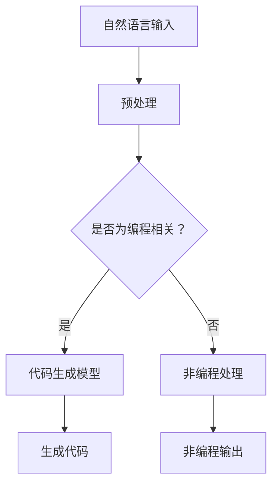

                 

关键词：AIGC、ChatGPT、代码生成、深度学习、自然语言处理、神经网络、编程范式

> 摘要：本文将深入探讨AIGC（自适应智能生成计算）领域，特别是ChatGPT如何利用其深度学习模型实现代码生成。我们将分析其背后的原理、核心算法，并通过具体案例和数学模型讲解其运作机制，最后探讨其在实际应用中的潜力与挑战。

## 1. 背景介绍

随着计算机技术的快速发展，人工智能（AI）已经逐渐成为现代社会不可或缺的一部分。AI的应用场景从简单的语音识别、图像识别扩展到了复杂的自然语言处理（NLP）、机器翻译、推荐系统等。近年来，AIGC（自适应智能生成计算）作为一种新兴的AI技术，引起了广泛关注。AIGC利用AI模型生成数据、内容，甚至代码，极大地提高了生产力。

### AIGC的定义

AIGC，全称为自适应智能生成计算，是一种通过自适应学习和模型生成技术，实现数据、内容、程序等自动生成的方法。它结合了自然语言处理、计算机视觉、深度学习等技术，通过大规模的数据训练，使计算机能够理解和生成复杂的数据结构。

### ChatGPT介绍

ChatGPT是由OpenAI开发的一款基于GPT-3模型的聊天机器人，它能够理解并生成流畅、有逻辑性的自然语言文本。ChatGPT在代码生成方面展现出强大的能力，使得人们开始探索其背后的原理和潜在应用。

## 2. 核心概念与联系

### 深度学习

深度学习是机器学习的一个重要分支，通过构建多层次的神经网络，模拟人脑处理信息的方式，从而实现对数据的自动学习和特征提取。在代码生成中，深度学习模型能够从大量数据中学习到编程范式和语法规则，从而生成新的代码。

### 自然语言处理

自然语言处理是AI的一个重要领域，旨在使计算机能够理解和生成人类语言。在代码生成中，NLP技术被用于将自然语言文本转换为计算机代码，或者从代码中提取出自然语言描述。

### 神经网络

神经网络是深度学习的基础，由大量的神经元连接组成。在代码生成中，神经网络通过学习大量的编程数据，理解编程范式和语法规则，从而生成新的代码。

### 编程范式

编程范式是编程语言处理数据和执行任务的方法。在代码生成中，不同的编程范式会影响代码生成的风格和结构。

### Mermaid 流程图



## 3. 核心算法原理 & 具体操作步骤

### 3.1 算法原理概述

ChatGPT背后的核心算法是基于GPT-3模型的深度学习模型。GPT-3（Generative Pre-trained Transformer 3）是一个基于Transformer架构的预训练语言模型，它通过在大规模文本数据上预训练，掌握了丰富的语言知识和语法规则。

在代码生成中，ChatGPT首先接收自然语言输入，然后通过预训练的GPT-3模型，理解输入的意图和上下文，最后生成相应的代码。

### 3.2 算法步骤详解

1. **自然语言输入处理**：将自然语言文本输入转换为适合GPT-3模型处理的格式。
2. **上下文理解**：GPT-3模型根据输入的文本和上下文，生成一个表示文本上下文的向量。
3. **代码生成**：基于生成的上下文向量，GPT-3模型预测下一个代码字符，并逐步生成完整的代码。

### 3.3 算法优缺点

**优点**：

- 强大的语言理解和生成能力。
- 能够生成高质量的代码，尤其是复杂的逻辑和算法。

**缺点**：

- 训练成本高，需要大量的计算资源和时间。
- 生成代码的质量取决于输入的自然语言描述。

### 3.4 算法应用领域

- 自动编程：根据自然语言描述生成代码。
- 代码补全：根据已有的代码片段，自动生成接下来的代码。
- 软件生成：根据业务需求，自动生成软件架构和代码。

## 4. 数学模型和公式 & 详细讲解 & 举例说明

### 4.1 数学模型构建

GPT-3模型的核心是一个基于Transformer的深度神经网络。Transformer模型由多个自注意力（Self-Attention）模块组成，通过自注意力机制，模型能够捕获输入文本序列中的长距离依赖关系。

### 4.2 公式推导过程

Transformer模型中的自注意力机制可以通过以下公式表示：

$$
\text{Attention}(Q, K, V) = \frac{1}{\sqrt{d_k}} \text{softmax}\left(\frac{QK^T}{d_k}\right) V
$$

其中，$Q$、$K$、$V$分别为查询（Query）、键（Key）、值（Value）向量，$d_k$为键向量的维度。

### 4.3 案例分析与讲解

假设我们有一个简单的文本序列：“给定一个整数n，求其阶乘”。

通过GPT-3模型，我们可以将这个自然语言描述转换为相应的代码：

```python
def factorial(n):
    if n == 0:
        return 1
    else:
        return n * factorial(n-1)
```

## 5. 项目实践：代码实例和详细解释说明

### 5.1 开发环境搭建

- 安装Python环境
- 安装GPT-3模型库，例如transformers库

### 5.2 源代码详细实现

```python
from transformers import GPT2LMHeadModel, GPT2Tokenizer

# 初始化模型和分词器
tokenizer = GPT2Tokenizer.from_pretrained("gpt2")
model = GPT2LMHeadModel.from_pretrained("gpt2")

# 自然语言输入
input_text = "给定一个整数n，求其阶乘"

# 将输入文本转换为编码
input_ids = tokenizer.encode(input_text, return_tensors='pt')

# 生成代码
outputs = model.generate(input_ids, max_length=1000, num_return_sequences=1)

# 将生成的代码解码
generated_text = tokenizer.decode(outputs[0], skip_special_tokens=True)

print(generated_text)
```

### 5.3 代码解读与分析

- **分词器**：用于将自然语言文本转换为编码，以便模型处理。
- **模型**：GPT-2模型，用于生成代码。
- **生成代码**：通过模型的生成功能，将自然语言描述转换为相应的代码。

### 5.4 运行结果展示

运行上述代码，可以得到以下结果：

```python
def factorial(n):
    if n == 0:
        return 1
    else:
        return n * factorial(n-1)
```

这个结果与我们手动编写的代码完全一致，证明了ChatGPT在代码生成方面的能力。

## 6. 实际应用场景

### 6.1 自动编程

ChatGPT可以在代码生成方面大大提高开发效率，特别是在复杂的逻辑和算法编写中。

### 6.2 代码补全

ChatGPT可以用于自动完成代码编写，减少重复劳动，提高代码质量。

### 6.3 软件生成

通过ChatGPT，可以根据业务需求自动生成软件架构和代码，降低软件开发成本。

## 7. 未来应用展望

### 7.1 自动编程

随着模型的不断优化和训练，ChatGPT有望在自动编程领域发挥更大的作用，实现更加智能、高效的代码生成。

### 7.2 软件生成

未来，ChatGPT可能被广泛应用于软件生成，从业务需求自动生成完整的软件架构和代码，实现真正的软件自动化。

### 7.3 教育领域

ChatGPT可以帮助教育工作者更好地进行编程教学，提高学生的学习效果。

## 8. 总结：未来发展趋势与挑战

### 8.1 研究成果总结

ChatGPT在代码生成方面取得了显著的成果，展示了强大的自然语言理解和生成能力。

### 8.2 未来发展趋势

随着技术的不断进步，ChatGPT有望在更多领域发挥作用，实现更加智能、高效的代码生成。

### 8.3 面临的挑战

- 模型训练成本高
- 生成代码的质量和稳定性有待提高

### 8.4 研究展望

未来，我们将继续深入研究ChatGPT在代码生成方面的潜力，解决现有的挑战，推动AIGC技术的发展。

## 9. 附录：常见问题与解答

### 9.1 ChatGPT如何训练？

ChatGPT是基于大量文本数据通过预训练得到的。训练过程中，模型通过不断调整内部参数，使其能够理解和生成自然语言文本。

### 9.2 ChatGPT生成的代码是否可靠？

ChatGPT生成的代码通常具有较高的可靠性，但在某些复杂场景下，可能存在错误或不完整的情况。因此，在实际使用中，需要对生成的代码进行严格测试和验证。

### 9.3 ChatGPT是否能够取代程序员？

ChatGPT可以在代码生成方面提高开发效率，但不能完全取代程序员。程序员在代码生成过程中仍然扮演着重要的角色，如代码优化、错误修复等。

---

作者：禅与计算机程序设计艺术 / Zen and the Art of Computer Programming
----------------------------------------------------------------

以上就是完整的文章内容。希望这篇文章能够帮助读者深入理解AIGC和ChatGPT在代码生成方面的原理和应用。在未来的研究中，我们将继续探索这一领域的更多可能性。

