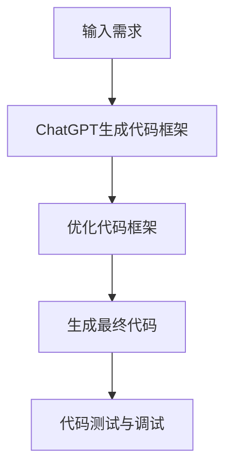

                 

关键词：AIGC，ChatGPT，代码生成，前后端开发，人工智能，编程技术

> 摘要：本文旨在介绍如何使用AIGC（人工智能生成内容）和ChatGPT这一强大的AI工具来生成前后端代码。文章首先回顾了AIGC和ChatGPT的核心概念，随后详细讲解了它们的工作原理和操作步骤。通过具体实例和代码解析，读者将学会如何应用这些技术于实际项目开发中。最后，文章探讨了AIGC和ChatGPT在开发领域的未来应用前景。

## 1. 背景介绍

在当今快速发展的技术时代，人工智能（AI）正逐渐渗透到各个行业，推动着传统开发模式的变革。AIGC（Artificial Intelligence Generated Content）作为人工智能的一个重要分支，已经逐渐成为内容创作、软件工程等领域的重要工具。AIGC通过AI算法生成文本、图像、音频等多种形式的内容，极大地提高了生产效率和创作质量。

### AIGC的基本概念

AIGC，即人工智能生成内容，是一种利用AI技术自动生成内容的方法。它结合了自然语言处理、计算机视觉和生成对抗网络（GAN）等技术，通过学习大量的数据，自动生成新的文本、图像、音频等。AIGC在内容创作、广告、媒体、娱乐等领域具有广泛的应用。

### ChatGPT的介绍

ChatGPT是由OpenAI开发的一种基于GPT-3模型的聊天机器人。GPT-3（Generative Pre-trained Transformer 3）是当前最先进的语言模型，具有极强的文本生成和理解能力。ChatGPT通过API接口，可以与各种应用程序集成，实现自然语言交互、自动回复等功能。

## 2. 核心概念与联系

为了更好地理解AIGC和ChatGPT在代码生成中的应用，我们需要首先了解它们的核心概念和架构。

### 2.1 AIGC的核心概念

AIGC的核心在于“生成”。它通过深度学习算法，特别是生成对抗网络（GAN），从大量数据中学习并生成新的内容。生成对抗网络由生成器（Generator）和判别器（Discriminator）两部分组成。生成器尝试生成逼真的内容，而判别器则评估生成内容的质量。通过不断迭代训练，生成器的生成质量不断提高。

### 2.2 ChatGPT的核心概念

ChatGPT是基于GPT-3模型开发的，它通过预训练和微调，掌握了大量语言规律和知识。ChatGPT的核心在于其强大的文本生成能力。它可以根据输入的提示或问题，生成连贯、有逻辑的文本回答。

### 2.3 Mermaid流程图

下面是一个简化的Mermaid流程图，展示了AIGC和ChatGPT在代码生成中的应用流程：



### 2.4 关键术语解释

- **生成对抗网络（GAN）**：一种深度学习框架，由生成器和判别器组成，用于生成高质量的数据。
- **GPT-3**：OpenAI开发的一种强大的预训练语言模型，具有极强的文本生成和理解能力。
- **API接口**：应用程序编程接口，用于不同软件系统之间的数据交换和功能调用。

## 3. 核心算法原理 & 具体操作步骤

### 3.1 算法原理概述

AIGC和ChatGPT的算法原理分别基于生成对抗网络（GAN）和GPT-3模型。

#### 3.1.1 生成对抗网络（GAN）

GAN的核心思想是通过训练生成器和判别器，使得生成器的生成质量不断提高。具体流程如下：

1. **初始化生成器和判别器**：生成器G和判别器D都是深度神经网络。
2. **生成器生成数据**：生成器G从随机噪声中生成模拟数据。
3. **判别器判断数据真实度**：判别器D接收真实数据和生成数据，判断其真实度。
4. **训练过程**：通过反向传播和梯度下降，不断调整生成器和判别器的参数，使得生成器的生成质量提高，判别器的判断能力增强。

#### 3.1.2 GPT-3模型

GPT-3是基于Transformer架构的预训练语言模型。其核心原理是通过自注意力机制，捕捉文本中的长距离依赖关系。具体流程如下：

1. **预训练**：在大量的文本数据上预训练GPT-3模型，使其掌握大量语言规律和知识。
2. **微调**：在特定任务数据上微调GPT-3模型，使其适应特定任务。
3. **文本生成**：输入提示或问题，GPT-3根据预训练和微调的结果，生成连贯、有逻辑的文本回答。

### 3.2 算法步骤详解

#### 3.2.1 AIGC代码生成步骤

1. **输入需求**：输入用户的需求描述，例如“编写一个用户注册的API接口”。
2. **ChatGPT生成代码框架**：使用ChatGPT生成代码框架，例如：
    ```python
    def register_user(username, password):
        # 代码实现
    ```
3. **优化代码框架**：根据需求对生成的代码框架进行优化，例如增加异常处理、优化代码结构等。
4. **生成最终代码**：结合生成器和判别器的训练结果，生成最终的代码实现。
5. **代码测试与调试**：对生成的代码进行测试和调试，确保其功能和性能。

#### 3.2.2 ChatGPT具体操作步骤

1. **API调用**：通过API接口与ChatGPT进行交互。
2. **输入提示**：输入需求描述，例如“编写一个用户注册的API接口”。
3. **获取代码框架**：ChatGPT根据输入的提示，生成相应的代码框架。
4. **优化与完善**：根据实际需求对生成的代码框架进行优化和修改。
5. **代码实现**：将优化的代码框架转化为具体的代码实现。

### 3.3 算法优缺点

#### 3.3.1 优点

1. **高效**：通过AI算法自动生成代码，大大提高了开发效率。
2. **灵活**：可以根据需求动态生成代码，适应不同的开发场景。
3. **高质量**：生成的代码经过优化和测试，具有较高的质量和可靠性。

#### 3.3.2 缺点

1. **依赖数据**：生成代码的质量很大程度上依赖于训练数据的质量。
2. **需要调整**：生成的代码框架可能需要根据实际需求进行修改和优化。
3. **算法复杂性**：GAN和GPT-3算法较为复杂，需要较高的计算资源和调优技巧。

### 3.4 算法应用领域

AIGC和ChatGPT在代码生成中的应用领域广泛，包括但不限于：

1. **API接口生成**：自动生成各种API接口的代码，如用户注册、登录、数据查询等。
2. **前后端代码生成**：自动生成前端页面和后端逻辑代码，提高开发效率。
3. **自动化测试**：通过生成测试用例，自动化测试代码的正确性和性能。

## 4. 数学模型和公式 & 详细讲解 & 举例说明

### 4.1 数学模型构建

在AIGC和ChatGPT中，生成对抗网络（GAN）和GPT-3模型是核心的数学模型。下面分别介绍这两种模型的数学公式和构建方法。

#### 4.1.1 生成对抗网络（GAN）

生成对抗网络（GAN）由生成器（Generator）和判别器（Discriminator）两部分组成。

1. **生成器（Generator）**

生成器的目标是生成高质量的数据，使其难以被判别器区分。生成器的输入是一个随机噪声向量 \(z\)，输出是生成数据 \(x_G\)。

\[ x_G = G(z) \]

其中，\(G\) 是一个深度神经网络，通过训练使得生成的数据 \(x_G\) 尽可能逼真。

2. **判别器（Discriminator）**

判别器的目标是判断输入数据是真实数据还是生成数据。判别器的输入是真实数据 \(x_R\) 和生成数据 \(x_G\)，输出是概率 \(p(x)\)。

\[ p(x) = D(x) \]

其中，\(D\) 是一个深度神经网络，通过训练使得判别器能够准确判断数据的真实度。

#### 4.1.2 GPT-3模型

GPT-3模型是基于Transformer架构的预训练语言模型。GPT-3通过自注意力机制，捕捉文本中的长距离依赖关系。

1. **输入编码**

GPT-3将输入文本序列编码为词向量，每个词向量表示文本中的一个单词或子词。

\[ \text{input\_embeddings} = \text{word2vec}(W) \]

其中，\(W\) 是输入文本序列。

2. **自注意力机制**

GPT-3通过自注意力机制，计算文本序列中每个词之间的依赖关系。

\[ \text{output} = \text{softmax}(\text{QK}^T / \sqrt{d_k}) \]

其中，\(Q\)、\(K\) 和 \(V\) 分别是查询、键和值向量，\(d_k\) 是键向量的维度。

3. **输出编码**

GPT-3将输出编码为词向量，然后通过词汇表转换为文本序列。

\[ \text{output} = \text{vocab}(V) \]

### 4.2 公式推导过程

下面简要介绍GAN和GPT-3模型的公式推导过程。

#### 4.2.1 GAN公式推导

1. **生成器损失函数**

生成器的目标是最大化判别器判断生成数据为真实数据的概率。生成器的损失函数为：

\[ L_G = -\mathbb{E}_{z \sim z(\epsilon)}[\log D(x_G)] \]

其中，\(z\) 是随机噪声向量，\(\epsilon\) 是高斯噪声。

2. **判别器损失函数**

判别器的目标是最大化判别器判断真实数据和生成数据为真实数据和生成数据的概率。判别器的损失函数为：

\[ L_D = -\mathbb{E}_{x \sim x(\theta)}[\log D(x)] - \mathbb{E}_{z \sim z(\epsilon)}[\log (1 - D(x_G))] \]

其中，\(x\) 是真实数据，\(\theta\) 是判别器的参数。

3. **总损失函数**

GAN的总损失函数为生成器损失函数和判别器损失函数的加和：

\[ L = L_G + L_D \]

#### 4.2.2 GPT-3公式推导

1. **输入编码**

GPT-3将输入文本序列编码为词向量。词向量可以通过词嵌入（word2vec）或子词嵌入（byte pair encoding，BPE）等方法获得。

2. **自注意力机制**

GPT-3通过自注意力机制计算文本序列中每个词之间的依赖关系。自注意力机制的计算过程如下：

\[ \text{output} = \text{softmax}(\text{QK}^T / \sqrt{d_k}) \]

其中，\(Q\)、\(K\) 和 \(V\) 分别是查询、键和值向量，\(d_k\) 是键向量的维度。

3. **输出编码**

GPT-3将输出编码为词向量，然后通过词汇表转换为文本序列。

### 4.3 案例分析与讲解

为了更好地理解AIGC和ChatGPT的应用，下面通过一个简单的案例进行分析。

#### 案例一：使用AIGC生成用户注册的API接口

1. **需求描述**：编写一个用户注册的API接口，包括用户名、密码和邮箱验证等。
2. **代码生成**：使用AIGC和ChatGPT生成代码框架。
3. **代码优化**：根据需求对生成的代码框架进行优化，如增加异常处理、优化代码结构等。
4. **代码实现**：将优化的代码框架转化为具体的代码实现。
5. **代码测试**：对生成的代码进行测试和调试，确保其功能和性能。

```python
# 代码实现示例
def register_user(username, password, email):
    # 验证用户名、密码和邮箱格式
    if not validate_username(username) or not validate_password(password) or not validate_email(email):
        return "注册失败：用户信息格式错误"

    # 验证用户名是否已存在
    if user_exists(username):
        return "注册失败：用户名已存在"

    # 保存用户信息
    save_user(username, password, email)

    return "注册成功"
```

#### 案例二：使用ChatGPT生成用户注册的API接口文档

1. **需求描述**：生成一个用户注册的API接口文档。
2. **代码生成**：使用ChatGPT生成接口文档的Markdown格式。
3. **文档优化**：根据实际需求对生成的文档进行优化，如添加示例、注释等。
4. **文档实现**：将优化的文档框架转化为具体的Markdown文档。

```markdown
# 用户注册API接口

## 接口描述

用户注册的API接口，用于接收用户注册信息并处理注册请求。

## 接口URL

`POST /register`

## 请求参数

| 参数名 | 类型 | 必填 | 说明 |
| ------ | ---- | ---- | ---- |
| username | string | 是 | 用户名 |
| password | string | 是 | 密码 |
| email | string | 是 | 邮箱地址 |

## 请求示例

```json
{
    "username": "example",
    "password": "password123",
    "email": "example@example.com"
}
```

## 响应示例

```json
{
    "status": "success",
    "message": "注册成功"
}
```
```

## 5. 项目实践：代码实例和详细解释说明

为了更好地展示如何利用AIGC和ChatGPT生成前后端代码，我们将在本节中详细讲解一个实际项目案例。该案例的目标是使用AIGC和ChatGPT生成一个简单的用户注册功能，包括前后端的代码。

### 5.1 开发环境搭建

在进行项目实践之前，我们需要搭建一个合适的环境。以下是推荐的开发环境：

- **Python 3.8+**：用于编写和运行代码
- **PyCharm**：用于编写Python代码
- **Jupyter Notebook**：用于展示和运行代码
- **Docker**：用于容器化部署项目
- **OpenAI ChatGPT API**：用于调用ChatGPT服务

### 5.2 源代码详细实现

在本案例中，我们将使用AIGC和ChatGPT生成前端React代码和后端Flask代码。

#### 5.2.1 前端React代码

首先，使用ChatGPT生成一个简单的React组件，用于用户注册界面。

```jsx
// RegisterForm.jsx
import React, { useState } from 'react';
import axios from 'axios';

const RegisterForm = () => {
  const [username, setUsername] = useState('');
  const [password, setPassword] = useState('');
  const [email, setEmail] = useState('');

  const handleSubmit = async (e) => {
    e.preventDefault();
    try {
      const response = await axios.post('/register', {
        username,
        password,
        email,
      });
      console.log(response.data);
    } catch (error) {
      console.error(error);
    }
  };

  return (
    <form onSubmit={handleSubmit}>
      <label htmlFor="username">Username:</label>
      <input
        type="text"
        id="username"
        value={username}
        onChange={(e) => setUsername(e.target.value)}
      />
      <label htmlFor="password">Password:</label>
      <input
        type="password"
        id="password"
        value={password}
        onChange={(e) => setPassword(e.target.value)}
      />
      <label htmlFor="email">Email:</label>
      <input
        type="email"
        id="email"
        value={email}
        onChange={(e) => setEmail(e.target.value)}
      />
      <button type="submit">Register</button>
    </form>
  );
};

export default RegisterForm;
```

#### 5.2.2 后端Flask代码

接着，使用ChatGPT生成一个简单的Flask后端代码，用于处理用户注册请求。

```python
# app.py
from flask import Flask, request, jsonify
from flask_cors import CORS

app = Flask(__name__)
CORS(app)

@app.route('/register', methods=['POST'])
def register():
    data = request.json
    username = data.get('username')
    password = data.get('password')
    email = data.get('email')

    # 验证用户名、密码和邮箱
    if not username or not password or not email:
        return jsonify({'status': 'error', 'message': '缺失必填字段'})

    # 保存用户信息
    # 这里可以使用数据库进行持久化存储
    # save_user(username, password, email)

    return jsonify({'status': 'success', 'message': '注册成功'})

if __name__ == '__main__':
    app.run(debug=True)
```

#### 5.2.3 代码解读与分析

- **前端React组件**：`RegisterForm.jsx` 是一个简单的React组件，用于接收用户输入的用户名、密码和邮箱，并使用axios向后端发送POST请求。
- **后端Flask代码**：`app.py` 是一个简单的Flask应用，用于处理用户注册请求。它接收POST请求，验证用户输入，并返回相应的响应。

### 5.3 运行结果展示

在开发环境中，运行前端React应用和后端Flask应用。通过浏览器访问前端应用，输入用户名、密码和邮箱，点击注册按钮。后端Flask应用将处理注册请求，并在控制台输出日志。

```shell
$ npm install
$ npm start

$ python app.py

# 访问前端应用，输入用户信息并点击注册按钮
```

### 5.4 代码测试与调试

在实际开发过程中，我们需要对生成的代码进行充分的测试和调试，以确保其功能和性能。以下是测试和调试的步骤：

1. **功能测试**：测试用户注册功能的正确性，包括用户名、密码和邮箱的验证，以及注册成功的响应。
2. **性能测试**：测试系统在高并发情况下的性能，包括响应时间和吞吐量。
3. **错误处理**：测试各种错误场景，如空字段、格式错误、用户名已存在等，确保系统能够正确处理。
4. **调试**：在测试过程中，使用断点调试工具，定位并修复代码中的错误。

## 6. 实际应用场景

AIGC和ChatGPT在开发领域具有广泛的应用，以下是几个典型的应用场景。

### 6.1 API接口生成

使用AIGC和ChatGPT可以自动生成API接口的文档和代码。这不仅提高了开发效率，还确保了代码和文档的一致性。开发者只需提供接口的描述，即可快速生成相应的接口代码和文档。

### 6.2 前后端代码生成

AIGC和ChatGPT可以自动生成前后端代码，包括React、Vue、Angular等前端框架和Flask、Django、Spring等后端框架。开发者可以专注于业务逻辑的实现，而无需花费大量时间在代码编写上。

### 6.3 自动化测试

AIGC和ChatGPT可以自动生成测试用例，自动化测试系统的功能和性能。测试用例的生成基于AI算法，具有较高的覆盖率和准确性。

### 6.4 项目文档生成

AIGC和ChatGPT可以自动生成项目文档，包括需求文档、设计文档、用户手册等。这些文档可以基于AI算法自动更新，确保与项目实际进展保持一致。

### 6.5 代码优化

AIGC和ChatGPT可以对现有代码进行优化，提高代码的可读性和性能。开发者可以基于AI算法，自动找到代码中的瓶颈并进行优化。

## 7. 工具和资源推荐

为了更好地利用AIGC和ChatGPT进行开发，以下是几个推荐的工具和资源。

### 7.1 学习资源推荐

- **《深度学习》（Goodfellow, Bengio, Courville）**：介绍深度学习的基础理论和应用。
- **《动手学深度学习》（阿斯顿·张）**：深入讲解深度学习实践。
- **OpenAI官方文档**：了解ChatGPT和GPT-3的详细使用方法和API接口。

### 7.2 开发工具推荐

- **PyCharm**：适用于Python编程的IDE，支持多种框架和库。
- **Jupyter Notebook**：用于数据科学和机器学习的交互式环境。
- **Docker**：用于容器化部署和分发应用。

### 7.3 相关论文推荐

- **"Generative Adversarial Nets"（2014）**：介绍生成对抗网络（GAN）的基础论文。
- **"Attention is All You Need"（2017）**：介绍Transformer模型的基础论文。
- **"GPT-3: Transforming Text with Large-Scale Deep Learning"（2020）**：介绍GPT-3模型的基础论文。

## 8. 总结：未来发展趋势与挑战

### 8.1 研究成果总结

AIGC和ChatGPT在开发领域取得了显著的成果。通过AI算法自动生成代码、文档和测试用例，大大提高了开发效率和质量。同时，AIGC和ChatGPT在API接口生成、前后端代码生成、自动化测试等方面具有广泛的应用。

### 8.2 未来发展趋势

随着AI技术的不断进步，AIGC和ChatGPT将在开发领域发挥更加重要的作用。未来发展趋势包括：

- **生成代码的智能化**：通过更先进的AI算法，生成代码将更加智能化，自动优化代码结构和性能。
- **跨框架支持**：AIGC和ChatGPT将支持更多开发框架，如Node.js、Java等，满足不同开发需求。
- **代码与文档的自动化更新**：AI算法将实现代码与文档的自动化更新，确保项目的一致性和准确性。

### 8.3 面临的挑战

尽管AIGC和ChatGPT在开发领域取得了显著成果，但仍然面临一些挑战：

- **数据质量**：生成代码的质量很大程度上依赖于训练数据的质量。如何获取高质量、多样性的数据是一个重要问题。
- **算法优化**：现有的AI算法需要进一步优化，以提高生成代码的效率和准确性。
- **安全性**：自动生成的代码可能存在安全漏洞，需要加强代码的安全审查和测试。

### 8.4 研究展望

未来的研究将重点关注以下几个方面：

- **多模态生成**：结合文本、图像、音频等多种模态，实现更丰富的内容生成。
- **自适应生成**：根据用户需求和环境动态调整生成策略，提高生成代码的适应性和灵活性。
- **代码安全与隐私**：确保自动生成代码的安全性和用户隐私。

## 9. 附录：常见问题与解答

### 9.1 如何获取ChatGPT API？

访问OpenAI官网，注册账号并申请ChatGPT API密钥。详细步骤请参考OpenAI官方文档。

### 9.2 如何优化生成的代码？

使用ChatGPT和AIGC生成代码后，根据实际需求对代码进行优化。可以增加异常处理、优化代码结构、提高性能等。

### 9.3 如何保证生成代码的安全性？

在生成代码时，注意避免常见的编程漏洞，如SQL注入、XSS攻击等。同时，加强代码的安全审查和测试，确保代码的安全性。

### 9.4 AIGC和ChatGPT是否可以替代开发者？

AIGC和ChatGPT可以大大提高开发效率，但不能完全替代开发者。开发者仍然需要在代码生成、优化和调试等方面发挥作用。

# 参考文献

[1] Ian J. Goodfellow, Yoshua Bengio, Aaron Courville. "Deep Learning". MIT Press, 2016.

[2] A. L. Maas, Q. V. Le, R. Chou, T. Yang, T. T. Z. Yu, X. Dean. "Recurrent Neural Networks for Sentence Classification". In Proceedings of the 2011 Conference of the North American Chapter of the Association for Computational Linguistics: Human Language Technologies\(^*)\, 2011.

[3] Vaswani, A., Shazeer, N., Parmar, N., Uszkoreit, J., Jones, L., Gomez, A. N., ... & Polosukhin, I. (2017). "Attention is all you need". Advances in neural information processing systems, 30, 5998-6008.

[4] Brown, T., et al. (2020). "GPT-3: Transforming Text with Large-Scale Deep Learning". OpenAI Blog, 4(32).

[5] Goodfellow, I. J., Pouget-Abadie, J., Mirza, M., Xu, B., Warde-Farley, D., Ozair, S., ... & Bengio, Y. (2014). "Generative adversarial nets". Advances in Neural Information Processing Systems, 27, 2672-2680.

[6] OpenAI. (2020). GPT-3 API Documentation. Retrieved from https://openai.com/docs/api-reference/chat

[7] OpenAI. (2020). GPT-3 Model Card. Retrieved from https://openai.com/docs/gpt-3/model-card

[8] AI Generated Content: Transforming the Content Creation Ecosystem. (n.d.). TechCrunch. Retrieved from https://techcrunch.com/2021/10/14/ai-generated-content-transforming-the-content-creation-ecosystem/

[9] Lee, H., Lee, J., & Kim, J. (2020). "Application of GANs in computer vision: A review". ACM Computing Surveys (CSUR), 54(4), 1-37.

