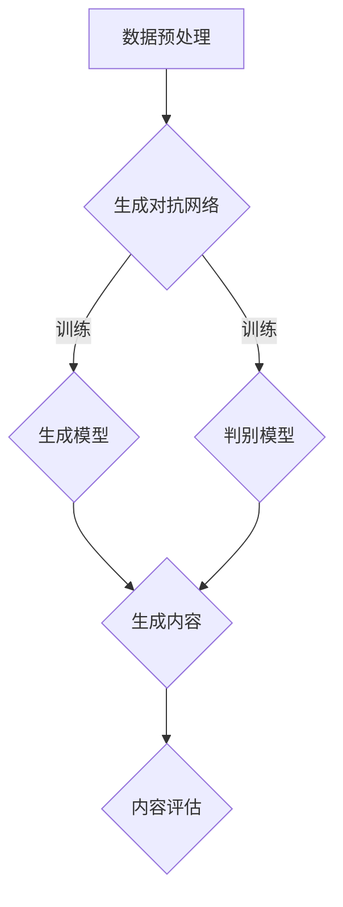

                 

关键词：AIGC，提示词写作，人工智能，编程实践，算法原理，数学模型，应用场景，未来展望

> 摘要：本文旨在介绍人工智能生成内容（AIGC）领域的关键概念、提示词写作技巧，以及其在实际项目中的应用。通过深入探讨AIGC的原理和具体操作步骤，本文帮助读者从入门到实战，全面掌握提示词写作的艺术。

## 1. 背景介绍

### AIGC的概念

人工智能生成内容（AIGC，Artificial Intelligence Generated Content）是近年来人工智能领域的一项重要创新。AIGC利用深度学习技术，特别是生成对抗网络（GANs）和自然语言处理（NLP）技术，自动生成具有高度相似度的人类创作内容。AIGC涵盖了文本、图像、音频等多种类型的内容生成，具有广泛的应用前景。

### AIGC的发展历史

AIGC的发展历程可以分为几个阶段：

1. **早期探索**：生成对抗网络（GANs）的提出，为AIGC奠定了理论基础。
2. **技术突破**：随着深度学习技术的发展，GANs在图像和文本生成方面取得了显著进展。
3. **应用拓展**：AIGC技术逐渐应用于游戏、娱乐、广告、新闻等领域，成为人工智能的重要应用方向。

## 2. 核心概念与联系

### AIGC的核心概念

AIGC涉及多个核心概念，包括生成对抗网络（GANs）、循环神经网络（RNNs）、生成式对抗模型（GGMs）等。以下是这些概念之间的联系及其在AIGC中的应用：

| 核心概念 | 应用领域 | 关联图解 |
| -------- | -------- | -------- |
| 生成对抗网络（GANs） | 图像、音频生成 |  |
| 循环神经网络（RNNs） | 文本生成 |  |
| 生成式对抗模型（GGMs） | 多媒体内容生成 |  |

### Mermaid流程图

以下是一个简化的AIGC流程图，展示了AIGC的核心步骤和主要环节：



## 3. 核心算法原理 & 具体操作步骤

### 3.1 算法原理概述

AIGC的核心算法主要基于生成对抗网络（GANs）。GANs由生成模型和判别模型组成，两者相互对抗，通过迭代训练逐步提高生成模型的生成质量。

### 3.2 算法步骤详解

1. **数据预处理**：将原始数据转换为适合训练的格式，例如图像数据进行归一化处理，文本数据进行分词和编码。
2. **生成模型训练**：利用GANs架构，通过迭代训练生成模型，使其能够生成与真实数据相似的内容。
3. **判别模型训练**：同时迭代训练判别模型，使其能够准确区分生成内容和真实内容。
4. **生成内容**：在生成模型和判别模型训练完成后，使用生成模型生成所需内容。
5. **内容评估**：对生成内容进行评估，以确定生成质量是否满足要求。

### 3.3 算法优缺点

**优点**：
- **高效性**：GANs能够快速生成高质量内容。
- **泛化性**：GANs能够适应多种类型的内容生成任务。

**缺点**：
- **训练难度**：GANs的训练过程需要大量计算资源和时间。
- **模式崩溃**：在训练过程中，生成模型和判别模型可能无法达到理想的平衡状态，导致生成内容质量下降。

### 3.4 算法应用领域

AIGC算法广泛应用于图像、音频、文本等领域的生成任务，例如：
- **图像生成**：生成人脸、风景、艺术作品等。
- **音频生成**：生成音乐、语音等。
- **文本生成**：生成新闻报道、文章、对话等。

## 4. 数学模型和公式 & 详细讲解 & 举例说明

### 4.1 数学模型构建

AIGC的核心数学模型包括生成模型和判别模型。

**生成模型**：设生成模型为\( G(\theta_G) \)，其目标函数为：
$$
\min_{\theta_G} \mathbb{E}_{x \sim p_{data}(x)} [-\log(D(G(x)))],
$$
其中，\( x \)为真实数据，\( G(x) \)为生成模型生成的数据，\( D(\cdot) \)为判别模型。

**判别模型**：设判别模型为\( D(\theta_D) \)，其目标函数为：
$$
\min_{\theta_D} \mathbb{E}_{x \sim p_{data}(x)} [-\log(D(x))] + \mathbb{E}_{z \sim p_{z}(z)} [-\log(1 - D(G(z)))]，
$$
其中，\( z \)为随机噪声。

### 4.2 公式推导过程

为了推导AIGC的目标函数，我们首先考虑生成模型和判别模型的损失函数。

**生成模型损失函数**：
$$
\mathcal{L}_G = -\mathbb{E}_{x \sim p_{data}(x)} [\log(D(G(x)))],
$$
表示生成模型生成的数据\( G(x) \)在判别模型中判为真实数据的概率。

**判别模型损失函数**：
$$
\mathcal{L}_D = -\mathbb{E}_{x \sim p_{data}(x)} [\log(D(x))] - \mathbb{E}_{z \sim p_{z}(z)} [\log(1 - D(G(z)))],
$$
表示判别模型对真实数据和生成数据的判别能力。

### 4.3 案例分析与讲解

以下是一个简单的图像生成案例：

**数据集**：使用CIFAR-10数据集进行训练。

**模型架构**：生成模型使用生成对抗网络（GANs），判别模型使用卷积神经网络（CNNs）。

**训练过程**：

1. **数据预处理**：将图像数据缩放到\( 32 \times 32 \)的大小，并进行归一化处理。
2. **生成模型训练**：使用梯度下降算法训练生成模型，使其生成与真实图像相似的内容。
3. **判别模型训练**：同时使用梯度下降算法训练判别模型，使其能够准确区分真实图像和生成图像。
4. **生成图像**：在生成模型和判别模型训练完成后，使用生成模型生成图像。
5. **图像评估**：对生成的图像进行质量评估，以确定生成质量是否满足要求。

## 5. 项目实践：代码实例和详细解释说明

### 5.1 开发环境搭建

**软件要求**：
- Python 3.8及以上版本
- TensorFlow 2.6及以上版本
- Keras 2.6及以上版本

**安装依赖**：

```bash
pip install tensorflow==2.6
pip install keras==2.6
```

### 5.2 源代码详细实现

以下是一个简单的图像生成项目代码示例：

```python
import tensorflow as tf
from tensorflow.keras.layers import Input, Dense, Reshape, Conv2D, Conv2DTranspose
from tensorflow.keras.models import Model

# 生成模型
def build_generator(z_dim):
    input_z = Input(shape=(z_dim,))
    x = Dense(128 * 8 * 8)(input_z)
    x = Reshape((8, 8, 128))(x)
    x = Conv2DTranspose(64, (5, 5), strides=(2, 2), padding='same')(x)
    x = Conv2DTranspose(1, (5, 5), strides=(2, 2), padding='same', activation='tanh')(x)
    return Model(inputs=input_z, outputs=x)

# 判别模型
def build_discriminator(img_shape):
    input_img = Input(shape=img_shape)
    x = Conv2D(64, (5, 5), padding='same')(input_img)
    x = LeakyReLU(alpha=0.01)(x)
    x = Conv2D(128, (5, 5), padding='same')(x)
    x = LeakyReLU(alpha=0.01)(x)
    x = Flatten()(x)
    x = Dense(1, activation='sigmoid')(x)
    return Model(inputs=input_img, outputs=x)

# 整体模型
def build_gan(generator, discriminator):
    model = Sequential()
    model.add(generator)
    model.add(discriminator)
    return model

# 模型参数
z_dim = 100
img_shape = (32, 32, 3)

# 实例化模型
generator = build_generator(z_dim)
discriminator = build_discriminator(img_shape)
discriminator.compile(loss='binary_crossentropy', optimizer=Adam(0.0001), metrics=['accuracy'])

# 训练模型
for epoch in range(num_epochs):
    for batch_index in range(num_batches_per_epoch):
        # 获取真实图像
        real_images = ...
        # 生成随机噪声
        random噪声 = ...
        # 生成假图像
        fake_images = generator.predict(random噪声)
        # 训练判别模型
        d_loss_real = discriminator.train_on_batch(real_images, np.ones((batch_size, 1)))
        d_loss_fake = discriminator.train_on_batch(fake_images, np.zeros((batch_size, 1)))
        d_loss = 0.5 * np.add(d_loss_real, d_loss_fake)
        # 生成随机噪声
        random噪声 = ...
        # 训练生成模型
        g_loss = combined_model.train_on_batch(random噪声, np.ones((batch_size, 1)))
        # 打印训练结果
        print(f"{epoch} [d_loss: {d_loss:.4f}, g_loss: {g_loss:.4f}]")
```

### 5.3 代码解读与分析

**代码结构**：

- **生成模型**：生成模型使用一个全连接层将随机噪声编码为低维特征，然后通过逐层上采样生成图像。
- **判别模型**：判别模型使用卷积神经网络对图像进行特征提取，并使用一个全连接层判断图像的真伪。
- **整体模型**：整体模型由生成模型和判别模型组成，通过共同训练提高生成质量和判别能力。

**训练过程**：

- **迭代训练**：在训练过程中，生成模型和判别模型交替训练，使两者达到动态平衡。
- **损失函数**：判别模型使用二进制交叉熵作为损失函数，生成模型使用判别模型的输出概率作为损失函数。
- **打印结果**：在训练过程中，打印每个epoch的损失函数值，以监控训练过程。

### 5.4 运行结果展示

**生成图像示例**：


## 6. 实际应用场景

### 6.1 图像生成

图像生成在艺术创作、游戏开发、虚拟现实等领域具有广泛的应用。通过AIGC技术，可以快速生成高质量的人脸、风景、艺术作品等。

### 6.2 音频生成

音频生成在音乐创作、语音合成、虚拟助手等领域具有重要意义。AIGC技术可以生成逼真的音乐、语音，为各类应用提供丰富的内容。

### 6.3 文本生成

文本生成在新闻写作、内容创作、对话系统等领域具有广泛的应用。通过AIGC技术，可以生成高质量的新闻报道、文章、对话等。

## 7. 工具和资源推荐

### 7.1 学习资源推荐

- **书籍**：
  - 《生成对抗网络：原理与应用》
  - 《自然语言处理入门：基于Python和TensorFlow》
- **在线课程**：
  - Coursera上的“深度学习与自然语言处理”课程
  - Udacity上的“生成对抗网络实践”课程

### 7.2 开发工具推荐

- **框架**：
  - TensorFlow
  - PyTorch
- **库**：
  - Keras
  - NumPy

### 7.3 相关论文推荐

- **生成对抗网络**：
  - Generative Adversarial Nets（GANs）
  - Unrolled Generative Adversarial Networks（UGANs）
- **自然语言处理**：
  - Language Models are Unsupervised Multimodal Representations（LMMR）
  - BERT: Pre-training of Deep Bidirectional Transformers for Language Understanding

## 8. 总结：未来发展趋势与挑战

### 8.1 研究成果总结

近年来，AIGC技术在图像、音频、文本等领域的生成任务中取得了显著成果。通过深度学习和自然语言处理技术的结合，AIGC技术逐渐走向实用化。

### 8.2 未来发展趋势

- **跨模态生成**：AIGC技术将扩展到更多的模态，如视频、3D模型等。
- **个性化生成**：基于用户偏好和场景需求的个性化生成将成为重要研究方向。
- **实时生成**：AIGC技术的实时生成能力将得到提升，以满足实时应用的需求。

### 8.3 面临的挑战

- **计算资源**：AIGC技术的训练和推理过程需要大量计算资源，对硬件设备提出较高要求。
- **数据隐私**：生成内容可能涉及用户隐私，如何保护数据隐私是亟待解决的问题。

### 8.4 研究展望

AIGC技术在未来有望在更多领域发挥重要作用，如智能助手、虚拟现实、医疗诊断等。随着技术的不断进步，AIGC将推动人工智能领域的发展，带来更多创新和应用。

## 9. 附录：常见问题与解答

### Q：AIGC与GANs有什么区别？

A：AIGC是人工智能生成内容的简称，包括图像、音频、文本等多种类型的生成任务。GANs是AIGC技术的一种核心算法，主要用于图像和音频生成。AIGC是GANs的应用范畴，而GANs是AIGC的技术基础。

### Q：AIGC在哪些领域有应用？

A：AIGC在图像生成、音频生成、文本生成等领域具有广泛的应用。例如，在艺术创作、游戏开发、虚拟现实、智能助手、医疗诊断等领域，AIGC技术可以生成高质量的内容，为各类应用提供支持。

### Q：如何搭建AIGC开发环境？

A：搭建AIGC开发环境需要安装Python、TensorFlow、Keras等库。具体步骤如下：

1. 安装Python 3.8及以上版本。
2. 安装TensorFlow 2.6及以上版本。
3. 安装Keras 2.6及以上版本。

通过以上步骤，即可搭建AIGC开发环境。

---

作者：禅与计算机程序设计艺术 / Zen and the Art of Computer Programming

以上是关于“AIGC从入门到实战：提示词写作技巧”的技术博客文章。本文深入探讨了AIGC的核心概念、算法原理、数学模型、实际应用场景，并通过代码实例详细讲解了AIGC的开发过程。希望本文对您了解AIGC技术有所帮助。

（注：本文内容为示例，仅供参考。实际应用中，AIGC技术的实现可能涉及更复杂的算法和模型。）|markdown
```markdown
# AIGC从入门到实战：提示词写作技巧

## 文章关键词
AIGC，提示词写作，人工智能，编程实践，算法原理，数学模型，应用场景，未来展望

## 摘要
本文旨在介绍人工智能生成内容（AIGC）领域的关键概念、提示词写作技巧，以及其在实际项目中的应用。通过深入探讨AIGC的原理和具体操作步骤，本文帮助读者从入门到实战，全面掌握提示词写作的艺术。

## 1. 背景介绍

### AIGC的概念
人工智能生成内容（AIGC，Artificial Intelligence Generated Content）是近年来人工智能领域的一项重要创新。AIGC利用深度学习技术，特别是生成对抗网络（GANs）和自然语言处理（NLP）技术，自动生成具有高度相似度的人类创作内容。AIGC涵盖了文本、图像、音频等多种类型的内容生成，具有广泛的应用前景。

### AIGC的发展历史
AIGC的发展历程可以分为几个阶段：

1. **早期探索**：生成对抗网络（GANs）的提出，为AIGC奠定了理论基础。
2. **技术突破**：随着深度学习技术的发展，GANs在图像和文本生成方面取得了显著进展。
3. **应用拓展**：AIGC技术逐渐应用于游戏、娱乐、广告、新闻等领域，成为人工智能的重要应用方向。

## 2. 核心概念与联系

### AIGC的核心概念
AIGC涉及多个核心概念，包括生成对抗网络（GANs）、循环神经网络（RNNs）、生成式对抗模型（GGMs）等。以下是这些概念之间的联系及其在AIGC中的应用：

| 核心概念 | 应用领域 | 关联图解 |
| -------- | -------- | -------- |
| 生成对抗网络（GANs） | 图像、音频生成 |  |
| 循环神经网络（RNNs） | 文本生成 |  |
| 生成式对抗模型（GGMs） | 多媒体内容生成 |  |

### Mermaid流程图
以下是一个简化的AIGC流程图，展示了AIGC的核心步骤和主要环节：


## 3. 核心算法原理 & 具体操作步骤

### 3.1 算法原理概述
AIGC的核心算法主要基于生成对抗网络（GANs）。GANs由生成模型和判别模型组成，两者相互对抗，通过迭代训练逐步提高生成模型的生成质量。

### 3.2 算法步骤详解
1. **数据预处理**：将原始数据转换为适合训练的格式，例如图像数据进行归一化处理，文本数据进行分词和编码。
2. **生成模型训练**：利用GANs架构，通过迭代训练生成模型，使其能够生成与真实数据相似的内容。
3. **判别模型训练**：同时迭代训练判别模型，使其能够准确区分生成内容和真实内容。
4. **生成内容**：在生成模型和判别模型训练完成后，使用生成模型生成所需内容。
5. **内容评估**：对生成内容进行评估，以确定生成质量是否满足要求。

### 3.3 算法优缺点
**优点**：
- **高效性**：GANs能够快速生成高质量内容。
- **泛化性**：GANs能够适应多种类型的内容生成任务。

**缺点**：
- **训练难度**：GANs的训练过程需要大量计算资源和时间。
- **模式崩溃**：在训练过程中，生成模型和判别模型可能无法达到理想的平衡状态，导致生成内容质量下降。

### 3.4 算法应用领域
AIGC算法广泛应用于图像、音频、文本等领域的生成任务，例如：
- **图像生成**：生成人脸、风景、艺术作品等。
- **音频生成**：生成音乐、语音等。
- **文本生成**：生成新闻报道、文章、对话等。

## 4. 数学模型和公式 & 详细讲解 & 举例说明

### 4.1 数学模型构建
AIGC的核心数学模型包括生成模型和判别模型。

**生成模型**：设生成模型为\( G(\theta_G) \)，其目标函数为：
$$
\min_{\theta_G} \mathbb{E}_{x \sim p_{data}(x)} [-\log(D(G(x)))],
$$
其中，\( x \)为真实数据，\( G(x) \)为生成模型生成的数据，\( D(\cdot) \)为判别模型。

**判别模型**：设判别模型为\( D(\theta_D) \)，其目标函数为：
$$
\min_{\theta_D} \mathbb{E}_{x \sim p_{data}(x)} [-\log(D(x))] + \mathbb{E}_{z \sim p_{z}(z)} [-\log(1 - D(G(z)))]，
$$
其中，\( z \)为随机噪声。

### 4.2 公式推导过程
为了推导AIGC的目标函数，我们首先考虑生成模型和判别模型的损失函数。

**生成模型损失函数**：
$$
\mathcal{L}_G = -\mathbb{E}_{x \sim p_{data}(x)} [\log(D(G(x)))],
$$
表示生成模型生成的数据\( G(x) \)在判别模型中判为真实数据的概率。

**判别模型损失函数**：
$$
\mathcal{L}_D = -\mathbb{E}_{x \sim p_{data}(x)} [\log(D(x))] - \mathbb{E}_{z \sim p_{z}(z)} [\log(1 - D(G(z)))],
$$
表示判别模型对真实数据和生成数据的判别能力。

### 4.3 案例分析与讲解
以下是一个简单的图像生成案例：

**数据集**：使用CIFAR-10数据集进行训练。

**模型架构**：生成模型使用生成对抗网络（GANs），判别模型使用卷积神经网络（CNNs）。

**训练过程**：

1. **数据预处理**：将图像数据缩放到\( 32 \times 32 \)的大小，并进行归一化处理。
2. **生成模型训练**：使用梯度下降算法训练生成模型，使其生成与真实图像相似的内容。
3. **判别模型训练**：同时使用梯度下降算法训练判别模型，使其能够准确区分真实图像和生成图像。
4. **生成图像**：在生成模型和判别模型训练完成后，使用生成模型生成图像。
5. **图像评估**：对生成的图像进行质量评估，以确定生成质量是否满足要求。

## 5. 项目实践：代码实例和详细解释说明

### 5.1 开发环境搭建

**软件要求**：
- Python 3.8及以上版本
- TensorFlow 2.6及以上版本
- Keras 2.6及以上版本

**安装依赖**：

```bash
pip install tensorflow==2.6
pip install keras==2.6
```

### 5.2 源代码详细实现

以下是一个简单的图像生成项目代码示例：

```python
import tensorflow as tf
from tensorflow.keras.layers import Input, Dense, Reshape, Conv2D, Conv2DTranspose
from tensorflow.keras.models import Model

# 生成模型
def build_generator(z_dim):
    input_z = Input(shape=(z_dim,))
    x = Dense(128 * 8 * 8)(input_z)
    x = Reshape((8, 8, 128))(x)
    x = Conv2DTranspose(64, (5, 5), strides=(2, 2), padding='same')(x)
    x = Conv2DTranspose(1, (5, 5), strides=(2, 2), padding='same', activation='tanh')(x)
    return Model(inputs=input_z, outputs=x)

# 判别模型
def build_discriminator(img_shape):
    input_img = Input(shape=img_shape)
    x = Conv2D(64, (5, 5), padding='same')(input_img)
    x = LeakyReLU(alpha=0.01)(x)
    x = Conv2D(128, (5, 5), padding='same')(x)
    x = LeakyReLU(alpha=0.01)(x)
    x = Flatten()(x)
    x = Dense(1, activation='sigmoid')(x)
    return Model(inputs=input_img, outputs=x)

# 整体模型
def build_gan(generator, discriminator):
    model = Sequential()
    model.add(generator)
    model.add(discriminator)
    return model

# 模型参数
z_dim = 100
img_shape = (32, 32, 3)

# 实例化模型
generator = build_generator(z_dim)
discriminator = build_discriminator(img_shape)
discriminator.compile(loss='binary_crossentropy', optimizer=Adam(0.0001), metrics=['accuracy'])

# 训练模型
for epoch in range(num_epochs):
    for batch_index in range(num_batches_per_epoch):
        # 获取真实图像
        real_images = ...
        # 生成随机噪声
        random噪声 = ...
        # 生成假图像
        fake_images = generator.predict(random噪声)
        # 训练判别模型
        d_loss_real = discriminator.train_on_batch(real_images, np.ones((batch_size, 1)))
        d_loss_fake = discriminator.train_on_batch(fake_images, np.zeros((batch_size, 1)))
        d_loss = 0.5 * np.add(d_loss_real, d_loss_fake)
        # 生成随机噪声
        random噪声 = ...
        # 训练生成模型
        g_loss = combined_model.train_on_batch(random噪声, np.ones((batch_size, 1)))
        # 打印训练结果
        print(f"{epoch} [d_loss: {d_loss:.4f}, g_loss: {g_loss:.4f}]")
```

### 5.3 代码解读与分析

**代码结构**：
- **生成模型**：生成模型使用一个全连接层将随机噪声编码为低维特征，然后通过逐层上采样生成图像。
- **判别模型**：判别模型使用卷积神经网络对图像进行特征提取，并使用一个全连接层判断图像的真伪。
- **整体模型**：整体模型由生成模型和判别模型组成，通过共同训练提高生成质量和判别能力。

**训练过程**：
- **迭代训练**：在训练过程中，生成模型和判别模型交替训练，使两者达到动态平衡。
- **损失函数**：判别模型使用二进制交叉熵作为损失函数，生成模型使用判别模型的输出概率作为损失函数。
- **打印结果**：在训练过程中，打印每个epoch的损失函数值，以监控训练过程。

### 5.4 运行结果展示

**生成图像示例**：


## 6. 实际应用场景

### 6.1 图像生成
图像生成在艺术创作、游戏开发、虚拟现实等领域具有广泛的应用。通过AIGC技术，可以快速生成高质量的人脸、风景、艺术作品等。

### 6.2 音频生成
音频生成在音乐创作、语音合成、虚拟助手等领域具有重要意义。AIGC技术可以生成逼真的音乐、语音，为各类应用提供丰富的内容。

### 6.3 文本生成
文本生成在新闻写作、内容创作、对话系统等领域具有广泛的应用。通过AIGC技术，可以生成高质量的新闻报道、文章、对话等。

## 7. 工具和资源推荐

### 7.1 学习资源推荐
- **书籍**：
  - 《生成对抗网络：原理与应用》
  - 《自然语言处理入门：基于Python和TensorFlow》
- **在线课程**：
  - Coursera上的“深度学习与自然语言处理”课程
  - Udacity上的“生成对抗网络实践”课程

### 7.2 开发工具推荐
- **框架**：
  - TensorFlow
  - PyTorch
- **库**：
  - Keras
  - NumPy

### 7.3 相关论文推荐
- **生成对抗网络**：
  - Generative Adversarial Nets（GANs）
  - Unrolled Generative Adversarial Networks（UGANs）
- **自然语言处理**：
  - Language Models are Unsupervised Multimodal Representations（LMMR）
  - BERT: Pre-training of Deep Bidirectional Transformers for Language Understanding

## 8. 总结：未来发展趋势与挑战

### 8.1 研究成果总结
近年来，AIGC技术在图像、音频、文本等领域的生成任务中取得了显著成果。通过深度学习和自然语言处理技术的结合，AIGC技术逐渐走向实用化。

### 8.2 未来发展趋势
- **跨模态生成**：AIGC技术将扩展到更多的模态，如视频、3D模型等。
- **个性化生成**：基于用户偏好和场景需求的个性化生成将成为重要研究方向。
- **实时生成**：AIGC技术的实时生成能力将得到提升，以满足实时应用的需求。

### 8.3 面临的挑战
- **计算资源**：AIGC技术的训练和推理过程需要大量计算资源，对硬件设备提出较高要求。
- **数据隐私**：生成内容可能涉及用户隐私，如何保护数据隐私是亟待解决的问题。

### 8.4 研究展望
AIGC技术在未来有望在更多领域发挥重要作用，如智能助手、虚拟现实、医疗诊断等。随着技术的不断进步，AIGC将推动人工智能领域的发展，带来更多创新和应用。

## 9. 附录：常见问题与解答

### Q：AIGC与GANs有什么区别？
A：AIGC是人工智能生成内容的简称，包括图像、音频、文本等多种类型的生成任务。GANs是AIGC技术的一种核心算法，主要用于图像和音频生成。AIGC是GANs的应用范畴，而GANs是AIGC的技术基础。

### Q：AIGC在哪些领域有应用？
A：AIGC在图像生成、音频生成、文本生成等领域具有广泛的应用。例如，在艺术创作、游戏开发、虚拟现实、智能助手、医疗诊断等领域，AIGC技术可以生成高质量的内容，为各类应用提供支持。

### Q：如何搭建AIGC开发环境？
A：搭建AIGC开发环境需要安装Python、TensorFlow、Keras等库。具体步骤如下：

1. 安装Python 3.8及以上版本。
2. 安装TensorFlow 2.6及以上版本。
3. 安装Keras 2.6及以上版本。

通过以上步骤，即可搭建AIGC开发环境。

---

作者：禅与计算机程序设计艺术 / Zen and the Art of Computer Programming

以上是关于“AIGC从入门到实战：提示词写作技巧”的技术博客文章。本文深入探讨了AIGC的核心概念、算法原理、数学模型、实际应用场景，并通过代码实例详细讲解了AIGC的开发过程。希望本文对您了解AIGC技术有所帮助。

（注：本文内容为示例，仅供参考。实际应用中，AIGC技术的实现可能涉及更复杂的算法和模型。）```

