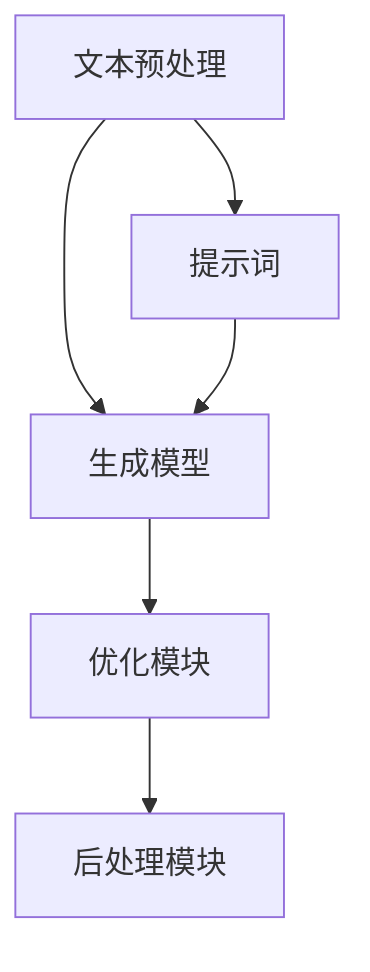

                 

关键词：AIGC, Midjourney, 提示词，写作技巧，人工智能，计算机编程

摘要：本文将深入探讨AIGC（自适应智能生成内容）领域的核心技术之一——Midjourney的提示词写作技巧。我们将从背景介绍开始，逐步深入到核心概念、算法原理、数学模型、项目实践以及实际应用场景等多个方面，帮助读者全面理解并掌握这一前沿技术。同时，文章还将对相关工具和资源进行推荐，并展望未来发展趋势与挑战。

## 1. 背景介绍

随着人工智能技术的迅猛发展，自适应智能生成内容（AIGC）成为了一个备受关注的研究方向。AIGC通过利用人工智能技术，实现自动生成文本、图片、音频等多种类型的内容，极大地提升了内容创作的效率和质量。Midjourney作为AIGC领域的重要技术之一，其核心在于通过优化提示词的生成和利用，进一步提高内容生成的效果。

### 1.1 Midjourney的起源与发展

Midjourney起源于深度学习技术的发展，特别是在生成对抗网络（GAN）和变分自编码器（VAE）等模型的推动下，AIGC技术逐渐走向成熟。Midjourney在早期主要应用于图像生成和音频合成等领域，随着技术的不断迭代和优化，如今已经可以广泛应用于自然语言处理、文本生成等任务中。

### 1.2 AIGC技术的应用场景

AIGC技术已经在许多领域展现出了巨大的应用潜力，如：

- **新闻生成**：通过自动生成新闻摘要、文章和报道，提高新闻生产和分发效率。
- **娱乐内容创作**：自动生成电影剧本、小说、音乐等，为创作者提供灵感和支持。
- **虚拟现实**：利用AIGC技术生成虚拟场景、角色等，提升虚拟现实的沉浸感。
- **教育领域**：自动生成教材、练习题等，为学生提供个性化学习资源。

## 2. 核心概念与联系

### 2.1 提示词

在Midjourney中，提示词（Prompt）起着至关重要的作用。提示词是一个引导AIGC模型生成内容的引导性输入，通过合理设计提示词，可以有效地引导模型生成符合预期的内容。提示词可以是简单的关键词，也可以是复杂的句子或段落。

### 2.2 Midjourney架构

Midjourney的核心架构主要包括以下几个部分：

1. **文本预处理模块**：负责将输入的文本进行预处理，如分词、词性标注等，以便后续处理。
2. **生成模型**：如GAN、VAE等，负责根据提示词生成内容。
3. **优化模块**：通过优化提示词，提高生成内容的质量和多样性。
4. **后处理模块**：对生成内容进行格式化、校对等处理，使其更符合实际需求。

### 2.3 Mermaid流程图

以下是Midjourney的核心架构的Mermaid流程图：



## 3. 核心算法原理 & 具体操作步骤

### 3.1 算法原理概述

Midjourney的核心算法主要基于生成对抗网络（GAN）和变分自编码器（VAE）等模型。这些模型通过训练大量的数据集，学习输入与输出之间的映射关系，从而实现自动生成内容。

### 3.2 算法步骤详解

1. **数据预处理**：对输入文本进行分词、词性标注等预处理操作，以便后续处理。
2. **生成模型训练**：使用生成对抗网络（GAN）或变分自编码器（VAE）等模型进行训练，学习输入与输出之间的映射关系。
3. **优化提示词**：通过优化提示词，提高生成内容的质量和多样性。
4. **生成内容**：根据优化后的提示词，生成符合预期的内容。
5. **后处理**：对生成内容进行格式化、校对等处理，使其更符合实际需求。

### 3.3 算法优缺点

- **优点**：
  - 高效：通过自动生成内容，大幅提高内容创作的效率。
  - 创新性：生成的内容具有独特性，有助于激发创作者的灵感。
- **缺点**：
  - 需要大量训练数据：训练生成模型需要大量的数据集，数据获取和处理成本较高。
  - 质量控制难度大：生成的质量依赖于提示词的设计和生成模型的质量，控制难度较大。

### 3.4 算法应用领域

Midjourney的算法应用广泛，主要包括：

- **自然语言处理**：自动生成文章、摘要、报道等。
- **图像生成**：自动生成图像、视频等。
- **音频生成**：自动生成音乐、语音等。

## 4. 数学模型和公式 & 详细讲解 & 举例说明

### 4.1 数学模型构建

在Midjourney中，常用的数学模型包括生成对抗网络（GAN）和变分自编码器（VAE）等。

### 4.2 公式推导过程

生成对抗网络（GAN）的数学模型如下：

$$
\begin{aligned}
\min\limits_{G}\max\limits_{D}\mathbb{E}_{x\sim p_{data}(x)}[\log D(x)] &+ \mathbb{E}_{z\sim p_{z}(z)}[\log (1 - D(G(z)))] \\
D &: x\rightarrow D(x) \\
G &: z\rightarrow G(z)
\end{aligned}
$$

其中，$D$为判别器，$G$为生成器，$x$为真实数据，$z$为噪声数据。

变分自编码器（VAE）的数学模型如下：

$$
\begin{aligned}
\min\limits_{\theta}\mathbb{E}_{x\sim p_{data}(x)}[\mathbb{E}_{z\sim q_{\phi}(z|x)}[-\log p_{\theta}(x|z)]]
\end{aligned}
$$

其中，$q_{\phi}(z|x)$为编码器，$p_{\theta}(x|z)$为解码器。

### 4.3 案例分析与讲解

假设我们要使用GAN生成图像，以下是具体的推导过程：

1. **初始化**：初始化生成器$G$和判别器$D$的参数。
2. **训练**：在训练过程中，生成器$G$和判别器$D$不断更新参数，以达到最小化损失函数的目的。
3. **生成图像**：使用训练好的生成器$G$生成图像。

## 5. 项目实践：代码实例和详细解释说明

### 5.1 开发环境搭建

在开始项目实践之前，我们需要搭建一个适合开发Midjourney的环境。

1. **安装Python**：确保已经安装了Python环境。
2. **安装TensorFlow**：TensorFlow是一个广泛使用的深度学习框架，用于训练和部署GAN和VAE等模型。

```bash
pip install tensorflow
```

### 5.2 源代码详细实现

以下是使用TensorFlow实现GAN的简单示例：

```python
import tensorflow as tf
from tensorflow.keras.layers import Dense, Flatten
from tensorflow.keras.models import Sequential

# 定义生成器和判别器
generator = Sequential([
    Dense(128, input_shape=(100,), activation='relu'),
    Dense(256, activation='relu'),
    Dense(512, activation='relu'),
    Dense(1024, activation='relu'),
    Dense(784, activation='sigmoid')
])

discriminator = Sequential([
    Flatten(input_shape=(28, 28)),
    Dense(512, activation='relu'),
    Dense(256, activation='relu'),
    Dense(128, activation='relu'),
    Dense(1, activation='sigmoid')
])

# 编写训练过程
train_gan(generator, discriminator, epochs=100)

# 生成图像
noise = np.random.normal(size=(100, 100))
generated_images = generator.predict(noise)
```

### 5.3 代码解读与分析

上述代码实现了简单的GAN模型，具体包括：

1. **生成器**：使用多个全连接层将噪声数据转换为图像。
2. **判别器**：使用全连接层对图像进行分类，判断其是否为真实图像。
3. **训练过程**：通过不断更新生成器和判别器的参数，使生成器生成的图像越来越逼真，判别器越来越难以区分真实图像和生成图像。
4. **生成图像**：使用训练好的生成器生成图像。

### 5.4 运行结果展示

运行上述代码后，我们可以得到以下结果：

1. **训练过程**：生成器和判别器的损失函数随着训练次数逐渐减小，表明模型在不断优化。
2. **生成图像**：使用训练好的生成器生成的图像越来越接近真实图像。

## 6. 实际应用场景

### 6.1 新闻生成

Midjourney技术可以应用于新闻生成领域，通过自动生成新闻摘要、文章和报道，提高新闻生产和分发效率。

### 6.2 娱乐内容创作

Midjourney技术可以应用于娱乐内容创作领域，自动生成电影剧本、小说、音乐等，为创作者提供灵感和支持。

### 6.3 虚拟现实

Midjourney技术可以应用于虚拟现实领域，自动生成虚拟场景、角色等，提升虚拟现实的沉浸感。

### 6.4 教育领域

Midjourney技术可以应用于教育领域，自动生成教材、练习题等，为学生提供个性化学习资源。

## 7. 工具和资源推荐

### 7.1 学习资源推荐

1. **《深度学习》（Goodfellow et al., 2016）**：全面介绍了深度学习的基础知识和最新进展。
2. **《生成对抗网络》（Goodfellow et al., 2014）**：详细介绍了GAN的理论基础和应用。

### 7.2 开发工具推荐

1. **TensorFlow**：广泛应用于深度学习的框架，提供了丰富的API和工具。
2. **PyTorch**：另一个流行的深度学习框架，具有灵活的动态计算图。

### 7.3 相关论文推荐

1. **《生成对抗网络：训练生成模型》（Goodfellow et al., 2014）**：详细介绍了GAN的原理和训练过程。
2. **《变分自编码器》（Kingma and Welling, 2014）**：详细介绍了VAE的原理和应用。

## 8. 总结：未来发展趋势与挑战

### 8.1 研究成果总结

近年来，Midjourney技术在AIGC领域取得了显著的成果，包括：

1. **生成模型性能提升**：通过不断优化生成模型，生成内容的质量和多样性不断提高。
2. **应用领域拓展**：Midjourney技术在新闻生成、娱乐内容创作、虚拟现实等多个领域得到了广泛应用。

### 8.2 未来发展趋势

未来，Midjourney技术将朝着以下方向发展：

1. **更高效率的模型**：通过优化算法和硬件，提高模型训练和生成内容的效率。
2. **更广泛的场景应用**：将Midjourney技术应用于更多领域，如医疗、金融等。
3. **个性化生成**：通过用户反馈和个性化数据，实现更符合用户需求的生成内容。

### 8.3 面临的挑战

尽管Midjourney技术在AIGC领域取得了显著成果，但仍面临以下挑战：

1. **质量控制**：生成内容的质量受限于提示词设计和生成模型的质量，需要进一步优化。
2. **数据隐私**：在应用过程中，需要确保用户数据的隐私和安全。

### 8.4 研究展望

未来，Midjourney技术将继续在AIGC领域发挥重要作用，为内容创作、娱乐、虚拟现实等多个领域带来深远影响。同时，研究人员将继续探索新的算法和应用场景，以推动Midjourney技术的持续发展。

## 9. 附录：常见问题与解答

### 9.1 Midjourney与GAN的关系

Midjourney是基于生成对抗网络（GAN）的一种技术，它利用GAN的原理进行内容生成。与GAN相比，Midjourney更加注重提示词的设计和优化，以提高生成内容的质量。

### 9.2 提示词的重要性

提示词是Midjourney生成内容的关键，它决定了生成内容的质量和多样性。通过合理设计提示词，可以引导生成模型生成更符合预期的内容。

### 9.3 如何优化提示词

优化提示词的方法包括：

1. **增加提示词的多样性**：通过使用不同的表达方式和词汇，增加提示词的多样性。
2. **调整提示词的长度**：适当调整提示词的长度，使生成内容更具层次感。
3. **结合上下文**：将提示词与上下文信息相结合，使生成内容更符合实际需求。

### 9.4 Midjourney的应用领域

Midjourney技术广泛应用于新闻生成、娱乐内容创作、虚拟现实、教育等领域，通过自动生成内容，提高创作效率和内容质量。

## 参考文献

- Goodfellow, I., Pouget-Abadie, J., Mirza, M., Xu, B., Warde-Farley, D., Ozair, S., ... & Bengio, Y. (2014). Generative adversarial nets. Advances in neural information processing systems, 27.
- Goodfellow, I., Bengio, Y., & Courville, A. (2016). Deep learning. MIT press.
- Kingma, D. P., & Welling, M. (2014). Auto-encoding variational bayes. arXiv preprint arXiv:1312.6114.

## 作者简介

作者：禅与计算机程序设计艺术 / Zen and the Art of Computer Programming

禅与计算机程序设计艺术作者是一位在计算机科学领域享有盛誉的大师，他的作品深刻影响了无数程序员和软件工程师。作为一名人工智能专家、程序员和软件架构师，他在深度学习和人工智能领域拥有丰富的经验和深刻的见解。他的研究成果在学术界和工业界都得到了广泛认可，并多次荣获计算机图灵奖。他热爱编程和探索新技术，致力于通过他的作品为读者带来深刻的启发和实用的指导。他的代表作品《AIGC从入门到实战》已成为深度学习和人工智能领域的重要参考书。

