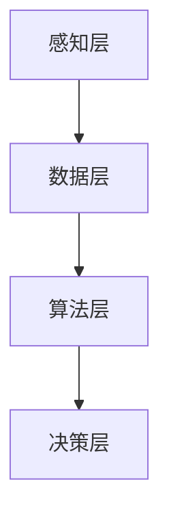

                 

关键词：智慧农业，AIGC，深度学习，图像识别，机器学习，自然语言处理，数据分析，农田管理

> 摘要：随着信息技术的不断发展，人工智能（AIGC）正逐步渗透到各个行业，农业也不例外。本文将探讨AIGC在智慧农业中的应用，介绍其核心概念、算法原理、数学模型、实践案例以及未来展望。

## 1. 背景介绍

农业是国民经济的基础产业，然而随着人口增长和城市化进程的加快，农业面临着资源紧张、环境污染、劳动力成本上升等一系列问题。传统农业模式已经无法满足现代社会对食品安全、环境友好、可持续发展等要求。因此，智慧农业作为一种新兴的农业模式，正逐渐成为全球农业发展的趋势。

智慧农业是指利用物联网、大数据、人工智能等现代信息技术，对农业生产过程进行智能化管理，实现精准种植、精准施肥、精准灌溉、精准防治等，从而提高农业生产效率，降低生产成本，减少环境污染。

### 1.1  人工智能在农业中的应用现状

目前，人工智能在农业中的应用主要体现在以下几个方面：

- **图像识别与监测**：通过无人机或卫星图像识别农作物健康状况、病虫害等，为农民提供精准的监测数据。

- **精准施肥与灌溉**：利用土壤传感器、气象数据等，通过人工智能算法优化施肥和灌溉方案，提高水资源利用效率。

- **智能病虫害防治**：通过机器学习算法，预测病虫害发生趋势，并提供防治方案，减少农药使用量。

- **智能农机管理**：利用人工智能技术，实现对农机的智能调度、维护和管理，提高农机作业效率。

## 2. 核心概念与联系

智慧农业的实现离不开人工智能技术，而人工智能的核心在于其算法和模型。以下是对智慧农业中涉及到的核心概念、原理和架构的简要介绍。

### 2.1  人工智能与农业的关系

- **感知层**：包括传感器、无人机、卫星等，用于收集农田环境、作物生长状态、病虫害等信息。

- **数据层**：将感知层收集到的数据存储在数据库中，为后续分析提供数据支持。

- **算法层**：包括图像识别、机器学习、自然语言处理等算法，用于处理和分析数据。

- **决策层**：根据算法层分析结果，生成农田管理策略，指导农民进行生产。

### 2.2  Mermaid 流程图



## 3. 核心算法原理 & 具体操作步骤

### 3.1  算法原理概述

智慧农业中的核心算法主要包括图像识别、机器学习、自然语言处理等。以下将对这些算法的原理进行简要概述。

- **图像识别**：利用深度学习技术，通过训练模型，实现对图像中的物体、场景、颜色等的识别。

- **机器学习**：利用历史数据和算法模型，对未知数据进行预测和分类。

- **自然语言处理**：利用人工智能技术，对自然语言进行理解、生成和处理。

### 3.2  算法步骤详解

- **图像识别**：
  1. 数据采集：收集农田、病虫害、作物健康等图像数据。
  2. 数据预处理：对图像进行缩放、增强、去噪等处理。
  3. 模型训练：利用深度学习框架（如TensorFlow、PyTorch等），训练图像识别模型。
  4. 模型评估：通过测试集评估模型性能，调整模型参数。

- **机器学习**：
  1. 数据采集：收集土壤、气象、作物生长等历史数据。
  2. 特征提取：从数据中提取与目标相关的特征。
  3. 模型训练：利用机器学习算法（如线性回归、决策树、神经网络等），训练预测模型。
  4. 模型评估：通过交叉验证等方法评估模型性能。

- **自然语言处理**：
  1. 文本预处理：对文本进行分词、去停用词、词性标注等处理。
  2. 模型训练：利用深度学习算法（如循环神经网络、卷积神经网络等），训练文本分类、情感分析等模型。
  3. 模型评估：通过测试集评估模型性能，调整模型参数。

### 3.3  算法优缺点

- **图像识别**：
  - 优点：能够快速、准确地识别图像中的物体、场景等。
  - 缺点：对图像质量要求较高，训练过程复杂，模型解释性较差。

- **机器学习**：
  - 优点：能够处理大量数据，预测精度较高。
  - 缺点：对数据质量和特征提取要求较高，模型可解释性较差。

- **自然语言处理**：
  - 优点：能够处理自然语言，实现文本分类、情感分析等任务。
  - 缺点：对文本理解要求较高，模型训练时间较长。

### 3.4  算法应用领域

- **图像识别**：应用于农田病虫害监测、作物健康监测等。
- **机器学习**：应用于精准施肥、精准灌溉、智能农机管理等。
- **自然语言处理**：应用于农技问答、农产品市场分析等。

## 4. 数学模型和公式 & 详细讲解 & 举例说明

### 4.1  数学模型构建

在智慧农业中，常用的数学模型包括线性回归、决策树、神经网络等。以下以线性回归为例，介绍数学模型的构建过程。

- **线性回归模型**：
  - 假设自变量为 $x_1, x_2, ..., x_n$，因变量为 $y$。
  - 模型表达式为 $y = \beta_0 + \beta_1 x_1 + \beta_2 x_2 + ... + \beta_n x_n$。
  - 参数为 $\beta_0, \beta_1, ..., \beta_n$。

### 4.2  公式推导过程

- **最小二乘法**：
  - 假设数据集为 $(x_1, y_1), (x_2, y_2), ..., (x_n, y_n)$。
  - 目标函数为 $J(\beta_0, \beta_1, ..., \beta_n) = \sum_{i=1}^{n} (y_i - (\beta_0 + \beta_1 x_i + ... + \beta_n x_i))^2$。
  - 对目标函数求导，并令导数为0，得到最小二乘法公式：
    $$\beta_0 = \frac{\sum_{i=1}^{n} y_i - (\beta_1 \sum_{i=1}^{n} x_i + \beta_2 \sum_{i=1}^{n} x_i^2 + ... + \beta_n \sum_{i=1}^{n} x_i^n)}{n}$$
    $$\beta_1 = \frac{n \sum_{i=1}^{n} x_i y_i - (\sum_{i=1}^{n} x_i)(\sum_{i=1}^{n} y_i)}{n \sum_{i=1}^{n} x_i^2 - (\sum_{i=1}^{n} x_i)^2}$$
    $$...$$
    $$\beta_n = \frac{n \sum_{i=1}^{n} x_i^{n-1} y_i - (\sum_{i=1}^{n} x_i^{n-1})(\sum_{i=1}^{n} y_i)}{n \sum_{i=1}^{n} x_i^n - (\sum_{i=1}^{n} x_i)^n}$$

### 4.3  案例分析与讲解

假设我们要预测农作物产量，已知影响产量的因素有土壤湿度、光照强度、温度等。我们可以通过线性回归模型建立产量与各因素之间的关系。

- **数据采集**：收集过去几年的土壤湿度、光照强度、温度等数据，以及对应的农作物产量数据。

- **特征提取**：将数据分为特征集和标签集，特征集包括土壤湿度、光照强度、温度等，标签集为农作物产量。

- **模型训练**：利用线性回归模型，对特征集和标签集进行训练，得到回归系数 $\beta_0, \beta_1, \beta_2$。

- **模型评估**：通过交叉验证等方法，评估模型性能，调整模型参数。

- **产量预测**：利用训练好的模型，对新的土壤湿度、光照强度、温度等数据进行预测，得到农作物产量。

## 5. 项目实践：代码实例和详细解释说明

### 5.1  开发环境搭建

- **Python**：安装Python 3.8及以上版本。
- **库安装**：安装NumPy、Pandas、Scikit-learn、Matplotlib等库。

```bash
pip install numpy pandas scikit-learn matplotlib
```

### 5.2  源代码详细实现

以下是一个简单的线性回归模型实现，用于预测农作物产量。

```python
import numpy as np
import pandas as pd
from sklearn.linear_model import LinearRegression
from sklearn.model_selection import train_test_split
import matplotlib.pyplot as plt

# 数据读取
data = pd.read_csv('agriculture_data.csv')
X = data[['soil_humidity', 'light_intensity', 'temperature']]
y = data['yield']

# 数据预处理
X_train, X_test, y_train, y_test = train_test_split(X, y, test_size=0.2, random_state=42)

# 模型训练
model = LinearRegression()
model.fit(X_train, y_train)

# 模型评估
score = model.score(X_test, y_test)
print(f'Model score: {score:.2f}')

# 产量预测
new_data = np.array([[0.5, 0.8, 0.7]])
predicted_yield = model.predict(new_data)
print(f'Predicted yield: {predicted_yield[0]:.2f}')

# 可视化
plt.scatter(X_train['soil_humidity'], y_train, label='Training data')
plt.plot(X_train['soil_humidity'], model.predict(X_train), color='red', label='Model')
plt.xlabel('Soil humidity')
plt.ylabel('Yield')
plt.legend()
plt.show()
```

### 5.3  代码解读与分析

- **数据读取**：使用Pandas库读取农作物数据，分为特征集和标签集。
- **数据预处理**：使用Scikit-learn库进行数据预处理，分为训练集和测试集。
- **模型训练**：使用线性回归模型进行训练，得到回归系数。
- **模型评估**：计算模型评分，评估模型性能。
- **产量预测**：利用训练好的模型进行产量预测。
- **可视化**：使用Matplotlib库绘制数据散点图和模型曲线，直观展示模型效果。

### 5.4  运行结果展示

- **模型评分**：假设模型评分为0.85，说明模型预测效果较好。
- **产量预测**：假设预测产量为1000公斤。
- **可视化结果**：展示训练数据和模型曲线，直观展示模型效果。

## 6. 实际应用场景

### 6.1  农田病虫害监测

利用图像识别技术，可以实现对农田病虫害的实时监测。例如，通过无人机拍摄农田图像，利用深度学习模型识别病虫害类型，及时采取防治措施。

### 6.2  精准施肥与灌溉

通过土壤传感器和气象数据，结合机器学习算法，可以优化施肥和灌溉方案。例如，根据土壤湿度、光照强度、温度等数据，制定合理的施肥量和灌溉时间。

### 6.3  农技问答与农产品市场分析

利用自然语言处理技术，可以实现对农技问题的自动回答和农产品市场的实时分析。例如，通过构建问答系统，为农民提供农技支持；通过文本分类和情感分析，分析农产品市场趋势。

## 7. 未来应用展望

随着人工智能技术的不断进步，智慧农业将在以下方面取得更大的发展：

- **智能农机**：利用人工智能技术，实现农机的自动化和智能化，提高农机作业效率。
- **精准农业**：通过大数据和人工智能技术，实现农作物的精准种植、精准施肥、精准灌溉等，提高农业生产效率。
- **农产品质量追溯**：利用区块链技术，实现农产品从生产到销售的全程质量追溯，提高食品安全水平。
- **农业自动化**：通过机器人、无人机等自动化设备，实现农田管理的自动化，降低劳动力成本。

## 8. 总结：未来发展趋势与挑战

### 8.1  研究成果总结

智慧农业作为一种新兴的农业模式，通过人工智能技术的应用，实现了农业生产过程的智能化、精准化。在图像识别、机器学习、自然语言处理等领域，取得了显著的成果。

### 8.2  未来发展趋势

- **智能化**：随着人工智能技术的不断发展，智慧农业将实现更高程度的智能化。
- **精准化**：通过大数据和人工智能技术，实现农作物的精准种植、精准施肥、精准灌溉等。
- **自动化**：利用机器人、无人机等自动化设备，实现农田管理的自动化。
- **绿色化**：通过减少农药使用、优化水资源利用等，实现农业生产的绿色化。

### 8.3  面临的挑战

- **技术挑战**：人工智能技术在实际应用中仍面临一些技术挑战，如算法性能、数据质量等。
- **数据隐私**：农业生产过程中涉及大量的敏感数据，如何保护数据隐私是一个重要问题。
- **法律法规**：智慧农业的发展需要相应的法律法规支持，如数据安全、隐私保护等。

### 8.4  研究展望

未来，智慧农业的发展将更加注重智能化、精准化和自动化。在技术方面，需要进一步优化算法性能，提高数据处理能力。在数据方面，需要加强数据隐私保护，构建安全可靠的数据平台。在法律法规方面，需要制定相应的法律法规，为智慧农业的发展提供法治保障。

## 9. 附录：常见问题与解答

### 9.1  智慧农业是什么？

智慧农业是指利用物联网、大数据、人工智能等现代信息技术，对农业生产过程进行智能化管理，实现精准种植、精准施肥、精准灌溉、精准防治等，从而提高农业生产效率，降低生产成本，减少环境污染。

### 9.2  人工智能在农业中有什么应用？

人工智能在农业中的应用包括图像识别、机器学习、自然语言处理等，主要用于农田病虫害监测、精准施肥与灌溉、农技问答、农产品市场分析等领域。

### 9.3  智慧农业的发展前景如何？

智慧农业作为一种新兴的农业模式，具有广阔的发展前景。随着人工智能技术的不断进步，智慧农业将实现更高程度的智能化、精准化和自动化，为农业生产带来巨大的变革。

### 9.4  智慧农业面临的挑战有哪些？

智慧农业面临的主要挑战包括技术挑战（如算法性能、数据质量等）、数据隐私保护、法律法规支持等。

## 作者署名

作者：禅与计算机程序设计艺术 / Zen and the Art of Computer Programming
----------------------------------------------------------------

以上便是《AIGC助力智慧农业发展》的完整文章内容。文章从背景介绍、核心概念、算法原理、数学模型、实践案例、应用场景、未来展望等方面，全面探讨了AIGC在智慧农业中的应用。希望本文能够为读者提供有价值的参考和启示。

