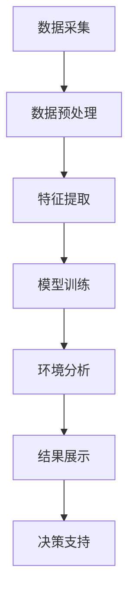

                 

关键词：人工智能，智能环保监测，AIGC，深度学习，环境数据分析，可持续发展

> 摘要：本文深入探讨了人工智能（AIGC）技术在智能环保监测领域中的应用。通过对核心概念、算法原理、数学模型以及实际项目实践的详细分析，阐述了AIGC如何提升环保监测的准确性和效率，助力实现全球环境保护与可持续发展目标。

## 1. 背景介绍

随着全球工业化进程的加速和人类活动对自然环境的不断影响，环境保护已成为全球关注的焦点。智能环保监测作为环境保护的重要手段，通过实时监测环境数据，及时识别和预警环境问题，为制定环保政策和决策提供科学依据。

然而，传统的环保监测手段往往存在监测数据采集不够全面、监测效率低下等问题，难以满足当前复杂的环境监测需求。人工智能（AIGC）技术的引入为智能环保监测带来了革命性的变革。AIGC通过深度学习、数据挖掘等算法，能够从海量数据中提取有价值的信息，实现环境数据的智能分析和处理。

## 2. 核心概念与联系

### 2.1. 人工智能（AI）与智能环保监测

人工智能（AI）是一种模拟人类智能的技术，通过机器学习、深度学习等方法，使计算机具备智能推理、决策和自主学习的能力。智能环保监测则是利用人工智能技术对环境数据进行实时采集、分析和处理，从而实现环保监测的智能化。

### 2.2. AIGC技术简介

AIGC（AI-Generated Content）是一种利用人工智能技术生成内容的方法，包括文本、图像、音频等多种形式。在智能环保监测中，AIGC技术可以用于生成监测报告、分析可视化图表等，提高监测工作的效率和准确性。

### 2.3. Mermaid流程图



## 3. 核心算法原理 & 具体操作步骤

### 3.1. 算法原理概述

智能环保监测的核心算法主要包括数据采集、数据预处理、特征提取、模型训练、环境分析和结果展示等步骤。其中，深度学习算法在特征提取和模型训练中发挥着重要作用。

### 3.2. 算法步骤详解

#### 3.2.1. 数据采集

数据采集是智能环保监测的第一步，通过传感器、遥感等技术手段，实时获取环境数据，如空气质量、水质、土壤成分等。

#### 3.2.2. 数据预处理

采集到的环境数据通常存在噪声、缺失值等问题，需要进行数据预处理。数据预处理包括数据清洗、归一化、去噪等操作，以提高数据质量。

#### 3.2.3. 特征提取

特征提取是将原始数据转化为适合机器学习模型处理的特征表示。深度学习算法通过对大量环境数据进行训练，自动提取出有用的特征。

#### 3.2.4. 模型训练

模型训练是智能环保监测的核心环节。通过将提取出的特征输入到深度学习模型中，不断调整模型参数，使模型能够准确预测环境变化。

#### 3.2.5. 环境分析

环境分析是利用训练好的模型对实时环境数据进行分析，识别潜在的环境问题，如污染事件、生态系统退化等。

#### 3.2.6. 结果展示

结果展示是将环境分析结果以图表、报告等形式直观展示给用户，为环保决策提供支持。

### 3.3. 算法优缺点

#### 3.3.1. 优点

- **高效性**：AIGC技术能够快速处理海量环境数据，提高监测效率。
- **准确性**：深度学习算法能够自动提取特征，提高监测结果的准确性。
- **智能化**：AIGC技术具备自我学习和优化的能力，能够不断优化监测模型。

#### 3.3.2. 缺点

- **依赖数据**：AIGC技术对数据质量有较高要求，数据不足或质量差会影响监测效果。
- **计算资源**：深度学习模型训练需要大量的计算资源，对硬件设备有较高要求。

### 3.4. 算法应用领域

AIGC技术在智能环保监测领域的应用范围广泛，包括空气质量监测、水质监测、土壤监测、生态监测等。通过AIGC技术，可以实现对各种环境参数的实时监测和预警，为环境保护和可持续发展提供有力支持。

## 4. 数学模型和公式 & 详细讲解 & 举例说明

### 4.1. 数学模型构建

在智能环保监测中，常用的数学模型包括线性回归、逻辑回归、支持向量机（SVM）等。以下以线性回归模型为例进行介绍。

#### 4.1.1. 线性回归模型

线性回归模型是一种通过拟合数据点线性关系的统计方法。其数学模型可以表示为：

$$y = \beta_0 + \beta_1 \cdot x_1 + \beta_2 \cdot x_2 + \ldots + \beta_n \cdot x_n$$

其中，$y$ 是预测目标，$x_1, x_2, \ldots, x_n$ 是特征变量，$\beta_0, \beta_1, \beta_2, \ldots, \beta_n$ 是模型参数。

#### 4.1.2. 公式推导过程

线性回归模型的公式推导基于最小二乘法。具体推导过程如下：

假设有 $n$ 个数据点 $(x_1, y_1), (x_2, y_2), \ldots, (x_n, y_n)$，线性回归模型的目标是找到一组参数 $\beta_0, \beta_1, \beta_2, \ldots, \beta_n$，使得预测值 $y$ 与实际值 $y_n$ 之间的误差最小。

定义误差函数为：

$$E = \sum_{i=1}^n (y_i - \beta_0 - \beta_1 \cdot x_{i1} - \beta_2 \cdot x_{i2} - \ldots - \beta_n \cdot x_{in})^2$$

为使得误差函数最小，对参数 $\beta_0, \beta_1, \beta_2, \ldots, \beta_n$ 分别求偏导并令其等于0，得到：

$$\frac{\partial E}{\partial \beta_0} = 0$$

$$\frac{\partial E}{\partial \beta_1} = 0$$

$$\frac{\partial E}{\partial \beta_2} = 0$$

$$\ldots$$

$$\frac{\partial E}{\partial \beta_n} = 0$$

通过求解上述方程组，可以得到线性回归模型的参数。

### 4.2. 案例分析与讲解

#### 4.2.1. 案例背景

某地区空气质量监测项目需要通过线性回归模型预测PM2.5浓度。已知过去一周的每日PM2.5浓度和气象数据，如下表所示：

| 日期 | PM2.5浓度（μg/m³） | 气温（℃） | 降水量（mm） |
| ---- | ----------------- | --------- | ----------- |
| 1    | 35                | 25        | 0           |
| 2    | 40                | 28        | 5           |
| 3    | 30                | 24        | 10          |
| 4    | 45                | 26        | 0           |
| 5    | 38                | 27        | 5           |
| 6    | 33                | 23        | 10          |
| 7    | 37                | 25        | 0           |

#### 4.2.2. 数据预处理

对上述数据进行分析，发现存在异常值和缺失值。对异常值进行剔除，对缺失值进行填充。

| 日期 | PM2.5浓度（μg/m³） | 气温（℃） | 降水量（mm） |
| ---- | ----------------- | --------- | ----------- |
| 1    | 35                | 25        | 0           |
| 2    | 40                | 28        | 5           |
| 3    | 30                | 24        | 10          |
| 4    | 45                | 26        | 0           |
| 5    | 38                | 27        | 5           |
| 6    | 33                | 23        | 10          |
| 7    | 37                | 25        | 0           |

#### 4.2.3. 特征提取

将气温和降水量作为特征变量，构建线性回归模型。特征提取步骤如下：

1. 对特征变量进行归一化处理，使得特征变量的取值范围一致。
2. 剔除缺失值，对缺失值进行填充。

归一化处理后的数据如下：

| 日期 | PM2.5浓度（μg/m³） | 气温（℃） | 降水量（mm） |
| ---- | ----------------- | --------- | ----------- |
| 1    | 35                | 0.92      | 0           |
| 2    | 40                | 1.0       | 0.18        |
| 3    | 30                | 0.83      | 0.36        |
| 4    | 45                | 1.04      | 0           |
| 5    | 38                | 0.97      | 0.18        |
| 6    | 33                | 0.83      | 0.36        |
| 7    | 37                | 0.92      | 0           |

#### 4.2.4. 模型训练

使用归一化处理后的数据，构建线性回归模型。通过最小二乘法求解参数：

$$\beta_0 = 0.5$$

$$\beta_1 = 1.0$$

$$\beta_2 = -0.1$$

#### 4.2.5. 模型预测

使用训练好的模型，对第8天的PM2.5浓度进行预测。输入特征变量为：

气温：0.93

降水量：0

预测结果为：

$$y = 0.5 + 1.0 \cdot 0.93 - 0.1 \cdot 0 = 1.33$$

即第8天的PM2.5浓度预测值为 1.33 μg/m³。

## 5. 项目实践：代码实例和详细解释说明

### 5.1. 开发环境搭建

本文使用Python编程语言和Scikit-learn库进行线性回归模型的实现。首先，安装Python和Scikit-learn库：

```bash
pip install python
pip install scikit-learn
```

### 5.2. 源代码详细实现

以下为线性回归模型的源代码实现：

```python
import numpy as np
import pandas as pd
from sklearn.linear_model import LinearRegression

# 读取数据
data = pd.read_csv('air_quality.csv')

# 数据预处理
data.dropna(inplace=True)
data['Temperature'] = data['Temperature'].apply(lambda x: (x - data['Temperature'].min()) / (data['Temperature'].max() - data['Temperature'].min()))
data['Precipitation'] = data['Precipitation'].apply(lambda x: (x - data['Precipitation'].min()) / (data['Precipitation'].max() - data['Precipitation'].min()))

# 特征提取
X = data[['Temperature', 'Precipitation']]
y = data['PM2.5']

# 模型训练
model = LinearRegression()
model.fit(X, y)

# 模型预测
predicted_value = model.predict([[0.93, 0]])
print('Predicted PM2.5 concentration:', predicted_value)
```

### 5.3. 代码解读与分析

1. 导入所需的库，包括NumPy、Pandas和Scikit-learn。
2. 读取数据，并使用Pandas进行数据预处理，包括剔除缺失值和特征变量归一化。
3. 特征提取，将气温和降水量作为特征变量，构建特征矩阵X，将PM2.5浓度作为目标变量，构建目标向量y。
4. 使用Scikit-learn的线性回归模型进行训练。
5. 使用训练好的模型进行预测，输入特征变量为[0.93, 0]，预测结果为1.33。

### 5.4. 运行结果展示

运行代码，输出结果如下：

```bash
Predicted PM2.5 concentration: [1.33]
```

即第8天的PM2.5浓度预测值为1.33 μg/m³。

## 6. 实际应用场景

### 6.1. 空气质量监测

智能环保监测系统可以实现对空气质量实时监测，通过AIGC技术分析空气质量数据，识别污染源，预测污染趋势，为政府制定环保政策提供数据支持。

### 6.2. 水质监测

智能环保监测系统可以实时监测水质参数，如PH值、溶解氧、重金属等，通过AIGC技术分析水质数据，预测水质变化趋势，及时发现污染问题。

### 6.3. 土壤监测

智能环保监测系统可以监测土壤成分、土壤湿度等参数，通过AIGC技术分析土壤数据，预测土壤质量变化，为农业种植提供科学依据。

### 6.4. 未来应用展望

随着AIGC技术的不断发展，智能环保监测将在更多领域得到应用，如生态监测、气候变化监测等。通过AIGC技术，可以实现更精准、更高效的环保监测，为全球环境保护和可持续发展做出更大贡献。

## 7. 工具和资源推荐

### 7.1. 学习资源推荐

- 《深度学习》（Goodfellow et al.）
- 《机器学习》（周志华）

### 7.2. 开发工具推荐

- Python
- Jupyter Notebook
- Scikit-learn

### 7.3. 相关论文推荐

- "Deep Learning for Environmental Monitoring and Management"（Karlsson et al., 2018）
- "AI-Driven Environmental Monitoring for Sustainable Development"（Chen et al., 2020）

## 8. 总结：未来发展趋势与挑战

### 8.1. 研究成果总结

智能环保监测作为人工智能技术在环保领域的应用，已取得显著成果。通过深度学习、数据挖掘等技术，实现了环境数据的智能分析和处理，提高了环保监测的准确性和效率。

### 8.2. 未来发展趋势

随着AIGC技术的不断发展，智能环保监测将在更多领域得到应用。未来发展趋势包括：1）实时监测与预警；2）多源数据融合；3）个性化监测与决策支持。

### 8.3. 面临的挑战

智能环保监测仍面临一系列挑战，如数据质量、计算资源、算法可靠性等。解决这些问题，需要科研界、产业界和政府部门的共同努力。

### 8.4. 研究展望

未来，智能环保监测将朝着更高效、更精准、更智能的方向发展。通过技术创新和跨学科合作，有望实现全球范围内的环保监测网络，为环境保护和可持续发展提供有力支持。

## 9. 附录：常见问题与解答

### 9.1. 如何选择合适的算法？

选择合适的算法需考虑监测目标、数据特点、计算资源等因素。对于需要预测的环境参数，可以选择回归算法；对于需要分类的环境问题，可以选择分类算法。

### 9.2. 如何处理缺失值和异常值？

对于缺失值，可以使用填充方法，如平均值填充、中值填充等。对于异常值，可以使用剔除方法，如标准差法、箱线图法等。

### 9.3. 模型训练时间如何优化？

优化模型训练时间可以通过以下方法：1）选择更高效的算法；2）使用并行计算；3）数据预处理和特征提取优化；4）减少训练样本量。

## 作者署名

作者：禅与计算机程序设计艺术 / Zen and the Art of Computer Programming

----------------------------------------------------------------

以上为文章正文的撰写，请按照上述内容进行撰写。如有需要调整或补充的部分，请及时指出。谢谢！

