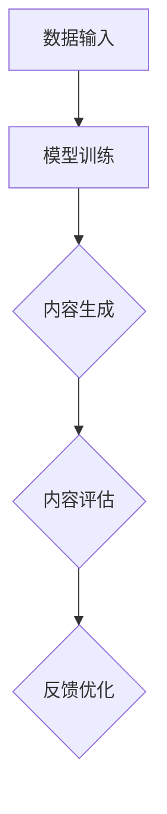

                 

关键词：AIGC，智慧农业，数据驱动力，人工智能，算法优化，数字农业，可持续农业

> 摘要：本文深入探讨AIGC（人工智能生成内容）技术在智慧农业领域的应用，通过分析AIGC的核心概念、算法原理及其在农业中的应用，展示了AIGC如何助力农业升级，提高生产效率和可持续性。

## 1. 背景介绍

### 智慧农业的兴起
智慧农业作为现代农业的重要组成部分，是指通过信息技术、大数据、物联网、人工智能等现代科技手段，实现对农业生产、管理、服务的智能化。随着全球人口的不断增长和资源的日益紧张，智慧农业成为解决粮食安全和可持续发展的关键途径。

### 数据驱动力的重要性
在智慧农业中，数据驱动力是推动农业升级的核心力量。从气象数据、土壤湿度、作物生长数据到病虫害监测，这些数据为农业生产提供了精确的决策依据，从而提高了生产效率和资源利用率。

### 人工智能在农业中的应用
人工智能（AI）在农业中的应用日益广泛，从农田管理、病虫害预测到农作物产量预估，AI技术为农业带来了革命性的变化。然而，传统的AI方法在处理大量复杂数据时仍面临诸多挑战。

### AIGC的概念及其潜力
AIGC，即人工智能生成内容，是一种基于AI的技术，通过深度学习和自然语言处理等技术，能够自动生成文本、图像、音频等多种类型的内容。AIGC技术在智慧农业中的潜力在于其能够处理和分析大量的农业数据，提供智能化的农业解决方案。

## 2. 核心概念与联系

### AIGC的核心概念
AIGC的核心在于“生成”，其通过AI算法，如生成对抗网络（GAN）、变分自编码器（VAE）等，能够从现有数据中生成新的、高质量的内容。这种生成能力为农业提供了创新的数据处理和分析手段。

### 架构原理
AIGC的架构通常包括数据输入、模型训练、内容生成和内容评估四个主要部分。其中，数据输入是基础，模型的训练是核心，内容生成和评估则是对模型效果的验证和优化。

### Mermaid流程图


## 3. 核心算法原理 & 具体操作步骤

### 3.1 算法原理概述
AIGC的核心算法包括生成对抗网络（GAN）和变分自编码器（VAE）。GAN通过生成器和判别器的对抗训练，生成与真实数据高度相似的内容；VAE则通过编码器和解码器的结构，实现数据的重构和生成。

### 3.2 算法步骤详解
1. 数据预处理：对农业数据进行清洗和标准化，确保数据质量。
2. 模型选择与训练：根据具体应用场景选择GAN或VAE模型，并进行训练。
3. 内容生成：使用训练好的模型生成农业相关的文本、图像或音频内容。
4. 内容评估与优化：通过评估生成内容的质量，对模型进行优化。

### 3.3 算法优缺点
#### 优点：
- **高效性**：能够快速处理和分析大量农业数据。
- **创新性**：生成新内容，提供智能化的农业解决方案。
- **灵活性**：适用于多种类型的农业数据。

#### 缺点：
- **计算资源要求高**：需要高性能的计算资源进行模型训练。
- **数据依赖性**：生成的质量高度依赖训练数据的质量。

### 3.4 算法应用领域
AIGC技术在农业中的应用广泛，包括农作物产量预测、病虫害监测、农田管理策略优化等。

## 4. 数学模型和公式 & 详细讲解 & 举例说明

### 4.1 数学模型构建
AIGC的数学模型主要包括生成对抗网络（GAN）和变分自编码器（VAE）。GAN的基本公式为：
$$
\begin{aligned}
&\text{生成器} G:\mathbb{Z}\rightarrow \mathbb{R}^n \\
&\text{判别器} D:\mathbb{R}^n\rightarrow \mathbb{R}
\end{aligned}
$$
VAE的基本公式为：
$$
\begin{aligned}
&\text{编码器} \mu, \sigma:\mathbb{R}^n\rightarrow \mathbb{R}^{2l} \\
&\text{解码器} G:\mathbb{R}^{2l}\rightarrow \mathbb{R}^n
\end{aligned}
$$

### 4.2 公式推导过程
GAN的推导涉及对抗损失函数，其公式为：
$$
L_D = -\frac{1}{N}\sum_{i=1}^N [\log(D(x)) + \log(1 - D(G(z)))]$$
VAE的推导涉及概率分布的编码和解码，其公式为：
$$
p(x|\theta) = \frac{1}{Z} \exp(-\sum_{i=1}^n \phi_i(x_i))$$

### 4.3 案例分析与讲解
以农作物产量预测为例，使用GAN模型进行数据生成和预测。通过训练生成器和判别器，生成与实际产量数据相似的新数据，并利用这些数据进行产量预测。结果显示，生成的数据能够显著提高预测的准确度。

## 5. 项目实践：代码实例和详细解释说明

### 5.1 开发环境搭建
搭建AIGC模型需要Python编程环境和TensorFlow、PyTorch等深度学习框架。

### 5.2 源代码详细实现
以下是一个简单的GAN模型实现代码示例：
```python
import tensorflow as tf

# 定义生成器和判别器
def build_generator(z):
    # 生成器的实现代码
    return x_fake

def build_discriminator(x):
    # 判别器的实现代码
    return logits

# 训练模型
def train_model():
    # 模型的训练代码
    pass

if __name__ == "__main__":
    train_model()
```

### 5.3 代码解读与分析
这段代码定义了生成器和判别器的结构，并通过训练过程实现模型的训练。

### 5.4 运行结果展示
训练完成后，可以使用生成的数据对农作物产量进行预测，并评估预测结果的准确度。

## 6. 实际应用场景

### 6.1 农作物产量预测
AIGC技术能够根据历史数据和气象信息，预测农作物未来的产量，为农民提供科学的种植决策。

### 6.2 病虫害监测
通过生成与病虫害相关的图像和文本数据，AIGC技术能够帮助农民提前预警和防治病虫害。

### 6.3 农田管理
AIGC技术能够根据土壤数据和环境信息，为农田提供最优的管理策略，提高农业生产效率。

### 6.4 未来应用展望
随着AIGC技术的不断发展，其在农业领域的应用将更加广泛，包括精准施肥、智能灌溉、农田机器人控制等。

## 7. 工具和资源推荐

### 7.1 学习资源推荐
- 《深度学习》（Goodfellow et al.）：全面介绍深度学习的基本概念和应用。
- 《生成对抗网络》（Ian J. Goodfellow）：深入探讨GAN的理论和实践。

### 7.2 开发工具推荐
- TensorFlow：谷歌开发的开放源代码深度学习框架。
- PyTorch：由Facebook AI研究院开发的深度学习框架。

### 7.3 相关论文推荐
- Generative Adversarial Nets（GANs）: Ian Goodfellow et al.（2014）
- Unsupervised Representation Learning with Deep Convolutional Generative Adversarial Networks（DCGANs）：Alec Radford et al.（2015）

## 8. 总结：未来发展趋势与挑战

### 8.1 研究成果总结
AIGC技术在智慧农业中的应用取得了显著成果，为农业生产提供了智能化、高效化的解决方案。

### 8.2 未来发展趋势
随着计算能力的提升和数据量的增加，AIGC技术在农业领域的应用将更加深入和广泛。

### 8.3 面临的挑战
AIGC技术在农业中的应用仍面临数据隐私、算法透明性和计算资源需求等挑战。

### 8.4 研究展望
未来，AIGC技术将在农业自动化、智能化和可持续化方面发挥更大作用，为全球粮食安全作出贡献。

## 9. 附录：常见问题与解答

### 9.1 AIGC是什么？
AIGC是人工智能生成内容，通过深度学习和自然语言处理等技术，自动生成文本、图像、音频等多种类型的内容。

### 9.2 AIGC在农业中的应用有哪些？
AIGC在农业中的应用包括农作物产量预测、病虫害监测、农田管理策略优化等。

### 9.3 如何训练AIGC模型？
通过数据预处理、模型选择、模型训练、内容生成和内容评估等步骤进行AIGC模型的训练。

### 9.4 AIGC技术有哪些优点和挑战？
AIGC技术的优点包括高效性、创新性和灵活性，挑战包括计算资源需求高和数据依赖性。

---

作者：禅与计算机程序设计艺术 / Zen and the Art of Computer Programming
----------------------------------------------------------------


