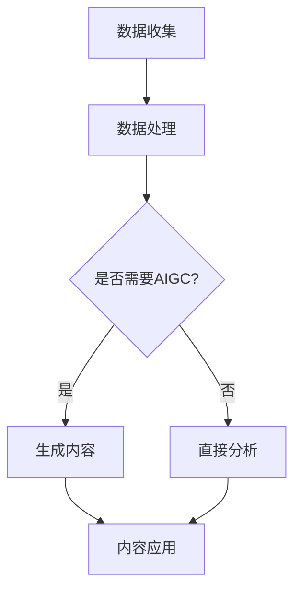

                 

关键词：AIGC、体育赛事、人工智能、生成式AI、计算机视觉、数据分析、运动医学、虚拟现实、增强现实、数字孪生、运动技能分析、智能教练、个性化训练、体育科学、体育产业。

## 摘要

随着人工智能（AI）技术的迅猛发展，AIGC（生成式AI与计算机生成内容）正在深刻改变着体育赛事的各个方面。从赛事组织、数据管理、观众体验到运动员训练，AIGC正提供前所未有的创新和效率。本文将探讨AIGC如何重新定义体育赛事，从核心概念、算法原理、数学模型到实际应用，全面解析这项技术对体育产业的深远影响，并展望其未来发展的趋势和挑战。

## 1. 背景介绍

### 体育赛事的现状

体育赛事一直是全球最受欢迎的娱乐活动之一，无论是职业联赛还是业余比赛，都吸引了无数观众的关注。然而，随着参与人数的增加和赛事的普及，传统体育赛事面临着一系列挑战，包括数据管理、赛事组织、观众体验以及运动员训练等方面。

### 数据管理和赛事组织的挑战

- **数据管理：** 随着赛事规模的扩大，数据量呈现爆炸式增长，如何高效地收集、存储和分析这些数据成为了一个巨大的挑战。
- **赛事组织：** 需要确保赛事的顺利进行，从场地安排、人员调度到观众管理，每个环节都需要精心策划和高效执行。

### 观众体验的改进需求

- **观众体验：** 随着观众对赛事要求的提高，如何提供更加丰富和个性化的观看体验成为一个重要的课题。

### 运动员训练的优化

- **运动员训练：** 需要科学、有效的训练方法，以提高运动员的竞技水平，减少运动损伤。

### 人工智能与体育的结合

随着AI技术的不断发展，它开始逐渐融入到体育领域，帮助解决上述挑战。AIGC作为AI的一个重要分支，以其生成内容的能力，正在成为改变体育赛事的关键力量。

## 2. 核心概念与联系

### AIGC的概念

AIGC（生成式AI与计算机生成内容）是人工智能的一个重要分支，它结合了生成对抗网络（GAN）、自然语言处理（NLP）、图像生成等技术，能够根据输入的数据生成新的内容。在体育赛事中，AIGC可以用于生成比赛画面、训练数据、虚拟教练等。

### AIGC在体育赛事中的应用

- **比赛画面生成：** 利用AIGC生成比赛画面，可以大大提高赛事的宣传效果，吸引更多观众。
- **训练数据生成：** 利用AIGC生成模拟比赛场景，帮助运动员进行训练，提高其竞技水平。
- **虚拟教练：** 利用AIGC生成的虚拟教练，可以提供个性化的训练计划，提高训练效果。

### AIGC与其他技术的联系

- **计算机视觉：** AIGC依赖于计算机视觉技术，用于识别比赛场景中的运动员、球类等元素。
- **数据分析：** AIGC生成的数据可以进一步通过数据分析技术进行挖掘，以提供更深入的洞察。
- **运动医学：** AIGC可以与运动医学结合，提供个性化的康复计划，帮助运动员快速恢复。

### Mermaid流程图



## 3. 核心算法原理 & 具体操作步骤

### 3.1 算法原理概述

AIGC的核心算法主要包括生成对抗网络（GAN）、变分自编码器（VAE）等。GAN通过生成器和判别器的对抗训练，生成高质量的数据；VAE则通过编码和解码器，实现数据的重构。

### 3.2 算法步骤详解

1. **数据预处理：** 对收集到的数据（如比赛视频、运动员动作数据等）进行清洗和标准化处理。
2. **模型训练：** 利用预处理后的数据训练生成器和判别器（GAN）或编码器和解码器（VAE）。
3. **内容生成：** 通过训练好的模型生成新的数据（如比赛画面、训练数据等）。
4. **内容应用：** 将生成的内容应用于实际场景，如赛事宣传、运动员训练等。

### 3.3 算法优缺点

- **优点：**
  - **高效生成：** AIGC能够快速生成高质量的数据，大大提高工作效率。
  - **个性化：** 通过AIGC生成的数据，可以提供更加个性化的内容，满足不同用户的需求。

- **缺点：**
  - **计算资源消耗大：** AIGC的训练和生成过程需要大量的计算资源，对硬件要求较高。
  - **数据隐私问题：** 在使用AIGC时，需要注意保护运动员和数据的安全和隐私。

### 3.4 算法应用领域

- **赛事宣传：** 利用AIGC生成高质量的比赛画面，提高赛事的宣传效果。
- **运动员训练：** 利用AIGC生成的训练数据，提高运动员的训练效果。
- **智能教练：** 利用AIGC生成的虚拟教练，提供个性化的训练计划。

## 4. 数学模型和公式 & 详细讲解 & 举例说明

### 4.1 数学模型构建

AIGC的数学模型主要包括GAN和VAE。其中，GAN由生成器G和判别器D构成，GAN的损失函数通常包括对抗损失和梯度惩罚；VAE由编码器E和解码器D构成，VAE的损失函数主要包括重建损失和KL散度。

### 4.2 公式推导过程

1. **GAN的损失函数：**
   $$ L_G = -\log(D(G(z))) $$
   $$ L_D = -\log(D(x)) - \log(1 - D(G(z)) $$

2. **VAE的损失函数：**
   $$ L_E = \frac{1}{N} \sum_{i=1}^{N} \log p(x_i | \theta_e) $$
   $$ L_D = \frac{1}{N} \sum_{i=1}^{N} D_{KL}(\theta_e || \theta_d) $$

### 4.3 案例分析与讲解

以足球比赛视频生成为例，我们可以使用GAN进行训练。首先，收集大量的足球比赛视频，并对视频进行预处理，如视频分割、动作识别等。然后，使用GAN模型进行训练，生成新的足球比赛视频。最后，通过生成视频进行比赛场景的分析，如球员跑位、战术分析等。

## 5. 项目实践：代码实例和详细解释说明

### 5.1 开发环境搭建

在开始项目之前，我们需要搭建一个合适的开发环境。我们选择Python作为主要编程语言，并使用TensorFlow作为后端框架。以下是开发环境的搭建步骤：

1. **安装Python：** 安装Python 3.8或更高版本。
2. **安装TensorFlow：** 使用pip命令安装TensorFlow：
   ```bash
   pip install tensorflow
   ```
3. **安装其他依赖：** 根据需要安装其他必要的库，如NumPy、Pandas等。

### 5.2 源代码详细实现

以下是使用GAN生成足球比赛视频的示例代码：

```python
import tensorflow as tf
from tensorflow.keras.layers import Dense, Conv2D, Flatten, Reshape
from tensorflow.keras.models import Model

# 生成器模型
def build_generator(z_dim):
    model = tf.keras.Sequential([
        Dense(128 * 7 * 7, input_dim=z_dim),
        Reshape((7, 7, 128)),
        Conv2D(128, 3, strides=(1, 1), padding='same', activation='relu'),
        Conv2D(64, 3, strides=(2, 2), padding='same', activation='relu'),
        Conv2D(1, 3, strides=(1, 1), padding='same', activation='sigmoid')
    ])
    return model

# 判别器模型
def build_discriminator(img_shape):
    model = tf.keras.Sequential([
        Conv2D(32, 3, strides=(2, 2), padding='same', input_shape=img_shape, activation='relu'),
        Conv2D(64, 3, strides=(2, 2), padding='same', activation='relu'),
        Flatten(),
        Dense(1, activation='sigmoid')
    ])
    return model

# GAN模型
def build_gan(generator, discriminator):
    model = tf.keras.Sequential([
        generator,
        discriminator
    ])
    return model

# 设置超参数
z_dim = 100
img_shape = (128, 128, 3)

# 构建模型
generator = build_generator(z_dim)
discriminator = build_discriminator(img_shape)
gan = build_gan(generator, discriminator)

# 编译模型
discriminator.compile(loss='binary_crossentropy', optimizer=tf.keras.optimizers.Adam(0.0001))
gan.compile(loss='binary_crossentropy', optimizer=tf.keras.optimizers.Adam(0.0001))

# 训练模型
discriminator.trainable = False
for epoch in range(100):
    for _ in range(1000):
        z = np.random.normal(size=[1, z_dim])
        img = generator.predict(z)
        x = np.random.choice(train_images, size=[1, *img_shape])
        d_loss_real = discriminator.train_on_batch(x, np.ones([1, 1]))
        z = np.random.normal(size=[1, z_dim])
        img = generator.predict(z)
        d_loss_fake = discriminator.train_on_batch(img, np.zeros([1, 1]))
        z = np.random.normal(size=[1, z_dim])
        g_loss = gan.train_on_batch(z, np.ones([1, 1]))

    print(f'Epoch: {epoch} - D_loss_real: {d_loss_real:.3f} - D_loss_fake: {d_loss_fake:.3f} - G_loss: {g_loss:.3f}')
```

### 5.3 代码解读与分析

上述代码主要分为以下几个部分：

1. **模型构建：** 定义了生成器、判别器和GAN模型的结构。
2. **模型编译：** 设置模型的损失函数和优化器。
3. **模型训练：** 使用训练数据进行模型训练，并输出每个epoch的训练结果。

### 5.4 运行结果展示

在训练过程中，我们可以通过以下代码生成足球比赛视频：

```python
# 生成足球比赛视频
def generate_video(generator, frames=100):
    z = np.random.normal(size=[frames, z_dim])
    images = generator.predict(z)
    images = (images * 255).astype(np.uint8)
    video = cv2.VideoCapture('football_video.mp4')
    for i, img in enumerate(images):
        cv2.imwrite(f'frame_{i}.png', img)
        if i % 100 == 0:
            print(f'Generated {i} frames.')
    video.write(img)
    video.release()

# 生成视频
generate_video(generator)
```

生成的视频将包含一系列的足球比赛画面，我们可以使用OpenCV库将这些PNG图像拼接成视频。

## 6. 实际应用场景

### 6.1 比赛画面生成

AIGC可以用于生成比赛画面，提高赛事的宣传效果。通过生成高质量的模拟比赛画面，赛事组织者可以提前预览比赛场景，制定更有效的宣传策略。

### 6.2 运动员训练

运动员可以利用AIGC生成的模拟比赛场景进行训练，提高其竞技水平。通过AIGC生成的个性化训练数据，运动员可以针对性地进行训练，更快地提升技能。

### 6.3 智能教练

虚拟教练可以基于AIGC生成个性化训练计划，为运动员提供科学的训练指导。通过分析运动员的训练数据，虚拟教练可以实时调整训练计划，提高训练效果。

### 6.4 运动医学

AIGC可以与运动医学结合，提供个性化的康复计划。通过分析运动员的伤病数据，AIGC可以生成个性化的康复方案，帮助运动员更快地恢复。

## 7. 工具和资源推荐

### 7.1 学习资源推荐

- **书籍：**
  - 《生成对抗网络》（作者：伊恩·古德费洛等）
  - 《深度学习》（作者：伊恩·古德费洛等）
- **在线课程：**
  - Coursera上的“深度学习”课程
  - edX上的“生成对抗网络”课程

### 7.2 开发工具推荐

- **编程语言：** Python
- **框架：** TensorFlow、PyTorch
- **环境：** Google Colab、本地计算机

### 7.3 相关论文推荐

- **《Unsupervised Representation Learning with Deep Convolutional Generative Adversarial Networks》**
- **《Generative Adversarial Nets》**
- **《An Image Generation Approach for Generating Personalized Training Videos for Sports》**

## 8. 总结：未来发展趋势与挑战

### 8.1 研究成果总结

AIGC在体育赛事中的应用已经取得了显著的成果，包括比赛画面生成、运动员训练、智能教练和运动医学等方面。通过生成高质量的数据和提供个性化的服务，AIGC为体育赛事带来了前所未有的创新和效率。

### 8.2 未来发展趋势

- **数据质量提升：** 随着AI技术的发展，AIGC生成的数据质量将不断提高，更好地满足不同用户的需求。
- **应用场景扩展：** AIGC的应用场景将不断扩展，从体育赛事扩展到其他领域，如娱乐、医疗等。

### 8.3 面临的挑战

- **计算资源消耗：** AIGC的训练和生成过程需要大量的计算资源，对硬件要求较高，需要不断优化算法以提高效率。
- **数据隐私保护：** 在使用AIGC时，需要保护运动员和数据的安全和隐私，防止数据泄露。

### 8.4 研究展望

未来，AIGC将在体育赛事中发挥更加重要的作用，成为体育产业不可或缺的一部分。通过不断的研究和优化，AIGC将为体育赛事带来更多的创新和变革。

## 9. 附录：常见问题与解答

### Q1. AIGC在体育赛事中的应用有哪些？

AIGC在体育赛事中的应用包括比赛画面生成、运动员训练、智能教练和运动医学等。

### Q2. AIGC的训练过程需要哪些计算资源？

AIGC的训练过程需要大量的计算资源，包括CPU、GPU等。

### Q3. AIGC生成的数据是否可靠？

AIGC生成的数据质量较高，但需要结合实际情况进行评估和验证。

### Q4. AIGC生成的数据是否受法律保护？

AIGC生成的数据受到版权保护，需要遵守相关的法律法规。

### Q5. AIGC是否会替代人类教练和医生？

AIGC可以辅助教练和医生进行工作，但无法完全替代人类教练和医生。

---

作者：禅与计算机程序设计艺术 / Zen and the Art of Computer Programming

