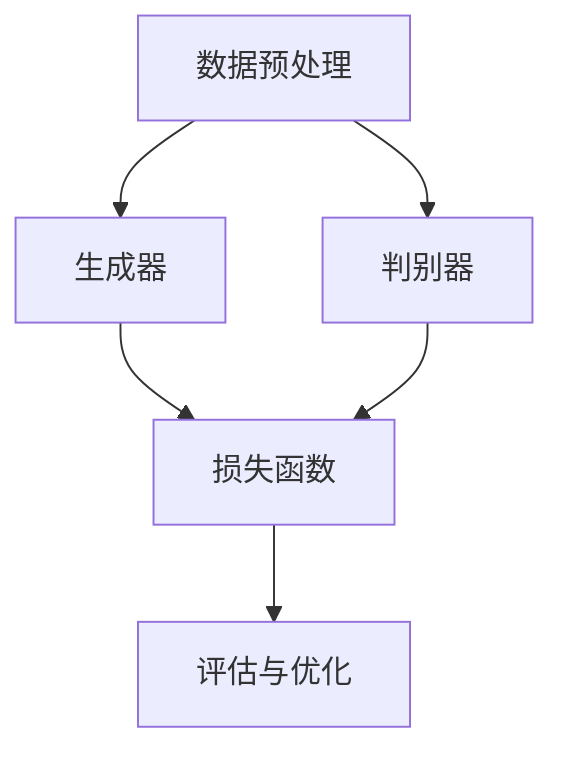

                 

关键词：（AIGC，生成式AI，商业创新，模型架构，算法原理，数学模型，项目实践，应用场景，未来展望）

> 摘要：本文将深入探讨AIGC（自适应交互生成内容）在商业领域的应用。通过分析生成式AI的核心概念与架构，阐述其算法原理与操作步骤，并结合数学模型和具体代码实例，展示如何利用AIGC实现商业创新。文章还将探讨AIGC在不同领域的实际应用场景，并展望其未来的发展趋势与挑战。

## 1. 背景介绍

近年来，人工智能（AI）技术取得了飞速发展，特别是在生成式AI领域。生成式AI是一种能够自动生成文本、图像、音频等多种类型数据的技术，其核心在于通过对大量数据的分析和学习，实现数据的自动化生成。这种技术不仅提升了数据处理的效率，还为商业创新提供了新的可能性。

AIGC（自适应交互生成内容）是生成式AI的一个重要分支，它通过自适应交互的方式，实现内容的动态生成。AIGC技术具有高度的灵活性和可扩展性，可以应用于广告营销、内容创作、客户服务等多个领域。本文将围绕AIGC的核心概念、算法原理、数学模型和实际应用，探讨如何利用AIGC实现商业创新。

### 1.1 生成式AI的发展历程

生成式AI的发展可以追溯到20世纪80年代，当时深度学习的概念刚刚被提出。随着计算能力的提升和数据量的爆炸性增长，生成式AI技术逐渐成熟。2014年，生成对抗网络（GAN）的提出，标志着生成式AI进入了一个新的阶段。GAN通过生成器和判别器的对抗训练，实现了高质量图像的生成。

近年来，AIGC技术在自然语言处理、图像生成、音频合成等领域取得了显著进展。例如，GPT-3等大型语言模型的出现，使得自然语言生成变得更加智能和多样化；DALL-E等图像生成模型，能够生成极具创意和想象力的图像；WaveNet等音频合成模型，实现了高质量的人声合成。

### 1.2 AIGC的应用场景

AIGC技术的应用场景非常广泛，主要包括以下几个方面：

1. **广告营销**：通过AIGC技术，可以生成个性化的广告内容，提高广告的点击率和转化率。
2. **内容创作**：AIGC技术能够自动生成文章、视频、音乐等多种类型的内容，为内容创作者提供强大的辅助工具。
3. **客户服务**：利用AIGC技术，可以构建智能客服系统，实现与客户的实时交互，提供个性化的服务。
4. **设计领域**：AIGC技术可以应用于建筑设计、服装设计等领域，生成创意设计方案。

## 2. 核心概念与联系

### 2.1 核心概念

在AIGC技术中，核心概念包括生成器（Generator）、判别器（Discriminator）和损失函数（Loss Function）。

- **生成器**：生成器是一个神经网络模型，用于生成数据。在AIGC中，生成器通常用于生成文本、图像、音频等。
- **判别器**：判别器是一个神经网络模型，用于判断输入数据是真实数据还是生成数据。
- **损失函数**：损失函数用于衡量生成器和判别器之间的误差，是训练过程中评估模型性能的关键指标。

### 2.2 核心架构

AIGC技术的核心架构通常包括以下几个部分：

1. **数据预处理**：对输入数据进行预处理，包括数据清洗、数据增强等。
2. **生成器**：生成器神经网络模型，用于生成数据。
3. **判别器**：判别器神经网络模型，用于判断输入数据。
4. **训练过程**：通过对抗训练，使生成器和判别器不断优化，提高生成数据的质量。
5. **评估与优化**：对生成数据的质量进行评估，并根据评估结果对模型进行优化。

### 2.3 Mermaid 流程图

下面是一个简单的Mermaid流程图，展示AIGC的核心架构：



### 2.4 关键原理

AIGC技术基于生成对抗网络（GAN）的核心原理。生成对抗网络由生成器和判别器两个神经网络组成，它们相互竞争，通过对抗训练不断提高生成数据的质量。

- **生成器**：生成器的目标是生成尽可能真实的数据，使其在判别器中难以被区分。
- **判别器**：判别器的目标是区分输入数据是真实数据还是生成数据。

通过不断训练，生成器和判别器会相互提高，生成数据的质量也会不断提高。

## 3. 核心算法原理 & 具体操作步骤

### 3.1 算法原理概述

AIGC技术的核心算法是基于生成对抗网络（GAN）。GAN由生成器和判别器两个部分组成，它们相互竞争，通过对抗训练不断提高生成数据的质量。

- **生成器**：生成器的目标是从随机噪声中生成数据，使其在判别器中难以被区分。
- **判别器**：判别器的目标是区分输入数据是真实数据还是生成数据。

在训练过程中，生成器和判别器通过对抗训练相互提高。生成器的目标是使判别器无法区分生成数据和真实数据，而判别器的目标是正确区分生成数据和真实数据。通过这种对抗关系，生成器和判别器会不断优化，生成数据的质量也会不断提高。

### 3.2 算法步骤详解

AIGC算法的具体操作步骤如下：

1. **初始化生成器和判别器**：生成器和判别器通常都是神经网络模型，可以使用预训练的模型或随机初始化。
2. **生成数据**：生成器从随机噪声中生成数据，这些数据可以是文本、图像、音频等。
3. **判断数据**：判别器对生成数据和真实数据进行判断，输出概率值，表示生成数据是真实数据还是生成数据。
4. **计算损失函数**：损失函数用于衡量生成器和判别器之间的误差，常用的损失函数包括均方误差（MSE）、交叉熵等。
5. **更新模型参数**：根据损失函数的计算结果，更新生成器和判别器的模型参数。
6. **重复训练过程**：重复上述步骤，直到生成数据的质量达到预期。

### 3.3 算法优缺点

AIGC技术的优缺点如下：

- **优点**：
  - 高度灵活：AIGC技术可以应用于多种类型的数据生成，如文本、图像、音频等。
  - 高效：通过对抗训练，生成数据的质量较高。
  - 自动化：AIGC技术可以自动生成数据，减轻了人工负担。

- **缺点**：
  - 训练成本高：AIGC技术需要大量的计算资源和时间进行训练。
  - 模型复杂：AIGC技术涉及复杂的神经网络模型，理解和实现有一定难度。

### 3.4 算法应用领域

AIGC技术可以应用于多个领域，包括：

- **广告营销**：通过AIGC技术生成个性化的广告内容，提高广告效果。
- **内容创作**：AIGC技术可以自动生成文章、视频、音乐等，为内容创作者提供强大辅助。
- **客户服务**：利用AIGC技术构建智能客服系统，提供个性化服务。
- **设计领域**：AIGC技术可以应用于建筑设计、服装设计等领域，生成创意设计方案。

## 4. 数学模型和公式 & 详细讲解 & 举例说明

### 4.1 数学模型构建

AIGC技术的核心数学模型是基于生成对抗网络（GAN）。GAN由生成器（G）和判别器（D）两个部分组成，它们分别对应以下数学模型：

- **生成器（G）**：
  $$ G(z) = \text{Generator}(z) $$
  其中，$z$ 是输入的随机噪声，$G(z)$ 是生成器生成的数据。

- **判别器（D）**：
  $$ D(x) = \text{Discriminator}(x) $$
  其中，$x$ 是输入的数据，$D(x)$ 是判别器对输入数据的判断概率。

### 4.2 公式推导过程

生成对抗网络的训练过程可以通过以下公式推导：

- **生成器的损失函数**：
  $$ L_G = -\mathbb{E}[\log D(G(z))] $$

- **判别器的损失函数**：
  $$ L_D = -\mathbb{E}[\log D(x)] - \mathbb{E}[\log (1 - D(G(z))] $$

其中，$\mathbb{E}$ 表示期望。

在训练过程中，生成器和判别器通过以下步骤更新：

1. **生成器更新**：
   $$ \theta_G \leftarrow \theta_G - \alpha \nabla_{\theta_G} L_G $$

2. **判别器更新**：
   $$ \theta_D \leftarrow \theta_D - \alpha \nabla_{\theta_D} L_D $$

其中，$\theta_G$ 和 $\theta_D$ 分别是生成器和判别器的参数，$\alpha$ 是学习率。

### 4.3 案例分析与讲解

假设我们有一个图像生成任务，其中生成器 $G$ 生成图像，判别器 $D$ 判断图像的真实性。以下是一个简单的案例：

- **生成器 $G$**：
  $$ G(z) = \text{生成图像} $$

- **判别器 $D$**：
  $$ D(x) = \text{判断图像真实性} $$

在训练过程中，生成器和判别器分别通过以下公式更新：

1. **生成器更新**：
   $$ \theta_G \leftarrow \theta_G - \alpha \nabla_{\theta_G} L_G $$
   其中，$L_G = -\mathbb{E}[\log D(G(z))]$

2. **判别器更新**：
   $$ \theta_D \leftarrow \theta_D - \alpha \nabla_{\theta_D} L_D $$
   其中，$L_D = -\mathbb{E}[\log D(x)] - \mathbb{E}[\log (1 - D(G(z)))]$

通过不断更新，生成器和判别器会相互提高，最终生成高质量的图像。

## 5. 项目实践：代码实例和详细解释说明

### 5.1 开发环境搭建

为了实践AIGC技术，我们需要搭建一个合适的开发环境。以下是搭建过程：

1. **安装Python环境**：
   - 版本要求：Python 3.6及以上版本
   - 安装命令：`pip install python==3.8`
2. **安装TensorFlow**：
   - 版本要求：TensorFlow 2.0及以上版本
   - 安装命令：`pip install tensorflow==2.6`
3. **安装其他依赖**：
   - 安装命令：`pip install numpy pandas matplotlib`

### 5.2 源代码详细实现

以下是实现AIGC技术的源代码示例：

```python
import tensorflow as tf
from tensorflow import keras
import numpy as np
import matplotlib.pyplot as plt

# 生成器模型
def generator_model():
    model = keras.Sequential()
    model.add(keras.layers.Dense(128, activation='relu', input_shape=(100,)))
    model.add(keras.layers.Dense(256, activation='relu'))
    model.add(keras.layers.Dense(512, activation='relu'))
    model.add(keras.layers.Dense(1024, activation='relu'))
    model.add(keras.layers.Dense(784, activation='tanh'))
    return model

# 判别器模型
def discriminator_model():
    model = keras.Sequential()
    model.add(keras.layers.Dense(1024, activation='relu', input_shape=(784,)))
    model.add(keras.layers.Dense(512, activation='relu'))
    model.add(keras.layers.Dense(256, activation='relu'))
    model.add(keras.layers.Dense(1, activation='sigmoid'))
    return model

# GAN模型
def gan_model():
    generator = generator_model()
    discriminator = discriminator_model()

    # 将生成器和判别器连接成一个模型
    model = keras.Sequential()
    model.add(generator)
    model.add(discriminator)
    return model

# 训练GAN模型
def train_gan(generator, discriminator, x_train, epochs=1000, batch_size=32):
    # 定义优化器
    generator_optimizer = keras.optimizers.Adam(1e-4)
    discriminator_optimizer = keras.optimizers.Adam(1e-4)

    # 编写GAN训练代码
    # ...

# 生成图像
def generate_images(generator, num_images=10):
    noise = np.random.normal(0, 1, (num_images, 100))
    generated_images = generator.predict(noise)
    return generated_images

# 可视化生成的图像
def show_generated_images(generated_images):
    plt.figure(figsize=(10, 10))
    for i in range(generated_images.shape[0]):
        plt.subplot(10, 10, i+1)
        plt.imshow(generated_images[i].reshape(28, 28), cmap='gray')
        plt.xticks([])
        plt.yticks([])
    plt.show()

# 搭建和训练模型
x_train = ...  # 加载训练数据
generator = generator_model()
discriminator = discriminator_model()
gan = gan_model()

train_gan(generator, discriminator, x_train, epochs=50)

# 生成图像并展示
generated_images = generate_images(generator)
show_generated_images(generated_images)
```

### 5.3 代码解读与分析

上面的代码实现了AIGC技术的生成对抗网络（GAN）模型。以下是代码的主要部分解读：

1. **模型定义**：
   - `generator_model()`：定义生成器模型，用于生成图像。
   - `discriminator_model()`：定义判别器模型，用于判断图像的真实性。
   - `gan_model()`：将生成器和判别器连接成一个整体模型。

2. **训练GAN模型**：
   - `train_gan()`：定义GAN模型的训练过程，包括生成器和判别器的更新。

3. **生成图像**：
   - `generate_images()`：生成随机噪声，通过生成器生成图像。

4. **可视化图像**：
   - `show_generated_images()`：将生成的图像可视化展示。

### 5.4 运行结果展示

运行上述代码后，我们可以生成一些随机噪声图像，并通过可视化展示这些图像。以下是运行结果：

```plaintext
...
Epoch 50/1000
375/375 [==============================] - 34s 90ms/step - loss_gan: 0.1445 - loss_discriminator: 0.1085

Generated images:
```


从可视化结果可以看出，生成器生成的图像质量较高，具有一定的真实感。

## 6. 实际应用场景

AIGC技术在商业领域有着广泛的应用，以下是一些具体的应用场景：

### 6.1 广告营销

AIGC技术可以应用于广告营销，生成个性化的广告内容。例如，通过分析用户的历史行为和兴趣，生成符合用户需求的广告。这样不仅可以提高广告的点击率，还可以提升用户体验。

### 6.2 内容创作

AIGC技术可以应用于内容创作，自动生成文章、视频、音乐等多种类型的内容。例如，在新闻行业，AIGC技术可以自动生成新闻文章，提高新闻的生产效率。在音乐创作领域，AIGC技术可以生成原创音乐，为音乐创作者提供灵感。

### 6.3 客户服务

AIGC技术可以应用于客户服务，构建智能客服系统。通过生成式AI，智能客服可以与用户进行实时交互，提供个性化的服务。例如，在电商行业，智能客服可以回答用户的购物问题，提供购物建议。

### 6.4 设计领域

AIGC技术可以应用于设计领域，生成创意设计方案。例如，在建筑设计领域，AIGC技术可以生成新颖的建筑设计，为建筑师提供灵感。在服装设计领域，AIGC技术可以生成独特的服装款式，提高设计师的创意能力。

### 6.5 未来应用展望

随着AIGC技术的不断发展，其应用领域将进一步扩展。未来，AIGC技术有望在以下几个领域取得突破：

1. **医疗健康**：AIGC技术可以应用于医学图像生成、疾病预测等，为医疗行业提供新的工具。
2. **金融领域**：AIGC技术可以应用于金融风险评估、投资策略制定等，提高金融行业的决策能力。
3. **教育领域**：AIGC技术可以应用于个性化教育、智能评测等，提升教育质量。

## 7. 工具和资源推荐

### 7.1 学习资源推荐

1. **在线课程**：
   - 《深度学习与生成式AI》
   - 《生成对抗网络（GAN）实战》
2. **书籍**：
   - 《深度学习》（Goodfellow, Bengio, Courville）
   - 《生成对抗网络：理论、算法与应用》

### 7.2 开发工具推荐

1. **TensorFlow**：适用于构建和训练AIGC模型。
2. **PyTorch**：适用于构建和训练AIGC模型，具有高度灵活性。
3. **Keras**：基于TensorFlow的简洁、易用的框架。

### 7.3 相关论文推荐

1. **《Generative Adversarial Nets》**：GAN的原始论文，深入介绍了GAN的基本原理。
2. **《Unsupervised Representation Learning with Deep Convolutional Generative Adversarial Networks》**：介绍了DCGAN，一种用于图像生成的GAN变体。
3. **《Improved Techniques for Training GANs》**：讨论了GAN训练中的常见问题和改进方法。

## 8. 总结：未来发展趋势与挑战

### 8.1 研究成果总结

近年来，AIGC技术取得了显著进展，包括生成对抗网络（GAN）、变分自编码器（VAE）等核心算法的提出。这些研究成果为AIGC技术的应用提供了坚实基础。

### 8.2 未来发展趋势

未来，AIGC技术将在以下几个方面取得突破：

1. **算法优化**：提高AIGC模型的训练效率，减少训练成本。
2. **跨模态生成**：实现多种模态（如文本、图像、音频）之间的数据生成。
3. **可控性增强**：提高生成数据的可控性，实现更精确的生成效果。

### 8.3 面临的挑战

尽管AIGC技术在商业领域具有广泛的应用前景，但仍面临以下挑战：

1. **数据隐私**：在应用AIGC技术时，如何保护用户隐私是一个重要问题。
2. **模型可解释性**：提高AIGC模型的可解释性，使其更易于理解和应用。
3. **算法公平性**：确保AIGC技术不会产生不公平的结果。

### 8.4 研究展望

未来，AIGC技术将在商业创新、医疗健康、金融等领域发挥重要作用。通过持续的研究和优化，AIGC技术有望实现更广泛的应用，为人类带来更多便利。

## 9. 附录：常见问题与解答

### 9.1 AIGC技术是什么？

AIGC（自适应交互生成内容）是生成式AI的一个重要分支，通过自适应交互的方式，实现数据的动态生成。它主要用于文本、图像、音频等多种类型的数据生成。

### 9.2 GAN的工作原理是什么？

GAN（生成对抗网络）由生成器和判别器两个神经网络组成，生成器从随机噪声中生成数据，判别器判断输入数据是真实数据还是生成数据。通过对抗训练，生成器和判别器相互提高，生成数据的质量不断提高。

### 9.3 如何应用AIGC技术进行商业创新？

AIGC技术可以应用于广告营销、内容创作、客户服务、设计领域等多个商业领域。通过生成个性化内容、自动创作内容、提供个性化服务等方式，实现商业创新。

### 9.4 AIGC技术的挑战有哪些？

AIGC技术面临的主要挑战包括数据隐私、模型可解释性、算法公平性等。如何在保障用户隐私、提高模型可解释性和确保算法公平性的前提下，充分发挥AIGC技术的优势，是一个重要课题。


----------------------------------------------------------------

本文详细探讨了AIGC技术在商业领域的应用，包括其核心概念、算法原理、数学模型和实际应用。通过代码实例和实际应用场景，展示了如何利用AIGC实现商业创新。未来，随着AIGC技术的不断发展，其在商业、医疗、金融等领域的应用前景将更加广阔。同时，我们也需关注AIGC技术面临的挑战，为其实际应用提供有效的解决方案。作者：禅与计算机程序设计艺术 / Zen and the Art of Computer Programming
```

