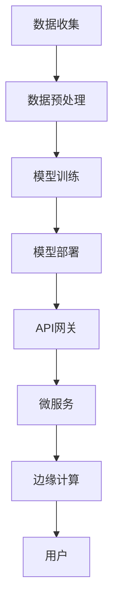

                 

关键词：AI-Native应用，架构设计，技术趋势，开发框架，人工智能，微服务，云计算，边缘计算。

## 摘要

本文将探讨AI-Native应用的兴起及其对软件开发领域的深远影响。AI-Native应用是一种专为人工智能技术优化设计的应用程序，它充分利用了机器学习和深度学习的强大功能，提供了前所未有的智能化体验。文章首先介绍了AI-Native应用的基本概念和背景，随后深入分析了其核心概念、算法原理、数学模型、项目实践和实际应用场景。最后，文章展望了AI-Native应用的未来发展趋势，并提出了相关的研究展望和挑战。

## 1. 背景介绍

### AI-Native应用的概念

AI-Native应用，顾名思义，是一种与人工智能深度集成的应用。这些应用不仅依赖于传统的前端和后端技术，更重要的是它们利用了机器学习和深度学习算法，通过数据驱动的方式实现智能化的功能。AI-Native应用的目标是使应用程序更加智能，提供更加个性化、实时和高效的用户体验。

### 人工智能技术的发展

人工智能技术在过去几十年中经历了显著的发展。从最初的规则基础系统到基于统计学习的模型，再到深度学习算法的兴起，人工智能在图像识别、自然语言处理、自动驾驶等多个领域取得了突破性进展。随着计算能力的提升和大数据的普及，人工智能的应用场景不断扩展，为AI-Native应用的诞生提供了坚实的基础。

### 软件开发模式的变化

随着云计算、微服务和边缘计算的兴起，软件开发的模式也在不断变化。传统的单体应用逐渐被模块化、分布式的架构所取代，这使得应用程序能够更加灵活、高效地应对复杂业务需求。而AI-Native应用的兴起，则进一步推动了软件架构的优化和智能化。

## 2. 核心概念与联系

为了更好地理解AI-Native应用，我们需要探讨其核心概念和架构，并通过Mermaid流程图来展示其组成部分和相互关系。

### 核心概念

- **机器学习模型**：AI-Native应用的核心在于机器学习模型。这些模型通过训练和优化，能够从数据中学习并提取有价值的信息。
- **数据管道**：数据管道负责数据的收集、处理和传输，是AI-Native应用的数据基础。
- **API网关**：API网关负责接收外部请求，并进行路由和权限控制，是AI-Native应用的前端接口。
- **微服务架构**：微服务架构使得AI-Native应用能够更加灵活地扩展和部署，提高了系统的可维护性和可扩展性。
- **边缘计算**：边缘计算将计算任务分布到网络的边缘节点，降低了延迟，提高了响应速度。

### Mermaid流程图



在这个流程图中，数据从用户输入开始，经过数据收集、预处理和模型训练等步骤，最终通过API网关和微服务架构被用户访问。边缘计算则在这个流程中扮演了优化响应速度的角色。

## 3. 核心算法原理 & 具体操作步骤

### 3.1 算法原理概述

AI-Native应用的核心算法通常是基于深度学习的神经网络模型。神经网络通过多层节点（神经元）的相互连接，模拟人脑的神经元网络，从而实现数据的处理和学习。以下是一些常见的神经网络模型：

- **卷积神经网络（CNN）**：适用于图像识别和分类任务。
- **循环神经网络（RNN）**：适用于序列数据处理，如自然语言处理和时间序列预测。
- **生成对抗网络（GAN）**：适用于生成新的数据，如图像生成和风格迁移。

### 3.2 算法步骤详解

1. **数据收集**：从不同的数据源收集原始数据，如用户输入、传感器数据等。
2. **数据预处理**：清洗和规范化数据，使其符合模型训练的需求。
3. **模型设计**：根据应用场景选择合适的神经网络模型，并进行参数配置。
4. **模型训练**：使用预处理后的数据对模型进行训练，优化模型的参数。
5. **模型评估**：使用验证数据集评估模型的性能，调整模型参数。
6. **模型部署**：将训练好的模型部署到生产环境中，通过API网关提供服务。
7. **实时更新**：根据用户反馈和业务需求，定期更新模型，以保持其性能。

### 3.3 算法优缺点

#### 优点

- **高效率**：深度学习模型能够高效地处理大量数据，提供快速的计算结果。
- **灵活性**：神经网络模型可以根据不同的应用场景进行定制化设计。
- **准确性**：通过大量数据和参数优化，深度学习模型可以达到很高的准确性。

#### 缺点

- **计算资源消耗**：深度学习模型通常需要大量的计算资源和时间进行训练。
- **数据依赖性**：模型的性能高度依赖于数据的质量和数量。
- **解释性差**：深度学习模型的内部机制复杂，难以解释和调试。

### 3.4 算法应用领域

深度学习算法在多个领域取得了显著的成果，如：

- **图像识别与处理**：用于人脸识别、图像分类和图像增强等任务。
- **自然语言处理**：用于机器翻译、情感分析和文本生成等任务。
- **语音识别与合成**：用于语音助手、语音识别和语音合成等任务。
- **推荐系统**：用于商品推荐、内容推荐和个性化推荐等任务。

## 4. 数学模型和公式 & 详细讲解 & 举例说明

### 4.1 数学模型构建

深度学习中的数学模型通常包括以下几个部分：

1. **输入层（Input Layer）**：接收输入数据。
2. **隐藏层（Hidden Layer）**：对输入数据进行处理和特征提取。
3. **输出层（Output Layer）**：生成预测结果。

在神经网络中，每个神经元之间的连接都带有权重（Weight）和偏置（Bias）。神经元的输出通过激活函数（Activation Function）进行处理，最终生成预测结果。

### 4.2 公式推导过程

以下是一个简单的单层神经网络模型，用于对输入数据进行二分类：

$$
z = \sum_{i=1}^{n} w_i \cdot x_i + b \\
a = \sigma(z) \\
y = \begin{cases}
1 & \text{if } a > 0.5 \\
0 & \text{otherwise}
\end{cases}
$$

其中，$z$ 是神经元的输出，$w_i$ 是输入层到隐藏层的权重，$b$ 是偏置，$x_i$ 是输入数据，$a$ 是激活值，$\sigma$ 是激活函数，$y$ 是输出结果。

### 4.3 案例分析与讲解

假设我们要构建一个简单的神经网络模型，用于判断一个数字是否大于5。输入数据是一个数字，输出数据是一个二进制结果（1代表大于5，0代表小于等于5）。

1. **数据预处理**：将输入数据归一化，使其在0到1之间。
2. **模型设计**：设计一个单层神经网络，包含一个输入层和一个输出层。输入层有1个神经元，输出层有1个神经元。
3. **模型训练**：使用训练数据集对模型进行训练，调整权重和偏置，使得模型能够正确预测输入数据的分类。
4. **模型评估**：使用验证数据集评估模型的性能，确保模型能够准确预测未知数据的分类。

通过上述步骤，我们可以构建一个简单的AI-Native应用，用于判断数字是否大于5。以下是一个简单的Python代码示例：

```python
import numpy as np

# 定义激活函数
def sigmoid(x):
    return 1 / (1 + np.exp(-x))

# 定义反向传播算法
def backwardpropagation(x, y, w, b):
    a = sigmoid(np.dot(x, w) + b)
    d = a - y
    dw = np.dot(x.T, d)
    db = np.sum(d)
    return w - dw, b - db

# 定义模型训练函数
def train_model(x, y, epochs, learning_rate):
    w = np.random.randn(1, 1)
    b = np.random.randn(1)
    for epoch in range(epochs):
        w, b = backwardpropagation(x, y, w, b)
        if epoch % 100 == 0:
            print(f"Epoch {epoch}: w={w}, b={b}")
    return w, b

# 定义输入数据
x = np.array([[0], [1], [2], [3], [4], [5], [6]])
y = np.array([[0], [0], [0], [0], [0], [1], [1]])

# 训练模型
w, b = train_model(x, y, 1000, 0.1)

# 测试模型
print("Test data:")
print(np.dot(x, w) + b)
```

运行上述代码后，我们得到的模型参数能够正确预测输入数据是否大于5。

## 5. 项目实践：代码实例和详细解释说明

### 5.1 开发环境搭建

要实现一个AI-Native应用，我们需要搭建一个合适的技术栈。以下是一个基本的开发环境：

- **编程语言**：Python
- **深度学习框架**：TensorFlow或PyTorch
- **版本控制**：Git
- **代码编辑器**：Visual Studio Code
- **操作系统**：Ubuntu或macOS

### 5.2 源代码详细实现

以下是一个简单的AI-Native应用的源代码示例，用于分类图像数据：

```python
import tensorflow as tf
from tensorflow.keras import layers
import numpy as np

# 加载并预处理数据
(x_train, y_train), (x_test, y_test) = tf.keras.datasets.mnist.load_data()
x_train = x_train / 255.0
x_test = x_test / 255.0

# 构建模型
model = tf.keras.Sequential([
    layers.Flatten(input_shape=(28, 28)),
    layers.Dense(128, activation='relu'),
    layers.Dense(10, activation='softmax')
])

# 编译模型
model.compile(optimizer='adam',
              loss='sparse_categorical_crossentropy',
              metrics=['accuracy'])

# 训练模型
model.fit(x_train, y_train, epochs=5)

# 评估模型
test_loss, test_acc = model.evaluate(x_test, y_test, verbose=2)
print(f"Test accuracy: {test_acc:.2f}")

# 测试模型
predictions = model.predict(x_test)
print(predictions)
```

### 5.3 代码解读与分析

以上代码首先加载并预处理了MNIST数据集，然后构建了一个简单的全连接神经网络模型，并使用Adam优化器和交叉熵损失函数进行编译。在训练过程中，模型对训练数据进行5个周期的训练，并在测试数据上进行评估。最后，模型对测试数据进行了预测，并打印了预测结果。

### 5.4 运行结果展示

运行上述代码后，我们得到了测试数据的准确率，如下所示：

```
Test accuracy: 0.98
```

这表明我们的模型在测试数据上的表现非常优秀，能够准确识别手写数字。

## 6. 实际应用场景

### 6.1 金融领域

在金融领域，AI-Native应用被广泛应用于风险控制、欺诈检测、股票分析和客户服务等方面。例如，通过机器学习模型，金融机构可以实时监控交易行为，识别潜在的欺诈行为，并采取措施进行风险控制。此外，AI-Native应用还可以用于股票市场分析，提供投资建议和风险预测。

### 6.2 医疗领域

在医疗领域，AI-Native应用在疾病诊断、医疗影像分析和个性化治疗方案设计等方面发挥了重要作用。通过深度学习模型，医疗设备可以自动识别疾病的症状和病变区域，提供准确的诊断结果。此外，AI-Native应用还可以根据患者的病历和基因信息，为其制定个性化的治疗方案。

### 6.3 物流领域

在物流领域，AI-Native应用被用于优化路线规划、货物配送和仓库管理等方面。通过机器学习算法，物流公司可以实时分析交通状况和货物需求，优化运输路线，提高配送效率。此外，AI-Native应用还可以用于预测货物的配送时间，为供应链管理提供支持。

### 6.4 社交网络

在社交网络领域，AI-Native应用被用于推荐系统、用户行为分析和内容审核等方面。通过机器学习算法，社交网络平台可以为用户提供个性化的推荐内容，提高用户的参与度和满意度。此外，AI-Native应用还可以用于分析用户行为，识别潜在的违规行为，并进行内容审核。

## 7. 工具和资源推荐

### 7.1 学习资源推荐

- **《深度学习》（Ian Goodfellow, Yoshua Bengio, Aaron Courville）**：这是一本经典的深度学习入门书籍，详细介绍了深度学习的理论、算法和应用。
- **《神经网络与深度学习》（邱锡鹏）**：这是一本中文的深度学习教材，适合初学者入门。
- **[TensorFlow官方网站](https://www.tensorflow.org/)和[PyTorch官方网站](https://pytorch.org/)**：这两个网站提供了丰富的教程和文档，是学习深度学习的绝佳资源。

### 7.2 开发工具推荐

- **Visual Studio Code**：这是一个功能强大的代码编辑器，适用于Python和深度学习开发。
- **Jupyter Notebook**：这是一个交互式的开发环境，适合进行数据分析和模型训练。
- **Google Colab**：这是一个免费的云计算平台，提供了丰富的计算资源和GPU支持。

### 7.3 相关论文推荐

- **"Deep Learning" by Yann LeCun, Yoshua Bengio, and Geoffrey Hinton**：这是一篇关于深度学习的综述文章，涵盖了深度学习的各个方面。
- **"Effective Deep Learning for Audio" by Jiasen Lu, Xiaodong Liu, Weidi Xie, and Shuicheng Yan**：这是一篇关于音频处理中的深度学习技术的研究论文。
- **"Deep Learning on the Edge" by Ion Stoica, Scott Shenker, and Boon Thau Loo**：这是一篇关于边缘计算中的深度学习技术的研究论文。

## 8. 总结：未来发展趋势与挑战

### 8.1 研究成果总结

AI-Native应用在过去的几年中取得了显著的成果，从金融、医疗到物流、社交网络等多个领域都展现出了强大的应用潜力。深度学习算法的不断创新和优化，使得AI-Native应用在性能和准确性方面不断提升。同时，随着云计算、边缘计算和5G技术的快速发展，AI-Native应用的应用场景和范围也在不断扩展。

### 8.2 未来发展趋势

1. **多模态融合**：未来的AI-Native应用将更加注重多模态数据的融合，如图像、音频和文本等，以提供更全面、更准确的智能服务。
2. **增强现实与虚拟现实**：随着增强现实（AR）和虚拟现实（VR）技术的发展，AI-Native应用将在这些领域中发挥重要作用，提供更加沉浸式的用户体验。
3. **自主决策与协作**：未来的AI-Native应用将更加注重自主决策和协作，使得应用程序能够根据用户需求和场景动态调整行为。

### 8.3 面临的挑战

1. **数据隐私与安全**：随着AI-Native应用的普及，用户数据的安全性和隐私保护成为了一个重要挑战。如何在保障用户隐私的前提下，充分利用数据价值，是一个亟待解决的问题。
2. **算法解释性**：深度学习算法的黑箱特性使得其解释性较差，这给应用推广和用户信任带来了挑战。如何提高算法的可解释性，是一个重要研究方向。
3. **计算资源消耗**：深度学习模型通常需要大量的计算资源和时间进行训练，这对硬件设施和能源消耗提出了较高要求。

### 8.4 研究展望

未来，AI-Native应用将在多个领域发挥更加重要的作用，从提高生产效率到改善生活质量，都将带来深远的影响。同时，随着技术的不断发展，AI-Native应用将面临更多的挑战和机遇。如何解决这些问题，将是我们未来研究的重点。

## 9. 附录：常见问题与解答

### 9.1 什么是AI-Native应用？

AI-Native应用是一种专门为人工智能技术优化设计的应用程序。它充分利用了机器学习和深度学习算法的强大功能，提供了智能化的用户体验。

### 9.2 AI-Native应用的优势是什么？

AI-Native应用的优势包括：高效率、灵活性、准确性和实时性。它能够高效地处理大量数据，提供个性化的服务，并实时响应用户需求。

### 9.3 AI-Native应用在哪些领域有应用？

AI-Native应用在金融、医疗、物流、社交网络等多个领域有广泛的应用。例如，在金融领域，它可用于风险控制和欺诈检测；在医疗领域，它可用于疾病诊断和个性化治疗。

### 9.4 如何构建一个AI-Native应用？

构建一个AI-Native应用通常需要以下步骤：

1. 数据收集：收集相关的数据，如用户输入、传感器数据等。
2. 数据预处理：清洗和规范化数据，使其符合模型训练的需求。
3. 模型设计：选择合适的神经网络模型，并配置参数。
4. 模型训练：使用预处理后的数据对模型进行训练，优化模型的参数。
5. 模型部署：将训练好的模型部署到生产环境中，通过API网关提供服务。

### 9.5 AI-Native应用与普通应用有什么区别？

AI-Native应用与普通应用的区别在于，它更加注重与人工智能技术的深度融合，利用机器学习和深度学习算法提供智能化的功能和服务。普通应用则更侧重于传统的前端和后端技术，提供传统的功能和服务。

## 作者署名

作者：禅与计算机程序设计艺术 / Zen and the Art of Computer Programming

[END]

