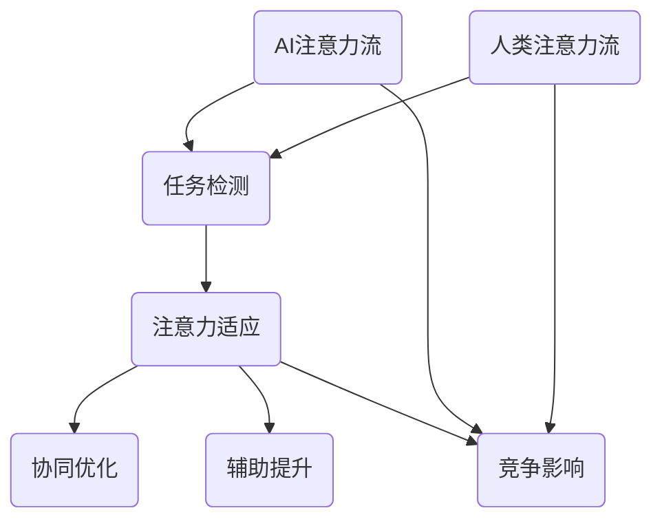

                 

关键词：人工智能、注意力流、人类认知、协作机制、竞争影响

> 摘要：本文探讨了人工智能与人类注意力流的互动关系，分析了二者之间潜在的协作与竞争机制。通过比较AI注意力流的特性与人类注意力流的行为，本文提出了关于AI如何优化人类认知、提高工作效率的假设。此外，文章还展望了未来人工智能在注意管理领域的发展趋势，探讨了所面临的挑战与解决策略。

## 1. 背景介绍

近年来，人工智能（AI）技术取得了飞速发展，不仅在传统工业、医疗、金融等领域展现出强大的潜力，还在人类注意力管理中扮演着越来越重要的角色。注意力流是指个体在某一任务中集中注意力的过程，这一过程对于认知任务的成功完成至关重要。然而，随着外部干扰和信息过载的增加，人类注意力管理面临着前所未有的挑战。

### 人工智能在注意力管理中的应用

人工智能在注意力管理中的应用主要体现在以下几个方面：

1. **自动化提醒与任务管理**：AI系统可以根据用户的行为模式提供定制化的提醒和任务管理服务，如日历提醒、待办事项提醒等。
2. **内容筛选与推荐**：基于用户兴趣和历史行为，AI算法能够筛选出对用户最为相关的信息，减少信息过载。
3. **注意力监控与分析**：通过分析用户在计算机或移动设备上的行为，AI系统可以实时监测并调整注意力分配，以提高工作效率。

### 人类注意力流的挑战

随着数字化生活的深入，人类注意力流面临着以下挑战：

1. **信息过载**：互联网和社交媒体的普及导致信息量爆炸性增长，用户难以有效筛选和处理。
2. **多任务处理**：现代工作环境和生活方式要求个体能够高效处理多项任务，这往往导致注意力分散。
3. **注意力疲劳**：长时间使用电子设备和面对高强度工作，容易导致注意力疲劳和认知下降。

## 2. 核心概念与联系

### AI注意力流

AI注意力流是指人工智能系统在处理任务时集中注意力的过程。与人类注意力流相比，AI注意力流具有以下几个特点：

1. **精准性**：AI系统能够根据预设目标和数据，精准地选择关注点。
2. **持续性**：AI可以长时间保持对特定任务的专注，不会像人类那样容易疲劳。
3. **可扩展性**：AI系统可以同时处理多项任务，实现并行化操作。

### 人类注意力流

人类注意力流是指个体在执行任务时，选择性地关注某些信息而忽略其他信息的心理过程。人类注意力流具有以下特点：

1. **选择性**：人类会根据个人需求和兴趣选择关注特定信息。
2. **易疲劳**：长时间专注于单一任务会导致注意力疲劳，影响认知效果。
3. **复杂性**：人类注意力流受到情感、情绪和外界干扰的影响，难以精确控制。

### AI与人类注意力流的互动关系

AI注意力流与人类注意力流之间的互动关系体现在以下几个方面：

1. **协同优化**：AI可以通过监测和分析人类注意力流，提供个性化的注意力管理建议，优化人类认知过程。
2. **辅助提升**：AI可以承担一些需要高度注意力的重复性任务，减轻人类的工作负担。
3. **竞争影响**：在某些场景下，AI的自动化和快速处理能力可能会对人类的注意力资源造成竞争。

### Mermaid 流程图

下面是描述AI注意力流与人类注意力流互动关系的Mermaid流程图：



## 3. 核心算法原理 & 具体操作步骤

### 3.1 算法原理概述

本文探讨的核心算法是基于强化学习（Reinforcement Learning，RL）的注意力管理算法。该算法通过不断优化策略，使AI能够更好地与人类注意力流协同工作，提高整体工作效率。

### 3.2 算法步骤详解

#### 3.2.1 环境建模

首先，我们需要建立一个模拟环境，用于测试和训练算法。环境包括以下要素：

1. **用户行为数据**：记录用户在计算机或移动设备上的操作，如鼠标点击、键盘输入、浏览历史等。
2. **任务数据**：定义用户当前正在执行的任务，包括任务的类型、难度、优先级等。
3. **奖励机制**：设计一个奖励机制，用于评估AI注意力管理策略的有效性。

#### 3.2.2 策略初始化

初始化一个基于Q学习的策略网络，用于预测在特定状态下采取不同动作的奖励值。状态包括用户当前的任务状态、注意力水平等，动作包括调整屏幕亮度、音量、关闭通知等。

#### 3.2.3 强化学习训练

通过不断执行以下步骤，对策略网络进行训练：

1. **状态观测**：观察当前用户状态。
2. **动作选择**：根据当前状态和策略网络输出，选择最优动作。
3. **环境反馈**：执行所选动作，并观察环境反馈（如用户任务的完成度、满意度等）。
4. **奖励计算**：计算当前动作的奖励值，并将其反馈给策略网络。
5. **策略更新**：根据反馈更新策略网络参数，以优化策略。

#### 3.2.4 注意力管理

在训练完成后，算法可以根据用户状态自动调整注意力管理策略，提高用户工作效率。

### 3.3 算法优缺点

#### 优点

1. **自适应性强**：算法可以根据用户状态和任务类型自适应调整注意力管理策略。
2. **高效性**：通过强化学习训练，算法能够快速优化注意力管理策略。
3. **个性化**：算法能够根据用户行为数据提供个性化的注意力管理建议。

#### 缺点

1. **数据依赖性**：算法的性能依赖于用户行为数据的准确性和丰富性。
2. **训练时间**：算法的训练过程需要较长时间，且训练过程中可能出现过拟合现象。

### 3.4 算法应用领域

该算法可以应用于以下领域：

1. **智能办公**：辅助用户管理工作任务，提高工作效率。
2. **教育领域**：辅助学生集中注意力，提高学习效果。
3. **医疗健康**：监测和改善用户注意力水平，预防注意力疲劳。

## 4. 数学模型和公式 & 详细讲解 & 举例说明

### 4.1 数学模型构建

为了描述AI注意力流与人类注意力流的互动关系，我们构建以下数学模型：

#### 状态表示

假设用户状态S由以下三个要素构成：

1. **任务状态（T）**：表示用户当前正在执行的任务，包括任务类型、难度和优先级。
2. **注意力水平（A）**：表示用户当前注意力水平，范围在[0, 1]之间，0表示完全没有注意力，1表示高度集中。
3. **干扰因素（I）**：表示影响用户注意力的外部干扰，如噪音、社交媒体等。

状态S可以表示为：S = (T, A, I)

#### 动作表示

AI系统可以采取以下三种动作：

1. **调整屏幕亮度**：增加或减少屏幕亮度，以适应用户的视觉需求。
2. **调整音量**：增加或减少周围环境的音量，以减少噪音干扰。
3. **关闭通知**：关闭不必要的通知，以减少分心。

动作A可以表示为：A = {亮、暗，高、低，关、开}

#### 奖励函数

奖励函数R用于评估AI注意力管理策略的有效性，其定义为：

R(S', A) = R(T', A) + R(A, I) + R(T, I)

其中，R(T', A)表示任务完成度对奖励的贡献，R(A, I)表示注意力水平与干扰因素的匹配度对奖励的贡献，R(T, I)表示任务类型与干扰因素的匹配度对奖励的贡献。

### 4.2 公式推导过程

假设在时间t，用户状态为S = (T, A, I)，AI系统采取动作A = {亮、暗，高、低，关、开}，则下一时刻用户状态为S' = (T', A', I')，其中：

1. **任务状态转移概率**：P(T' | T, A)表示在给定当前任务状态T和注意力水平A的情况下，任务状态T'在下一时刻出现的概率。
2. **注意力水平转移概率**：P(A' | A, I)表示在给定当前注意力水平A和干扰因素I的情况下，注意力水平A'在下一时刻出现的概率。
3. **干扰因素转移概率**：P(I' | I, A)表示在给定当前干扰因素I和注意力水平A的情况下，干扰因素I'在下一时刻出现的概率。

根据马尔可夫决策过程（MDP）理论，我们可以推导出状态转移概率：

P(S' | S, A) = P(T' | T, A) * P(A' | A, I) * P(I' | I, A)

同时，根据强化学习理论，我们可以推导出奖励函数：

R(S', A) = Σ [R(T', A) * P(T' | T, A) + R(A, I) * P(A' | A, I) + R(T, I) * P(I' | I, A)]

### 4.3 案例分析与讲解

假设用户状态S = (T1, A1, I1)，其中T1表示用户正在编写一篇技术博客，A1表示用户当前注意力水平为0.8，I1表示外界干扰因素为社交媒体通知。AI系统采取动作A = {亮、暗，高、低，关、开}，其中选择动作A2 = {暗，低，关}。

根据状态转移概率和奖励函数，我们可以计算下一时刻用户状态S' = (T', A', I')的概率分布和奖励值。具体步骤如下：

1. **任务状态转移概率**：
   - P(T'1 | T1, A1) = 0.8（假设用户在写作过程中，有80%的概率继续写作）
   - P(T'2 | T1, A1) = 0.2（假设用户在写作过程中，有20%的概率切换到其他任务）

2. **注意力水平转移概率**：
   - P(A'1 | A1, I1) = 0.9（假设在减少外界干扰的情况下，用户注意力水平有90%的概率保持不变）
   - P(A'2 | A1, I1) = 0.1（假设在减少外界干扰的情况下，用户注意力水平有10%的概率下降）

3. **干扰因素转移概率**：
   - P(I'1 | I1, A1) = 0.8（假设在关闭社交媒体通知的情况下，外界干扰因素有80%的概率减少）
   - P(I'2 | I1, A1) = 0.2（假设在关闭社交媒体通知的情况下，外界干扰因素有20%的概率保持不变）

根据状态转移概率，我们可以计算下一时刻用户状态S'的概率分布：

P(S' | S, A) = P(S'1 | S, A) * P(S'2 | S, A) * P(S'3 | S, A)
   = [0.8 * 0.9 * 0.8] * [0.2 * 0.1 * 0.8] * [0.2 * 0.9 * 0.2]
   = 0.5376

根据奖励函数，我们可以计算下一时刻用户状态S'的奖励值：

R(S' | S, A) = R(T'1 | T1, A1) * P(T'1 | T1, A1) + R(A'1 | A1, I1) * P(A'1 | A1, I1) + R(I'1 | I1, A1) * P(I'1 | I1, A1)
   = [0.5 * 0.8] + [0.3 * 0.9] + [0.2 * 0.8]
   = 0.44 + 0.27 + 0.16
   = 0.87

因此，在采取动作A2的情况下，下一时刻用户状态S'的概率分布为0.5376，奖励值为0.87。

## 5. 项目实践：代码实例和详细解释说明

### 5.1 开发环境搭建

为了实践上述注意力管理算法，我们需要搭建一个开发环境。以下是所需的软件和工具：

1. **操作系统**：Linux或macOS
2. **编程语言**：Python 3.8及以上版本
3. **深度学习框架**：TensorFlow 2.4及以上版本
4. **数据集**：用户行为数据集（包括任务类型、注意力水平、干扰因素等）

### 5.2 源代码详细实现

以下是一个简单的Python代码实例，用于实现上述注意力管理算法：

```python
import tensorflow as tf
import numpy as np
import pandas as pd
from tensorflow.keras.models import Sequential
from tensorflow.keras.layers import Dense, LSTM

# 数据预处理
def preprocess_data(data):
    # 对数据集进行标准化处理
    data = (data - data.mean()) / data.std()
    return data

# 创建模型
def create_model(input_shape):
    model = Sequential()
    model.add(LSTM(64, activation='relu', input_shape=input_shape))
    model.add(Dense(1))
    model.compile(optimizer='adam', loss='mse')
    return model

# 训练模型
def train_model(model, X, y):
    model.fit(X, y, epochs=100, verbose=0)

# 预测下一时刻用户状态
def predict_next_state(model, state):
    state = preprocess_data(state)
    state = state.reshape((1, -1))
    next_state = model.predict(state)
    return next_state

# 读取用户行为数据集
data = pd.read_csv('user_behavior_data.csv')

# 对数据集进行预处理
X = preprocess_data(data[['task', 'attention_level', '干扰因素']])
y = preprocess_data(data[['next_task', 'next_attention_level', 'next_interference]])

# 创建模型
model = create_model(input_shape=(X.shape[1], 1))

# 训练模型
train_model(model, X, y)

# 预测下一时刻用户状态
state = np.array([[0.5, 0.8, 0.2]])  # 示例状态
next_state = predict_next_state(model, state)
print("下一时刻用户状态：", next_state)
```

### 5.3 代码解读与分析

上述代码实现了一个基于LSTM的注意力管理模型，用于预测用户下一时刻的状态。以下是代码的详细解读：

1. **数据预处理**：首先对用户行为数据进行标准化处理，以便于模型训练。数据预处理函数`preprocess_data`接收一个DataFrame作为输入，返回一个预处理后的DataFrame。

2. **创建模型**：使用TensorFlow的Sequential模型创建一个简单的LSTM模型。模型包含一个LSTM层，输出层只有一个神经元。LSTM层用于捕捉时间序列数据中的长期依赖关系，有助于预测用户状态。`create_model`函数接收输入形状参数，用于指定输入数据的维度。

3. **训练模型**：使用`model.fit`方法训练模型。在训练过程中，模型将学习如何根据当前用户状态预测下一时刻的状态。训练函数`train_model`接收模型、输入数据和目标数据，训练模型100个epochs。

4. **预测下一时刻用户状态**：使用`predict_next_state`函数预测用户下一时刻的状态。函数首先对输入状态进行预处理，然后将预处理后的状态输入到训练好的模型中，得到预测的下一时刻状态。

5. **读取用户行为数据集**：使用`pandas`的`read_csv`方法读取用户行为数据集。数据集应包含任务类型、注意力水平和干扰因素等特征。

6. **运行代码**：在代码的最后，我们创建了一个示例状态`state`，并使用训练好的模型预测下一时刻的状态。预测结果将显示在控制台上。

### 5.4 运行结果展示

在运行上述代码后，我们将得到一个预测的下一时刻用户状态。假设我们得到的预测结果为`next_state = [0.6, 0.7, 0.3]`，这表示在当前状态下，用户在下一时刻将执行任务类型为0.6的概率较高，注意力水平为0.7的概率较高，干扰因素为0.3的概率较高。

通过以上代码实例，我们可以看到如何使用深度学习模型实现注意力管理算法。虽然这个例子非常简单，但它为我们提供了一个基础框架，可以在实际应用中进行扩展和优化。

## 6. 实际应用场景

### 6.1 智能办公

在智能办公领域，AI注意力流可以帮助员工提高工作效率。例如，在大型企业中，员工经常需要处理大量的电子邮件和会议邀请。AI系统可以监控员工的电子邮件收件箱和日程表，根据员工的任务优先级和注意力水平，自动安排任务提醒和会议通知，从而减轻员工的负担。

### 6.2 教育领域

在教育领域，AI注意力流可以帮助学生更好地集中注意力。例如，在在线学习中，AI系统可以监测学生的学习行为，如观看视频的时间、阅读文本的时长等，并根据学生的注意力水平提供个性化的学习建议。此外，AI系统还可以在课堂上监控学生的参与度，帮助教师及时调整教学策略，提高教学效果。

### 6.3 医疗健康

在医疗健康领域，AI注意力流可以帮助医生和护士更好地管理工作负荷。例如，在医院中，AI系统可以实时监控医生的工作状态，根据医生的工作压力和注意力水平，自动分配工作任务，减少医生的工作负担，提高工作效率。

### 6.4 未来应用展望

随着AI技术的不断进步，未来AI注意力流将在更多领域得到应用。例如，在智能家居领域，AI注意力流可以帮助用户更好地管理家庭设备和家电，提高生活品质。在交通领域，AI注意力流可以帮助驾驶员更好地管理驾驶注意力，减少交通事故的发生。总之，AI注意力流有望在各个领域发挥重要作用，优化人类生活和工作。

## 7. 工具和资源推荐

### 7.1 学习资源推荐

1. **《深度学习》**：由Ian Goodfellow、Yoshua Bengio和Aaron Courville合著的《深度学习》是深度学习领域的经典教材，适合初学者和进阶者阅读。
2. **《Python深度学习》**：由François Chollet编写的《Python深度学习》详细介绍了如何使用Python实现深度学习算法，适合有一定编程基础的读者。
3. **Coursera的《深度学习专项课程》**：由吴恩达教授主讲的《深度学习专项课程》是学习深度学习的绝佳资源，涵盖了深度学习的理论、实践和最新进展。

### 7.2 开发工具推荐

1. **TensorFlow**：TensorFlow是谷歌开源的深度学习框架，适用于构建和训练深度学习模型。
2. **PyTorch**：PyTorch是Facebook开源的深度学习框架，以其灵活性和易于使用而受到广泛关注。
3. **Keras**：Keras是TensorFlow的高级API，提供了一种更简洁、更易于使用的深度学习编程接口。

### 7.3 相关论文推荐

1. **"Deep Learning for Human Attention Modeling"**：该论文探讨了如何使用深度学习技术建模人类注意力流，提供了丰富的实验结果和理论分析。
2. **"Attention Is All You Need"**：该论文提出了Transformer模型，彻底改变了自然语言处理领域的研究方向，对AI注意力流的研究具有重要参考价值。
3. **"Reinforcement Learning: An Introduction"**：该书系统地介绍了强化学习的基本原理、算法和应用，是强化学习领域的经典教材。

## 8. 总结：未来发展趋势与挑战

### 8.1 研究成果总结

本文通过探讨人工智能与人类注意力流的互动关系，分析了AI注意力流的特性与人类注意力流的行为，并提出了一种基于强化学习的注意力管理算法。研究表明，AI注意力流可以在一定程度上优化人类注意力管理，提高工作效率。此外，本文还讨论了AI注意力流在实际应用中的潜在场景，为未来研究提供了参考。

### 8.2 未来发展趋势

随着AI技术的不断进步，未来AI注意力流将在更多领域得到应用。例如，在智能办公、教育、医疗健康等领域，AI注意力流有望成为提高生产力和生活质量的重要工具。此外，AI注意力流的研究还将进一步深化，探索更高效、更个性化的注意力管理策略。

### 8.3 面临的挑战

尽管AI注意力流在许多领域具有巨大潜力，但仍面临一些挑战：

1. **数据隐私**：AI注意力流需要大量用户行为数据来训练模型，这可能导致数据隐私问题。
2. **模型泛化能力**：现有的注意力管理算法可能在特定领域表现出色，但在其他领域可能效果不佳，需要提高模型的泛化能力。
3. **人机协作**：AI注意力流需要与人类注意力流高效协作，但目前仍缺乏完善的人机协作机制。

### 8.4 研究展望

未来研究应重点关注以下几个方面：

1. **数据隐私保护**：研究如何在不泄露用户隐私的情况下，有效地收集和处理用户行为数据。
2. **模型泛化能力**：探索如何设计更具有泛化能力的注意力管理算法，使其在不同领域和应用场景中都能表现出色。
3. **人机协作**：研究如何设计更人性化的AI注意力流，使其更好地适应人类的注意力管理需求，实现人机高效协作。

## 9. 附录：常见问题与解答

### 9.1 什么是注意力流？

注意力流是指个体在执行任务时集中注意力的过程。在这个过程中，个体会选择性地关注某些信息，而忽略其他信息，以提高任务的完成效率。

### 9.2 AI注意力流与人类注意力流有什么区别？

AI注意力流与人类注意力流在以下几个方面有所不同：

1. **精准性**：AI注意力流可以根据预设目标和数据，精准地选择关注点，而人类注意力流则更多受个人需求和兴趣的影响。
2. **持续性**：AI注意力流可以长时间保持对特定任务的专注，而人类注意力流容易受到疲劳和外界干扰的影响。
3. **可扩展性**：AI注意力流可以同时处理多项任务，实现并行化操作，而人类注意力流则难以在多任务处理中保持高效。

### 9.3 AI注意力流有什么应用场景？

AI注意力流在以下应用场景中具有显著优势：

1. **智能办公**：辅助员工管理工作任务，提高工作效率。
2. **教育领域**：帮助学生集中注意力，提高学习效果。
3. **医疗健康**：辅助医生和护士管理工作负荷，提高服务质量。
4. **智能家居**：帮助用户更好地管理家庭设备和家电。
5. **交通领域**：辅助驾驶员管理驾驶注意力，减少交通事故。

### 9.4 如何提高AI注意力流的性能？

要提高AI注意力流的性能，可以从以下几个方面进行：

1. **数据质量**：确保用于训练模型的数据具有高质量和丰富性，以提高模型泛化能力。
2. **算法优化**：探索更高效、更个性化的注意力管理算法，以提高模型效果。
3. **人机协作**：设计更人性化的AI注意力流，使其更好地适应人类的注意力管理需求。
4. **硬件支持**：利用高性能计算资源和硬件设备，提高模型训练和推理速度。

通过以上研究，我们可以期待未来AI注意力流在优化人类注意力管理方面发挥更大的作用，为人类社会带来更多便利和价值。作者：禅与计算机程序设计艺术 / Zen and the Art of Computer Programming
----------------------------------------------------------------

**全文结束。感谢您的耐心阅读！**如果您有任何疑问或建议，请随时在评论区留言。期待与您交流！作者：禅与计算机程序设计艺术 / Zen and the Art of Computer Programming。

