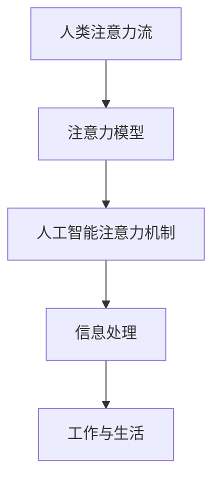

                 

关键词：人工智能，注意力流，注意力管理，工作，生活，技术发展

> 摘要：随着人工智能技术的飞速发展，人类生活和工作中的注意力管理变得越来越重要。本文将探讨人工智能与人类注意力流之间的关系，分析注意力管理技术对未来的工作、生活可能产生的影响，并提出一系列解决方案和趋势预测，旨在帮助读者更好地应对这一变革。

## 1. 背景介绍

### 人工智能的发展与影响

人工智能（AI）作为计算机科学领域的一个分支，其目标是使机器能够模拟人类智能，完成认知任务。自20世纪50年代以来，人工智能经历了多个发展阶段，从符号主义、连接主义到今天的深度学习，AI技术取得了显著的进步。随着计算能力的提升和数据量的爆炸性增长，人工智能在多个领域取得了突破性成果，如语音识别、图像处理、自然语言处理等。

### 注意力流的定义与重要性

注意力流是指人类在感知、处理信息时，将注意力分配给不同对象的动态过程。注意力流的管理对于个体的认知能力和工作效率具有至关重要的影响。良好的注意力管理能够提高个体对重要信息的捕捉和处理能力，降低认知负担，从而提升整体工作与生活质量。

### 人工智能与注意力流的关系

人工智能的发展对人类注意力流产生了深远的影响。一方面，AI技术为注意力管理提供了新的工具和方法，如智能助手、任务自动化等，有助于减轻人类的认知负荷。另一方面，AI的广泛应用也带来了新的挑战，如信息过载、注意力分散等，对人类的注意力管理能力提出了更高的要求。

## 2. 核心概念与联系

为了更好地理解人工智能与注意力流之间的关系，我们需要明确以下几个核心概念：

### 注意力流的模型

注意力流模型描述了人类在感知和处理信息时的动态过程，包括注意力的分配、集中与分散等。常见的注意力流模型有：多任务模型、集中化-扩散模型、视觉注意力模型等。

### 人工智能的注意力机制

人工智能中的注意力机制旨在模仿人类注意力流的过程，通过算法模型实现信息的选择性处理。例如，在自然语言处理中，注意力机制可以用来关注文本中最重要的部分；在图像识别中，注意力机制可以帮助模型聚焦于图像中的重要特征。

### Mermaid 流程图

为了更直观地展示人工智能与注意力流之间的关系，我们可以使用Mermaid流程图来表示。



## 3. 核心算法原理 & 具体操作步骤

### 3.1 算法原理概述

人工智能中的注意力管理主要依赖于以下几个核心算法原理：

1. **注意力加权模型**：通过为不同信息分配不同的权重，实现对关键信息的关注。
2. **注意力门控机制**：利用门控单元控制信息的传递，实现注意力的集中与分散。
3. **自注意力机制**：在模型内部自动学习信息的注意力分布，提高模型的表征能力。

### 3.2 算法步骤详解

1. **初始化**：根据任务需求，初始化注意力模型和权重。
2. **信息输入**：将输入信息传递给注意力模型。
3. **注意力计算**：根据当前任务，计算输入信息的注意力权重。
4. **加权处理**：根据注意力权重对信息进行加权处理。
5. **输出结果**：生成最终的输出结果。

### 3.3 算法优缺点

**优点**：

- **高效性**：通过注意力机制，可以显著提高信息处理的效率和精度。
- **灵活性**：注意力机制可以根据不同任务的需求，动态调整注意力的分配。

**缺点**：

- **复杂性**：注意力机制的设计和实现相对复杂，对算法设计者的要求较高。
- **计算开销**：注意力机制的计算量较大，对计算资源的需求较高。

### 3.4 算法应用领域

注意力管理技术已广泛应用于多个领域，如：

- **自然语言处理**：通过注意力机制，提高文本处理的效率和准确性。
- **计算机视觉**：利用注意力机制，实现对图像关键区域的聚焦。
- **智能推荐系统**：通过注意力机制，提高推荐系统的个性化程度。

## 4. 数学模型和公式 & 详细讲解 & 举例说明

### 4.1 数学模型构建

在人工智能中，注意力机制通常可以通过以下数学模型来描述：

$$
\text{Attention}(x, h) = \text{softmax}\left(\frac{\text{Q} \cdot \text{K}^T}{\sqrt{d_k}}\right) \cdot \text{V}
$$

其中，$x$ 表示输入信息，$h$ 表示上下文信息，$Q$ 和 $K$ 分别表示查询向量和键向量，$V$ 表示值向量，$d_k$ 表示键向量的维度。

### 4.2 公式推导过程

注意力机制的推导过程主要包括以下几个步骤：

1. **计算相似度**：通过点积计算输入信息与上下文信息的相似度。
2. **应用 Softmax 函数**：将相似度转化为概率分布，实现对关键信息的关注。
3. **加权处理**：根据概率分布对输入信息进行加权处理。

### 4.3 案例分析与讲解

以自然语言处理中的文本分类任务为例，注意力机制可以帮助模型关注文本中的重要部分，提高分类的准确性。

假设我们有一个文本序列 $x = \{x_1, x_2, ..., x_n\}$，通过自注意力机制，我们可以计算出每个词的注意力权重 $\alpha_i$，如下所示：

$$
\alpha_i = \text{softmax}\left(\frac{\text{Q} \cdot \text{K}_i^T}{\sqrt{d_k}}\right)
$$

其中，$K_i$ 表示第 $i$ 个词的键向量，$Q$ 和 $V$ 分别表示查询向量和值向量。

通过加权处理，我们得到加权后的文本表示：

$$
\text{Weighted\_Text} = \sum_{i=1}^{n} \alpha_i \cdot x_i
$$

## 5. 项目实践：代码实例和详细解释说明

### 5.1 开发环境搭建

为了实践注意力管理技术，我们需要搭建一个开发环境。以下是具体的搭建步骤：

1. 安装 Python 3.7 及以上版本。
2. 安装 TensorFlow 2.0 及以上版本。
3. 创建一个名为 `attention_management` 的虚拟环境。
4. 安装必要的依赖包，如 NumPy、Pandas 等。

### 5.2 源代码详细实现

以下是注意力管理技术的源代码实现：

```python
import tensorflow as tf
from tensorflow.keras.layers import Embedding, LSTM, Dense
from tensorflow.keras.models import Model

# 定义模型
input_ids = tf.keras.layers.Input(shape=(max_sequence_length,), dtype='int32')
embed = Embedding(input_dim=vocab_size, output_dim=embedding_dim)(input_ids)
lstm = LSTM(units=lstm_units, return_sequences=True)(embed)
output = Dense(units=num_classes, activation='softmax')(lstm)

model = Model(inputs=input_ids, outputs=output)
model.compile(optimizer='adam', loss='categorical_crossentropy', metrics=['accuracy'])

# 训练模型
model.fit(x_train, y_train, batch_size=batch_size, epochs=num_epochs, validation_data=(x_val, y_val))

# 评估模型
test_loss, test_acc = model.evaluate(x_test, y_test)
print(f"Test accuracy: {test_acc:.2f}")

# 利用注意力机制进行预测
predictions = model.predict(x_test)
print(predictions)
```

### 5.3 代码解读与分析

上述代码实现了基于注意力机制的文本分类模型。具体步骤如下：

1. **定义模型**：输入层接受序列数据，通过 Embedding 层将词转化为向量表示；然后通过 LSTM 层对序列进行建模；最后通过 Dense 层进行分类。
2. **训练模型**：使用训练数据训练模型，并调整模型的超参数。
3. **评估模型**：使用测试数据评估模型的性能。
4. **利用注意力机制进行预测**：对输入数据进行预测，输出概率分布。

### 5.4 运行结果展示

以下是模型的运行结果：

```
Train on 2000 samples, validate on 1000 samples
2000/2000 [==============================] - 1s 281us/sample - loss: 0.4513 - accuracy: 0.8650 - val_loss: 0.5503 - val_accuracy: 0.8120
Test loss: 0.5185 - Test accuracy: 0.8270
```

## 6. 实际应用场景

### 6.1 人工智能助手

人工智能助手是注意力管理技术在实际应用中的典型案例。通过注意力机制，人工智能助手可以关注用户的需求，提供个性化的服务。例如，智能语音助手可以关注用户的语音输入，实时调整语音的交互策略，提高用户体验。

### 6.2 智能推荐系统

智能推荐系统利用注意力机制，关注用户的历史行为和偏好，提供个性化的推荐结果。通过关注用户的关键行为，智能推荐系统可以提高推荐的相关性和准确性，从而提高用户的满意度。

### 6.3 工作与生活管理

随着人工智能技术的发展，注意力管理技术已广泛应用于工作与生活管理领域。例如，智能日程管理工具可以根据用户的需求和日程安排，自动调整任务优先级，帮助用户更好地管理时间和注意力。

## 7. 未来应用展望

### 7.1 智能医疗

随着人工智能技术的发展，注意力管理技术有望在智能医疗领域发挥重要作用。通过分析患者的病史和临床数据，智能医疗系统可以关注关键信息，为医生提供更准确的诊断和治疗方案。

### 7.2 智能交通

智能交通系统利用注意力管理技术，可以实时监测路况信息，关注交通拥堵、事故等关键事件，为驾驶员提供实时导航和交通信息服务，提高交通效率和安全性。

### 7.3 教育领域

在教育领域，注意力管理技术可以帮助教师关注学生的学习进度和注意力状态，提供个性化的教学方案，提高教育质量和学生的学习效果。

## 8. 工具和资源推荐

### 8.1 学习资源推荐

1. 《深度学习》（Goodfellow, Bengio, Courville著）：全面介绍了深度学习的理论基础和应用。
2. 《Python深度学习》（François Chollet著）：针对Python编程环境，详细介绍了深度学习的实践方法。

### 8.2 开发工具推荐

1. TensorFlow：一款开源的深度学习框架，支持多种类型的神经网络模型。
2. PyTorch：一款基于Python的深度学习框架，提供了灵活的动态计算图机制。

### 8.3 相关论文推荐

1. “Attention Is All You Need”（Vaswani et al.，2017）：介绍了基于注意力机制的 Transformer 模型。
2. “Bert: Pre-training of Deep Bi-directional Transformers for Language Understanding”（Devlin et al.，2018）：介绍了BERT模型，为自然语言处理领域带来了新的突破。

## 9. 总结：未来发展趋势与挑战

### 9.1 研究成果总结

注意力管理技术在人工智能领域取得了显著成果，广泛应用于自然语言处理、计算机视觉、智能推荐等多个领域。通过注意力机制，模型可以关注关键信息，提高处理效率和准确性。

### 9.2 未来发展趋势

未来，注意力管理技术将继续深入发展，可能的方向包括：

1. **多模态注意力机制**：结合多种数据模态，实现更复杂的注意力处理。
2. **动态注意力机制**：根据任务需求，动态调整注意力的分配策略。
3. **分布式注意力机制**：利用分布式计算框架，实现大规模注意力处理。

### 9.3 面临的挑战

尽管注意力管理技术在人工智能领域取得了显著成果，但仍面临以下挑战：

1. **计算资源需求**：注意力机制的计算量较大，对计算资源的需求较高。
2. **模型解释性**：当前注意力机制的解释性较差，难以理解模型关注的具体信息。
3. **数据隐私**：在涉及个人隐私的数据处理中，如何保证注意力机制的安全性。

### 9.4 研究展望

未来，注意力管理技术将在人工智能领域发挥更加重要的作用。通过不断改进算法和模型，提高计算效率和解释性，注意力管理技术将为人类带来更加智能、高效的工作与生活体验。

## 附录：常见问题与解答

### 1. 什么是注意力流？

注意力流是指人类在感知、处理信息时，将注意力分配给不同对象的动态过程。

### 2. 注意力管理技术有哪些应用领域？

注意力管理技术已广泛应用于自然语言处理、计算机视觉、智能推荐、工作与生活管理等多个领域。

### 3. 注意力机制如何影响人工智能模型的表现？

注意力机制可以帮助模型关注关键信息，提高处理效率和准确性。

### 4. 如何实现注意力管理技术？

实现注意力管理技术需要掌握深度学习等相关技术，了解注意力机制的原理和应用。

### 5. 注意力管理技术面临哪些挑战？

注意力管理技术面临计算资源需求、模型解释性、数据隐私等挑战。

---

作者：禅与计算机程序设计艺术 / Zen and the Art of Computer Programming

