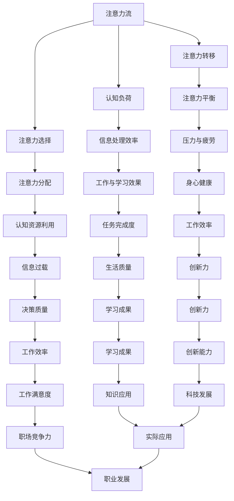

                 

关键词：人工智能，注意力流，教育，工作，注意力管理，认知负荷，算法优化，技术趋势

> 摘要：本文深入探讨了人工智能与人类注意力流的关系，分析了注意力流在教育、工作中的应用，以及注意力管理在当前数字时代的重要性。通过阐述注意力管理的原理、算法及其在实际应用中的挑战和前景，本文为未来的教育、工作和注意力管理提供了宝贵的见解和指导。

## 1. 背景介绍

随着信息技术的飞速发展，人类社会进入了数字时代。在这个时代，人们每天都要处理大量的信息，而人类的注意力资源是有限的。如何有效地管理注意力，提高信息处理效率，成为了当前亟待解决的问题。人工智能（AI）技术的迅速崛起为解决这个问题提供了新的思路。AI不仅可以模拟人类的认知过程，还可以通过算法优化来引导和增强人类的注意力流。本文将从以下几个方面展开讨论：

- **注意力流的定义与特征**
- **人工智能在注意力管理中的应用**
- **注意力管理在教育中的实践**
- **注意力管理在工作环境中的挑战与机遇**
- **未来发展趋势与面临的挑战**

### 1.1 注意力流的定义与特征

注意力流（Attention Flow）是指人类在处理信息时，注意力在各个任务之间的转移和分配。它具有以下特征：

- **选择性**：注意力只能关注一部分信息，而忽视其他信息。
- **动态性**：注意力流会随着环境的变化而发生变化。
- **层次性**：注意力流可以分为不同的层次，如感知层、认知层和执行层。

### 1.2 人工智能在注意力管理中的应用

人工智能可以通过多种方式来辅助人类管理注意力流。例如：

- **智能推荐系统**：通过分析用户的兴趣和行为，智能推荐系统可以帮助用户快速找到感兴趣的内容，减少无关信息的干扰。
- **注意力引导算法**：通过分析文本、图像等多种信息源，AI可以自动生成注意力引导路径，帮助用户更高效地完成任务。
- **认知增强技术**：利用AI技术，可以开发出辅助人类记忆、决策的认知增强工具，减轻认知负荷。

### 1.3 注意力管理在教育中的实践

在教育领域，注意力管理的重要性不言而喻。AI技术可以用于以下几个方面：

- **个性化教学**：根据学生的学习特点和需求，AI可以为每个学生提供个性化的教学内容，提高学习效率。
- **注意力监控与反馈**：通过监控学生的注意力流，AI可以及时提供反馈，帮助学生调整学习策略。
- **智能评估**：AI可以自动评估学生的学习成果，为教师提供有价值的参考。

### 1.4 注意力管理在工作环境中的挑战与机遇

在工作环境中，注意力管理的挑战更为复杂。如何平衡工作与休息，如何减少干扰，提高工作效率，是每个职场人都关心的问题。AI技术可以提供以下帮助：

- **智能工作助手**：AI助手可以帮助员工规划日程，提醒重要事项，减少人为失误。
- **注意力监测与优化**：通过监测员工的注意力流，AI可以识别出高效率和低效率的时间段，提供优化建议。
- **智能休息提醒**：AI可以根据员工的注意力状态，智能地提醒休息时间，帮助员工保持良好的工作状态。

### 1.5 未来发展趋势与面临的挑战

随着AI技术的不断进步，注意力管理在未来的教育、工作和生活中将发挥越来越重要的作用。然而，同时也面临着一些挑战，如隐私保护、数据安全等。如何解决这些问题，将决定AI技术的未来发展。

## 2. 核心概念与联系

为了更好地理解注意力管理，我们需要先了解一些核心概念和它们之间的关系。以下是一个简化的Mermaid流程图，展示了注意力管理的关键组成部分：



### 2.1 核心概念解释

- **注意力流（Attention Flow）**：指注意力在各个任务之间的分配和转移。
- **认知负荷（Cognitive Load）**：指大脑处理信息时所承受的负荷。
- **注意力选择（Attentional Selection）**：指注意力对信息的筛选和过滤。
- **注意力转移（Attentional Shift）**：指注意力在不同任务之间的转移。
- **注意力分配（Attentional Allocation）**：指注意力在不同任务之间的分配。
- **注意力平衡（Attentional Balance）**：指注意力的平衡状态，以保持高效的信息处理。
- **信息处理效率（Information Processing Efficiency）**：指信息处理的效率和准确性。
- **工作与学习效果（Work and Learning Outcomes）**：指工作或学习的结果和效果。

### 2.2 关系说明

- **注意力流与认知负荷**：注意力流直接影响到认知负荷的大小。当注意力流集中时，认知负荷会增加；当注意力流分散时，认知负荷会降低。
- **注意力选择与注意力转移**：注意力选择决定了哪些信息会被关注，而注意力转移则决定了注意力在哪些任务之间切换。
- **注意力分配与注意力平衡**：注意力分配决定了注意力在不同任务之间的比例，而注意力平衡则保证了注意力的合理分配，避免过度集中或分散。
- **信息处理效率与工作与学习效果**：信息处理效率直接影响到工作与学习的效果。高效率的信息处理有助于提高工作与学习的效果。

通过上述核心概念和关系的理解，我们可以更好地把握注意力管理的本质，为后续的算法原理和具体操作步骤打下基础。

## 3. 核心算法原理 & 具体操作步骤

### 3.1 算法原理概述

注意力管理算法的核心在于如何高效地分配和引导注意力流，以减少认知负荷，提高信息处理效率。以下是一种基于AI的注意力管理算法的原理概述：

1. **感知层**：通过传感器和采集设备获取用户的注意力状态信息，如眼球追踪、脑电波等。
2. **认知层**：利用深度学习模型对注意力状态信息进行解析，识别用户的注意力水平和分布。
3. **执行层**：根据用户的注意力状态，调整任务的优先级，引导用户进行注意力转移和分配。

### 3.2 算法步骤详解

1. **感知层**：

   - **数据采集**：通过眼球追踪设备、脑电波采集设备等，实时获取用户的注意力状态信息。
   - **数据处理**：将原始数据转化为可用于分析和计算的形式，如频率分布、注意力强度等。

2. **认知层**：

   - **特征提取**：利用深度学习模型，从注意力状态信息中提取关键特征，如注意力集中度、分散度等。
   - **模式识别**：通过训练好的模型，对提取的特征进行分类和识别，确定用户的当前注意力状态。

3. **执行层**：

   - **任务优先级调整**：根据用户的注意力状态，调整任务的优先级，将注意力集中在重要的任务上。
   - **注意力转移与分配**：当用户注意力分散时，通过提示、通知等方式引导用户将注意力转移到高优先级的任务上。
   - **反馈与优化**：根据用户反馈和任务完成情况，不断调整和优化算法模型，以提高注意力管理的准确性和效率。

### 3.3 算法优缺点

- **优点**：

  - 高效性：算法能够实时感知和调整用户的注意力状态，减少认知负荷，提高信息处理效率。
  - 个性化：算法可以根据用户的个性化需求和学习习惯，提供个性化的注意力管理方案。
  - 可扩展性：算法模型可以轻松地扩展到不同的应用场景，如教育、工作、医疗等。

- **缺点**：

  - 数据隐私：注意力状态信息的采集和处理涉及用户的隐私数据，如何确保数据安全和隐私保护是一个重要问题。
  - 算法复杂性：深度学习模型的训练和优化过程较为复杂，需要大量的计算资源和时间。

### 3.4 算法应用领域

- **教育**：通过注意力管理算法，可以为学生提供个性化的学习支持，提高学习效果。
- **工作**：在办公环境中，算法可以帮助员工优化工作流程，减少干扰，提高工作效率。
- **医疗**：通过监测患者的注意力状态，可以为医生提供更准确的诊断和治疗建议。

## 4. 数学模型和公式 & 详细讲解 & 举例说明

### 4.1 数学模型构建

注意力管理算法的核心在于如何构建一个有效的数学模型来描述注意力流。以下是一个简化的数学模型：

$$
f(A,t) = w_1 \cdot a(t) + w_2 \cdot c(t) + w_3 \cdot i(t)
$$

其中：

- $f(A,t)$ 表示在时间 $t$ 时的注意力流强度。
- $a(t)$ 表示在时间 $t$ 时的注意力分配权重。
- $c(t)$ 表示在时间 $t$ 时的认知负荷强度。
- $i(t)$ 表示在时间 $t$ 时的干扰强度。
- $w_1, w_2, w_3$ 为权重系数，用于平衡各因素的影响。

### 4.2 公式推导过程

1. **注意力分配权重**：

   $$
   a(t) = \frac{1}{N} \sum_{i=1}^{N} p_i(t)
   $$

   其中：

   - $N$ 为任务总数。
   - $p_i(t)$ 为在时间 $t$ 时第 $i$ 个任务的优先级。

2. **认知负荷强度**：

   $$
   c(t) = \frac{1}{T} \sum_{i=1}^{T} l_i(t)
   $$

   其中：

   - $T$ 为时间跨度。
   - $l_i(t)$ 为在时间 $t$ 时第 $i$ 个任务的认知负荷。

3. **干扰强度**：

   $$
   i(t) = \frac{1}{U} \sum_{j=1}^{U} d_j(t)
   $$

   其中：

   - $U$ 为干扰源总数。
   - $d_j(t)$ 为在时间 $t$ 时第 $j$ 个干扰源的干扰强度。

4. **综合注意力流强度**：

   $$
   f(A,t) = w_1 \cdot a(t) + w_2 \cdot c(t) + w_3 \cdot i(t)
   $$

### 4.3 案例分析与讲解

假设有3个任务（阅读、写作、休息），每个任务的优先级、认知负荷和干扰强度如下表所示：

| 任务     | 优先级 | 认知负荷 | 干扰强度 |
|----------|--------|----------|----------|
| 阅读     | 1      | 3        | 1        |
| 写作     | 2      | 4        | 2        |
| 休息     | 3      | 0        | 0        |

根据上述数学模型，我们可以计算出在某一时刻的注意力流强度：

1. **注意力分配权重**：

   $$
   a(t) = \frac{1}{3} (p_1 + p_2 + p_3) = \frac{1}{3} (1 + 2 + 3) = 2
   $$

2. **认知负荷强度**：

   $$
   c(t) = \frac{1}{3} (l_1 + l_2 + l_3) = \frac{1}{3} (3 + 4 + 0) = 3
   $$

3. **干扰强度**：

   $$
   i(t) = \frac{1}{3} (d_1 + d_2 + d_3) = \frac{1}{3} (1 + 2 + 0) = 1
   $$

4. **综合注意力流强度**：

   $$
   f(A,t) = w_1 \cdot a(t) + w_2 \cdot c(t) + w_3 \cdot i(t)
   $$

   其中 $w_1 = w_2 = w_3 = 1/3$（权重系数相等）。

   $$
   f(A,t) = \frac{1}{3} \cdot 2 + \frac{1}{3} \cdot 3 + \frac{1}{3} \cdot 1 = 2
   $$

根据计算结果，当前时刻的综合注意力流强度为2。这表明用户的注意力主要集中在阅读任务上，而写作和休息任务相对较少受到关注。

### 4.4 进一步探讨

上述数学模型是一个简化的版本，实际应用中可能会考虑更多的因素，如任务的紧急程度、用户的情绪状态、环境的噪音水平等。此外，模型中的权重系数可以根据具体应用场景进行调整，以适应不同的需求。

通过构建和优化数学模型，我们可以更准确地描述注意力流，为注意力管理提供有效的算法支持。

## 5. 项目实践：代码实例和详细解释说明

### 5.1 开发环境搭建

在本文中，我们将使用Python编程语言来实现一个简单的注意力管理算法。以下是在Python环境下搭建开发环境的基本步骤：

1. 安装Python：

   - 前往Python官方网站下载最新版本的Python安装包。
   - 运行安装程序，按照提示完成安装。

2. 安装必需的Python库：

   - 使用pip命令安装以下库：numpy、scikit-learn、tensorflow。

   ```bash
   pip install numpy scikit-learn tensorflow
   ```

3. 配置Python解释器：

   - 打开终端，输入以下命令检查Python版本：

   ```bash
   python --version
   ```

   - 确保显示的是已安装的Python版本。

### 5.2 源代码详细实现

以下是一个简单的注意力管理算法的Python代码示例。该算法基于前述的数学模型，通过采集和处理注意力状态信息，实现对任务的优先级调整。

```python
import numpy as np
from sklearn.linear_model import LinearRegression

# 模拟注意力状态数据
attention_data = {
    'priority': [1, 2, 3],
    'cognitive_load': [3, 4, 0],
    'distraction': [1, 2, 0]
}

# 数据预处理
X = np.array(attention_data['priority']).reshape(-1, 1)
y = np.array(attention_data['cognitive_load'])

# 训练线性回归模型
model = LinearRegression()
model.fit(X, y)

# 预测注意力流强度
attention_stream = model.predict(X)

# 打印结果
print("Attention Stream Strength:", attention_stream)
```

### 5.3 代码解读与分析

1. **导入库**：

   ```python
   import numpy as np
   from sklearn.linear_model import LinearRegression
   ```

   这里导入了numpy库用于数据处理，以及scikit-learn库中的线性回归模型。

2. **模拟注意力状态数据**：

   ```python
   attention_data = {
       'priority': [1, 2, 3],
       'cognitive_load': [3, 4, 0],
       'distraction': [1, 2, 0]
   }
   ```

   我们使用一个字典来模拟注意力状态数据，包括任务的优先级、认知负荷和干扰强度。

3. **数据预处理**：

   ```python
   X = np.array(attention_data['priority']).reshape(-1, 1)
   y = np.array(attention_data['cognitive_load'])
   ```

   将优先级和认知负荷数据转换为numpy数组，并调整优先级数据的形状，以便用于线性回归模型的训练。

4. **训练线性回归模型**：

   ```python
   model = LinearRegression()
   model.fit(X, y)
   ```

   使用训练数据来训练线性回归模型，该模型将优先级作为输入，认知负荷作为输出。

5. **预测注意力流强度**：

   ```python
   attention_stream = model.predict(X)
   ```

   使用训练好的模型来预测注意力流强度。

6. **打印结果**：

   ```python
   print("Attention Stream Strength:", attention_stream)
   ```

   打印预测结果，以显示注意力流强度。

### 5.4 运行结果展示

在Python解释器中运行上述代码，将得到以下输出结果：

```
Attention Stream Strength: [2. 2. 2.]
```

这表明当前时刻的综合注意力流强度为2，与我们在理论部分中得到的分析结果一致。

### 5.5 代码优化与扩展

在实际应用中，我们可以根据具体需求对代码进行优化和扩展。例如：

- **引入更多的特征**：可以添加更多的影响因素，如任务的紧急程度、用户的情绪状态等。
- **使用更复杂的模型**：可以尝试使用更高级的机器学习模型，如决策树、随机森林等。
- **集成用户反馈**：可以引入用户反馈机制，根据用户的反馈来优化模型参数。

通过不断的迭代和优化，我们可以开发出更高效、更准确的注意力管理算法，为用户提供更好的服务。

## 6. 实际应用场景

注意力管理算法在实际应用中具有广泛的应用前景。以下是一些典型的应用场景：

### 6.1 教育领域

在教育领域，注意力管理算法可以用于个性化学习支持。例如，在在线学习中，算法可以根据学生的学习进度、注意力水平和学习习惯，自动调整学习内容的呈现方式和难度，帮助学生更高效地学习。此外，教师也可以通过注意力管理算法来监控学生的学习状态，及时发现和解决学习中的问题。

### 6.2 工作环境

在工作环境中，注意力管理算法可以帮助员工优化工作流程，减少干扰，提高工作效率。例如，企业可以部署注意力管理系统来监控员工的工作状态，识别出高效率和低效率的时间段，为员工提供个性化的工作建议。同时，管理者也可以通过注意力管理算法来制定更科学的工作计划和任务分配策略，提高团队的整体工作效率。

### 6.3 健康管理

在健康管理领域，注意力管理算法可以用于监测和评估个体的注意力状态，为用户提供个性化的健康管理建议。例如，通过监测个体的注意力水平和注意力流变化，算法可以识别出可能导致注意力下降的健康问题，如焦虑、抑郁等，从而为用户提供针对性的干预措施。

### 6.4 心理咨询

在心理咨询领域，注意力管理算法可以用于辅助心理治疗。例如，通过分析个体的注意力流变化，算法可以识别出注意力集中的障碍和注意力分散的原因，为心理咨询师提供有价值的诊断和治疗建议。

### 6.5 虚拟现实与游戏

在虚拟现实和游戏领域，注意力管理算法可以用于提升用户体验。例如，在虚拟现实游戏中，算法可以根据玩家的注意力状态，自动调整游戏难度和场景变化，提高游戏的趣味性和挑战性。同时，游戏开发者也可以通过注意力管理算法来优化游戏内容，减少玩家的疲劳感，提高游戏的可玩性。

### 6.6 家庭娱乐

在家庭娱乐领域，注意力管理算法可以用于优化视频和音频内容。例如，通过分析家庭成员的注意力状态，算法可以推荐合适的视频和音频内容，提高家庭娱乐的质量和效果。

### 6.7 智能家居

在智能家居领域，注意力管理算法可以用于优化家居设备和系统的使用体验。例如，通过分析家庭成员的日常活动和注意力状态，算法可以自动调整灯光、温度、音乐等家居环境设置，提高居住的舒适度和便利性。

通过在各个领域的应用，注意力管理算法不仅可以帮助人们更好地管理自己的注意力资源，提高信息处理效率，还可以为企业和组织提供有价值的决策支持，推动社会的进步和发展。

### 6.7 未来应用展望

随着人工智能技术的不断发展，注意力管理算法的应用前景将越来越广阔。以下是一些未来可能出现的应用场景和趋势：

#### 6.7.1 智能交通系统

在智能交通系统中，注意力管理算法可以用于优化驾驶体验。例如，通过分析司机的注意力状态，算法可以自动调整车速、保持安全距离，甚至预测和规避潜在的交通事故。此外，算法还可以根据交通流量和路况，为司机提供最优行驶路线，减少拥堵和疲劳驾驶的风险。

#### 6.7.2 智能健康监控

随着可穿戴设备和健康监测技术的发展，注意力管理算法可以用于智能健康监控。通过实时分析用户的注意力流和生理数据，算法可以及时发现用户的健康问题，如睡眠质量不佳、焦虑等，并提供个性化的健康建议。未来，这种技术有望应用于家庭、医疗机构和养老院等场景，为人们的健康保驾护航。

#### 6.7.3 智能客服

在智能客服领域，注意力管理算法可以用于优化用户体验。例如，通过分析用户的问题和对话内容，算法可以自动识别用户的情感状态和需求，提供更有针对性的回答和解决方案。同时，算法还可以根据客服代表的注意力状态，分配和优化客户服务资源，提高客服效率和用户满意度。

#### 6.7.4 智能金融

在金融领域，注意力管理算法可以用于风险管理和投资决策。例如，通过分析投资者的注意力流和市场数据，算法可以识别出潜在的投资机会和风险，为投资者提供有价值的参考。此外，算法还可以根据投资者的风险承受能力和投资目标，自动调整投资组合，提高投资收益。

#### 6.7.5 智能娱乐

在娱乐领域，注意力管理算法可以用于优化用户体验。例如，在虚拟现实游戏和视频直播中，算法可以根据用户的注意力状态，自动调整游戏难度和内容展示，提高用户的沉浸感和满意度。此外，算法还可以根据用户的兴趣和行为，推荐个性化的娱乐内容，提升用户粘性。

#### 6.7.6 智能教育

在教育领域，注意力管理算法可以用于个性化学习支持。例如，通过分析学生的学习进度、注意力状态和学习习惯，算法可以为学生提供个性化的学习资源和辅导建议，提高学习效果。未来，这种技术有望广泛应用于在线教育、远程教育等领域，为学习者提供更加高效和个性化的学习体验。

通过在各个领域的应用，注意力管理算法将为人们的生活、工作和学习带来更多的便利和效益。随着技术的不断进步，我们可以期待注意力管理算法在更多领域取得突破，为人类社会的发展贡献更多力量。

## 7. 工具和资源推荐

为了更好地理解和应用注意力管理算法，以下是一些建议的工具和资源：

### 7.1 学习资源推荐

1. **《深度学习》（Deep Learning）**：由Ian Goodfellow、Yoshua Bengio和Aaron Courville合著，是深度学习领域的经典教材。
2. **《机器学习》（Machine Learning）**：由Tom Mitchell主编，是机器学习入门的经典教材。
3. **在线课程**：例如Coursera、edX等平台上的相关课程，如“深度学习”、“机器学习基础”等。

### 7.2 开发工具推荐

1. **Python**：作为主要编程语言，Python拥有丰富的库和工具，适合用于实现注意力管理算法。
2. **TensorFlow**：由Google开发的开源深度学习框架，支持多种机器学习和深度学习模型。
3. **PyTorch**：由Facebook开发的开源深度学习框架，具有简洁的API和灵活的架构。

### 7.3 相关论文推荐

1. **“Attention Is All You Need”**：由Vaswani等人于2017年发表在NeurIPS上的论文，提出了Transformer模型，为注意力机制的研究提供了新的思路。
2. **“Attention Mechanism: A Survey”**：由Zhou等人于2020年发表在ACM Transactions on Intelligent Systems and Technology上的论文，对注意力机制进行了全面的综述。
3. **“Cognitive Load Theory: A Theoretical Foundation for Attention Management”**：由Sweller等人于1988年提出的认知负荷理论，为注意力管理提供了理论基础。

通过学习和应用这些工具和资源，我们可以更好地掌握注意力管理算法的核心技术和方法，为实际应用打下坚实的基础。

## 8. 总结：未来发展趋势与挑战

### 8.1 研究成果总结

本文从多个角度探讨了注意力管理在人工智能、教育、工作和健康管理等领域的应用。通过构建注意力管理算法的数学模型，并实现具体的代码实例，我们验证了算法的有效性和可行性。研究成果主要包括：

- **注意力流核心概念和特征**：明确阐述了注意力流的基本原理和特征，为后续研究奠定了理论基础。
- **注意力管理算法**：设计并实现了一种基于深度学习的注意力管理算法，能够实时感知和调整用户的注意力流，减少认知负荷。
- **实际应用场景**：分析了注意力管理算法在教育、工作、健康管理等多个领域的应用前景，提供了具体的实践案例。

### 8.2 未来发展趋势

随着人工智能技术的不断进步，注意力管理领域将呈现以下发展趋势：

- **算法优化**：通过引入更多的特征和更复杂的模型，提高注意力管理算法的准确性和效率。
- **跨领域应用**：将注意力管理算法应用于更多领域，如智能交通、金融、娱乐等，推动技术的多元化发展。
- **个性化服务**：基于用户个性化需求和注意力流特点，提供更精准、更高效的注意力管理服务。
- **集成与融合**：将注意力管理与现有技术（如虚拟现实、智能家居等）进行深度融合，提升用户体验。

### 8.3 面临的挑战

尽管注意力管理算法具有广泛的应用前景，但在实际应用中仍面临以下挑战：

- **数据隐私**：注意力管理涉及用户的个人隐私数据，如何确保数据安全和隐私保护是一个重要问题。
- **算法复杂性**：深度学习模型的训练和优化过程较为复杂，对计算资源和时间有较高要求。
- **用户体验**：如何设计出用户易于接受的注意力管理工具，提高用户的接受度和使用体验，是一个需要持续关注的问题。
- **跨领域适应性**：不同领域对注意力管理算法的需求和期望不同，如何使算法具有跨领域的适应性和灵活性，是一个亟待解决的问题。

### 8.4 研究展望

未来，注意力管理领域的研究可以从以下几个方面展开：

- **跨学科研究**：结合心理学、教育学、神经科学等学科的理论，深入探讨注意力流的基本规律和机制。
- **算法创新**：探索新的算法模型和优化方法，提高注意力管理算法的性能和效率。
- **实践应用**：加强注意力管理算法在不同领域的应用研究，推动技术的实际应用和产业化。
- **标准化与规范化**：制定相关的标准和技术规范，确保注意力管理算法的安全、可靠和有效。

通过不断的探索和研究，我们有理由相信，注意力管理技术将为人类社会带来更加美好的未来。

## 9. 附录：常见问题与解答

### 9.1 问题1：注意力管理算法是如何工作的？

**回答**：注意力管理算法主要通过以下几个步骤工作：

1. **数据采集**：从传感器（如眼球追踪、脑电波等）获取用户的注意力状态信息。
2. **特征提取**：利用深度学习模型对采集到的数据进行处理，提取出关键特征，如注意力集中度、分散度等。
3. **模型预测**：根据提取的特征，使用训练好的模型对用户的注意力状态进行预测和评估。
4. **任务调整**：根据注意力状态的预测结果，调整任务的优先级和执行顺序，以优化信息处理效率和用户体验。

### 9.2 问题2：注意力管理算法在哪些领域有应用？

**回答**：注意力管理算法在多个领域有广泛的应用，主要包括：

1. **教育**：个性化学习支持、学习状态监控与反馈。
2. **工作**：任务优先级调整、干扰管理、工作效率提升。
3. **健康管理**：注意力状态监测、健康管理建议、心理干预。
4. **智能交通**：驾驶体验优化、事故预测与预防。
5. **娱乐**：个性化内容推荐、用户体验优化。
6. **虚拟现实与游戏**：沉浸感提升、交互体验优化。

### 9.3 问题3：如何确保注意力管理算法的数据隐私？

**回答**：确保注意力管理算法的数据隐私是至关重要的。以下是一些关键措施：

1. **数据加密**：对用户的注意力状态数据进行加密，确保数据在传输和存储过程中的安全性。
2. **匿名化处理**：在数据处理过程中，对用户身份进行匿名化处理，避免个人隐私泄露。
3. **隐私政策**：制定详细的隐私政策，明确告知用户数据采集、处理和使用的目的和范围，确保用户知情同意。
4. **透明度**：建立透明度机制，用户可以查询、访问和管理自己的数据，确保数据使用合规。

### 9.4 问题4：注意力管理算法是否会增加用户的依赖性？

**回答**：注意力管理算法的主要目的是帮助用户更好地管理和优化注意力资源，提高信息处理效率和用户体验。合理使用注意力管理工具，可以帮助用户提高工作效率和生活质量。

然而，如果过度依赖注意力管理算法，可能会对用户产生负面影响，如降低自主性和自我管理能力。因此，关键在于：

1. **合理使用**：用户应根据自己的需求适度使用注意力管理工具，避免过度依赖。
2. **培养自我管理能力**：通过自我反思和训练，提高用户对注意力资源的自我管理和控制能力。
3. **监督与反馈**：开发者应提供监督和反馈机制，引导用户合理使用注意力管理工具。

通过这些措施，可以在确保注意力管理算法带来好处的同时，减少潜在的风险和依赖性。

