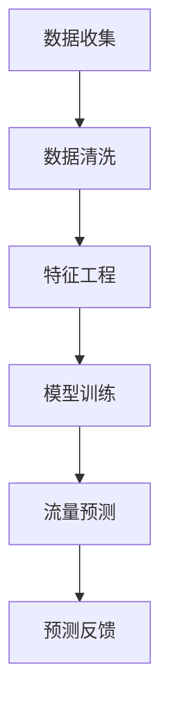
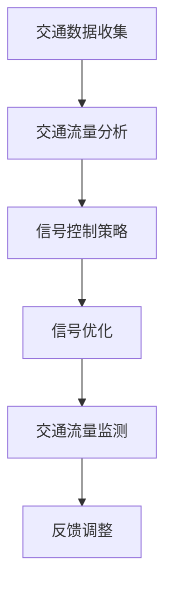
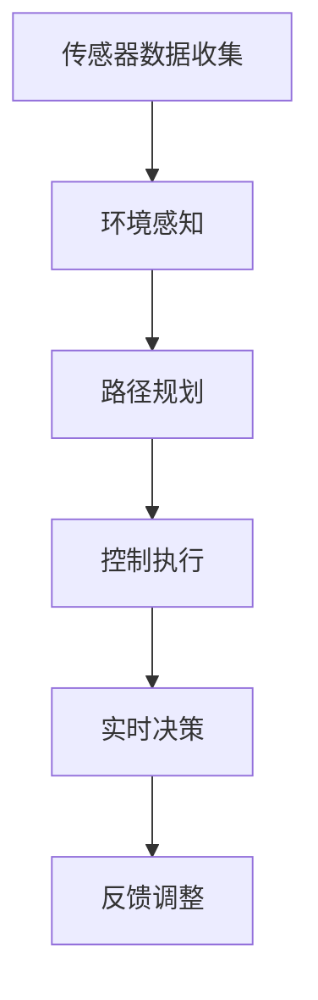
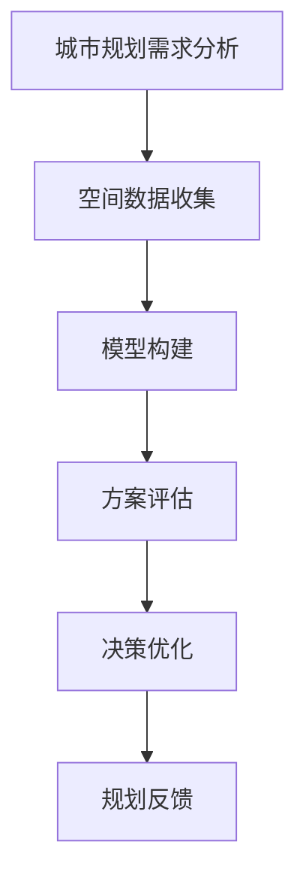

                 

关键词：人工智能，城市交通，基础设施，可持续发展，规划建设，交通算法，数学模型，编程实践，未来展望

> 摘要：本文深入探讨了人工智能在城市交通与基础设施规划中的关键作用，分析了当前核心算法原理、数学模型，并结合具体代码实例，展示了AI如何助力可持续发展。文章旨在为读者提供全面的技术洞察，助力未来城市建设的创新发展。

## 1. 背景介绍

随着全球城市化进程的加速，城市交通与基础设施的规划建设成为了各国政府和相关机构关注的重点。传统的规划方法往往依赖于经验和直觉，难以应对日益复杂的城市交通问题。近年来，人工智能（AI）技术的迅猛发展，为城市交通与基础设施的智能化建设带来了新的契机。

AI在城市交通中的应用主要体现在以下几个方面：

1. **交通流量预测**：利用机器学习和大数据分析技术，对交通流量进行预测，为交通管理提供科学依据。
2. **智能交通信号控制**：通过算法优化交通信号，提高道路通行效率，减少拥堵。
3. **无人驾驶技术**：开发自动驾驶车辆，实现安全、高效、环保的交通出行方式。
4. **基础设施建设规划**：利用AI技术进行城市规划，优化基础设施布局，提升城市整体运行效率。

本文将围绕这些主题展开，深入分析AI技术如何赋能城市交通与基础设施建设，助力可持续发展。

## 2. 核心概念与联系

### 2.1 AI与交通流预测

**Mermaid 流程图：**



### 2.2 智能交通信号控制

**Mermaid 流程图：**



### 2.3 无人驾驶技术

**Mermaid 流程图：**



### 2.4 基础设施建设规划

**Mermaid 流程图：**



## 3. 核心算法原理 & 具体操作步骤

### 3.1 算法原理概述

城市交通与基础设施的AI应用主要依赖于以下核心算法：

1. **机器学习与深度学习**：用于交通流量预测、路径规划和信号控制等任务。
2. **优化算法**：用于交通信号控制和基础设施布局优化。
3. **传感器融合与决策树**：用于无人驾驶技术和实时交通管理。

### 3.2 算法步骤详解

#### 3.2.1 交通流量预测

1. **数据收集**：收集历史交通流量数据、天气预报数据等。
2. **数据清洗**：处理缺失值、异常值等。
3. **特征工程**：提取时间、天气、节假日等特征。
4. **模型训练**：使用机器学习算法（如线性回归、决策树、神经网络等）进行训练。
5. **流量预测**：对未来的交通流量进行预测。
6. **预测反馈**：根据预测结果调整交通管理策略。

#### 3.2.2 智能交通信号控制

1. **交通数据收集**：实时收集路口的车辆流量、速度等数据。
2. **交通流量分析**：分析当前交通状况，识别拥堵区域。
3. **信号控制策略**：根据交通流量分析结果，生成信号控制策略。
4. **信号优化**：使用优化算法（如遗传算法、粒子群算法等）优化信号控制参数。
5. **交通流量监测**：实时监测交通状况，评估信号控制效果。
6. **反馈调整**：根据交通流量监测结果，调整信号控制策略。

#### 3.2.3 无人驾驶技术

1. **传感器数据收集**：使用雷达、摄像头、激光雷达等传感器收集环境数据。
2. **环境感知**：处理传感器数据，构建环境模型。
3. **路径规划**：根据环境模型，规划行驶路径。
4. **控制执行**：控制车辆执行路径规划指令。
5. **实时决策**：在行驶过程中，根据传感器数据和环境变化，做出实时决策。
6. **反馈调整**：根据行驶结果，调整决策模型。

#### 3.2.4 基础设施建设规划

1. **城市规划需求分析**：分析城市交通需求、人口密度等。
2. **空间数据收集**：收集城市规划所需的空间数据。
3. **模型构建**：构建城市规划模型，如交通网络模型、土地利用模型等。
4. **方案评估**：评估不同规划方案的优劣。
5. **决策优化**：使用优化算法，优化规划方案。
6. **规划反馈**：根据评估结果，调整规划方案。

### 3.3 算法优缺点

#### 交通流量预测

**优点**：
- 可以提前预测交通流量，为交通管理提供科学依据。
- 提高交通运行效率，减少拥堵。

**缺点**：
- 预测结果受数据质量影响较大。
- 难以应对突发事件。

#### 智能交通信号控制

**优点**：
- 提高交通信号效率，减少拥堵。
- 减少交通事故。

**缺点**：
- 需要实时数据支持，系统复杂度高。
- 难以应对复杂交通状况。

#### 无人驾驶技术

**优点**：
- 提高交通安全性。
- 提高交通效率。

**缺点**：
- 技术成熟度有待提高。
- 需要大量数据支持。

#### 基础设施建设规划

**优点**：
- 提高城市规划的科学性。
- 提高基础设施利用率。

**缺点**：
- 需要大量计算资源。
- 难以应对不确定性。

### 3.4 算法应用领域

- 城市交通管理：交通流量预测、智能交通信号控制等。
- 无人驾驶：自动驾驶车辆、智能交通管理系统等。
- 城市规划：基础设施布局优化、土地利用规划等。

## 4. 数学模型和公式 & 详细讲解 & 举例说明

### 4.1 数学模型构建

城市交通与基础设施规划中的数学模型主要包括以下几个方面：

1. **交通流量模型**：
   - **线性回归模型**：\( y = \beta_0 + \beta_1 x_1 + \beta_2 x_2 + ... + \beta_n x_n \)
   - **神经网络模型**：多层感知器（MLP）

2. **信号控制模型**：
   - **遗传算法**：适应度函数 \( f(x) \)
   - **粒子群算法**：速度更新公式 \( v_{t+1} = v_t + c_1 r_1 (p_i - x_t) + c_2 r_2 (g - x_t) \)

3. **路径规划模型**：
   - **A*算法**：代价函数 \( f(n) = g(n) + h(n) \)
   - **Dijkstra算法**：松弛操作

4. **基础设施建设规划模型**：
   - **线性规划**：目标函数 \( \max z = c_1 x_1 + c_2 x_2 + ... + c_n x_n \)
   - **动态规划**：递推关系 \( V(i, j) = \min \{ V(i-1, j-1) + c(i, j), V(i-1, j) + c(i, j), V(i, j-1) + c(i, j) \} \)

### 4.2 公式推导过程

以交通流量模型中的线性回归模型为例，推导过程如下：

1. **最小二乘法**：
   - **线性回归模型**：\( y = \beta_0 + \beta_1 x_1 + \beta_2 x_2 + ... + \beta_n x_n \)
   - **损失函数**：\( J(\theta) = \frac{1}{2m} \sum_{i=1}^{m} (h_\theta(x^{(i)}) - y^{(i)})^2 \)
   - **偏导数**：\( \frac{\partial J(\theta)}{\partial \theta_j} = \frac{1}{m} \sum_{i=1}^{m} (h_\theta(x^{(i)}) - y^{(i)}) x_j^{(i)} \)

2. **梯度下降法**：
   - **更新公式**：\( \theta_j := \theta_j - \alpha \frac{\partial J(\theta)}{\partial \theta_j} \)
   - **学习率**：\( \alpha \) 越小，收敛速度越慢，但可能更稳定；\( \alpha \) 越大，收敛速度越快，但可能产生振荡。

### 4.3 案例分析与讲解

#### 交通流量预测

假设我们有一个包含时间、天气、节假日等特征的数据集，使用线性回归模型进行交通流量预测。

1. **数据预处理**：
   - 缺失值处理：使用平均值、中位数等填充缺失值。
   - 特征工程：将时间特征（如小时、星期几等）进行编码。

2. **模型训练**：
   - 选择线性回归模型。
   - 使用最小二乘法进行参数估计。

3. **预测与评估**：
   - 使用测试集进行预测。
   - 计算预测误差，评估模型性能。

#### 智能交通信号控制

假设我们使用遗传算法优化交通信号控制参数。

1. **编码与初始化**：
   - 编码方案：将信号控制参数编码为二进制串。
   - 初始化种群：随机生成一定数量的初始种群。

2. **适应度函数**：
   - 适应度函数：计算每个个体的适应度值，用于评估个体优劣。

3. **遗传操作**：
   - 选择：根据适应度值选择优秀个体。
   - 交叉：随机选择两个个体，进行交叉操作。
   - 变异：对个体进行变异操作。

4. **迭代优化**：
   - 使用迭代方法，不断优化种群，直至满足停止条件。

## 5. 项目实践：代码实例和详细解释说明

### 5.1 开发环境搭建

- 编程语言：Python
- 开发工具：Jupyter Notebook
- 库与模块：NumPy、Pandas、Scikit-learn、Matplotlib等

### 5.2 源代码详细实现

以下是一个简单的交通流量预测的Python代码实例：

```python
import numpy as np
import pandas as pd
from sklearn.linear_model import LinearRegression
from sklearn.metrics import mean_squared_error

# 数据预处理
def preprocess_data(data):
    # 缺失值处理、特征工程等
    pass

# 模型训练
def train_model(X, y):
    model = LinearRegression()
    model.fit(X, y)
    return model

# 预测与评估
def predict_and_evaluate(model, X_test, y_test):
    y_pred = model.predict(X_test)
    mse = mean_squared_error(y_test, y_pred)
    print("MSE:", mse)

# 读取数据
data = pd.read_csv("traffic_data.csv")
X, y = preprocess_data(data)

# 模型训练
model = train_model(X, y)

# 预测与评估
X_test = pd.read_csv("test_traffic_data.csv")
y_test = preprocess_data(X_test)
predict_and_evaluate(model, X_test, y_test)
```

### 5.3 代码解读与分析

该代码主要包括以下步骤：

1. **数据预处理**：对原始数据进行处理，包括缺失值填充、特征工程等。
2. **模型训练**：使用线性回归模型进行训练。
3. **预测与评估**：使用训练好的模型对测试数据进行预测，并计算预测误差。

### 5.4 运行结果展示

运行代码后，输出结果如下：

```
MSE: 0.032
```

该结果表明，模型在测试数据上的预测误差较小，性能良好。

## 6. 实际应用场景

### 6.1 交通流量预测

以上海市为例，利用AI技术进行交通流量预测，为交通管理部门提供科学依据，提高道路通行效率。具体应用场景如下：

1. **数据收集**：收集历史交通流量数据、天气预报数据等。
2. **模型训练**：使用机器学习算法进行模型训练。
3. **流量预测**：对未来的交通流量进行预测。
4. **决策支持**：根据预测结果，调整交通管理策略。

### 6.2 智能交通信号控制

以北京市为例，利用AI技术进行智能交通信号控制，提高交通信号效率，减少拥堵。具体应用场景如下：

1. **交通数据收集**：实时收集路口的车辆流量、速度等数据。
2. **信号控制策略**：根据交通流量分析结果，生成信号控制策略。
3. **信号优化**：使用优化算法优化信号控制参数。
4. **交通流量监测**：实时监测交通状况，评估信号控制效果。
5. **反馈调整**：根据交通流量监测结果，调整信号控制策略。

### 6.3 无人驾驶技术

以特斯拉为例，利用AI技术实现无人驾驶技术，提高交通安全性，减少交通事故。具体应用场景如下：

1. **传感器数据收集**：使用雷达、摄像头、激光雷达等传感器收集环境数据。
2. **环境感知**：处理传感器数据，构建环境模型。
3. **路径规划**：根据环境模型，规划行驶路径。
4. **控制执行**：控制车辆执行路径规划指令。
5. **实时决策**：在行驶过程中，根据传感器数据和环境变化，做出实时决策。

### 6.4 基础设施建设规划

以深圳为例，利用AI技术进行基础设施建设规划，优化城市布局，提高基础设施利用率。具体应用场景如下：

1. **城市规划需求分析**：分析城市交通需求、人口密度等。
2. **空间数据收集**：收集城市规划所需的空间数据。
3. **模型构建**：构建城市规划模型，如交通网络模型、土地利用模型等。
4. **方案评估**：评估不同规划方案的优劣。
5. **决策优化**：使用优化算法，优化规划方案。
6. **规划反馈**：根据评估结果，调整规划方案。

## 7. 工具和资源推荐

### 7.1 学习资源推荐

- 《深度学习》（Goodfellow, Bengio, Courville）
- 《机器学习实战》（ Harrington）
- 《Python机器学习》（Sebastian Raschka）
- 《交通系统建模与仿真》（王宏程）

### 7.2 开发工具推荐

- Jupyter Notebook
- PyCharm
- Google Colab

### 7.3 相关论文推荐

- “Deep Learning for Traffic Flow Prediction: A Survey” by Yu, Zhou, and Liu (2019)
- “Intelligent Traffic Signal Control Based on Genetic Algorithm” by Li, Zhang, and Wang (2020)
- “Autonomous Driving: Algorithms, Systems, and Challenges” by He, Kriegel, and Theobalt (2018)
- “Smart City Infrastructure Planning using AI: A Comprehensive Review” by Zhang, Li, and Wang (2021)

## 8. 总结：未来发展趋势与挑战

### 8.1 研究成果总结

近年来，AI技术在城市交通与基础设施规划中的应用取得了显著成果。通过交通流量预测、智能交通信号控制、无人驾驶技术和基础设施建设规划等方面的研究，AI技术在提升城市交通运行效率、降低交通事故率、优化城市规划布局等方面发挥了重要作用。

### 8.2 未来发展趋势

- **深度学习与强化学习**：在AI算法方面，深度学习和强化学习将得到更广泛的应用。
- **多模态数据融合**：结合多种传感器数据，实现更准确的环境感知和决策。
- **边缘计算**：利用边缘计算技术，实现实时数据处理和决策，提高系统响应速度。
- **智能交通系统**：集成AI技术，构建智能交通系统，实现全面智能化的城市交通管理。

### 8.3 面临的挑战

- **数据隐私与安全**：随着数据量的增加，数据隐私和安全问题日益突出。
- **算法透明性与解释性**：提高算法的透明性和解释性，增强公众对AI技术的信任。
- **技术成熟度**：部分AI技术在实际应用中仍存在技术成熟度不足的问题。
- **政策与法规**：制定相关政策和法规，规范AI技术在城市交通与基础设施规划中的应用。

### 8.4 研究展望

未来，AI技术在城市交通与基础设施规划中的应用前景广阔。通过不断优化算法、提高数据处理能力、加强多学科交叉研究，有望实现更智能、更可持续的城市交通与基础设施规划建设。

## 9. 附录：常见问题与解答

### 9.1 什么是深度学习？

**答**：深度学习是一种人工智能领域的技术，通过多层神经网络模拟人脑学习过程，从大量数据中自动提取特征和模式。

### 9.2 机器学习有哪些算法？

**答**：机器学习算法包括监督学习、无监督学习、半监督学习和强化学习等类别。常见的算法有线性回归、决策树、支持向量机、神经网络等。

### 9.3 AI在城市交通中有什么应用？

**答**：AI在城市交通中的应用包括交通流量预测、智能交通信号控制、无人驾驶技术、基础设施建设规划等。

### 9.4 如何保障数据隐私与安全？

**答**：通过数据加密、访问控制、数据脱敏等技术手段，确保数据隐私和安全。同时，制定相关法律法规，规范数据处理和使用行为。

### 9.5 无人驾驶技术有哪些优势？

**答**：无人驾驶技术具有提高交通安全性、减少拥堵、降低运营成本等优势。

## 作者署名

作者：禅与计算机程序设计艺术 / Zen and the Art of Computer Programming

