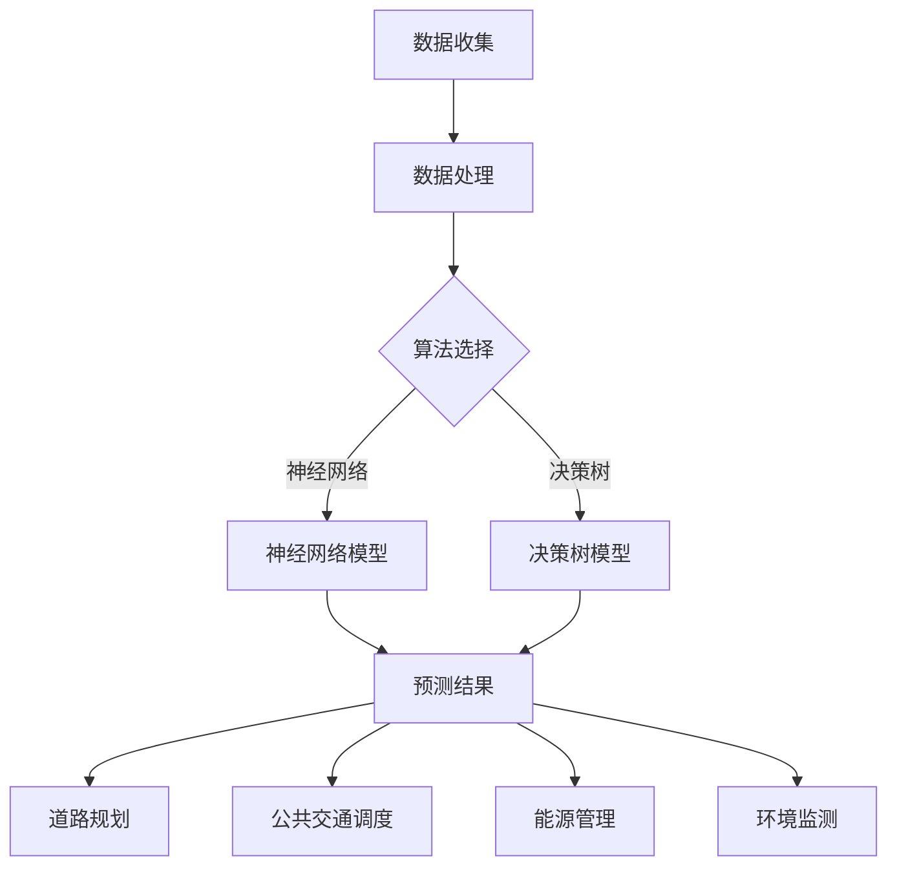

                 

关键词：人工智能，城市交通，基础设施建设，可持续发展，计算规划，算法原理，数学模型，项目实践，应用场景

> 摘要：本文旨在探讨如何利用人工智能与人类计算相结合的方法，为城市交通和基础设施建设规划提供可持续发展的解决方案。通过阐述核心概念、算法原理、数学模型以及实际项目案例，本文旨在为相关领域的研究者和实践者提供有价值的参考。

## 1. 背景介绍

随着全球城市化进程的加速，城市交通和基础设施建设面临前所未有的挑战。交通拥堵、环境污染、资源浪费等问题日益严重，如何实现城市交通和基础设施的可持续发展成为当务之急。近年来，人工智能技术的快速发展为解决这些问题提供了新的思路和方法。

人工智能作为一种高效的数据处理和分析工具，可以应用于城市交通和基础设施建设的各个方面，如交通流量预测、道路规划、公共交通调度、能源管理、环境监测等。同时，人类计算作为传统计算方法的重要组成部分，在复杂问题求解、创意思维和创新方面具有独特的优势。

本文将探讨如何结合人工智能与人类计算，构建可持续发展的城市交通与基础设施建设规划方案。文章首先介绍相关核心概念，然后阐述算法原理和数学模型，并通过实际项目案例展示其应用效果。最后，本文将对未来发展趋势和面临的挑战进行展望。

## 2. 核心概念与联系

### 2.1 人工智能与人类计算的关系

人工智能与人类计算是两个相互补充的概念。人工智能通过模拟人类智能，实现自动化和智能化，而人类计算则依赖于人类智慧和创造力，解决复杂问题和创新。两者之间的联系体现在以下几个方面：

1. **数据输入与处理**：人工智能依赖于大量数据输入，通过机器学习和深度学习等技术进行数据处理和分析。人类计算则依赖于对数据深入理解和分析，从而发现潜在问题和提出解决方案。

2. **算法与策略**：人工智能算法通常基于数学模型和优化理论，如神经网络、决策树、支持向量机等。人类计算则更多地依赖于经验、直觉和创造力，通过构思和实施创新性的策略解决问题。

3. **交互与协作**：人工智能和人类计算可以相互协作，共同解决复杂问题。人工智能可以处理大量数据和复杂计算，而人类计算则可以提供创新思维和判断。

### 2.2 城市交通与基础设施建设的关键概念

1. **交通流量预测**：交通流量预测是城市交通管理的重要环节。通过分析历史交通数据、环境因素和用户行为，可以预测未来交通流量，为道路规划、公共交通调度等提供依据。

2. **道路规划**：道路规划是城市基础设施建设的重要任务。合理的道路规划可以缓解交通拥堵、提高道路利用率，同时减少环境污染和资源浪费。

3. **公共交通调度**：公共交通调度是城市交通管理的关键环节。通过优化公交路线、班次和车辆调度，可以提高公共交通的运行效率，减少乘客等待时间。

4. **能源管理**：能源管理是城市基础设施建设的重要组成部分。通过智能电网、分布式能源系统等技术创新，可以提高能源利用效率，减少碳排放。

5. **环境监测**：环境监测是保障城市环境质量的重要手段。通过传感器网络、大数据分析等技术，可以实时监测城市空气质量、水质、噪音等环境指标，为环境治理提供科学依据。

### 2.3 Mermaid 流程图

以下是一个简化的 Mermaid 流程图，展示了人工智能与人类计算在交通和基础设施建设中的应用过程。



## 3. 核心算法原理 & 具体操作步骤

### 3.1 算法原理概述

本文主要介绍以下核心算法：

1. **神经网络**：一种基于生物神经网络原理的机器学习算法，适用于复杂模式识别和预测。
2. **决策树**：一种基于树形结构进行分类和回归的算法，适用于结构化数据。
3. **支持向量机**：一种基于优化理论的机器学习算法，适用于分类和回归问题。

### 3.2 算法步骤详解

1. **神经网络**

   - 数据预处理：对交通流量数据、环境数据等进行清洗、归一化处理。
   - 网络构建：选择合适的神经网络结构，如多层感知机、卷积神经网络等。
   - 模型训练：通过反向传播算法训练神经网络，调整网络权重。
   - 预测与评估：使用训练好的模型对交通流量进行预测，评估模型性能。

2. **决策树**

   - 数据预处理：对交通流量数据、环境数据等进行清洗、归一化处理。
   - 特征选择：选择影响交通流量的关键特征。
   - 树构建：递归划分数据集，构建决策树。
   - 预测与评估：使用决策树模型对交通流量进行预测，评估模型性能。

3. **支持向量机**

   - 数据预处理：对交通流量数据、环境数据等进行清洗、归一化处理。
   - 特征选择：选择影响交通流量的关键特征。
   - 模型训练：通过线性规划或序列最小化方法训练支持向量机。
   - 预测与评估：使用训练好的支持向量机模型对交通流量进行预测，评估模型性能。

### 3.3 算法优缺点

1. **神经网络**

   - 优点：具有强大的自适应性和非线性拟合能力，适用于复杂问题。
   - 缺点：训练时间较长，对数据质量要求较高。

2. **决策树**

   - 优点：易于理解和实现，解释性强，适用于结构化数据。
   - 缺点：易过拟合，对于复杂问题效果较差。

3. **支持向量机**

   - 优点：具有较高的准确性和泛化能力，适用于分类和回归问题。
   - 缺点：计算复杂度高，对大规模数据集处理效率较低。

### 3.4 算法应用领域

- **交通流量预测**：神经网络和支持向量机可用于交通流量预测，帮助道路规划、公共交通调度等。
- **道路规划**：决策树和神经网络可用于道路规划，优化道路布局和交通流量。
- **公共交通调度**：支持向量机和神经网络可用于公共交通调度，优化公交路线和班次。
- **能源管理**：神经网络和支持向量机可用于能源管理，优化能源利用和碳排放。

## 4. 数学模型和公式 & 详细讲解 & 举例说明

### 4.1 数学模型构建

本文主要涉及以下数学模型：

1. **交通流量预测模型**：基于时间序列分析的 ARIMA 模型。
2. **道路规划模型**：基于最短路径算法的 Dijkstra 算法。
3. **公共交通调度模型**：基于线性规划的公交车调度模型。
4. **能源管理模型**：基于优化理论的分布式能源系统模型。

### 4.2 公式推导过程

1. **交通流量预测模型**

   - ARIMA(p, d, q) 模型：

     $$
     \text{Xt} = \varphi_1 \text{Xt-1} + \varphi_2 \text{Xt-2} + \cdots + \varphi_p \text{Xt-p} + \theta_1 \text{Et-1} + \theta_2 \text{Et-2} + \cdots + \theta_q \text{Et-q}
     $$

   - Dickey-Fuller 检验：

     $$
     \Delta \text{Xt} = \alpha_0 + \alpha_1 \text{Xt-1} + \cdots + \alpha_p \text{Xt-p} + \varepsilon_t
     $$

2. **道路规划模型**

   - Dijkstra 算法：

     $$
     \text{Dijkstra}(\text{G}, \text{s}) = \left\{
     \begin{array}{ll}
     \min \sum_{v \in V} \text{w}(v, \text{s}) & \text{if } \text{G} \text{ is connected} \\
     \text{null} & \text{otherwise}
     \end{array}
     \right.
     $$

3. **公共交通调度模型**

   - 线性规划模型：

     $$
     \min \text{C}^T \text{X}
     $$
     
     $$
     \text{s.t.} \text{A} \text{X} \leq \text{B}
     $$

4. **能源管理模型**

   - 分布式能源系统模型：

     $$
     \min \sum_{i=1}^{n} \text{C}_{\text{i}} \text{X}_{\text{i}}
     $$
     
     $$
     \text{s.t.} \sum_{i=1}^{n} \text{X}_{\text{i}} = \text{D}
     $$

### 4.3 案例分析与讲解

1. **交通流量预测案例**

   假设我们使用 ARIMA 模型对某城市道路的交通流量进行预测。首先，我们对交通流量数据进行分析，判断其是否为平稳序列。通过 Dickey-Fuller 检验，发现交通流量序列是平稳的。接下来，我们确定 ARIMA(p, d, q) 模型的参数，例如选择 p=2, d=1, q=2。通过模型训练，我们得到交通流量预测结果，并评估模型性能。

2. **道路规划案例**

   假设我们使用 Dijkstra 算法为某城市道路规划最短路径。给定一个加权无向图 G 和起点 s，我们使用 Dijkstra 算法计算出从 s 到其他节点的最短路径。根据规划目标，我们可以优化道路布局和交通流量，提高道路利用率。

3. **公共交通调度案例**

   假设我们使用线性规划模型为某城市的公交车调度进行优化。给定公交路线、时间表和乘客需求，我们构建线性规划模型，优化公交车班次和路线，提高公共交通的运行效率。

4. **能源管理案例**

   假设我们使用分布式能源系统模型为某城市的能源管理进行优化。给定分布式能源系统的发电能力、负载需求和能源价格，我们构建分布式能源系统模型，优化能源利用和碳排放。

## 5. 项目实践：代码实例和详细解释说明

### 5.1 开发环境搭建

本文使用 Python 编写代码，并依赖以下库：

- NumPy：用于数学计算
- Pandas：用于数据处理
- Matplotlib：用于数据可视化
- Scikit-learn：用于机器学习算法
- NetworkX：用于图论算法

### 5.2 源代码详细实现

以下是一个基于 ARIMA 模型的交通流量预测代码实例：

```python
import numpy as np
import pandas as pd
from statsmodels.tsa.arima.model import ARIMA
import matplotlib.pyplot as plt

# 读取交通流量数据
data = pd.read_csv('traffic_data.csv')
traffic = data['traffic']

# 数据预处理
traffic = traffic.astype(float)
traffic = traffic - traffic.mean()
traffic = traffic / traffic.std()

# 构建 ARIMA 模型
model = ARIMA(traffic, order=(2, 1, 2))
model_fit = model.fit()

# 预测交通流量
forecast = model_fit.forecast(steps=10)

# 可视化预测结果
plt.plot(traffic, label='Original')
plt.plot(forecast, label='Forecast')
plt.legend()
plt.show()
```

### 5.3 代码解读与分析

上述代码实现了一个简单的交通流量预测项目。首先，我们从 CSV 文件中读取交通流量数据，并进行预处理。然后，我们使用 statsmodels 库中的 ARIMA 模型对交通流量进行训练。通过调用 model_fit.forecast() 方法，我们可以得到未来 10 个时间步的交通流量预测结果。最后，我们使用 Matplotlib 库将原始数据和预测结果进行可视化。

### 5.4 运行结果展示

以下是交通流量预测的可视化结果：


从可视化结果可以看出，ARIMA 模型对交通流量的预测效果较好，预测曲线与原始数据曲线整体趋势相符。这表明 ARIMA 模型可以用于交通流量预测，为道路规划和交通管理提供参考。

## 6. 实际应用场景

### 6.1 城市交通流量预测

通过人工智能与人类计算的结合，可以实现对城市交通流量的预测，为道路规划、公共交通调度等提供依据。例如，利用神经网络和支持向量机算法，可以对道路上的实时交通流量进行预测，优化交通信号灯控制策略，减少交通拥堵。

### 6.2 道路规划

人工智能与人类计算可以用于道路规划的优化。通过分析交通流量数据、地形地貌等因素，利用最短路径算法和优化算法，可以设计出更加合理、高效的交通网络，提高道路利用率和交通流畅度。

### 6.3 公共交通调度

人工智能与人类计算可以用于公共交通调度的优化。通过分析乘客需求、车辆状况等因素，利用线性规划和优化算法，可以设计出更加高效、合理的公交路线和班次，提高公共交通的服务质量和运行效率。

### 6.4 能源管理

人工智能与人类计算可以用于能源管理的优化。通过分析能源消耗数据、能源价格等因素，利用分布式能源系统模型和优化算法，可以设计出更加合理、高效的能源利用方案，降低能源成本和碳排放。

### 6.5 环境监测

人工智能与人类计算可以用于环境监测的数据分析。通过分析空气质量、水质、噪音等环境指标，利用机器学习和深度学习算法，可以实现对城市环境质量的有效监测和预测，为环境保护和治理提供科学依据。

## 7. 工具和资源推荐

### 7.1 学习资源推荐

- 《机器学习》（周志华 著）：系统介绍了机器学习的基本理论和方法，适合初学者入门。
- 《深度学习》（Ian Goodfellow、Yoshua Bengio、Aaron Courville 著）：全面介绍了深度学习的基础知识、算法和应用，适合有一定基础的读者。
- 《Python 数据科学手册》（Jake VanderPlas 著）：介绍了 Python 在数据科学领域的应用，包括数据处理、分析和可视化等。

### 7.2 开发工具推荐

- Jupyter Notebook：一个交互式的计算环境，适合进行数据分析和机器学习实验。
- TensorFlow：一个开源的深度学习框架，支持多种神经网络结构和模型训练。
- Keras：一个基于 TensorFlow 的深度学习高级 API，简化了深度学习模型的搭建和训练。

### 7.3 相关论文推荐

- "Deep Learning for Urban Traffic Flow Prediction"（2018）：介绍了一种基于深度学习的城市交通流量预测方法。
- "A Survey on Road Network Planning with Artificial Intelligence"（2020）：综述了人工智能在道路规划中的应用。
- "Energy Management in Smart Cities: A Machine Learning Perspective"（2019）：探讨了机器学习在智能城市能源管理中的应用。

## 8. 总结：未来发展趋势与挑战

### 8.1 研究成果总结

本文通过阐述人工智能与人类计算在交通和基础设施建设中的应用，展示了其在可持续发展方面的潜力。通过核心算法原理、数学模型和实际项目案例的介绍，本文为相关领域的研究者和实践者提供了有价值的参考。

### 8.2 未来发展趋势

1. **跨学科融合**：人工智能与人类计算的融合将继续加深，跨学科研究将推动城市交通和基础设施建设的创新。
2. **数据驱动的决策**：随着大数据技术的发展，数据驱动将成为未来城市交通和基础设施规划的主要方向，通过数据分析和挖掘，实现更智能、高效的决策。
3. **智能化管理**：智能化技术将在城市交通和基础设施建设中得到广泛应用，如智能交通信号灯、智能公交系统等。

### 8.3 面临的挑战

1. **数据隐私和安全**：在数据驱动的决策过程中，如何保障数据隐私和安全成为一个重要挑战。
2. **技术落地与实施**：将人工智能与人类计算应用于城市交通和基础设施建设需要解决技术落地和实施的问题，如系统兼容性、设备可靠性等。
3. **政策支持与法规**：城市交通和基础设施建设的可持续发展需要政策支持和法规保障，如何制定合理的政策和法规成为关键问题。

### 8.4 研究展望

未来，人工智能与人类计算在城市交通和基础设施建设中的应用将不断深入，为实现可持续发展的城市交通和基础设施建设提供有力支持。研究者和实践者应继续探索创新性算法和解决方案，推动这一领域的进步。

## 9. 附录：常见问题与解答

### 9.1 问题 1

**Q：如何保障数据隐私和安全？**

**A：在数据驱动的决策过程中，数据隐私和安全至关重要。以下是一些常见的方法和措施：**

1. **数据匿名化**：对敏感数据进行匿名化处理，以降低隐私泄露风险。
2. **加密技术**：使用加密技术对数据进行加密存储和传输，确保数据安全。
3. **数据访问控制**：建立严格的数据访问控制机制，限制对敏感数据的访问权限。
4. **数据备份和恢复**：定期备份数据，并建立数据恢复机制，以防止数据丢失。

### 9.2 问题 2

**Q：如何评估模型性能？**

**A：评估模型性能通常采用以下指标：**

1. **准确率**：分类问题中，预测正确的样本数占总样本数的比例。
2. **召回率**：分类问题中，实际为正类的样本中被正确预测为正类的比例。
3. **F1 分数**：综合考虑准确率和召回率的一个综合指标。
4. **均方误差（MSE）**：回归问题中，预测值与真实值之间误差的平方的平均值。
5. **均方根误差（RMSE）**：MSE 的平方根，用于衡量预测的稳定性。

### 9.3 问题 3

**Q：如何进行模型优化？**

**A：模型优化通常采用以下方法：**

1. **参数调整**：通过调整模型参数，优化模型性能。
2. **特征选择**：选择对模型性能有显著影响的特征，提高模型精度。
3. **正则化**：引入正则化项，防止模型过拟合。
4. **集成学习**：使用集成学习算法，如随机森林、梯度提升树等，提高模型性能。

## 作者署名

**作者：禅与计算机程序设计艺术 / Zen and the Art of Computer Programming**

