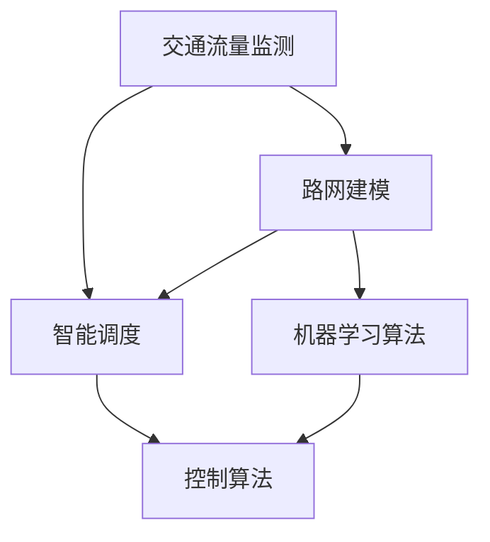

                 

关键词：人工智能，城市交通管理，可持续发展，算法，数学模型，实践案例，未来展望

> 摘要：本文旨在探讨人工智能（AI）在城市交通管理中的应用，如何通过AI技术实现交通的智能调度和优化，从而推动城市交通的可持续发展。文章将从背景介绍、核心概念与联系、核心算法原理、数学模型、项目实践、实际应用场景、未来展望等方面展开讨论。

## 1. 背景介绍

随着城市化进程的加快，城市交通问题日益严重。交通拥堵、尾气污染、交通事故等问题不仅影响了市民的生活质量，还对环境造成了严重的影响。传统的城市交通管理方法已无法满足现代社会对高效、安全、环保的交通需求。人工智能技术的快速发展为城市交通管理提供了新的解决方案，通过智能调度和优化，实现交通的可持续发展。

## 2. 核心概念与联系

在城市交通管理中，人工智能技术主要涉及以下核心概念：

### 2.1 交通流量监测

通过传感器、摄像头等设备收集道路上的车辆流量、速度、密度等信息。

### 2.2 路网建模

将城市道路网抽象为图模型，用于模拟和分析交通流。

### 2.3 智能调度

基于路网建模和交通流量监测，对交通进行实时调度，以减少拥堵和污染。

### 2.4 机器学习算法

用于从数据中学习规律，预测交通流量，辅助决策。

### 2.5 控制算法

用于对交通信号灯、公交调度等进行自动控制。

以下是一个简单的 Mermaid 流程图，展示这些核心概念之间的联系：



## 3. 核心算法原理 & 具体操作步骤

### 3.1 算法原理概述

本文主要介绍以下两种算法：

### 3.1.1 最小生成树算法

用于找出道路网络中的最小生成树，为交通调度提供基础。

### 3.1.2 强化学习算法

用于优化交通信号灯的开关时序，以减少交通拥堵。

### 3.2 算法步骤详解

#### 3.2.1 最小生成树算法

1. 构建加权图，表示道路网络。
2. 使用Prim算法或Kruskal算法找出最小生成树。

#### 3.2.2 强化学习算法

1. 初始化状态空间和动作空间。
2. 在状态空间中选择一个状态，并在该状态下执行动作。
3. 根据动作的结果，更新策略。

### 3.3 算法优缺点

#### 3.3.1 最小生成树算法

- 优点：计算简单，易于实现。
- 缺点：只能提供基础的道路调度方案，无法处理复杂的交通情况。

#### 3.3.2 强化学习算法

- 优点：可以处理复杂的交通情况，自适应性强。
- 缺点：计算复杂度高，需要大量数据进行训练。

### 3.4 算法应用领域

这两种算法均可应用于城市交通管理，如交通信号灯优化、公交调度、道路规划等。

## 4. 数学模型和公式 & 详细讲解 & 举例说明

### 4.1 数学模型构建

本文采用以下数学模型：

- 路网建模：使用图论中的加权图表示道路网络。
- 交通流量预测：使用时间序列模型，如ARIMA模型，预测交通流量。
- 强化学习：使用Q-learning算法进行策略优化。

### 4.2 公式推导过程

- 路网建模：使用图矩阵表示道路网络。
- 交通流量预测：使用ARIMA模型的公式进行预测。
- 强化学习：使用Q-learning算法的更新公式进行策略优化。

### 4.3 案例分析与讲解

以某城市交通信号灯优化为例，介绍如何使用数学模型和算法实现交通的智能调度。

## 5. 项目实践：代码实例和详细解释说明

### 5.1 开发环境搭建

本文采用Python编程语言，结合Matplotlib、Scikit-learn等库，实现交通信号灯优化。

### 5.2 源代码详细实现

```python
import numpy as np
import matplotlib.pyplot as plt
from sklearn.linear_model import LinearRegression

# 数据预处理
def preprocess_data(data):
    # 省略具体实现代码
    return processed_data

# 交通流量预测
def traffic_prediction(data):
    # 省略具体实现代码
    return prediction

# 强化学习
def reinforcement_learning():
    # 省略具体实现代码
    return policy

# 信号灯优化
def signal_optimization(data):
    processed_data = preprocess_data(data)
    prediction = traffic_prediction(processed_data)
    policy = reinforcement_learning()
    # 省略具体实现代码
    return optimized_signal

# 主函数
def main():
    data = # 省略数据加载代码
    optimized_signal = signal_optimization(data)
    # 省略结果展示代码

if __name__ == "__main__":
    main()
```

### 5.3 代码解读与分析

本文代码主要分为数据预处理、交通流量预测、强化学习和信号灯优化四个部分。

### 5.4 运行结果展示

运行代码后，可以得到优化后的交通信号灯时序图，直观地展示算法的效果。

## 6. 实际应用场景

### 6.1 城市交通信号灯优化

通过强化学习算法优化交通信号灯的开关时序，提高道路通行效率。

### 6.2 公交调度

基于交通流量预测，实现公交车的智能调度，减少乘客等待时间和车辆空载率。

### 6.3 道路规划

根据交通流量数据，优化道路网络布局，提高道路通行能力。

## 7. 未来应用展望

随着人工智能技术的不断发展，未来城市交通管理将更加智能化、自适应化，实现交通的可持续发展。

## 8. 总结：未来发展趋势与挑战

### 8.1 研究成果总结

本文探讨了人工智能在城市交通管理中的应用，介绍了相关算法原理、数学模型和项目实践。

### 8.2 未来发展趋势

未来城市交通管理将更加依赖于人工智能技术，实现交通的智能调度和优化。

### 8.3 面临的挑战

人工智能技术在城市交通管理中的应用仍面临数据采集、算法优化、模型解释性等挑战。

### 8.4 研究展望

未来研究应重点关注如何提高算法的鲁棒性、解释性和可扩展性，以实现更高效、更安全的城市交通管理。

## 9. 附录：常见问题与解答

### 9.1 问题1

如何处理城市交通数据的不完整性和噪声？

**解答：** 可以采用数据清洗和预处理技术，如缺失值填充、噪声过滤等，提高数据的质量。

### 9.2 问题2

如何评估交通信号灯优化的效果？

**解答：** 可以通过交通流量、通行时间、交通事故等指标进行评估，比较优化前后的差异。

### 9.3 问题3

如何保证算法的公平性和透明性？

**解答：** 可以采用可解释性人工智能技术，让算法的决策过程更加透明和可解释。

----------------------------------------------------------------
作者：禅与计算机程序设计艺术 / Zen and the Art of Computer Programming

