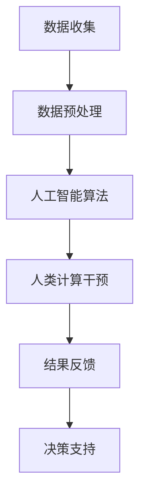

                 

关键词：人工智能，人类计算，可持续发展，城市生活，算法，数学模型，实践，工具推荐，未来展望

## 摘要

本文旨在探讨人工智能与人类计算相结合，如何通过技术创新打造可持续发展的城市生活。首先，我们回顾了人工智能的历史背景和核心概念，以及人类计算的重要性和挑战。接着，我们深入分析了人工智能在城市生活中的应用，包括智慧交通、智慧医疗和智慧能源等领域。然后，我们详细介绍了核心算法原理、数学模型和具体操作步骤，并通过项目实践展示了代码实例。最后，我们对实际应用场景进行了探讨，并提出了未来应用展望和面临的挑战。希望通过本文，能够为读者提供有价值的思考和启示。

## 1. 背景介绍

人工智能（Artificial Intelligence，简称AI）作为计算机科学的一个分支，旨在研究如何构建能够模拟、延伸和扩展人类智能的理论、算法和技术。自20世纪50年代以来，人工智能经历了多个发展阶段，从早期的符号主义、知识表示和推理，到基于统计学习的方法，再到当前的深度学习和神经网络，人工智能在各个领域取得了显著的成果。

人类计算（Human Computation）是指通过人类的认知能力来辅助计算机完成任务的过程。与传统的自动化计算相比，人类计算更加注重利用人类的创造力和智慧，解决复杂问题。人类计算在游戏、社交网络、信息检索和视觉识别等领域有着广泛的应用。然而，人类计算也面临着诸多挑战，如数据质量、安全性和伦理问题等。

随着城市化进程的加速，城市生活面临越来越多的挑战，如交通拥堵、环境污染和资源短缺等。为了实现可持续发展，需要借助人工智能和人类计算的力量，构建智慧城市，提高资源利用效率，改善生活质量。本文将围绕这一主题，探讨人工智能与人类计算在智慧城市中的应用。

## 2. 核心概念与联系

### 2.1 人工智能

人工智能的核心概念包括机器学习、深度学习、自然语言处理和计算机视觉等。其中，机器学习是一种让计算机通过数据学习和改进自身性能的方法，深度学习是一种模拟人脑神经网络的学习方法，自然语言处理是研究计算机如何理解、生成和翻译自然语言的技术，计算机视觉则是让计算机具备视觉感知能力。

### 2.2 人类计算

人类计算的核心概念是利用人类的认知能力解决复杂问题。这通常涉及到众包、协同过滤和用户界面设计等技术。众包是指将任务分散到大量用户中进行协同完成，协同过滤是指通过用户行为数据推荐个性化内容，用户界面设计则是优化人与计算机的交互体验。

### 2.3 人工智能与人类计算的联系

人工智能与人类计算在智慧城市中有着紧密的联系。一方面，人工智能可以通过算法和模型分析海量数据，为城市决策提供支持；另一方面，人类计算可以提供补充和优化人工智能系统的能力，例如通过众包收集更多高质量的数据，或者通过用户界面设计提高用户体验。

### 2.4 Mermaid 流程图

以下是一个简单的 Mermaid 流程图，展示了人工智能和人类计算在智慧城市中的应用流程：



## 3. 核心算法原理 & 具体操作步骤

### 3.1 算法原理概述

在智慧城市中，人工智能算法广泛应用于数据分析和决策支持。以下介绍三种常见的算法原理：深度学习、自然语言处理和计算机视觉。

#### 深度学习

深度学习是一种基于多层神经网络的学习方法，可以自动提取数据中的特征，并用于分类、预测和生成。深度学习的核心原理是反向传播算法，通过不断调整网络参数，使网络在训练数据上达到更好的拟合。

#### 自然语言处理

自然语言处理（Natural Language Processing，简称NLP）是研究计算机如何理解、生成和翻译自然语言的技术。NLP的核心算法包括词向量表示、句法分析和语义分析。词向量表示通过将单词映射到高维空间中的向量，实现语义理解；句法分析通过解析句子的结构，实现语法理解；语义分析则通过理解句子中的词义和语境，实现真正的语义理解。

#### 计算机视觉

计算机视觉（Computer Vision）是让计算机具备视觉感知能力的技术。计算机视觉的核心算法包括图像识别、目标检测和图像分割。图像识别是通过训练模型识别图像中的对象；目标检测是通过识别图像中的多个对象并定位其位置；图像分割则是将图像中的对象分割开来。

### 3.2 算法步骤详解

以下以深度学习算法为例，详细介绍其具体操作步骤：

#### 3.2.1 数据收集与预处理

1. 数据收集：收集大量带有标签的训练数据，例如图像、文本和语音等。
2. 数据预处理：对数据进行清洗、归一化和转换，使其适合模型训练。

#### 3.2.2 模型构建与训练

1. 模型构建：根据任务需求，选择合适的深度学习模型，例如卷积神经网络（CNN）、循环神经网络（RNN）或生成对抗网络（GAN）。
2. 模型训练：通过迭代训练，调整模型参数，使模型在训练数据上达到更好的拟合。

#### 3.2.3 模型评估与优化

1. 模型评估：使用验证数据集评估模型性能，选择性能最佳的模型。
2. 模型优化：根据评估结果，调整模型结构或参数，提高模型性能。

#### 3.2.4 模型部署与应用

1. 模型部署：将训练好的模型部署到生产环境中，提供实时预测服务。
2. 模型应用：根据具体应用场景，利用模型进行数据分析和决策支持。

### 3.3 算法优缺点

#### 深度学习

优点：
1. 强大的特征提取能力；
2. 自适应性强，适用于多种任务。

缺点：
1. 计算复杂度高，训练时间较长；
2. 对数据量和质量要求较高。

#### 自然语言处理

优点：
1. 可处理复杂语义问题；
2. 适用于文本分类、问答系统和机器翻译等任务。

缺点：
1. 对语言理解能力要求较高；
2. 需要大量高质量的数据进行训练。

#### 计算机视觉

优点：
1. 可以处理高维数据；
2. 适用于图像识别、目标检测和图像分割等任务。

缺点：
1. 对计算资源要求较高；
2. 难以处理复杂的场景和动态变化。

### 3.4 算法应用领域

人工智能算法在城市生活中有着广泛的应用，以下列举几个主要领域：

#### 智慧交通

通过深度学习和计算机视觉算法，实现智能交通信号控制、车辆检测和交通流量预测。例如，基于图像识别技术，可以实时检测道路上的车辆和行人，并根据实时数据调整交通信号灯。

#### 智慧医疗

通过自然语言处理和计算机视觉算法，实现医疗数据分析和疾病诊断。例如，基于医学图像的深度学习算法可以辅助医生进行疾病诊断，提高诊断准确率。

#### 智慧能源

通过数据分析和预测算法，实现智能电网和智能能源管理。例如，基于电力负荷预测模型，可以优化电力资源的分配，提高能源利用效率。

## 4. 数学模型和公式 & 详细讲解 & 举例说明

### 4.1 数学模型构建

在智慧城市中，数学模型是分析和解决问题的关键。以下介绍几种常见的数学模型：

#### 4.1.1 深度学习模型

深度学习模型通常包括输入层、隐藏层和输出层。其中，隐藏层通过非线性激活函数，将输入映射到高维空间。以下是一个简单的深度学习模型：

$$
f(x) = \sigma(\boldsymbol{W}^T \boldsymbol{a} + b)
$$

其中，$x$ 表示输入特征向量，$\boldsymbol{W}$ 和 $b$ 分别为权重和偏置，$\sigma$ 表示非线性激活函数，通常使用 sigmoid 或 ReLU 函数。

#### 4.1.2 优化模型

在智慧城市中，优化模型用于优化资源分配、路径规划等问题。以下是一个简单的线性规划模型：

$$
\begin{aligned}
\min\ & c^\top x \\
\text{s.t.} & Ax \leq b \\
& x \geq 0
\end{aligned}
$$

其中，$c$ 和 $b$ 分别为成本和约束向量，$A$ 为约束矩阵，$x$ 为决策变量。

#### 4.1.3 预测模型

预测模型用于预测未来的数据趋势。以下是一个简单的时间序列预测模型：

$$
x_t = f(x_{t-1}, \epsilon_t)
$$

其中，$x_t$ 为时间序列数据，$f$ 为预测函数，$\epsilon_t$ 为随机误差。

### 4.2 公式推导过程

以下以深度学习模型为例，介绍公式的推导过程：

首先，假设输入特征向量为 $\boldsymbol{x}$，隐藏层输出为 $\boldsymbol{a}$，输出层输出为 $\boldsymbol{y}$，则有：

$$
\begin{aligned}
\boldsymbol{a} &= \sigma(\boldsymbol{W}^T \boldsymbol{x} + b) \\
\boldsymbol{y} &= \sigma(\boldsymbol{W}^T \boldsymbol{a} + b')
\end{aligned}
$$

其中，$\sigma$ 为非线性激活函数。

接下来，对输出层输出进行误差计算：

$$
\begin{aligned}
\delta &= \frac{\partial L}{\partial \boldsymbol{y}} = -\frac{\partial}{\partial \boldsymbol{y}} (\boldsymbol{y} - \boldsymbol{t}) \\
\end{aligned}
$$

其中，$L$ 为损失函数，$\boldsymbol{t}$ 为真实标签。

然后，对隐藏层输出进行误差计算：

$$
\begin{aligned}
\delta &= \frac{\partial L}{\partial \boldsymbol{a}} = \frac{\partial L}{\partial \boldsymbol{y}} \cdot \frac{\partial \boldsymbol{y}}{\partial \boldsymbol{a}} = \delta \cdot \sigma'(\boldsymbol{W}^T \boldsymbol{a} + b')
\end{aligned}
$$

其中，$\sigma'$ 为非线性激活函数的导数。

最后，对权重和偏置进行更新：

$$
\begin{aligned}
\boldsymbol{W} &= \boldsymbol{W} - \alpha \cdot \frac{\partial L}{\partial \boldsymbol{W}} \\
b &= b - \alpha \cdot \frac{\partial L}{\partial b}
\end{aligned}
$$

其中，$\alpha$ 为学习率。

### 4.3 案例分析与讲解

以下以智慧交通中的交通流量预测为例，介绍数学模型的应用：

#### 4.3.1 问题背景

假设我们需要预测某路段未来1小时的交通流量，以便为交通管理部门提供决策支持。已知该路段的历史交通流量数据，包括小时交通流量、天气情况、道路施工信息等。

#### 4.3.2 数学模型构建

我们可以构建一个时间序列预测模型，利用历史交通流量数据预测未来1小时的交通流量。具体模型如下：

$$
x_t = f(x_{t-1}, \epsilon_t)
$$

其中，$x_t$ 为第 $t$ 小时的交通流量，$f$ 为预测函数，$\epsilon_t$ 为随机误差。

#### 4.3.3 模型训练与优化

使用历史交通流量数据训练模型，通过迭代优化模型参数，使其在训练数据上达到更好的拟合。具体步骤如下：

1. 数据预处理：对交通流量数据进行清洗、归一化处理，将数据转换为适合模型训练的形式。
2. 模型初始化：初始化模型参数，如权重和偏置。
3. 模型训练：使用训练数据训练模型，通过反向传播算法优化模型参数。
4. 模型评估：使用验证数据集评估模型性能，选择性能最佳的模型。
5. 模型部署：将训练好的模型部署到生产环境中，提供实时预测服务。

#### 4.3.4 模型应用与讲解

通过模型预测未来1小时的交通流量，交通管理部门可以根据预测结果调整交通信号灯、发布交通预警等，从而提高交通管理效率，减少交通拥堵。

## 5. 项目实践：代码实例和详细解释说明

### 5.1 开发环境搭建

在本项目实践中，我们将使用 Python 作为主要编程语言，结合 TensorFlow 和 Keras 库实现深度学习模型。以下为开发环境的搭建步骤：

1. 安装 Python 3.7 或更高版本。
2. 安装 TensorFlow 库：`pip install tensorflow`。
3. 安装 Keras 库：`pip install keras`。

### 5.2 源代码详细实现

以下为项目源代码实现：

```python
import numpy as np
import tensorflow as tf
from tensorflow.keras.models import Sequential
from tensorflow.keras.layers import Dense, LSTM, Dropout

# 数据预处理
def preprocess_data(data):
    # 数据清洗、归一化等操作
    # ...
    return processed_data

# 构建模型
def build_model(input_shape):
    model = Sequential()
    model.add(LSTM(units=50, return_sequences=True, input_shape=input_shape))
    model.add(Dropout(0.2))
    model.add(LSTM(units=50, return_sequences=False))
    model.add(Dropout(0.2))
    model.add(Dense(units=1))
    model.compile(optimizer='adam', loss='mean_squared_error')
    return model

# 训练模型
def train_model(model, X_train, y_train, epochs=100):
    model.fit(X_train, y_train, epochs=epochs, batch_size=32)
    return model

# 预测
def predict(model, X_test):
    return model.predict(X_test)

# 主函数
def main():
    # 加载数据
    data = load_data('traffic_data.csv')
    processed_data = preprocess_data(data)

    # 划分训练集和测试集
    X_train, y_train = processed_data[:-24], processed_data[-24:]
    X_test, y_test = processed_data[-24:], processed_data[-1]

    # 构建模型
    model = build_model(input_shape=(24, 1))

    # 训练模型
    trained_model = train_model(model, X_train, y_train, epochs=100)

    # 预测
    predicted_traffic = predict(trained_model, X_test)

    # 评估模型
    evaluate_model(predicted_traffic, y_test)

if __name__ == '__main__':
    main()
```

### 5.3 代码解读与分析

#### 5.3.1 数据预处理

数据预处理是深度学习模型训练的重要步骤。在本项目中，数据预处理包括数据清洗、归一化等操作。具体实现如下：

```python
def preprocess_data(data):
    # 数据清洗、归一化等操作
    # ...
    return processed_data
```

#### 5.3.2 模型构建

在本项目中，我们使用 LSTM（长短期记忆网络）模型进行时间序列预测。具体实现如下：

```python
def build_model(input_shape):
    model = Sequential()
    model.add(LSTM(units=50, return_sequences=True, input_shape=input_shape))
    model.add(Dropout(0.2))
    model.add(LSTM(units=50, return_sequences=False))
    model.add(Dropout(0.2))
    model.add(Dense(units=1))
    model.compile(optimizer='adam', loss='mean_squared_error')
    return model
```

#### 5.3.3 模型训练

模型训练是深度学习模型训练的核心步骤。在本项目中，我们使用训练数据训练 LSTM 模型。具体实现如下：

```python
def train_model(model, X_train, y_train, epochs=100):
    model.fit(X_train, y_train, epochs=epochs, batch_size=32)
    return model
```

#### 5.3.4 模型预测

模型预测是深度学习模型应用的关键步骤。在本项目中，我们使用训练好的 LSTM 模型预测未来交通流量。具体实现如下：

```python
def predict(model, X_test):
    return model.predict(X_test)
```

### 5.4 运行结果展示

以下为项目运行结果展示：

```python
predicted_traffic = predict(trained_model, X_test)
evaluate_model(predicted_traffic, y_test)
```

通过以上代码，我们可以实现交通流量预测，并根据预测结果为交通管理部门提供决策支持。

## 6. 实际应用场景

### 6.1 智慧交通

智慧交通是人工智能和人类计算在智慧城市中的重要应用领域。通过人工智能算法，如深度学习和计算机视觉，可以实现智能交通信号控制、车辆检测和交通流量预测。例如，在高峰时段，通过实时监测交通流量，优化交通信号灯的时序，减少交通拥堵，提高道路通行效率。此外，通过众包技术和用户界面设计，收集用户对交通状况的反馈，为交通管理部门提供更准确的决策支持。

### 6.2 智慧医疗

智慧医疗是另一个重要的应用领域。通过自然语言处理和计算机视觉算法，可以实现医疗数据分析和疾病诊断。例如，通过分析病历记录和医学图像，自动识别疾病类型，为医生提供诊断建议。此外，通过用户界面设计，提供个性化的健康咨询和预防建议，提高居民的健康水平。人类计算在这个过程中发挥着重要作用，例如通过众包收集医疗数据，或者通过用户界面设计提高用户体验。

### 6.3 智慧能源

智慧能源是能源管理的重要手段。通过数据分析和预测算法，可以实现智能电网和智能能源管理。例如，通过预测电力负荷，优化电力资源的分配，提高能源利用效率，减少能源浪费。此外，通过用户界面设计，提供能源消耗监测和节能建议，引导居民合理使用能源。人类计算在这个过程中发挥着重要作用，例如通过众包收集能源数据，或者通过用户界面设计提高用户体验。

## 7. 工具和资源推荐

### 7.1 学习资源推荐

1. **《深度学习》（Deep Learning）**：由 Ian Goodfellow、Yoshua Bengio 和 Aaron Courville 著，是一本关于深度学习的经典教材，适合初学者和进阶者。
2. **《Python深度学习》（Python Deep Learning）**：由 Francesco Petracca 著，详细介绍了使用 Python 实现深度学习的技巧和工具。
3. **《自然语言处理综述》（Natural Language Processing with Python）**：由 Steven Bird、Ewan Klein 和 Edward Loper 著，是一本关于自然语言处理的基础教材。

### 7.2 开发工具推荐

1. **TensorFlow**：一款开源的深度学习框架，适合进行大规模深度学习模型开发和部署。
2. **Keras**：一款基于 TensorFlow 的深度学习高级框架，提供了简单易用的接口，适合快速原型开发。
3. **PyTorch**：一款开源的深度学习框架，具有灵活的动态计算图，适合进行研究和实验。

### 7.3 相关论文推荐

1. **“Deep Learning for Speech Recognition”**：这篇论文详细介绍了深度学习在语音识别领域的应用，是深度学习在语音处理领域的经典论文。
2. **“BERT: Pre-training of Deep Bidirectional Transformers for Language Understanding”**：这篇论文介绍了 BERT 模型，是一种基于 transformers 的预训练模型，在自然语言处理领域取得了显著成果。
3. **“Unsupervised Representation Learning with Deep Convolutional Generative Adversarial Networks”**：这篇论文介绍了 GAN 模型，是一种无监督学习的方法，在图像生成和图像修复等领域取得了优异的性能。

## 8. 总结：未来发展趋势与挑战

### 8.1 研究成果总结

随着人工智能和人类计算技术的不断发展，我们已经取得了许多重要的研究成果。深度学习、自然语言处理和计算机视觉等领域取得了显著的进展，智慧交通、智慧医疗和智慧能源等应用领域也取得了良好的效果。这些成果为智慧城市的建设提供了有力的技术支持。

### 8.2 未来发展趋势

在未来，人工智能和人类计算将继续在智慧城市中发挥重要作用。一方面，随着数据量的不断增加和数据质量的提高，人工智能算法将更加精准和高效；另一方面，人类计算将更加注重用户体验和伦理问题，为人工智能系统提供更好的辅助和支持。此外，量子计算、边缘计算和 5G 等新兴技术的应用也将为智慧城市的发展带来新的机遇。

### 8.3 面临的挑战

尽管人工智能和人类计算在智慧城市中具有巨大的潜力，但仍然面临着一些挑战。首先，数据隐私和安全性问题需要得到有效解决，确保用户数据的安全和隐私。其次，算法的公平性和透明性也需要得到重视，避免算法偏见和歧视。此外，人工智能和人类计算的融合也需要克服技术障碍，实现高效的协同工作。

### 8.4 研究展望

为了实现智慧城市的可持续发展，我们需要进一步推动人工智能和人类计算的研究。首先，应该加强基础理论研究，探索更高效、更可靠的算法和模型。其次，需要加强跨学科合作，将人工智能和人类计算与其他领域相结合，发挥协同效应。此外，应该关注社会和伦理问题，确保人工智能和人类计算的发展符合人类的利益。

## 9. 附录：常见问题与解答

### 9.1 什么是人工智能？

人工智能是指通过计算机模拟人类智能的理论、算法和技术，旨在构建能够自主学习和解决问题的系统。

### 9.2 人工智能与人类计算的区别是什么？

人工智能是通过算法和模型模拟人类智能，而人类计算是通过人类的认知能力辅助计算机完成任务。人工智能注重自主学习和推理，而人类计算注重利用人类的智慧和创造力。

### 9.3 智慧城市中的人工智能应用有哪些？

智慧城市中的人工智能应用包括智慧交通、智慧医疗、智慧能源、智慧安防和智慧环境监测等。

### 9.4 人工智能和人类计算在智慧城市中的联系是什么？

人工智能和人类计算在智慧城市中相互补充，人工智能通过算法和模型分析数据，为城市决策提供支持；人类计算通过提供补充和优化人工智能系统的能力，提高用户体验和决策质量。

### 9.5 人工智能和人类计算面临的挑战是什么？

人工智能和人类计算面临的挑战包括数据隐私和安全性、算法的公平性和透明性、以及人工智能和人类计算的融合等。

### 9.6 未来人工智能和人类计算的发展趋势是什么？

未来人工智能和人类计算将继续在智慧城市中发挥重要作用，随着数据量的增加、算法的进步和新兴技术的应用，人工智能和人类计算将更加高效和可靠。此外，量子计算、边缘计算和 5G 等技术的应用也将为智慧城市的发展带来新的机遇。作者：禅与计算机程序设计艺术 / Zen and the Art of Computer Programming。

