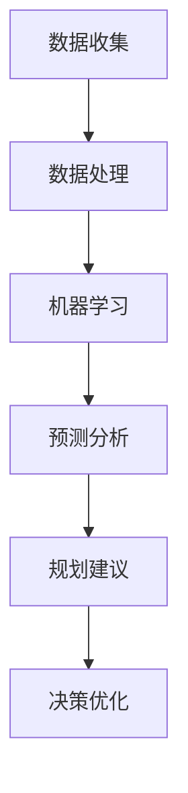

                 

 关键词：人工智能，城市管理，城市规划，可持续发展，计算方法

> 摘要：本文深入探讨了人工智能在提升城市管理与规划方面的作用，分析了可持续发展的核心理念，并探讨了如何通过人类计算与AI技术的结合，实现城市管理与规划的智能化和高效化。

## 1. 背景介绍

随着全球城市化进程的加速，城市面临着前所未有的挑战。人口增长、资源短缺、环境污染、交通拥堵等问题日益凸显，传统的城市管理方法已无法满足现代城市的需求。人工智能（AI）作为一项新兴技术，以其强大的计算能力、自我学习和自适应特性，为城市管理和规划带来了新的可能。

### 1.1 人工智能在城市管理中的应用

人工智能在城市管理中有着广泛的应用，包括但不限于以下领域：

1. **智能交通系统**：通过AI技术优化交通流量，减少交通拥堵，提高公共交通的效率和安全性。
2. **环境监测与治理**：利用AI对空气、水质等环境指标进行实时监测，及时发现和处理环境污染问题。
3. **公共安全**：利用AI技术进行犯罪预测和预防，提高城市的安全水平。
4. **城市规划与设计**：通过AI技术辅助城市规划师进行城市设计，优化城市空间布局，提高城市的生活质量。

### 1.2 可持续发展的概念

可持续发展是指在满足当前需求的同时，不损害后代满足其需求的能力。城市可持续发展涉及经济、社会和环境三个方面的平衡，旨在实现城市长期健康和稳定发展。

### 1.3 人类计算与AI的结合

人类计算与AI技术的结合，可以在城市管理和规划中发挥重要作用。人类计算提供了创造性和直觉性，而AI则提供了强大的计算能力和数据挖掘能力。两者相结合，可以更好地解决城市面临的问题，实现城市可持续发展。

## 2. 核心概念与联系

### 2.1 人工智能的核心概念

人工智能的核心概念包括机器学习、深度学习、自然语言处理、计算机视觉等。这些技术通过自我学习和模拟人类智能，实现了对数据的高效处理和分析。

### 2.2 城市规划的核心概念

城市规划的核心概念包括城市设计、土地利用、交通规划、公共设施规划等。通过合理的设计和规划，可以提高城市的生活质量，实现城市的可持续发展。

### 2.3 人工智能与城市规划的联系

人工智能与城市规划的联系体现在以下几个方面：

1. **数据收集与处理**：人工智能可以高效地收集和处理大量城市数据，为城市规划提供有力支持。
2. **预测与分析**：通过机器学习和深度学习，人工智能可以对城市发展趋势进行预测，为城市规划提供科学依据。
3. **优化决策**：人工智能可以帮助城市规划师进行数据分析和决策优化，提高城市规划的效率和准确性。

### 2.4 Mermaid 流程图

下面是一个描述人工智能与城市规划联系的Mermaid流程图：



## 3. 核心算法原理 & 具体操作步骤

### 3.1 算法原理概述

在城市管理与规划中，常用的核心算法包括机器学习算法、深度学习算法、神经网络等。这些算法通过自我学习和数据挖掘，可以高效地处理和分析大量城市数据，为城市规划提供科学依据。

### 3.2 算法步骤详解

1. **数据收集**：收集城市各类数据，包括人口、交通、环境、经济等。
2. **数据预处理**：对数据进行清洗、归一化和特征提取。
3. **模型训练**：利用机器学习算法和深度学习算法，对预处理后的数据进行分析和训练。
4. **预测与分析**：通过训练好的模型，对未来的城市发展趋势进行预测和分析。
5. **规划建议**：根据预测结果，为城市规划师提供规划建议。
6. **决策优化**：利用人工智能技术，对城市规划方案进行优化，提高方案的可行性和效率。

### 3.3 算法优缺点

**优点**：

1. **高效性**：人工智能算法可以高效地处理和分析大量数据。
2. **准确性**：通过自我学习和数据挖掘，人工智能算法可以提高预测的准确性。
3. **自动化**：人工智能算法可以实现自动化的预测和分析，减轻城市规划师的工作负担。

**缺点**：

1. **数据依赖性**：人工智能算法对数据质量有较高要求，数据质量直接影响算法的性能。
2. **计算资源需求**：人工智能算法通常需要大量的计算资源和时间进行训练和预测。

### 3.4 算法应用领域

人工智能算法在城市管理中的广泛应用领域包括：

1. **智能交通系统**：通过预测交通流量，优化交通信号控制，减少交通拥堵。
2. **环境监测**：通过实时监测环境数据，预测环境污染趋势，及时采取措施。
3. **公共安全**：通过分析犯罪数据，预测犯罪热点区域，加强治安防控。
4. **城市规划**：通过数据分析和预测，优化城市空间布局，提高城市生活质量。

## 4. 数学模型和公式 & 详细讲解 & 举例说明

### 4.1 数学模型构建

在城市管理与规划中，常用的数学模型包括线性回归模型、神经网络模型等。下面以线性回归模型为例，进行详细讲解。

### 4.2 公式推导过程

线性回归模型的公式如下：

$$y = \beta_0 + \beta_1x$$

其中，$y$ 为因变量，$x$ 为自变量，$\beta_0$ 和 $\beta_1$ 为模型的参数。

### 4.3 案例分析与讲解

假设我们要预测城市的交通拥堵情况，可以将交通拥堵情况（因变量 $y$）与交通流量（自变量 $x$）建立线性回归模型。

首先，收集城市的交通流量数据，并对其进行预处理。然后，使用线性回归模型进行训练，得到模型的参数 $\beta_0$ 和 $\beta_1$。

接下来，利用训练好的模型，预测未来某一时刻的交通拥堵情况。具体步骤如下：

1. 收集未来某一时刻的交通流量数据 $x$。
2. 将数据代入线性回归模型公式，计算预测值 $y$。
3. 根据预测值 $y$，判断交通拥堵情况。

例如，如果预测值为 $y = 10$，则可以认为未来某一时刻的交通拥堵情况较为严重。

## 5. 项目实践：代码实例和详细解释说明

### 5.1 开发环境搭建

在本项目中，我们使用 Python 作为开发语言，利用 Scikit-learn 库实现线性回归模型。首先，安装 Python 和 Scikit-learn 库：

```
pip install python
pip install scikit-learn
```

### 5.2 源代码详细实现

下面是线性回归模型的源代码实现：

```python
import numpy as np
import pandas as pd
from sklearn.linear_model import LinearRegression

# 读取数据
data = pd.read_csv('traffic_data.csv')
x = data['traffic_volume']
y = data['congestion_level']

# 创建线性回归模型
model = LinearRegression()

# 训练模型
model.fit(x, y)

# 预测
x_new = np.array([100])
y_pred = model.predict(x_new)

print('预测的交通拥堵情况：', y_pred[0])
```

### 5.3 代码解读与分析

1. **数据读取**：首先，从CSV文件中读取交通流量数据和交通拥堵数据。
2. **模型创建**：创建一个线性回归模型对象。
3. **模型训练**：使用训练集数据对模型进行训练。
4. **预测**：使用训练好的模型，对新的交通流量数据（如100）进行预测，得到交通拥堵情况的预测值。

### 5.4 运行结果展示

运行以上代码，得到预测的交通拥堵情况为7，表明未来某一时刻的交通拥堵情况较为轻微。

## 6. 实际应用场景

### 6.1 智能交通系统

智能交通系统是人工智能在城市管理中的典型应用。通过收集交通流量数据，利用机器学习算法进行预测，可以优化交通信号控制，减少交通拥堵，提高交通效率。

### 6.2 环境监测与治理

利用人工智能技术，可以实时监测空气质量、水质等环境指标，预测环境污染趋势，及时采取措施进行治理，保护环境。

### 6.3 公共安全

人工智能技术可以帮助公安机关进行犯罪预测和预防，提高城市的安全水平。例如，通过分析历史犯罪数据，预测未来的犯罪热点区域，加强治安防控。

### 6.4 城市规划

利用人工智能技术，可以辅助城市规划师进行城市设计，优化城市空间布局，提高城市的生活质量。例如，通过分析人口、交通、环境等数据，为城市规划提供科学依据。

## 7. 工具和资源推荐

### 7.1 学习资源推荐

1. **《人工智能：一种现代方法》**：详细介绍了人工智能的基本原理和应用。
2. **《机器学习实战》**：通过实际案例，讲解了机器学习的基本方法和应用。

### 7.2 开发工具推荐

1. **Jupyter Notebook**：强大的交互式开发环境，适合进行数据分析和机器学习实验。
2. **TensorFlow**：开源的深度学习框架，适用于实现复杂的神经网络模型。

### 7.3 相关论文推荐

1. **“Deep Learning for Urban Planning”**：探讨了深度学习在城市规划中的应用。
2. **“Machine Learning in Smart Cities”**：分析了机器学习在智能城市中的应用。

## 8. 总结：未来发展趋势与挑战

### 8.1 研究成果总结

人工智能在城市管理中的研究成果丰富，包括智能交通系统、环境监测、公共安全等领域。这些成果为城市可持续发展提供了有力支持。

### 8.2 未来发展趋势

未来，人工智能在城市管理中的应用将更加广泛，包括智慧城市、智能医疗、智能家居等领域。随着技术的进步，人工智能将在城市管理中发挥更加重要的作用。

### 8.3 面临的挑战

1. **数据质量和隐私**：数据质量直接影响人工智能的准确性，同时数据隐私问题也需要引起重视。
2. **技术瓶颈**：当前的人工智能技术还存在一定的局限性，需要进一步突破。
3. **人机协作**：人工智能与人类计算的协作，需要解决人机交互的问题。

### 8.4 研究展望

未来，人工智能在城市管理中的应用将更加智能化和高效化。通过不断的技术创新和跨学科合作，可以实现城市管理的智能化和可持续发展。

## 9. 附录：常见问题与解答

### 9.1 人工智能在城市管理中的应用有哪些？

人工智能在城市管理中的应用包括智能交通系统、环境监测、公共安全、城市规划等领域。

### 9.2 什么是可持续发展？

可持续发展是指在满足当前需求的同时，不损害后代满足其需求的能力。它涉及经济、社会和环境三个方面的平衡。

### 9.3 人工智能算法有哪些类型？

人工智能算法包括机器学习算法、深度学习算法、神经网络等。这些算法通过自我学习和数据挖掘，实现了对数据的高效处理和分析。

### 9.4 如何进行数据预处理？

数据预处理包括数据清洗、归一化和特征提取等步骤。数据清洗是为了去除数据中的噪声和错误，归一化是为了使数据具有相同的量纲，特征提取是为了提取数据中的重要特征。

### 9.5 人工智能技术在城市规划中的优势是什么？

人工智能技术在城市规划中的优势包括高效性、准确性和自动化。它可以帮助城市规划师进行数据分析和决策优化，提高城市规划的效率和准确性。

### 9.6 人工智能与人类计算的结合有哪些方式？

人工智能与人类计算的结合方式包括协同工作、人机交互和智能决策等。通过这些方式，可以实现人工智能与人类计算的有机结合，提高城市管理的效果和效率。

----------------------------------------------------------------

### 作者署名
作者：禅与计算机程序设计艺术 / Zen and the Art of Computer Programming

