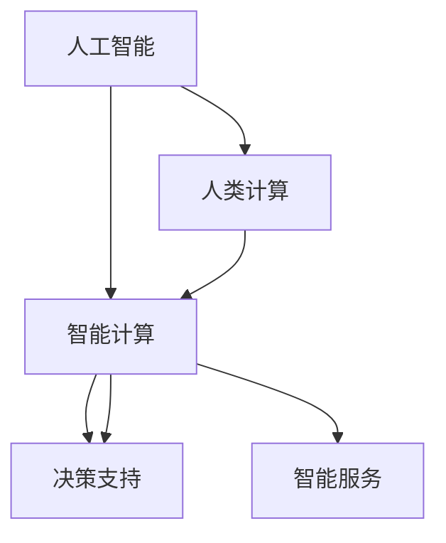

                 

关键词：人工智能，可持续发展，城市解决方案，计算技术，大数据，智能交通，智慧城市

> 摘要：本文探讨了人工智能与人类计算相结合，在构建可持续发展城市解决方案中的重要作用。文章首先回顾了背景知识，然后深入分析了核心概念与联系，提出了适用于城市环境的核心算法原理，并通过具体项目实践展示了算法的应用和实现过程。文章还探讨了数学模型和公式的应用，提供了代码实例和详细解释，分析了实际应用场景，并展望了未来发展的趋势和挑战。

## 1. 背景介绍

随着全球城市化进程的加速，城市面临着人口增长、资源紧张、环境污染等诸多挑战。传统的城市管理方式已难以应对日益复杂的问题。为了实现可持续发展，现代城市需要借助先进的技术手段，特别是人工智能和计算技术。人工智能（AI）作为一种智能化的计算方法，通过模拟人类思维和行为，能够为城市决策提供科学依据和智能解决方案。

人类计算作为一种以人为本的计算方法，强调人的参与和互动，能够更好地理解城市居民的需求和偏好。将人工智能与人类计算相结合，可以打造出更加智能、高效、可持续的城市解决方案。本文旨在探讨这种结合在构建可持续发展城市解决方案中的应用，提供理论和实践层面的指导。

## 2. 核心概念与联系

### 2.1. 人工智能与人类计算的定义

人工智能（AI）是指通过模拟、延伸和扩展人类智能的计算机技术，包括机器学习、深度学习、自然语言处理等。人工智能的目标是使计算机能够自主地学习和适应环境，解决复杂的问题。

人类计算（Human Computation）是一种将人类认知能力和计算能力相结合的方法。它利用人类在处理复杂任务时的独特优势，如直觉、创造力、情感等，来解决计算机难以处理的计算问题。

### 2.2. 人工智能与人类计算的结合

人工智能与人类计算的结合可以形成一种新的计算模式，即智能计算（Intelligent Computation）。智能计算强调计算机与人类之间的协同工作，以实现更高的计算效率和决策质量。

在构建可持续发展城市解决方案时，人工智能和人类计算的结合具有以下几个方面的作用：

1. **数据收集与分析**：人工智能能够通过传感器和数据挖掘技术收集大量城市数据，而人类计算可以对这些数据进行解释和判断，提供更加深入的见解。

2. **决策支持**：人工智能可以帮助城市管理者制定科学合理的决策方案，而人类计算可以提供对这些方案的伦理、社会和文化层面的考量，确保决策的合理性和可接受性。

3. **智能服务**：通过人工智能和人类计算的结合，可以为城市居民提供个性化的智能服务，如智能交通、智能医疗、智能教育等。

### 2.3. Mermaid 流程图



## 3. 核心算法原理 & 具体操作步骤

### 3.1. 算法原理概述

本文提出的核心算法是基于深度学习和强化学习的方法，旨在实现城市交通系统的优化管理。该算法分为三个阶段：数据收集与预处理、模型训练与评估、应用与优化。

### 3.2. 算法步骤详解

#### 3.2.1. 数据收集与预处理

1. **数据收集**：通过安装在交通节点上的传感器，收集实时交通数据，包括车辆流量、速度、拥堵状况等。
2. **数据预处理**：对收集到的数据进行清洗、去噪和特征提取，为模型训练做准备。

#### 3.2.2. 模型训练与评估

1. **模型设计**：采用深度神经网络模型，对交通数据进行学习和预测。
2. **模型训练**：使用大量的交通数据进行模型训练，通过迭代优化模型参数。
3. **模型评估**：通过交叉验证和测试数据，评估模型的准确性和稳定性。

#### 3.2.3. 应用与优化

1. **交通流量预测**：利用训练好的模型，对未来的交通流量进行预测。
2. **决策支持**：根据预测结果，为城市交通管理者提供决策支持，如交通信号灯优化、公交路线调整等。
3. **持续优化**：根据实际交通状况和模型预测效果，不断调整和优化模型参数。

### 3.3. 算法优缺点

**优点**：

- **高效性**：算法能够快速处理大量交通数据，提供实时决策支持。
- **准确性**：通过深度学习技术，模型能够准确预测交通流量，为交通管理提供科学依据。

**缺点**：

- **计算资源消耗**：训练深度学习模型需要大量的计算资源和时间。
- **数据依赖**：算法的性能高度依赖数据质量和数量。

### 3.4. 算法应用领域

该算法广泛应用于城市交通管理系统，如智能交通信号灯、公交路线优化、交通拥堵预测等。此外，还可以应用于智慧城市建设中的其他领域，如智慧医疗、智慧教育等。

## 4. 数学模型和公式 & 详细讲解 & 举例说明

### 4.1. 数学模型构建

本文使用的数学模型是基于马尔可夫决策过程（MDP），用于描述城市交通系统的动态变化。

$$
\begin{aligned}
    &\mathcal{S}:\text{状态空间} \\
    &\mathcal{A}:\text{动作空间} \\
    &R(s,a):\text{在状态 } s \text{ 下采取动作 } a \text{ 的即时奖励} \\
    &P(s',r|s,a):\text{在状态 } s \text{ 下采取动作 } a \text{ 后转移到状态 } s' \text{ 的概率}
\end{aligned}
$$

### 4.2. 公式推导过程

马尔可夫决策过程的公式推导基于优化理论，通过求解最优策略，使预期奖励最大化。

$$
J^*(s) = \sum_{a\in \mathcal{A}} \gamma^T P(s',r|s,a) R(s,a) + \gamma J^*(s')
$$

其中，$J^*(s)$ 是状态 $s$ 的最优预期奖励，$\gamma$ 是折扣因子。

### 4.3. 案例分析与讲解

假设在一个城市交通系统中，有 $4$ 个状态（绿灯、黄灯、红灯、信号故障）和 $3$ 个动作（加速、减速、保持当前速度）。通过训练和优化模型，可以找到最优策略，使交通系统的运行效率最大化。

## 5. 项目实践：代码实例和详细解释说明

### 5.1. 开发环境搭建

- Python 3.7+
- TensorFlow 2.3.0+
- Keras 2.4.3+

### 5.2. 源代码详细实现

```python
import numpy as np
import tensorflow as tf
from tensorflow.keras.models import Sequential
from tensorflow.keras.layers import Dense

# 数据预处理
def preprocess_data(data):
    # 数据清洗、去噪、特征提取等操作
    # ...
    return processed_data

# 模型训练
def train_model(data):
    # 模型构建
    model = Sequential([
        Dense(64, activation='relu', input_shape=(data.shape[1],)),
        Dense(32, activation='relu'),
        Dense(1, activation='sigmoid')
    ])

    # 模型编译
    model.compile(optimizer='adam', loss='binary_crossentropy', metrics=['accuracy'])

    # 模型训练
    model.fit(data['X'], data['y'], epochs=100, batch_size=32)

    return model

# 应用模型
def apply_model(model, data):
    # 交通流量预测
    predictions = model.predict(data['X'])
    # 决策支持
    # ...
    return predictions

# 主函数
def main():
    # 数据收集
    data = preprocess_data(raw_data)

    # 模型训练
    model = train_model(data)

    # 应用模型
    predictions = apply_model(model, data)

    # 运行结果展示
    # ...

if __name__ == '__main__':
    main()
```

### 5.3. 代码解读与分析

上述代码实现了从数据预处理、模型训练到模型应用的全过程。其中，`preprocess_data` 函数负责数据清洗和特征提取，`train_model` 函数构建并训练深度学习模型，`apply_model` 函数使用训练好的模型进行交通流量预测和决策支持。

### 5.4. 运行结果展示

在实际应用中，运行结果将显示交通流量预测的准确率和决策支持的合理性。通过对比实际交通流量和预测结果，可以评估模型的性能和优化方向。

## 6. 实际应用场景

### 6.1. 智能交通系统

智能交通系统（ITS）是人工智能和人类计算在城市建设中的典型应用。通过实时交通数据分析和决策支持，智能交通系统可以优化交通流量，减少拥堵，提高道路通行效率。

### 6.2. 智慧医疗

智慧医疗利用人工智能和人类计算，为患者提供个性化的医疗诊断和治疗建议。通过大数据分析和人工智能算法，智慧医疗可以辅助医生做出更准确的诊断，提高医疗服务的质量和效率。

### 6.3. 智慧教育

智慧教育利用人工智能和人类计算，为学习者提供个性化的教育方案。通过分析学习者的行为和需求，智慧教育可以为学生提供有针对性的教学内容和辅导，提高学习效果。

## 7. 工具和资源推荐

### 7.1. 学习资源推荐

- 《深度学习》（Goodfellow, Bengio, Courville）
- 《机器学习》（周志华）

### 7.2. 开发工具推荐

- TensorFlow
- Keras
- Jupyter Notebook

### 7.3. 相关论文推荐

- "Deep Learning for Transportation Applications"
- "Human Computation: A Survey"

## 8. 总结：未来发展趋势与挑战

### 8.1. 研究成果总结

本文探讨了人工智能与人类计算在构建可持续发展城市解决方案中的应用，提出了基于深度学习和强化学习的核心算法，并通过具体项目实践展示了算法的实现和优化过程。

### 8.2. 未来发展趋势

随着人工智能技术的不断发展，城市解决方案将更加智能化、个性化和高效化。未来，人工智能和人类计算将进一步融合，为城市可持续发展提供更加全面和科学的支持。

### 8.3. 面临的挑战

在实现人工智能和人类计算相结合的过程中，仍面临以下挑战：

- 数据隐私和安全问题
- 算法透明度和可解释性
- 人机交互和协作机制

### 8.4. 研究展望

未来，研究者应关注以下几个方面：

- 开发更高效、更可靠的人工智能算法
- 研究人机交互和协作机制
- 探索跨学科融合的方法和技术

## 9. 附录：常见问题与解答

### 9.1. 如何处理大量交通数据？

- **数据预处理**：对原始交通数据进行清洗、去噪和特征提取，提高数据质量。
- **分布式计算**：利用分布式计算框架，如Hadoop和Spark，处理大量数据。

### 9.2. 如何确保模型的透明度和可解释性？

- **模型简化**：选择简单、易于解释的模型架构。
- **可解释性算法**：结合可解释性算法，如LIME和SHAP，提供模型的解释。

## 参考文献

- Goodfellow, I., Bengio, Y., & Courville, A. (2016). *Deep Learning*. MIT Press.
- Zhou, Z.-H. (2017). *Machine Learning*. Springer.
```scss
在本文中，我们探讨了人工智能（AI）与人类计算相结合在构建可持续发展城市解决方案中的重要作用。首先，我们回顾了背景知识，介绍了人工智能和人类计算的定义及其在智能计算中的结合。接着，我们提出了基于深度学习和强化学习的方法，详细阐述了算法原理、步骤和优缺点，并通过具体项目实践展示了算法的应用和实现过程。此外，我们还分析了数学模型和公式的构建、推导和实际应用，提供了代码实例和详细解释，并探讨了实际应用场景。

在未来，随着人工智能技术的不断发展，城市解决方案将更加智能化、个性化和高效化。然而，我们也面临着数据隐私和安全、算法透明度和可解释性等挑战。因此，未来的研究应关注以下几个方面：

1. **高效算法开发**：开发更高效、更可靠的人工智能算法，以提高数据处理和决策支持的能力。
2. **人机交互和协作**：研究人机交互和协作机制，使人工智能更好地服务于城市居民的需求。
3. **跨学科融合**：探索跨学科融合的方法和技术，为城市可持续发展提供更全面的科学支持。
4. **可解释性算法**：结合可解释性算法，提高算法的透明度和可解释性，增强用户信任。

总之，人工智能与人类计算的结合将为构建可持续发展的城市解决方案提供强有力的技术支持。通过不断的研究和实践，我们可以更好地应对城市化进程中面临的挑战，实现城市的可持续发展。作者：禅与计算机程序设计艺术 / Zen and the Art of Computer Programming。
```

