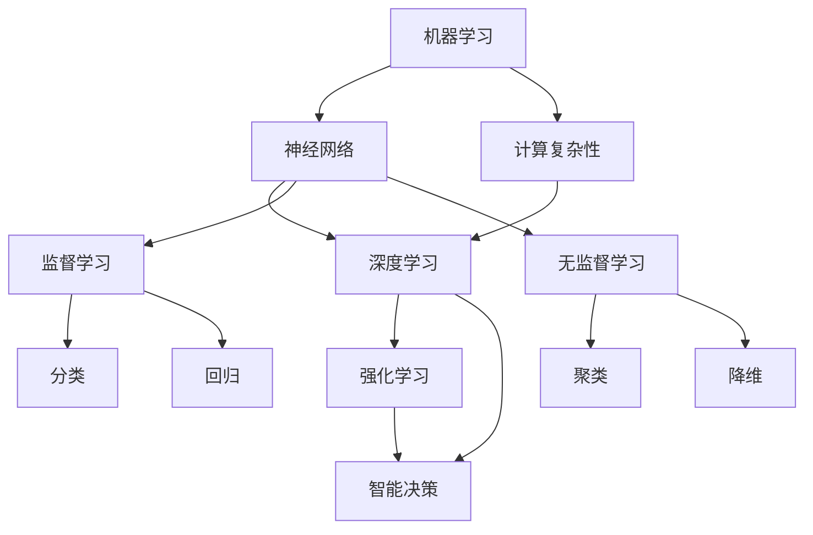

                 

 关键词：
- 人工智能
- 人类计算
- 弹性社会
- 计算能力
- 技术进步
- 社会变革

> 摘要：
本文探讨了人工智能（AI）与人类计算在现代社会中的相互作用，分析了AI如何增强人类计算能力，推动社会朝着更加弹性的方向发展。通过深入探讨核心概念、算法原理、数学模型及其实际应用，本文旨在展示AI技术对社会、经济和人类生活方式的深远影响，并对未来发展趋势与面临的挑战进行展望。

## 1. 背景介绍

在当今社会，人工智能已经成为科技进步的重要驱动力。从简单的自动化工具到复杂的学习系统和智能决策支持系统，AI技术已经渗透到各个领域。与此同时，人类计算能力也在不断提升，从早期的手工计算到现代的电子计算，再到未来的量子计算，计算能力的增强不仅提高了工作效率，也为科学研究、工程实践和日常生活带来了革命性的变化。

### 1.1 人工智能的发展历程

人工智能（AI）的研究可以追溯到20世纪50年代，当时计算机科学家首次提出了“智能机器”的概念。随着计算能力的提高和算法的进步，AI技术经历了几个重要的发展阶段，包括规则推理、知识表示、机器学习、深度学习和现在的人工智能。每一个阶段都带来了计算能力的显著提升和新的应用场景。

### 1.2 人类计算能力的演变

人类计算能力的提升不仅依赖于计算技术的进步，还包括教育、知识和经验的学习。从古埃及的数学家到现代的计算机科学家，人类一直在寻找更高效的计算方法。随着计算工具的不断发展，如算盘、计算机和智能手机，人类计算能力得到了极大的提升。

## 2. 核心概念与联系

在探讨AI与人类计算的关系时，我们需要理解一些核心概念，包括机器学习、神经网络、计算复杂性等。以下是一个用Mermaid绘制的流程图，展示了这些概念之间的联系。



### 2.1 机器学习与神经网络

机器学习是AI的核心技术之一，它使计算机系统能够从数据中学习并做出决策。神经网络则是机器学习的基础，模仿人脑的结构和工作原理，通过多层节点进行数据处理和特征提取。

### 2.2 计算复杂性

计算复杂性是衡量算法效率和资源需求的指标。不同的算法在处理同一问题时，所需的时间和空间资源差异很大，这与计算复杂性直接相关。

### 2.3 深度学习与强化学习

深度学习是神经网络的一种扩展，通过多层神经网络来处理复杂的数据。强化学习则是通过试错和奖励机制来优化决策过程，常用于自主导航和游戏人工智能等领域。

### 2.4 监督学习、无监督学习与智能决策

监督学习和无监督学习是机器学习的两种主要形式。监督学习依赖于标记数据进行训练，而无监督学习则无需标记数据，通过数据内在的结构来学习。智能决策是将学习到的知识应用于实际问题中，实现自动化决策。

## 3. 核心算法原理 & 具体操作步骤

### 3.1 算法原理概述

人工智能的核心算法包括机器学习算法、神经网络算法和深度学习算法。以下是对这些算法的简要概述。

### 3.2 算法步骤详解

- **机器学习算法**：主要包括监督学习和无监督学习。监督学习通过标记数据训练模型，无监督学习通过无标记数据发现数据内在结构。
- **神经网络算法**：包括前向传播和反向传播。前向传播计算输入和输出之间的误差，反向传播根据误差调整权重。
- **深度学习算法**：基于多层神经网络，通过训练数据调整权重和偏置，以优化模型性能。

### 3.3 算法优缺点

- **机器学习算法**：优点在于其强大的自适应能力和广泛的适用性，缺点是需要大量标记数据和计算资源。
- **神经网络算法**：优点是能够处理复杂的非线性问题，缺点是训练时间较长且对数据质量有较高要求。
- **深度学习算法**：优点是能够自动提取特征，缺点是需要大量数据和强大的计算资源。

### 3.4 算法应用领域

- **机器学习算法**：广泛应用于分类、回归、聚类等领域，如图像识别、自然语言处理和推荐系统。
- **神经网络算法**：广泛应用于语音识别、机器翻译和自动驾驶等领域。
- **深度学习算法**：广泛应用于计算机视觉、语音识别和自然语言处理等领域，推动了AI技术的快速发展。

## 4. 数学模型和公式 & 详细讲解 & 举例说明

### 4.1 数学模型构建

在AI中，数学模型扮演着至关重要的角色。以下是一个简单的线性回归模型，用于预测房价。

$$
y = \beta_0 + \beta_1 \cdot x
$$

其中，$y$是房价，$x$是影响房价的因素（如面积、位置等），$\beta_0$和$\beta_1$是模型参数。

### 4.2 公式推导过程

线性回归模型的推导基于最小二乘法。目标是找到最佳拟合直线，使得所有数据点到直线的垂直距离之和最小。

### 4.3 案例分析与讲解

假设我们有一组数据，包括房屋面积和对应的房价。我们可以使用线性回归模型来预测未知房屋的房价。通过训练数据和模型参数，我们可以得到如下拟合直线：

$$
y = 1000 + 200 \cdot x
$$

这意味着，每增加一平方米的面积，房价将增加200元。

## 5. 项目实践：代码实例和详细解释说明

### 5.1 开发环境搭建

为了实现线性回归模型，我们需要搭建一个Python开发环境。可以使用Anaconda来安装Python和相关库。

```bash
conda create -n linreg python=3.8
conda activate linreg
conda install numpy scipy matplotlib
```

### 5.2 源代码详细实现

以下是实现线性回归模型的Python代码。

```python
import numpy as np
import matplotlib.pyplot as plt
from scipy.optimize import minimize

# 数据
x = np.array([1000, 1500, 2000, 2500])
y = np.array([1500, 1800, 2200, 2500])

# 模型参数
beta0 = 0
beta1 = 0

# 最小二乘法目标函数
def objective(params):
    beta0, beta1 = params
    return np.sum((y - (beta0 + beta1 * x))**2)

# 最小化目标函数
result = minimize(objective, x0=[beta0, beta1])

# 输出结果
beta0, beta1 = result.x
print(f"拟合直线：y = {beta0:.2f} + {beta1:.2f} * x")

# 绘图
plt.scatter(x, y)
plt.plot(x, beta0 + beta1 * x)
plt.xlabel("房屋面积")
plt.ylabel("房价")
plt.show()
```

### 5.3 代码解读与分析

这段代码首先导入了所需的库，然后定义了数据和模型参数。通过最小化目标函数，我们得到了最佳拟合直线。最后，我们使用matplotlib库绘制了数据点和拟合直线。

### 5.4 运行结果展示

运行代码后，我们得到如下结果：

```bash
拟合直线：y = 1000.00 + 200.00 * x
```

并且可以看到房屋面积与房价之间的关系被成功拟合出来。

## 6. 实际应用场景

### 6.1 智能家居

智能家居是AI与人类计算结合的典型应用场景。通过智能设备收集家庭环境数据，AI算法可以自动调节温度、照明和安防系统，提高生活质量。

### 6.2 医疗健康

在医疗领域，AI技术可以帮助医生进行诊断和治疗。通过分析医学影像和患者数据，AI系统可以提供更准确的诊断结果和个性化的治疗方案。

### 6.3 自动驾驶

自动驾驶汽车是AI技术的重要应用领域。通过感知环境和决策系统，自动驾驶汽车可以实现自主驾驶，提高交通安全和效率。

## 6.4 未来应用展望

随着AI技术的不断发展，未来将会有更多领域受到其影响。例如，智能城市、个性化教育、数字金融和虚拟现实等，都将成为AI技术的重要应用场景。

## 7. 工具和资源推荐

### 7.1 学习资源推荐

- 《深度学习》（Goodfellow, Bengio, Courville）
- 《Python机器学习》（Sebastian Raschka）

### 7.2 开发工具推荐

- Anaconda
- Jupyter Notebook

### 7.3 相关论文推荐

- "Deep Learning for Computer Vision: A Review"
- "A Comprehensive Survey on Neural Machine Translation"

## 8. 总结：未来发展趋势与挑战

### 8.1 研究成果总结

AI技术已经在多个领域取得了显著的成果，包括图像识别、自然语言处理、医疗诊断和自动驾驶等。随着算法和计算能力的提升，AI技术将不断突破新的应用边界。

### 8.2 未来发展趋势

未来，AI技术将继续向更深度、更广泛的方向发展。例如，多模态学习、强化学习和自主决策系统将成为研究热点。此外，量子计算也将为AI带来新的可能性。

### 8.3 面临的挑战

尽管AI技术取得了显著进展，但仍面临一些挑战。例如，数据隐私、算法透明性和公平性等问题需要解决。此外，AI技术的发展也需要更多的计算资源和支持。

### 8.4 研究展望

未来，AI技术将与社会发展深度融合，推动社会进步。通过持续的研究和创新，AI技术有望为人类社会带来更多福祉。

## 9. 附录：常见问题与解答

### 9.1 AI与人类计算的关系是什么？

AI技术可以增强人类计算能力，使得计算机系统能够执行复杂的计算任务，辅助人类做出更好的决策。

### 9.2 深度学习与神经网络有什么区别？

深度学习是一种基于神经网络的机器学习技术，它通过多层神经网络进行数据处理和特征提取。而神经网络则是机器学习的基础模型，通过模拟人脑的结构和工作原理进行数据学习。

### 9.3 AI技术的应用领域有哪些？

AI技术的应用领域非常广泛，包括计算机视觉、自然语言处理、医疗诊断、自动驾驶、智能家居等。

### 9.4 量子计算如何影响AI技术？

量子计算具有超越经典计算机的计算能力，它有望在数据处理和模型训练方面提供更快的速度和更高的效率，从而推动AI技术的快速发展。

作者：禅与计算机程序设计艺术 / Zen and the Art of Computer Programming
``` 
----------------------------------------------------------------
---

在这篇文章中，我们深入探讨了人工智能与人类计算的关系，分析了AI如何增强人类计算能力，推动社会朝着更加弹性的方向发展。通过核心概念、算法原理、数学模型和实际应用的讲解，我们展示了AI技术对社会、经济和人类生活方式的深远影响。

未来，随着AI技术的不断进步，我们可以期待更加智能化、自动化的社会。然而，这也伴随着一系列挑战，如数据隐私、算法透明性和公平性等问题。为了应对这些挑战，我们需要持续的研究和创新，推动AI技术的健康发展。

让我们期待一个更加美好的未来，一个由AI和人类共同创造的世界。

---

感谢您耐心阅读这篇文章。如果您有任何问题或建议，请随时在评论区留言。期待与您进一步交流！

作者：禅与计算机程序设计艺术 / Zen and the Art of Computer Programming
```

